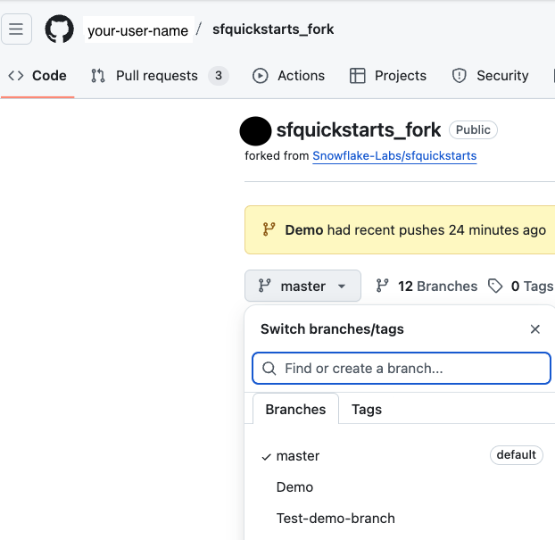
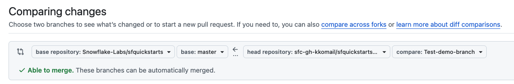

# Snowflake Guides

## What are Snowflake Guides?
Snowflake Guides serves as a collection of what previously were "Snowflake Quickstarts" and "Snowflake Solutions Center" along with some new additional types of content.  

Guides are interactive tutorials and self-serve demos written in markdown syntax. Guides provide a unique step-by-step reading experience and automatically saves tutorial progress for readers. These tutorials are published at: [https://www.snowflake.com/en/developers/guides/](https://www.snowflake.com/en/developers/guides/)

You can submit your own Guides to be published on Snowflake's website by submitting a pull request to this repo. This repository contains all the tools and documentation you’ll need for building, writing, and submitting your own Guide. 

## What You Should Know About Snowflake Guides

* Powerful and flexible authoring flow in Markdown text
* Ability to produce interactive web or markdown tutorials without writing any code
* Easy interactive previewing (using GitHub or Visual Studio Code preview feature)
* Support for anonymous use - ideal for public computers at developer events
* Looks great, with web implementation on snowflake.com
* Anchors to content to make it easy to scroll on a single page

> Please note that the DevRel team has a 24 business hour SLA for approving PRs. Please do not post in #devrel to notify the team of submissions or send DMs unless the 24 hours have passed. Please note there will be delays during US holidays.  

## Getting Started

### Prerequisites

  1. A GitHub account
  2. [Optional] A code editor (e.g. VS Code) if you choose to publish or make changes through your local environment

### Create a New Guide on GitHub.com
1. Fork this repository to your GitHub account (top right of webpage, `fork` button)
   > If you have already forked the repository, you can go to your branch and select 'sync fork' to update the repository
2. In your fork, select the 'site' folder on the home page -> Then select the 'sfguides/src' folder.
   > Ensure you are in your local branch and the path on your page is 'sfquickstarts/site/sfguides/src/'

3. Click "Add file" --> "Create new file" 
4. In the "Name your file" field, type your new folder name followed by a "/", then a file name inside it that ends in '.md'.
   Example: my-guide/my-guide.md  
   - Please ensure both of the folder name and the markdown file names match exactly (these are case sensitive)  
   - Please use hyphens,  no underscores  
   - Ensure your folder uses lower case alphabets and "Hyphens (-)" and not "Underscores(_)" in folder name  

5. Start authoring in markdown format using the template housed under site -> sfguides/src -> _markdown-template -> markdown-template.md. Select the 'preview' button at the top left to see a preview of your guide.
   - Required fields: language, category tags, id, author name, status (leave this as published)  
   - Optional Fields: summary, environments, feedback link, fork repo link, open in Snowflake
   Commit your changes in a branch and name it.  Example:  Test-demo-branch
   
6. To submit related assets with your guide, go back to your fork.  
   - You **DO NOT** need to request a merge to add additional files.  
   - In your fork, find your branch you just made in step 5.   

    

   
   - Create an 'assets/' subfolder under your existing guide folder and add a "readme.md" file as a placeholder so the folder is created. GitHub requires a file to be added to a folder to create it. 
    Example: my-guide/assets/readme.md
   - It is recommended not to create further sub-folders within 'assets'  
   - Please be mindful of image requirements noted [here](https://www.snowflake.com/en/developers/guides/get-started-with-guides/#formatting-considerations). Image size must be less than 1MB.  
   - You can add demo files and other .sql files in the "/assets" folder as well if needed.
**Separate Repos:** Instead of creating separate repos and requesting them to be public, your demo files and content can be placed in "/assets" folder where images are placed. Non image files can now be larger than 1MB as well.
> Note: Please review the [OSS Policy](https://lift.snowflake.com/lift?id=kb_article&table=kb_knowledge&sysparm_article=KB0013458&searchTerm=open%20source%20policy) to ensure you are in accordance with guidelines for demo data. Separate repos created for demos that need to be made public, will need to go through legal reviews outlined in the policy before the request is made to DevRel.
     
7. Select Commit your changes to the branch (same one you created in Step 5) and click "Compare & pull request" button on the top. 
8. On the next page, in the light gray box at the top of the page ensure 'base repository:' is set to 'base: Snowflake-Labs/sfquickstarts'.  The 'head repository:' should be set to your fork name and "compare:" should be set to your branch you created in Step 5.  Compare your changes made on your branch to the main repository. 

9. Update the name and optionally add a description to your request. Create the pull request.
    > Note: It is recommended to create a draft pull request, run all your checks, then mark as ready for review, so we know it's ready to merge immediately.

**Please Note:** 
All PRs have automated checks run against them. The checks assess for the following (please confirm these are met prior to submission): 
1. Categories are applied from the [approved list](https://www.snowflake.com/en/developers/guides/get-started-with-guides/#language-and-category-tags)

2. ID criteria (second line in template): id must exist, id must be separated by dashes, id must be lowercase, id must match the markdown file name (without .md extension), id must match the immediate folder name the file is in

3. Language tag must be populated (see [here](https://www.snowflake.com/en/developers/guides/get-started-with-guides/#language-and-category-tags) for the list) 

### Submit an Edit to an Existing Guide on GitHub.com
1. Fork this repository to your GitHub account (top right of webpage, `fork` button)
   > If you have already forked the repository, you can go to your branch and select 'sync fork' to update the repository before you start making changes.

2. In your fork, select the 'site' folder on the home page -> Then select the 'sfguides/src' folder.

3. In your fork, navigate to the folder for your guide.

4. In the folder, select the markdown (.md) file. Select the pencil icon in the top right to edit the markdown file. Make your edits directly in the file and select the 'preview' button at the top left to see a preview of your guide. 

5. Select 'Create a new branch for this commit and start a pull request.' Update the name of the of the branch

6. On the next page, in the light gray box at the top of the page update from 'base: master' to 'base: Snowflake-Labs/sfquickstarts' to compare your changes made on your branch to the main repository. 

7. Update the name and optionally add a description to your request. Create the pull request.
    > Note: It is recommended to create a draft pull request, run all your checks, then mark as ready for review, so we know it's ready to merge immediately.

Watch a demo [here](https://www.youtube.com/watch?v=yd9LXsvTSTU)

### OPTIONAL: Local Environment Setup and Updates

***Create a New Guide or Edit an Existing Guide Locally***

> Please note this is for advanced users who are familiar with using Github on their local environment
  
  1. Fork this repository to your personal GitHub account (top right of webpage, `fork` button)
  
  2. Clone your new fork `git clone git@github.com:<YOUR-USERNAME>/sfquickstarts.git sfquickstarts`
  
  3. Navigate to the directory `cd sfquickstarts/site/src`
  
  4. Create a new branch `git checkout -b <your-branch-name>` (make sure you are working on a new branch and not on `master`!) 
     If you need to synchronize your branch with your repo: `git push --set-upstream origin <your-branch-name>`
  
  6. Copy the template folder and rename it appropriately to create a new Guide: (e.g. `cp _markdown-template my-quickstart-name-here` in your terminal).
     or Browse to the Guide you wish to edit, click the directory and edit the existing files in the directory
 
  7. Start authoring in markdown format using the template housed under site -> sfguides/src -> _markdown-template -> [markdown-template](https://github.com/Snowflake-Labs/sfquickstarts/tree/master/site/sfguides/src/_markdown-template.md).
  
  8. Make sure you select the appropriate content type, industries, language and category tags from [the list in this Guide](https://www.snowflake.com/en/developers/guides/get-started-with-guides/#language-and-category-tags). You will not be able to merge your changes without this step!

### Best Practices  
 
- Review [Get Started with Guides](https://www.snowflake.com/en/developers/guides/get-started-with-guides/) to learn more about about the specifics.  It will give you details on formatting, layout, and requirements. 
  
- Guidance for labeling flow of the guide: Overview, Prerequisites, What You Will Build, What You Will Learn, What You Learned, Conclusion, Resources (e.g., links, docs, blogs, videos)

- Search the current Quickstarts repository to confirm you are not duplicating content that is already created (consolidate your content where possible)

- **Ctrl+Click** (Windows/Linux) or **Cmd+Click** (macOS) to open links in a new tab.  This is useful when following along instructions in a guide.

## Reporting issues in Guides

Guides are not in the scope of Snowflake Global Support. Please do not file support cases for issues or errata in a Guide. 

However, pull requests are welcome! If you encounter an issue in a Guide (outdated copy or data, typos, broken links, etc.), please submit a pull request and contribute to keeping our Guides up to date and awesome. 

Thank you for helping us maintain a high quality bar and consistency across all Snowflake Developer Guides!

## Resources:

- [How to Fork a Repo](https://youtu.be/ePRJHFXU6n4)
- [How to Edit a Guide](https://youtu.be/yd9LXsvTSTU)
- **Basic Guide with hands-on Instructions:** [Getting Started with Snowflake Intelligence](https://www.snowflake.com/en/developers/guides/getting-started-with-snowflake-intelligence/)
