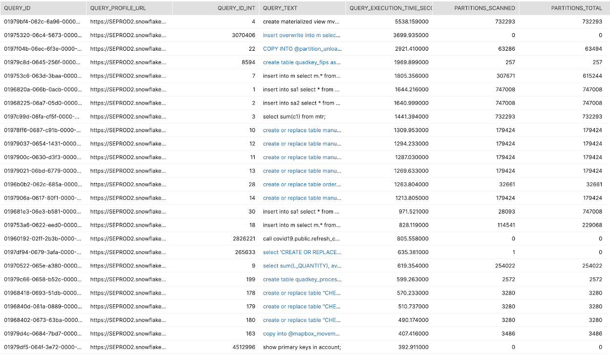
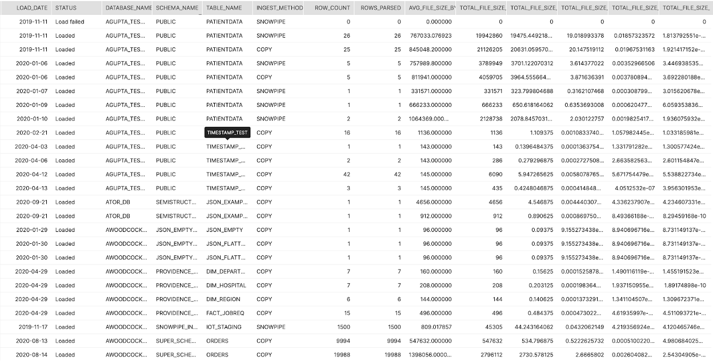
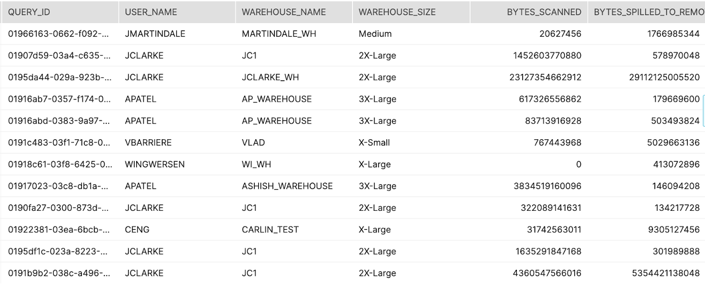

summary: This guide can be used to help customers setup and run queries pertaining to identifying areas where poor performance might be causing excess consumption, driven by a variety of factors.
id: resourceoptimization-performanceoptimization
categories: resource-optimization
environments: web
status: Published 
feedback link: https://github.com/Snowflake-Labs/devlabs/issues
tags: Resource Optimization, Cost Optimization, Performance, Optimization, Performance Optimization, Monitoring 
authors: Matt Meredith

#RO_05: Performance Optimization Guide to Resource Optimization

<!-- -------------->

##Introduction

The queries provided in this guide are intended to help you setup and run queries pertaining to identifying areas where poor performance might be causing excess consumption, driven by a variety of factors.

For information on the tiers designated to each query, please refer to the "Introduction to Snowflake Resource Optimization" Snowflake Guide.

##Long Running Queries (T1)
######Tier 1
####Description:
Identifies which queries have been the longest running over a specified time period.  
####How to Interpret Results:
Are there certain queries that are poorly constructed and lead to high compute costs due to longer run times?  How can we optimize?
####Primary Schema:
Account_Usage
####SQL
```sql
-- Longest running queries in the last 3 months
select
          
          QUERY_ID
         ,'https://'||CURRENT_ACCOUNT()||'.snowflakecomputing.com/console#/monitoring/queries/detail?queryId='||Q.QUERY_ID as QUERY_PROFILE_URL
         ,ROW_NUMBER() OVER(ORDER BY PARTITIONS_SCANNED DESC) as QUERY_ID_INT
         ,QUERY_TEXT
         ,TOTAL_ELAPSED_TIME/1000 AS QUERY_EXECUTION_TIME_SECONDS
         ,PARTITIONS_SCANNED
         ,PARTITIONS_TOTAL

from SNOWFLAKE.ACCOUNT_USAGE.QUERY_HISTORY Q
 where 1=1
    and TO_DATE(Q.START_TIME) >= DATEADD(month,-3,TO_DATE(CURRENT_TIMESTAMP()))
    and TOTAL_ELAPSED_TIME > 0 --only get queries that actually used compute
    and ERROR_CODE iS NULL
    and PARTITIONS_SCANNED is not null
   
  order by  TOTAL_ELAPSED_TIME desc
   
   LIMIT 50
   
   ;
```
####Screenshot


##Data Ingest with Snowpipe and "Copy" (T1)
######Tier 1
####Description:
This query returns an aggregated daily summary of all loads for each table in Snowflake showing average file size, total rows, total volume and the ingest method (copy or snowpipe)
####How to Interpret Results:
With this high-level information you can determine if file sizes are too small or too big for optimal ingest. If you can map the volume to credit consumption you can determine which tables are consuming more credits per TB loaded.
####Primary Schema:
Account_Usage
####SQL
```sql
SELECT 
  TO_DATE(LAST_LOAD_TIME) as LOAD_DATE
  ,STATUS
  ,TABLE_CATALOG_NAME as DATABASE_NAME
  ,TABLE_SCHEMA_NAME as SCHEMA_NAME
  ,TABLE_NAME
  ,CASE WHEN PIPE_NAME IS NULL THEN 'COPY' ELSE 'SNOWPIPE' END AS INGEST_METHOD
  ,SUM(ROW_COUNT) as ROW_COUNT
  ,SUM(ROW_PARSED) as ROWS_PARSED
  ,AVG(FILE_SIZE) as AVG_FILE_SIZE_BYTES
  ,SUM(FILE_SIZE) as TOTAL_FILE_SIZE_BYTES
  ,SUM(FILE_SIZE)/POWER(1024,1) as TOTAL_FILE_SIZE_KB
  ,SUM(FILE_SIZE)/POWER(1024,2) as TOTAL_FILE_SIZE_MB
  ,SUM(FILE_SIZE)/POWER(1024,3) as TOTAL_FILE_SIZE_GB
  ,SUM(FILE_SIZE)/POWER(1024,4) as TOTAL_FILE_SIZE_TB
FROM "SNOWFLAKE"."ACCOUNT_USAGE"."COPY_HISTORY"
GROUP BY 1,2,3,4,5,6
ORDER BY 3,4,5,1,2
;
```
####Screenshot


##Scale Up vs. Out (Size vs. Multi-cluster) (T2)
######Tier 2
####Description:
Two separate queries that list out the warehouses and times that could benefit from either a MCW setting OR scaling up to a larger size
####How to Interpret Results:
Use this list to determine reconfiguration of a warehouse and the times or users that are causing contention on the warehouse
####Primary Schema:
Account_Usage
####SQL
```sql
--LIST OF WAREHOUSES AND DAYS WHERE MCW COULD HAVE HELPED
SELECT TO_DATE(START_TIME) as DATE
,WAREHOUSE_NAME
,SUM(AVG_RUNNING) AS SUM_RUNNING
,SUM(AVG_QUEUED_LOAD) AS SUM_QUEUED
FROM "SNOWFLAKE"."ACCOUNT_USAGE"."WAREHOUSE_LOAD_HISTORY"
WHERE TO_DATE(START_TIME) >= DATEADD(month,-1,CURRENT_TIMESTAMP())
GROUP BY 1,2
HAVING SUM(AVG_QUEUED_LOAD) >0
;

--LIST OF WAREHOUSES AND QUERIES WHERE A LARGER WAREHOUSE WOULD HAVE HELPED WITH REMOTE SPILLING
SELECT QUERY_ID
,USER_NAME
,WAREHOUSE_NAME
,WAREHOUSE_SIZE
,BYTES_SCANNED
,BYTES_SPILLED_TO_REMOTE_STORAGE

FROM "SNOWFLAKE"."ACCOUNT_USAGE"."QUERY_HISTORY"
WHERE BYTES_SPILLED_TO_REMOTE_STORAGE > 0 
AND (
      BYTES_SPILLED_TO_REMOTE_STORAGE >= BYTES_SCANNED 
    OR BYTES_SPILLED_TO_REMOTE_STORAGE >= (100*POWER(1024,2))
     )--this is 100 MB )
;
```
####Screenshot




##Warehouse Cache Usage (T3)
######Tier 3
####Description:
Aggregate across all queries broken out by warehouses showing the percentage of data scanned from the warehouse cache.
####How to Interpret Results:
Look for warehouses that are used from querying/reporting and have a low percentage. This indicates that the warehouse is suspending too quickly
####Primary Schema:
Account_Usage
####SQL
```sql
SELECT WAREHOUSE_NAME
,COUNT(*) AS QUERY_COUNT
,SUM(BYTES_SCANNED) AS BYTES_SCANNED
,SUM(BYTES_SCANNED_FROM_CACHE) AS BYTES_SCANNED_FROM_CACHE
,SUM(BYTES_SCANNED_FROM_CACHE) / SUM(BYTES_SCANNED) AS PERCENT_SCANNED_FROM_CACHE
FROM (
      SELECT WAREHOUSE_NAME
      ,BYTES_SCANNED
      ,BYTES_SCANNED*PERCENTAGE_SCANNED_FROM_CACHE as BYTES_SCANNED_FROM_CACHE
      FROM "SNOWFLAKE"."ACCOUNT_USAGE"."QUERY_HISTORY"
      WHERE START_TIME >= dateadd(month,-1,current_timestamp())
      and bytes_scanned > 0
  ) A
GROUP BY 1
ORDER BY 5 
;
```

##Heavy Scanners (T3)
######Tier 3
####Description:
Ordered list of users that run queries that scan a lot of data.
####How to Interpret Results:
This is a potential opportunity to train the user or enable clustering.
####Primary Schema:
Account_Usage
####SQL
```sql
with  heavy_scanners as
(
      select user_name, warehouse_name, start_time::date query_date,
             avg(case when partitions_total > 0 then partitions_scanned / partitions_total else 0 end) avg_pct_scanned
      from   snowflake.account_usage.query_history
      where  start_time::date > dateadd('days', -45, current_date)
      group by 1, 2, 3
)
select user_name, warehouse_name, avg(avg_pct_scanned) avg_pct_scanned
from  heavy_scanners
group by 1, 2
order by 3 desc
;
```

##Full Table Scans by User (T3)
######Tier 3
####Description:
These queries are the list of users that run the most queries with near full table scans and then the list of the queries themselves
####How to Interpret Results:
This is a potential opportunity to train the user or enable clustering.
####Primary Schema:
Account_Usage
####SQL
```sql
--who are the users with the most (near) full table scans
SELECT USER_NAME
,COUNT(*) as COUNT_OF_QUERIES
FROM "SNOWFLAKE"."ACCOUNT_USAGE"."QUERY_HISTORY"
WHERE START_TIME >= dateadd(month,-1,current_timestamp())
AND PARTITIONS_SCANNED > (PARTITIONS_TOTAL*0.95)
AND QUERY_TYPE NOT LIKE 'CREATE%'
group by 1
order by 2 desc;

-- This gives all queries in the last month with nearly a full table scan :) > 95%, ordered by the worst offending
SELECT * 
FROM "SNOWFLAKE"."ACCOUNT_USAGE"."QUERY_HISTORY"
WHERE START_TIME >= dateadd(month,-1,current_timestamp())
AND PARTITIONS_SCANNED > (PARTITIONS_TOTAL*0.95)
AND QUERY_TYPE NOT LIKE 'CREATE%'
ORDER BY PARTITIONS_SCANNED DESC
;
```


##Top 10 Spillers Remote (T3)
######Tier 3
####Description:
Identifies the top 10 worst offending queries in terms of bytes spilled to remote storage
####How to Interpret Results:
These queries should most likely be run on larger warehouses that have more local storage and memory.
####Primary Schema:
Account_Usage
####SQL
```sql
select query_id, substr(query_text, 1, 50) partial_query_text, user_name, warehouse_name, warehouse_size, 
       BYTES_SPILLED_TO_REMOTE_STORAGE, start_time, end_time, total_elapsed_time/1000 total_elapsed_time
from   snowflake.account_usage.query_history
where  start_time::date > dateadd('days', -45, current_date)
order  by BYTES_SPILLED_TO_REMOTE_STORAGE desc
limit 10
;
```

##AutoClustering History & 7-Day Average (T3)
######Tier 3
####Description:
Average daily credits consumed by Auto-Clustering grouped by week over the last year.
####How to Interpret Results:
Look for anomolies in the daily average over the course of the year. Opportunity to investigate the spikes or changes in consumption
####Primary Schema:
Account_Usage
####SQL
```sql
WITH CREDITS_BY_DAY AS (
SELECT TO_DATE(START_TIME) as DATE
,SUM(CREDITS_USED) as CREDITS_USED


FROM "SNOWFLAKE"."ACCOUNT_USAGE"."AUTOMATIC_CLUSTERING_HISTORY"

WHERE START_TIME >= dateadd(year,-1,current_timestamp()) 
GROUP BY 1
ORDER BY 2 DESC 
  )
  
SELECT DATE_TRUNC('week',DATE)
,AVG(CREDITS_USED) as AVG_DAILY_CREDITS
FROM CREDITS_BY_DAY
GROUP BY 1
ORDER BY 1
;
```

##Materialized Views History & 7-Day Average (T3)
######Tier 3 
####Description:
Average daily credits consumed by Materialized Views grouped by week over the last year.
####How to Interpret Results:
Look for anomolies in the daily average over the course of the year. Opportunity to investigate the spikes or changes in consumption
####Primary Schema:
Account_Usage
####SQL
```sql
WITH CREDITS_BY_DAY AS (
SELECT TO_DATE(START_TIME) as DATE
,SUM(CREDITS_USED) as CREDITS_USED


FROM "SNOWFLAKE"."ACCOUNT_USAGE"."MATERIALIZED_VIEW_REFRESH_HISTORY"

WHERE START_TIME >= dateadd(year,-1,current_timestamp()) 
GROUP BY 1
ORDER BY 2 DESC 
  )
  
SELECT DATE_TRUNC('week',DATE)
,AVG(CREDITS_USED) as AVG_DAILY_CREDITS
FROM CREDITS_BY_DAY
GROUP BY 1
ORDER BY 1
;
```

##Search Optimization History & 7-Day Average (T3)
######Tier 3
####Description:
Average daily credits consumed by Search Optimization grouped by week over the last year.
####How to Interpret Results:
Look for anomolies in the daily average over the course of the year. Opportunity to investigate the spikes or changes in consumption.
####Primary Schema:
Account_Usage
####SQL
```sql
WITH CREDITS_BY_DAY AS (
SELECT TO_DATE(START_TIME) as DATE
,SUM(CREDITS_USED) as CREDITS_USED


FROM "SNOWFLAKE"."ACCOUNT_USAGE"."SEARCH_OPTIMIZATION_HISTORY"

WHERE START_TIME >= dateadd(year,-1,current_timestamp()) 
GROUP BY 1
ORDER BY 2 DESC 
  )
  
SELECT DATE_TRUNC('week',DATE)
,AVG(CREDITS_USED) as AVG_DAILY_CREDITS
FROM CREDITS_BY_DAY
GROUP BY 1
ORDER BY 1
;
```

##Snowpipe History & 7-Day Average (T3)
######Tier 3
####Description:
Average daily credits consumed by Snowpipe grouped by week over the last year.
####How to Interpret Results:
Look for anomolies in the daily average over the course of the year. Opportunity to investigate the spikes or changes in consumption.
####Primary Schema:
Account_Usage
####SQL
```sql
WITH CREDITS_BY_DAY AS (
SELECT TO_DATE(START_TIME) as DATE
,SUM(CREDITS_USED) as CREDITS_USED


FROM "SNOWFLAKE"."ACCOUNT_USAGE"."PIPE_USAGE_HISTORY"

WHERE START_TIME >= dateadd(year,-1,current_timestamp()) 
GROUP BY 1
ORDER BY 2 DESC 
  )
  
SELECT DATE_TRUNC('week',DATE)
,AVG(CREDITS_USED) as AVG_DAILY_CREDITS
FROM CREDITS_BY_DAY
GROUP BY 1
ORDER BY 1
;
```