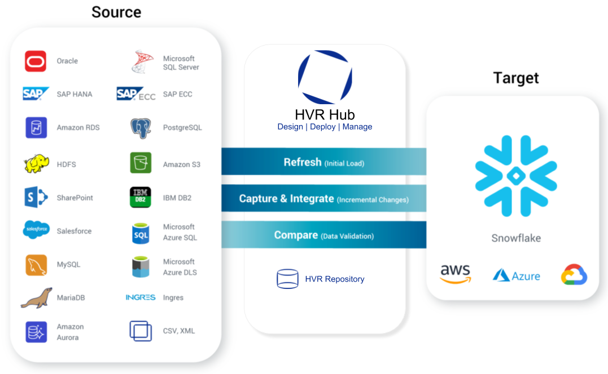
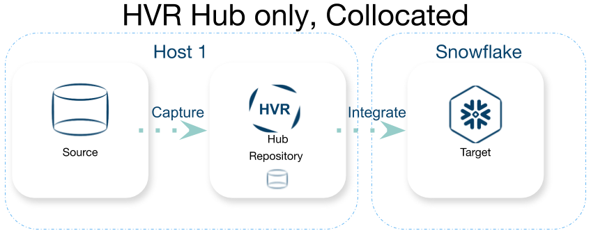
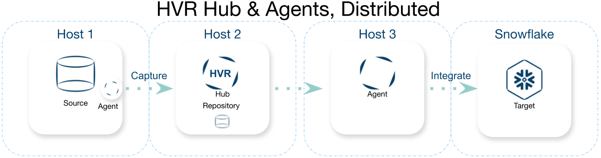
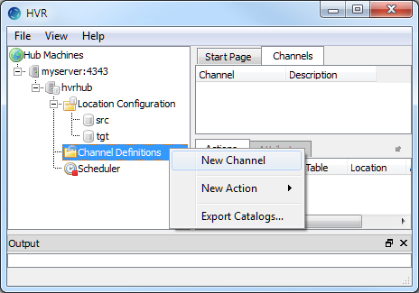
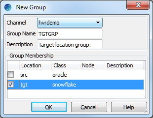
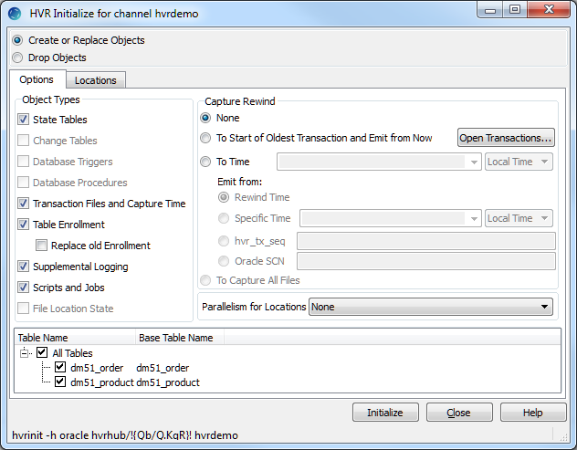
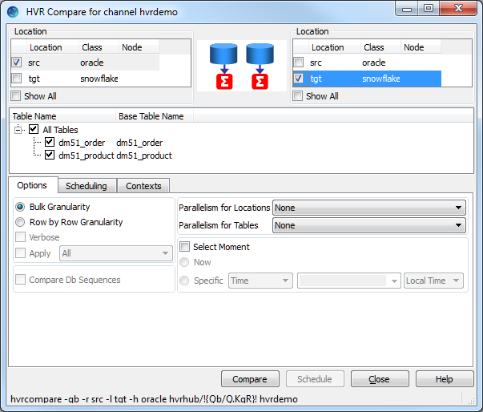

summary: Real-Time data capture with HVR
id: ingestion_real_time_cdc_with_hvr
categories: patterns
tags: patterns, ingestion, hvr
status: Published
# REAL-TIME DATA CAPTURE WITH HVR

## PATTERN SUMMARY

HVR provides log based change data capture (CDC) rich replication from many sources to Snowflake. This includes
capturing inserts, updates, and deletes as well as bulk data loads, data
coercion and enrichment, error handling, queuing, metadata changes, and
more. HVR has both the ability to do the initial data load and ongoing
replication of data.

This pattern provides advice on when HVR is an
appropriate solution

## WHEN TO USE THIS PATTERN

This pattern should be used when data needs to be
extracted, in near real time, from its source in a traditional RDBMSs,
including but not limited to SAP ECC pooled and clustered tables, (bsec,
bseg, etc.) and loading into Snowflake. 

## PATTERN DETAILS

To replicate data with HVR the following steps must be
considered and implemented:

1.  Deployment of HVR hub and agents
2.  Configuration of Locations and Channels
3.  Job initialization and Scheduling
4.  Initial data load and location
    synchronization
5.  Data verification

## STEP 1: Deployment of HVR hub and agents

HVR requires the deployment of a hub system.
Additionally, users have the option of deploying agents. The hub can be
deployed in the following ways:

-   Bare Metal or Virtualized
-   On premises or in the cloud
-   On the source or alone
-   On Linux, Windows, Mac, Solaris(sparc or x64), or AIX(Power)  
    [Full list of supported platforms](https://www.hvr-software.com/docs/introduction/platform-compatibility-matrix)

Deciding where and how to deploy is largely based on
what resources are available and what the customer is most comfortable
with. This includes what OS, on premises or in the cloud, and
virtualized or not. Deciding where to install the hub should include the
following:

-   Is the source located on a supported platform where
    additional software can be installed?
-   How many source locations are there?

All data passes through the hub. 

To utilize log-based CDC on a source either an agent or a hub must be
deployed on the same host. This allows HVR to quickly and efficiently
capture changes to the data. All communication between an agent and the
hub can be encrypted and compressed (10x on average). Using agents distributes
the load and can allow for scaling of data loads into target locations.
Performance increases can be seen when deploying an agent in the same
network/ VPC as the source or target even when not deployed on the same
host.

An HVR hub requires an RDBMS to store its repository of configuration
and state information. [Full list of supported RDBMS for hub repository](https://www.hvr-software.com/docs/capabilities#Capabilities-HubDatabase). A source or target RDBMS can be used for this repository if
it is convenient. This database only stores configurations and state
information, none of the data being replicated is stored here.

Client libraries are also required for connecting to
locations. For example, to connect to Snowflake the Snowflake ODBC
drivers must be installed on the host connecting to
Snowflake.

## STEP 2: Configuration of Locations and Channels

### Locations

HVR is unique in that its locations are not associated
directly as a source or target. Locations are defined generically with
the required connection information and not identified as a source or
target till a channel is defined. Locations can be used in multiple
channels and can be a source in one and a target in another.

The first thing to configure in HVR are the locations of sources and
targets. For this pattern the target is always Snowflake. It can be
configured by defining the Snowflake server, port, role, warehouse,
database, schema, username, and password. Each type of source requires
different [connection information](https://www.hvr-software.com/docs/location-class-requirements)

### Channels

A Channel in HVR can be thought of as a path that data
travels. Data that has the same sources, targets, and replication
configurations can be configured in a single channel. Typically, these
are defined by application borders. For example, you could define a
channel that gets financial data from several sources and delivers them
all to Snowflake for financial analytics. 

A channel is made up of 3 main components: Location
Groups, Tables, and Actions

#### Location Groups

Location Groups are defined as a group of locations
from the location definition. Most channels will have two groups
defined, a source and a target. This makes it possible to add and remove
locations from the group with little effort or reconfiguration. Location
groups also separate the location definition from the channel allowing
you to configure or update the location once and all channels that use
that location automatically pick up the changes.

#### Tables

Once location groups are configured you must identify
the tables that are to be replicated. HVR allows this to be done
interactively in the GUI by connecting to the RDBMS and reading metadata
about the tables in the defined schema or via a formatted file and a
command line tool. Once the tables are identified HVR will write
metadata about the tables in the repository. This includes column names,
data types, keys, etc.

#### Actions

Actions define how the data is to be captured from the source and how it
will be integrated into the target. Most channels will require at least
one capture action and one integrate action. Other actions include
ColumnProperties, TableProperties, CollisionDetect, Transform, etc.
 [Full list of actions](https://www.hvr-software.com/docs/actions)

## STEP 3: Job Initialization and Scheduling

Once a channel is defined and after any changes to said
channel definition it must then be initialized. Initialization creates
jobs that capture from the source and integrate data into the target.
These jobs can run on the hub or on the agent depending on location
definitions. This distribution of jobs allows the work to be distributed
for performance.

Jobs can be run continuously or on a schedule. HVR
includes a scheduler service that manages this as well as retrying jobs
in the event of failures. Capture and Integrate jobs will usually run
continuously.

## STEP 4: Initial Data Load and Location Synchronization

When replicating data in near real time, an initial
data load is used to synchronize both the source and target to a point
in time. HVR does this with a Refresh job. A refresh can be run
interactively or scheduled and can be used for an initial data load or
to synchronize a source and target to fix errors. This refresh will
utilize the channel definition including the location groups and actions
to perform on the data. 

## STEP 5: Data Verification

Finally, HVR has the ability to compare the data in the source and
target system to verify that they are in sync or to identify the
differences and correct them. This feature can compare data at the table
or row level. The compare utilizes a hash either at the table or row
level and takes into account actions defined in the channel definition.

## PATTERN EXAMPLE

### STEP 1: Deployment of HVR hub and agents

#### Installation of HVR

[Install and configure HVR Hub on Host 1 and Agent on Oracle RDBMS
Host](https://www.hvr-software.com/docs/installing-and-upgrading-hvr)

#### Configure Encryption

[Configure Encryption between Hub and Agent](https://www.hvr-software.com/docs/configuring-hvr/encrypted-network-connection)

#### Install Client tools

Install and configure clients for sources and targets:
[Snowflake Client](https://www.hvr-software.com/docs/location-class-requirements/requirements-for-snowflake#RequirementsforSnowflake-ODBCConnection)

#### Configure Source for CDC

Verify your source RDBMS is configured with supplemental logging. 
[For Oracle use the following](https://www.hvr-software.com/docs/location-class-requirements/requirements-for-oracle#RequirementsforOracle-SupplementalLogging)

### STEP 2: Configuration of Locations and Channels

#### Setup Locations in HVR’s Location Configuration:

HVR needs to know how to connect to all locations
included in replication

Oracle Location (Source):

1.  In the navigation tree pane, right–click 
    **Location Configuration ▶ New Location**
2.  Enter **Location** name and **Description** for the
    location.
3.  Point the connection to the local HVR Agent running
    on the Source machine
    1.  Click ‘Connect to HVR on remote machine’
    2.  Enter the Node – Ip Address or fully qualified
        hostname
    3.  Chose the Port – 4343
    4.  Specify the HVR OS Username and Password
4.  Select Oracle in **Class**.
5.  Provide Database Connection details.
    For more information on Database
    Connection fields, see section [Location Configuration](https://www.hvr-software.com/docs/Requirements_for_Oracle#Location_Configuration)
    1.  Enter directory path for **ORACLE\_HOME**. You can also
        click browse to select the directory path.
    2.  Enter Oracle System ID in **ORACLE\_SID** or **TNS** credential or **RAC** credential.
    3.  Enter user name of schema in User. For
        example, **sourcedb**
    4.  Enter password for schema in Password.
        For example, **hvr**
6.  Click **Test Connection** to verify the connection to the location
    database.
7.  Click **OK**.

Snowflake Location (Target):

1.  In the navigation tree pane, right–click **Location Configuration ▶ New Location**
2.  Enter **Location** name and **Description** for the location.
3.  Select **Snowflake** in **Class**.
4.  Provide **Database Connection** details.
    For more information on Database
    Connection fields, see section [Location Configuration](https://www.hvr-software.com/docs/location-class-requirements/requirements-for-snowflake)
    Enter the following information
    1.  Your Snowflake account URL in “Server”
    2.  Port number for your Snowflake account (Default
        is 443)
    3.  Role (For required grants see [Grants for Integrate and Refresh Target](https://www.hvr-software.com/docs/location-class-requirements/requirements-for-snowflake%23RequirementsforSnowflake-GrantsforIntegrateandRefreshTarget)
    4.  Warehouse
    5.  Database
    6.  Schema
    7.  Username 
    8.  Password
5.  Click **Test Connection** to verify the connection to the location
    database.
6.  Click **OK**

#### Create HVR Channel

HVR uses Channels to define which locations are the
Source and Target, how the data is captures from the Source, and how the
data is integrated into the Target

1.  In the navigation tree pane, right–click **Channel Definitions ▶ New Channel**
2.  Enter **Channel** name and **Description** for the channel in the **New Channel** dialog.

#### Create HVR Location Groups

How to create location groups in a channel. The
location groups are used for defining action on the location. Typically,
a channel contains two location groups - one for the source location and
one for the target location. Each location group can contain multiple
locations.

In this example, create one source location group (**SOURCE**) and one target location group (**TARGET**).

1.  In the navigation tree pane, click + next
    to the channel (**hvrdemo**).
2.  Create source location group (**SOURCE**):
    1.  Right–click **Location Groups ▶ New
        Group**
    2.  Enter **Group Name** and **Description** for the location
        group.
    3.  Select source location (**src**) from **Group Membership**.
    4.  Click **OK**
3.  Create target location group (**TARGET**):
    1.  Right–click **Location Groups ▶ New
        Group**.
    2.  Enter **Group Name **and **Description** for the location
        group.
    3.  Select target location (**tgt**) from **Group Membership**.
    4.  Click **OK**

#### Select tables to replication

The tables that are to be replicated must be added to
HVR. This can be done via the GUI or through a file. You do not have to
use both methods.

##### Through the GUI:

How to select the tables from source location for replication. Table Explore allows you to
select schema(s) and/or table(s) for replication.

1.  Right–click Tables ▶ Table
    Explore.
2.  Select source location (src) from the list.
3.  Click Connect.
4.  Select tables from Table
    Explore dialog. Press Shift key to
    select multiple tables or Ctrl+A to select
    all tables.
5.  Click Add to add the selected tables.
6.  Click OK in HVR
    Table Name dialog.
7.  Click Close in Table Explore dialog.

##### Through a file:

How to select the tables from source location for replication. HVRAdapt command with a text
file.

1.  Create a flat file and place it on the HVR Hub  
    SCHEMA.TABLE  
    SCHEMA.TABLE  
    …
2.  Run the HVRAdapt command
    Note: `&lt;connection string&gt;` can be copied from the HVR
    Initialize Dialog box.  
    Command:  
    `hvradapt -n &lt;filename&gt; -l &lt;location name&gt; -h &lt;connection string&gt;`

##### Add SAP Pooled and Clustered Tables

To have HVR unpack SAP pooled and clustered tables 
(**bsec** and **bseg**) from source location for replication do the
following.

In this example, when the Table Explore is performed with SAP Dictionaries selected, the SAP Transform Engine displays both the packed
and unpacked tables.

1.  Right–click Tables ▶ Table Explore.
2.  Select source location (src) from the list.
3.  Select SAP Dictionaries.
4.  Enter SAP schema name in Schema if the SAP
    Dictionary tables are in different schema.
5.  Because the SAP database has large number of tables, it is
    recommended to use the table Filter. To
    filter the tables,

1.  Click Edit.
2.  Double-click &lt;Add Pattern&gt; in the
    Table Filter dialog.
3.  Enter the pattern. For example, bsec and
    bseg.
4.  Click OK.

1.  Click Connect.
2.  Select the unpacked tables from Table
    Explore dialog. Press Shift key to
    select multiple tables or Ctrl+A to select
    all tables.

### Define Actions

Actions tell HVR where and how to capture and integrate
data.

How to define [Actions](https://www.hvr-software.com/docs/Action_Reference) on
the location groups (SOURCE and TARGET). Actions define the behavior
of a replication activity.

1.  Define action [Capture](https://www.hvr-software.com/docs/Capture) to capture changes from all tables in the source
    location group.
      1.  For Non-SAP Source
          1.  Right–click source location group SOURCE ▶ New
              Action ▶ Capture.
          2.  Click OK
      2.  For SAP Source
          1.  Define a Capture
              1.  Right–click source location group SOURCE ▶ New
                  Action ▶ Capture.
              2.  Set Table to exclude packed tables
              3.  Click OK
          2.  Define a Transform
              1.  Right-click target location group TARGET ▶ New
                  Action ▶ Transform
              2.  Set Table to include only packed tables
              3.  Select /SAPXForm and /ExecOnHub
              4.  Click OK
          3.  Define action [Integrate](https://www.hvr-software.com/docs/Integrate)
              1.  Right–click target location group TARGET ▶ New
                  Action ▶ Integrate.
              2.  Select Integrate Action /Burst
              3.  Click OK.

### STEP 3: Job Initialization and Scheduling

Before replication can take place, HVR must assemble
and deploy scripts and jobs. This is done via HVR Initialize. Any time
changes are made to a channel HVR must be Initialized.

[HVR Initialize](https://www.hvr-software.com/docs/Hvrinit)
first
checks the channel and creates replication jobs in the [HVR Scheduler](https://www.hvr-software.com/docs/commands/hvrscheduler)

In this example, HVR Initialize creates one capture job and one integrate job.

1.  Right click on Channel Name select HVR
    Initialize. 
2.  Click Initialize

### Start Capturing changes and perform initial data load

HVR has been configured to capture changes from the
source, extract packed tables from SAP, and integrate them into
Snowflake.

#### Start Capture

The Capture job needs to be started before we do the initial data
load so we can capture changes that happen while we run the
initial data load.

1.  Left click on the + sign next to the Scheduler at
    the bottom of the HVR Hub Tree
2.  Find the job with \*-cap-\* in its name, Right
    click and select Start

### STEP 4: Initial Data Load and Location Synchronization

#### Initial data load

Before integrating inserts, updates, and deletes from
the source system to the target system an initial data load is required.
HVR calls this initial data load HVR Refresh.

To get the target system in sync with the source system
we must run a Refresh.

1.  Right click on the name of the channel we created,
    Select HVR Refresh
    1.  Select All Tables if not already selected.
    2.  Click Refresh

#### Start replicating data from Source to Target

With the initial data loaded and the capture job
collecting new data from the source we need to begin integrating that
data into the target. This is done by an integrate job that was created
during HVR Initialize. 

1.  Left click on the + sign next to the Scheduler at
    the bottom of the HVR Hub Tree
2.  Find the job with \*-integ-\* in its name, Right
    click and select Start

Changes will now be captured on the source, expanded,
and integrated into the target.

### STEP 5: Data Verification

If verification of data loads or continuous replication
is needed an HVR Compare can be executed to confirm everything is in
sync.

1.  Left click on the name of the channel we created
    and select HVR Compare
2.  Select the source and target tables that you want
    to Compare
3.  Select if you want a Bulk or Row by Row
    compare
4.  Click compare

The output will verify that the tables are in sync or
will call out how they are different. With a row by row compare, HVR can
tell you exactly what rows are different, and if Verbose SQL is selected
exactly what SQL needs to be run on the target to get it back in sync
with the source.

## GUIDANCE

### MISAPPLICATIONS TO AVOID

None known at time of publication

### INCOMPATIBILITIES

HVR does not currently support Snowflake data type
VARIANT, OBJECT, and ARRAY

### OTHER IMPLICATIONS

None known at time of publication

### DESIGN PRINCIPLES & BENEFITS ENABLED BY THIS PATTERN

This Pattern unlocks critical business data from proprietary encoded
tables in SAP and delivers it to
Snowflake. This enables analytics to run against real time
data.

HVR is unique in its ability to extract data from SAP
ECC pooled and clustered tables as well as capture directly from the
logs of SAP ECC and SAP HANA DBMS. Additionally, HVR can verify that
data is in sync and allow for easy evolution of source and target
systems without having to reimplement.

With HVR it is easy to add additional source including
many traditional RDBMSs (Oracle, MSSQL, MySQL, etc.), file systems
(local, S3, etc.), and cloud platforms. Because of HVRs use of a
centralized hub and agent architecture, you can configure many sources
to deliver data into Snowflake without requiring multiple hub
installations. Adding more sources is as simple as adding location for
them and defining how you want the data to flow.

## RELATED RESOURCES

The following related information is available.

Partner Documentation:
- [HVR Documentation](https://www.hvr-software.com/docs/)
