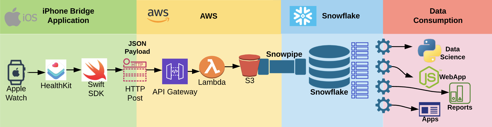
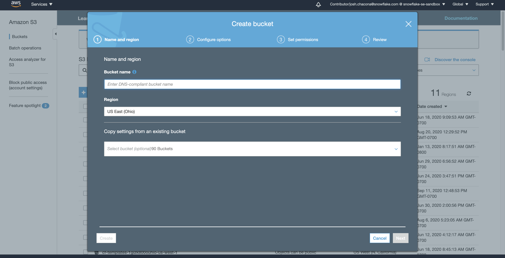
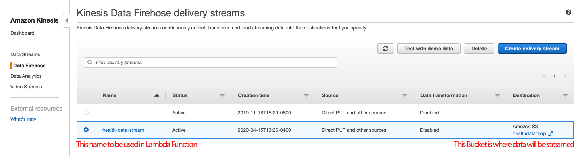
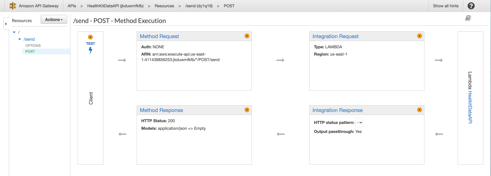
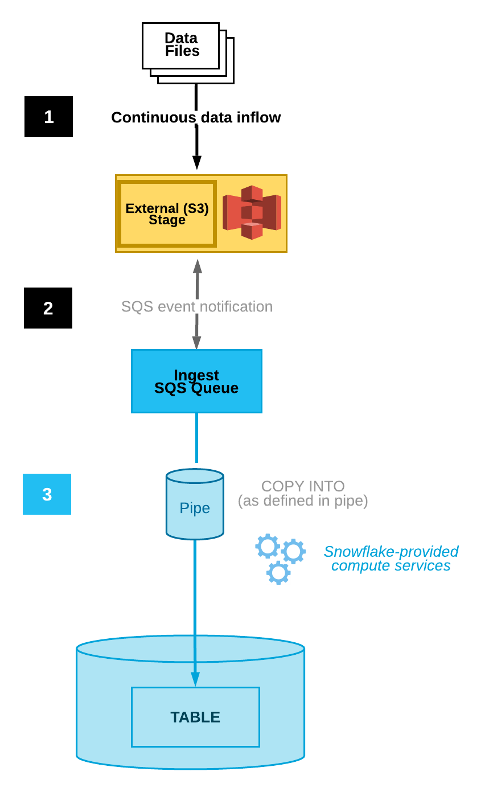
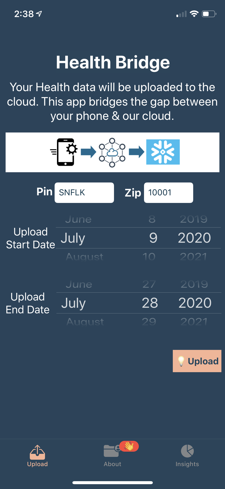

summary: Building a data application with Snowflake as the backend
id: iosapp
categories: Data Applications
tags: medium
status: Published 
Feedback Link: https://developers.snowflake.com

# Using Snowflake to process iOS Health Data
<!-- ------------------------ -->
## Overview 
Duration: 1

Our phones collect a lot of health data which has a lot of potential uses. IOS healthkit SDK makes it possible for app developers to tie into the iPhone and offers a centralized data repo for health data. The same SDK makes it possible to pull data from this central repository. The possible data points are documented on apple's healthkit docs. In short, apples are capturing body measurements, vital signs, lab and test results, nutrition, physical activity, etc.

The bridge application serves the purpose to read this data set and through an HTTP post call sent it AWS. This application is open to all and makes it easy to pull datasets and requires users permission on which data sets to pull.

The users are asked to provide permission for the bridge application to pull the following information, if available.

### What You’ll Learn 
- How to pull data from iOS using Swift
- How to process that data in AWS S3
- Ingest that data using Snowpipe into Snowflake. 
- Report that data back to your iOS application.

### Prereqiusites

- Snowflake account with ACCOUNTADMIN access
- AWS account with admin access to IAM, Lambda, API Gateway, and S3
- iOS operating system (with xCode) 


### Data Pipeline 



#### Note: This is an advanced lab that requires some experience using the AWS services mentioned.

### HTTP Post
The iOS bridge application is to send the data to AWS API Gateway through an HTTP post call. This HTTP post call is formatted in JSON and contains all the information that the user gives permission to pull above.

### AWS Cloud Infrastructure
AWS is the cloud provider of choice to provide the cloud scale. This is of personal preference Azure & GCP can be used all the same.

### API Gateway
When a user uses the iPhone bridge application, the app will make an HTTP post call. This post call needs to be handled somewhere and API Gateway is the receiver of this information. Once the API gateway receives this information it will need to pass it along to Lambda to do something with the data.

For those new to API Gateway, please review this [AWS tutorial](https://docs.aws.amazon.com/lambda/latest/dg/services-apigateway-tutorial.html) to get familiar with the service.

### Lambda
Lambda offers immediate and scalable infrastructure to do something with data once API Gateway passes the information to a specific Lambda function. This Lambda function is given access to S3 and with that permission it takes the JSON and saves it to S3 bucket for Snowpipe to ingest.

### S3
Serves as a persistent data store from Lambda for Swipe to ingest.

### Snowflake
Snowflake is the perfect environment for this data set offering a fully scalable database that is able to effectively the JSON data incoming from the source system (IOS Healthkit). Bringing structure and data availability.

### Snowpipe
Snowpipe is used to ingest data once it reaches the S3 environment in AWS. Usually the lag time of this data set is two minutes, but depends on when the SNS/SQS messaging alerts Snowpipe of the file PUT drop.

### Snowflake
The data is saved in its original JSON format in Snowflake and through SQL is provided structure to data consumption tools.

<!-- ------------------------ -->
## Application Source Code
Duration: 2

### Download or Clone the GitHub Repo 
We will modify the  several elements of the code in order for the app run in your development environment, use your AWS infrastructure, and connect to your Snowfalke account.

[SnowHealth GitHub Repo](https://github.com/mariusndini/snowhealth)

<!-- ------------------------ -->

## Create Snowflake Objects

Duration: 15

Running the [SQL scripts](https://github.com/mariusndini/snowhealth/tree/master/SQLs) within Snowflake to create the perform the following:
- Schemas and Tables for storing the data
- Stored Procedure that will be executed consume the data 


<!-- ------------------------ -->

## Configure AWS for Data Ingestion

Duration: 15

When a user uses the iPhone bridge application, the app will make an HTTP post call. This post call needs to be handled somewhere and API Gateway is the receiver of this information. Once the API gateway receives this information it will need to pass it along to Lambda to do something with the data.

### Create an S3 Bucket
In your AWS account, create an S3 bucket with a name unique to your project.



### Kinesis Firehose
Amazon Kinesis Data Firehose is the easiest way to reliably load streaming data into data lakes, data stores, and analytics services. It can capture, transform, and deliver streaming data to Amazon S3.

Create a Kinesis stream according the the image below. 
- The name should be health-data-stream
- Use the name of the S3 bucket you created in the previous step.




### Configure and deploy Lambda Function for Kinesis 

In the [snowhealth/Lambda Func/kinesis route/index.js](https://github.com/mariusndini/snowhealth/blob/master/Lambda%20Func/kinesis%20route/index.js) file, update the UserPoolId and ClientId with those of your kinesis stream .
```javascript
 var config = {
    "amazon":{
    "UserPoolId": "xxx",
        "ClientId": "xxx"
    },
    "kinesis":{
        "region": "us-east-1",
        "apiVersion": "2015-08-04"
    }
}

const AWS = require('aws-sdk');
var kinesis = new AWS.Firehose(config.kinesis);

exports.handler = async (event) => {
    var json = JSON.stringify(event.body);
    
    kinesis.putRecord({
	Record:{Data: json},
        DeliveryStreamName: 'health-data-stream' //NEED TO PROVIDE EXISTING STREAM FOR DATA TO BE ROUTED
    }, function(err, data) {
        if (err) {
            console.error(err);
        }
        console.log(data);
    });
    
};
```

### API Gateway - Kinesis Route Lambda Function
Configure an API Gateway for your Kinesis Route lambda as indicated below.


### Configure and Deploy Your HealkitDataAPI Lambda Function
Update the file: [snowhealth/Lambda Func/Snowflake connect/HealkitDataAPI/config.json](https://github.com/mariusndini/snowhealth/blob/master/Lambda%20Func/Snowflake%20connect/HealkitDataAPI/config.json) to include the Snowflake credentials needed for the application:

```javascript
{
    "snowflake":{
        "account":"YOUR ACCOUNT",
        "username":"YOUR USER",
        "password":"USER PW",
        "warehouse":"WH TO RUN QUERIES",
        "database":"YOUR DB NAME",
        "role":"ROLE W/ ACCESS TO ABOVE"
    }
}
 ```


### API Gateway - HealkitDataAPI Lambda Function 
Configure an API Gateway for your Kinesis Route lambda as indicated below.





<!-- ------------------------ -->

## Configuring Snowpipe

Duration: 10

### Prerequisite
Before setting up Snowpipe for autoingesting, create a secure storage integration between your S3 bucket and Snowflake:
- [Creating a secure storage integration between Snowflake and S3](https://docs.snowflake.com/en/user-guide/data-load-snowpipe-auto-s3.html#step-1-configure-access-permissions-for-the-s3-bucket)


### Snowpipe
Snowpipe is used to ingest data once it reaches the S3 environment in AWS. Usually the lag time of this data set is two minutes, but depends on when the SNS/SQS messaging alerts Snowpipe of the file PUT drop. 



Creating a pipe is simple and straightforward.

```javascript
create pipe snowpipe_db.public.mypipe auto_ingest=true as
  copy into snowpipe_db.public.mytable
  from @snowpipe_db.public.mystage
  file_format = (type = 'JSON');
 ```

### SQS Notification
The most common option for triggering Snowpipe data loads automatically using Amazon SQS (Simple Queue Service)notifications for an S3 bucket.

Execute the SHOW PIPES command in Snowflake:

```javascript
show pipes;
 ```

Note the ARN of the SQS queue for the stage in the notification_channel column. Copy the ARN to a convenient location.

Log into the Amazon S3 console. Configure an event notification for your S3 bucket using the instructions provided in the [Amazon S3 documentation](https://docs.aws.amazon.com/AmazonS3/latest/user-guide/enable-event-notifications.html). Complete the fields as follows:

- Name: Name of the event notification (e.g. Auto-ingest Snowflake).
- Events: Select the ObjectCreate (All) option.
- Send to: Select SQS Queue from the dropdown list.
- SQS: Select Add SQS queue ARN from the dropdown list.
- SQS queue ARN: Paste the SQS queue name from the SHOW PIPES output.
- Upload and deploy your lamba function via the AWS console or through [Serverless](https://www.serverless.com/blog/serverless-express-rest-api)


<!-- ------------------------ -->
## Running SnowHealth in your dev environment 

Duration: 10

Make the following changes in the xcode package provided:

 In the DataSend.swift file, update the https endpoint using your API Gateway endpoint you create in the previous steps to send data to your Kinesis Firehose topic.


Your app should now be ready to build and run!





 

