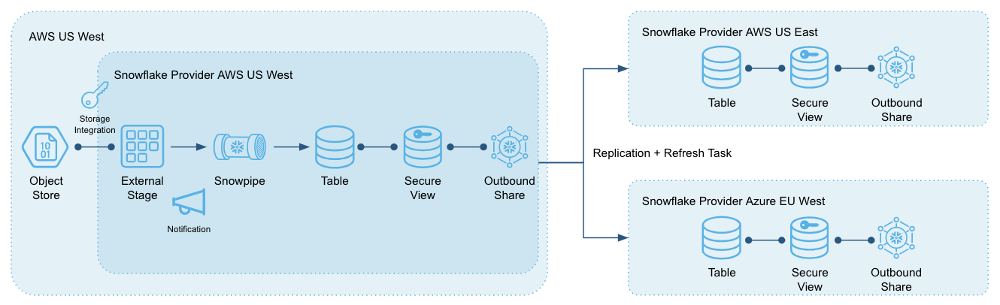
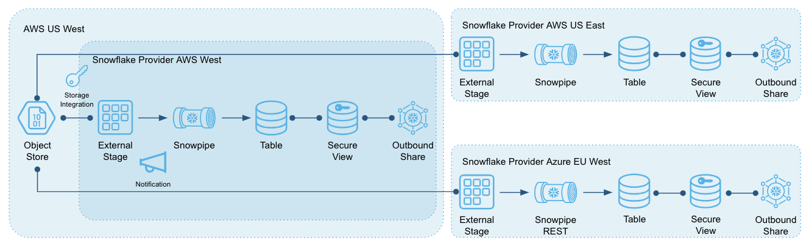
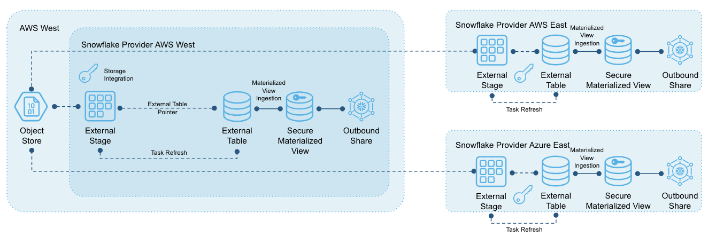

summary: Marketplace Provider Accelerator Approach 1
id: marketplace_provider_accelerator_approach_1
categories: Data Exchange
tags: medium
status: Published 
Feedback Link: https://developers.snowflake.com

# Marketplace Provider Accelerator Approach 1
<!-- ------------------------ -->
## Overview 
Duration: 1

This accelerator contains code that can be used as templates or full automation to build the end-to-end workflow for listing data on the Snowflake Marketplace or in a private Exchange. There are multiple approaches to doing this, depending on where your data already exists as a provider. These approaches are listed below.

- Approach 1 (direct-load-from-object-store: this guide) - use this approach when your data already exists in cloud object store and you are comfortable loading that data into Snowflake using traditional loading methods. This method works best when the consumer experience is consistent customer to customer and region to region. 
- Approach 2 (external-tables: [link](../marketplace_provider_accelerator_approach_2)) - use this approach when you'd rather "point" to some of your data in object store and only load it into a given Snowflake region as customer demand dictates.

### What You’ll Learn 
- Choose the right approach
- Using the accelerator
- Create a virtual warehouse (create_warehouse.sql)
- Create a database and schema (create_database.sql)
- Create an external stage (create_stage.sql)
- Create one or more tables (create_table.sql)
- Load existing data into the table (load_data_once.sql)
- Load new data into the table on a frequency (load_data_recurring.sql)
- Create a share (create_share.sql)
- Prepare for multi-region data sharing (share_multi_region.sql)

<!-- ------------------------ -->
## Choosing the Right Approach
Duration: 5

Before moving onto the next step, it's important to reflect on which approach is best for you.

### Approach 1 (direct-load-from-object-store: this guide) 
- This approach loads data into a primary Snowflake account and then replicates one or more databases to secondary Snowflake accounts in other clouds/regions for the purposes of sharing with consumers in that cloud/region.
- Snowflake replication is done at the database level and the entire database is replicated. For this reason, this approach is best when all of your consumers use the entire contents of the database, or the database is small enough that it isn't cost prohibitive to replicate to all required clouds/regions, even if all slices of the database are not required in every cloud/region.
- Replicated databases in the secondary accounts are read-only.
- Snowflake replication does produce additional storage, compute, and data transfer charges.
- Replication frequency is controlled by you using a Snowflake task. Only incremental data is replicated each time.
- You only need to create one secondary database per cloud/region. The same secondary database can be used to satisfy multiple consumers.
- However, if each consumer only sees their own unique slice of the data, and Approach 2 doesn't work for you, then you can use an adaptation of Approach 1 (Approach 1a below) that doesn't use a primary Snowflake account with replication and instead direct-loads each consumer's data into the proper cloud/region.

#### Approach 1


#### Approach 1a


### Approach 2 (external-tables: [link](../marketplace_provider_accelerator_approach_2)) 
- This approach creates external tables that point to your files. Snowflake external tables do not ingest data, but do allow you to run queries against your files. However, these queries will perform slower than against regular Snowflake tables and when the external tables points to your files in another cloud/region, data transfer charges will be incurred with every query.
- Snowflake materialized views can be written on top of external tables to materialize (ingest) the data into Snowflake to produce faster queries and incur the data transfer costs once versus with every query. The materialized view definitions can include where clauses, allowing you to define what slice of data gets materialized.
- The setup in this approach, then, is to create Snowflake accounts in whatever clouds/regions you have consumers, create the same library of external tables in each accounted, pointed to your files in one central object store location, and create materialized views with customized where clauses in each cloud/region to control what data gets "pulled" into which cloud/region. These materialized views can be changed (or dropped) at any time as consumer demand changes.
- With this approach, however, the data refresh process is to refresh the external table (look for new files), and the presence of new files will cause the materialized view to refresh automatically. Because there can be a timing lag between those two steps, this approach is best done when the data refresh can be done in off-hours so users don't experience query slowdown during the lag.



Now that you have more details on the different options and know your path, continue onto the next step if you want to continue Approach 1, otherwise click this [link](../marketplace_provider_accelerator_approach_2) to jump to Approach 2.


<!-- ------------------------ -->
## Using the Accelerator
Duration: 5

### Download the Accelerator
- You can download the accelerator from Github by clicking [this link](https://github.com/Snowflake-Labs/example-provider-accelerator).
- Click the green **Code** button and select **Download ZIP**.
- Unzip the files to a convenient place on your computer.

### How to use the .sql files in the accelerator
- Log into Snowflake with the credentials provided to you upon creation of the account
- Switch to the ACCOUNTADMIN role (gif below)
- Click the **Worksheet** icon in the Snowflake toolbar
- Click the **ellipses** icon on the far right of the window, select *Load Script*, and choose the appropriate .sql file (gif below)

#### Switch to ACCOUNTADMIN

*Make sure to switch to ACCOUNTADMIN after each new login or set ACCOUNTADMIN as your default role.*

#### Load a .sql Script into the Worksheet


### Template Standards Repeated Throughout
- All Snowflake objects in the template are named with the standard `MY_OBJECT` with `MY` designating a meaningful name and `OBJECT` as a suffix to designate what type of object (database, table, etc).
- You should replace `MY` with your preferred value, understanding you may run the same script multiple times (to create multiple tables, for example).
- The object suffix is optional but having some kind of suffix is a good practice. You can use, omit, or change any suffix at your discretion.
- You should save the new values you choose in an easily accessible place or use file-based find/replace on your computer across all script files (for example, replace `MY` with some other value).
- You should save the exact statements you execute in another set of .sql files for future reference or use. Snowflake does keep the statements in history and does save Worksheet tabs for reuse (you can rename them), but it's good to save the files outside of Snowflake and check them into source control.


<!-- ------------------------ -->
## Create a Virtual Warehouse and Database
Duration: 2

### Create a Virtual Warehouse
To create a virtual warehouse (compute) that executes queries in Snowflake, run the SQL code below using the `create_warehouse.sql` file.

- Replace `MY_WH` with your preferred warehouse name

This template follows the documentation located here: 
- [Create Warehouse](https://docs.snowflake.com/en/sql-reference/sql/create-warehouse.html)

#### Create Warehouse Code

```sql
CREATE OR REPLACE WAREHOUSE
MY_WH
WITH
WAREHOUSE_SIZE = XSMALL
AUTO_SUSPEND = 60
AUTO_RESUME = TRUE
INITIALLY_SUSPENDED = TRUE
;
```

### Create a Database
To create a database and schema that house your data in Snowflake, run the SQL code below using the `create_database.sql` file.

- Replace `MY_DB` with your preferred name
- Replace `MY_SCHEMA` with your preferred name

This template follows the documentation located here: 
- [Create Database](https://docs.snowflake.com/en/sql-reference/sql/create-database.html)
- [Create Schema](https://docs.snowflake.com/en/sql-reference/sql/create-schema.html)

#### Create Database Code

```sql
CREATE OR REPLACE DATABASE MY_DB;
```

#### Create Schema in Database Code

```sql
USE DATABASE MY_DB;

CREATE OR REPLACE SCHEMA MY_SCHEMA;
```

<!-- ------------------------ -->
## Create an External Stage
Duration: 10

To create a stage using simple access or a storage integration to allow Snowflake access to your files in object store, run the SQL code below using the `create_stage.sql` file.

- Replace `MY_STORAGE` with your preferred name
- Replace `MY_STAGE` with your preferred name
- Replace `MY_DB` and `MY_SCHEMA` with the names you used in previous steps 

This template follows the documentation located here: 
- [Create Storage Integration](https://docs.snowflake.com/en/sql-reference/sql/create-storage-integration.html)
- [Create Stage](https://docs.snowflake.com/en/sql-reference/sql/create-stage.html)

There are two approaches outlined below, each with different instructions based on the cloud provider you use to store your data in object store (scroll down to your cloud provider instructions). The first approach creates a stage with direct access using a key/pair. This approach is faster, but is less flexible and less appealing to more savvy cloud users. The second approach creates a storage integration, which is a more reusable object for a broader application of object store access, but requires more setup.
<br>


### If Your Data is in AWS
#### Create a Storage Integration

To create a storage integration, run the SQL code below.
- Replace `STORAGE_AWS_ROLE_ARN` with your values
- Replace `STORAGE_ALLOWED_LOCATIONS` with your values
- Replace `URL` with your values

Before creating storage integration, work with your AWS administrator and follow the directions below:
- [Configure Access Permissions](https://docs.snowflake.com/en/user-guide/data-load-s3-config.html#step-1-configure-access-permissions-for-the-s3-bucket)

**Create Storage Integration and Acquire Key Values**

```sql
CREATE STORAGE INTEGRATION MY_STORAGE
TYPE = EXTERNAL_STAGE
STORAGE_PROVIDER = S3
STORAGE_AWS_ROLE_ARN = 'arn:aws:iam::001234567890:role/myrole'
ENABLED = TRUE
STORAGE_ALLOWED_LOCATIONS = ('s3://mybucket1/path1/', 's3://mybucket2/path2/')
;

DESC STORAGE INTEGRATION MY_STORAGE;
```

Provide the values of `STORAGE_AWS_IAM_USER_ARN` and `STORAGE_AWS_EXTERNAL_ID` to your AWS administrator and follow the directions below:
- [Grant Snowflake Access Permissions](https://docs.snowflake.com/en/user-guide/data-load-s3-config.html#step-5-grant-the-iam-user-permissions-to-access-bucket-objects)

#### Create an External Stage

To create an external stage using the storage integration, run the SQL code below.
- Replace `URL` with your value

**Create External Stage Using Storage Integration**

```sql
USE SCHEMA MY_DB.MY_SCHEMA;

CREATE OR REPLACE STAGE MY_STAGE
URL = 's3://mybucket1/path1/'
STORAGE_INTEGRATION = MY_STORAGE
;
```

### If your data is in Azure
#### Create a Storage Integration
To create a storage integration, run the SQL code below.
- Replace `AZURE_TENANT_ID` and `STORAGE_ALLOWED_LOCATIONS` with your values

**Create Storage Integration and Acquire Key Values**

```sql
CREATE STORAGE INTEGRATION MY_STORAGE
TYPE = EXTERNAL_STAGE
STORAGE_PROVIDER = AZURE
ENABLED = TRUE
AZURE_TENANT_ID = '<tenant_id>'
STORAGE_ALLOWED_LOCATIONS = ('azure://myaccount.blob.core.windows.net/mycontainer/path1/', 'azure://myaccount.blob.core.windows.net/mycontainer/path2/')
;
	
DESC STORAGE INTEGRATION MY_STORAGE;
```

Provide the values of `AZURE_CONSENT_URL` and `AZURE_MULTI_TENANT_APP_NAME` to your Azure administrator and follow the directions below
- [Grant Snowflake Access Permissions](https://docs.snowflake.com/en/user-guide/data-load-azure-config.html#step-2-grant-snowflake-access-to-the-storage-locations)
	
#### Create an External Stage
To create an external stage using the storage integration, run the SQL code below.
- Replace `URL` with your value

**Create External Stage Using Storage Integration**

```sql
USE SCHEMA MY_DB.MY_SCHEMA;

CREATE OR REPLACE STAGE MY_STAGE
URL = 'azure://myaccount.blob.core.windows.net/load/files/'
STORAGE_INTEGRATION = MY_STORAGE
;
```

### If your data is in GCP
#### Create a Storage Integration
To create a storage integration, run the SQL code below.
- Replace `STORAGE_ALLOWED_LOCATIONS` with your values

**Create Storage Integration and Acquire Key Values**

```sql
CREATE STORAGE INTEGRATION MY_STORAGE
TYPE = EXTERNAL_STAGE
STORAGE_PROVIDER = GCS
ENABLED = TRUE
STORAGE_ALLOWED_LOCATIONS = ('gcs://mybucket1/path1/', 'gcs://mybucket2/path2/')
;

DESC STORAGE INTEGRATION MY_STORAGE;
```

Provide the value of `STORAGE_GCP_SERVICE_ACCOUNT` to your GCP administrator and follow the directions below
- [Grant Snowflake Access Permissions](https://docs.snowflake.com/en/user-guide/data-load-gcs-config.html#step-3-grant-the-service-account-permissions-to-access-bucket-objects)
	
#### Create an External Stage
To create an external stage using the storage integration, run the SQL code below.
- Replace `URL` with your value

**Create External Stage Using Storage Integration**

```sql
USE SCHEMA MY_DB.MY_SCHEMA;

CREATE OR REPLACE STAGE MY_STAGE
URL = 'gcs://load/files/'
STORAGE_INTEGRATION = MY_STORAGE
;
```

<!-- ------------------------ -->
## Create a Table
Duration: 10

To create a physical table, run the SQL code below using the `create_table.sql` file.
- Replace `MY_TABLE` with your preferred name
- Replace `MY_DB` and `MY_SCHEMA` with the names you used in previous steps 

This template follows the documentation located here:
- [Create Table](https://docs.snowflake.com/en/sql-reference/sql/create-table.html)
- [Data Types](https://docs.snowflake.com/en/sql-reference/data-types.html)

Note that this is a single basic example table with a few columns representing the more common data types; it will need to be customized to your data and the columns in your data and repeated for as many tables as you need. More advanced options are available in the documentation. There is currently no option to reverse engineer a table structure from a file, so this step must be done before loading data into Snowflake. Alternatively, we have included a second option to create a schema-less table using our VARIANT data type for semi-structured data (JSON, etc).

### Create a regular structured database table

```sql
USE SCHEMA MY_DB.MY_SCHEMA;

CREATE OR REPLACE TABLE MY_TABLE (
COL1 NUMBER NOT NULL COMMENT 'A NUMBER COLUMN THAT CANNOT BE NULL - SEE THE DOCS FOR VARATIONS, SIZE, AND PRECISION',
COL2 STRING COMMENT 'A TEXT COLUMN THAT CAN BE NULL - SEE THE DOCS FOR VARIATIONS AND SIZING',
COL3 DATE COMMENT 'A DATE COLUMN THAT CAN BE NULL - SEE THE DOCS FOR ACCEPTED FORMATS',
COL4 TIME COMMENT 'A WALLCLOCK TIME COLUMN THAT CAN BE NULL - SEE THE DOCS FOR ACCEPTED FORMATS AND PRECISION',
COL5 TIMESTAMP_NTZ COMMENT 'A TIMESTAMP COLUMN THAT CAN BE NULL WITH NO TIMEZONE SPECIFIED',
COL6 TIMESTAMP_LTZ COMMENT 'A TIMESTAMP COLUMN THAT CAN BE NULL THAT SPECIFIES THE TIMEZONE OF THE USER SESSION'
) 
COMMENT='A TABLE COMMENT'
;
```

### Create a schema-less table to load with semi-structured data (JSON, etc)

```sql
USE SCHEMA MY_DB.MY_SCHEMA;

CREATE OR REPLACE TABLE MY_TABLE (
COL1 VARIANT NOT NULL COMMENT 'A COLUMN TO HOLD SEMI-STRUCTURED DATA THAT CANNOT BE NULL - SEE THE DOCS FOR DETAILS',
COL2 TIMESTAMP_LTZ COMMENT 'IT IS A GOOD PRACTICE TO INCLUDE A TIMESTAMP FOR WHEN THE ROW WAS INSERTED'
) 
COMMENT='A TABLE COMMENT'
;
```

<!-- ------------------------ -->
## Perform the Initial Data Load
Duration: 10

To load your data into your tables in Snowflake the first time, run the SQL below using the `load_data_once.sql` file.
- Replace `MY_DB`, `MY_SCHEMA`, `MY_TABLE`, `MY_WH`, and `MY_STAGE` with the names you used in previous steps
- Replace `MY_FORMAT` with your preferred names

This template follows the documentation located here:
- [Create File Format](https://docs.snowflake.com/en/sql-reference/sql/create-file-format.html)
- [Loading Data Into Snowflake](https://docs.snowflake.com/en/user-guide-data-load.html)

Note that this process focuses on an initial data load, but the last step (COPY) can be used to load subsequent new files into the table. This will be covered in more detail in the `load_data_recurring.sql` file.

### Create One or More File Formats
Create a CSV file format named `my_csv_format` that defines the following rules for data files: 
- Fields are delimited using the pipe character ( `|` )
- Files include a single header line that will be skipped
- The strings NULL and null will be replaced with NULL values
- Empty strings will be interpreted as NULL values
- Files will be compressed/decompressed using GZIP compression. 

Your rules may be different - parameters can be changed or omitted based on your files.

#### Create a CSV File Format
```sql
USE SCHEMA MY_DB.MY_SCHEMA;

CREATE OR REPLACE FILE FORMAT MY_FORMAT
TYPE = CSV
FIELD_DELIMITER = '|'
SKIP_HEADER = 1
NULL_IF = ('NULL', 'null')
EMPTY_FIELD_AS_NULL = TRUE
COMPRESSION = GZIP
;
```

#### Create a JSON File Format (Optional)
```sql
USE SCHEMA MY_DB.MY_SCHEMA;

CREATE OR REPLACE FILE FORMAT MY_FORMAT
TYPE = JSON;
```

### Load Data Once
- Replace `MY_FILE.EXTENSION` with your file name and include a file path if necessary when you have many files organized in object story by folders
- The example below assumes loading a single file. Please see the documentation for loading multiple files using pattern matching.
- [Using COPY to Load Data](https://docs.snowflake.com/en/sql-reference/sql/copy-into-table.html)

#### Load Data
```sql
USE WAREHOUSE MY_WH;
USE SCHEMA MY_DB.MY_SCHEMA;

-- List files in stage

LS @MY_STAGE;

-- Run a validation check before loading 

COPY INTO MY_TABLE 
FROM @MY_STAGE/[file-path-if-needed]/MY_FILE.EXTENSION 
FILE_FORMAT = (FORMAT_NAME = 'MY_FORMAT')
VALIDATION_MODE = 'RETURN_ERRORS'
;

-- If no errors...

COPY INTO MY_TABLE 
FROM @MY_STAGE/file-path-if-needed/MY_FILE.EXTENSION 
FILE_FORMAT = (FORMAT_NAME = 'MY_FORMAT')
;

-- View 10 rows of data loaded into the table 

SELECT *
FROM MY_TABLE
LIMIT 10
;

```

### View COPY History
- [COPY History](https://docs.snowflake.com/en/sql-reference/functions/copy_history.html)

#### View the Last Hour of COPY History
```sql
USE SCHEMA MY_DB.MY_SCHEMA;

SELECT *
FROM TABLE(INFORMATION_SCHEMA.COPY_HISTORY(TABLE_NAME=>'MY_TABLE', START_TIME=> DATEADD(HOURS, -1, CURRENT_TIMESTAMP())));
```

<!-- ------------------------ -->
## Automate the Load of New Data
Duration: 7

To load your data into your tables in Snowflake as new data arrives, run the SQL below using the `load_data_recurring.sql` file.
- Replace `MY_TABLE`, `MY_DB`, `MY_SCHEMA`, `MY_WH`, `MY_STAGE`, `MY_FORMAT` with the names you used in previous steps

This template follows the documentation located here:
- [Loading Data Into Snowflake](https://docs.snowflake.com/en/user-guide-data-load.html)
- [Data Pipelines in Snowflake](https://docs.snowflake.com/en/user-guide/data-pipelines.html)

This script focuses on loading future files on an incremental basis. There are two primary methods for doing this: the COPY statement used in the `load_data_once.sql` script, and Snowpipe. The two options are described below.
- The COPY approaches uses compute (Virtual Warehouse) that you manage to load files, just like the initial data load. Use this approach when you want full control over the end-to-end process, the timing of your loads are predictable, and if you're willing to commit to at least a minute's worth of compute billing. Snowflake compute is charged by the second, but when you resume a Virtual Warehouse, you are committing to at least a minute's worth of billing time. The downside of using COPY is that you are required to orchestrate the end-to-end process, most likely using a Snowflake task.
- The other approach uses a Snowflake managed background service (called Snowpipe) to load your data, only charging you for the exact compute time required because a Virtual Warehouse is not used to load the data. Use this option as more of a low-orchestration approach when your file arrival is less predictable and when your incremental data loads in a few seconds under normal circumstances. The downside of Snowpipe is that it is more involved to setup and if your data product requires you to load thousands of files each time, there are additional file charges to consider.


### Use the COPY Approach
This approach does not vary based on whether you are in AWS, Azure, or GCP. You will create a Snowflake task to run a COPY statement on a schedule using documentation located here:
- [Create Task](https://docs.snowflake.com/en/sql-reference/sql/create-task.html)
- Replace `MY_TASK` with your preferred names
- Tasks are always created in a suspended state and must be resumed before they will run.

The example below assumes a single task to load a single table from a single path of files using the COPY statement from the `load_data_once.sql` script with a slight alteration that assumes incremental files use the same base file name (`MY_FILE`) with a date or timestamp suffix (`MY_FILE_YYYY_MM_DD`). The suffix is ommitted to load any new file that hasn't been loaded before. If you have many independent tables to load, you will repeat this for each table. It is also possible to chain tasks together into a dependency tree for more complicated workflows, but that is not illustrated here.

The example below also assumes that this task will be run on a cron schedule of every night at 2am America/Los Angeles time, reflected by the format which is documented in the link above. You can customize the schedule to your needs. Tasks can also be scheduled to run on an interval measured in minutes. See the documentation for more details.

#### Create a Task
```sql
USE SCHEMA MY_DB.MY_SCHEMA;

CREATE OR REPLACE TASK MY_TASK
WAREHOUSE = MY_WH
SCHEDULE = 'USING CRON 0 2 * * * America/Los_Angeles'
AS 
COPY INTO MY_TABLE 
FROM @MY_STAGE/file-path-if-needed/MY_FILE 
FILE_FORMAT = (FORMAT_NAME = 'MY_FORMAT')
;

-- Resume the suspended task

ALTER TASK MY_TASK RESUME;
```

You can monitor the task history of the most recent executions of a specified task (completed, still running, or scheduled in the future) scheduled within a timeframe using documentation located here:
- [Use Task History](https://docs.snowflake.com/en/sql-reference/functions/task_history.html)

#### Monitor Tasks (Last 10 Runs in Last Hour)
```sql
USE DATABASE MY_DB;

SELECT *
	FROM TABLE(INFORMATION_SCHEMA.TASK_HISTORY(
		SCHEDULED_TIME_RANGE_START=>DATEADD('HOUR',-1,CURRENT_TIMESTAMP()),
		RESULT_LIMIT => 10,
		TASK_NAME=>'MY_TASK'));
```

### Use the Snowpipe Approach
This approach does vary slightly based on whether you are in AWS, Azure, or GCP following documentation located here:
- [Snowpipe](https://docs.snowflake.com/en/user-guide/data-load-snowpipe.html)
- Replace `MY_PIPE` with your preferred names

There are two ways that Snowpipe can be alerted to new files: cloud service notifications or a REST API call. The method shown below is the notification style, which at the time of this commit is not available on GCP. Please see the documentation to understand how to call the Snowpipe REST API to invoke a pipe.

The example below assumes a single pipe to load a single table from a single path of files using the COPY statement from the `load_data_once.sql` script with a slight alteration that assumes incremental files use the same base file name (`MY_FILE`) with a date or timestamp suffix (`MY_FILE_YYYY_MM_DD`). The suffix is ommitted to load any new file that hasn't been loaded before. If you have many independent tables to load, you will repeat this for each table.

Compare the stage reference in the pipe definition with existing pipes. Verify that the directory paths for the same S3 bucket do not overlap; otherwise, multiple pipes could load the same set of data files multiple times, into one or more target tables. See the documentation for more details.


#### If Your Data is in AWS S3

**Create a Pipe**
```sql
USE SCHEMA MY_DB.MY_SCHEMA;

CREATE OR REPLACE PIPE MY_PIPE 
AUTO_INGEST = TRUE 
AS
COPY INTO MY_TABLE 
FROM @MY_STAGE/file-path-if-needed/MY_FILE 
FILE_FORMAT = (FORMAT_NAME = 'MY_FORMAT')
;

SHOW PIPES;
```

Note the ARN of the SQS queue for the stage in the notification_channel column. Copy the ARN to a convenient location. Follow the steps located here:
- [Configure Event Notifications](https://docs.snowflake.com/en/user-guide/data-load-snowpipe-auto-s3.html#step-4-configure-event-notifications)

**Retrieve the Pipe Status**
```sql
SELECT SYSTEM$PIPE_STATUS('MY_DB.MY_SCHEMA.MY_PIPE');
```

Manually add a file to your external stage in the proper path to test that the pipe picks up the new file. There could be as much as a 1-2 minute delay from when the file is added to when the notification tells the pipe that a new file has been added. You can test that the new file was loaded by doing a simple `select count(*) from table` query before and after you upload the file.


#### If Your Data is in Azure
Follow steps 1 and 2 at the link below to configure Azure Event Grid and create a Snowflake notification integration:
- [Configure Azure Event Grid](https://docs.snowflake.com/en/user-guide/data-load-snowpipe-auto-azure.html#configuring-automated-snowpipe-using-azure-event-grid)

Create a pipe replacing "MY_NOTIFICATION" with your value from step 2 above.

**Create a Pipe**
```sql
USE SCHEMA MY_DB.MY_SCHEMA;

CREATE OR REPLACE PIPE MY_PIPE 
AUTO_INGEST = TRUE
INTEGRATION = 'MY_NOTIFICATION' 
AS
COPY INTO MY_TABLE 
FROM @MY_STAGE/file-path-if-needed/MY_FILE 
FILE_FORMAT = (FORMAT_NAME = 'MY_FORMAT')
;
```

**Retrieve the Pipe Status**
```sql
SELECT SYSTEM$PIPE_STATUS('MY_DB.MY_SCHEMA.MY_PIPE');
```

Manually add a file to your external stage in the proper path to test that the pipe picks up the new file. There could be as much as a 1-2 minute delay from when the file is added to when the notification tells the pipe that a new file has been added. You can test that the new file was loaded by doing a simple 'select count(*) from table' query before and after you upload the file.

<!-- ------------------------ -->
## Create a Share
Duration: 3

To create a share object to allow other Snowflake customers to access your data, run the SQL below using the  `create_share.sql` file.
- Replace `MY_DB`, `MY_SCHEMA`, `MY_EXT_TABLE` and `MY_EXT_TABLE_MV` with the names you used in previous steps. 
- Replace `MY_SHARED_SCHEMA`, `MY_SECURE_VIEW` and `MY_SHARE` with your preferred names.

This template follows the documentation located here:
- [About Shares](https://docs.snowflake.com/en/user-guide-data-share.html)
- [Create Share](https://docs.snowflake.com/en/sql-reference/sql/create-share.html)
- [About Secure Views](https://docs.snowflake.com/en/user-guide/views-secure.html)

Note that it is good practice to abstract the objects that other Snowflake customers can see through the use of Secure Views rather than sharing tables directly. Secure Views can be simple views or have account-based row-level security built into them (one Snowflake customer account see one slice of data, another Snowflake customer account sees a different slice). This script does not provide an example of row-level security but the `create_share.sql` script in Approach 2 does.

This accelerator also assumes that you are operating as a user with the ACCOUNTADMIN role. If you have implemented more fine-grained role permissions in Snowflake, there are likely tweaks to the code below that will be required based on how you have implemented roles and privileges.

### Create a Schema for Sharing Objects and a Secure View in the Schema
```sql
USE DATABASE MY_DB;

CREATE OR REPLACE SCHEMA MY_SHARED_SCHEMA;

-- Create secure view on your table(s), selecting the appropriate columns that should be visible. It is recommended that you select specific columns instead of * to control the reveal of new columns.

USE SCHEMA MY_DB.MY_SHARED_SCHEMA;

CREATE OR REPLACE SECURE VIEW MY_SECURE_VIEW AS 
SELECT COL1, COL2, COLN FROM MY_DB.MY_SCHEMA.MY_TABLE;
```

### Create the Share and Examine the Share Metadata
```sql
CREATE OR REPLACE SHARE MY_SHARE;

GRANT USAGE ON DATABASE MY_DB TO SHARE MY_SHARE;

GRANT USAGE ON SCHEMA MY_DB.MY_SHARED_SCHEMA TO SHARE MY_SHARE;

GRANT SELECT ON VIEW MY_SECURE_VIEW TO SHARE MY_SHARE;

-- Examine share metadata

SHOW SHARES LIKE 'MY_SHARE%';

DESC SHARE MY_SHARE;
```

You are now ready to create your listing on the Marketplace or in an Exchange.

<!-- ------------------------ -->
## Create a Listing in the Marketplace
Duration: 5

There is no SQL to run for this step (yet) until listings can be created with SQL, but you can visit the documentation page below to walk through your listing creation:
- [Create Listing](https://docs.snowflake.com/en/user-guide/marketplace-managing-data-listings.html)

<!-- ------------------------ -->
## Prepare for Sharing in Multiple Clouds/Regions
Duration: 10

To replicate your Snowflake database(s) to other regions/clouds for sharing in those regions, run the SQL below using the `share_multi_region.sql` file.
- Replace `MY_USER` with the user you use to log into Snowflake
- Replace `MY_TABLE`, `MY_DB`, `MY_SCHEMA`, `MY_WH`, `MY_STAGE`, `MY_FORMAT` with the names you used in previous steps
- Replace `MY_SECONDARY_REGION`, `MY_SECONDARY_ACCOUNT`, `MY_EMAIL`, and `MY_EDITION` with your values

This template follows the documentation located here:
- [Replication Intro](https://docs.snowflake.com/en/user-guide/database-replication-intro.html)
- [Data Pipelines](https://docs.snowflake.com/en/user-guide/data-pipelines.html)

The steps in this guide refer to your `PRIMARY` account and any `SECONDARY` accounts you create. The general flow is that you will load your data into one Snowflake account (PRIMARY) and replicate that data to other Snowflake accounts (SECONDARY). In the beginning of this script, you will set yourself up as an Organization in your PRIMARY account and then create any required SECONDARY accounts, enabling them for replication. Then you will configure a one-time and recurring replication.

Contact your Snowflake team to make sure you are enabled for the Organizations Preview

### Using Your PRIMARY Account

#### Grant yourself ORGADMIN privileges
```sql
GRANT ROLE ORGADMIN TO USER MY_USER;
```

Create one or more accounts in various clouds/regions. Make sure you understand what edition of Snowflake you are using by navigating to the "Organization" area of the Snowflake UI and noting your edition.

#### Create Secondary Account
```sql
USE ROLE ORGADMIN;

-- Show the list of all possible Snowflake regions and note the one you want

SHOW REGIONS;

CREATE ACCOUNT MY_SECONDARY_ACCOUNT ADMIN_NAME=MY_USER, ADMIN_PASSWORD='CHANGEM3', EMAIL='MY_EMAIL', EDITION='MY_EDITION', REGION='MY_SECONDARY_REGION', COMMENT='A COMMENT'; 
```

#### Enable Snowflake Replication
```sql
-- Enable replication for your account

SELECT SYSTEM$GLOBAL_ACCOUNT_SET_PARAMETER('MY_PRIMARY_ACCOUNT', 'ENABLE_ACCOUNT_DATABASE_REPLICATION', 'TRUE');

-- Alter your database to be a primary database for replication

SHOW REPLICATION ACCOUNTS;

-- Make a note of the snowflake_region and account name columns from the above query results

USE ROLE ACCOUNTADMIN;

ALTER DATABASE MY_DB ENABLE REPLICATION TO ACCOUNTS
MY_SECONDARY_REGION.MY_SECONDARY_ACCOUNT
-- repeat a comma separated list as needed
;
```

### Using Each SECONDARY ACCOUNT

#### Create Replica Database 
```sql
CREATE DATABASE MY_DB
AS REPLICA OF MY_SECONDARY_REGION.MY_SECONDARY_ACCOUNT.MY_DB
-- Where SNOWFLAKE_REGION.ACCOUNT_NAME is your PRIMARY account 
AUTO_REFRESH_MATERIALIZED_VIEWS_ON_SECONDARY = TRUE
-- This guide has not discussed materialized views, which is a feature enabled in our ENTERPRISE edition, but if you decide to use this Snowflake feature in your PRIMARY MY_DB, you will likely want those materialized views to be refreshed in the SECONDARY versions as well
;

SHOW REPLICATION DATABASES;
```

You should see the primary database and each secondary database you have created so far. Perform the initial refresh of the secondary database from the primary database. Depending on your data volume, you may need to increase the statement timeout parameter for the initial replication using the documentation below:
- [Increase Replication Timeout](https://docs.snowflake.com/en/user-guide/database-replication-config.html#increasing-the-statement-timeout-for-the-initial-replication)

#### Perform Initical Refresh
```sql
ALTER DATABASE MY_DB REFRESH;

-- Monitor progress 

USE DATABASE MY_DB;

SELECT * FROM TABLE(INFORMATION_SCHEMA.DATABASE_REFRESH_PROGRESS(MY_DB));
```

For future refreshes of the secondary database, you have three choices: 
1. Manually run the refresh on each secondary account using the same command as shown above for the initial refresh
2. Create a Snowflake task to run the refresh command on a schedule or interval, or 
3. Use some external tooling or service to run the command as an outside call into Snowflake. 

To do option 2, create the necessary objects to store and execute the refresh task. If you have more than one secondary database per account (because you are replicating multiple databases), you can create one "control" database, one "replication" warehouse, and a task per secondary database. You do not need to create many control databases and warehouses.

#### Create Replication Resources
```sql
CREATE OR REPLACE DATABASE REPLICATION_CONTROL;

CREATE OR REPLACE WAREHOUSE REPLICATION_WH
WITH
WAREHOUSE_SIZE = XSMALL
AUTO_SUSPEND = 60
AUTO_RESUME = TRUE
INITIALLY_SUSPENDED = TRUE
;
```

The example below assumes that this replication refresh task will be run on a cron schedule of every night at 3am America/Los Angeles time, reflected by the format which is documented in the link below. You can customize the schedule to your needs. Tasks can also be scheduled to run on an interval measured in minutes. See the documentation below for more details.
- [Create Task](https://docs.snowflake.com/en/sql-reference/sql/create-task.html)

#### Create Replication Task
```sql 
USE SCHEMA REPLICATION_CONTROL.PUBLIC;

CREATE OR REPLACE TASK MY_DB_REPLICATION_TASK
WAREHOUSE = REPLICATION_WH
SCHEDULE = 'USING CRON 0 3 * * * America/Los_Angeles'
AS 
ALTER DATABASE MY_DB REFRESH
;

-- Resume the suspended task

ALTER TASK MY_TASK RESUME;
```

#### Create the Same Share in the SECONDARY Account(s) as the PRIMARY Account 
```sql
CREATE OR REPLACE SHARE MY_SHARE;

GRANT USAGE ON DATABASE MY_DB TO SHARE MY_SHARE;

GRANT USAGE ON SCHEMA MY_DB.MY_SHARED_SCHEMA TO SHARE MY_SHARE;

GRANT SELECT ON VIEW MY_DB.MY_SHARED_SCHEMA.MY_SECURE_VIEW TO SHARE MY_SHARE;

-- Examine share metadata

SHOW SHARES LIKE 'MY_SHARE%';

DESC SHARE MY_SHARE;
```

<!-- ------------------------ -->
## Conclusion
Duration: 1

Congratulations. You have completed this guide and learned how to do the items below. To continue your journey, visit the Data Provider section of the [Snowflake documentation](https://docs.snowflake.com/en/user-guide/data-marketplace-provider.html).

- Choose the right approach
- Using the accelerator
- Create a virtual warehouse (create_warehouse.sql)
- Create a database and schema (create_database.sql)
- Create an external stage (create_stage.sql)
- Create on or more tables (create_table.sql)
- Load existing data into the table (load_data_once.sql)
- Load new data into the table on a frequency (load_data_recurring.sql)
- Create a share (create_share.sql)
- Prepare for multi-region data sharing (share_multi_region.sql)

