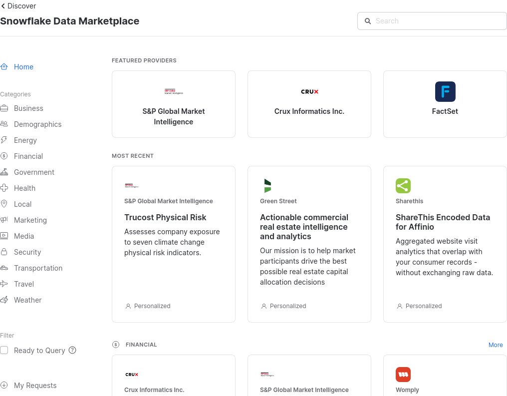
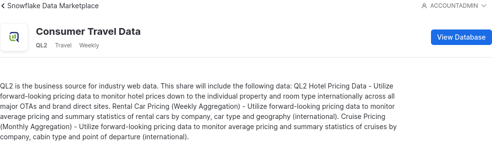
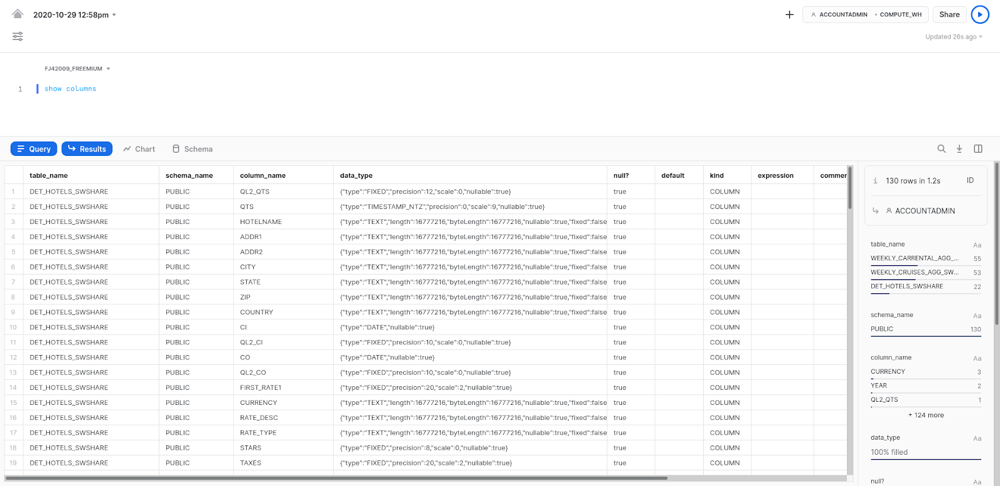
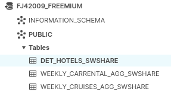
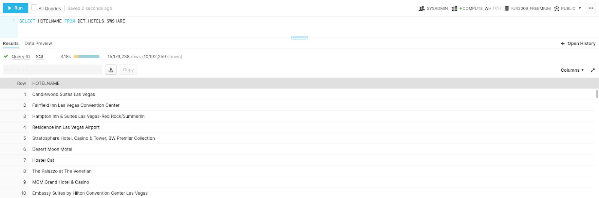
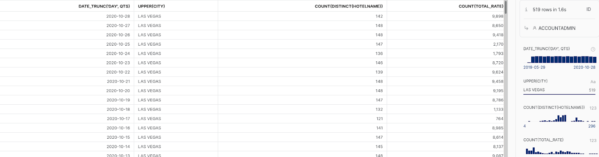

summary: Load and Use Snowflake Public Datasets
id: load_and_use_snowflake_public_datasets
categories: data-applications
tags: marketplace
status: Draft
Feedback Link: https://github.com/Snowflake-Labs/devlabs/issues

# Load and Use Snowflake Public Datasets
<!-- ------------------------ -->
## Overview
Duration: 1

Cloud data platforms are commonly used for storing user's own data. And while that's definitely a main part of their utility, you can expand on that by using others' datasets as well. In fact, it's straightforward to do so with Snowflake due to the Snowflake Data Marketplace. With the marketplace, you're able to access live, third-party public datasets with just a few clicks of the mouse. That access makes it easy to incorporate them into your Snowflake applications.

In this article, we'll be looking at what types of datasets are available along with how you can easily load and use those datasets in your Snowflake applications.

### Prerequisites
- Some basic SQL knowledge

### What you'll learn
- Load Marketplace data into Snowflake
- Query Data with Snowflake
- Use Public Data with Your Own Data

### What you'll need
- A [Snowflake](https://www.snowflake.com/) Account

### What you'll build
- An example of accessing data from the Snowflake Data Marketplace

<!-- ------------------------ -->
## Log in to Snowflake
Duration: 3

In order to access the Snowflake Data Marketplace, you'll need to [log in](https://www.snowflake.com/login/) with your Snowflake account. Don't have one? That's okay, because making one is quick, and comes with a free trial. Just fill out your personal information and you'll have it up and running.

Head over to the Snowflake portal and log in there. Once you're logged in, click the "Discover Data" tab found within the left-hand column.



Next, on the right-hand side of the page, you should see a link to the Snowflake Data Marketplace. Click that to be directed to where you can browse all the available datasets.

<!-- ------------------------ -->
## Browse the Marketplace
Duration: 5

Welcome to the Snowflake Data Marketplace. There's quite a wide variety of data available, but you can narrow down the results by category.

One thing to note is that not all datasets may be immediately available for someone in your region. Some are only available upon request. These are known as [Personalized Data Listings](https://docs.snowflake.com/en/user-guide/data-marketplace-intro.html#personalized-data-listings) If you want to filter those out, you can do so by using the "Ready to Query" filter.

You can peruse all the categories of data available for you, but for this guide, we'll pick out a specific standard data listing to use as an example. That dataset is QL2's "[Consumer Travel Data](https://www.snowflake.com/datasets/ql2-consumer-travel-data/)" dataset found within the "Travel" category. When you click on that dataset, you'll see a button that says "Get Data" in the top right corner, which will then turn to “View Database“.



You'll then be prompted to change the database name if you'd like, and which roles can access the database. If you're unfamiliar with the different roles, you can read more [here](https://docs.snowflake.com/en/user-guide/security-access-control-overview.html).

Then, accept the terms and conditions and you'll have a database created to query data from this listing. Remember, this database won't take up any storage space in your account!

<!-- ------------------------ -->
## Load the Data Listing
Duration: 3

Now, the button that said "Get Data" will have changed to "View Database." Clicking on this button will direct you to view the database. You'll see a listing of the schemas within the database, and within those, you'll get a listing of all the tables within those schemas.

Ready to query data? You can do that within a [worksheet](https://docs.snowflake.com/en/user-guide/ui-worksheet.html). Click on the worksheets tab on the left-hand side, then click "+ Worksheet" to create a new worksheet. You can perform commands to query specific data within the worksheet.



This isn’t the only place you can query data though. Be sure to also make note of the classic console.

<!-- ------------------------ -->
## Use The Classic Console
Duration: 3

Another useful view is to look at databases within the Classic Console. To do so, just click on the "View in Classic Console" button on the right-hand side of the page. Within the classic console, you can click into schemas and tables and view their metadata in the appearing columns.



The classic console also allows you to perform SQL commands within its worksheet as well.



Next, you can load this dataset into your application.

<!-- ------------------------ -->
## Use Public Datasets in Your Applications
Duration: 5

So you can access the datasets, but what exactly can you do with them? Well, let's discuss how public datasets can be incorporated into, and even expand upon, your existing Snowflake flow.

First, let's discuss what you can quickly do in a worksheet. Having that data accessible from a worksheet gives you the perfect sandbox environment to really look into the data. Oftentimes, you aren't quite sure if the data will suit your needs. Here, you can get a first-hand look.

You might have noticed that the public dataset we selected has some helpful examples to understand the data. We can do the same here to understand both worksheets and our data better. Using the worksheet, use the following commands to get a helpful view for understanding the data. 

```
select date_trunc('day', qts), upper(city), count(distinct(hotelname)),
count(total_rate)
from det_hotels_swshare
group by 1,2
order by date_trunc(‘day’, qts) desc;
```

Running that in the worksheet gives us the number of entries and hotels for each day, starting with the most recent data.



Notice that this dataset only contains hotel data from Las Vegas. Some public datasets only have sections of their data publicly available. Be sure to read thoroughly to avoid any confusion!

When you begin incorporating the data, other benefits become apparent. One key benefit of using public datasets is the data will always be up to date. No need to keep track of more things to monitor. Gone are the days of maintaining your connections to various APIs and the like. With public datasets, it's just the data, straight from the source to you and your users.

<!-- ------------------------ -->
## Next Steps
Duration: 1
 
The public datasets can give you a lot of insight, without a doubt, but they can really help you when you utilize them in tandem with your own data. With Snowflake, you can easily combine data from multiple datasets. Just `SELECT` what you need `FROM` the relevant tables in the worksheet.

We can think of an example using another public dataset along with our hotel dataset. For example, perhaps you want insight into hotels located in COVID-19 hotspots. You can pull data for the number of COVID-19 cases by zip code via another public dataset, and query using the `JOIN` statement.

Of course, there's a lot more you can do with Snowflake's databases, both your own and the ones from the data marketplace. After all, we've only just introduced you to the concept of using the data marketplace. We think you'll find it helpful to look at the rest of our documentation to really take advantage of these datasets. After all, Snowflake has a lot of powerful tools for querying data.
