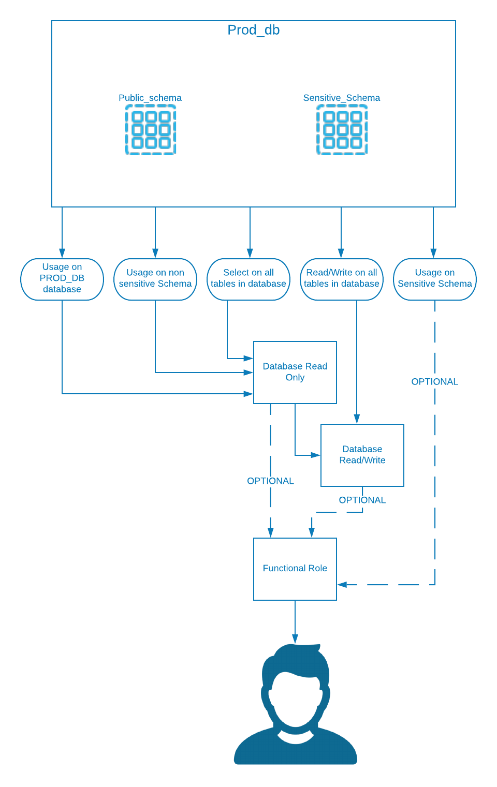

summary: Security - Access to Sensitive Objects
id: security_access_to_sensitive_objects
categories: patterns
tags: patterns, security, rbac, objects, access
status: Published 

# Architecture Pattern : Access to Sensitive Objects

## Overview

### Security Guides

This guide is part of a series on Security. The guides are:
- [Access to sensitive objects](../security_access_to_sensitive_objects/index.html)
- [Authentication](../security_authentication_pattern/index.html)
- [Network Architecture](../security_network_architecture_pattern/index.html)

### Access to Sensitive objects
This pattern provides an
approach for granting access to schemas containing sensitive data
without creating a fork in the RBAC role hierarchy.  Forking the RBAC
hierarchy is commonly prescribed in order to provide one role set which
grants access to non-sensitive data and another  with sensitive data
access. This privileged role must then be properly inherited and/or
activated by the end user, and it results in a duplication of the
privileges set; one for non sensitive data and one for sensitive.
 

This pattern proposes alternatively, to instead grant
a privilege set to all objects in a database regardless of their
sensitivity.  It is then only the USAGE privilege, which is controlled
by a separate database specific sensitive role, that would be inherited
by the top level role.  This effectively eliminates the fork in the
hierarchy and simplifies the number of roles a user must request access
to . Instead of the user having to request a sensitive role with its own
access privileges, they can  simply request  the enabling of sensitive
data access.

This pattern does not prescribe  how to populate these objects,perform
row or column level security, or grant roles to users; each of which may
also be required.  The scope of this pattern is simply how to provide
visibility to the objects themselves.  

### What you'll learn

A technique for granting access rights in a simple way, while allowing powerful control over access to sensitive data.

### When To Use This Pattern

This pattern implements well when the following
conditions are true:

1.  Within a database, datasets are grouped by schema
    by which access must be controlled
2.  Access to these schemas is controlled by an
    identity governance & access management system.  
3.  User request access to specific data sets which
    must be approved
4.  Access roles are inherited by some level of
    functional role.  The functional role could be at a group or
    individual level.  

## Pattern Details

Objects in Snowflake are contained in a hierarchy of containers.
 Databases contain schemas which contain objects.  Each level of the
hierarchy has its own set of privileges.  In order to be able to
successfully access data in the lowest level objects which contain data - such as table or a view - the role must have the appropriate
privileges on all objects higher in the hierarchy.  A role must first
have the privilege to view a database, commonly granted with the
database usage privilege.  Then the role can only see schemas for
which the schema usage privilege has been granted.
 Finally the user must have privileges on the underlying objects.
 

Although the object containers - meaning database, schema and tables
(for example) -  are hierarchical, the privileges can be granted out of
order, which is what this pattern is suggesting.  A role inherits a
certain privilege set on all objects in a database -
this privilege set can be any combination of CRUD privileges.  The role
is then granted usage on the database.  At this point the role can see
the database, and has common privileges on objects - but is unable to
view the underlying objects because no schema level privileges have been
granted.  Now, a user can request permissions to specific schemas.  The
only privilege the security admin must grant is the usage privilege.
 Once that usage is granted and properly inherited by a functional role
to aggregate the object level privileges along with the usage privilege,
 the user will be able to access the data set.  

The granting of these schema level roles is commonly managed by an
enterprise identity governance and access management system.  Within
this enterprise system, a user requests access to specific data sets
which then follows an approval process.  Once the proper approvals have
occurred, the role containing the usage privilege on the approved schema
is assigned to the requesting user's functional role.  This granting and
inheritance can be implemented using either SCIM2.0 API, JDBC calls to
customer stored procedures, or calling procedures or executing SQL
directly in Snowflake.

Key Points

1.  Even if a role has privileges on an object, if it does not have the
    USAGE privilege on the database and schema containing the object it
    will not be visible to that role.
2.  For each schema containing sensitive data a role
    is created and granted the USAGE privilege on that schema
3.  This sensitive role is then granted to the
    functional role which has been approved to access the sensitive
    data. 

## Pattern Example - Sensitive RBAC Hierarchy

This is a working example of how this pattern could be
implemented, within a particular context.

### Business Scenario

1.  Snowflake will integrate with an enterprise
    permissions management catalog system.  All roles in Snowflake which
    a customer will be granted need to be listed in this catalog.  Given
    the volume of databases in schemas for the project, an emphasis on
    role reduction must be made.
2.  The data set in Snowflake will include two
    sensitivity classifications.  Sensitive, which will have limited
    access,  and non sensitive which all users will have access
    to.

### Pattern Details

1.  Database `PROD_DB` contains two schemas,
    `PUBLIC_SCHEMA` and `SENSITIVE_SCHEMA`.
2.  A `PROD_DB_RO` role is created. The following
    privileges are granted to the role 
    1.  `USAGE` on `PROD_DB`
    2.  `USAGE` on `PUBLIC_SCHEMA`
    3.  `SELECT` on all `TABLES` in `PROD_DB`
3.  A `PROD_DB_RW` role is created. The following
    privileges are granted to the role
    1.  `INSERT` & `UPDATE` on all `TABLES` in database
        `PROD_DB` 
    2.  `PROD_DB_RO` is granted to `PROD_DB_RW`
4.  A privileges are granted to the role:
    1.  `USAGE` on schema `SENSITIVE_SCHEMA`
    2.  Note there are no lower level object grants to the
        `SENSITIVE` schema role. It also is not inherited nor does it inherit
        other object access roles. 
5.  A functional role, `IT_ANALYTICS_ROLE` is
    created. This role will inherit the access level roles and be
    granted to users. This role will be activated by the user.
6.  Within the enterprise identity governance and
    access management solution, the following roles will be listed for a
    user to request, with a user required to select at least one from
    each category:
    1.  Access roles:
        1.  `PROD_DB_RO`
        2.  `PROD_DB_RW`
        3.  `PROD_DB_SENSITIVE`
    2.  Functional Roles
        1.  `IT_ANALYTICS_ROLE`
7.  Scenario 1: Bill, an IT Business Analyst, requires
    read write access to non sensitive data in `PROD_DB`.  
    1.  Bill already has the IT_ANALYTICS granted to his
        user.  
    2.  Bill requests `PROD_DB_RW`.  
    3.  The `PROD_DB_RW`, after following the approval
        process, is granted the `IT_ANALYTICS` role.  Bill now has the
        read/write on all objects in the public schema. 
8.  Scenario 2: Alice, an HR Business Analyst,
    requires read access to `PROD_DB` but also requires access to payroll
    data kept within the sensitive schema.  
    1.  Alice already has the `HR_ANALYSTS` functional role
        granted to her user.
    2.  Alice requests the `PROD_DB_RO` role
    3.  Alice requests the `PROD_DB_SENSITIVE` role
    4.  After the appropriate approval process, the roles
        are granted to the `HR_ANALYSTS` role and Alice can now read all
        tables in both the `PUBLIC` and `SENSITIVE` schemas.  

Fig 1.0 Suggested Approach

Fig 2.0 Traditional Pattern

## Conclusion

### What we have learned
1. Snowflake's Role Based Access Control enables complex access requirements to be developed through access and functional roles
2. Snowflake can integrate with Enterprise permissions management systems
3. Sensitive data access can be managed simply and clearly for users

### Guidance

#### Incompatibilities

1.  This pattern assumes a user should have the same
    access level permissions on objects in a database. If the user
    indeed requires separate permissions levels for schemas contained
    within the same database the model may need to be extended or a
    different model used.

#### Other Implications

1.  Some applications which integrate with SCIM may not support all
    functionality required to properly manage this approach requiring
    custom SCIM or JDBC integration.

### Design Principles Enabled by this Pattern

With a traditional approach of having non-sensitive
and sensitive versions of RBAC roles for a database and/or schema, the
user must determine both which dataset they should have access to as
well as which level of access they should have to this data - and
request access to that role.  This may not be intuitive to users not
properly trained and experienced with Snowflake RBAC.  With the model
proposed in this pattern, the access level has already been determined,
likely based on the organizational role of the user.  The only request
the user is making is which datasets the user should be able to view.
 

### Key Benefits of this Pattern

The benefit of this pattern is when a user is
 reviewing the possible roles to request access to, they only see three
roles and must decide 1) what privilege level do I need and 2) do I need
access to sensitive data. These decisions are made independently of
each other. In a typical model, this same hierarchy would require at
least 4 roles, and each role would be a distinct set of combined
privileges. More importantly, a legacy model would require at least 9
grants to be made of privileges to roles whereas the suggested pattern
only requires 5. These numbers may seem insignificant, however as
implementations of snowflake grow and evolve, simplification of RBAC
hierarchies will be critical to successful extensibility and ease of
management.

1.  Simplified RBAC Hierarchy
2.  Simplified enterprise catalog of available
    roles
3.  More intuitive access selections for common
    users
4.  Simplified integration with IAM (Identity and
    Access Management) or IGA (Identity Governance and Administration)
    tools

