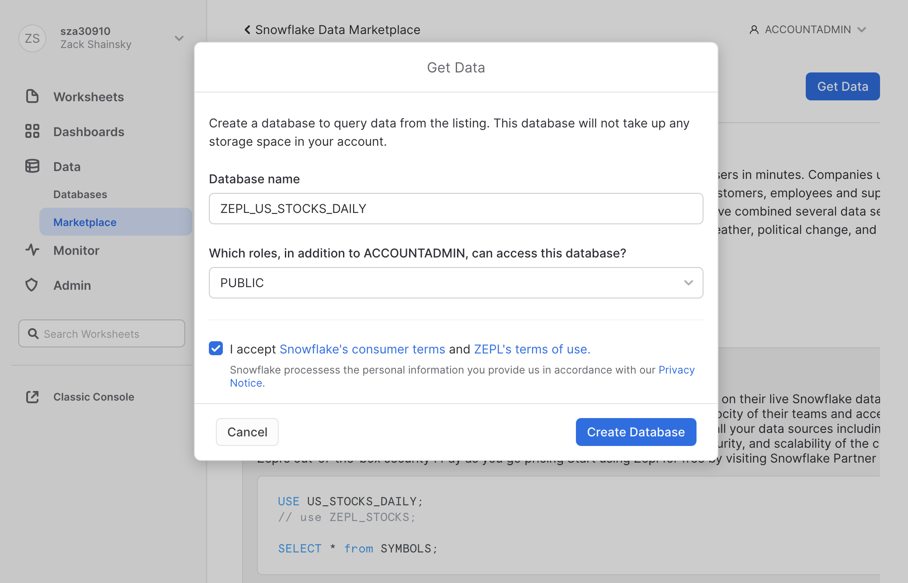
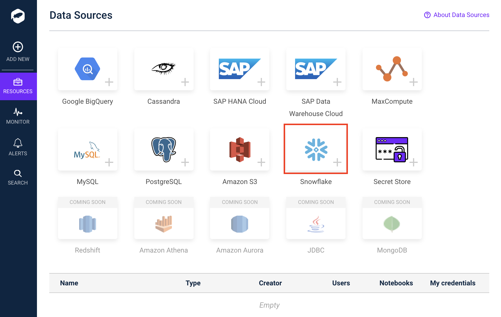
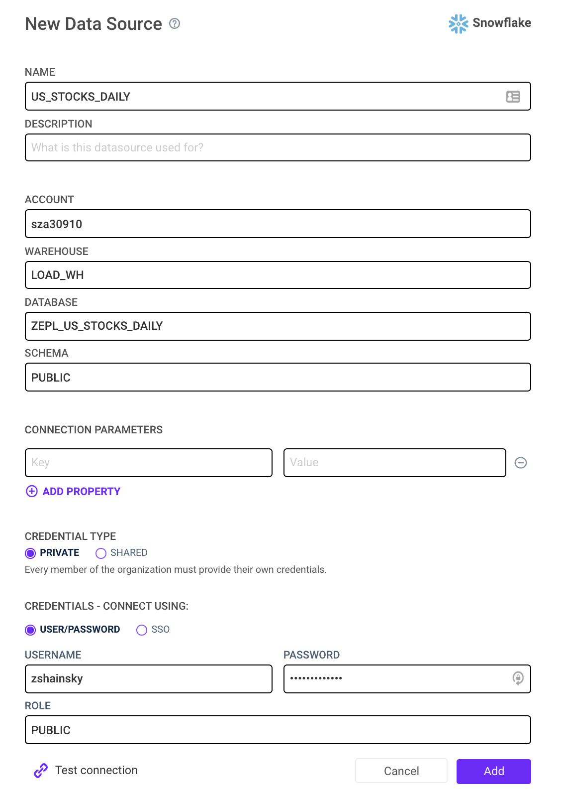
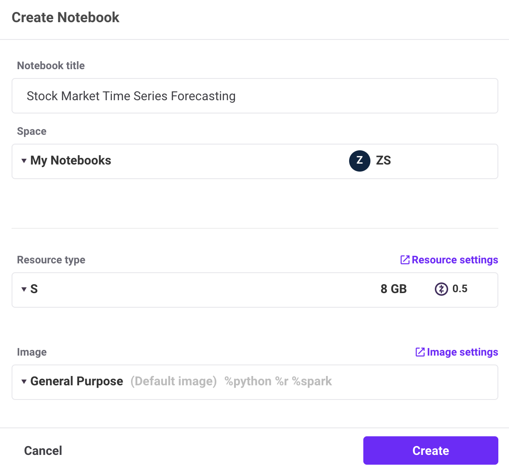
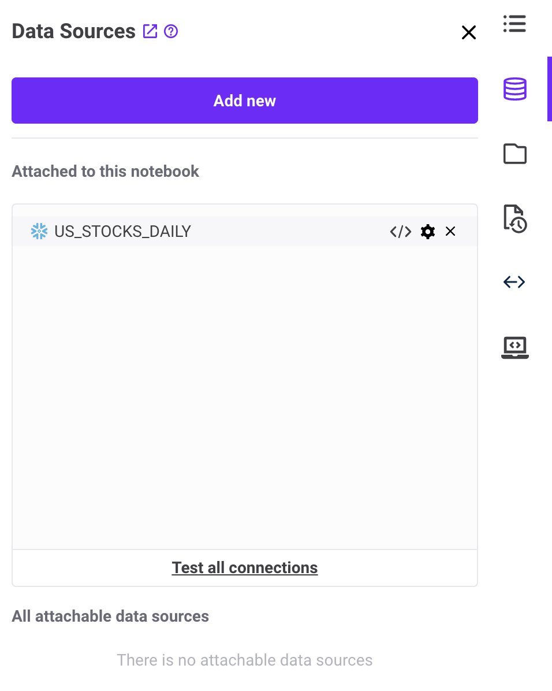
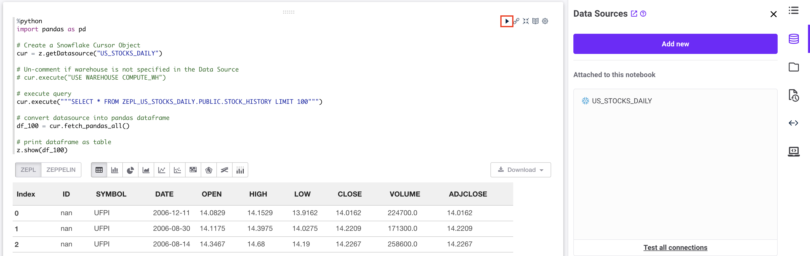
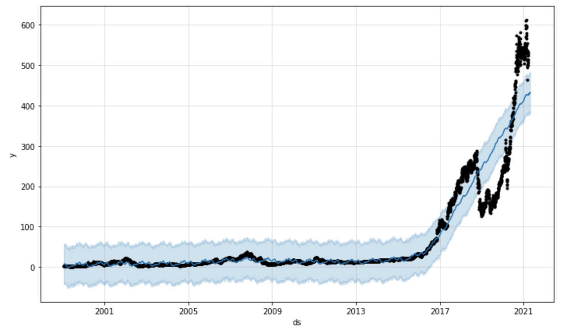
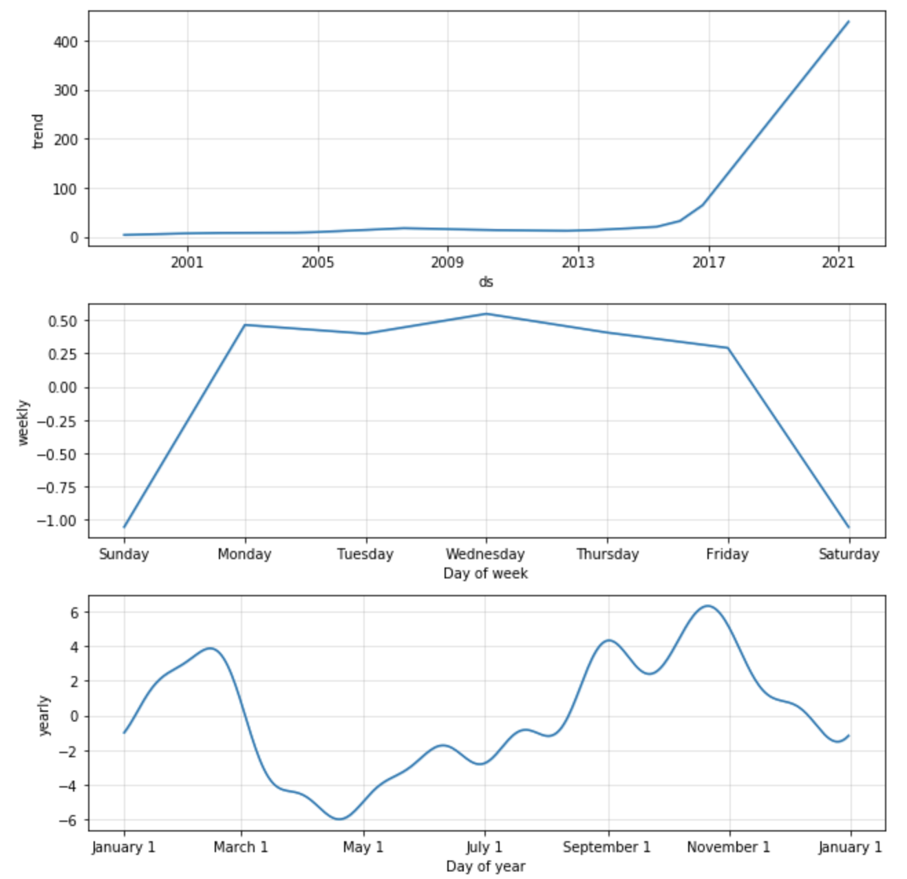
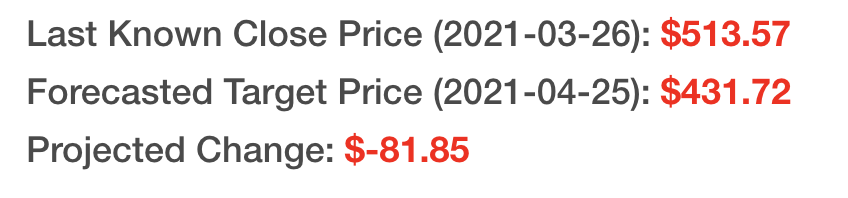
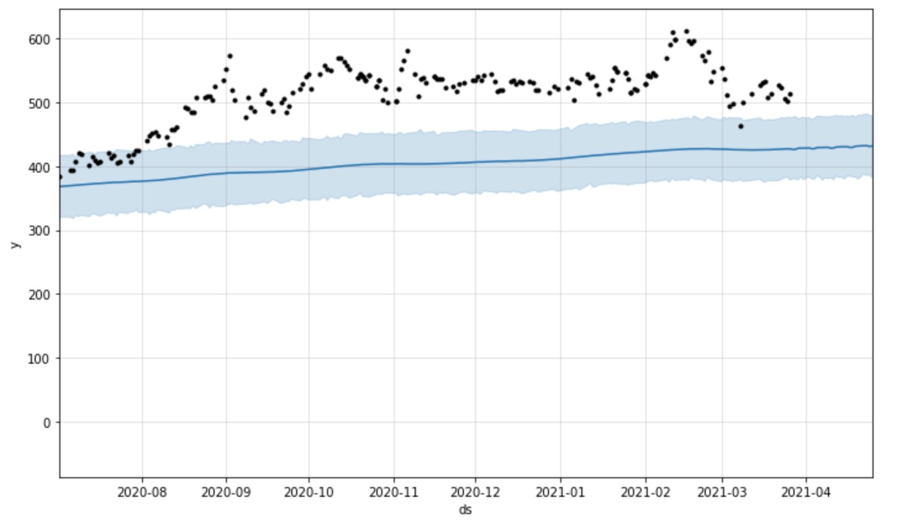

summary: Time Series Forecasting with Zepl v3
id: time_series_forecasting_zepl 
categories: Getting Started
environments: web
status: Published
feedback link: https://github.com/Snowflake-Labs/devlabs/issues
tags: Getting Started, Data Science, Data Engineering, Modeling, Financial Services
authors: Zepl

# Time Series Forecasting with Zepl
<!-- ------------------------ -->
## Overview 
Duration: 1

In this guide, we'll be walking you through how to build a time series forecasting model using Zepl's data science notebook with data loaded from Snowflake's Data Marketplace!

### Prerequisites
- Familiarity with Python
- Familiarity with SQL

### What You’ll Learn 
- How to use Zepl's fully managed data science notebook
- How to clone data from the Data Marketplace in Snowflake
- How to accessing Python libraries in Zepl
- Introduction to [Facebook's Prophet library](https://facebook.github.io/prophet/docs/quick_start.html#python-api) for time series forecasting
- Notebook style reporting with built in data visualizations
- How to write forecasted results from Zepl to Snowflake

### What You’ll Need 
- A cup of coffee and your brain
- *There are no downloads required for this guide!!*

### What You’ll Build 
- A model to predict 15 days into the future of close values for the JNJ stock ticker

<!-- ------------------------ -->
## Get US Stock Market data in Snowflake
Duration: 10

### Create a Snowflake Account:
[Sign up for free](https://signup.snowflake.com/)

### Clone data from Snowflake's Data Marketplace
1. Login to Snowflake > Open the Data Marketplace 
2. Search for the 'US Stock Market Data for Data Science' 
</br> 
3. Select 'Get Data'. This user must have ACCOUNTADMIN privileges
4. Assign a database name and roles for who should have access to this database
5. Select Create Database > View Database
</br> 

Positive
: You must have ACCOUNTADMIN privileges to clone this data set

#### *Troubleshooting* 
Check if the database was created properly
```sql
SELECT * FROM "ZEPL_US_STOCKS_DAILY"."PUBLIC"."STOCK_HISTORY" LIMIT 10
```

Check if privileges are set correctly:
This database needs to have `SELECT` privileges for a Role that your user has access to. Setting the `SELECT` privilege for the PUBLIC role will allow all users to read data from this database.
* View privilege: [Doc](https://docs.snowflake.com/en/sql-reference/sql/show-grants.html)
* Assign privileges: [Doc](https://docs.snowflake.com/en/sql-reference/sql/grant-privilege.html)

<!-- ------------------------ -->
## Connect Zepl to Snowflake  
Duration: 5

### Create a Zepl Account:
[Sign up for free using Partner Connect](https://new-docs.zepl.com/docs/getting-started/sign-up-for-zepl#snowflake-partner-connect)

### Connect to the US Stock Market Database
[Zepl Documentation](https://new-docs.zepl.com/docs/connect-to-data/snowflake)
1. Login to Zepl
2. Select _Resources_ > _Data Sources_ > _Snowflake_
</br> 
3. Enter the required information below > Select _Add_: </br> 
</br> 

* __Account Details:__ Account, Warehouse, Database, and Schema should all match the values entered in Step 2
* __Credentials:__ Username, and Password and should match the Snowflake user and role with permissions to query this database
 * __ROLE:__ Be sure this role has permissions to run the specified WAREHOUSE
* __Credential Type:__ Private
 * [Learn more here](https://new-docs.zepl.com/docs/connect-to-data/zepl-data-sources#data-source-security)

#### *Troubleshooting* 
Use the _Test Connection_ button to validate the user credentials and ROLE. Below is a table of example outputs:

|__Error Message__ | __Action__  |
|------------------|-------------|
|`Failed: Invalid credentials provided for the datasource` | Your credentials were entered incorrectly |
|`Failed: failed to run the test query: 390189 (08004): Role 'PRIVATE' specified in the connect string does not exist or not authorized. Contact your local system administrator, or attempt to login with another role, e.g. PUBLIC.` | Enter a new Snowflake ROLE |

<!-- ------------------------ -->
## Create a new notebook
Duration: 5

### Creating a blank notebook
[Zepl Documentation](https://new-docs.zepl.com/docs/using-the-zepl-notebook/zepl-notebook-experience/create-new-notebook)

1. From any screen, Select _Add New_ (upper left)
2. Select _+ New Notebook_
3. Enter Notebook Details
</br>

### Understanding Zepl's Notebook Options
__Resource Type:__ [Doc](https://new-docs.zepl.com/docs/configure-infrastructure/container-resource)

Zepl Containers are isolated environments that are used to execute code. Paired with an Image, these Containers provide a private runtime for a notebook when it spins up. Each of these Container has a single CPU core and varies in the memory allocated to the notebook session. These Containers can be quickly scaled up or down in the notebook settings for larger or smaller workloads. Each Container has a default time out period of 30 minutes.

__Image:__ [Doc](https://new-docs.zepl.com/docs/configure-infrastructure/images)

Zepl Images can help you and your team save significant time by making creating reproducible environments for all notebooks to access. The Zepl Image builds all of the libraries required to run a notebook so your users don't have to worry about long wait times for installing libraries at the beginning of every notebook and hoping that each notebook environment is configured the same.

__Spaces:__ [Doc](https://new-docs.zepl.com/docs/manage-your-organization/spaces)

A Zepl Space is a collection of notebooks that can be shared with built-in access controls.  The "My Notebooks" space is a private space dedicated to your user only. Typically, new spaces are created for a specific project or working group; it's a place for a group of people who are working together on a set of data science problems.

### Importing an existing notebook (optional)
[Zepl Documentation](https://new-docs.zepl.com/docs/using-the-zepl-notebook/zepl-notebook-experience/importing-notebooks)

1. From any screen, Select _Add New_ (upper left)
2. Select _+ Import Notebook_
3. Type: _Fetch From URL_
4. Paste either link in the text field labeled _Link to your notebook_: 
 * link from Zepl's Published Notebook: `https://app.zepl.com/api/v1/viewer/fetch?url=bm90ZTovL3pzaGFpbnNreUB6ZXBsLmNvbS8xZjNiMjQwZTFjZjQ0MDk4YTU0Njc1MDM3MTMwNThlZC9ub3RlLmpzb24`
 * link from Github repository: `https://raw.githubusercontent.com/zshainsky/Getting_Started_on_Zepl/master/Snowflake%20Guide%20Stock%20Time%20Series%20Forecasting.zpln`
5. Apply

Positive
: Complete notebook code can be found here: [Notebook](https://app.zepl.com/viewer/notebooks/bm90ZTovL3pzaGFpbnNreUB6ZXBsLmNvbS8xZjNiMjQwZTFjZjQ0MDk4YTU0Njc1MDM3MTMwNThlZC9ub3RlLmpzb24)


<!-- ------------------------ -->
## Query Snowflake
Duration: 5
### Attach Snowflake Data Source
[Zepl Documentation](https://new-docs.zepl.com/docs/connect-to-data/zepl-data-sources#attaching-a-data-source)
1. In your notebook, select the Data Source icon  on the right hand side of the screen.
2. Select the plus icon next to the data source labeled 'US_STOCKS_DAILY' which you created in step 3. </br>


### In the Zepl Notebook:
First, add this code to the first paragraph

```python
%python
import pandas as pd

# Create a Snowflake Cursor Object
cur = z.getDatasource("US_STOCKS_DAILY")

# Un-comment if warehouse is not specified in the Data Source
# cur.execute("USE WAREHOUSE COMPUTE_WH")

# execute query
cur.execute("""SELECT * FROM ZEPL_US_STOCKS_DAILY.PUBLIC.STOCK_HISTORY LIMIT 100""")

# convert datasource into pandas dataframe
df_100 = cur.fetch_pandas_all()

# print dataframe as table
z.show(df_100)
```

Second, select "Run Paragraph" <br/> 


#### Code Explained
`import pandas as pd` <br/>
Zepl's General Purpose Image pre-installs the pandas library so all you have to do is import.

`cur = z.getDatasource("US_STOCKS_DAILY")`<br/>
This function is used to access any data source that is attached to the notebook. A [Cursor object](https://docs.snowflake.com/en/user-guide/python-connector-api.html#object-cursor) is returned to the `cur` variable. The specific data source is specified by setting the string input to the corresponding name of your data source. Lastly, the data source must be attached to the notebook before starting the container.

`cur.execute("""SELECT * FROM ZEPL_US_STOCKS_DAILY.PUBLIC.STOCK_HISTORY LIMIT 100""")`<br/>
This will execute a specified query in Snowflake. 

`df_100 = cur.fetch_pandas_all()`<br/>
Return a Pandas DataFrame to the `df_100` variable using. See documentation for more details [here](https://docs.snowflake.com/en/user-guide/python-connector-api.html#fetch_pandas_all)

### Troubleshooting:
* A data source must be attached to the notebook while the container is _Stopped_.
* Stop the container anytime you make changes to the data source, such as updating Account Details or Credentials.
* `ProgrammingError: 000606 (57P03): No active warehouse selected in the current session.  Select an active warehouse with the 'use warehouse' command.`
 * Resolution: Stop container > Un-comment code to set warehouse, `USE WAREHOUSE <warehouse name>`
* `ProgrammingError: 251005: User is empty.`
 * Resolution: Stop container > Check to make sure the Username value was saved successfully in Step 3

<!-- ------------------------ -->
## Install and Import Python Libaries
Duration: 5

### Overview
Zepl provides several options for loading libraries. The two most used are Custom Images and install during notebook run time. For this guide we will use the python package manager `pip` to install all of our required libraries. Learn more about [Custom Images](https://new-docs.zepl.com/docs/configure-infrastructure/images) and how to get [activate your account](https://new-docs.zepl.com/docs/getting-started/trial-and-billing#activate-your-organization) to access this feature.

### In the Zepl Notebook:
Add this code to the first paragraph and select "Run Paragraph":
```sh
%python
# Install fbprophet Deendencies
!pip install pystan~=2.14 Cython>=0.22 cmdstanpy==0.9.68 numpy>=1.15.4 pandas>=1.0.4 matplotlib>=2.0.0 LunarCalendar>=0.0.9 convertdate>=2.1.2 holidays>=0.10.2 setuptools-git>=1.2 python-dateutil>=2.8.0 tqdm>=4.36.1

# Install fbprophet Library
!pip install fbprophet==0.7.1
```

Positive
: This code may take several minutes to complete execution. <br> <br> The container must start, download, and install all of the libraries. This is one reason to build your own images using our Custom Image builder so notebooks start up instantly with all of the required libraries!

#### Code Explained
`!pip install pystan~=2.14 Cython>=0.22 cmdstanpy==0.9.68 numpy>=1.15.4 pandas>=1.0.4 matplotlib>=2.0.0 LunarCalendar>=0.0.9 convertdate>=2.1.2 holidays>=0.10.2 setuptools-git>=1.2 python-dateutil>=2.8.0 tqdm>=4.36.1`</br>
<p>This statement uses the `!` to access the container CLI and calls the `pip install` linux command to install the required libraries that support the facebook prophet library. Each version is specified to ensure the notebook runs consistently. </p>

`!pip install fbprophet==0.7.1`</br>
<p>This statement installs the fbprophet library with a specific version.</p>

#### Add new paragraph
Add this code to next open paragraph in your notebook and select run paragraph:
```python
%python
# Import Libraries
from fbprophet import Prophet
```

#### Code Explained
We must also import the libraries that were just installed in the previous paragraph.

#### Full output of code:


### Troubleshooting
* Startup time: This code may take several minutes to complete execution. The container must start, download, and install all of the libraries. This is one reason to build your own images using our Custom Image builder so notebooks start up instantly with all of the required libraries!
* Documentation on Facebook Prophet: [Link](https://facebook.github.io/prophet/)
* Known issue with the install [documentation](https://facebook.github.io/prophet/docs/installation.html#python): A fix is outlined [here](https://github.com/facebook/prophet/issues/1856) and implemented in our code already

<!-- ------------------------ -->
## Building a Time Series Forecast
Duration: 20


__TL;DR:__ Predicting the future based on past events requires the past to have patterns that may repeat in the future. Future stock market prices are influenced by many external sources, thus solely relying on past events to pick stocks is not the best strategy. In this walk through, we are going to ignore that guidance and do it anyway. This guide is not intended to influence your personal trading decisions.

### Overview

In this section we will explore the data for a specific stock ticker, build a time series forecast, and visualize the results. All of the code can be referenced here: [Notebook Code](https://app.zepl.com/viewer/notebooks/bm90ZTovL3pzaGFpbnNreUB6ZXBsLmNvbS8xZjNiMjQwZTFjZjQ0MDk4YTU0Njc1MDM3MTMwNThlZC9ub3RlLmpzb24/20210330-212709_1676214636). We will be using the Facebook Prophet library with Python for our analysis. Zepl also supports R so feel free to use R as well. 

We will be looking at stock prices for Johnson & Johnson (JNJ). Using the FBProphet model, we will look at all of the past Adjusted Close values for JNJ and determine if we can make stock trend predictions with a remotely accurate result. The Prophet library uses an additive model which is composed of 3 major components, trend, seasonality, and holidays ([Ref](https://towardsdatascience.com/a-quick-start-of-time-series-forecasting-with-a-practical-example-using-fb-prophet-31c4447a2274)). Prophet is robust to missing data and shifts in the trend, and typically handles outliers well ([Ref](https://github.com/facebook/prophet#prophet-automatic-forecasting-procedure)).

### Retrieve Data for Specific Stock Ticker
First let's retrieve data from Snowflake with all of the open, high, low, close values for one specific stock one stock. Add this code to a new paragraph in your notebook:
```python
%python
# Set ticker value
stock_ticker = 'JNJ'

# Get a new DataFrame for a Specific Stock ticker
cur = z.getDatasource("US_STOCKS_DAILY")

# Retrieve data only for the specified stock ticker and order results by date. Distinct will eliminate any duplicate values.
cur = cur.execute("""
            SELECT DISTINCT * FROM 
            ZEPL_US_STOCKS_DAILY.PUBLIC.STOCK_HISTORY 
            WHERE symbol='{}' 
            ORDER BY date
            """.format(stock_ticker))

# Create Pandas DataFrame from query results            
df_stock = cur.fetch_pandas_all()
```
#### Code Explained
This is the same code we used above with a different SQL statement. The SQL statement is going to return all rows and columns from the STOCK_HISTORY table WHERE the SYMBOL column is equal to the value of our `stock_ticker` python variable. In this case, that is 'JNJ' (Johnson & Johnson).

### Create and Train a Prophet Model
Add this code to the next paragraph to build a predictive model using the Prophet library:
```python
%python
# Initialize Prophet object
m = Prophet()

# Drop unused columns
ph_df = df_stock.drop(['OPEN', 'HIGH', 'LOW','VOLUME', 'SYMBOL','CLOSE'], axis=1)

# Rename values so Prophet knows what to predict (y) and when that event happened (ds)
ph_df.rename(columns={'ADJCLOSE': 'y', 'DATE': 'ds'}, inplace=True)

# Fit Model
m.fit(ph_df)
```
#### Code Explained
`m = Prophet()`</br> 
First we must create python object from the Prophet library. This will be used to access all functions for forecasting.

`ph_df = df_stock.drop(['OPEN', 'HIGH', 'LOW','VOLUME', 'SYMBOL','CLOSE'], axis=1)`<br>
`ph_df.rename(columns={'ADJCLOSE': 'y', 'DATE': 'ds'}, inplace=True)` </br>
The Prophet library only takes in two column as inputs before training. Those inputs are a date column and a value to be predicted. In our case the date column in our dataset is labeled as 'DATE' and we would like to predict the close value of the stock which is labeled as, 'ADJCLOSE'. 

`m.fit(ph_df)`</br>
Lastly we train (fit) the model on the two input values above DATE and ADJCLOSE.

### Make Future Predictions
```python
%python
# Num days to predict
period = 30

# Create an empty DataFrame to store preditison for future dates
future_prices = m.make_future_dataframe(periods=period)

# Predict Prices
forecast = m.predict(future_prices)

# Inspect the forecast prices over the next 30 days. The yhat value is the predition value.
z.show(forecast.tail(period))
```


#### Code Explained
`future_prices = m.make_future_dataframe(periods=period)`</br>
We must create a new dataframe that can store our future prediction values. `future_prices` will have 30 empty rows for storing 30 days of future predictions. The `period` value can be changed to generate greater or fewer predictions.

`forecast = m.predict(future_prices)` </br>
Create predictions and display the results. This function will generate a number of new columns. The important values are defined below:
* `yhat`: Predicted value
* `yhat_lower`: Lower bound of prediction. 95% confidence interval. 
* `yhat_upper`: Upper bound of prediction. 95% confidence interval.


### Visualize Predictions
The code below will generate a chart to display our trend in relation to actual stock close values. The black dots represent the close values from our original dataset (`df_stock['ADJCLOSE']`) and the blue line represents the trend determined by our model predictions (`forecast['yhat']`). The light blue shading represents the upper and lower bound of the trend (`forecast['yhat_lower']` or `forecast['yhat_upper']`).</br>

```python
%python
m.plot(forecast);
```


### Visualize Seasonality
The code below will generate a chart to display the impact of seasonality on the trend. This can be used to identify if certain times of the day, month, or year effects the final trend. <br/>

If we look at the yearly trend (final chart) it appears that stock prices tend to drop in march and rise towards the end of the year. These factors may lead us to re-fit the model based on specific holiday trends which can be done easily using prophet. Feel free to play around with adding holiday seasonality as well: [Examples](https://facebook.github.io/prophet/docs/seasonality,_holiday_effects,_and_regressors.html#built-in-country-holidays)</br>

```python
%python
m.plot_components(forecast);
```


### Target Stock Price (30 day prediction)
The code below will display the change in stock price between our forecast value and our last known stock value. At the time of creating this guide, the last known stock price was $161.40 on March 26th 2021. Our predicted value for April 25th 2021 is set at $154.88. The difference is a drop in price by $6.52. While that might be interesting, we still need to evaluate the known error in this model and see if tuning our inputs may lead to a more accurate prediction.<br>

```python
%python
# Get the last known adjusted close value and date from our stock dataset
num_rows_stock = df_stock.shape[0]
last_close_date = df_stock.at[num_rows_stock-1, 'DATE']
last_close_value = df_stock.at[num_rows_stock-1, 'ADJCLOSE']

# Get the prediction value and date from our forecasted trend
num_rows_forecast = forecast.shape[0]
last_forecast_date = forecast.at[num_rows_forecast-1, 'ds'].strftime("%Y-%m-%d")
last_forecast_value = forecast.at[num_rows_forecast-1, 'yhat']

# Display those values using HTML and simple inline styling
print('''%html <h4> Last Known Close Price    ({date}): <b><span style="color:red;">${value:.2f}</span></b></h4>'''.format(date=last_close_date, value=last_close_value))
print('''%html <h4> Forecasted Target Price   ({date}): <b><span style="color:red;">${value:.2f}</span></b></h4>'''.format(date=last_forecast_date, value=last_forecast_value))
print('''%html <h4> Projected Change:                   <b><span style="color:red;">${value:.2f}</span></b></h4>'''.format(value=last_forecast_value - last_close_value))
```


Positive
: Note that you can display HTML directly from our Python interpreter! If you want to learn more, look here: [Link](https://new-docs.zepl.com/docs/using-the-zepl-notebook/develop/data-visualization#html-css-javascript)


Finally, let's zoom in and visualize the forecasted values 30 days in the future. The price that our model predicted is displayed in blue and the final 365 days of adjusted close values are shown in black.

```python
%python
import time
# Set graph date range to 180 days + future prediction values
graph_dates = 180 + period

# Total number of days in forecast DataFrame
len_forecast = len(forecast['ds'])

# Set total number of stock values to display
last_x_days = len_forecast - graph_dates

# Display Graph and set the x limit to show last 180 days + 30 forecast period
fig = m.plot(forecast);
ax = fig.gca()
ax.set_xlim([forecast.tail(graph_dates)['ds'][last_x_days], forecast.tail(graph_dates)['ds'][len_forecast-1]]) 
```



#### Code Explained
`graph_dates = 180 + period`<br>
`len_forecast = len(forecast['ds'])`<br>
`last_x_days = len_forecast - graph_dates`<br>
We want to display the last 180 days plus our future 30 day prediction period. These variables are used to determine the number of days to display.

`fig = m.plot(forecast);`<br>
`ax = fig.gca()`<br>
Plot the forecast as we have done above and retrieve the matplotlib Axis value ([ref](https://matplotlib.org/3.1.1/api/_as_gen/matplotlib.pyplot.gca.html)). The semicolon at the end of the first line ensures only one graph is displayed.

`ax.set_xlim([forecast.tail(graph_dates)['ds'][last_x_days], forecast.tail(graph_dates)['ds'][len_forecast-1]])`<br>
Limit the X-Axis range for our graph

<!-- ------------------------ -->
## Validate Our Predictions 
Duration: 15

### Overview
Now that we have created a prediction, we should validate the confidence level in our results. We will use cross-validation to make a series of predictions for a given a time window (horizon) and compare the predicted value to the actual value. In our case, we will compare predicted adjusted close values to actual close values.

### Cross-Validation
```python
%python
from fbprophet.diagnostics import cross_validation

# Use built in cross_validation function with parallelization across multiple CPU processes
df_cv = cross_validation(m, initial='6570 days', period='90 days', horizon = '30 days', parallel="processes")

# Display last 5 rows of results
z.show(df_cv.tail())
```


### Code Explained
`df_cv = cross_validation(m, initial='6570 days', horizon = '30 days', period='90 days', parallel="processes")`<br>

The fbprophet library has an easy to use `cross_validation()` function to automate the entire process. This may take several minutes to complete. 

Here is what the input parameters mean:

* `initial`: This is the time window to use for training. We are training on 6,570 days worth of data (18 years).
* `horizon`: This is the time window to make predictions over. We will use 30 days worth of adjusted close values to predict and compare our results to the actual adjusted close values.
* `period`: This is the time window to skip over between prediction windows (`horizon`). Setting this to 90 days allows us to make one set of prediction every quarter.
* `parallel`: Cross-validation can be CPU intensive, so we will try to multiple CPUs to reduce overall run time.

### Cross-Validation Results
```python
%python
from fbprophet.diagnostics import performance_metrics

# Use built in performance_metrics() function to retrieve performance metrics 
df_p = performance_metrics(df_cv)

z.show(df_p.tail())
```


### Code Explained
`performance_metrics(df_cv)`<br>

We will focus on the Mean Absolute Percentage Error (MAPE). This measurement explains the size of the error in our predictions as a percentage ([Ref](https://stochasticcoder.com/2016/04/25/forecasting-and-python-part-1-moving-averages/)). Breaking down our result, the lowest MAPE value is around 0.11, which we can translate to say that our predictions differ from the actual value by 11% on average. Depending on your risk level, perhaps that is enough for you. But, we still have a few tools to try to reduce our error. 

If you want to retrieve the exact minimum value, use this code below:

```python
%python
# Get lowest MAPE value
mape_perf = df_p.min(level=np.argmin(df_p["mape"]))
print('''%html <h4> Display Lowest MAPE value: <b><span style="color:red;">{value:.2f}</span></b></h4>'''.format(value=mape_perf['mape'][0]))
```


### Visualize Error Results
We can quickly visualize the MAPE value across the 30 day prediction window (horizon) used during cross-validation. The graph below shows how MAPE oscillates over the 30 day prediction. *If anyone knows why that oscillation occurs feel free to message me for a chat, I'd love to know :) [zack@zepl.com](mailto:zshainsky@zepl.com)

```python
%python
from fbprophet.plot import plot_cross_validation_metric
fig = plot_cross_validation_metric(df_cv, metric='mape')
```


### Troubleshooting: 
* `BrokenProcessPool: A process in the process pool was terminated abruptly while the future was running or pending.` May occur due to lack of memory available in the running container. Stop the container and select a larger container size. Typically 16GB and 32GB should be sufficient. [Doc](https://new-docs.zepl.com/docs/using-the-zepl-notebook/run/runtime-settings)
*  `ImportError: FloatProgress not found. Please update jupyter and ipywidgets. See https://ipywidgets.readthedocs.io/en/stable/user_install.html`: TQDM not supported for Zepl notebooks. Must use parallel flag. This issue is tracked here and will be available in the next release of fbprophet ([Ref](https://github.com/facebook/prophet/issues/1825)).

<!-- ------------------------ -->
## Next Steps: Improving our model with Hyperparameter Tuning
Duration: 0

### Overview
In order to improve the accuracy of our forecasted predations, we will test out many different values for how sensitive the model is to changepoints and seasonality. Hyperparameter tuning is a fancy name for a very simple concept. In order to tun our model we will test out lots of different parameters and compare the accuracy of the results. The parameters that produce the most accurate prediction values (MAPE or other error values) is the winner. We will perform the same cross-validation as we have in the previous 2 steps, only this time, we will use 4 different values for `changepoint_prior_scale` and 4 different values for `seasonality_prior_scale`.

### Implement Hyperparameter Tuning and Display Results
```python
%python
# https://facebook.github.io/prophet/docs/diagnostics.html#hyperparameter-tuning

import itertools
import numpy as np
import pandas as pd

# Track original waits for comparison later:
original_changepoint_prior_scale = m.changepoint_prior_scale
original_seasonality_prior_scale = m.seasonality_prior_scale

param_grid = {  
    'changepoint_prior_scale': [0.001, 0.01, 0.1, 0.5],
    'seasonality_prior_scale': [0.01, 0.1, 1.0, 10.0],
}

# Use cutoff values from initial cross-validation set
cutoffs = pd.to_datetime(df_cv['cutoff'].unique())

# Generate all combinations of parameters
all_params = [dict(zip(param_grid.keys(), v)) for v in itertools.product(*param_grid.values())]
rmses = []  # Store the RMSEs for each params here
mae = []  # Store the MAE for each params here
mape = []  # Store the MAPE for each params here

# Use cross validation to evaluate all parameters
for params in all_params:
    m = Prophet(**params).fit(ph_df)  # Fit model with given params
    df_cv = cross_validation(m, cutoffs=cutoffs, horizon='30 days', parallel="processes")
    df_p = performance_metrics(df_cv, rolling_window=1)
    rmses.append(df_p['rmse'].values[0])
    mae.append(df_p['mae'].values[0])
    mape.append(df_p['mape'].values[0])

# Find the best parameters
tuning_results = pd.DataFrame(all_params)
tuning_results['rmse'] = rmses
tuning_results['mae'] = mae
tuning_results['mape'] = mape

z.show(tuning_results)
```

Positive
: This may take some time to run. Again, try a larger container size (> 32GB) if you are running into any memory related errors. Go grab some coffee :)

Lastly, display the parameters with the most optimal results and compare the new parameters with the original ones:
```python
%python
best_params = all_params[np.argmin(mape)]
print(original_changepoint_prior_scale, original_seasonality_prior_scale, best_params)
```

<!-- ------------------------ -->
## References and Notes
Duration: 0

### References:
* Blogs
 * [towards data science](https://towardsdatascience.com/apple-stock-and-bitcoin-price-predictions-using-fbs-prophet-for-beginners-python-96d5ec404b77)
 * [medium](https://medium.com/tokopedia-data/hacking-time-series-forecasting-like-a-pro-with-fbprophet-76f276f0a058#:~:text=FBProphet%20uses%20time%20as%20a,logistics%20growth%20from%20its%20arguments.&text=A%20reasonable%20number%20of%20missing%20or%20outlier%20data)
* Considerations for why Stock Forecasting is very hard: "Prophet is able to detect and fit these, but what trend changes should we expect moving forward? It’s impossible to know for sure, so we do the most reasonable thing we can, and we assume that the future will see similar trend changes as the history." [Ref](https://facebook.github.io/prophet/docs/uncertainty_intervals.html#uncertainty-in-the-trend)
* Cross Validation 
 * [fbprophet documentation](https://facebook.github.io/prophet/docs/diagnostics.html#cross-validation)
 * How to use multi-processing: "For problems that aren’t too big, we recommend using `parallel="processes"`. It will achieve the highest performance when the parallel cross validation can be done on a single machine." [Ref](https://facebook.github.io/prophet/docs/diagnostics.html#:~:text=For%20problems%20that%20aren't,cross%20validation%20on%20many%20machines.)
* How Prophet determines change points: Changepoints are the datetime points where the time series have abrupt changes in the trajectory.
By default, Prophet adds 25 changepoints to the initial 80% of the data-set.
Let’s plot the vertical lines where the potential changepoints occurred" [Ref](https://towardsdatascience.com/time-series-prediction-using-prophet-in-python-35d65f626236)
* Error Metrics: [Ref](https://stochasticcoder.com/2016/04/25/forecasting-and-python-part-1-moving-averages/)