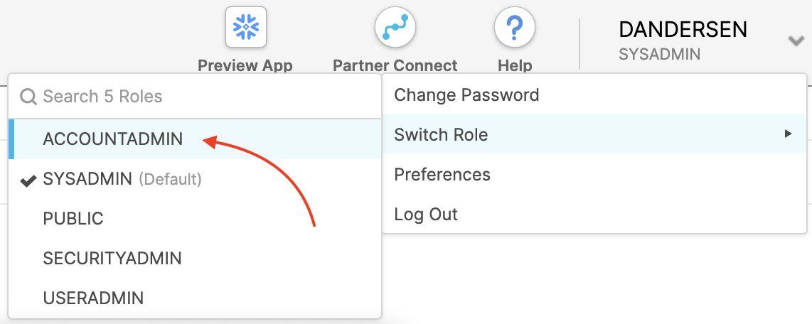
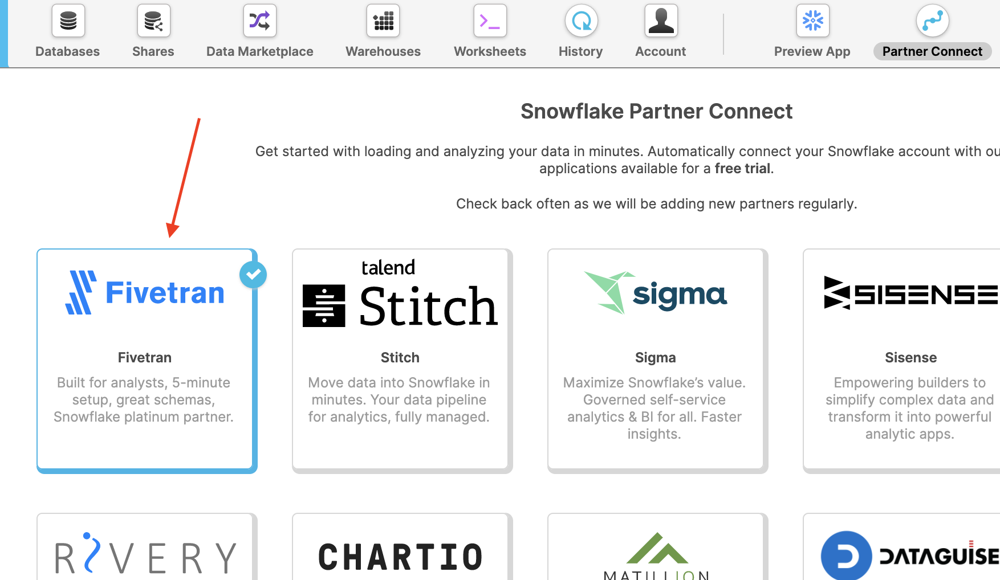
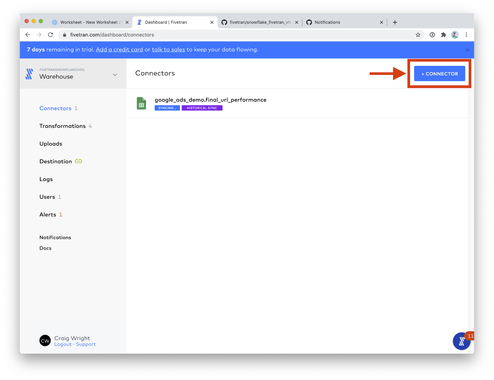
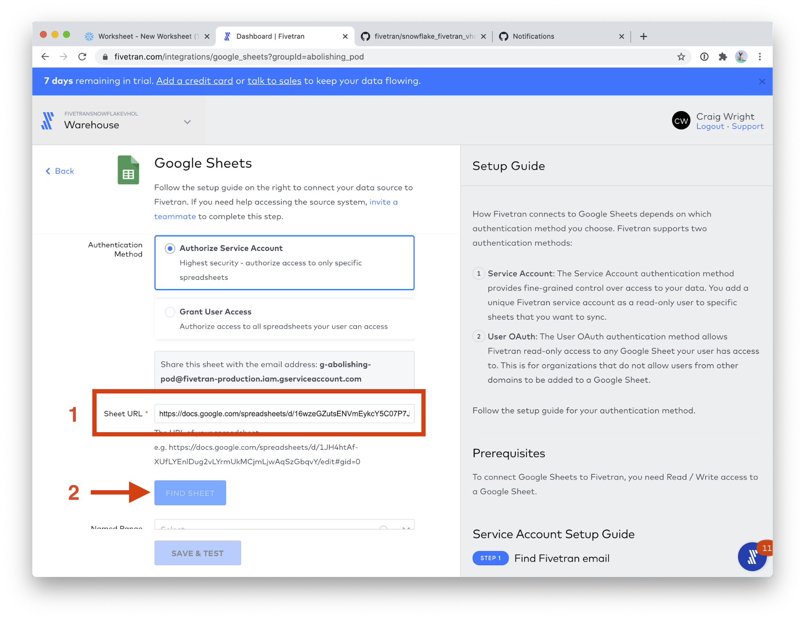

summary: Automating Data Pipelines to Drive Marketing Analytics with Snowflake & Fivetran
id: vhol_fivetran 
categories: Getting Started
environments: web
status: Published 
feedback link: https://github.com/Snowflake-Labs/devlabs/issues
tags: Getting Started, Fivetran, Marketing Analytics, dbt
authors: Snowflake

# Automating Data Pipelines to Drive Marketing Analytics with Snowflake & Fivetran
<!-- ------------------------ -->
## Overview 
Duration: 1

### Prerequisites
To participate in the virtual hands-on lab, attendees need the following:

1. Prior to attending the lab

    * Github account - Participants will need to create, or already have, an account on Github. Other git-based source control hosting sites will work fine (Gitlab, Bitbucket), but the instructions will assume Github. An account on Github is free: [link])(https://github.com/join).  See appendix 1 for step-by-step instructions. 

    * Snowflake Free Trial - Registrants of the virtual hands-on lab need to sign up for a [free trial](https://signup.snowflake.com/).  Please sign up using an email address that hasn’t been used previously. See appendix 2 for step-by-step instructions. 

    * OPTIONAL: Log in to your Google account, if you have one.

    * OPTIONAL: Google Ads account credentials. 
Sample Google Ads data will be provided if you do not have a Google Ads account.

2. During the lab
 
    * [Sample Google Ads data](https://github.com/fivetran/snowflake_fivetran_vhol/blob/main/LAB_ASSETS/GSHEETS_LINKS.md) - a public Google Sheet with three workbooks. Each workbook will become a table in our sample Google Ads data schema. The above link takes you to a page full of Google Sheets links -- all of these sheets are copies of the same data, you can use any link on that page.

    * [dbt Project Github Repository](https://github.com/fivetran/snowflake_fivetran_vhol)

        * [SQL Script file](https://github.com/fivetran/snowflake_fivetran_vhol/raw/main/LAB_ASSETS/vhol_script.sql.zip) - Participants will load [this file](https://github.com/fivetran/snowflake_fivetran_vhol/raw/main/LAB_ASSETS/vhol_script.sql.zip) into a Snowflake worksheet when prompted during the lab.  Save this file where you can easily find it during the lab.

### INTRODUCTION
With the growth of your data and business, so does the complexity involved in traditional approaches and architecture. Snowflake and Fivetran have partnered to bring you the Data Cloud and the most automated data integration solution which helps customers simplify data pipelines for all your businesses so you can focus on your data and analytics instead of infrastructure management and maintenance. In this virtual hands-on lab, you will follow a step-by-step guide to perform marketing analytics for Google Ads data by using Fivetran, Snowflake, and dbt. Let’s get started. 

## SNOWFLAKE CONFIGURATION  
1. Login to your Snowflake trial account.  
  

2. UI Tour (SE will walk through this live). For post-workshop participants, click [here](https://docs.snowflake.com/en/user-guide/snowflake-manager.html#quick-tour-of-the-web-interface) for a quick tour of the UI.  
  

3. Let’s change our role and enable notifications. We need to work in the ACCOUNTADMIN role for this lab and notifications are how Snowflake will alert you when resource monitor thresholds have been crossed. Click on your User Name in the upper right-hand corner.  
  

4. You’ll get a popup with 4 items; click on Switch Role.  
  

5. Select ACCOUNTADMIN.  
  

6. The UI will refresh and you should see ACCOUNTADMIN under your username. If you don’t, go back to step 5.  
  

7. Click on your username again and you’ll get the same popup with 4 items; click on Preferences.  
  

8. Click on Notifications.  
  

9. Select All, which will send notifications to your email address and this UI (in the Notifications tile in the upper right).  
  

10. Now let’s create your Fivetran account.  Click on the Partner Connect tile at the top of the UI...
  

11. ...and then click on the Fivetran tile inside Snowflake Partner Connect. (if you aren’t in the ACCOUNTADMIN role you’ll receive a warning.  Go back and complete steps 6-9.)  
  

12. Click on Connect.  
  

13.	Click on Activate in the pop-up that appears. This will open a new browser tab and take you to Fivetran where you will enter a password for the trial account. 
  

<!-- ------------------------ -->

## FIVETRAN CONFIGURATION
  

In this section we will create an automated data pipeline, with an extract-load (ELT) architecture::
1.	Extract and Load:
    * Complete Fivetran Account Setup
    * Upload Sample Adwords Data using the Fivetran Google Sheets Connector
2.	Transform:
    * Create our first dbt project
    * Setup Fivetran dbt Transformations

Let’s get started!

### COMPLETE FIVETRAN ACCOUNT SETUP
1. Create a password.  
  

2. That is it! Hang out on this screen until the next section. 
To log into Fivetran in the future, you can navigate to [https://fivetran.com/dashboard](https://fivetran.com/dashboard). Your email is the same as your Snowflake email (at the time you connected with Partner Connect) and your password is whatever you entered in Step 1 of this section.
  

### UPLOAD SAMPLE ADWORDS DATA WITH GOOGLE SHEETS
**Note**: The **Setup Fivetran dbt Transformations** section assumes you have uploaded the sample data as outlined in this section. If you used your own Google Ads data, that is fine; you will just need to edit the dbt_project.yml file as discussed in the next section.

For your convenience we have included sample Google Adwords data in the form of a Google Sheets containing three workbooks. Each workbook corresponds to a table to be synced to the Snowflake warehouse. This gives us the opportunity to explore another Fivetran feature, the Google Sheets connector. Google Sheets is, in fact, the most popular connector used by Fivetran customers. In the next section, we will:
* Use the Google Sheets connector to create a new Schema and Tables
* We will create one Google Sheets connector per table. 
* We will use any one of the Google Sheet links found in this document: [link](https://github.com/fivetran/snowflake_fivetran_vhol/blob/main/LAB_ASSETS/GSHEETS_LINKS.md)

1. Google Sheets is the first connector in the list! Click on **Google Sheets**.
  

2. You should see this screen.  
  

3. Please use the following values for the two fields:
    * Destination schema: **google_ads_demo**
    * Destination table: **final_url_performance**
  

4. Scroll down the page a bit, and paste the URL you just copied into the Sheet URL field. ([Follow these instructions to get a Google Sheets URL](https://github.com/fivetran/snowflake_fivetran_vhol/blob/main/LAB_ASSETS/GSHEETS_LINKS.md))
Then, click the **FIND SHEET** button. This step will take a few moments. 
  

5. In the **Named Range** field, choose **final_url_performance**.
  

6. Click **SAVE & TEST**.
  

7. When you see **All connection tests passed!**, click the **VIEW CONNECTOR** button.
  

8. Click **Start Initial Sync**. This will start the data sync into the warehouse! Now any updates to these sheets will be automatically synced to Snowflake.
  

9. Great! The Google Sheets connector is now syncing. Let’s setup the next table. Click the **Connectors** menu.  
  

10. Click the **+Connector** button.  
  

11. Please use the following values for the two fields:
    * Destination schema: **google_ads_demo**
    * Destination table: **criteria_performance**
  

12. Scroll down the page a bit, and paste the URL you just copied into the Sheet URL field. (Use the same Sheets URL as step 4, or [follow these instructions to get a new Google Sheets URL](https://github.com/fivetran/snowflake_fivetran_vhol/blob/main/LAB_ASSETS/GSHEETS_LINKS.md).)
Then, click the **FIND SHEET** button. This step will take a few moments. 
  

13. In the **Named Range** field, choose **criteria_performance**. Click **SAVE & TEST**.
  

14. When the connection tests complete, click **VIEW CONNECTOR**.
  

15. Click **Start Initial Sync**. Then click **Connectors** on the left-hand menu.
  

16. Click **+Connector**.  
  

17. Please use the following values for the two fields:
    * Destination schema: **google_ads_demo**
    * Destination table: **click_performance**
  

18. Scroll down the page a bit, and paste the URL you just copied into the Sheet URL field. (Use the same Sheets URL as step 4, or [follow these instructions to get a new Google Sheets URL](https://github.com/fivetran/snowflake_fivetran_vhol/blob/main/LAB_ASSETS/GSHEETS_LINKS.md).) 
  

19. Then, click the **FIND SHEET** button. This step will take a few moments.  
  

20. In the **Named Range** field, choose **click_performance**. Click **SAVE & TEST**.
  

21. When the connection tests complete, click **VIEW CONNECTOR**.
  

22. Click **Start Initial Sync**. Then click **Connectors** on the left-hand menu.
  

23. Congratulations! You can see your 3 Google Sheets connectors running, each creating one of our three sample data tables. Click on **Google Sheets (3)**.
  
---

