summary: Automating Data Pipelines - Gitbook
id: vhol_fivetran_gitbook 
categories: Getting Started VHOL
environments: web
status: Published 
feedback link: https://github.com/Snowflake-Labs/devlabs/issues
tags: Getting Started, Data Science, Data Engineering, Twitter 
authors: Snowflake

# Gitbook test
<!-- ------------------------ -->

---
description: This was created from a Word doc that was converted by Gitbook to MD
---

# Fivetran VHOL Lab Guide - Gitbook

SNOWFLAKE VIRTUAL HANDS-ON LAB

Automating Data Pipelines to Drive Marketing Analytics with Snowflake & Fivetran

## 

Format & Agenda

* **5 Minute Introduction : Snowflake & Fivetran**
* **55 minutes of instructor-led content**
  * A Snowflake sales engineer will walk you through Snowflake UI orientation and Partner Connect \(following the lab guide\).
  * A Fivetran sales engineer will walk you through the Fivetran modules.
  * A Snowflake sales engineer will walk you through some of Snowflake’s unique features
* **30-minute Q&A**
* **1-2 sales engineers will answer questions that arise during the lab**

Hands on Lab Participant Materials

To participate in the virtual hands-on lab, attendees need the following:

1. **Prior to attending the lab**
   1. **Github account -** Participants will need to create, or already have, an account on Github. Other git-based source control hosting sites will work fine \(Gitlab, Bitbucket\), but the instructions will assume Github. An account on Github is free. [https://github.com/join](https://github.com/join). _See appendix 1 for step-by-step instructions._
   2. **Snowflake Free Trial** - Registrants of the virtual hands-on lab need to sign up for a [free trial](https://signup.snowflake.com/). Please sign up using an email address that hasn’t been used previously. _See appendix 2 for step-by-step instructions_**.**
   3. **OPTIONAL:** Log in to your Google account, if you have one.
   4. **OPTIONAL: Google Ads account credentials.**

Sample Google Ads data will be provided if you do not have a Google Ads account.

1. **During the lab**

* 1. [**Sample Google Ads data \(Google Sheets\)**](https://github.com/fivetran/snowflake_fivetran_vhol/blob/main/LAB_ASSETS/GSHEETS_LINKS.md) - a public Google Sheet with three workbooks. Each workbook will become a table in our sample Google Ads data schema. The above link takes you to a page full of Google Sheets links -- all of these sheets are copies of the same data, you can use any link on that page. 
  2. [**dbt Project Github Repository URL**](https://github.com/fivetran/snowflake_fivetran_vhol) **\(**[**https://github.com/fivetran/snowflake\_fivetran\_vhol**](https://github.com/fivetran/snowflake_fivetran_vhol)**\)** 
  3. [**SQL Script file**](https://github.com/fivetran/snowflake_fivetran_vhol/raw/main/LAB_ASSETS/vhol_script.sql.zip) **-** Participants will load [this file](https://github.com/fivetran/snowflake_fivetran_vhol/raw/main/LAB_ASSETS/vhol_script.sql.zip) into a Snowflake worksheet when prompted during the lab. Save this file where you can easily find it during the lab.

## 

## 

Lab Script

## INTRODUCTION

With the growth of your data and business, so does the complexity involved in traditional approaches and architecture. Snowflake and Fivetran have partnered to bring you the Data Cloud and the most automated data integration solution which helps customers simplify data pipelines for all your businesses so you can focus on your data and analytics instead of infrastructure management and maintenance. In this virtual hands-on lab, you will follow a step-by-step guide to perform marketing analytics for Google Ads data by using Fivetran, Snowflake, and dbt. Let’s get started.

## SNOWFLAKE - PART ONE

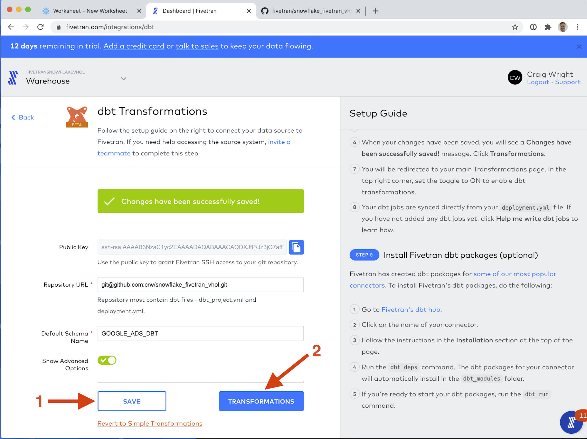

1. Login to your Snowflake trial account.

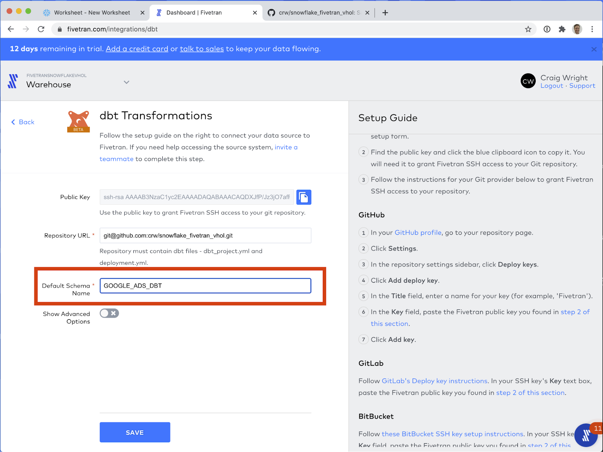

1.  UI Tour \(SE will walk through this live\). For post-workshop participants, click [here](https://docs.snowflake.com/en/user-guide/snowflake-manager.html#quick-tour-of-the-web-interface) for a quick tour of the UI.

1. Let’s change our role and enable notifications. We need to work in the ACCOUNTADMIN role for this lab and notifications are how Snowflake will alert you when resource monitor thresholds have been crossed. Click on your User Name in the upper right-hand corner.

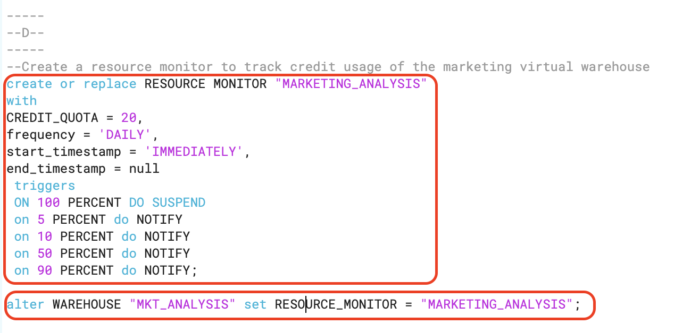

1. You’ll get a popup with 4 items; click on Switch Role.

1. Select ACCOUNTADMIN.

1. The UI will refresh and you should see ACCOUNTADMIN under your username. If you don’t, go back to step 5.

1. Click on your username again and you’ll get the same popup with 4 items; click on Preferences.

1. Click on Notifications.

1. Select **All**, which will send notifications to your email address and this UI \(in the Notifications tile in the upper right\).

1. Now let’s create your Fivetran account. Click on the Partner Connect tile at the top of the UI...

1. ...and then click on the Fivetran tile inside Snowflake Partner Connect. \(if you aren’t in the ACCOUNTADMIN role you’ll receive a warning. Go back and complete steps 6-9.\)

1. Click on Connect.

### 

1. Click on Activate in the pop-up that appears. This will open a new browser tab and take you to Fivetran where you will enter a password for the trial account.

### Fivetran

#### 

In this section we will create an automated data pipeline, with an extract-load \(ELT\) architecture::

1. Extract and Load:
   1. Complete Fivetran Account Setup
   2. Upload Sample Adwords Data using the Fivetran Google Sheets Connector
2. Transform:
   1. Create our first dbt project
   2. Setup Fivetran dbt Transformations

Let’s get started!

## 1. COMPLETE FIVETRAN ACCOUNT SETUP

#### 

1. Create a password.

#### 

2. That is it! Hang out on this screen until the next section.

To log into Fivetran in the future, you can navigate to [https://fivetran.com/dashboard](https://fivetran.com/dashboard). Your email is the same as your Snowflake email \(at the time you connected with Partner Connect\) and your password is whatever you entered in Step 1 of this section.

#### 

## 2. UPLOAD SAMPLE ADWORDS DATA WITH GOOGLE SHEETS

_**Note:**_ _The_ **Setup Fivetran dbt Transformations** _section assumes you have uploaded the sample data as outlined in this section. If you used your own Google Ads data, that is fine; you will just need to edit the dbt\_project.yml file as discussed in the next section._

For your convenience we have included sample Google Adwords data in the form of a Google Sheets containing three workbooks. Each workbook corresponds to a table to be synced to the Snowflake warehouse. This gives us the opportunity to explore another Fivetran feature, the Google Sheets connector. Google Sheets is, in fact, the most popular connector used by Fivetran customers. In the next section, we will:

* Use the Google Sheets connector to create a new Schema and Tables
* We will create one Google Sheets connector per table.
* We will use any one of the Google Sheet links found in this document:
  * [**https://github.com/fivetran/snowflake\_fivetran\_vhol/blob/main/LAB\_ASSETS/GSHEETS\_LINKS.md**](https://github.com/fivetran/snowflake_fivetran_vhol/blob/main/LAB_ASSETS/GSHEETS_LINKS.md)

1. Google Sheets is the first connector in the list! Click on **Google Sheets**.

2. You should see the above screen.

3. Please use the following values for the two fields:

* Destination schema: **google\_ads\_demo**
* Destination table: **final\_url\_performance**

4. Scroll down the page a bit, and paste the URL you just copied into the Sheet URL field. _\(_[_Follow these instructions to get a Google Sheets URL_](https://github.com/fivetran/snowflake_fivetran_vhol/blob/main/LAB_ASSETS/GSHEETS_LINKS.md)_.\)_

Then, click the **FIND SHEET** button. This step will take a few moments.

5. In the **Named Range** field, choose **final\_url\_performance**.

6. Click **SAVE & TEST**.

7. When you see **All connection tests passed!**, click the **VIEW CONNECTOR** button.

8. Click **Start Initial Sync**. This will start the data sync into the warehouse! Now any updates to these sheets will be automatically synced to Snowflake.

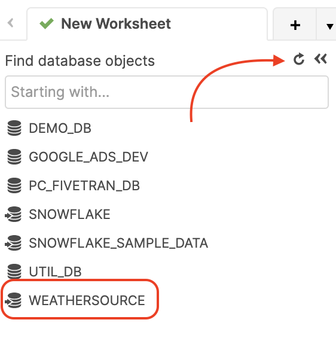

9. Great! The Google Sheets connector is now syncing. Let’s setup the next table. Click the **Connectors** menu.

10. Click the **+ Connector** button.

Please use the following values for the two fields:

* Destination schema: **google\_ads\_demo**
* Destination table: **criteria\_performance**

11. Scroll down the page a bit, and paste the URL you just copied into the Sheet URL field. _\(Use the same Sheets URL as step 4, or_ [_follow these instructions to get a new Google Sheets URL_](https://github.com/fivetran/snowflake_fivetran_vhol/blob/main/LAB_ASSETS/GSHEETS_LINKS.md)_.\)_

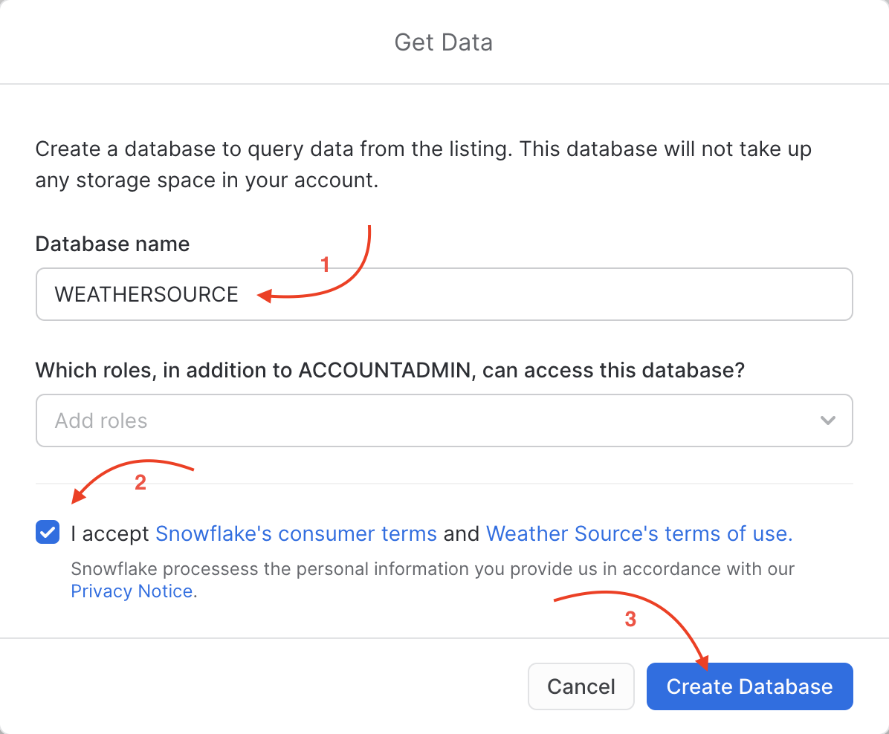

Then, click the **FIND SHEET** button. This step will take a few moments.

12. In the **Named Range** field, choose **criteria\_performance**. Click **SAVE & TEST**.

13. When the connection tests complete, click **VIEW CONNECTOR**.

14. Click **Start Initial Sync**. Then click **Connectors** on the left-hand menu.

15. Click **+ Connector**.

16. Please use the following values for the two fields:

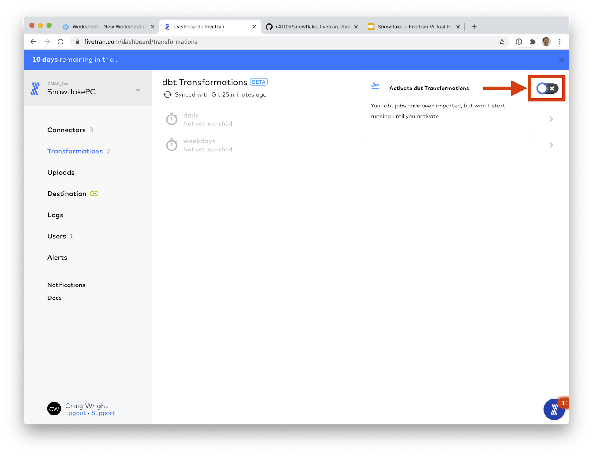

* Destination schema: **google\_ads\_demo**
* Destination table: **click\_performance**

17. Scroll down the page a bit, and paste the URL you just copied into the Sheet URL field. _\(Use the same Sheets URL as step 4, or_ [_follow these instructions to get a new Google Sheets URL_](https://github.com/fivetran/snowflake_fivetran_vhol/blob/main/LAB_ASSETS/GSHEETS_LINKS.md)_.\)_

18. Then, click the **FIND SHEET** button. This step will take a few moments.

19. In the **Named Range** field, choose **click\_performance**. Click **SAVE & TEST**.

20. When the connection tests complete, click **VIEW CONNECTOR**.

21. Click **Start Initial Sync**. Then click **Connectors** on the left-hand menu.

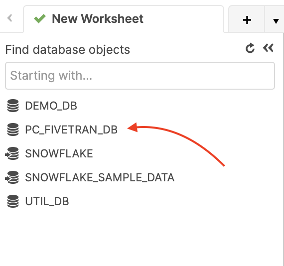

22. Congratulations! You can see your 3 Google Sheets connectors running, each creating one of our three sample data tables. Click on **Google Sheets \(3\).**

This view shows you all of your Google Sheets connectors. Some of your connectors may still be syncing, that is fine; we will have time for them to complete while we perform the next part of the lab.

**In Snowflake \(optional\):** When the sync is complete, you can see your schema and tables in Snowflake’s Worksheet view. You should be able to see the data in the tables by clicking into the **PC\_FIVETRAN\_DB** database, into the **GOOGLE\_ADS\_DEMO** schema, then clicking on one of the tables and then clicking **Preview Data**.

## 3. FORK SAMPLE DBT PROJECT ON GITHUB

_**Note:**_ _The_ **Setup Fivetran dbt Transformations** _section assumes you have uploaded the sample data as outlined in the previous section. If you use your own Google Ads data, that is fine; you will just need to edit the dbt\_project.yml file as discussed in this section._

For your convenience, we have created a sample dbt Github project that is already configured to work with Fivetran’s [dbt\_google\_ads\_source](https://hub.getdbt.com/fivetran/google_ads_source/latest/) and [dbt\_google\_ads](https://hub.getdbt.com/fivetran/google_ads/latest/) packages. You can find the sample repository at the following link:

[https://github.com/fivetran/snowflake\_fivetran\_vhol](https://github.com/fivetran/snowflake_fivetran_vhol)

This section assumes that you have created a Github account and are logged into that account. In this section we are going to:

* Fork the sample github repository.
* Explore the files in the project.

When you click [https://github.com/fivetran/snowflake\_fivetran\_vhol](https://github.com/fivetran/snowflake_fivetran_vhol) and you are logged in, you should see the following screen. Notice the user / owner is [**fivetran**](https://github.com/fivetran) and the repository is named [**snowflake\_fivetran\_vhol**](https://github.com/fivetran/snowflake_fivetran_vhol).

1. On the upper right \(but below your user icon\) is a **Fork** button. Click it!

2. If you have access to multiple github accounts, you will have the option to select into which account to fork this repository. Choose your personal user account. _\(In the screenshot below I have masked the other accounts to which I have access.\)_

That is it! Notice in the screenshot above the user / owner is [**crw**](https://github.com/crw) and the repository is \(still\) named [**snowflake\_fivetran\_vhol**](https://github.com/crw/snowflake_fivetran_vhol) - but now that repository is under your personal Github account. I can now manipulate this repository however I like, without impacting the sample repository.

Congrats! You have successfully created your first dbt project! That was easy!

**The next section is OPTIONAL and not required for the workshop.** It is included for your information only.

There are three very important configuration files to be aware, all at the top level of the file tree.

* **dbt\_project.yml** - general dbt project settings.
* **packages.yml** - include packages that bring functionality to your dbt project, like those provided by Fivetran to enhance your data!
* **deployment.yml** - a Fivetran-specific configuration file that controls how frequently the dbt jobs run.

[**dbt\_project.yml**](https://docs.getdbt.com/reference/dbt_project.yml)

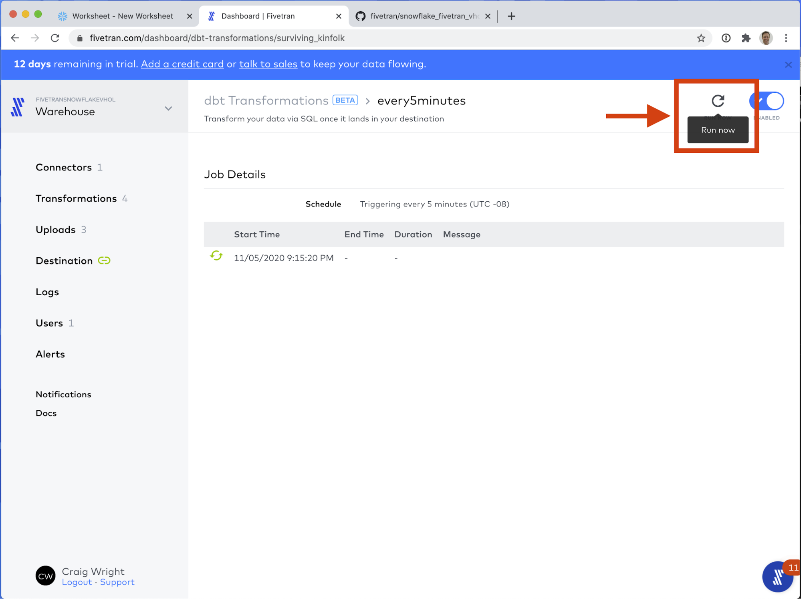

Various configuration settings are found in this file. Please see [dbt’s documentation](https://docs.getdbt.com/reference/dbt_project.yml) for more information on these settings.

**Did You Know?**

As previously mentioned, **if you want to use your own Google Ads data**, you will need to edit **dbt\_project.yml**. You can edit files directly in Github using the pencil icon at the top of the file view _\(mid-upper right, to the right of the Blame button\)_. All you need to do is remove or comment out the lines that say:

vars:  
 google\_ads\_schema: ‘GOOGLE\_ADS\_DEMO’

That’s it! Remove those lines and you are good to go. This assumes, of course, that you loaded your own Google Ads data in the previous section! If you have an **ADWORDS** schema in your Snowflake warehouse, you successfully loaded Google Ads data.

[**packages.yml**](https://docs.getdbt.com/docs/building-a-dbt-project/package-management)

This is where you can include outside packages to run! See [hub.getdbt.com](https://hub.getdbt.com/) for a complete list and installation instructions. As of this writing, Fivetran has created over 17 packages, including packages for Netsuite, Salesforce, Twitter Ads, Marketo, Zendesk, Mailchimp, and more!

[**deployment.yml**](https://fivetran.com/docs/transformations/dbt/setup-guide)

This is a Fivetran-specific file that configures _what_ jobs will run _when_, leveraging a [crontab-style syntax](https://crontab.guru/) for scheduling. Documentation can be found in the file itself. Remember, as described above, you can edit files directly in Github!

#### 

## 4. SETUP FIVETRAN DBT TRANSFORMATIONS

In this section we will take the dbt project we created in the previous section, and run it via Fivetran to generate models! We will be showing how Fivetran is used to orchestrate dbt jobs, and the first step is to connect to your dbt project in Github. There are a lot of steps in this section, but for the most part they are not too complicated. Let’s get started!

_**Note: dbt Transformations in Fivetran are in beta**_ _as of this writing. Depending how you signed up for your Fivetran trial, you may or may not see the option to “Try dbt Transformations”. If you do not see this option, please reach out to us and we will try to get you enabled to try this feature._

If you see this screen, please reach out to Fivetran sales -- we can enable dbt Transformations beta for your account.

1.If you have not already, **switch back to your Fivetran tab in your web browser.**

 First click on the **Transformations** section of your Fivetran interface. You should see the following interface. We will be clicking the button labeled **Try dbt Transformations**.

2. Click **Enable dbt Transformations**.

3. Click **I am ready to connect my Git repo**.

4. Now we will configure the connection to Github. Next to Public Key, click **Copy to Clipboard** \(the papers icon\).

5. On the Github repository we created above \(_your\_username/snowflake\_fivetran\_vhol_\) click on Settings \(farthest-right of the tabs under the repository name.\)

6. On the left-hand navigation, click on **Deploy Keys** \(lower half, under Integrations, above Secrets\).

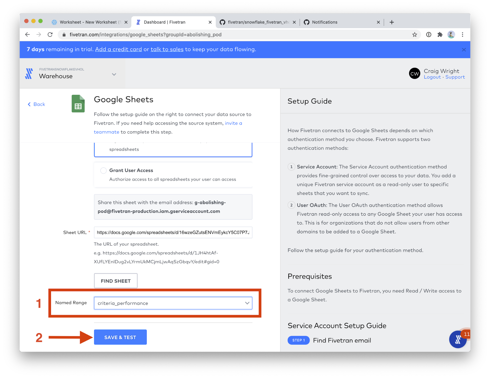

7. Click **Add deploy key**, on the mid-upper-right hand side of the screen.

8. Give the deploy key a memorable, distinct title, like **Fivetran dbt access**.

9. Paste the previously-copied deploy key in the **Key** field.

**Do NOT** check “Allow write access” - currently Fivetran only requires read access to the repository.

10. Click **Add key**.

Phew! Done! If at any time you want to revoke Fivetran’s access to this repository, come back to this screen and delete the deploy key we just created.

11. Before leaving Github, return to the **Code** tab.

12. Now click the green **Code** button. Make sure the **SSH** tab is selected, and copy the:  
**git@github.com:your\_username/snowflake\_fivetran\_vhol.git**  
URL. We will need it on the next step.

**Note:** it is safe to ignore errors about not having an SSH key configured here. The Deploy Key we configured will give Fivetran access to this repository.

13. Paste the value into the **Repository URL** field.

14. For **Default Schema Name** field, enter **GOOGLE\_ADS\_DBT.**

As of this writing, you need to perform the next actions to continue.

**Github has changed their default branch name to “main”**. This change was made very recently, and Fivetran has not yet caught up to the new naming convention. For the time being, for this guide, we will need to manually change the branch name.

15. Click **Show** **Advanced Options**.

16. Change the **Git branch** field’s value to **main**.

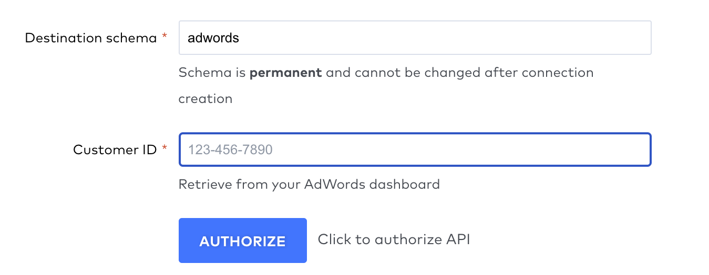

17. Click **SAVE**. Then when you see the green success message, click **TRANSFORMATIONS**.

18. That’s it! Your dbt project is now configured to run and be orchestrated with Fivetran. In the upper right corner, there is a toggle switch, **Activate dbt Transformations**. Click this switch to start your transformations running.

19. Now if left to their own devices, your transformations will run on the schedules listed below. As a reminder, these schedules are configured in the **deployment.yml** file, as discussed in the previous section. But let’s run one right away! Click on the **weekdays** line item.

20. In the upper right corner, click **Run now** \(the circular arrow icon.\)

21. The dbt job runs successfully! Click on the line item with the green checkmark next to it.

22. Here we can see the results of running the dbt job. Click on the down arrow \(caret\) next to run models.

This exposes the results of running the dbt job. If you scroll to the bottom of the page, you can see the job ran successfully.

**Congratulations! You have successfully run your first dbt job!**

**In Snowflake \(optional\):** We can see the results of all of this hard work in the Snowflake Worksheets view. On the left hand column, you can see the **GOOGLE\_ADS\_DBT** schema which has the results of running our dbt job: fresh models, produced simply by including Fivetran’s open source dbt\_google\_ads package! We are that much closer to exposing the true value of this data!

The tables created by these models do the following:

* **GOOGLE\_ADS\_\_CRITERIA\_AD\_ADAPTER**
  * Each record represents the daily ad performance of each criteria in each ad group and campaign.
* **GOOGLE\_ADS\_\_URL\_AD\_ADAPTER**
  * Each record represents the daily ad performance of each URL in each ad group, including information about the used UTM parameters.
* **GOOGLE\_ADS\_\_CLICK\_PERFORMANCE**
  * Each record represents a click, with a corresponding Google click ID \(gclid\).

**Did You Know?**

All of the code that produces these models is open source! Fivetran officially supports over 20 open source dbt packages that model data delivered by Fivetran, typically to provide commonly required aggregations. You can see all of the available packages at [https://hub.getdbt.com/](https://hub.getdbt.com/) - scroll down to the Fivetran section.

The two packages we use in this lab are the Google Ads packages:

#### 

#### The Summary So Far: Maintenance-free data pipelines and powerful in-warehouse transformations

In the previous sections, we learned the following skills:

* How to setup a Fivetran connector \(in this case, a Google Sheets connector\)
* How to create a dbt project by forking the _snowflake\_fivetran\_vhol_ sample repository
* How to enable dbt Transformations in Fivetran by connecting our repository

In doing so, we have set up a complete, end-to-end modern data pipeline focusing on the advantages of the Extract-Load-Transform \(ELT\) architectural approach. Data loading is extremely simple to configure and comes with the benefit of hands-free maintenance, forever. dbt is a powerful transformation tool that comes with many open source Fivetran modeling packages out-of-the-box. Moreover, Fivetran manages the execution of those transformation jobs, and the jobs run natively in the Snowflake warehouse, exposing all of the power of Snowflake’s query engine to your transformations.

### 

## SNOWFLAKE - PART TWO

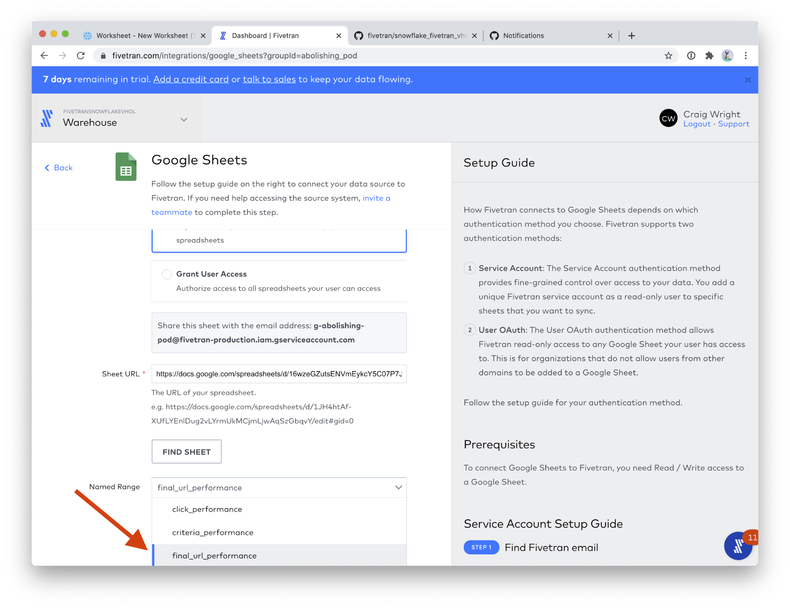

Back in the Snowflake UI, let’s take a quick look at the query history to see all the work that Fivetran/dbt performed.

Click on Add a filter.

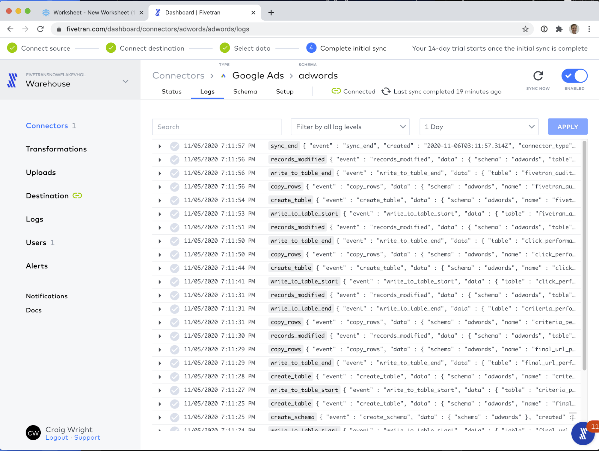

1. Change the left box to User and select PC\_FIVETRAN\_USER in the right box. All of the Fivetran/ dbt queries executed as this user.

1. In the table below you can see all of these queries. Scroll down. Click on a SQL text value and you’ll see a pop-up of the specific SQL statement. You can read about this UI screen [here](https://docs.snowflake.com/en/user-guide/ui-history.html).

1.  Click on the Worksheets tile at the top.

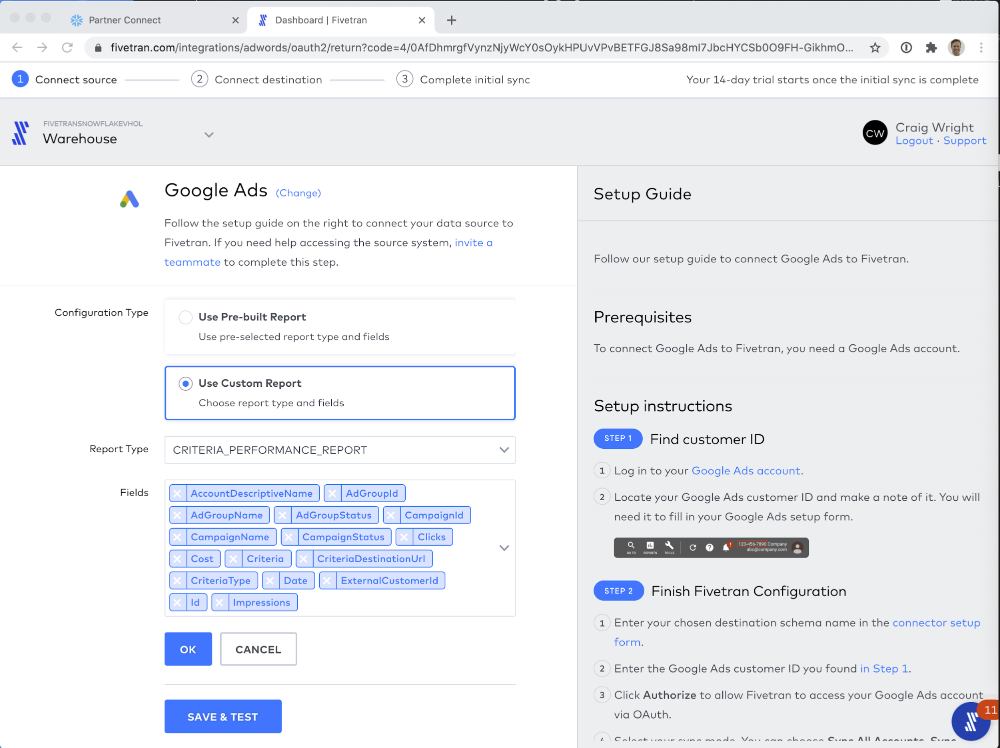

1. Your screen will look like this. This is where we will do most of our remaining work.

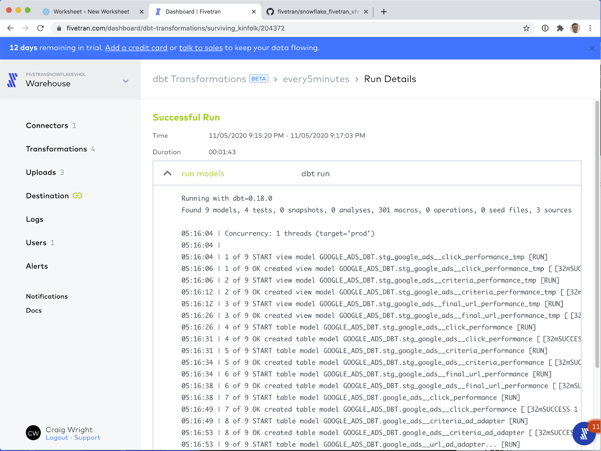

1. Now load the script \([vhol\_script.sql](https://github.com/fivetran/snowflake_fivetran_vhol/raw/main/LAB_ASSETS/vhol_script.sql.zip)\) by clicking on the 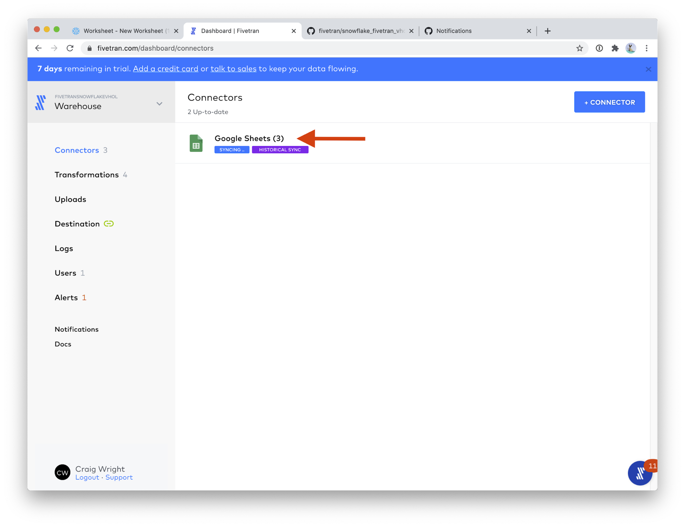button and then selecting in the pop-up. Navigate your computer and find the script.

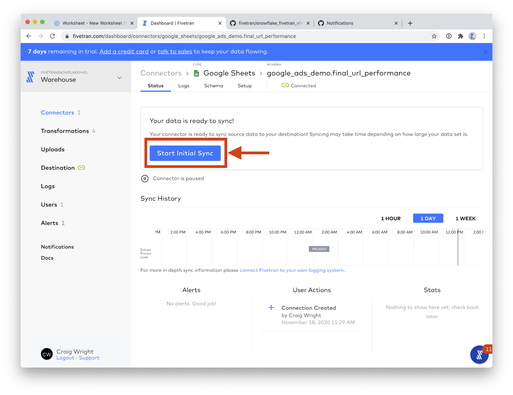

1. The script should appear in your worksheet like this.

1. Notice on the left-hand side is a database browser with a database called PC\_FIVETRAN\_DB. This is the database that you loaded with Fivetran. Click on it and you will see the schemas. GOOGLE\_ADS\_DEMO is where the data initially loaded and GOOGLE\_ADS\_DBT is the schema created by the dbt process. Click on GOOGLE\_ADS\_DBT and you’ll see the tables and views that live within.

1. Let’s start our work performing DBA functions. We need to set the context we want to use within the worksheet. In each worksheet I can have a different role, warehouse, database, and schema. Each worksheet is independent of the others \(like Snowflake compute!\). My worksheet role can also be different from the role I have in the upper right-hand corner under my name.

Let’s execute the SQL in script section **A** to set our worksheet context. To do so, highlight the two lines \(_use role..., use schema..._\) and click the button.

\(You may get a pop-up asking if you want to run both statements. If you don’t want this warning every time, click in the check box and click OK. \)

Notice that your worksheet context now has a default role, database, and schema but no warehouse \(yet\).

1. Let’s pretend that the data we loaded and transformed with Fivetran is our production data. We only want it to be changed by our Fivetran process. Since our analysts will want to experiment with and change the data, we’ll **CLONE** the entire PC\_FIVETRAN\_DB database so they can have their own sandbox. This is a _logical_ copy; it will consume no additional space unless the data in the clone starts to change. This is a fantastic tool for creating as many sandboxes as you need. It also works well for making time-specific snapshots.

_**Cloning**_ **reduces time to value - full production clones are fast and support more accurate analytical results because they are rich and complete data sets.**

1.  Run the **Create Database** SQL and the **Use Schema** commands in section **B** to make a clone, then refresh the database browser with the \(small\) button:

Now your analysts have GOOGLE\_ADS\_DEV - a complete clone of PC\_FIVETRAN\_DB.

1. Next we need to create a warehouse \(compute\) for the analysts.

For this workshop we’ll create an Extra Small - the smallest unit of Snowflake compute - with an auto suspend time of 2 minutes and auto resume enabled. Auto resume means it will start up when a request is made. Run the SQL in section **C** to create the warehouse. Notice that this warehouse is now in your worksheet context.

_**Snowflake compute is unique. It’s \(1\) easy to define and manage; \(2\) fast to activate and suspend; \(3\) self-suspending; \(4\) self-healing; \(5\) isolated from the storage layer; \(6\) isolated from other compute; \(7\) quick to scale up/down and out/in; \(8\) non-disruptive when any of this is happening.**_

1. For our last act as DBA we’ll create a **resource monito**r to track warehouse consumption. Resource monitors are convenient tools for setting time-based consumption thresholds on compute at the warehouse or account level. You can set alerts for various thresholds and even prevent a warehouse from running once it reaches a credit value that you set.

Run the two SQL statements in section **D** to create a resource monitor that has a daily 20 credit limit, sends an alert at 5%, 10%, 50%, and 99% thresholds, and suspends the warehouse at 100% \(20 credits\). The second statement associates the resource monitor to the warehouse.

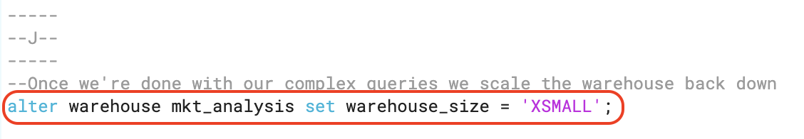

1. Now we’ll switch to ‘Analyst mode’. In real life this would be a different person with a different userid and a different Role. An analyst might write a query like the one in section **E** of the script to answer the question “What was the best performing cranberry sauce campaign?” Go ahead and run it. We’re working with tiny data sets in the lab but in reality we might run over millions or billions of rows.

1. These are interesting results, but you have a hypothesis: clicks increase with snowy weather. Let’s go to the Snowflake Data Marketplace and find what we need. The Data Marketplace lives in the new UI called **Snowsight** \(currently in Preview mode but feel free to test drive after the lab\). Click on Preview App at the top of the UI.

1. Click ‘Sign in to continue’. You will need to use the same user and pw that you used to login to your Snowflake account the first time.

1. You’re now in the new UI - Snowsight. It’s pretty cool - with charting and dashboards and context-sensitivity - but today we’re just focused on getting to the Data Marketplace. Click on **Data**…

1. ...and then **Marketplace**…

1. ...and now you’re in! Over 100 providers have made datasets available for you to enrich your data. Today we’re going to grab a sample of weather data. Click the **Ready to Query** checkbox…

1. And then find the **Weather Source** tile. Once you find it, click on it.

1. Here you’ll find a description of the data, example queries, and other useful information. Let’s get this data into our Snowflake account. You’ll be amazed at how fast and easy this is. Click .

1. In the pop-up, rename the database to WEATHERSOURCE \(important!\), check the “I accept…” box and then . No need to add additional roles \(though you might in real-life\).

What is happening here? Weather Source has granted access to this data from their Snowflake account to yours. You’re creating a new database in your account for this data to live - but the best part is that no data is going to move between accounts! When you query you’ll really be querying the data that lives in the Weather Source account. If they change the data you’ll automatically see those changes. No need to define schemas, move data, or create a data pipeline either. Isn’t that slick?

1. Now click **Done**. You can close this browser tab and go back to the other Snowflake UI that you started in.

1. Refresh the database browser and notice you have a new shared database, ready to query and join with your data. Click on it and you’ll see views under the PUBLIC schema. We’ll use one of these next.

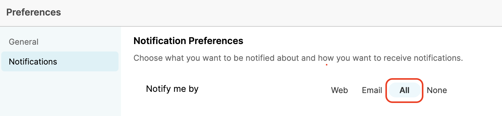

1. With production-sized data sets we are likely to have very large tables and complex queries; therefore, we might want to increase the amount of compute we’re using to perform this analysis. In Snowflake this is fast and easy. Run the statement in section **G**. Notice how fast it scales up. No disruption. No shuffling of data. We’ve changed from an XS \(one node cluster\) to an XL \(16 node cluster\) in seconds. Ready to go!

1. So, let’s join that weather data to our Google Ads data and see if there is a correlation between clicks and snowfall. Run the correlation query in section **H**. Remember that we’re actually joining data across two accounts, but the experience and performance is seamless and fast.

It’s a weak correlation so maybe our hypothesis isn’t worth exploring further. But our ability to quickly source Marketplace data and mash it with our own data has saved us lots of time and we can iterate further.

1. Because this combination may yet have value, let’s create a view that combines the correlations with the URL data so others can take a look more easily. Run the SQL in section **I**. One creates the view and the other queries it.

1. Now that our heavy lifting is done, let’s scale down the warehouse size. No need to pay for more compute than we need. Run the SQL in section **J**.

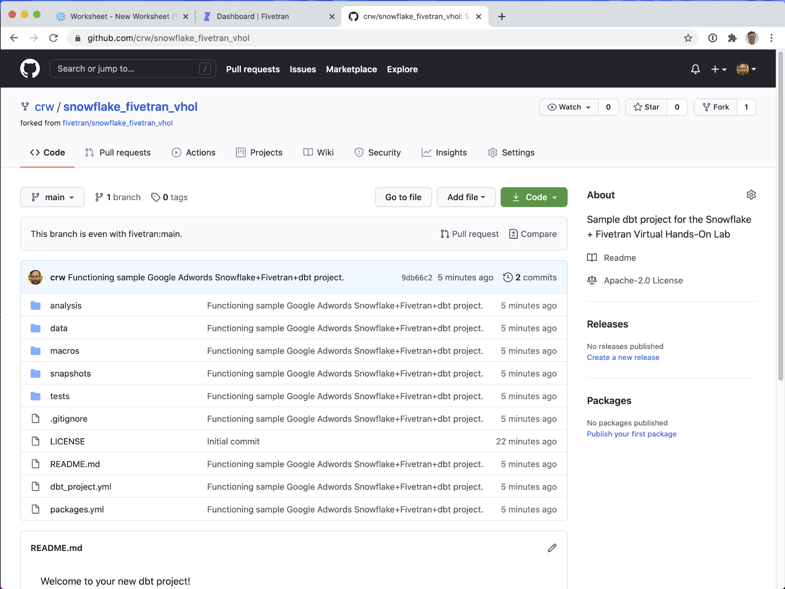

1. For our last trick let’s imagine we’ve accidentally dropped the table we’re working with. No one has ever done that! Run the DROP statement in section K and then refresh the database browser. Notice the table is gone. Now run the UNDROP and refresh. It’s back! This is the power of time travel. You can restore lost data for up to 90 days of history.

_**Time Travel also enables you to query and replace tables as of a particular point in time or prior to a specific SQL statement.**_

1. One last thing. How is our Snowflake consumption looking? It’s easy to understand. We’ll look in two places. First, you might have a Notification, so click on that tile. When you have notifications enabled and resource monitors built, you’ll get notifications.

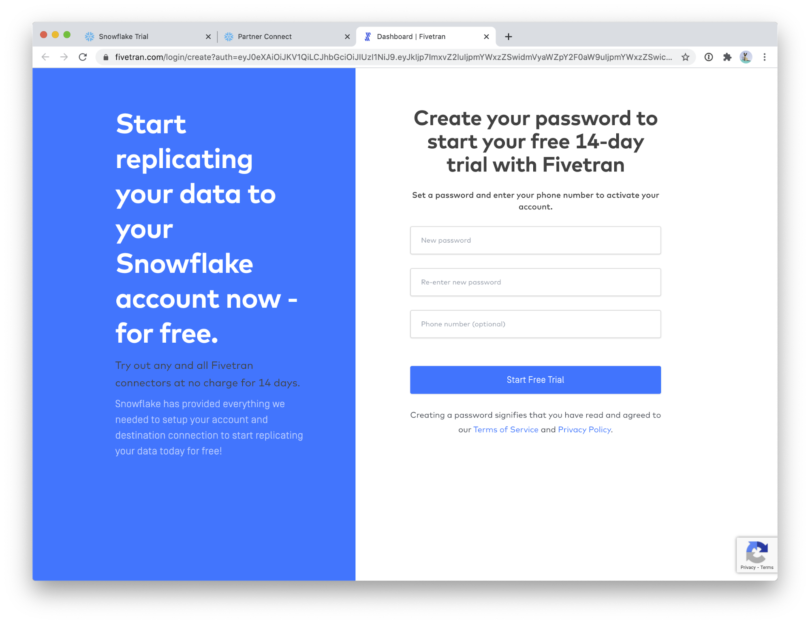

1. See anything that looks like this? These notifications come from the resource monitor we set up earlier in the lab. You’ll also get emails with the same information.

1. Now, click on the Account tile.

1. Then click on Usage.

1. Here you can see monthly/daily credit usage…

1. ...and monthly/daily storage usage \(you won’t see much for storage yet since our data is small\). In addition to these screens you can query the Snowflake metadata layer for the same info and build reports in your favorite BI tool.

This concludes the lab. We hope you learned a lot and are interested in exploring Fivetran and Snowflake for your use cases. Please feel free to ask questions.

### 

## 

Status on the timeline, as per below.

