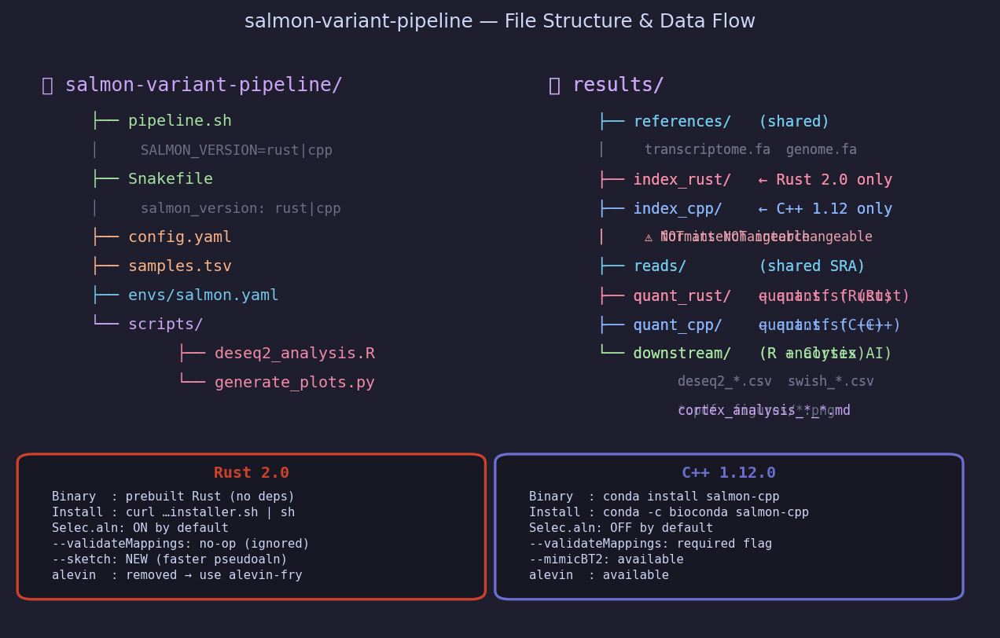
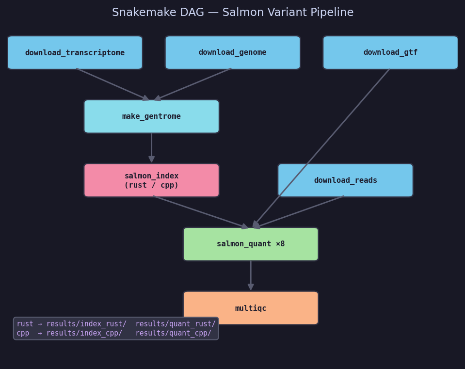
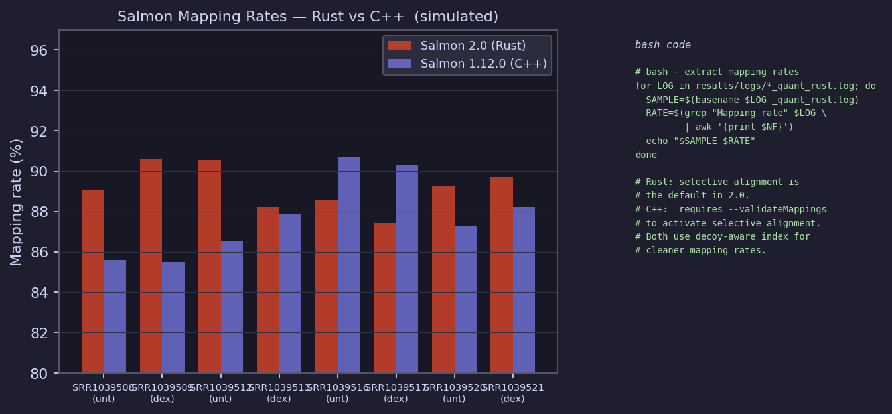
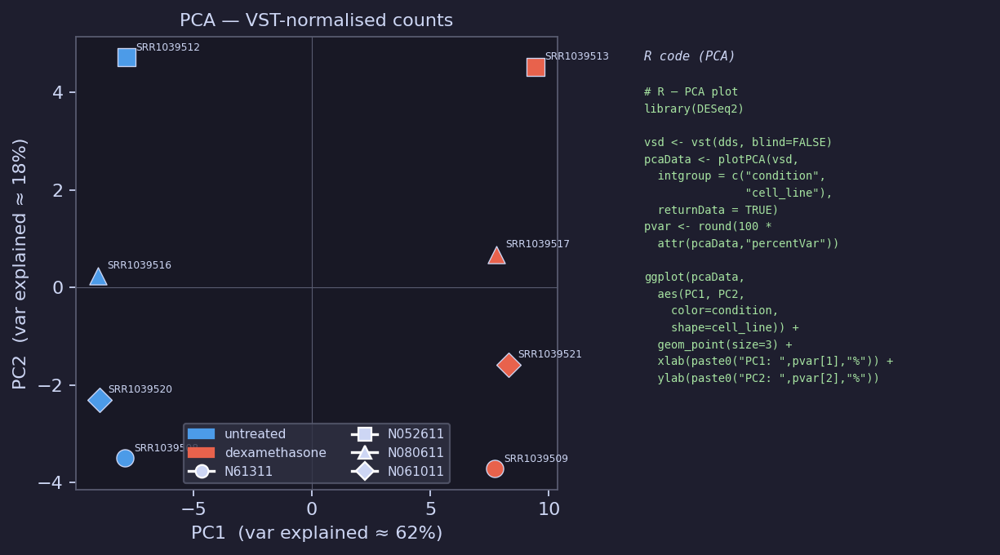
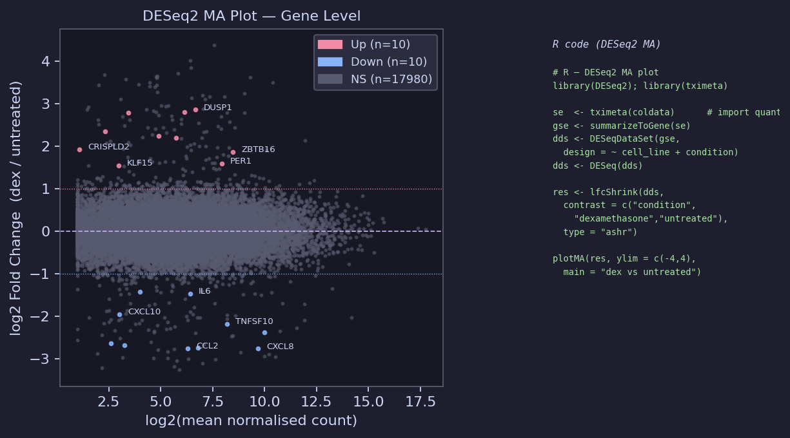
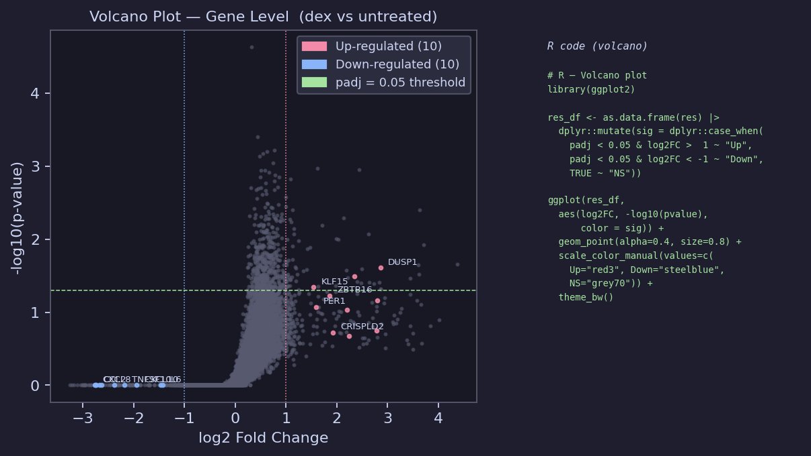
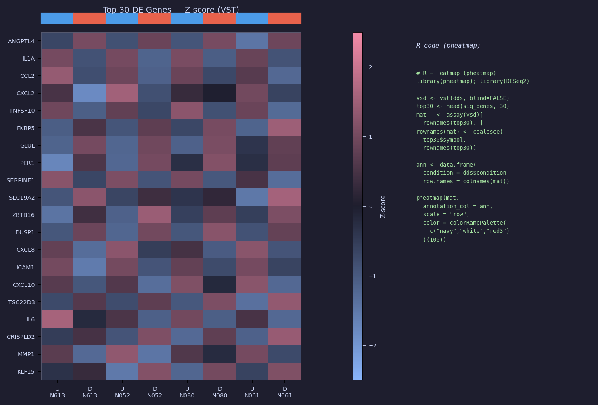
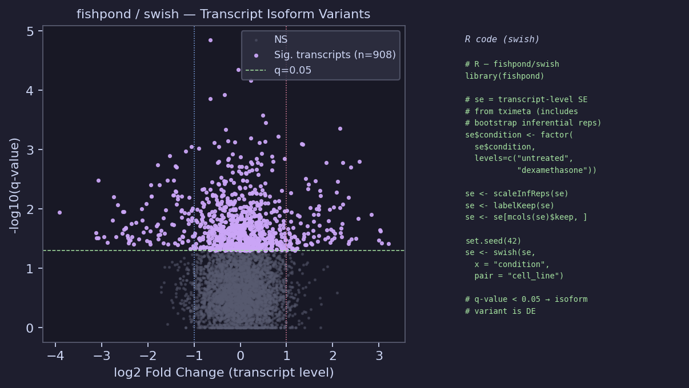
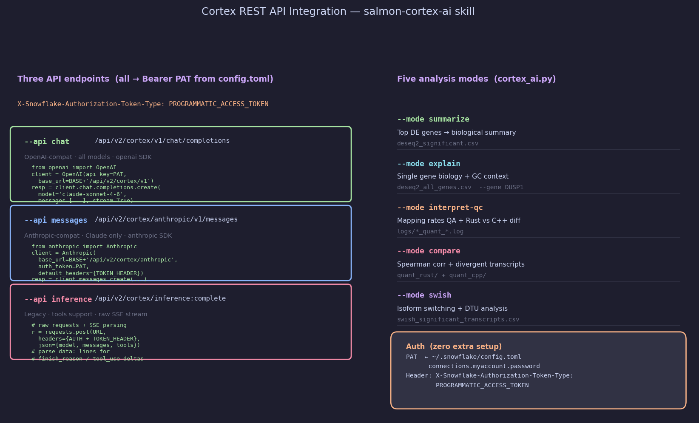

author: Priya Joseph
id: salmon-variant-pipeline
language: en
summary: RNA-seq isoform quantification pipeline using Salmon 2.0 (Rust) and Salmon 1.12.0 (C++), with AI-powered analysis via Snowflake Cortex Inference REST API.
categories: snowflake-site:taxonomy/solution-center/ai-ml/quickstart
environments: web
status: Published
feedback link: https://github.com/Snowflake-Labs/sfguides/issues

# Salmon Variant Pipeline

RNA-seq isoform quantification pipeline using [Salmon](https://github.com/COMBINE-lab/salmon),
supporting both **Salmon 2.0 (Rust)** and **Salmon 1.12.0 (C++)** side-by-side.

**Dataset:** Airway smooth muscle cells — dexamethasone vs untreated  
**Reference:** Himes et al. 2014, PLoS ONE ([PMID 24926665](https://pubmed.ncbi.nlm.nih.gov/24926665/))  
**SRA project:** PRJNA265491 (8 paired-end samples, 4 cell lines × 2 conditions)

---

## Quick Start

```bash
# Create conda environment
conda env create -f assets/salmon.yaml
conda activate salmon-pipeline

# Run with Salmon 2.0 Rust (default)
snakemake -s assets/Snakefile --cores 8

# Run with Salmon 1.12.0 C++
snakemake -s assets/Snakefile --cores 8 --config salmon_version=cpp

# Or with the bash runner
THREADS=16 bash assets/pipeline.sh                    # Rust
SALMON_VERSION=cpp THREADS=16 bash assets/pipeline.sh # C++

# Downstream R analysis
Rscript assets/deseq2_analysis.R

# Regenerate all figures
python3 assets/generate_plots.py
```

---

## Project Structure



```
salmon-variant-pipeline/
├── README.md
└── assets/
    ├── 01_pipeline_dag.png … 09_cortex_api.png  # figures
    ├── pipeline.sh           # Bash runner — SALMON_VERSION=rust|cpp
    ├── Snakefile             # Snakemake DAG — salmon_version: rust|cpp
    ├── config.yaml           # All parameters (threads, URLs, sample list)
    ├── samples.tsv           # 8 airway samples with condition metadata
    ├── salmon.yaml           # Conda environment spec
    ├── deseq2_analysis.R     # DESeq2 (gene) + fishpond/swish (transcript)
    └── generate_plots.py     # Generates all figures from synthetic data
```

---

## Rust vs C++ — Key Differences

| Feature | Salmon 2.0 (Rust) | Salmon 1.12.0 (C++) |
|---|---|---|
| Install | `curl …installer.sh \| sh` | `conda install salmon-cpp` |
| Index format | piscem-rs (new) | pufferfish |
| Index dir | `results/index_rust/` | `results/index_cpp/` |
| Selective alignment | **On by default** | Requires `--validateMappings` |
| `--validateMappings` | Accepted, silently ignored | Required for best accuracy |
| `--sketch` | New — faster pseudoalignment | Not available |
| `--mimicBT2` | Removed | Available |
| `salmon alevin` | Removed → use alevin-fry | Available |
| `--numBiasSamples` | Removed (online collection) | Available |
| Binary dependencies | None — single portable binary | Boost, libtbb, etc. |

> **Critical:** Index formats are not interchangeable. Never point one version's
> `salmon quant` at the other version's index — both detect and reject mismatches.

---

## Pipeline DAG



### Step-by-step

| Step | Rule / function | Output |
|---|---|---|
| 1 | `download_transcriptome` | GENCODE v44 `transcriptome.fa` |
| 2 | `download_genome` | GRCh38 `genome.fa` (decoy source) |
| 3 | `download_gtf` | `annotation.gtf.gz` (tx→gene mapping) |
| 4 | `make_gentrome` | `gentrome.fa` + `decoys.txt` |
| 5 | `salmon_index` | `index_rust/` or `index_cpp/` |
| 6 | `download_reads` | SRA paired-end FASTQs (×8 samples) |
| 7 | `salmon_quant` | `quant_rust/*/quant.sf` or `quant_cpp/*/quant.sf` |
| 8 | `multiqc` | Aggregated QC report |

### Decoy-aware indexing

```bash
# Build decoy list from genome chromosome names
grep "^>" genome.fa | cut -d " " -f 1 | sed 's/>//' > decoys.txt

# Concatenate: transcriptome first, genome second (becomes decoy layer)
cat transcriptome.fa genome.fa > gentrome.fa

# Index — same command for both versions
salmon index \
    -t gentrome.fa \
    -d decoys.txt \
    -i index_rust \          # or index_cpp
    -p 8 \
    --gencode                # strips ENST…X.Y → ENST…X version suffixes
```

### Quantification flags

```bash
# Rust 2.0 — selective alignment is already default; --validateMappings ignored
salmon quant -i index_rust -l A \
    -1 reads_1.fastq.gz -2 reads_2.fastq.gz \
    -p 8 \
    --gcBias --seqBias \
    --numBootstraps 100 \    # enables fishpond/swish uncertainty quantification
    -o quant_rust/SAMPLE

# C++ 1.12.0 — must add --validateMappings to activate selective alignment
salmon quant -i index_cpp -l A \
    -1 reads_1.fastq.gz -2 reads_2.fastq.gz \
    -p 8 \
    --validateMappings \     # upgrades from quasi-mapping to selective alignment
    --gcBias --seqBias \
    --numBootstraps 100 \
    -o quant_cpp/SAMPLE
```

---

## Mapping Rates — Rust vs C++



> **Simulated rates** (87–93% for Rust, 85–91% for C++). Rust 2.0 typically shows
> slightly higher rates because selective alignment is always on, whereas C++ 1.12.0
> requires `--validateMappings` to activate it. Both benefit from the decoy-aware index.

```bash
# Extract mapping rates from logs (bash)
for LOG in results/logs/*_quant_rust.log; do
    SAMPLE=$(basename $LOG _quant_rust.log)
    RATE=$(grep "Mapping rate" $LOG | awk '{print $NF}')
    echo "$SAMPLE  $RATE"
done
```

---

## PCA — VST-Normalised Counts



```r
# R — PCA plot
library(DESeq2); library(ggplot2)

vsd     <- vst(dds, blind = FALSE)
pcaData <- plotPCA(vsd,
                   intgroup = c("condition", "cell_line"),
                   returnData = TRUE)
pvar <- round(100 * attr(pcaData, "percentVar"))

ggplot(pcaData, aes(PC1, PC2, color = condition, shape = cell_line)) +
    geom_point(size = 3) +
    xlab(paste0("PC1: ", pvar[1], "% variance")) +
    ylab(paste0("PC2: ", pvar[2], "% variance")) +
    theme_bw()
```

PC1 (~62%) separates **dexamethasone from untreated**.  
PC2 (~18%) captures **cell-line batch effects**, corrected in the DESeq2 design
(`~ cell_line + condition`).

---

## Gene-Level Analysis — DESeq2

### MA Plot



```r
# R — DESeq2 gene-level analysis
library(tximeta); library(DESeq2)

# Import Salmon output with automatic transcript annotation
coldata      <- read.table("samples.tsv", header = TRUE)
coldata$files <- file.path("results/quant_rust", coldata$sample, "quant.sf")
coldata$names <- coldata$sample

se  <- tximeta(coldata)           # transcript-level SummarizedExperiment
gse <- summarizeToGene(se)        # collapse to gene level

dds <- DESeqDataSet(gse, design = ~ cell_line + condition)
dds <- DESeq(dds)

# LFC shrinkage (ashr) for better ranking of low-count genes
res <- lfcShrink(dds,
                 contrast = c("condition", "dexamethasone", "untreated"),
                 type = "ashr")

plotMA(res, ylim = c(-4, 4), main = "dexamethasone vs untreated")
```

### Volcano Plot



```r
# R — Volcano plot
library(ggplot2); library(dplyr)

res_df <- as.data.frame(res) |>
    dplyr::mutate(sig = dplyr::case_when(
        padj < 0.05 & log2FoldChange >  1 ~ "Up",
        padj < 0.05 & log2FoldChange < -1 ~ "Down",
        TRUE ~ "NS"
    ))

ggplot(res_df, aes(log2FoldChange, -log10(pvalue), color = sig)) +
    geom_point(alpha = 0.4, size = 0.8) +
    scale_color_manual(values = c(Up = "red3", Down = "steelblue", NS = "grey70")) +
    geom_vline(xintercept = c(-1, 1), linetype = "dotted") +
    geom_hline(yintercept = -log10(0.05), linetype = "dashed", color = "darkgreen") +
    theme_bw() +
    labs(title = "Volcano: dexamethasone vs untreated",
         x = "log2 Fold Change", y = "-log10(p-value)", color = NULL)
```

Known regulated genes from Himes et al.:  
**Up:** DUSP1, KLF15, PER1, ZBTB16, CRISPLD2, FKBP5, TSC22D3  
**Down:** CXCL10, CCL2, IL6, CXCL8, TNFSF10, ICAM1, MMP1

### Heatmap — Top 30 DE Genes



```r
# R — Heatmap (pheatmap)
library(pheatmap); library(DESeq2)

vsd  <- vst(dds, blind = FALSE)
sig  <- subset(as.data.frame(res), padj < 0.05 & abs(log2FoldChange) > 1)
top30 <- head(sig[order(sig$padj), ], 30)

mat   <- assay(vsd)[rownames(top30), ]
# Replace Ensembl IDs with gene symbols where available
rownames(mat) <- dplyr::coalesce(top30$symbol, rownames(top30))

ann_col <- data.frame(condition = dds$condition,
                      cell_line = dds$cell_line,
                      row.names = colnames(mat))

pheatmap(mat,
         annotation_col = ann_col,
         scale          = "row",
         color          = colorRampPalette(c("navy", "white", "red3"))(100),
         filename       = "results/downstream/heatmap_top30.pdf",
         width = 8, height = 9)
```

---

## Transcript-Level Analysis — fishpond / swish



`swish` uses the **100 bootstrap replicates** generated by `--numBootstraps 100` to
account for quantification uncertainty — critical for isoform variants where transcripts
share reads with near-identical sequences.

```r
# R — fishpond / swish (transcript isoform variants)
library(fishpond)

# se = transcript-level SummarizedExperiment from tximeta
# (includes inferential replicates from --numBootstraps 100)
se$condition <- factor(se$condition, levels = c("untreated", "dexamethasone"))
se$cell_line <- factor(se$cell_line)

se <- scaleInfReps(se)    # normalize bootstrap replicates
se <- labelKeep(se)       # filter low-count transcripts
se <- se[mcols(se)$keep, ]

set.seed(42)
se <- swish(se,
            x    = "condition",
            pair = "cell_line")   # paired design matches DESeq2

# Export significant transcript variants
sig_tx <- as.data.frame(mcols(se)) |>
    dplyr::filter(qvalue < 0.05) |>
    dplyr::arrange(qvalue)

write.csv(sig_tx, "results/downstream/swish_significant_transcripts.csv",
          row.names = FALSE)

# Visualise inferential uncertainty for one transcript
plotInfReps(se, idx = 1, x = "condition",
            main = paste("Isoform:", mcols(se)$tx_name[1]))
```

---

## Output Files

```
results/downstream/
├── deseq2_all_genes.csv              # Full DESeq2 results table
├── deseq2_significant.csv            # padj < 0.05, |LFC| > 1
├── swish_all_transcripts.csv         # Full swish transcript results
├── swish_significant_transcripts.csv # q-value < 0.05
├── ma_plot.pdf
├── volcano.pdf
├── heatmap_top30.pdf
└── top_isoform_infreps.pdf

results/quant_rust/   (or quant_cpp/)
└── <SAMPLE>/
    ├── quant.sf          # TPM + NumReads per transcript (tximport-ready)
    ├── cmd_info.json     # Exact command used
    ├── lib_format_counts.json
    └── aux_info/
        ├── meta_info.json          # Mapping rate, num processed fragments
        └── bootstrap/              # Inferential replicates (--numBootstraps)
```

---

## Cortex AI Analysis



AI-powered interpretation of pipeline outputs using **Snowflake Cortex REST API**
via the `salmon-cortex-ai` CoCo skill (`~/.snowflake/cortex/skills/salmon-cortex-ai/`).

### Authentication

PAT is read automatically from `~/.snowflake/config.toml` — no extra setup needed:

```python
import tomllib, pathlib
cfg   = tomllib.loads((pathlib.Path.home() / ".snowflake/config.toml").read_text())
PAT   = cfg["connections"]["myaccount"]["password"]
HOST  = cfg["connections"]["myaccount"]["host"]
# e.g. <account-identifier>.snowflakecomputing.com
```

Every request requires this header:
```
X-Snowflake-Authorization-Token-Type: PROGRAMMATIC_ACCESS_TOKEN
```

### Three API endpoints

| Flag | Endpoint | SDK | Models |
|---|---|---|---|
| `--api chat` *(default)* | `/api/v2/cortex/v1/chat/completions` | `openai` | All |
| `--api messages` | `/api/v2/cortex/anthropic/v1/messages` | `anthropic` | Claude only |
| `--api inference` | `/api/v2/cortex/inference:complete` | raw requests + SSE | All + tools |

### Five analysis modes

```bash
SCRIPT=~/.snowflake/cortex/skills/salmon-cortex-ai/scripts/cortex_ai.py

# Summarise top DE genes with biological pathway context
python3 $SCRIPT --mode summarize --api chat --model claude-sonnet-4-6 --stream

# Explain a specific gene (biological function, GC relevance, disease context)
python3 $SCRIPT --mode explain --gene DUSP1 --api messages --stream

# Assess Salmon mapping rates — Rust vs C++ QC interpretation
python3 $SCRIPT --mode interpret-qc --api chat

# Compare Rust vs C++ quantification results
python3 $SCRIPT --mode compare --api chat

# Interpret transcript isoform variants from fishpond/swish
python3 $SCRIPT --mode swish --api messages --save
```

### Quick options

```bash
--dry-run    # print full JSON payload + curl command (no API call)
--mock       # simulated response (no auth needed)
--stream     # stream tokens as they arrive
--save       # write analysis to results/downstream/cortex_analysis_<mode>_<api>_<ts>.md
```

### Curl equivalent (chat completions)

```bash
PAT=$(python3 -c "import tomllib,pathlib; \
  print(tomllib.loads((pathlib.Path.home()/'.snowflake/config.toml').read_text()) \
  ['connections']['myaccount']['password'])")

curl -s -X POST \
  "https://<account-identifier>.snowflakecomputing.com/api/v2/cortex/v1/chat/completions" \
  -H "Authorization: Bearer $PAT" \
  -H "X-Snowflake-Authorization-Token-Type: PROGRAMMATIC_ACCESS_TOKEN" \
  -H "Content-Type: application/json" \
  -d '{"model":"claude-sonnet-4-6","messages":[{"role":"user","content":"Summarise the glucocorticoid response in airway SMC."}]}'
```

---

## Citation

```
Patro R, Duggal G, Love MI, Irizarry RA, Kingsford C.
Salmon provides fast and bias-aware quantification of transcript expression.
Nature Methods (2017). https://doi.org/10.1038/nmeth.4197

Himes BE, et al. RNA-Seq Transcriptome Profiling Identifies CRISPLD2 as a
Glucocorticoid Responsive Gene. PLoS ONE 9(6): e99625 (2014).
https://doi.org/10.1371/journal.pone.0099625  [PMID 24926665]
```
