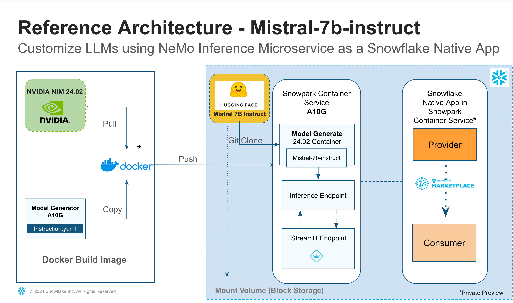
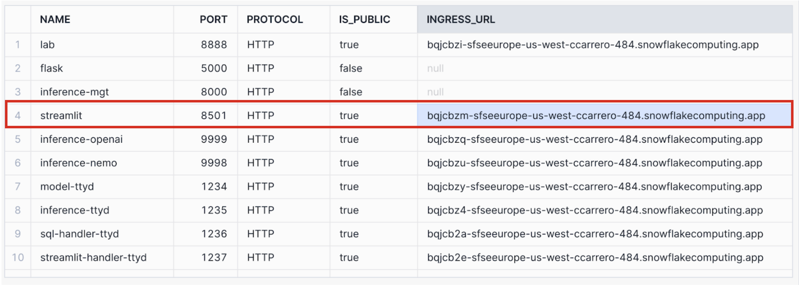

authors: Karuna Nadadur, Kamesh Sampath
id: build_llm_app_nvidia_scs
categories: snowflake-site:taxonomy/solution-center/certification/quickstart, snowflake-site:taxonomy/product/ai, snowflake-site:taxonomy/snowflake-feature/model-development, snowflake-site:taxonomy/snowflake-feature/ml-functions, snowflake-site:taxonomy/snowflake-feature/snowpark-container-services
language: en
summary: Build LLM App Powered By NVIDIA on Snowpark Container Services
environments: web
status: Archived
feedback link: <https://github.com/Snowflake-Labs/sfguides/issues>

# Build LLM App Powered By NVIDIA on Snowpark Container Services

<!-- ------------------------ -->

## Overview


This quickstart primarily shows how to download a Large Language Model [Mistral-7b-instruct v0.1](https://huggingface.co/mistralai/Mistral-7B-Instruct-v0.1) from [HuggingFace](https://huggingface.co/) and then shrink the model size to fit in a smaller GPU(A10G->GPU_NV_M) on [NemoLLM Inference Microservice NIMs](https://registry.ngc.nvidia.com/orgs/ohlfw0olaadg/teams/ea-participants/containers/nemollm-inference-ms/tags) Container using the [model_generator](https://github.com/Snowflake-Labs/sfguide-build-ai-app-using-nvidia-snowpark-container-services/blob/main/docker/inference/modelgenerator.sh) and [instruct.yaml](https://github.com/Snowflake-Labs/sfguide-build-ai-app-using-nvidia-snowpark-container-services/blob/main/docker/inference/instruct.yaml) provided by NVIDIA.



If you are interested in shrinking a different Large Language Model from Huggingface, you need a different `instruct.yaml` file that will generate a new model which will fit in a smaller GPU.

### What You Will Learn

- Build Snowflake LLM Native App powered by NVIDIA Inference microservices
- Download Mistral-7b-instruct LLM from Huggingface
- Generate a new model using model generator on NIM container
- Publish Mistral Inference App as internal Snowflake Native Application
- Launch the Inference Server using Snowpark Container Services
- Expose the Inference Service as Streamlit Application

### Prerequisites

#### NVIDIA

In this example, we are not downloading the model hosted on [nvcr.io](https://registry.ngc.nvidia.com/orgs/ohlfw0olaadg/teams/ea-participants/containers/nemollm-inference-ms/tags), but we will still be using [NIMs Inference Microservices container](https://registry.ngc.nvidia.com/orgs/ohlfw0olaadg/teams/ea-participants/containers/nemollm-inference-ms/tags) for optimized GPU performance.[Register and create your login credentials](https://ngc.nvidia.com/) and get yourself added to a organisation/team.

#### Huggingface

Since you are downloading the model from Huggingface, you need to

- Register and create a [HuggingFace](https://huggingface.co/) user
- Create a [user access token](https://huggingface.co/docs/hub/en/security-tokens) to clone a model using git_lfs into your destination. This is a required step to clone any Large Language model such as Mistral-7b-instruct v0.1
- Edit and update [model_generator.sh](https://github.com/Snowflake-Labs/sfguide-build-ai-app-using-nvidia-snowpark-container-services/blob/main/docker/inference/modelgenerator.sh) and replace the `user` and `token` with your huggingface user and access token that you created in the previous step.

```shell
....
git clone https://<user>:<token>@huggingface.co/mistralai/Mistral-7B-Instruct-v0.1 /blockstore/clone
....
```

> aside positive
>
> The folder where the model (git clone) gets downloaded is a block storage that is mounted in the Snowpark Container Service. The model size is somewhere ~55 GB and then the new model that would be generated is ~14 GB. So as a best practice, we should mount and use the blockstorage when launching the Snowflake Container. Follow [documentation](https://docs.snowflake.com/en/developer-guide/snowpark-container-services/block-storage-volume) on how to use block storage when creating the service in snowpark container

> aside negative
> This is a Native App - Snowpark Container Service implementing the NVIDIA NeMo Microservices inference service. You need to have the NA<>SPCS feature enabled in your account in the regions where it is available. So please reach out to your **Snowflake Account Representative** if you wish to build this App.

- A Snowflake account(Non Trial) with [Standard Edition](https://docs.snowflake.com/en/user-guide/intro-editions#standard-edition) will work for most of this lab, but if you’d like to try governance features such as Data masking etc, you will need [Enterprise](https://docs.snowflake.com/en/user-guide/intro-editions#enterprise-edition) or [Business Critical Edition](https://docs.snowflake.com/en/user-guide/intro-editions#business-critical-edition).

- A storage bucket with the same cloud provider in the same region that hosts your Snowflake account above. Direct credential access required as storage integrations are not supported for External Volumes.

<!-- ------------------------ -->

## Model Generator Explained


Model Generator [model_generator.sh](https://github.com/Snowflake-Labs/sfguide-build-ai-app-using-nvidia-snowpark-container-services/blob/main/docker/inference/modelgenerator.sh) script downloads `Mistral LLM` model from Huggingface and using NIMs and `model_generator` package shrink the LLM model to fit to a smaller GPU (`A10G = GPU_NV_M`).

Let us dissect the [model_generator.sh](https://github.com/Snowflake-Labs/sfguide-build-ai-app-using-nvidia-snowpark-container-services/blob/main/docker/inference/modelgenerator.sh) script and understand what the model generator does,

1. Create Folders to download model from huggingface and a folder to store the model generated.

```shell
mkdir /blockstore/clone
mkdir -p /blockstore/model/store
```

2. Git Clone LLM model to Block Storage folder

```shell
git clone https://<user>:<token>@huggingface.co/mistralai/Mistral-7B-Instruct-v0.1 /blockstore/clone
```

3. Generate new model that is shrunk for A10G(GPU_NV_M) into the Blockstorage folder

```shell
model_repo_generator llm --verbose --yaml_config_file=/home/ubuntu/instruct.yaml
```

4. Finally create Soft links of the "ensemble" and "trt_llm" folders to the root /model-store folder.

```shell
ln -s /blockstore/model/store/ensemble /model-store/ensemble
ln -s /blockstore/model/store/trt_llm_0.0.1_trtllm /model-store/trt_llm_0.0.1_trtllm
```

<!-- ------------------------ -->

## Inference Service Explained


The Inference service executes the `model_generator.sh` to generate the model and launch the `triton` inference server with requested/assigned number of GPUs.

The Inference service is configured using an YAML as shown,

```yaml
- name: inference
    image: /NVIDIA_NEMO_MS_MASTER/code_schema/service_repo/nemollm-inference-ms:24.02.nimshf
    command:
    - /bin/bash
    args:
    - -c
    - "(ttyd -p 1235 -W bash &> /tmp/ttyd.log &);sh modelgenerator.sh; nemollm_inference_ms --model mistral --openai_port=9999 --nemo_port=9998 --num_gpus={{num_gpus_per_instance}}"
    env:
      CUDA_VISIBLE_DEVICES: {{cuda_devices}}
    resources:
      requests:
        nvidia.com/gpu: {{num_gpus_per_instance}}
      limits:
        nvidia.com/gpu: {{num_gpus_per_instance}}
```

<!-- ------------------------ -->

## Download Demo Sources


Clone the guide demo sources,

```shell
git clone https://github.com/Snowflake-Labs/sfguide-build-ai-app-using-nvidia-snowpark-container-services
```

Navigate to the demo source folder, and export the source folder to an environment variable `$DEMO_HOME`,

```shell
cd sfguide-build-ai-app-using-nvidia-snowpark-container-services
export DEMO_HOME="$PWD"
```

<!-- ------------------------ -->

## Create Provider and Consumer Roles


On your Snowsight worksheet run the following SQL commands to create the Snowflake Native App `Provider` and `Consumer` roles,

```sql
USE ROLE ACCOUNTADMIN;

CREATE ROLE NVIDIA_LLM_APP_PROVIDER_ROLE;
GRANT CREATE DATABASE ON ACCOUNT TO ROLE NVIDIA_LLM_APP_PROVIDER_ROLE;
GRANT CREATE WAREHOUSE ON ACCOUNT TO ROLE NVIDIA_LLM_APP_PROVIDER_ROLE;
GRANT CREATE COMPUTE POOL ON ACCOUNT TO ROLE NVIDIA_LLM_APP_PROVIDER_ROLE;
GRANT CREATE INTEGRATION ON ACCOUNT TO ROLE NVIDIA_LLM_APP_PROVIDER_ROLE;
GRANT CREATE APPLICATION PACKAGE ON ACCOUNT TO ROLE NVIDIA_LLM_APP_PROVIDER_ROLE;
GRANT CREATE APPLICATION  ON ACCOUNT TO ROLE NVIDIA_LLM_APP_PROVIDER_ROLE ;
GRANT CREATE DATA EXCHANGE LISTING  ON ACCOUNT TO ROLE NVIDIA_LLM_APP_PROVIDER_ROLE;
GRANT IMPORT SHARE ON ACCOUNT TO ROLE NVIDIA_LLM_APP_PROVIDER_ROLE;
GRANT CREATE SHARE ON ACCOUNT TO ROLE NVIDIA_LLM_APP_PROVIDER_ROLE;
GRANT MANAGE EVENT SHARING ON ACCOUNT TO ROLE NVIDIA_LLM_APP_PROVIDER_ROLE;
GRANT CREATE DATA EXCHANGE LISTING ON ACCOUNT TO  ROLE NVIDIA_LLM_APP_PROVIDER_ROLE;
GRANT BIND SERVICE ENDPOINT ON ACCOUNT TO ROLE NVIDIA_LLM_APP_PROVIDER_ROLE WITH GRANT OPTION;

GRANT ROLE NVIDIA_LLM_APP_PROVIDER_ROLE to USER <USER_NAME>;

CREATE ROLE NVIDIA_LLM_APP_CONSUMER_ROLE;
GRANT CREATE DATABASE ON ACCOUNT TO ROLE NVIDIA_LLM_APP_CONSUMER_ROLE;
GRANT CREATE WAREHOUSE ON ACCOUNT TO ROLE NVIDIA_LLM_APP_CONSUMER_ROLE;
GRANT CREATE COMPUTE POOL ON ACCOUNT TO ROLE NVIDIA_LLM_APP_CONSUMER_ROLE;
GRANT CREATE INTEGRATION ON ACCOUNT TO ROLE NVIDIA_LLM_APP_CONSUMER_ROLE;
GRANT CREATE APPLICATION  ON ACCOUNT TO ROLE NVIDIA_LLM_APP_CONSUMER_ROLE ;
GRANT IMPORT SHARE ON ACCOUNT TO ROLE NVIDIA_LLM_APP_CONSUMER_ROLE;
GRANT CREATE SHARE ON ACCOUNT TO ROLE NVIDIA_LLM_APP_CONSUMER_ROLE;
GRANT MANAGE EVENT SHARING ON ACCOUNT TO ROLE NVIDIA_LLM_APP_CONSUMER_ROLE;
GRANT BIND SERVICE ENDPOINT ON ACCOUNT TO ROLE NVIDIA_LLM_APP_CONSUMER_ROLE WITH GRANT OPTION;

GRANT ROLE NVIDIA_LLM_APP_CONSUMER_ROLE to USER <USER_NAME>;
```

<!-- ------------------------ -->

## Snowflake Native App Prerequisite


```sql
SET COMPUTE_POOL_NAME = 'my-compute-pool';
-- ########## BEGIN INITIALIZATION  ######################################
-- Create Compute pool using GPU_NV_M instance family
CREATE COMPUTE POOL $COMPUTE_POOL_NAME
  MIN_NODES=1
  MAX_NODES=1
  INSTANCE_FAMILY=GPU_NV_M; -- DO NOT CHANGE SIZE AS THE instruct.yaml is defined to work on A10G GPU with higher memory.
                            -- GPU_NV_S may work but not guarenteed.

SET APP_OWNER_ROLE = 'SPCS_PSE_PROVIDER_ROLE';
SET APP_WAREHOUSE = 'XS_WH';
SET APP_COMPUTE_POOL = $COMPUTE_POOL_NAME;
SET APP_DISTRIBUTION = 'INTERNAL'; -- change to external when you are ready to publish outside your snowflake organization

USE ROLE identifier($APP_OWNER_ROLE);

-- DROP DATABASE IF EXISTS NVIDIA_NEMO_MS_APP_PKG ; --OPTIONAL STEP IF YOU WANT TO DROP THE APPLICATION PACKAGE. DONT UNCOMMENT

USE WAREHOUSE identifier($APP_WAREHOUSE);

CREATE DATABASE IF NOT EXISTS NVIDIA_NEMO_MS_MASTER;
USE DATABASE NVIDIA_NEMO_MS_MASTER;
CREATE SCHEMA IF NOT EXISTS CODE_SCHEMA;
USE SCHEMA CODE_SCHEMA;
CREATE IMAGE REPOSITORY IF NOT EXISTS SERVICE_REPO;

CREATE APPLICATION PACKAGE IF NOT EXISTS NVIDIA_NEMO_MS_APP_PKG;

USE DATABASE NVIDIA_NEMO_MS_APP_PKG;
CREATE SCHEMA IF NOT EXISTS CODE_SCHEMA;
CREATE STAGE IF NOT EXISTS APP_CODE_STAGE;

-- ##########  END INITIALIZATION   ######################################

SHOW IMAGE REPOSITORIES;

-- Copy the image repository URL and use it to push the image from Docker installed machine (AWS EC2 instance preferred) to Snowflake.
-- STOP HERE AND UPLOAD ALL REQUIRED CONTAINERS INTO THE IMAGE REPO
-- Follow steps in 'docker.md' to run the commands using docker installed machine (AWS EC2 instance preferred).
-- Follow Docker Setup steps to push images to snowflake image repository
```

<!-- ------------------------ -->

## Docker Setup


Register at <https://org.ngc.nvidia.com/setup/api-key> and download your nvcr.io login credentials. Let use store the credentials in the environment variable named `$NVCR_DOCKER_USER` and `$NVCR_DOCKER_API_KEY`,

Login to nvcr.io,

```shell
echo -n "$NVCR_DOCKER_API_KEY" | docker login nvcr.io --user "$NVCR_DOCKER_USER" --password-stdin
```

### Build Images

After successful login build the following images that will be used by the Snowflake Native app,

```shell
cd "$DEMO_HOME/docker"
```

Build the image associated to the Inference service,

```shell
docker build . -t inference:v01
```

Build the model storage image,

```shell
docker build . -t model-store:v01
```

Build the Snowflake handler to manage the Snowflake and Streamlit environment,

```shell
docker build . -t snowflake_handler:v01
```

Lab provides the Juypter lab environment,

```shell
docker build . -t lab:v01
```

List the images we built so far,

```shell
docker images
```

### Push Images to Snowflake Image Registry

Get the Snowflake Image Registry URL using the command,

```sql
SHOW SHOW IMAGE REPOSITORIES
```

Let use store the Snowflake Image Registry URL as `$SNOWFLAKE_IMAGE_REGISTRY_URL`

Login in to the Snowflake Image registry,

```shell
echo "$SNOWFLAKE_PASSWORD" | docker login "$SNOWFLAKE_IMAGE_REGISTRY_URL" --user "$SNOWFLAKE_USER" --password-stdin
```

Tag all the application images that we built earlier,

```shell
docker tag inference:v01 "$SNOWFLAKE_IMAGE_REGISTRY_URL/nvidia_nemo_ms_master/code_schema/service_repo/nemollm-inference-ms:24.02.nimshf"
docker tag model-store:v01 "$SNOWFLAKE_IMAGE_REGISTRY_URL/nvidia_nemo_ms_master/code_schema/service_repo/nvidia-nemo-ms-model-store:v01"
docker tag snowflake_handler:v01 "$SNOWFLAKE_IMAGE_REGISTRY_URL/nvidia_nemo_ms_master/code_schema/service_repo/snowflake_handler:v0.4"
docker tag lab:v01 "$SNOWFLAKE_IMAGE_REGISTRY_URL/nvidia_nemo_ms_master/code_schema/service_repo/snowflake_jupyterlab:v0.1"
```

Push all the images built earlier to `$SNOWFLAKE_IMAGE_REGISTRY_URL`,

```shell
docker push "$SNOWFLAKE_IMAGE_REGISTRY_URL/nvidia_nemo_ms_master/code_schema/service_repo/nemollm-inference-ms:24.02.nimshf"
docker push "$SNOWFLAKE_IMAGE_REGISTRY_URL/nvidia_nemo_ms_master/code_schema/service_repo/nvidia-nemo-ms-model-store:v01"
docker push "$SNOWFLAKE_IMAGE_REGISTRY_URL/nvidia_nemo_ms_master/code_schema/service_repo/snowflake_handler:v0.4"
docker push "$SNOWFLAKE_IMAGE_REGISTRY_URL/nvidia_nemo_ms_master/code_schema/service_repo/snowflake_jupyterlab:v0.1"
```

Check if the `instruct.yaml` and `modelgenerator.sh` files are available on the container images,

```shell
docker run --rm=true "$SNOWFLAKE_IMAGE_REGISTRY_URL/nvidia_nemo_ms_master/code_schema/service_repo/nemollm-inference-ms:24.02.nimshf" -- ls
```

<!-- ------------------------ -->

## As a Provider


```sql
USE ROLE NVIDIA_LLM_APP_PROVIDER_ROLE;
```

### Create Native App

Create NIM Application by running the [nims_app_pkg.sql](https://github.com/Snowflake-Labs/sfguide-build-ai-app-using-nvidia-snowpark-container-services/blob/main/Native%20App/Provider/02%20nims_app_pkg.sql) on your Snowsight worksheet.

### Test Application

Let us test the application before it is published,

```sql
use database NVIDIA_NEMO_MS_APP;
use schema app1;
-- call core.start_app_instance($APP_INSTANCE);
-- call core.stop_app_instance($APP_INSTANCE);
-- call core.drop_app_instance($APP_INSTANCE);
-- call core.restart_app_instance($APP_INSTANCE);
call core.list_app_instance($APP_INSTANCE);
call core.get_app_endpoint($APP_INSTANCE);
```

<!-- ------------------------ -->

## Publish Your Native App


> aside positive
> Before you publish the App, try to test your App [locally](https://docs.snowflake.com/en/developer-guide/native-apps/installing-testing-application)

Run the following script to publish the Native application,

If you are sharing internally within your Snowflake Org, you can keep the App Distribution as `internal` but if you are sharing externally then you need to assign the App Distribution as `external`.

```sql
-- ##### BEGIN CREATE/PATCH TEST APP (DO NOT REBUILD THE APP) RUN ONLY ONCE TO CREATE APP ###########
DECLARE
  APP_INSTANCE VARCHAR DEFAULT 'APP1';
BEGIN
  ALTER APPLICATION NVIDIA_NEMO_MS_APP UPGRADE USING VERSION V0_1;
  CALL NVIDIA_NEMO_MS_APP.CORE.RESTART_APP_INSTANCE(:APP_INSTANCE);
  LET rs1 RESULTSET := (CALL NVIDIA_NEMO_MS_APP.CORE.GET_APP_ENDPOINT(:APP_INSTANCE));
  RETURN TABLE(rs1);
END;
-- ########## END CREATE TEST APP   ######################################


-- ########## BEGIN PUBLISH (REQUIRED FOR EVERY UPGRADE)  ############################################
ALTER APPLICATION PACKAGE NVIDIA_NEMO_MS_APP_PKG
   SET DISTRIBUTION = $APP_DISTRIBUTION;

DECLARE
  max_patch VARCHAR;
BEGIN
  show versions in application package NVIDIA_NEMO_MS_APP_PKG;
  select max("patch") INTO :max_patch FROM TABLE(RESULT_SCAN(LAST_QUERY_ID())) where "version" = 'V0_1';
  LET rs RESULTSET := (EXECUTE IMMEDIATE 'ALTER APPLICATION PACKAGE NVIDIA_NEMO_MS_APP_PKG SET DEFAULT RELEASE DIRECTIVE VERSION = V0_1 PATCH = '||:max_patch);
  RETURN TABLE(rs);
END;
```

<!-- ------------------------ -->

## As a Consumer


Follow the [steps](https://other-docs.snowflake.com/en/native-apps/consumer-about) to download and install the Native App.

### Launch Snowflake Native App

After you have installed the App on the consumer account, use the following template to launch the Native App on the consumer account,

```sql
set APP_INSTANCE='<NAME>';
-- replace current_database() with a 'DATABASE NAME OF YOUR CHOICE' if compute pool create fails
set APP_DATABASE=current_database();
set APP_COMPUTE_POOL='NVIDIA_NEMO_'||$APP_INSTANCE;
set APP_CUDA_DEVICES='<LIST OF DEVICE NUMBERS>';
set APP_NUM_GPUS_PER_INSTANCE=1;
set APP_NUM_INSTANCES=1;
set APP_MAX_TOKEN=500;
set APP_TEMPERATURE=0.0;
set APP_TIMEOUT=1800;

set APP_LOCAL_DB=$APP_DATABASE||'_LOCAL_DB';
set APP_LOCAL_SCHEMA=$APP_LOCAL_DB||'.'||'EGRESS';
set APP_LOCAL_EGRESS_RULE=$APP_LOCAL_SCHEMA||'.'||'NVIDIA_MS_APP_RULE';
set APP_LOCAL_EAI = $APP_DATABASE||'_EAI';

set APP_TEST_STMT='select '||$APP_INSTANCE||'.inference(\'Who founded Snowflake? Please be brief.\','||$APP_MAX_TOKEN||','||$APP_TEMPERATURE||');';

-- if this step fails , replace current_database() with a 'DATABASE NAME OF YOUR CHOICE'
CREATE COMPUTE POOL IF NOT EXISTS IDENTIFIER($APP_COMPUTE_POOL) FOR APPLICATION IDENTIFIER($APP_DATABASE)
  MIN_NODES=1
  MAX_NODES=1
  INSTANCE_FAMILY=GPU_NV_M;

CREATE DATABASE IF NOT EXISTS IDENTIFIER($APP_LOCAL_DB);
CREATE SCHEMA IF NOT EXISTS IDENTIFIER($APP_LOCAL_SCHEMA);

CREATE or REPLACE NETWORK RULE IDENTIFIER($APP_LOCAL_EGRESS_RULE)
  TYPE = 'HOST_PORT'
  MODE= 'EGRESS'
  VALUE_LIST = ('0.0.0.0:443','0.0.0.0:80');

-- If this statement is failing, it is because database NVIDIA_MS_APP_LOCAL_DB doesnt exist
-- Check the value of $APP_LOCAL_DB and replace NVIDIA_MS_APP_LOCAL_DB with the value of $APP_LOCAL_DB
CREATE OR REPLACE EXTERNAL ACCESS INTEGRATION IDENTIFIER($APP_LOCAL_EAI)
  ALLOWED_NETWORK_RULES = (NVIDIA_NEMO_MS_APP_LOCAL_DB.EGRESS.NVIDIA_MS_APP_RULE)
  ENABLED = true;

GRANT USAGE ON DATABASE IDENTIFIER($APP_LOCAL_DB) TO APPLICATION IDENTIFIER($APP_DATABASE);
GRANT USAGE ON SCHEMA IDENTIFIER($APP_LOCAL_SCHEMA) TO APPLICATION IDENTIFIER($APP_DATABASE);
GRANT USAGE ON NETWORK RULE IDENTIFIER($APP_LOCAL_EGRESS_RULE) TO APPLICATION IDENTIFIER($APP_DATABASE);

GRANT USAGE ON INTEGRATION IDENTIFIER($APP_LOCAL_EAI) TO APPLICATION  IDENTIFIER($APP_DATABASE);
GRANT USAGE ON COMPUTE POOL IDENTIFIER($APP_COMPUTE_POOL) TO APPLICATION IDENTIFIER($APP_DATABASE);
GRANT BIND SERVICE ENDPOINT ON ACCOUNT TO APPLICATION IDENTIFIER($APP_DATABASE);

GRANT USAGE ON COMPUTE POOL IDENTIFIER($APP_COMPUTE_POOL) TO APPLICATION IDENTIFIER($APP_DATABASE);

call core.initialize_app_instance(
  $APP_INSTANCE
  ,$APP_COMPUTE_POOL
  ,$APP_CUDA_DEVICES
  ,$APP_NUM_GPUS_PER_INSTANCE
  ,$APP_NUM_INSTANCES
  ,$APP_LOCAL_EAI
  ,$APP_TIMEOUT);
-- call core.start_app_instance($APP_INSTANCE);
-- call core.stop_app_instance($APP_INSTANCE);
-- call core.drop_app_instance($APP_INSTANCE);
-- call core.restart_app_instance($APP_INSTANCE);
call core.list_app_instance($APP_INSTANCE);
call core.get_app_endpoint($APP_INSTANCE);
-- SELECT $APP_TEST_STMT;
```

Wait for the Native Applications to be running, typically after the app has been successfully launched, the App will show the status as `Ready(Running)`.

Use the following SQL to check the status and get Endpoint URL,

```sql
USE DATABASE NVIDIA_NEMO_MS_APP;
USE SCHEMA <APP schema>; -- This schema is based on where the app was created.
CALL CORE.LIST_APP_INSTANCE('APP1'); -- MAKE SURE ALL CONTAINERS ARE READY
CALL CORE.GET_APP_ENDPOINT('APP1'); -- GET APP ENDPOINTS TO ACCESS STREAMLIT APP
```

<!-- ------------------------ -->

### Exposing Consumer App using Streamlit


Get the Native App endpoint URL,

```sql
CALL CORE.GET_APP_ENDPOINT('APP1')
```



Copy the endpoint URL next to the Streamlit App and launch that URL on a browser to open the Streamlit App.

<!-- ------------------------ -->

## Conclusion And Resources


Congratulations! You've successfully created build and deployed a Snowflake LLM Native App powered by NVDIA using Snowpark Container Services.

### What You Learned

Learnt How-To,

- Build Snowflake LLM Native App powered by NVIDIA Inference microservices
- Download Mistral-7b-instruct LLM from Huggingface
- Generate a new model using model generator on NIM container
- Publish Mistral Inference App as internal Snowflake Native Application
- Launch the Inference Server using Snowpark Container Services
- Expose the Inference Service as Streamlit Application

### Related Resources

- [Mistral-7B-Instruct](https://huggingface.co/mistralai/Mistral-7B-Instruct-v0.1)
- [NeMo Microservices](https://developer.nvidia.com/nemo-microservices)
- [Snowflake Native Apps](/en/data-cloud/workloads/applications/native-apps/)
- [Snowpark Container Services](https://docs.snowflake.com/en/developer-guide/snowpark-container-services/overview)
