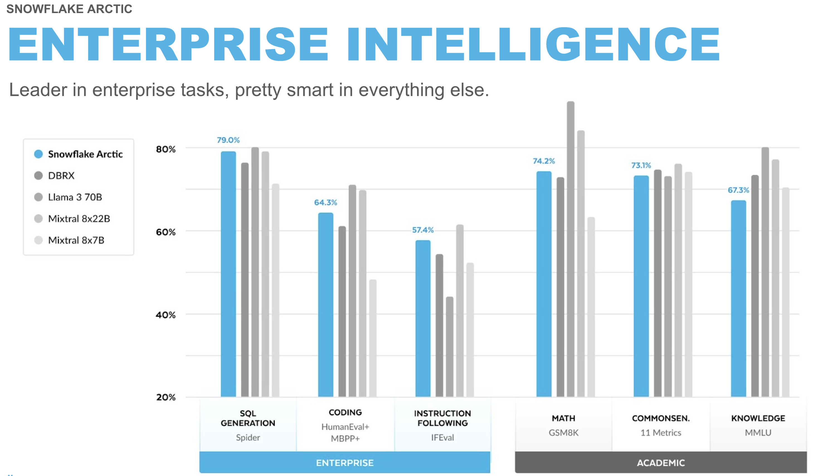
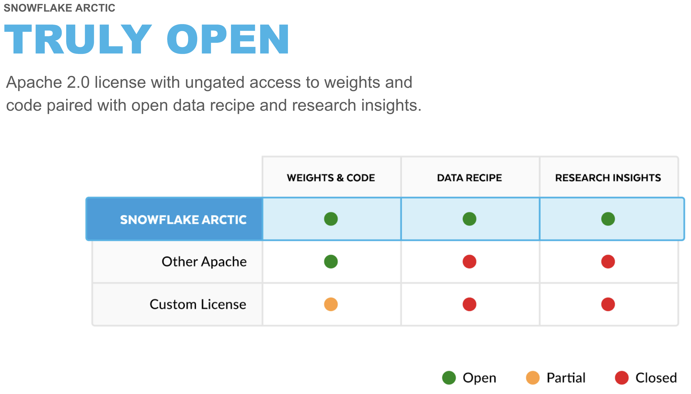
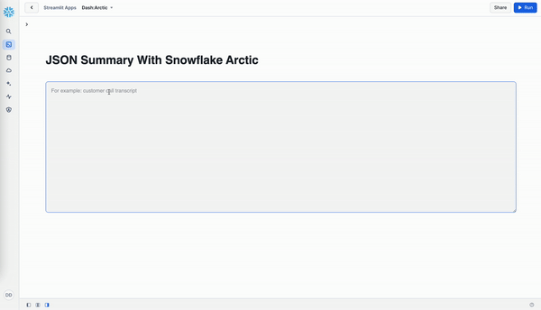

id: getting_started_with_snowflake_arctic
categories: snowflake-site:taxonomy/solution-center/certification/quickstart, snowflake-site:taxonomy/product/data-engineering, snowflake-site:taxonomy/product/applications-and-collaboration
language: en
summary: This guide provides the instructions for writing a Streamlit application that uses Snowflake Arctic for custom tasks like summarizing long-form text into JSON formatted output using prompt engineering and Snowflake Cortex task-specific LLM functions to perform operations like translate text between languages or score the sentiment of a piece of text.
environments: web
status: Archived
feedback link: <https://github.com/Snowflake-Labs/sfguides/issues>
authors: Dash Desai

# A Getting Started Guide With Snowflake Arctic and Snowflake Cortex 
<!-- ------------------------ -->
## Overview


Getting started with AI on enterprise data can seem overwhelming, between getting familiar with LLMs, how to perform custom prompt engineering, and how to get a wide range of LLMs deployed/integrated to run multiple tests all while keeping that valuable enterprise data secure. Well, a lot of these complexities are being abstracted away for you in Snowflake Cortex. 

In this guide, we will go through two flows – for the first three examples we will not have to worry about prompt engineering and, as a bonus, another example where we will build a prompt for a custom task and see [Snowflake Arctic](/en/data-cloud/arctic/) in action!

### What is Snowflake Cortex?
Snowflake Cortex is an intelligent, fully managed service that offers machine learning and AI solutions to Snowflake users. Snowflake Cortex capabilities include:

LLM Functions: SQL and Python functions that leverage large language models (LLMs) for understanding, querying, translating, summarizing, and generating free-form text.

ML Functions: SQL functions that perform predictive analysis such as forecasting and anomaly detection using machine learning to help you gain insights into your structured data and accelerate everyday analytics.

Learn more about [Snowflake Cortex](https://docs.snowflake.com/en/user-guide/snowflake-cortex/overview).

### What is Snowflake Arctic?

Snowflake Arctic is a family of enterprise-grade models built by Snowflake. The family includes a set of embedding models that excel in retrieval use cases and a general-purpose LLM that exhibits top-tier intelligence in enterprise tasks such as SQL generation, code generation, instruction following and more. All of these models are available for all types of academic and commercial use under an Apache 2.0 license. 

----



----



Learn more about [benchmarks and how Snowflake Arctic was built](/blog/arctic-open-efficient-foundation-language-models-snowflake/).

### What You Will Learn

How to use Snowflake Arctic for custom tasks like summarizing long-form text into JSON formatted output using prompt engineering and Snowflake Cortex task-specific LLM functions to perform operations like translate text between languages or score the sentiment of a piece of text.

### What You Will Build

An interactive Streamlit application running in Snowflake.



### Prerequisites

- A [Snowflake](https://signup.snowflake.com/?utm_cta=quickstarts_) account in a region where Snowflake Cortex and Arctic are available. [Check availability](https://docs.snowflake.com/en/user-guide/snowflake-cortex/llm-functions#label-cortex-llm-availability).

<!-- ------------------------ -->
## Setup


Prior to GenAI, a lot of the information was buried in text format and therefore going underutilized for root cause analysis due to complexities in implementing natural language processing. But with Snowflake Cortex it’s as easy as writing a SQL statement! 

In this guide, we'll utilize synthetic call transcripts data, mimicking text sources commonly overlooked by organizations, including customer calls/chats, surveys, interviews, and other text data generated in marketing and sales teams.

Let’s create the table and load the data.

### Create Table and Load Data

Log into [Snowsight](https://docs.snowflake.com/en/user-guide/ui-snowsight.html#) using your credentials to create tables and load data from Amazon S3.

> aside positive
> IMPORTANT:
>
> - If you use different names for objects created in this section, be sure to update scripts and code in the following sections accordingly.
>
> - For each SQL script block below, select all the statements in the block and execute them top to bottom.

<!-- In a new SQL worksheet, run the following SQL commands to create the [warehouse](https://docs.snowflake.com/en/sql-reference/sql/create-warehouse.html), [database](https://docs.snowflake.com/en/sql-reference/sql/create-database.html) and [schema](https://docs.snowflake.com/en/sql-reference/sql/create-schema.html). -->

<!-- ```sql
USE ROLE ACCOUNTADMIN;

CREATE WAREHOUSE IF NOT EXISTS DASH_S WAREHOUSE_SIZE=SMALL;
CREATE DATABASE IF NOT EXISTS DASH_DB;
CREATE SCHEMA IF NOT EXISTS DASH_SCHEMA;

USE DASH_DB.DASH_SCHEMA;
USE WAREHOUSE DASH_S;
``` -->

In a new SQL worksheet, run the following SQL commands to select your database, schema and warehouse.

```sql
USE <YOUR_DB_NAME>.<YOUR_SCHEMA_NAME>;
USE WAREHOUSE <YOUR_WH_NAME>;
```

In the same SQL worksheet, run the following SQL commands to create table **CALL_TRANSCRIPTS** from data hosted on publicly accessible S3 bucket.

```sql
CREATE or REPLACE file format csvformat
  SKIP_HEADER = 1
  FIELD_OPTIONALLY_ENCLOSED_BY = '"'
  type = 'CSV';

CREATE or REPLACE stage call_transcripts_data_stage
  file_format = csvformat
  url = 's3://sfquickstarts/misc/call_transcripts/';

CREATE or REPLACE table CALL_TRANSCRIPTS ( 
  date_created date,
  language varchar(60),
  country varchar(60),
  product varchar(60),
  category varchar(60),
  damage_type varchar(90),
  transcript varchar
) COMMENT = '{"origin":"sf_sit-is", "name":"aiml_notebooks_artic_cortex", "version":{"major":1, "minor":0}, "attributes":{"is_quickstart":1, "source":"sql"}}';

COPY into CALL_TRANSCRIPTS
  from @call_transcripts_data_stage;
```

<!-- ------------------------ -->
## Snowflake Cortex


Given the data in `call_transcripts` table, let’s see how we can use Snowflake Cortex. It offers access to industry-leading AI models, without requiring any knowledge of how the AI models work, how to deploy LLMs, or how to manage GPU infrastructure.

### Translate
Using Snowflake Cortex function **snowflake.cortex.translate** we can easily translate any text from one language to another. Let’s see how easy it is to use this function….

```sql
select snowflake.cortex.translate('wie geht es dir heute?','de_DE','en_XX');
```

Executing the above SQL should generate ***"How are you today?"***

Now let’s see how you can translate call transcripts from German to English in batch mode using just SQL.

```sql
select transcript,snowflake.cortex.translate(transcript,'de_DE','en_XX') from call_transcripts where language = 'German';
```

### Sentiment Score
Now let’s see how we can use **snowflake.cortex.sentiment** function to generate sentiment scores on call transcripts. 

*Note: Score is between -1 and 1; -1 = most negative, 1 = positive, 0 = neutral*

```sql
select transcript, snowflake.cortex.sentiment(transcript) from call_transcripts where language = 'English';
```

### Summarize
Now that we know how to translate call transcripts in English, it would be great to have the model pull out the most important details from each transcript so we don’t have to read the whole thing. Let’s see how **snowflake.cortex.summarize** function can do this and try it on one record.

```sql
select transcript,snowflake.cortex.summarize(transcript) as summary from call_transcripts where language = 'English' limit 1;
```

#### Summary with tokens count

```sql
select transcript,snowflake.cortex.summarize(transcript) as summary,snowflake.cortex.count_tokens('summarize',transcript) as number_of_tokens from call_transcripts where language = 'English' limit 1;
```

> aside positive
> NOTE: Snowflake Cortex LLM functions incur compute cost based on the number of tokens processed. Refer to the [documentation](https://docs.snowflake.com/user-guide/snowflake-cortex/llm-functions#cost-considerations) for more details on each function’s cost in credits per million tokens.

### Classify Text 
(***In Public Preview as of 10/29/2024***)

This function takes a piece of text and a set of user-provided categories as inputs and returns a predicted category for that text. The function returns a structured JSON-formattet output.

```sql
select transcript,snowflake.cortex.classify_text(transcript,['Refund','Exchange']) as classification from call_transcripts where language = 'English';
```

<!-- ------------------------ -->
## Snowflake Arctic


### Prompt Engineering
Being able to pull out the summary is good, but it would be great if we specifically pull out the product name, what part of the product was defective, and limit the summary to 200 words. 

Let’s see how we can accomplish this using the **snowflake.cortex.complete** function.

```sql
SET prompt = 
'### 
Summarize this transcript in less than 200 words. 
Put the product name, defect and summary in JSON format. 
###';

select snowflake.cortex.complete('snowflake-arctic',concat('[INST]',$prompt,transcript,'[/INST]')) as summary
from call_transcripts where language = 'English' limit 1;
```

Here we’re selecting the Snowflake Arctic model and giving it a prompt telling it how to customize the output. Sample response:

```json
{
    "product": "XtremeX helmets",
    "defect": "broken buckles",
    "summary": "Mountain Ski Adventures received a batch of XtremeX helmets with broken buckles. The agent apologized and offered a replacement or refund. The customer preferred a replacement, and the agent expedited a new shipment of ten helmets with functioning buckles to arrive within 3-5 business days."
}
```

<!-- ------------------------ -->
## Streamlit Application


To put it all together, let's create a Streamlit application in Snowflake.

### Setup

**Step 1.** Click on **Streamlit** on the left navigation menu

**Step 2.** Click on **+ Streamlit App** on the top right

**Step 3.** Enter **App name**

**Step 4.** Select **App location** (YOUR_DB_NAME and YOUR_SCHEMA_NAME) and **App warehouse** (YOUR_WH_NAME) 

**Step 5.** Click on **Create**

- At this point, you will be provided code for an example Streamlit application

**Step 6.** Replace the entire sample application code on the left with the following code snippet or you can also copy it from the [GitHub repo](https://raw.githubusercontent.com/Snowflake-Labs/sfguide-getting-started-with-snowflake-arctic-and-snowflake-cortex/main/sis.py).

```python
import streamlit as st
from snowflake.snowpark.context import get_active_session

st.set_page_config(layout='wide')
session = get_active_session()

def summarize():
    with st.container():
        st.header("JSON Summary With Snowflake Arctic")
        entered_text = st.text_area("Enter text",label_visibility="hidden",height=400,placeholder='Enter text. For example, a call transcript.')
        btn_summarize = st.button("Summarize",type="primary")
        if entered_text and btn_summarize:
            entered_text = entered_text.replace("'", "\\'")
            prompt = f"Summarize this transcript in less than 200 words. Put the product name, defect if any, and summary in JSON format: {entered_text}"
            cortex_prompt = "'[INST] " + prompt + " [/INST]'"
            cortex_response = session.sql(f"select snowflake.cortex.complete('snowflake-arctic', {cortex_prompt}) as response").to_pandas().iloc[0]['RESPONSE']
            st.json(cortex_response)

def translate():
    supported_languages = {'German':'de','French':'fr','Korean':'ko','Portuguese':'pt','English':'en','Italian':'it','Russian':'ru','Swedish':'sv','Spanish':'es','Japanese':'ja','Polish':'pl'}
    with st.container():
        st.header("Translate With Snowflake Cortex")
        col1,col2 = st.columns(2)
        with col1:
            from_language = st.selectbox('From',dict(sorted(supported_languages.items())))
        with col2:
            to_language = st.selectbox('To',dict(sorted(supported_languages.items())))
        entered_text = st.text_area("Enter text",label_visibility="hidden",height=300,placeholder='Enter text. For example, a call transcript.')
        btn_translate = st.button("Translate",type="primary")
        if entered_text and btn_translate:
          entered_text = entered_text.replace("'", "\\'")
          cortex_response = session.sql(f"select snowflake.cortex.translate('{entered_text}','{supported_languages[from_language]}','{supported_languages[to_language]}') as response").to_pandas().iloc[0]['RESPONSE']
          st.write(cortex_response)

def sentiment_analysis():
    with st.container():
        st.header("Sentiment Analysis With Snowflake Cortex")
        entered_text = st.text_area("Enter text",label_visibility="hidden",height=400,placeholder='Enter text. For example, a call transcript.')
        btn_sentiment = st.button("Sentiment Score",type="primary")
        if entered_text and btn_sentiment:
          entered_text = entered_text.replace("'", "\\'")
          cortex_response = session.sql(f"select snowflake.cortex.sentiment('{entered_text}') as sentiment").to_pandas().iloc[0]['SENTIMENT']
          st.text(f"Sentiment score: {cortex_response}")
          st.caption("Note: Score is between -1 and 1; -1 = Most negative, 1 = Positive, 0 = Neutral")  

page_names_to_funcs = {
    "JSON Summary": summarize,
    "Translate": translate,
    "Sentiment Analysis": sentiment_analysis,
}

selected_page = st.sidebar.selectbox("Select", page_names_to_funcs.keys())
page_names_to_funcs[selected_page]()
```

### Run

To run the application, click on **Run** located at the top right corner. If all goes well, you should see the application running as shown below.


#### Sample Transcript

Copy and paste the following sample transcript for JSON Summary, Translate, and Sentiment Analysis:

```sh
Customer: Hello!
Agent: Hello! I hope you're having a great day. To best assist you, can you please share your first and last name and the company you're calling from?
Customer: Sure, I'm Michael Green from SnowSolutions.
Agent: Thanks, Michael! What can I help you with today?
Customer: We recently ordered several DryProof670 jackets for our store, but when we opened the package, we noticed that half of the jackets have broken zippers. We need to replace them quickly to ensure we have sufficient stock for our customers. Our order number is 60877.
Agent: I apologize for the inconvenience, Michael. Let me look into your order. It might take me a moment.
Customer: Thank you.
```

### Update Application

> aside positive
> Note: Besides Snowflake Arctic you can also use [other supported LLMs in Snowflake](https://docs.snowflake.com/en/user-guide/snowflake-cortex/llm-functions#availability) with `snowflake.cortex.complete` function.

Let's try using one of the other models and see how it might perform given the same prompt/instructions.

1) On line 16, or, search for `snowflake-arctic` in the Streamlit app code and repalce it with `llama3.1-70b`. *Note: If that model is not available in your region, pick another one that you can use.*
2) Click on **Run** at the top right.
3) Select **JSON Summary** from the sidebar menu.
4) Copy-paste the same sample transcript from above and click on **Summarize** button.

At this point, you may get this error `Json Parse Error: Unexpected token 'H', "Here is a "... is not valid JSON ← here`. If you do, it's because the chosen model is failing to follow the prompt/instructions for generating the response in JSON format. And that is why the Streamlit API `st.json(cortex_response)` is throwing an error on line 17.

In order to see the actual response generated by this model, replace `st.json(cortex_response)` with `st.write(cortex_response)`, then click on **Run** at the top right and click on **Summarize** button. When using `llama3.1-70b` you should see output similar to the following:

```
Here is a summary of the transcript in JSON format:

{
  "product_name": "DryProof670 jackets",
  "defect": "broken zippers",
  "summary": "Customer Michael Green from SnowSolutions reports that half of the DryProof670 jackets they received in order 60877 have broken zippers and need to be replaced quickly."
}

Let me know if you'd like me to make any changes!
```

Notice that the entire response is not JSON-formatted--meaning there's additional text at the beginning and at the end of the JSON. This is why `st.json(cortex_response)` was failing to display the response in the Streamlit app. 

This is also a good way to quickly and easily compare how different LLMs might perform given the same prompt/instructions, and one of the reasons why you might want to fine-tune an LLM.

<!-- ------------------------ -->
## Conclusion And Resources


Congratulations! You've successfully completed the Getting Started with Snowflake Arctic and Snowflake Cortex quickstart guide. 

### What You Learned

- How to use Snowflake Arctic for custom tasks like summarizing long-form text into JSON formatted output using prompt engineering and Snowflake Cortex task-specific LLM functions to perform operations like translate text between languages or score the sentiment of a piece of text.
- How to build an interactive Streamlit application running in Snowflake.

### Related Resources

> aside positive
> NOTE: For an end-to-end experience using Snowflake Notebooks, download this [.ipynb](https://github.com/Snowflake-Labs/sfguide-getting-started-with-snowflake-arctic-and-snowflake-cortex/blob/main/getting_started_with_snowflake_arctic_and_cortex.ipynb) and [import](https://docs.snowflake.com/en/user-guide/ui-snowsight/notebooks-create#label-notebooks-import) it in your Snowflake account.

- [GitHub Repo](https://github.com/Snowflake-Labs/sfguide-getting-started-with-snowflake-arctic-and-snowflake-cortex)
- [Snowflake Cortex: Overview](https://docs.snowflake.com/en/user-guide/snowflake-cortex/overview)
- [Snowflake Cortex: LLM Functions](https://docs.snowflake.com/user-guide/snowflake-cortex/llm-functions)
- [Snowflake Cortex: LLM Functions Cost Considerations](https://docs.snowflake.com/user-guide/snowflake-cortex/llm-functions#cost-considerations) and [Consumption Table](/legal-files/CreditConsumptionTable.pdf#page=9)
- [Snowflake Cortex: ML Functions](https://docs.snowflake.com/en/guides-overview-ml-functions)
- [Snowflake Arctic: Hugging Face](https://huggingface.co/Snowflake/snowflake-arctic-instruct)
- [Snowflake Arctic: Cookbooks](/en/data-cloud/arctic/cookbook/)
- [Snowflake Arctic: Benchmarks](/blog/arctic-open-efficient-foundation-language-models-snowflake/)
- [Snowflake Arctic: GitHub repo](https://github.com/Snowflake-Labs/snowflake-arctic)
