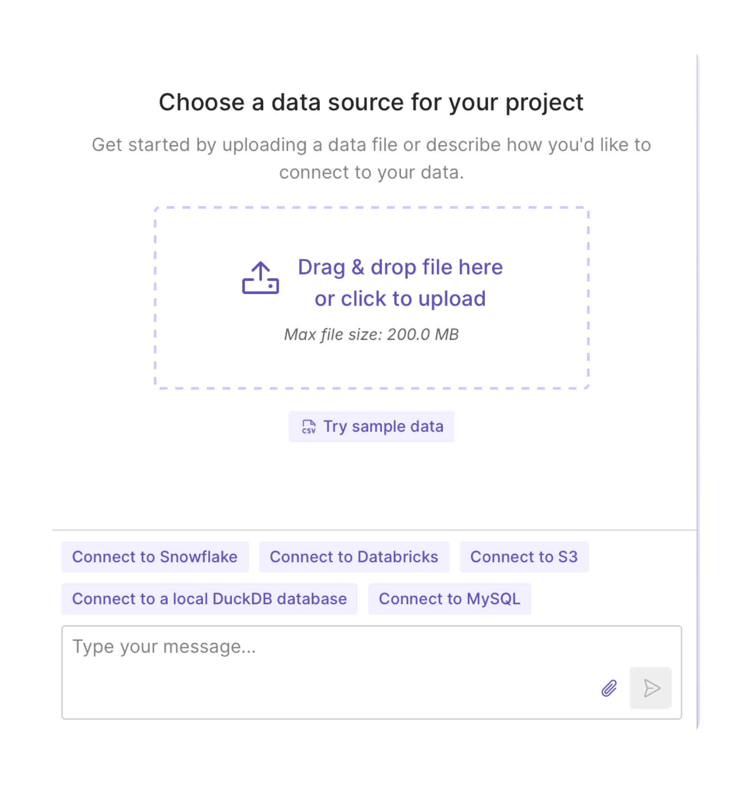
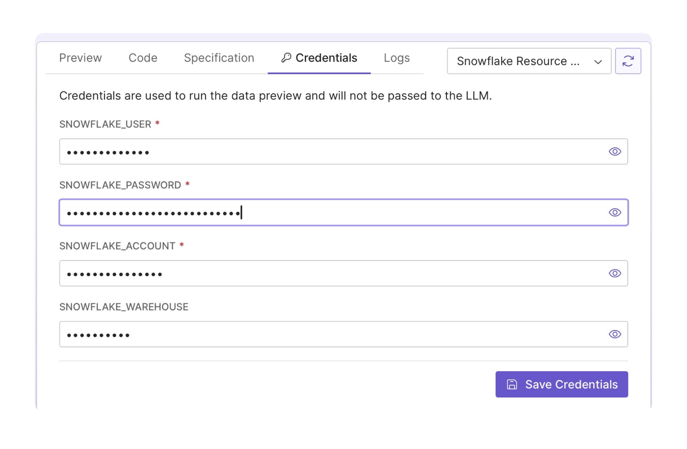
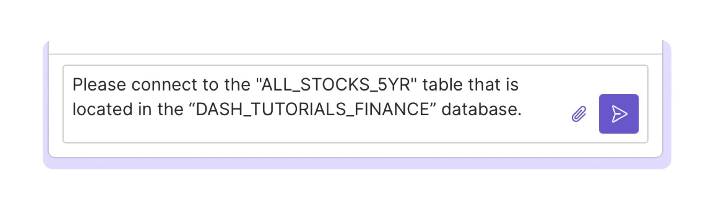
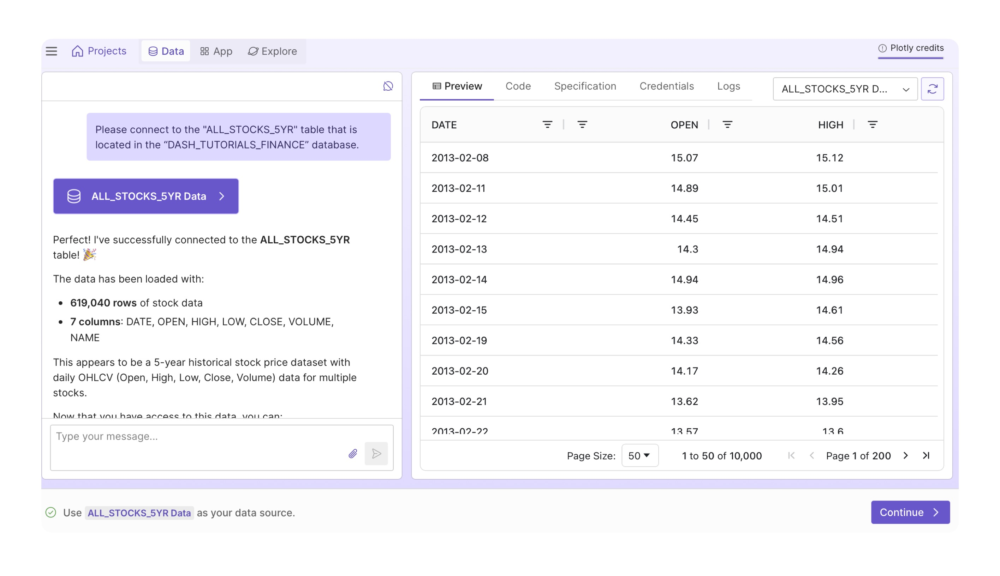
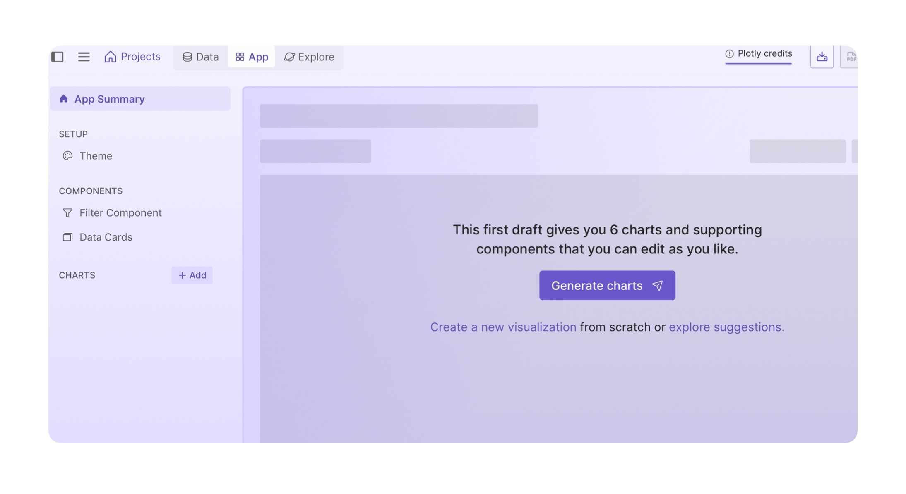
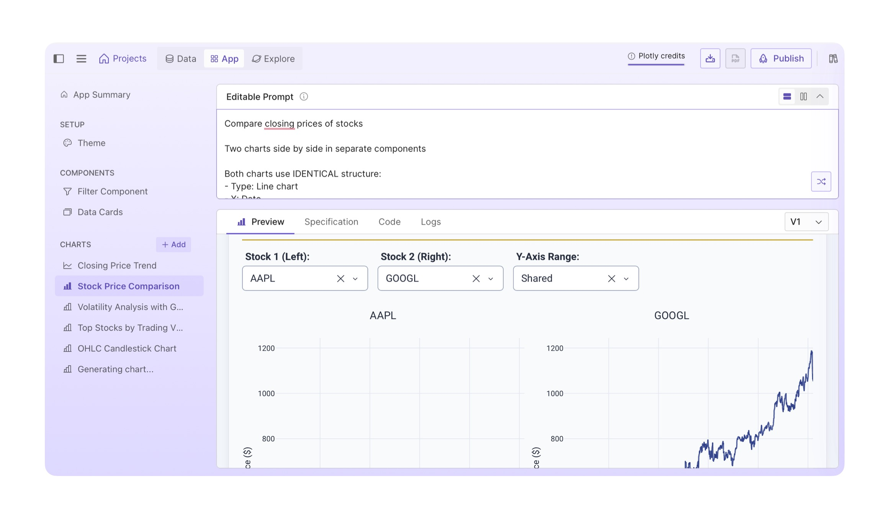
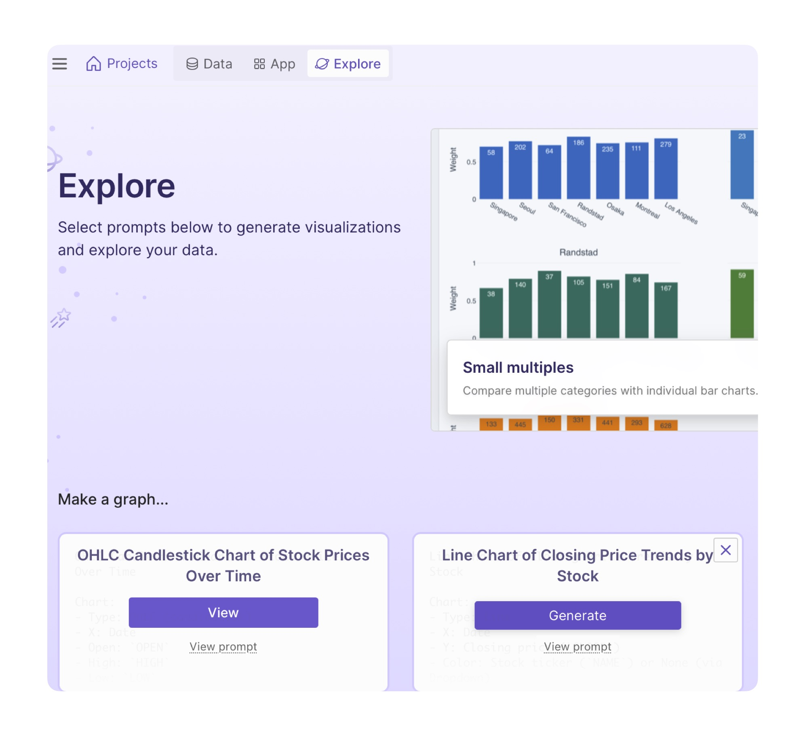
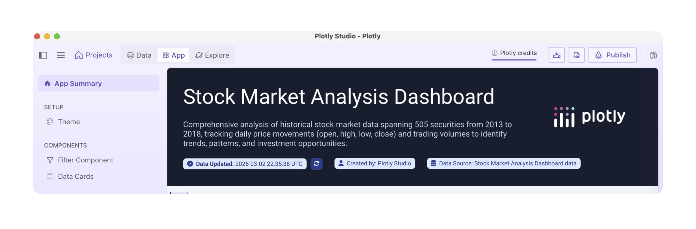
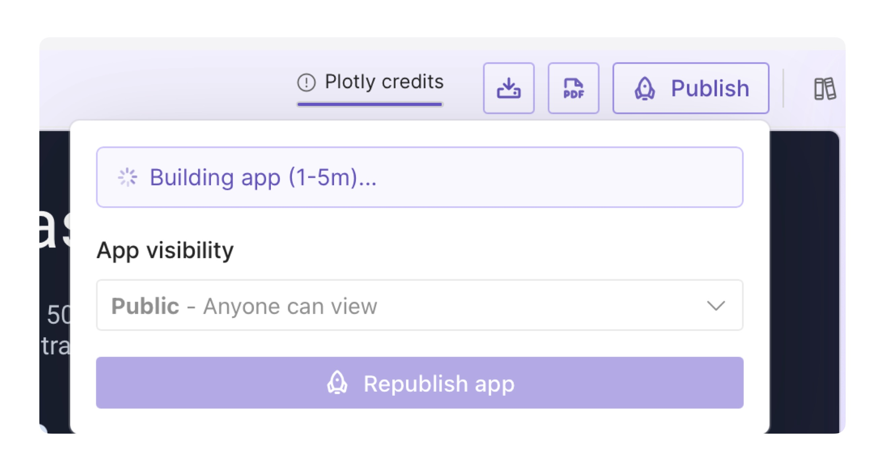
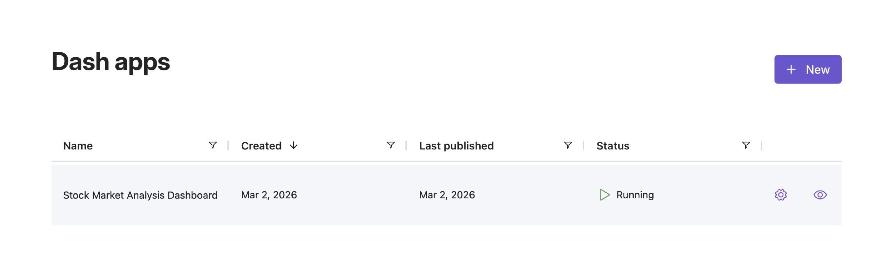

id: a-guide-to-build-plotly-dashboard-with-ai-and-sf-data
language: en
categories: snowflake-site:taxonomy/solution-center/certification/quickstart, snowflake-site:taxonomy/product/ai, snowflake-site:taxonomy/snowflake-feature/interactive-analytics
status: Published
authors: Adam Schroeder Plotly

# Connect to Snowflake Data with Plotly and Build a Dashboard

## Overview

In this guide you'll learn to connect to your Snowflake data via Plotly Studio. Then, you'll use Plotly Studio to build an interactive dashboard in under 5 minutes.

### Prerequisites

A Snowflake Account with an accessible warehouse, database, schema, and table

### What You’ll Learn

How to connect to your snowflake database and tables in Plotly
How to build an interactive analytics dashboard 

### What You’ll Need

A snowflake account with knowledge of your username, password, account and warehouse names

### What You’ll Build
A interactive analytics dashboard, also known as a Plotly Studio app

## Getting Started

1. We are going to build a Plotly Studio app to visualize your data. So first, identify the database tables or table you would like to work with. Then, make note of your snowflake username, password, account and warehouse names because you will need them to connect your data to Plotly Studio.

2. [Download Plotly Studio](https://plotly.com/downloads/?utm_source=snowflake_dev_guide&utm_medium=documentation&utm_campaign=studio_cloud_community&utm_content=plotly_studio_with_snowflake) to your computer and install it.

 ## Connect your Data to Plotly Studio

 1. Launch Plotly Studio and click the `New Project` button

 2. Click the `Connect to Snowflake` button

 
 3. Once Plotly Studio instructs you, click the `Configure Credentials` button, fill out your credentials, and click the `Save Credentials` button.

 
 4. Using the chat feature on the left side of the screen, answer Plotly Studio's questions so you can connect to your table of interest. In most cases you will have to guide Plotly Studio by telling it that you would like to connect to your `table name` with your `database name`. In our example, we ask Plotly Studio the following: `Please connect to the "ALL_STOCKS_5YR" table that is located in the "DASH_TUTORIALS_FINANCE" database'.

 
 5. Once you see a preview of you table, cick the `Continue` button to start building your dashbaord.

## Build your Dashboard

1. Click the `Generate Charts` button to generate the first set of charts.

2. You'll see the charts generating with the spinner icon next to each chart, located on the left side of the screen. Once the spinner disappears, you can enter the chart and review it.

3. You can also edit the chart or the corresponding controls by updating the prompt in the `Editable Prompt` section, then clicking the purple submit button.

4. If you'd like suggestions for various other charts, simply go to the `Explore` tab, located in the top left. And once you find a chart suggestion that interests you, click the `Generate` button.

5. Go back to the `App` tab and review your app. Once you're happy with your app, click the `Publish` button, located in the top right. This will publish the app to the Cloud.

6. Share your app by going to Plotly Cloud and clicking the eye icon next to your app name.

