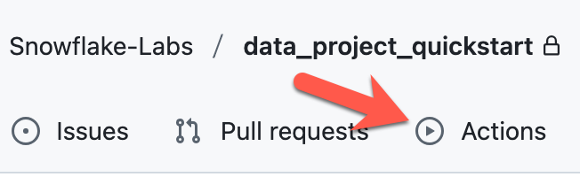
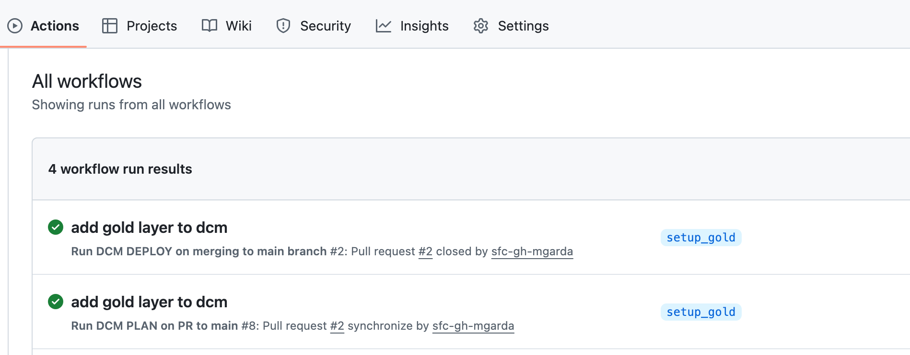
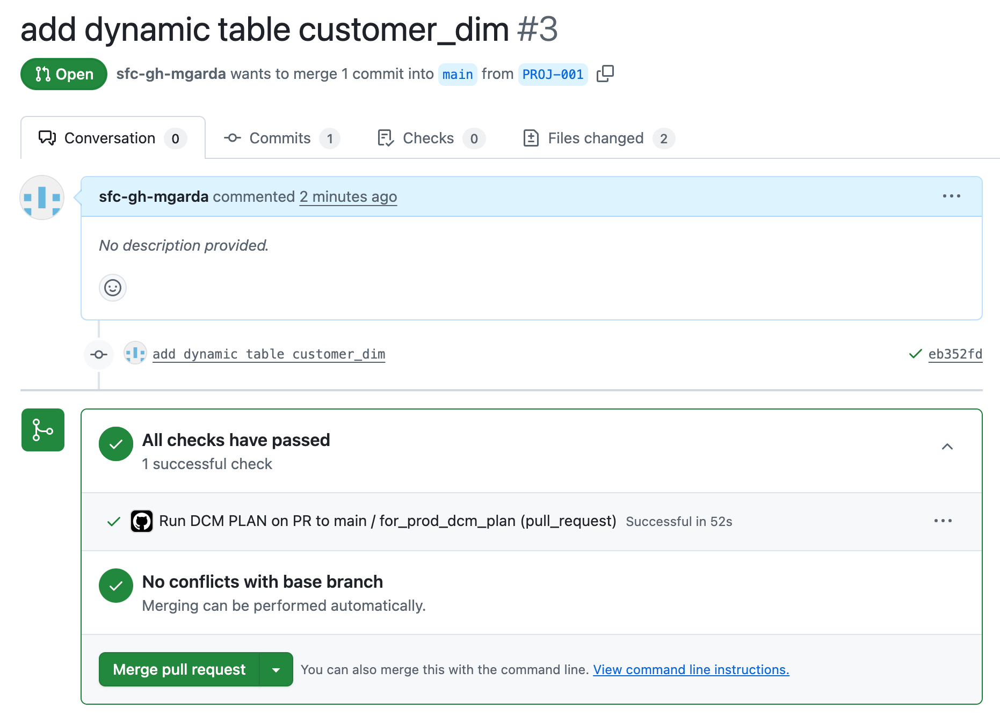
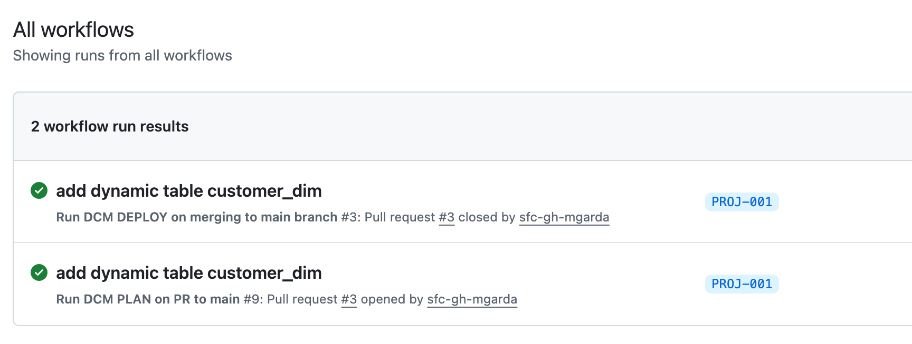
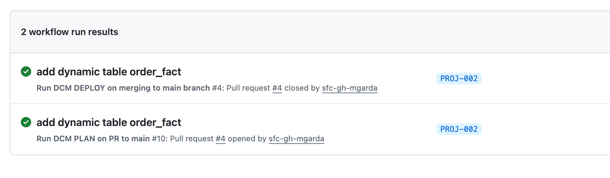

author: Meher Garda
id: a-guide-to-implementing-a-pipeline-for-database-change-management
categories: snowflake-site:taxonomy/solution-center/certification/quickstart, snowflake-site:taxonomy/product/data-engineering
language: en
summary: Implementing a Pipeline for Database Change Management
environments: web
status: Hidden
feedback link: https://github.com/Snowflake-Labs/sfguides/issues


# Implementing a Pipeline for Database Change Management
<!-- ------------------------ -->
## Overview 

In this guide we will walkthrough how to use Snowflake Data Change Management feature as part of a pipeline.

### Prerequisites
- Familiarity with Snowflake, Github
- A snowflake user with [Key Pair](https://docs.snowflake.com/en/user-guide/key-pair-auth), role sysadmin. 
- A XSMALL snowflake warehouse. 
- Setup Snowflake [cli connections](https://docs.snowflake.com/en/developer-guide/snowflake-cli/connecting/configure-connections)

### What You’ll Learn 
- How to use snow cli DCM specific commands.
- How to configure a pipeline using github

### What You’ll Need 
- A [GitHub](https://github.com/) Account
- A [Snowflake](https://signup.snowflake.com/?utm_source=snowflake-devrel&utm_medium=developer-guides&utm_cta=developer-guides) Account
- [Git cli](https://git-scm.com/downloads/mac) Installed
- [Snowflake cli](https://docs.snowflake.com/en/developer-guide/snowflake-cli/installation/installation) Installed
- Python (>= 3.11) Installed
- [Virtualenv](https://virtualenv.pypa.io/en/latest/installation.html#installation) Installed

### What You’ll Build 
- We will be utilising the northwind database, git actions and snowflake to implement a pipeline to build and deploy dynamic tables. We aim to show a release/promotion process from bronze to the gold layer.
- We will also be creating an isolated sandbox to allow developer to make changes before releasing into a shared environment. The release process will be done by leveraging github actions.

<!--
## Metadata Configuration

- **summary**: Implementing a Pipeline for Database Change Management
  - In this guide we will walkthrough how to use Snowflake Data Change Management feature as part of a pipeline.. 
- **id**: a_guide_to_implementing_a_pipeline_for_dcm
- **categories**: data-engineering
- **environments**: web
- **status**: Hidden
  - (`Draft`, `Published`, `Deprecated`, `Hidden`) to indicate the progress and whether the sfguide is ready to be published. `Hidden` implies the sfguide is for restricted use, should be available only by direct URL, and should not appear on the main landing page.
- **feedback link**: https://github.com/Snowflake-Labs/sfguides/issues
- **tags**: Getting Started, Getting Started, Data Engineering
- **authors**: Meher Garda
-->

## Setup Snowflake environment

1) Create an RSA key for Authentication
  + Run the following commands to create a private and public key. These keys are necessary to authenticate via github actions

```shell
openssl genrsa -out snowflake_demo_key 4096
openssl rsa -in snowflake_demo_key -pubout -out snowflake_demo_key.pub
openssl pkcs8 -topk8 -nocrypt -in snowflake_demo_key.pem -out snowflake_demo_key.p8
```
  + You could also use a [online service](https://www.cryptool.org/en/cto/openssl/) to create the key pair.

2) Create the User and Role in Snowflake

  + To create a user account, log in to the Snowflake console and run the following commands as the ACCOUNTADMIN role.

  + But first:
    <br />a) Open the snowflake_demo_key.pub file and copy contents for use in following SQL.
    <br />b) Prior to running the CREATE USER command, paste over the RSA_PUBLIC_KEY_HERE label, which follows the RSA_PUBLIC_KEY attribute.

```sql
USE ROLE ACCOUNTADMIN;
CREATE OR REPLACE USER "DCM_DEMO" RSA_PUBLIC_KEY='RSA_PUBLIC_KEY_HERE' DEFAULT_ROLE=SYSADMIN MUST_CHANGE_PASSWORD=FALSE;
```

3) Use role SYSADMIN.

4) Create database and schema to hold the objects that will be managed via DCM.

```sql
create database DCM_PROJECTS;
create schema DCM_PROJECTS.DCM_PROJECTS;
```

5) Create Database, schema, tables for bronze layer. We will be using a subset of the tables/data.

```sql
create database bronze;
create schema bronze.bronze;

CREATE TABLE customers (
    customer_id varchar NOT NULL PRIMARY KEY,
    company_name character varying(40) NOT NULL,
    contact_name character varying(30),
    contact_title character varying(30),
    address character varying(60),
    city character varying(15),
    region character varying(15),
    postal_code character varying(10),
    country character varying(15),
    phone character varying(24),
    fax character varying(24)
);

CREATE TABLE us_states (
    state_id smallint NOT NULL PRIMARY KEY,
    state_name character varying(100),
    state_abbr character varying(2),
    state_region character varying(50)
);

CREATE TABLE orders (
    order_id smallint NOT NULL PRIMARY KEY,
    customer_id varchar,
    employee_id smallint,
    order_date date,
    required_date date,
    shipped_date date,
    ship_via smallint,
    freight real,
    ship_name character varying(40),
    ship_address character varying(60),
    ship_city character varying(15),
    ship_region character varying(15),
    ship_postal_code character varying(10),
    ship_country character varying(15),
    FOREIGN KEY (customer_id) REFERENCES customers
);


CREATE TABLE order_details (
    order_id smallint NOT NULL,
    product_id smallint NOT NULL,
    unit_price real NOT NULL,
    quantity smallint NOT NULL,
    discount real NOT NULL,
    PRIMARY KEY (order_id, product_id),
    FOREIGN KEY (order_id) REFERENCES orders
);

```
6) Load the data

```sql
INSERT INTO customers VALUES
  ('ALFKI', 'Alfreds Futterkiste', 'Maria Anders', 'Sales Representative', 'Obere Str. 57', 'Berlin', NULL, '12209', 'Germany', '030-0074321', '030-0076545'),
  ('ANATR', 'Ana Trujillo Emparedados y helados', 'Ana Trujillo', 'Owner', 'Avda. de la Constitución 2222', 'México D.F.', NULL, '05021', 'Mexico', '(5) 555-4729', '(5) 555-3745'),
  ('ANTON', 'Antonio Moreno Taquería', 'Antonio Moreno', 'Owner', 'Mataderos  2312', 'México D.F.', NULL, '05023', 'Mexico', '(5) 555-3932', NULL),
  ('AROUT', 'Around the Horn', 'Thomas Hardy', 'Sales Representative', '120 Hanover Sq.', 'London', NULL, 'WA1 1DP', 'UK', '(171) 555-7788', '(171) 555-6750'),
  ('BERGS', 'Berglunds snabbköp', 'Christina Berglund', 'Order Administrator', 'Berguvsvägen  8', 'Luleå', NULL, 'S-958 22', 'Sweden', '0921-12 34 65', '0921-12 34 67'),
  ('BLAUS', 'Blauer See Delikatessen', 'Hanna Moos', 'Sales Representative', 'Forsterstr. 57', 'Mannheim', NULL, '68306', 'Germany', '0621-08460', '0621-08924'),
  ('BLONP', 'Blondesddsl père et fils', 'Frédérique Citeaux', 'Marketing Manager', '24, place Kléber', 'Strasbourg', NULL, '67000', 'France', '88.60.15.31', '88.60.15.32'),
  ('BOLID', 'Bólido Comidas preparadas', 'Martín Sommer', 'Owner', 'C/ Araquil, 67', 'Madrid', NULL, '28023', 'Spain', '(91) 555 22 82', '(91) 555 91 99'),
  ('BONAP', 'Bon app''', 'Laurence Lebihan', 'Owner', '12, rue des Bouchers', 'Marseille', NULL, '13008', 'France', '91.24.45.40', '91.24.45.41'),
  ('BOTTM', 'Bottom-Dollar Markets', 'Elizabeth Lincoln', 'Accounting Manager', '23 Tsawassen Blvd.', 'Tsawassen', 'BC', 'T2F 8M4', 'Canada', '(604) 555-4729', '(604) 555-3745'),
  ('BSBEV', 'B''s Beverages', 'Victoria Ashworth', 'Sales Representative', 'Fauntleroy Circus', 'London', NULL, 'EC2 5NT', 'UK', '(171) 555-1212', NULL),
  ('CACTU', 'Cactus Comidas para llevar', 'Patricio Simpson', 'Sales Agent', 'Cerrito 333', 'Buenos Aires', NULL, '1010', 'Argentina', '(1) 135-5555', '(1) 135-4892'),
  ('CENTC', 'Centro comercial Moctezuma', 'Francisco Chang', 'Marketing Manager', 'Sierras de Granada 9993', 'México D.F.', NULL, '05022', 'Mexico', '(5) 555-3392', '(5) 555-7293'),
  ('CHOPS', 'Chop-suey Chinese', 'Yang Wang', 'Owner', 'Hauptstr. 29', 'Bern', NULL, '3012', 'Switzerland', '0452-076545', NULL),
  ('COMMI', 'Comércio Mineiro', 'Pedro Afonso', 'Sales Associate', 'Av. dos Lusíadas, 23', 'Sao Paulo', 'SP', '05432-043', 'Brazil', '(11) 555-7647', NULL),
  ('CONSH', 'Consolidated Holdings', 'Elizabeth Brown', 'Sales Representative', 'Berkeley Gardens 12  Brewery', 'London', NULL, 'WX1 6LT', 'UK', '(171) 555-2282', '(171) 555-9199'),
  ('DRACD', 'Drachenblut Delikatessen', 'Sven Ottlieb', 'Order Administrator', 'Walserweg 21', 'Aachen', NULL, '52066', 'Germany', '0241-039123', '0241-059428'),
  ('DUMON', 'Du monde entier', 'Janine Labrune', 'Owner', '67, rue des Cinquante Otages', 'Nantes', NULL, '44000', 'France', '40.67.88.88', '40.67.89.89'),
  ('EASTC', 'Eastern Connection', 'Ann Devon', 'Sales Agent', '35 King George', 'London', NULL, 'WX3 6FW', 'UK', '(171) 555-0297', '(171) 555-3373'),
  ('ERNSH', 'Ernst Handel', 'Roland Mendel', 'Sales Manager', 'Kirchgasse 6', 'Graz', NULL, '8010', 'Austria', '7675-3425', '7675-3426');


INSERT INTO us_states VALUES
  (1, 'Alabama', 'AL', 'south'),
  (2, 'Alaska', 'AK', 'north'),
  (3, 'Arizona', 'AZ', 'west'),
  (4, 'Arkansas', 'AR', 'south'),
  (5, 'California', 'CA', 'west'),
  (6, 'Colorado', 'CO', 'west'),
  (7, 'Connecticut', 'CT', 'east'),
  (8, 'Delaware', 'DE', 'east'),
  (9, 'District of Columbia', 'DC', 'east'),
  (10, 'Florida', 'FL', 'south'),
  (11, 'Georgia', 'GA', 'south'),
  (12, 'Hawaii', 'HI', 'west'),
  (13, 'Idaho', 'ID', 'midwest'),
  (14, 'Illinois', 'IL', 'midwest'),
  (15, 'Indiana', 'IN', 'midwest'),
  (16, 'Iowa', 'IO', 'midwest'),
  (17, 'Kansas', 'KS', 'midwest'),
  (18, 'Kentucky', 'KY', 'south'),
  (19, 'Louisiana', 'LA', 'south'),
  (20, 'Maine', 'ME', 'north'),
  (21, 'Maryland', 'MD', 'east'),
  (22, 'Massachusetts', 'MA', 'north'),
  (23, 'Michigan', 'MI', 'north'),
  (24, 'Minnesota', 'MN', 'north'),
  (25, 'Mississippi', 'MS', 'south'),
  (26, 'Missouri', 'MO', 'south'),
  (27, 'Montana', 'MT', 'west'),
  (28, 'Nebraska', 'NE', 'midwest'),
  (29, 'Nevada', 'NV', 'west'),
  (30, 'New Hampshire', 'NH', 'east'),
  (31, 'New Jersey', 'NJ', 'east'),
  (32, 'New Mexico', 'NM', 'west'),
  (33, 'New York', 'NY', 'east'),
  (34, 'North Carolina', 'NC', 'east'),
  (35, 'North Dakota', 'ND', 'midwest'),
  (36, 'Ohio', 'OH', 'midwest'),
  (37, 'Oklahoma', 'OK', 'midwest'),
  (38, 'Oregon', 'OR', 'west'),
  (39, 'Pennsylvania', 'PA', 'east'),
  (40, 'Rhode Island', 'RI', 'east'),
  (41, 'South Carolina', 'SC', 'east'),
  (42, 'South Dakota', 'SD', 'midwest'),
  (43, 'Tennessee', 'TN', 'midwest'),
  (44, 'Texas', 'TX', 'west'),
  (45, 'Utah', 'UT', 'west'),
  (46, 'Vermont', 'VT', 'east'),
  (47, 'Virginia', 'VA', 'east'),
  (48, 'Washington', 'WA', 'west'),
  (49, 'West Virginia', 'WV', 'south'),
  (50, 'Wisconsin', 'WI', 'midwest'),
  (51, 'Wyoming', 'WY', 'west');


INSERT INTO orders VALUES
  (10248, 'VINET', 5, '1996-07-04', '1996-08-01', '1996-07-16', 3, 32.38, 'Vins et alcools Chevalier', '59 rue de l''Abbaye', 'Reims', NULL, '51100', 'France'),
  (10249, 'TOMSP', 6, '1996-07-05', '1996-08-16', '1996-07-10', 1, 11.61, 'Toms Spezialitäten', 'Luisenstr. 48', 'Münster', NULL, '44087', 'Germany'),
  (10250, 'HANAR', 4, '1996-07-08', '1996-08-05', '1996-07-12', 2, 65.83, 'Hanari Carnes', 'Rua do Paço, 67', 'Rio de Janeiro', 'RJ', '05454-876', 'Brazil'),
  (10251, 'VICTE', 3, '1996-07-08', '1996-08-05', '1996-07-15', 1, 41.34, 'Victuailles en stock', '2, rue du Commerce', 'Lyon', NULL, '69004', 'France'),
  (10252, 'SUPRD', 4, '1996-07-09', '1996-08-06', '1996-07-11', 2, 51.3, 'Suprêmes délices', 'Boulevard Tirou, 255', 'Charleroi', NULL, 'B-6000', 'Belgium'),
  (10253, 'HANAR', 3, '1996-07-10', '1996-07-24', '1996-07-16', 2, 58.17, 'Hanari Carnes', 'Rua do Paço, 67', 'Rio de Janeiro', 'RJ', '05454-876', 'Brazil'),
  (10254, 'CHOPS', 5, '1996-07-11', '1996-08-08', '1996-07-23', 2, 22.98, 'Chop-suey Chinese', 'Hauptstr. 31', 'Bern', NULL, '3012', 'Switzerland'),
  (10255, 'RICSU', 9, '1996-07-12', '1996-08-09', '1996-07-15', 3, 148.33, 'Richter Supermarkt', 'Starenweg 5', 'Genève', NULL, '1204', 'Switzerland'),
  (10256, 'WELLI', 3, '1996-07-15', '1996-08-12', '1996-07-17', 2, 13.97, 'Wellington Importadora', 'Rua do Mercado, 12', 'Resende', 'SP', '08737-363', 'Brazil'),
  (10257, 'HILAA', 4, '1996-07-16', '1996-08-13', '1996-07-22', 3, 81.91, 'HILARION-Abastos', 'Carrera 22 con Ave. Carlos Soublette #8-35', 'San Cristóbal', 'Táchira', '5022', 'Venezuela'),
  (10258, 'ERNSH', 1, '1996-07-17', '1996-08-14', '1996-07-23', 1, 140.51, 'Ernst Handel', 'Kirchgasse 6', 'Graz', NULL, '8010', 'Austria'),
  (10259, 'CENTC', 4, '1996-07-18', '1996-08-15', '1996-07-25', 3, 3.25, 'Centro comercial Moctezuma', 'Sierras de Granada 9993', 'México D.F.', NULL, '05022', 'Mexico'),
  (10260, 'OTTIK', 4, '1996-07-19', '1996-08-16', '1996-07-29', 1, 55.09, 'Ottilies Käseladen', 'Mehrheimerstr. 369', 'Köln', NULL, '50739', 'Germany');

INSERT INTO order_details VALUES
  (10248, 11, 14, 12, 0),
  (10248, 42, 9.8, 10, 0),
  (10248, 72, 34.8, 5, 0),
  (10249, 14, 18.6, 9, 0),
  (10249, 51, 42.4, 40, 0),
  (10250, 41, 7.7, 10, 0),
  (10250, 51, 42.4, 35, 0.15),
  (10250, 65, 16.8, 15, 0.15),
  (10251, 22, 16.8, 6, 0.05),
  (10251, 57, 15.6, 15, 0.05),
  (10251, 65, 16.8, 20, 0),
  (10252, 20, 64.8, 40, 0.05),
  (10252, 33, 2, 25, 0.05),
  (10252, 60, 27.2, 40, 0),
  (10253, 31, 10, 20, 0),
  (10253, 39, 14.4, 42, 0),
  (10253, 49, 16, 40, 0),
  (10254, 24, 3.6, 15, 0.15),
  (10254, 55, 19.2, 21, 0.15),
  (10254, 74, 8, 21, 0),
  (10255, 2, 15.2, 20, 0),
  (10255, 16, 13.9, 35, 0),
  (10255, 36, 15.2, 25, 0),
  (10255, 59, 44, 30, 0),
  (10256, 53, 26.2, 15, 0),
  (10256, 77, 10.4, 12, 0),
  (10257, 27, 35.1, 25, 0),
  (10257, 39, 14.4, 6, 0),
  (10257, 77, 10.4, 15, 0),
  (10258, 2, 15.2, 50, 0.2),
  (10258, 5, 17, 65, 0.2),
  (10258, 32, 25.6, 6, 0.2),
  (10259, 21, 8, 10, 0),
  (10259, 37, 20.8, 1, 0),
  (10260, 41, 7.7, 16, 0.25),
  (10260, 57, 15.6, 50, 0),
  (10260, 62, 39.4, 15, 0.25),
  (10260, 70, 12, 21, 0.25);

```

## Setup Github environment

1) [Create a repo](https://docs.github.com/en/repositories/creating-and-managing-repositories/creating-a-new-repository)
2) Base64 encode the private key of the Snowflake Key pair    
```shell
cat snowflake_demo_key.p8 | base64
```
  + Add to [Github Secret](https://docs.github.com/en/actions/how-tos/write-workflows/choose-what-workflows-do/use-secrets#creating-secrets-for-a-repository). Call the secret SNOW_PRIVATE_KEY.

3) Clone the repo
4) Create git actions. We will create two actions. 
   <br />Git action prod_plan.yml - Runs DCM plan when a PR to main branch is created. 
   <br />Git action prod_deploy.yml - Runs DCM deploy, when a PR is merged into main branch.
   
```shell
git clone <repo>
cd <repo>
mkdir -p .github/workflows
cd .github/workflows
```
  + In your code editor create files - prod_plan.yml prod_deploy.yml. Copy the following content into the respective files.

  + Content of prod_plan.yml
```shell
name: Run DCM PLAN on PR to main

on:
  pull_request:
    branches:
      - main
    types: [opened, synchronize, reopened]

jobs:
  for_prod_dcm_plan:

    runs-on: ubuntu-latest

    steps:
    - uses: actions/checkout@v4 # Checks out your repository code
    - name: Set up Python
      uses: actions/setup-python@v5 # Sets up a specific Python version
      with:
        python-version: '3.12' # Specify your desired Python version (e.g., '3.9', '3.10')
    - name: Install dependencies
      run: |
        python -m pip install --upgrade pip # Upgrades pip
        pip install git+https://github.com/snowflakedb/snowflake-cli.git@main --force
    - name: Get Private Key File
      run: |
        echo "${{ secrets.SNOW_PRIVATE_KEY }}" | base64 --decode > ${{ github.workspace }}/snowflake_private_key.p8
        chmod 600 ${{ github.workspace }}/snowflake_private_key.p8 # Set appropriate permissions
    - name: Configure Snowflake Connection
      run: |
        snow connection add \
          --connection-name cicd_connection \
          --account <your snowflake account> \
          --host <your snowflake host> \
          --user DCM_DEMO \
          --warehouse <xsmall warehouse> \
          --database DCM --schema DCM \
          --role SYSADMIN \
          --authenticator SNOWFLAKE_JWT \
          --private-key-file ${{ github.workspace }}/snowflake_private_key.p8 \
          --no-interactive --default
    - name: Create DCM Project if not exists 
      run: |
        cd ./data_project && snow dcm create --if-not-exists proj1
        
    - name: Execute PLAN with config PROD 
      run: |
        cd ./data_project && snow dcm plan DCM.DCM.PROJ1 --configuration="prod"
        
```

  + Content of prod_deploy.yml
```shell
name: Run DCM DEPLOY on merging to main branch

on:
  pull_request:
    branches:
      - main
    types: [closed]

jobs:
  for_prod_dcm_deploy:
    if: github.event.pull_request.merged == true

    runs-on: ubuntu-latest

    steps:
    - uses: actions/checkout@v4 # Checks out your repository code
    - name: Set up Python
      uses: actions/setup-python@v5 # Sets up a specific Python version
      with:
        python-version: '3.12' # Specify your desired Python version (e.g., '3.9', '3.10')
    - name: Install dependencies
      run: |
        python -m pip install --upgrade pip # Upgrades pip
        pip install git+https://github.com/snowflakedb/snowflake-cli.git@main --force
    - name: Get Private Key File
      run: |
        echo "${{ secrets.SNOW_PRIVATE_KEY }}" | base64 --decode > ${{ github.workspace }}/snowflake_private_key.p8
        chmod 600 ${{ github.workspace }}/snowflake_private_key.p8 # Set appropriate permissions
    - name: Configure Snowflake Connection
      run: |
        snow connection add \
          --connection-name cicd_connection \
          --account <your snowflake account> \
          --host <your snowflake host> \
          --user DCM_DEMO \
          --warehouse <xsmall warehouse> \
          --database DCM --schema DCM \
          --role SYSADMIN \
          --authenticator SNOWFLAKE_JWT \
          --private-key-file ${{ github.workspace }}/snowflake_private_key.p8 \
          --no-interactive --default
    - name: Create DCM Project if not exists 
      run: |
        cd ./data_project && snow dcm create --if-not-exists proj1
    - name: Execute PLAN with config PROD 
      run: |
        cd ./data_project && snow dcm plan DCM.DCM.PROJ1 --configuration="prod"
    - name: Execute deploy with config prod
      run: |
        cd ./data_project && snow dcm deploy DCM.DCM.PROJ1 --configuration="prod"
        
```
5) Add sandbox script and requirements.txt

  + Sandbox is a self-contained environment mapped to a JIRA ticket. It is implemented as a
script. The sandbox allows a developer to develop and test prior to pushing the branch to github. 

```shell
cd <your repo>
mkdir -p sandbox
cd sandbox
```
  + In your code editor create files do.sh and requirements.txt

  + Copy following content into do.sh
```shell
#! /bin/bash

set -euo pipefail

CMD="${1-}"
BRANCH_NAME="${2-}"

if [ -z "$CMD" ]; then
echo "Usage: $0 create <branch-name> | $0 plan|deploy"
exit 1
fi

# Ensure we're operating from the repo root
REPO_ROOT=$(git rev-parse --show-toplevel 2>/dev/null || true)
if [ -z "$REPO_ROOT" ]; then
echo "Error: Not inside a git repository."
exit 1
fi

case "$CMD" in
create)
# Require explicit branch name for create
if [ -z "$BRANCH_NAME" ]; then
echo "Usage: $0 create <branch-name>"
exit 1
fi
SANITIZED_NAME=$(echo ${BRANCH_NAME//-/_} | tr '[:lower:]' '[:upper:]')
# Sync local develop with origin/main
git fetch origin --prune
git checkout main
git reset --hard origin/main

# Create the sandbox branch from develop
git checkout -B "$BRANCH_NAME"
echo "Created and switched to branch '$BRANCH_NAME' from up-to-date develop."

# Create a virtual environment and install dependencies
virtualenv -p python3 venv
source venv/bin/activate
pip install --upgrade pip
pip install -r requirements.txt

snow connection test 

snow stage create ${SANITIZED_NAME}_FILES
snow sql -q "CREATE DCM PROJECT IF NOT EXISTS ${SANITIZED_NAME};"
snow sql -q "CREATE OR REPLACE DATABASE ${SANITIZED_NAME};"
snow sql -q "CREATE OR REPLACE SCHEMA ${SANITIZED_NAME}.${SANITIZED_NAME} CLONE GOLD.GOLD;"

;;
plan)
# Activate venv if present
if [ -f "venv/bin/activate" ]; then
source venv/bin/activate
fi

BRANCH_NAME=$(git -C "$REPO_ROOT" rev-parse --abbrev-ref HEAD)
SANITIZED_NAME=$(echo ${BRANCH_NAME//-/_} | tr '[:lower:]' '[:upper:]')

pushd $REPO_ROOT
snow sql -q "CREATE OR REPLACE STAGE ${SANITIZED_NAME}_FILES"
snow stage copy --recursive ./data_project @${SANITIZED_NAME}_FILES/
snow sql -q "EXECUTE DCM PROJECT ${SANITIZED_NAME} PLAN USING CONFIGURATION non_prod (target_db => '${SANITIZED_NAME}', target_schema => '${SANITIZED_NAME}') FROM @${SANITIZED_NAME}_FILES/;"
popd

;;
deploy)
# Activate venv if present
if [ -f "venv/bin/activate" ]; then
source venv/bin/activate
fi

BRANCH_NAME=$(git -C "$REPO_ROOT" rev-parse --abbrev-ref HEAD)
SANITIZED_NAME=$(echo ${BRANCH_NAME//-/_} | tr '[:lower:]' '[:upper:]')

pushd $REPO_ROOT
snow sql -q "CREATE OR REPLACE STAGE ${SANITIZED_NAME}_FILES"
snow stage copy --recursive ./data_project @${SANITIZED_NAME}_FILES/

snow sql -q "EXECUTE DCM PROJECT ${SANITIZED_NAME} DEPLOY USING CONFIGURATION non_prod (target_db => '${SANITIZED_NAME}', target_schema => '${SANITIZED_NAME}') FROM @${SANITIZED_NAME}_FILES/;"
popd

;;
*)
echo "Unknown command: $CMD"
echo "Usage: $0 create <branch-name> | $0 plan|deploy"
exit 1
;;
esac
```

  + Copy following content into requirements.txt

```shell
annotated-types==0.7.0
asn1crypto==1.5.1
boto3==1.40.22
botocore==1.40.22
certifi==2025.8.3
cffi==1.17.1
charset-normalizer==3.4.3
click==8.1.8
cryptography==45.0.7
filelock==3.19.1
gitdb==4.0.12
GitPython==3.1.44
id==1.5.0
idna==3.10
jaraco.classes==3.4.0
jaraco.context==6.0.1
jaraco.functools==4.3.0
Jinja2==3.1.6
jmespath==1.0.1
keyring==25.6.0
markdown-it-py==4.0.0
MarkupSafe==3.0.2
mdurl==0.1.2
more-itertools==10.8.0
packaging==25.0
pip==25.1.1
platformdirs==4.4.0
pluggy==1.6.0
prompt_toolkit==3.0.51
pycparser==2.22
pydantic==2.11.7
pydantic_core==2.33.2
Pygments==2.19.2
PyJWT==2.10.1
pyOpenSSL==25.1.0
python-dateutil==2.9.0.post0
pytz==2025.2
PyYAML==6.0.2
requests==2.32.4
requirements-parser==0.13.0
rich==14.0.0
ruamel.yaml==0.18.15
ruamel.yaml.clib==0.2.12
s3transfer==0.13.1
setuptools==80.8.0
shellingham==1.5.4
six==1.17.0
smmap==5.0.2
snowflake-cli==3.11.0
snowflake-connector-python==3.17.2
snowflake.core==1.6.0
sortedcontainers==2.4.0
tomlkit==0.13.3
typer==0.16.0
typing_extensions==4.15.0
typing-inspection==0.4.1
urllib3==2.5.0
wcwidth==0.2.13
```

6) Create folder called data_project with manifest.yml

```shell
cd <your repo>
mkdir -p data_project/definitions
cd data_project
```
  + In your code editor create file manifest.yml. Copy following content into manifest.yml

```shell
manifest_version: 1.0
include_definitions:
  - definitions/.*
type: DCM_PROJECT
configurations:
  prod:
    target_db: "gold"
    target_schema: "gold"
    source_db: "bronze"
    source_schema: "bronze"
    warehouse: "XSMALL"

```

7) Add and commit above changes to git

```shell
cd <your repo>
git add .
git commit -m "adding git actions and sandbox script" .
git push origin main
```


## Setup DCM to manage the gold layer
1) Create gold database and schema
  + Add a sql file into the data_project/definitions folder called gold.sql.

```shell
git checkout -b setup_gold
cd data_project/definitions
```

  + In your code editor create file gold.sql. Contents of gold.sql:

```sql
define database {{target_db}};
define schema {{target_db}}.{{target_schema}};
```

2) Commit changes to git

```shell
git add .
git commit -m "add gold layer datbase and schema" .
git push origin setup_gold
```

3) Make a PR to main branch. Browse to Github Actions.



  + Git action called "Run DCM PLAN on PR to main" will do a dry-run.

4) Merge to main. Go to Github Actions. Git action called "Run DCM DEPLOY on merging to main branch" will execute the sql.



## Develop and test in the sandbox env to create a dynamic table  

1) Create dynamic table customer_dim

```shell
cd <your repo>
git checkout main
git pull
cd sandbox
./do.sh create PROJ-001
cd ..
mkdir -p data_project/definitions
cd data_project/definitions
```

  + do.sh creates a git branch named 'PROJ-001' and all changes are made in the context of this branch. It also creates a sandbox environment by cloning the gold layer.

  + In your code editor create file customer_dim.sql. Copy following content into customer_dim.sql
```sql
DEFINE DYNAMIC TABLE {{target_db}}.{{target_schema}}.CUSTOMER_DIM
    TARGET_LAG = '10 minutes'
    WAREHOUSE = {{warehouse}}
AS

select c.customer_id as customerid, c.contact_name::VARCHAR(30) as contactname, c.company_name::VARCHAR(40) as companyname, coalesce(u.state_name, c.region)::VARCHAR(100) as stateprovence, c.city, c.country
from {{source_db}}.{{source_schema}}.customers c
left join {{source_db}}.{{source_schema}}.us_states u on c.region = u.state_abbr;

```

  + customer_dim.sql uses jinja templating. The variables in '{{}}' are replaced by their values which are defined in manifest.yml.

2) Build and deploy the dynamic table in the sandbox environment.

```shell
cd <your repo>
cd sandbox
./do.sh plan
```
  + The output of plan will display the operation/s, target objects. In this case, it will CREATE a DYNAMIC TABLE called 'PROJ_001.PROJ_001.CUSTOMER_DIM'.

  + Now lets deploy the changes.

```shell
./do.sh deploy
```

  + In the snowflake UI, you can verify the dynamic table 'PROJ_001.PROJ_001.CUSTOMER_DIM'.


  + If satisfied, add and commit changes to your branch and push the branch.

```shell
git add .
git commit -m "adding dynamic table CUSTOMER_DIM" .
git push origin PROJ-001
```

## Simulate another developer on the team creating another dynamic table

1) Reset branch context to main

```shell
git checkout main
```

2) Create a dynamic table for a fact table ORDER_FACT

```shell
cd <your repo>
git checkout main
git pull
cd sandbox
./do.sh create PROJ-002
cd ..
mkdir -p data_project/definitions
cd data_project/definitions
```

  + In your code editor create file order_fact.sql. Copy following content into order_fact.sql

```sql
define DYNAMIC TABLE {{target_db}}.{{target_schema}}.ORDER_FACT
    TARGET_LAG = '10 minutes'
    WAREHOUSE = {{warehouse}}
AS
    select o.order_id as orderid, o.customer_id as customerid, o.employee_id as employeeid, o.order_date as orderdate, o.required_date as requireddate, o.shipped_date as shippeddate, od.product_id as productid, 
    o.freight, od.quantity, od.unit_price as unitprice, od.discount
    from {{source_db}}.{{source_schema}}.order_details od
    join {{source_db}}.{{source_schema}}.orders o on o.order_id = od.order_id;
```

2) Build and deploy the dynamic table in the sandbox environment.

```shell
cd <your repo>
cd sandbox
./do.sh plan
./do.sh deploy
```

  + In the snowflake UI, you can verify the dynamic table 'PROJ_002.PROJ_002.ORDER_FACT'. If satisfied, add and commit changes to your branch and push the branch.

```shell
git add .
git commit -m "adding dynamic table ORDER_FACT" .
git push origin PROJ-002
```


## Push to gold environment

  + Make a PR from PROJ-001 to main branch. 

  + Once a PR is created, git action triggers to run a DCM plan.

  + Merge the PR, when the output of the git action is green.  



  + At this point, another git action triggers to deploy the changes. Browse to Github Actions, to verify that both actions have completed successfully.



  + The dynamic table CUSTOMER_DIM is now deployed in the gold layer. You can verify the same in the Snowflake UI.

  + Repeat the PR/merge steps for PROJ-002 branch.

  + The git actions for plan and deploy will execute and the dynamic table ORDER_FACT is deployed to the gold layer.




## Conclusion and Resources

1) Conclusion

  + Utilizing snowflake DCM we can design a pipeline to build and deploy tables, views , dynamic tables via 
git actions. Using github or a similar source control system helps with leveraging multi-developer workflows.

2) What you learned

  + In this guide we went through the steps in setting up a pipeline to build and deploy Dynamic Tables. We introduced
the concept of a sandbox environment that is an isolated developer area to develop and test the dynamic tables.
We also saw how we can leverage Git actions that respond to certain actions like creating and merging PR.
In this guide we targetted a subset of tables in the northwind database. 

3) Resources

  + [DDL](assets/ddl.sql) and [DML](assets/dml.sql) for loading the entire northwind database.
  + [Additional dynamic tables that can be used to extend this quickstart](assets/dynamic_tables.txt)
  + [Add destroy action to sandbox script](assets/do.sh)

4) Here are some ideas to expand on this guide

  + You can have a prod snowflake account and a non-prod snowflake account. The prod snowflake account could share
   its bronze layer to the non-prod snowflake account. You can also have a script that redacts information
   from the tables in the prod snowflake account.
  + You can have the main branch map to the prod snowflake account, and an integration branch can be mapped
   to the non-prod snowflake account.
  + The sandbox creation script can be hosted in a CI system like Jenkins, etc


5) All scripts/shell commands in this quickstart are tested to work on macOS.
