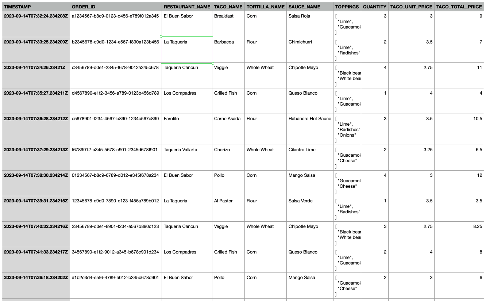
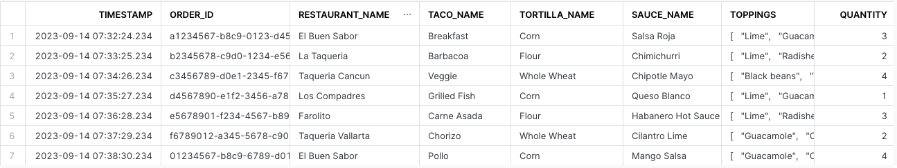
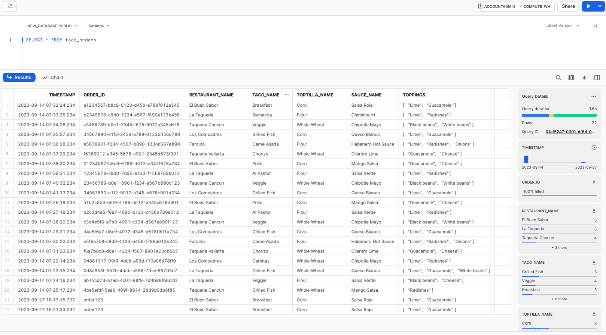
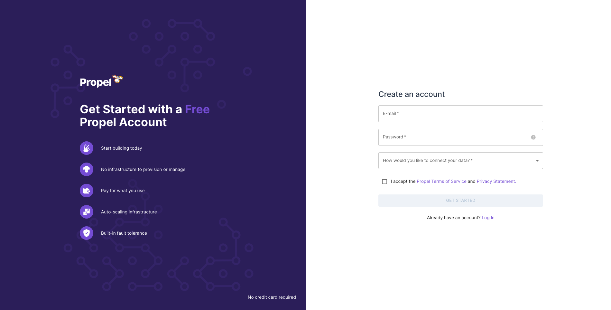

author: YK
id: a_comprehensive_guide_creating_graphql_api_on_top_of_snowflake_using_propel
summary: This guide teaches how to create a GraphQL API using Propel on Snowflake, focusing on setup, configuration, and development of a high-performance API.
categories: Getting-Started
environments: web
status: Published 
feedback link: https://github.com/Snowflake-Labs/sfguides/issues
tags: Getting Started, Data Science, Data Engineering, Twitter 

# A Comprehensive Guide: Creating GraphQL API on Top of Snowflake Using Propel

## **Introduction**

In this guide, we focus on using [Propel](https://www.propeldata.com/) to create a GraphQL API on top of Snowflake. While there are other methods to interface with Snowflake—such as Snowflake's REST API and language-specific connectors—this guide will concentrate on the Propel method. For a broader understanding of all three methods, refer to the comprehensive guide on Snowflake Medium: [Snowflake API: Comprehensive Guide to 3 Methods With Examples](https://medium.com/snowflake/snowflake-api-comprehensive-guide-to-3-methods-with-examples-c633f4eb35e1).

### **Overview of Using Propel**

Propel offers a seamless way to create fast, efficient GraphQL APIs over your Snowflake data. This method is particularly advantageous for scenarios demanding low latency and high concurrency, such as customer-facing analytics dashboards.

If you prefer a video overview, feel free to take a look at our interview with Snowflake's Daniel Myers on Snowflake's YouTube channel: [Using Propel To Accelerate The Process Of Creating Analytics For Web And Mobile Applications](https://www.youtube.com/watch?v=AO87CZOK7Ko).

### **Prerequisites**

- Basic understanding of Snowflake and GraphQL
- Access to Snowflake instance
- [A Propel account](https://console.propeldata.com/get-started/)

### **What You’ll Learn**

- Setting up data in Snowflake for Propel integration
- Configuring Propel to work with Snowflake
- Creating and testing GraphQL APIs on top of your Snowflake data

### **What You’ll Build**

- A low-latency, high-concurrency GraphQL API on top of Snowflake using Propel

Let's proceed.


<!-- ------------------------ -->
## **Setting Up Example Data (Optional)**

### **Overview**

This section provides a step-by-step guide to setting up example data in Snowflake. This step is optional, and if you already have data in Snowflake, you can use that for this tutorial.

### **Why Example Data?**

Setting up example data can be particularly useful for understanding how to integrate and manipulate data when creating a GraphQL API using Propel. It provides a practical example to work with, ensuring you can effectively follow the steps in this guide.

### **Example Data Description**

The example data simulates taco orders from various restaurants, with details like timestamp, restaurant name, taco type, toppings, and total price.



### **Setting Up Example Data**

Follow these steps to set up your example data:

1. **Create the Table:**
Run this SQL query in Snowflake to create a **`taco_orders`** table:
    
```sql
CREATE TABLE taco_orders (
    TIMESTAMP TIMESTAMP_NTZ,
    ORDER_ID STRING,
    RESTAURANT_NAME STRING,
    TACO_NAME STRING,
    TORTILLA_NAME STRING,
    SAUCE_NAME STRING,
    TOPPINGS VARIANT,
    QUANTITY INTEGER,
    TACO_UNIT_PRICE FLOAT,
    TACO_TOTAL_PRICE FLOAT
);
```
    
2. **Insert Sample Data:**
Execute this query to insert sample data into the **`taco_orders`** table:
    
```sql
INSERT INTO taco_orders 
(TIMESTAMP, ORDER_ID, RESTAURANT_NAME, TACO_NAME, TORTILLA_NAME, SAUCE_NAME, TOPPINGS, QUANTITY, TACO_UNIT_PRICE, TACO_TOTAL_PRICE) 
SELECT '2023-09-14T07:32:24.234208Z', 'a1234567-b8c9-0123-d456-e789f012a345', 'El Buen Sabor', 'Breakfast', 'Corn', 'Salsa Roja', ARRAY_CONSTRUCT('Lime', 'Guacamole'), 3, 3, 9 UNION ALL
SELECT '2023-09-14T07:33:25.234209Z', 'b2345678-c9d0-1234-e567-f890a123b456', 'La Taqueria', 'Barbacoa', 'Flour', 'Chimichurri', ARRAY_CONSTRUCT('Lime', 'Radishes'), 2, 3.5, 7 UNION ALL
SELECT '2023-09-14T07:34:26.234210Z', 'c3456789-d0e1-2345-f678-9012a345c678', 'Taqueria Cancun', 'Veggie', 'Whole Wheat', 'Chipotle Mayo', ARRAY_CONSTRUCT('Black beans', 'White beans'), 4, 2.75, 11 UNION ALL
SELECT '2023-09-14T07:35:27.234211Z', 'd4567890-e1f2-3456-a789-0123b456d789', 'Los Compadres', 'Grilled Fish', 'Corn', 'Queso Blanco', ARRAY_CONSTRUCT('Lime', 'Guacamole'), 1, 4, 4 UNION ALL
SELECT '2023-09-14T07:36:28.234212Z', 'e5678901-f234-4567-b890-1234c567e890', 'Farolito', 'Carne Asada', 'Flour', 'Habanero Hot Sauce', ARRAY_CONSTRUCT('Lime', 'Radishes', 'Onions'), 3, 3.5, 10.5 UNION ALL
SELECT '2023-09-14T07:37:29.234213Z', 'f6789012-a345-5678-c901-2345d678f901', 'Taqueria Vallarta', 'Chorizo', 'Whole Wheat', 'Cilantro Lime', ARRAY_CONSTRUCT('Guacamole', 'Cheese'), 2, 3.25, 6.5 UNION ALL
SELECT '2023-09-14T07:38:30.234214Z', '01234567-b8c9-6789-d012-e345f678a234', 'El Buen Sabor', 'Pollo', 'Corn', 'Mango Salsa', ARRAY_CONSTRUCT('Guacamole', 'Cheese'), 4, 3, 12 UNION ALL
SELECT '2023-09-14T07:39:31.234215Z', '12345678-c9d0-7890-e123-f456a789b012', 'La Taqueria', 'Al Pastor', 'Flour', 'Salsa Verde', ARRAY_CONSTRUCT('Lime', 'Radishes'), 1, 3.5, 3.5 UNION ALL
SELECT '2023-09-14T07:40:32.234216Z', '23456789-d0e1-8901-f234-a567b890c123', 'Taqueria Cancun', 'Veggie', 'Whole Wheat', 'Chipotle Mayo', ARRAY_CONSTRUCT('Black beans', 'White beans'), 3, 2.75, 8.25 UNION ALL
SELECT '2023-09-14T07:41:33.234217Z', '34567890-e1f2-9012-a345-b678c901d234', 'Los Compadres', 'Grilled Fish', 'Corn', 'Queso Blanco', ARRAY_CONSTRUCT('Lime', 'Guacamole'), 2, 4, 8 UNION ALL
SELECT '2023-09-14T07:26:18.234202Z', 'a1b2c3d4-e5f6-4789-a012-b345c678d901', 'El Buen Sabor', 'Pollo', 'Corn', 'Mango Salsa', ARRAY_CONSTRUCT('Guacamole', 'Cheese'), 2, 3, 6 UNION ALL
SELECT '2023-09-14T07:27:19.234203Z', 'b2c3d4e5-f6a7-4890-b123-c456d789e012', 'La Taqueria', 'Al Pastor', 'Flour', 'Salsa Verde', ARRAY_CONSTRUCT('Lime', 'Radishes'), 4, 3.5, 14 UNION ALL
SELECT '2023-09-14T07:28:20.234204Z', 'c3d4e5f6-a7b8-4901-c234-d567e890f123', 'Taqueria Cancun', 'Veggie', 'Whole Wheat', 'Chipotle Mayo', ARRAY_CONSTRUCT('Black beans', 'White beans'), 3, 2.75, 8.25 UNION ALL
SELECT '2023-09-14T07:29:21.234205Z', 'd4e5f6a7-b8c9-4012-d345-e678f901a234', 'Los Compadres', 'Grilled Fish', 'Corn', 'Queso Blanco', ARRAY_CONSTRUCT('Lime', 'Guacamole'), 1, 4, 4 UNION ALL
SELECT '2023-09-14T07:30:22.234206Z', 'e5f6a7b8-c9d0-4123-e456-f789a012b345', 'Farolito', 'Carne Asada', 'Flour', 'Habanero Hot Sauce', ARRAY_CONSTRUCT('Lime', 'Radishes', 'Onions'), 2, 3.5, 7 UNION ALL
SELECT '2023-09-14T07:31:23.234207Z', 'f6a7b8c9-d0e1-4234-f567-8901a234b567', 'Taqueria Vallarta', 'Chorizo', 'Whole Wheat', 'Cilantro Lime', ARRAY_CONSTRUCT('Guacamole', 'Cheese'), 4, 3.25, 13 UNION ALL
SELECT '2023-09-14T07:22:14.234198Z', '04861317-09f9-4dc8-a93d-f10e06d78ff0', 'Los Compadres', 'Carnitas', 'Whole Wheat', 'Chipotle Mayo', ARRAY_CONSTRUCT('Lime', 'Radishes'), 3, 3.25, 9.75 UNION ALL
SELECT '2023-09-14T07:23:15.234199Z', '0d8e653f-557b-4dab-a596-7fbee99703e7', 'La Taqueria', 'Grilled Fish', 'Whole Wheat', 'Queso Blanco', ARRAY_CONSTRUCT('Lime', 'Guacamole', 'White beans'), 4, 4, 16 UNION ALL
SELECT '2023-09-14T07:24:16.234200Z', 'ab45cd73-a7ad-4c07-98f8-7d4b98fb6c2d', 'La Taqueria', 'Veggie', 'Flour', 'Salsa Verde', ARRAY_CONSTRUCT('Black beans', 'Cheese'), 1, 2.75, 2.75 UNION ALL
SELECT '2023-09-14T07:25:17.234201Z', '4be5efdf-5ea6-409f-8814-26d9d03b8f85', 'Taqueria Cancun', 'Grilled Fish', 'Whole Wheat', 'Mango Salsa', ARRAY_CONSTRUCT('Radishes'), 4, 4, 16;
```
    
3. **Verify Data Insertion:**
To check the data, execute:
    
```sql
SELECT * FROM taco_orders;
```

This query will display the data you've inserted like this:



### **Using Your Own Data**

If you already have data in Snowflake, you can proceed with that data for the rest of this tutorial.

### **Next Steps**

With your data ready, either the example data or your own, you can move on to configuring Propel for creating your GraphQL API.

<!-- ------------------------ -->
## **Using Propel: Overview and Setup**

### **Introduction to Propel**

In this part of the guide, we'll explore using [Propel](https://www.propeldata.com/), an analytics platform with a semantic layer, to create a high-performance GraphQL API over your Snowflake data.

### **Advantages of Using Propel**

Propel offers significant benefits for handling Snowflake data in a GraphQL API:

1. **Low Latency:** With a separate caching and storage system, Propel significantly speeds up analytics data querying, typically achieving millisecond response times.
2. **High Concurrency:** The serverless architecture of Propel enables scaling to handle a virtually unlimited number of concurrent users or requests.
3. **Better Timezone Handling:** Propel simplifies the process of querying and serving data in different timezones, a crucial feature for global applications.
4. **Organized Code:** Propel reduces the complexity of managing multiple SQL queries, making multi-tenant use cases more manageable.

### **Ideal Use Cases**

Propel is particularly useful in scenarios demanding low latency and high concurrency, such as customer-facing analytics dashboards.

### **Setting Up Propel with Example Data**

To utilize Propel with the example taco order data:

1. **Confirm Data Setup:**
Ensure you have the example data by running: 
```sql
SELECT * FROM taco_orders;    
```
in the correct database and schema. This verifies that the example data has been properly created.


    
2. **Enable Change Tracking:**
Before setting up Propel, enable CHANGE_TRACKING on your **`taco_orders`** table (or your own table) with this query:
```sql
ALTER TABLE TACO_ORDERS SET CHANGE_TRACKING = TRUE;
```

### **Next Steps**

With your data setup confirmed and change tracking enabled, you're now ready to dive into configuring Propel to work with your Snowflake data.

<!-- ------------------------ -->
## Configuring Snowflake for Propel Integration

This section will guide you through the process of configuring your Snowflake environment to integrate seamlessly with Propel. This involves setting up a dedicated Snowflake user, role, and warehouse for Propel, and optionally configuring Snowflake Network Policies to include Propel's IP addresses.

### **Step 1: Sign Up for Propel**

Before starting the configuration, make sure you have signed up for a Propel account. Visit [Propel's website](https://www.propeldata.com/) and complete the sign-up process.



### **Step 2: Create Snowflake User, Role, and Warehouse for Propel**

It's recommended to create a dedicated user, role, and warehouse in Snowflake for Propel. This enhances security by adhering to the principle of least privilege and facilitates cost monitoring and control. Here's a script to set up these components:

```sql
begin;

    use role accountadmin;
    /* Create variables for user, password, role, warehouse, database, and schema (needs to be uppercase for objects) */
    set role_name = 'PROPELLER';
    set user_name = 'PROPEL_USER';
    set warehouse_name = 'PROPELLING';

    /* Must be at least 8 characters long, contain at least 1 digit, 1 uppercase letter and 1 lowercase letter */
    set user_password = '';               /* Replace with a strong password */
    set database_name = 'ANALYTICS';      /* Replace with your Snowflake database name */
    set schema_name = 'ANALYTICS.PUBLIC'; /* Replace with your Snowflake schema name */

    /* Grant sysadmin role access to the database */
    grant usage,modify
    on database identifier($database_name)
    to role sysadmin;

    /* Grant sysadmin role access to the schema */
    grant usage,modify
    on schema identifier($schema_name)
    to role sysadmin;

    /* Change role to securityadmin for user / role steps */
    use role securityadmin;

    /* Create a role for Propel */
    create role if not exists identifier($role_name);
    grant role identifier($role_name) to role SYSADMIN;

     /* Change role to sysadmin for warehouse and database steps */
    use role sysadmin;

    /* Create a warehouse for Propel */
    create warehouse if not exists identifier($warehouse_name)
    warehouse_size = xsmall
    warehouse_type = standard
    auto_suspend = 60
    auto_resume = true
    initially_suspended = true;

    /* Change role to securityadmin for user / role steps */
    use role securityadmin;

    /* Create a user for Propel */
    create user if not exists identifier($user_name)
    password = $user_password
    default_role = $role_name
    default_warehouse = $warehouse_name;

    grant role identifier($role_name) to user identifier($user_name);

    /* Change role to accountadmin for warehouse and database steps */
    use role accountadmin;

    /* Grant Propel role access to the warehouse */
    grant usage, monitor
    on warehouse identifier($warehouse_name)
    to role identifier($role_name);

    /* Grant Propel role access to the database */
    grant usage, monitor
    on database identifier($database_name)
    to role identifier($role_name);

    /* Grant Propel role access to the schema */
    grant create procedure, create stage, create task, create stream, usage
    on schema identifier($schema_name)
    to role identifier($role_name);

    /* Grant Propel role select on all tables in the schema */
    grant select on all tables
    in schema identifier($schema_name)
    to role identifier($role_name);

    /* Grant Propel role select on all future tables in the schema */
    grant select on future tables
    in schema identifier($schema_name)
    to role identifier($role_name);

    grant execute task on account
    to role identifier($role_name);

commit;
```

This script will:

- **Create a Propel-specific Role:** This role (**`PROPELLER`**) is tailored for Propel's access and operations within Snowflake.
- **Establish a Dedicated Warehouse:** The script sets up a warehouse (**`PROPELLING`**) specifically for Propel, with pre-configured settings.
- **Generate a Propel User:** A user (**`PROPEL_USER`**) is created and assigned the Propel role and warehouse as defaults.
- **Grant Necessary Permissions:** The script ensures the Propel role has the required permissions on the warehouse, database, and schema. This includes select permissions on all current and future tables in the specified schema.

**Note:** Replace placeholder values in the script (such as **`user_password`**, **`database_name`**, and **`schema_name`**) with your specific details before execution.

### **Step 3: (Optional) Configure Snowflake Network Policy**

If your Snowflake environment uses Network Policies, you might need to update them to allow Propel's IP addresses:

- 3.17.239.162
- 3.15.73.135
- 18.219.73.236

This ensures that Propel can communicate with your Snowflake instance without any network restrictions.

### **Conclusion and Next Steps**

With the Snowflake user, role, and warehouse now set up for Propel, and the network policies updated (if applicable), your Snowflake environment is ready for integration with Propel. This foundation allows you to proceed with building and optimizing your GraphQL API using Propel.


<!-- ------------------------ -->
## Code Snippets, Info Boxes, and Tables
Duration: 2

Look at the [markdown source for this sfguide](https://raw.githubusercontent.com/Snowflake-Labs/sfguides/master/site/sfguides/sample.md) to see how to use markdown to generate code snippets, info boxes, and download buttons. 

### JavaScript
```javascript
{ 
  key1: "string", 
  key2: integer,
  key3: "string"
}
```

### Java
```java
for (statement 1; statement 2; statement 3) {
  // code block to be executed
}
```

### Info Boxes
> aside positive
> 
>  This will appear in a positive info box.


> aside negative
> 
>  This will appear in a negative info box.

### Buttons
<button>

  [This is a download button](link.com)
</button>

### Tables
<table>
    <thead>
        <tr>
            <th colspan="2"> **The table header** </th>
        </tr>
    </thead>
    <tbody>
        <tr>
            <td>The table body</td>
            <td>with two columns</td>
        </tr>
    </tbody>
</table>

### Hyperlinking
[Youtube - Halsey Playlists](https://www.youtube.com/user/iamhalsey/playlists)

<!-- ------------------------ -->
## Images, Videos, and Surveys, and iFrames
Duration: 2

Look at the [markdown source for this guide](https://raw.githubusercontent.com/Snowflake-Labs/sfguides/master/site/sfguides/sample.md) to see how to use markdown to generate these elements. 

### Images


### Videos
Videos from youtube can be directly embedded:
<video id="KmeiFXrZucE"></video>

### Inline Surveys
<form>
  <name>How do you rate yourself as a user of Snowflake?</name>
  <input type="radio" value="Beginner">
  <input type="radio" value="Intermediate">
  <input type="radio" value="Advanced">
</form>

### Embed an iframe


<!-- ------------------------ -->
## Conclusion
Duration: 1

At the end of your Snowflake Guide, always have a clear call to action (CTA). This CTA could be a link to the docs pages, links to videos on youtube, a GitHub repo link, etc. 

If you want to learn more about Snowflake Guide formatting, checkout the official documentation here: [Formatting Guide](https://github.com/googlecodelabs/tools/blob/master/FORMAT-GUIDE.md)

### What we've covered
- creating steps and setting duration
- adding code snippets
- embedding images, videos, and surveys
- importing other markdown files