author: Stephen Franks
id: a_dataiku_and_snowflake_guide_to_data_science
summary: This is an introduction to Dataiku and Snowflake
categories: Data-Science-&-Ml,Solution-Examples,Partner-Integrations, Data-Science-&-Ai, Featured
environments: web
status: Published 
feedback link: https://github.com/Snowflake-Labs/sfguides/issues
tags: Getting Started, Data Science, Data Engineering, Twitter 

# A Dataiku and Snowflake Introduction to Data Science
<!-- ------------------------ -->

## Overview

Duration: 3

Duration: 1

This Snowflake Quickstart introduces you to the basics of using Snowflake together with Dataiku Cloud as part of a Data Science project. We’ll be highlighting some of the well-integrated functionalities between the two technologies. It is designed specifically for use with the [Snowflake free 30-day trial](https://trial.snowflake.com), and the Dataiku Cloud free trial version via Snowflake’s Partner Connect. 

**The Use Case:** Recent advances in generative AI have made it easy to apply for jobs. But be careful! Scammers have also been known to create fake job applications in the hopes of stealing personal information. Let’s see if you — with Dataiku & Snowflake's help — can spot a real job posting from a fake one!

> aside positive
> 
>  **About the data:** <br> The data for this quickstart comes from a Kaggle dataset of ~18000 job descriptions, out of which about 800 are fake. These are fairly simple datasets, once you have completed the lab you could consider enriching the project with additional data.

### Prerequisites

- Use of the Snowflake free 30-day trial environment
- Basic knowledge of SQL, and database concepts and objects


### What You'll Learn

The exercises in this lab will walk you through the steps to:  

- Create databases, tables, views, and warehouses in Snowflake
- Use Snowflake’s “Partner Connect” to seamlessly create a Dataiku DSS Cloud trial
- Create a Data Science project in Dataiku and perform analysis on data via Dataiku within Snowflake
- Use both visual and code tools
- Create, run, and evaluate simple Machine Learning models in Dataiku
- How at each step of the data science process you can utilise Dataiku and Snowflake in tandem to accelerate your team


### What We’re Going To Build

We will build a project that uses input datasets from Snowflake. We’ll build a data science pipeline by applying data transformations, building a machine learning model, and deploying it to Dataiku's Flow. We will then see how you can score the model against fresh data from Snowflake and automate.


<!-- ------------------------ -->

## Prepare Your Lab Environment

Duration: 5

- If you haven’t already, register for a [Snowflake free 30-day trial](https://trial.snowflake.com/) The rest of the sections in this lab assume you are using a new Snowflake account created by registering for a trial.

> aside negative
> 
>  **Note**: Please ensure that you use the **same email address** for both your Snowflake and Dataiku sign up


- **Region**  - Although not a requirement we'd suggest you select the region that is physically closest to you for this lab

- **Cloud Provider**  -  Although not a requirement we'd suggest you select ```AWS``` for this lab

- **Snowflake edition**  -  We suggest you select select the ```Enterprise edition``` so you can leverage some advanced capabilities that are not available in the Standard Edition.


After activation, you will create a ```username```and ```password```. Write down these credentials. **Bookmark this URL for easy, future access**.


> aside negative
> 
>  **About the screen captures, sample code, and environment:** <br> Screen captures in this lab depict examples and results that may slightly vary from what you may see when you complete the exercises.

<!-- ------------------------ -->

## The Snowflake User Interface

Duration: 10

### Logging Into the Snowflake User Interface (UI)

Open a browser window and enter the URL of your Snowflake 30-day trial environment. You should see the login screen below. Enter your unique credentials to log in.


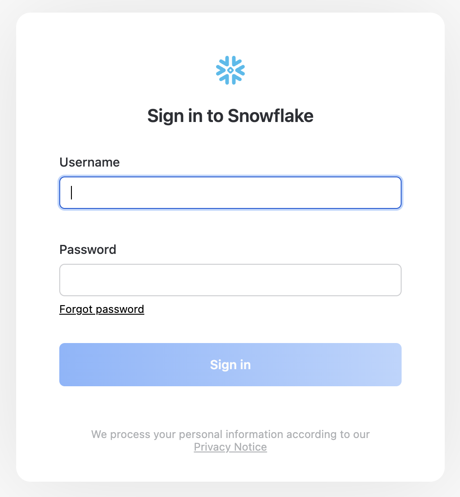

### Close any Welcome Boxes and Tutorials

You may see “welcome” and “helper” boxes in the UI when you log in for the first time. Close them by clicking on `Skip for now` in the bottom right corner in the screenshot below.

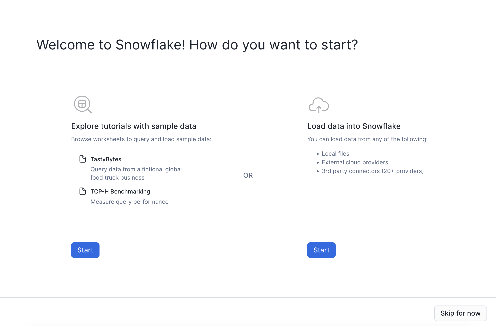      

### Navigating the Snowflke UI

First let’s get you acquainted with Snowflake! This section covers the basic components of the user interface to help you orient yourself. We will move left to right in the top of the UI.

The main menu on the left allows you to switch between the different areas of Snowflake:

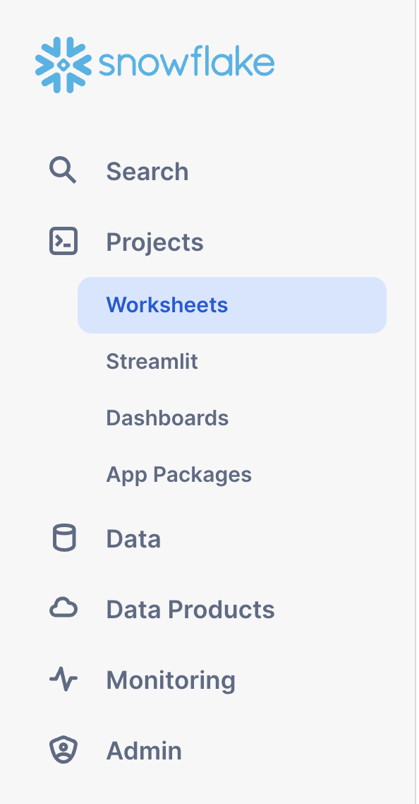

The **Databases** tab shows information about the databases you have created or have privileges to access. You can create, clone, drop, or transfer ownership of databases as well as load data (limited) in the UI. Notice several databases already exist in your environment. However, we will not be using these in this lab.   

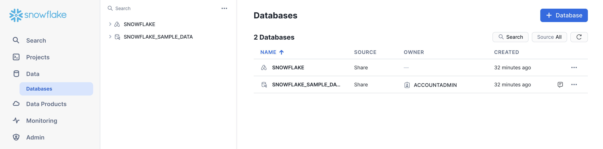

The **Worksheets** tab provides an interface for submitting code queries, performing DDL and DML operations and viewing results as your queries/operations complete. 

In the left pane is the database objects browser which enables users to explore all databases, schemas, tables, and views accessible by the role selected for a worksheet. The bottom pane will show results of queries and operations. 

If this is the first time you’ve used Snowsight, you might be prompted to enable it.

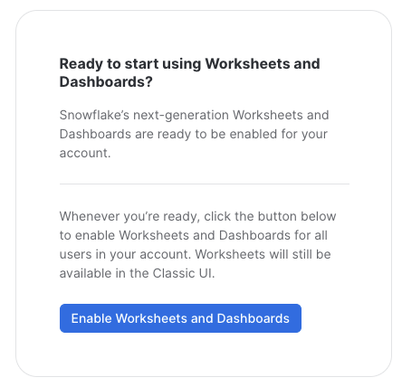

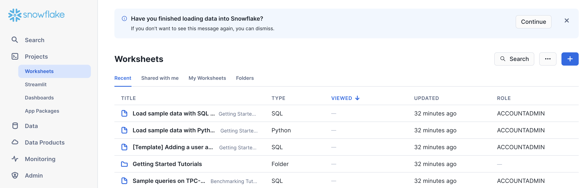

As you can see, there have already some worksheets been prepared for you to work with the demo data in the databases that we saw before. However, we are not going to use these existing worksheets now.

Instead, we are going to create a new one. For that, please click on the blue `+` Button in the top right corner.

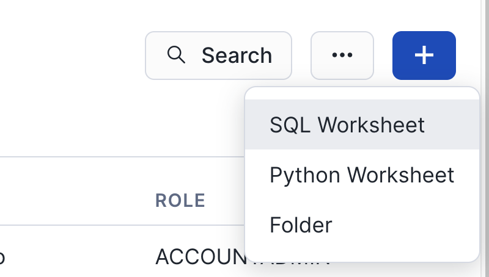
 
Select `SQL Worksheet` from the menu and a new worksheet will be created and shown.

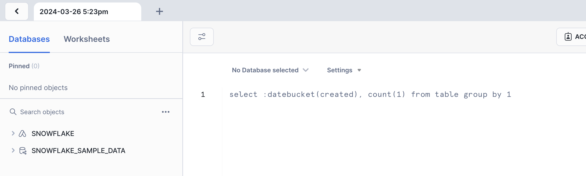


Rename the newly created worksheet to **Job Postings** by clicking on the worksheet name and typing `Job Postings` and pressing ‘Enter’


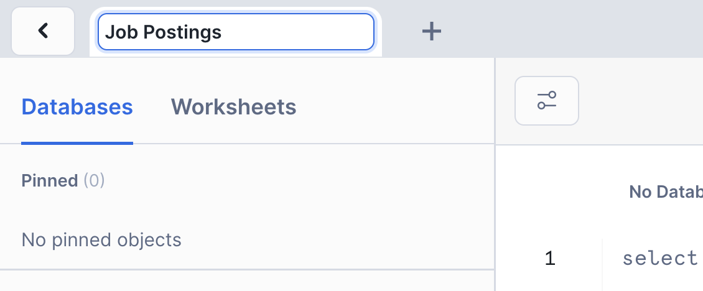

> aside positive
> 
>  **Worksheets vs the UI** <br> Much of the configurations in this lab will be executed via this pre-written SQL in the Worksheet in order to save time. These configurations could also be done via the UI in a less technical manner but would take more time.

The **History** tab allows you to view the details of all queries executed in the last 14 days in the Snowflake account (click on a Query ID to drill into the query for more detail).

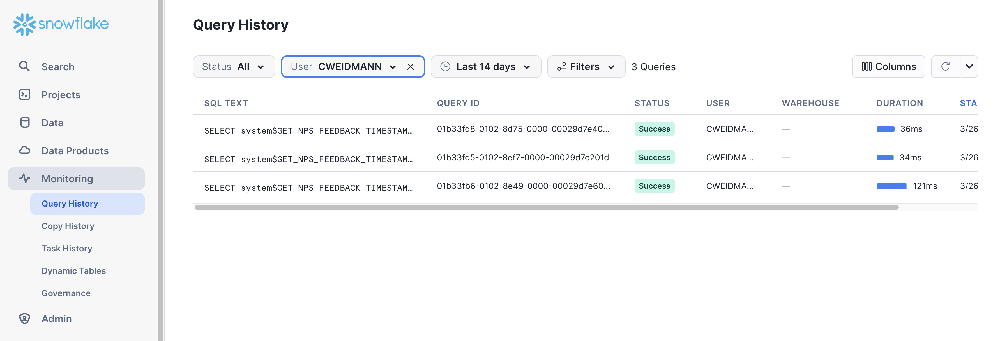


If you click on the bottom left of the UI where your username appears, you will see that you can change your password, roles, or preferences. Snowflake has several system defined roles. You are currently in the default role of SYSADMIN. We will change this in the next part of the lab.

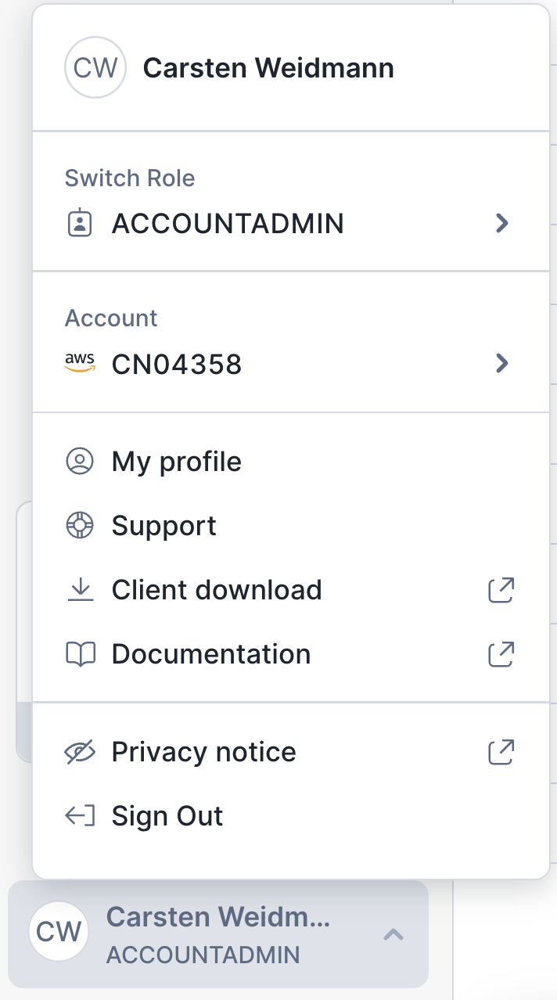


> aside negative
> 
>  **SYSADMIN** <br> For most of this lab you will remain in the SYSADMIN (aka System Administrator) role which has privileges to create warehouses and databases and other objects in an account. In a real-world environment, you would use different roles for the tasks in this lab, and assign the roles to your users. More on access control in Snowflake is in towards the end of this lab and also in our [documentation](https://docs.snowflake.net/manuals/user-guide/security-access-control.html)


<!-- ------------------------ -->

## Prepare Dataiku Trial Account Via Snowflake Partner Connect

Duration: 10

### Create Dataiku trial via Partner Connect

At the top right of the page, confirm that your current role is `ACCOUNTADMIN`, by clicking on your profile on the top right.

1. Click on `Data Products` on the left-hand menu
2. Click on `Partner Connect`
3. Search for Dataiku
4. Click on the `Dataiku` tile 

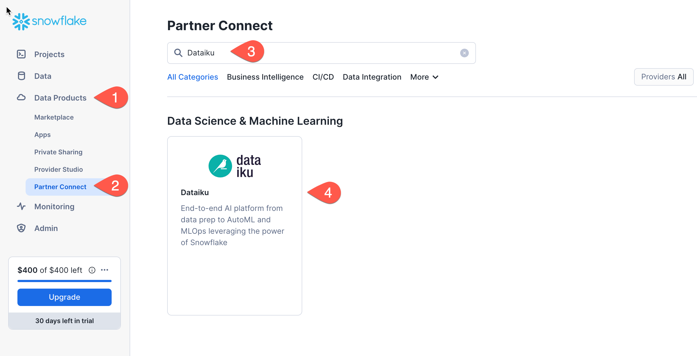

> aside negative
> Depending on which screen you are on you may not see the full menu as above but hovering over 
> the Data Products (Cloud) icon will show the options

This will automatically create the connection parameters required for Dataiku to connect to Snowflake. Snowflake will create a dedicated database, warehouse, system user, system password and system role, with the intention of those being used by the Dataiku account.

For this lab we’d like to use the **PC_DATAIKU_USER** to connect from Dataiku to Snowflake, and use the **PC_DATAIKU_WH** when performing activities within Dataiku that are pushed down into Snowflake.

This is to show that a Data Science team working on Dataiku and by extension on Snowflake can work completely independently from the Data Engineering team that works on loading data into Snowflake using different roles and warehouses.

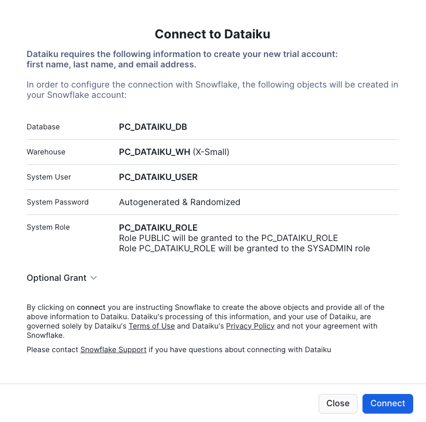

Note that the user password (which is autogenerated by Snowflake and never displayed), along with all of the other Snowflake connection parameters, are passed to the Dataiku server so that they will automatically be used for the Dataiku connection for this lab. **DO NOT CHANGE THESE**.

1. Click `Connect`
2. You will get a pop-ip which tells you your partner account has been created. Click on `Activate`


> aside negative
> 
>  **Informational Note:** <br> If you are using a different Snowflake account than the one created 
> at the start, you may get a screen asking for your email details. Click on ‘Go to Preferences’ and 
> populate with your email details


This will launch a new page that will redirect you to a launch page from Dataiku.

Here, you will have two options:

1. Login with an existing Dataiku username
2. Sign up for a new Dataiku account

We assume that you’re new to Dataiku, so ensure the “Sign Up” box is selected, and sign up with either GitHub, Google or your email address and your new password. Click sign up.

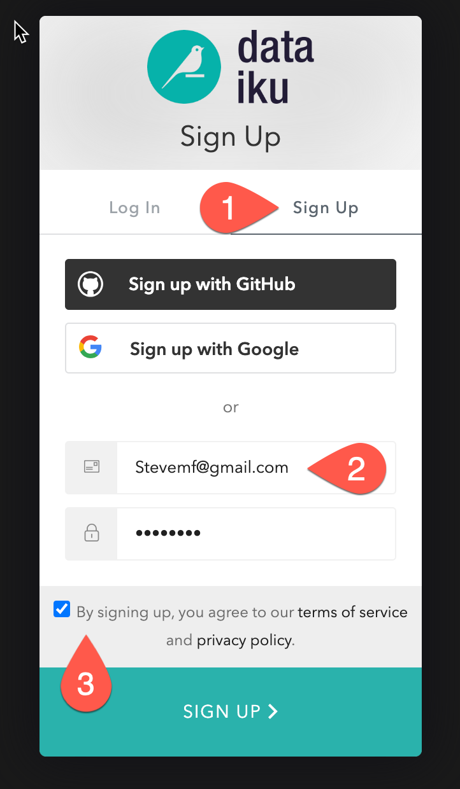

When using your email address, ensure your password fits the following criteria:

1. At least 8 characters in length
2. Should contain:
   Lower case letters (a-z)
   Upper case letters (A-Z)
   Numbers (i.e. 0-9)

You should have received an email from Dataiku to the email you have signed up with. Activate your Dataiku account via the email sent.


### Review Dataiku Setup

Upon clicking on the activation link, please briefly review the Terms of Service of Dataiku Cloud. In order to do so, please scroll down to the bottom of the page. Click on `I AGREE` and then click on `NEXT`

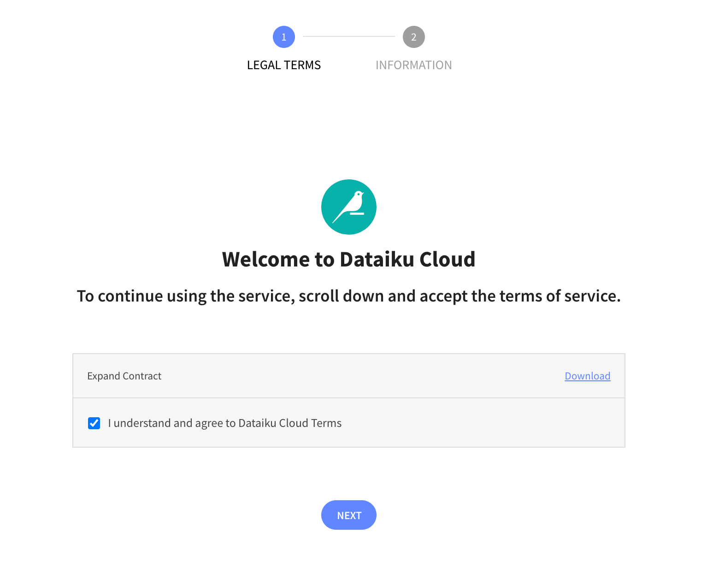


Complete your sign up some information about yourself and then click on `Start`.


You will be redirected to the Dataiku Cloud Launchpad site. Click `GOT IT!` to continue.

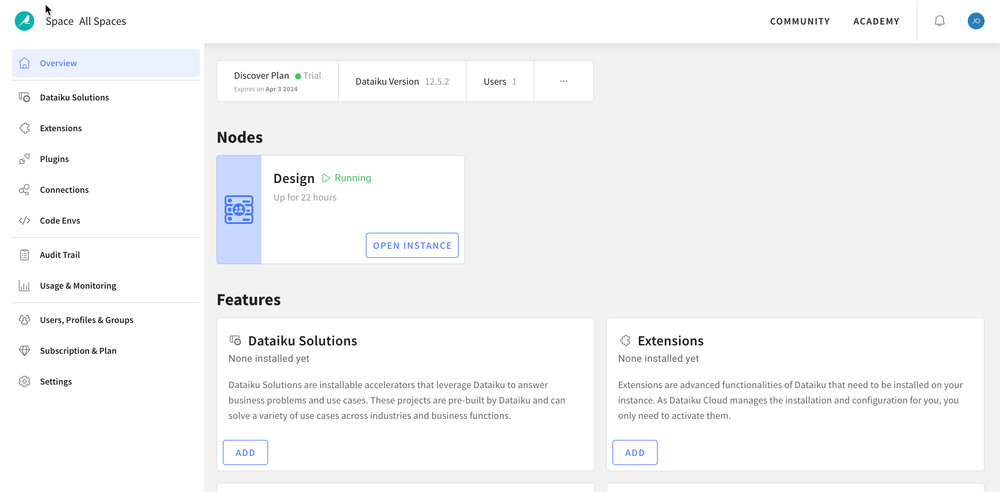

This is the Cloud administration console where you can perform tasks such as inviting other users to collaborate, add plugin extensions, install industry solutions to accelerate projects as well as access community and academy resources to help your learning journey. 

>aside negative
>**NOTE:** It may take several minutes for your instance to Dataiku to start up the first time,
> during this time you will not be able to add the extension as described below.
> You can always come back to this task later if time doesn't allow now

It's beyond the scope of this course to cover these but for this lab we would like to enable a few of the AI Assistants so lets do that now.

1. Click on `Extensions` on the left menu
2. Select `+ ADD AN EXTENSION` 
3. Find `AI Services` and click on it

In the AI Services Extension screen perform the following tasks:

1. Agree to the terms and services
2. Select `Enable AI Prepare`
3. Select `Enable AI Explain`
4. Click `ADD` 
5. Click on `Go Back To Space`


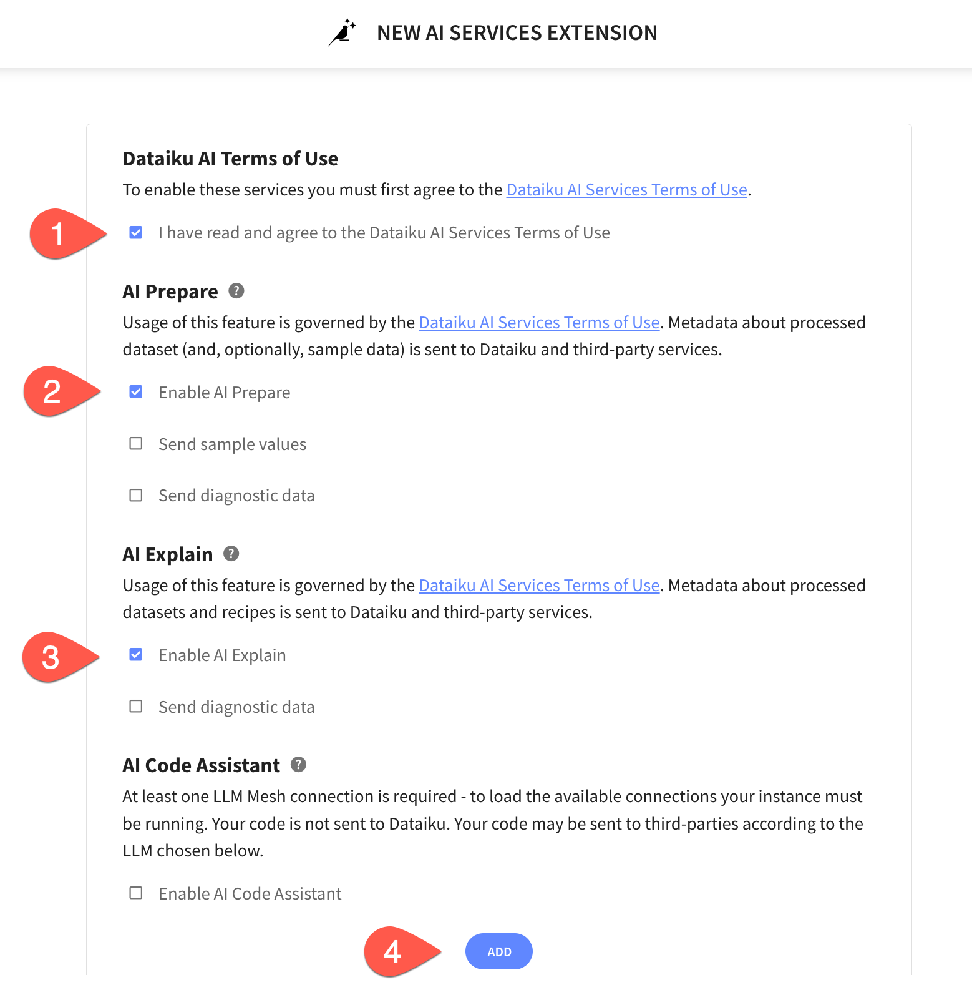

You’ve now successfully set up your Dataiku trial account via Snowflake’s Partner Connect. We are now ready to continue with the lab. For this, move back to your Snowflake browser.


<!-- ------------------------ -->

## Preparing And Exploring The Data In Snowflake 

Duration: 20


### Analysing the data using Snowsight

Now that we’ve done some preparation work, let’s do some primarily data analysis on our data. For this we will use Snowsight, the SQL Worksheets replacement, which is designed to support data analyst activities.

Snowflake recently released the next generation of it’s analytics UI — **Snowsight**. On top of a redesigned interface, there are many improvements for analysts, data engineers, and business users. With Snowsight, it is easier and faster to write queries and get results and collaboration with others through sharing makes it easier to explore and visualize data across your organization. Snowsight includes many features and enhancements, including: 

- **Fast query writing:** Includes smart autocomplete for query syntax keywords or listing values that match table/column names, data filters and quick access to Snowflake documentation for specific functions.
- **Interactive query results:** View summary statistics about the data that has been returned by their query, using histograms of the distribution to identify outliers and anomalies.
- **Attractive data visualizations:** Quickly analyze data without requiring an external analytics/visualization tool, with automatic chart generation and drag-and-drop interface for creating dashboards.
- **Sharing and collaboration:** Share queries, worksheets, visualizations and dashboards securely among teams.
- **Schema browser:** Search instantly across databases and schemas accessible by the current session role for tables, views, and columns whose names contain a specified string. Pin tables for quick reference to see column names and data types.

For more information on using Snowsight, see the [documentation](https://docs.snowflake.com/en/user-guide/ui-snowsight.html).

Let’s run some preliminary analysis on the two tables that we’ll focus on. For this, we will select **Worksheets** under **Projects** in the top left corner.

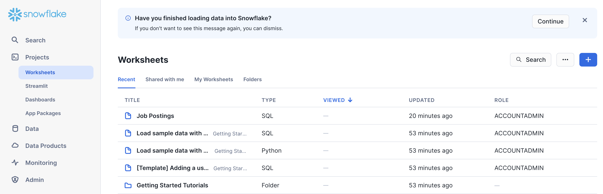


### Data Problem
Sometimes you go through the entire process of building a predictive model and the predictions are quite poor and you trace the issue back to data problems.  In other cases, such as this one, the data changes with time and the models go bad.  


### Preparing the Data for Further Data Analysis and Consumption

#### Step 1 - Create Schema and Tables
Now let's create the datastructuresa into which we are going to load the data. We will be using the database that was created when connecting to Dataiku - `PC_DATAIKU_DB` 

Copy the statements below into your worksheet and run them there.

```sql
   use warehouse PC_DATAIKU_WH;
   use database PC_DATAIKU_DB; 
   create or replace schema RAW; 
   use schema RAW;

   create or replace table EARNINGS_BY_EDUCATION (
     EDUCATION_LEVEL varchar(100),
     MEDIAN_WEEKLY_EARNINGS_USD decimal(10,2) 
   );

   create or replace table JOB_POSTINGS (
     JOB_ID int,
     TITLE varchar(200),
     LOCATION varchar(200),
     DEPARTMENT varchar(200),
     SALARY_RANGE varchar(20),
     COMPANY_PROFILE varchar(20000),
     DESCRIPTION varchar(20000),
     REQUIREMENTS varchar(20000),
     BENEFITS varchar(20000),
     TELECOMMUNTING int,
     HAS_COMPANY_LOGO int,
     HAS_QUESTIONS int,
     EMPLOYMENT_TYPE varchar(200),
     REQUIRED_EXPERIENCE varchar(200),
     REQUIRED_EDUCATION varchar(200),
     INDUSTRY varchar(200),
     FUNCTION varchar(200),
     FRAUDULENT int
   );
```

#### Step 2 - Load Data
The data we want to use is available as csv files. Hence we define a csv file format to make our lives easier

```sql
create or replace file format csvformat
type = csv
field_delimiter =','
field_optionally_enclosed_by = '"', 
skip_header=1;
```

As we have stored the data we want to load on an external S3 bucket, we need to create an external stage to load that data and also a stage for Dataiku to push Snowpark UDFs to.

```sql
CREATE OR REPLACE STAGE JOB_DATA
  file_format = csvformat
  url='s3://dataiku-snowflake-labs/data';

CREATE or REPLACE STAGE DATAIKU_DEFAULT_STAGE;
  
 ---- List the files in the stage 

 list @JOB_DATA;
```

With that all set, we are ready to load the data.

```sql
copy into EARNINGS_BY_EDUCATION 
from @JOB_DATA/earnings_by_education.csv
on_error='continue';

copy into JOB_POSTINGS
from @JOB_DATA/job_postings.csv
on_error='continue';
```

Let's a quick look at the data

```sql
select * from RAW.EARNINGS_BY_EDUCATION limit 10;
```

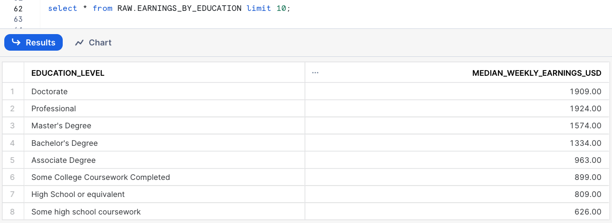

```sql
select * from RAW.JOB_POSTINGS limit 10;
```

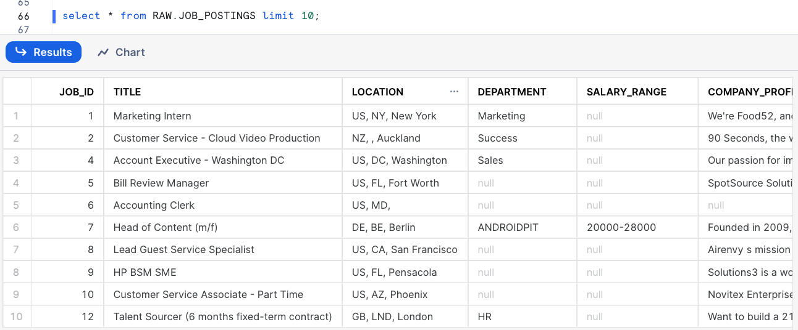

#### Step 3 - Prepare Data for Analytics with Dataiku
With the data loaded into our ```raw``` stage, we want to prepare a table that joins the two sources into one, which we will then use in our workflow in Dataiku. 

Let's start by switching to the Public schema as the Dataiku connection created from Partner Connect has permissions on that.

```sql
use schema PUBLIC;
```

And now on to the new table
```sql
create or replace table JOBS_POSTINGS_JOINED as
select 
    j.JOB_ID as JOB_ID,
    j.TITLE as TITLE,
    j.LOCATION as LOCATION,
    j.DEPARTMENT as DEPARTMENT,
    j.SALARY_RANGE as SALARY_RANGE,
    e.MEDIAN_WEEKLY_EARNINGS_USD as MEDIAN_WEEKLY_EARNINGS_USD,
    j.COMPANY_PROFILE as COMPANY_PROFILE,
    j.DESCRIPTION as DESCRIPTION,
    j.REQUIREMENTS as REQUIREMENTS,
    j.BENEFITS as BENEFITS,
    j.TELECOMMUNTING as TELECOMMUTING,
    j.HAS_COMPANY_LOGO as HAS_COMPANY_LOGO,
    j.HAS_QUESTIONS as HAS_QUESTIONS,
    j.EMPLOYMENT_TYPE as EMPLOYMENT_TYPE,
    j.REQUIRED_EXPERIENCE as REQUIRED_EXPERIENCE,
    j.REQUIRED_EDUCATION as REQUIRED_EDUCATION,
    j.INDUSTRY as INDUSTRY,
    j.FUNCTION as FUNCTION,
    j.FRAUDULENT as FRAUDULENT
from RAW.JOB_POSTINGS j left join RAW.EARNINGS_BY_EDUCATION e on j.REQUIRED_EDUCATION = e.EDUCATION_LEVEL;
```

Your data should now look like this
```sql
select * from PUBLIC.JOB_POSTINGS_JOINED;
```
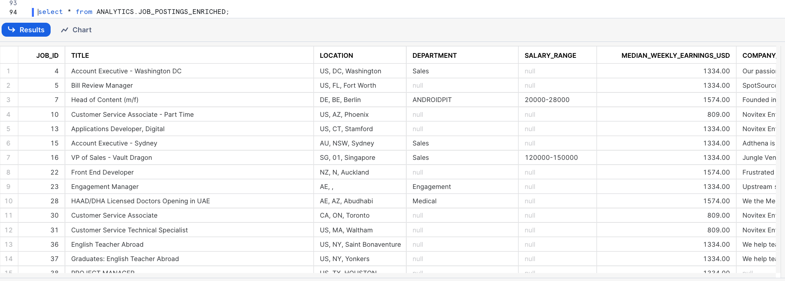


#### Step 4 - Grant Dataiku Access to Data
As a last step before heading over to Dataiku, we need to make sure that it can read the data we just loaded and joined. (Note: You wouldn't typically grant ALL like this but we are in isolated trial accounts)
```sql
grant ALL on all schemas in database PC_DATAIKU_DB to role PC_Dataiku_role;
grant ALL privileges on database PC_DATAIKU_DB to role PC_Dataiku_role;
grant ALL on all stages in database PC_DATAIKU_DB to role PC_Dataiku_role;
```

> aside positive
> 
>  **Snowflake Compute vs Other Warehouses** <br> Many of the warehouse/compute capabilities we just covered, like being able to create, scale up and out, and auto-suspend/resume warehouses are things that are simple in Snowflake and can be done in seconds. Yet for on-premise data warehouses these capabilities are very difficult (or impossible) to do as they require significant physical hardware, over-provisioning of hardware for workload spikes, significant configuration work, and more challenges. Even other cloud data warehouses cannot scale up and down like Snowflake without significantly more configuration work and time.

> aside negative
> 
>  **Warning - Watch Your Spend!**

During or after this lab you should *NOT* do the following without good reason or you may burn through your $400 of free credits more quickly than desired:

- Disable auto-suspend. If auto-suspend is disabled, your warehouses will continue to run and consume credits even when not being utilized.
- Use a warehouse size that is excessive given the workload. The larger the warehouse, the more credits are consumed.

We are going to use the virtual warehouse `PC_DATAIKU_WH` for our Dataiku work. However, we are first going to slightly increase the size of the warehouse to increase the compute power it contains.

On the top right corner of your worksheet, click on the warehouse name. In the dialog, click on the three lines on the top right to get to the details page of the warehouses. There, change the size of the `PC_DATAIKU_WH` data warehouse from X-Small to Medium. Then click the “Finish” button.

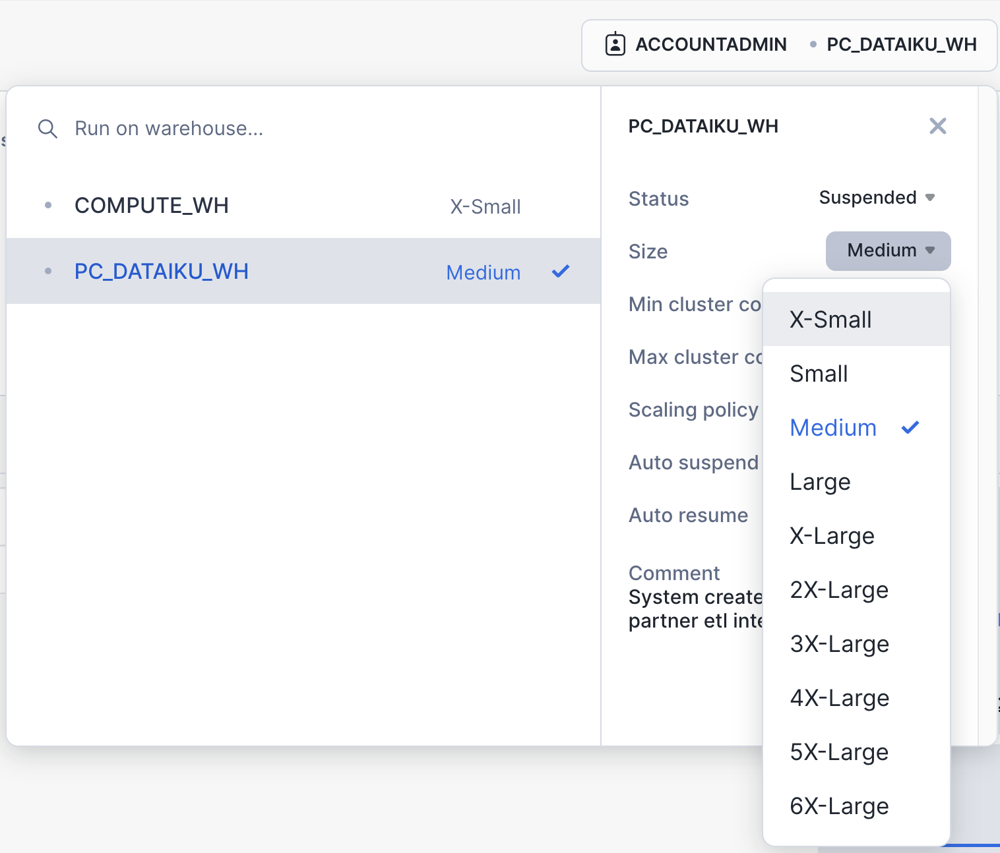

Alternatively, you can also run the following command in the worksheet:
```sql
alter warehouse PC_DATAIKU_WH set warehouse_size=MEDIUM;
```

<!-- ------------------------ -->

## Creating And Running A Dataiku Project

Duration: 10

For this module, we will login into the Dataiku hosted trial account and create a Dataiku project.

Here is the project we are going to build along with some annotations to help you understand some key concepts in Dataiku. 

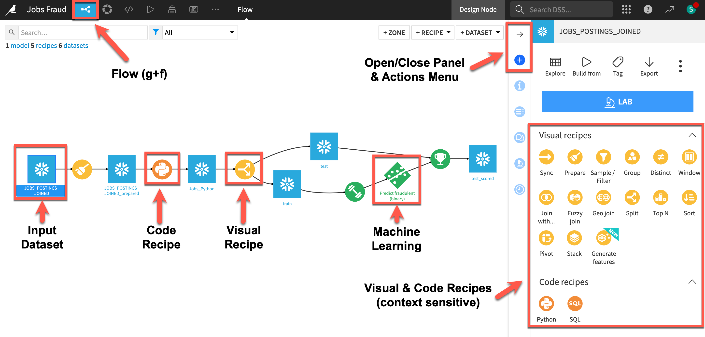


* A **dataset** is represented by a blue square with a symbol that depicts the dataset type or connection. The initial datasets (also known as input datasets) are found on the left of the Flow. In this project, the input dataset will be the one we created in the first part of the lab.

* A **recipe** in Dataiku DSS (represented by a circle icon with a symbol that depicts its function) can be either visual or code-based, and it contains the processing logic for transforming datasets.

* **Machine learning processes** are represented by green icons.

* The **Actions Menu** is shown on the right pane and is context sensitive.

* Whatever screen you are currently in you can always return to the main **Flow** by clicking the **Flow** symbol from the top menu (also clicking the project name will take you back to the main Project page).

>aside positive
> You can refer back to this completed project screenshot if you want to check your progress through the lab. (Note though that if you choose to use the 
> SnowparkML plugin your final flow will look a little different)

>aside negative
>**NOTE:** If you didn't setup AI Assistants from the Extensions menu in the earlier Partner Connect lab do it now. 

### Creating a Dataiku Project

Go back to your Dataiku Cloud instance landing page. 

1. Ensure you are on the `Overview` page
2. Click on `OPEN INSTANCE` to get started.

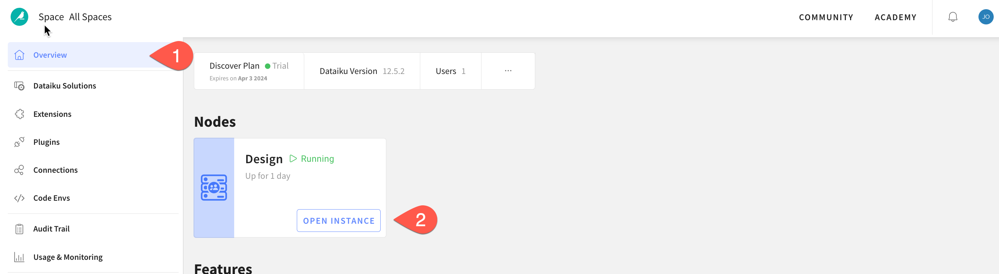

Congratulations you are now using the Dataiku platform! For the remainder of this lab we will be working from this environment which is called the `design node`, its the pre-production environment where teams collaborate to build data products.

Now lets create our first project. There are lots of existing options and accelerators available to us but for this lab we will start with a blank project.

1. Click on the `+ NEW Project` button on the right hand side
2. Select `Blank Project`
3. Give your project a name such as `Jobs Fraud`
4. Click on `Create`

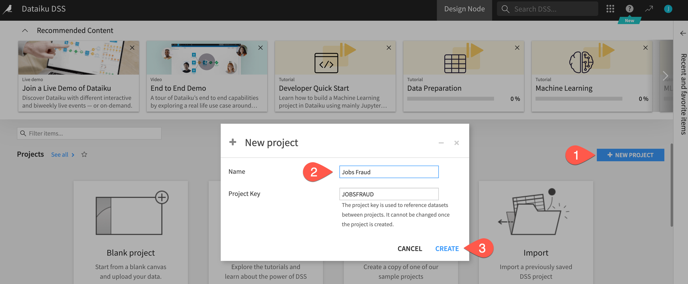


Success! You’ve now created a dataiku project.


Click on `Got it!` to minimize the pop-up on `Navigation and help in DSS` and return to the project home screen.

Review the Dataiku DSS page. There are a few things to note from the project landing page on an example project:

- The project name, image associated with the project, collaborators, and optional tags:


- The number and types of objects in the project.


- A description of the project written in markdown, can link specific Dataiku objects (e.g., datasets, saved models, etc.) in the description:


- Summary of project (history is saved in a git log) as well as a Chat function for better collaboration:


### Import Datasets

Import the dataset from Snowflake

Click on `+IMPORT YOUR FIRST DATASET`


Under SQL, select `Snowflake`

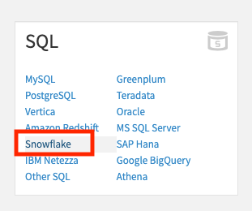

1.To load the table, select the connection that was just created for us from `Partner Connect`. In the Table section select `Get Tables List`. Dataiku will warn you that this may be long list but we can OK this.

2. Search for and select the `JOBS_POSTINGS_JOINED` table we just created in Snowflake.
 
3. Then click `TEST TABLE` to test the connection

4. If successful set the `New dataset name` (top right) to `JOBS_POSTINGS_JOINED` and click on `CREATE`.

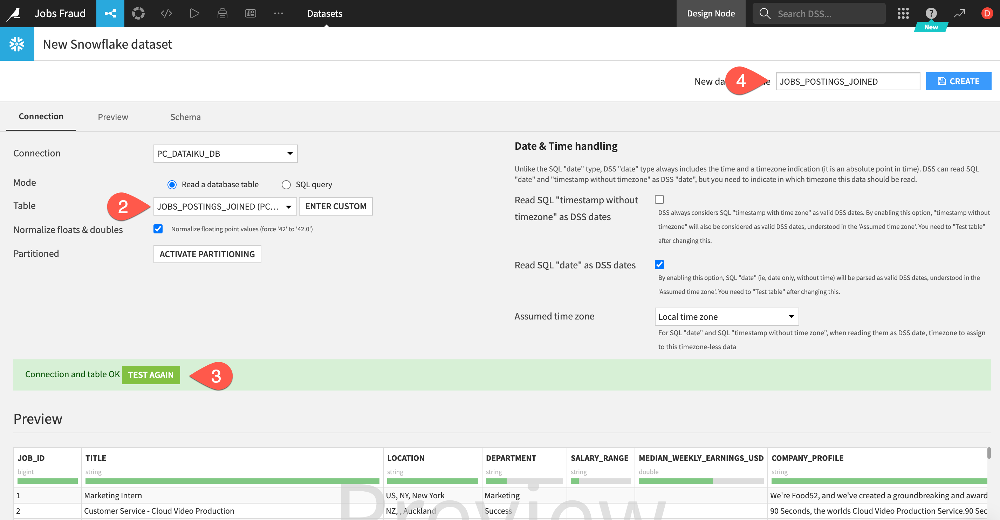


Return to the flow by clicking on the `flow` icon in the top left *(keyboard shortcut g+f)*

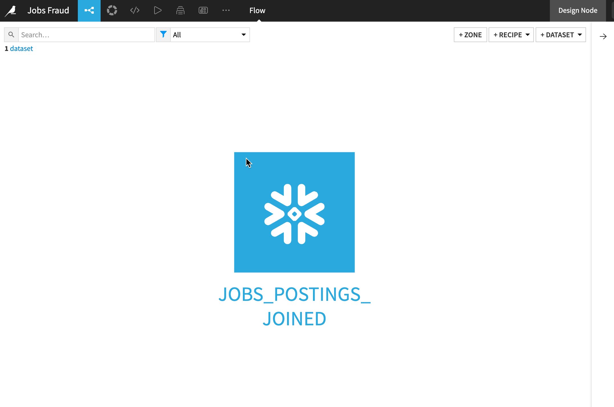


Double click on the `JOBS_POSTINGS_JOINED` dataset


The `JOBS_POSTINGS_JOINED` table contains data on a location and day basis about the number and types of cases (Active, Confirmed, Deaths, Recovered) that day.

Dataiku reads a sample of 10000 rows by default. The sampling method can be changed under `Configure Sample` but for this lab we can leave it as the default:


Dataiku automatically detects data type and meaning of each column. The status bar shows how much of the data is valid (green), invalid (red), and missing (grey). You can view column Stats (data quality, distributions) by clicking `Quick Column Stats` button on the right:


Click the `close` button when you are finished


<!-- ------------------------ -->

## Cleaning The Data With The Prepare Recipe

Duration: 20

After exploring our data we are going to perform some transformation steps to clean the data and generate new features.


> aside positive
> There are two really important concepts happening in this lab:
>
> **Firstly** The data stays in Snowflake. We work on a configurable sample of the data in memory, our dataset is quite small but it might not be 
> and by working on a sample in memory we avoid unnecessary movement of data out of Snowflake.
>
> **Secondly** When you run the transformations you build in this section you may notice beneath the `RUN` button Dataiku specified the engine as `In-database`.
> Dataiku will always try to use the most efficient engine for any job and in this case it sees we 
> are working on Snowflake data and will therefore push down to the Snowflake Virtual Warehouse 
> that was created when we set up through Partner Connect.
> 
> The ability of Dataiku to minimise data movement and push the code to where the data lives gives great benefits in terms of performance, costs and governance. 


Dataiku terms these transformation steps as `Recipes` and they may be visual (UI) or code based (a variety of editors, notebooks and IDE's are available). 

Lets start with a visual recipe called the `Prepare` recipe. You can think of this recipe like a toolbox with lots of different tools for a variety of data transformation tasks. You build a series of transformation steps and check their effect on a sample of the data before pushing them to the full dataset.

1. Select your dataset from the flow (remember you can use the `g+f` keyboard shortcut)
2. After highlighting the dataset by clicking on it once go to the right hand actions menu select the `Prepare` recipe from the Visual Recipes list
3. You can leave the defaults and click on `CREATE RECIPE`

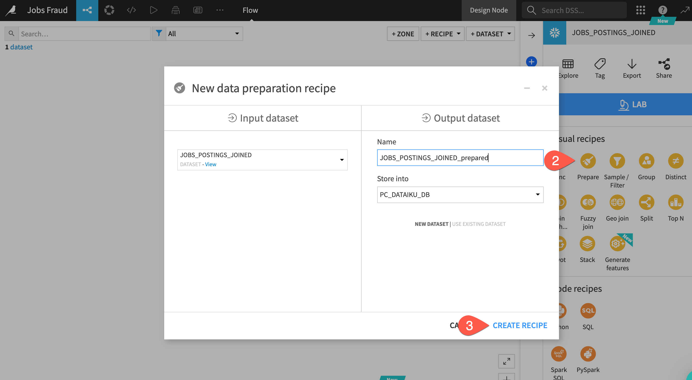


### Location Column

Looking at our data we can see the location column has a lot of information contained within it that could make useful features for our model however in its current comma separated string format it is not that useful. Lets use the `Split` processor to pull out the location information into their own columns.

1. Click on the `+ ADD A NEW STEP` button on the left
2. You can use the search window to find the split processor
3. Select the `Split Column` processor. 


A new step is added to script on the left. We now need to populate the fields so Dataiku knows how we'd like to apply the split.

1. For the column we want to enter `location` 
2. It's comma separated so the delimiter will be `,`
3. We can leave the prefix as the default
4. Select the `Truncate` option
5. Since there are three comma separated location values change the columns to keep to `3`
6. As you fill in the values you can see the effects live in the blue columns which is a great way of understanding the impact of the changes you are making and if it is the desired outcome.


>aside positive
> In addition to `g+f` one of the other most useful keyboard shortcuts is `c` when your are in the Explore tab. This allows you to search and scroll to a 
> particular column. Very useful for wider datasets. 
> Take a look at the [Documentation](https://doc.dataiku.com/dss/latest/accessibility/index.html) for more.


Splitting the column was useful but lets make the column names a little more human readable. We can use the rename processor for this. Select the `Rename` processor just like you did for Split and then click on `+Add Renaming` and rename location_0 to country. Repeat for location_1 and location_2 changing them to state and city respectively. The step should look like this

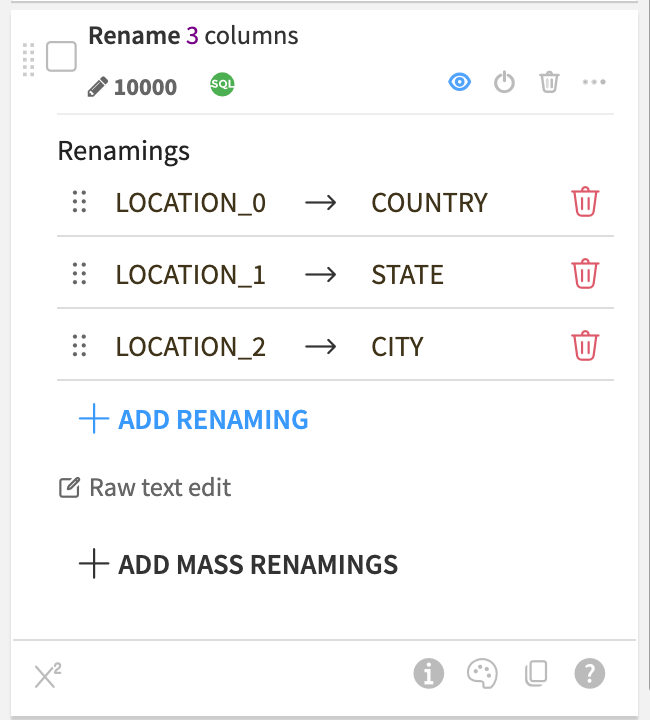

> aside positive
> You could also achieve this by right clicking on the column name and selecting `rename`. 
> When you right click on a column Dataiku makes suggestions on the most common transformations based
> on the type of data in the column.  

### Text Columns

Next we have a number of text columns. When building a machine learning model there are a number of techniques we can use to work with text data, we are going to simplify the text and use the Normalise feature which transforms to lowercase, removes punctuation and accents and performs Unicode NFD normalization (Café -> cafe).

We could search for the processor we want and configure it like before but since we are new to Dataiku lets use the AI Prepare assistant to help us out this time. We can describe the steps we want and allow the AI Assistant to look through the 100+ processors and configure them to our requirements.

1. Click on `AI PREPARE` button on the left side of the screen
2. In the text box paste in the following prompt and then click on `GENERATE`

```
normalize text for the columns COMPANY_PROFILE, DESCRIPTION, REQUIREMENTS, BENEFITS. 
dont create a new column, update in place
```
The AI Assitant generates the 4 steps for us and documents them to make the results are easy to review for everyone using the data preparation job

Now we have normalized the text in those columns we might consider creating a new feature based on the length. Our theory might be that scammers will focus on the salary and buzzwords to get people to apply and are less likely to populate the job description and company background. 

Again if we know the processor we want we can just search and use it directly. In our case as we're new to Dataiku let's use the AI Prepare assistant to help us out. 

1. Click on `AI PREPARE` button on the left side of the screen
2. In the text box paste in the following prompt and then click on `GENERATE`

```
calculate the length of the columns COMPANY_PROFILE, DESCRIPTION, REQUIREMENTS, BENEFITS.
write them to new columns with the prefix LENGTH_
```

If your script now matches the below screenshot go ahead and click on the green `RUN` button at the bottom of the script.


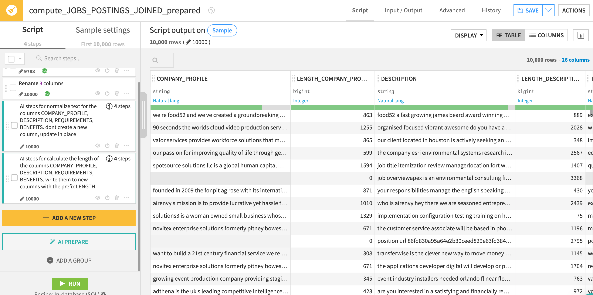


> aside negative
> Using AI Assistants in this way can be a very powerful tool but it is important to review the generated steps to ensure that it achieves 
> your aims accurately.


<!-- ------------------------ -->
## Feature Engineering With Snowpark

Duration: 12

In addition to a wide number of visual tools to enable to the low/no coder Dataiku also provides rich and familiar toolsets and language support for coders. 

In this section we will put ourselves in the shoes of a data scientist that is collaborating on the project. Whilst they can get value from tools like the Prepare recipe they may be looking for full code experience so in this section we will use the built-in support in Dataiku for notebooks and IDE's

Lets use a Jupyter notebook to create a Snowpark for Python function to extract the minimum salary range

When using Dataiku's SaaS option from Partner Connect the setup is done for us automatically and we checked that in our earlier lab where we set up the AI Services. If for any reason you skipped that step earlier then return to your browser tab with `Dataiku Launchpad` open (if you have shut this just go to [Launchpad](https://launchpad-dku.app.dataiku.io/) and check that `Snowpark` is enabled under the `Extensions` 

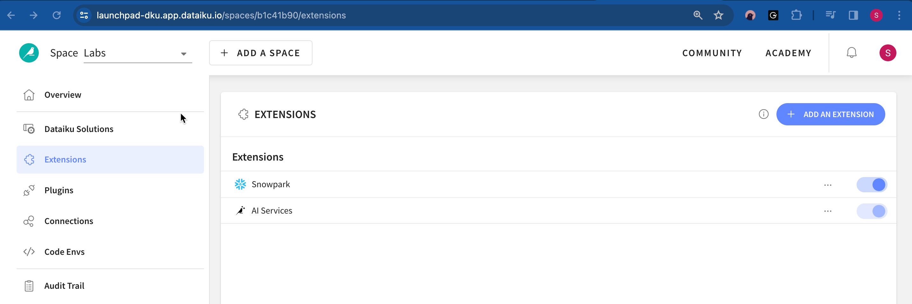

### Snowpark code

>aside positive
> **Integrations:** Much like in our last chapter here we are using Dataiku's deep integrations with Snowflake to work on data in the most efficient way. Our data scientist can 
> use the tools they are most familiar with in Dataiku whilst also collaborating on the project with non-coding colleagues and even packaging custom code-based functions in a visual interface to expose complex tasks to less technical users. The data is loaded into a 
> Snowpark Python DataFrame and when we execute our code we push the computation to Snowpark.

Lets create our Python code recipe:

1. From the flow select the output dataset from our prepare recipe and then from the actions menu on the right select `Python` from the code recipes section.
2. In the `Outputs` section click `+ ADD`
3. Let's name our new output dataset `Jobs_Python`
4. Click `Create Dataset`
5. Click `CREATE RECIPE`

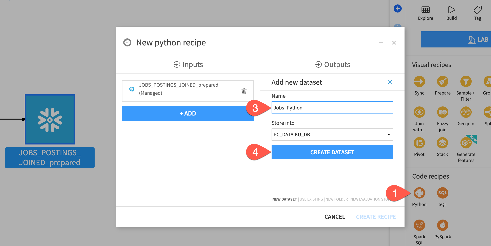

We need to set a code environment that has the correct packages in. Fortunately that has been created for us, we just need to select it for this recipe.

1. Click on the `Advanced` tab at the top of the screen
2. Under the Python Env. section change the `Selection behaviour` to `Select an environment`
3. In the `Environment` drop down select the `snowpark` code environment.
4. Click `Save`
5. Select `Code` tab to return to the main editor

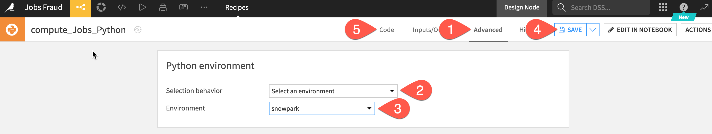


> aside positive
> **A Note on Code Environments:**  Dataiku uses the concept of code environments to address the problem of managing dependencies and 
> versions when writing code in R and Python. Code environments provide a number of benefits such as **Isolation and Reproducibility** of 
> results. When using Snowpark for Python from Dataiku you will use a code environment that includes the Snowpark library as well as other
> packages you wish to use. In our lab, to make things easy, we are using a default Snowpark code environment which just contains just the
> minimum required libraries but once you have completed the lab and wish to explore further you can create your own code environments.


In addition to selecting an appropriate code environment there are just a couple of extra lines of code to add to your DSS recipe to start using Snowpark for Python 


 Helpfully we can use one of the many code samples available to us.

1. Delete the automatically generated python starter code
2. Click on the `{CODE SAMPLES}` button 
3. Search for Snowpark 
4. Select the `Read and write datasets with Snowpark` option
3. Click `+ INSERT`


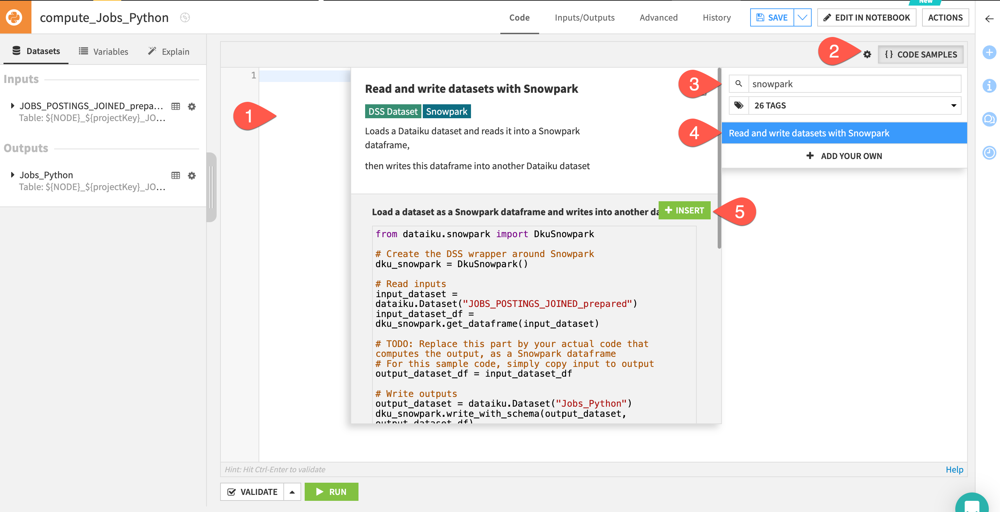


You now have some starter Snowpark code with the correct input and output dataset names. 

We could carry on using the default code editor if we wish but we also have the option to use notebooks or IDE's so lets go ahead and use the in-built Jupyter notebook for the next part.

1. Click on `EDIT IN NOTEBOOK` option in the top-right. We are going to use the Dataiku package and some Snowpark functions so lets add that now and feel free to separate into cells if you wish. Add the following two lines at the start of your code:

```
#add these two lines at the start of your code
import dataiku
from snowflake.snowpark.functions import *

```

Now lets take a simple example of feature engineering in code. `Delete` the section that reads:

```
# TODO: Replace this part by your actual code that computes the output, as a Snowpark dataframe
# For this sample code, simply copy input to output
output_dataset_df = input_dataset_df
```

Lets replace that deleted section with our Snowpark for Python code to generate a new feature called `min_salary` 

```
#strip minimum salary from the given range
output_dataset_df = input_dataset_df.withColumn('"MIN_SALARY"', split(col('"SALARY_RANGE"'), lit('-'))[0])
```

> aside positive
> Of course this is a very simple piece of feature engineering and our data scientist could go much further but it demonstrates how our code first users can easily work alongside their colleagues
>

Your code should now look similar to this (don't worry if you haven't separated your code into cells)

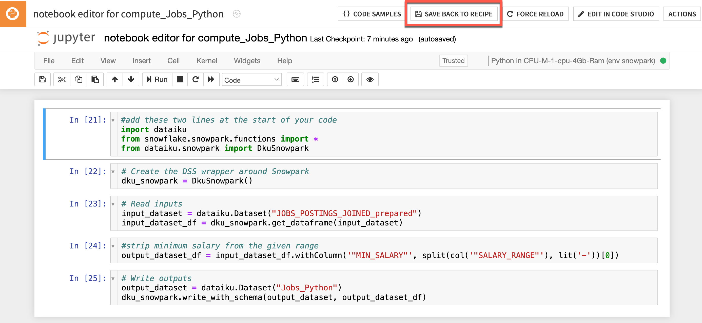

1. Run your cell(s) to make sure your code is correct
2. Click the `SAVE BACK TO RECIPE` button near the top of the screen
3. From the default code editor click `RUN`


<!-- ------------------------ -->

## Split The Dataset

Duration: 5

> aside positive
> For the remainder of this lab we will be using Dataiku's Visual ML interface to design, train & test our model. This is the best option for most circumstances, however if you are specifically interested in trying out Snowflakes SnowparkML library then you could, of course, write that code from Dataiku as we just saw with the Python recipe but, even better, Dataiku provides a UI via a plugin so non-coders can use it. If you wish to develop your model using that plugin then jump to the optional chapter on the SnowparkML plugin near the end of this guide
>

One advantage of an end-to-end platform like Dataiku is that data preparation can be done in the same tool as machine learning. For example, before building a model, you may wish to create a holdout set. Let’s do this with a visual recipe.

### Steps

1. From the Flow, click the `Jobs_Python` dataset once to select it.

2. Open the Actions tab on the right.

3. Select the Split recipe from the menu of visual recipes.

4. Click `+ Add`; name the output `train`; and click Create Dataset.

5. Click `+ Add` again; name the second output `test`; and click Create Dataset.

6. Once you have defined both output datasets, click `Create Recipe`.

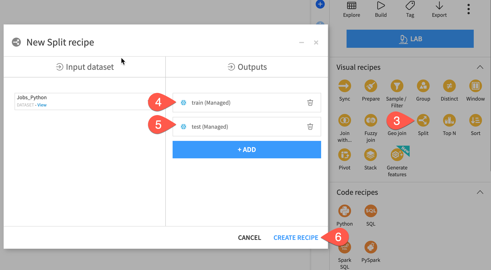

### Define a split method

 On the Splitting step of the recipe, choose `Dispatch percentiles of sorted data` as the splitting method.

1. Set to sort according to `JOB_ID`
2. Set the ratio of 80 % to the `train` dataset, and the remaining 20% to the `test` dataset.
3. Click the green Run at the bottom left to build these two output datasets.


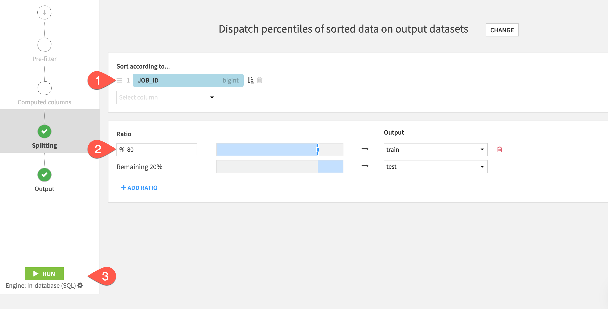

When the job finishes, navigate back to the Flow (g + f) to see your progress.


<!-- ------------------------ -->

## Train A Model

Duration: 5

The first step is to define the basic parameters of the machine learning task at hand.

 1. Select the train dataset.

 2. In the Actions tab, click on the Lab button. Alternatively, navigate to the Lab tab of the right side panel (shown below).

 3. Among the menu of visual ML tasks, choose AutoML Prediction.

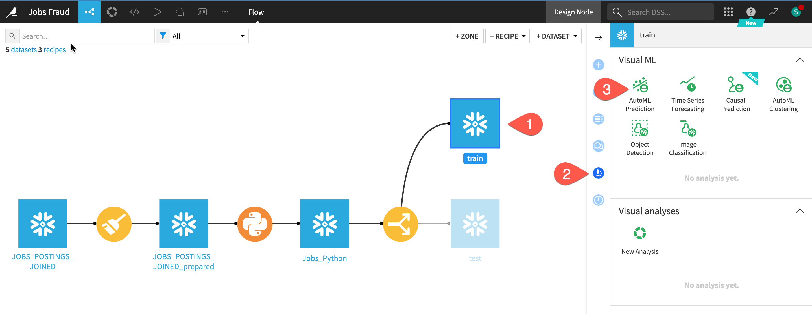

Now you just need to choose the target variable and which kind of models you want to build.

1. Choose `FRAUDULENT` as the target variable on which to create the prediction model.

2. Click Create, keeping the default setting of Quick Prototypes.

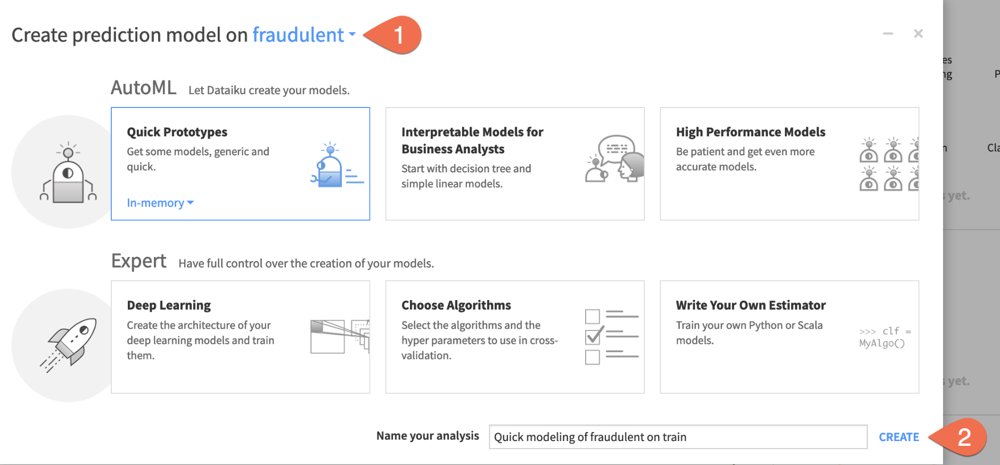

### Train models with the default design

Based on the characteristics of the input training data, Dataiku has automatically prepared the design of the model. But no models have been trained yet!

1. Before adjusting the design, click Train to start a model training session.

2. Click Train again to confirm.

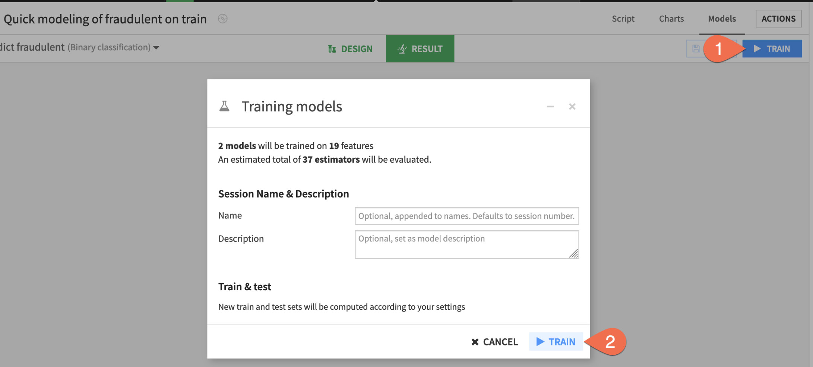

<!-- ------------------------ -->

## Inspect The Results

Duration: 10

Once your models have finished training, let’s see how Dataiku did.

1. While in the Result tab, click on the Random forest model in Session 1 on the left hand side of the screen to open a detailed model report.

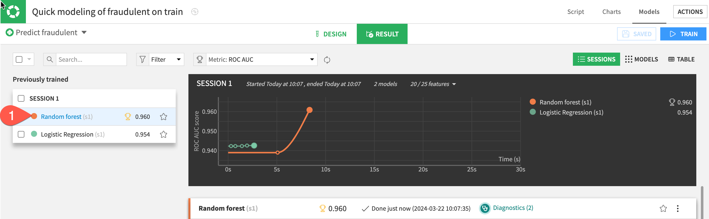

### Check Model Explainability - Feature Importance

One important aspect of a model is the ability to understand its predictions. The Explainability section of the report includes many tools for doing so.

1. In the Explainability section on the left, click to open the `Feature importance` panel to see an estimate of the influence of a feature on the predictions.

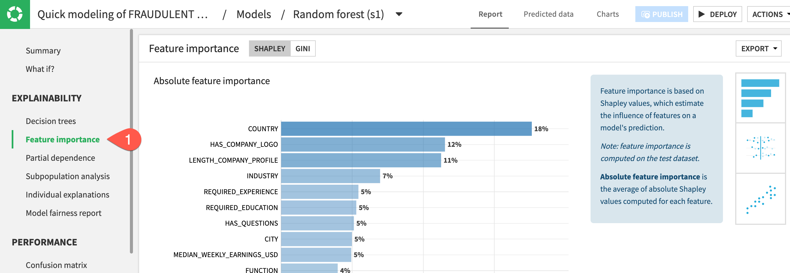

### Check Model Explainability - Confusion Matrix

A useful tool to evaluate and compare classification models is the confusion matrix. This compares the actual values of the target variable to our models predictions broken down into where the model got it right (true positives & true negatives) and where it got it wrong (false positives & false negatives).

1. In the Performance section on the left, click to open the `Confusion Matrix` panel

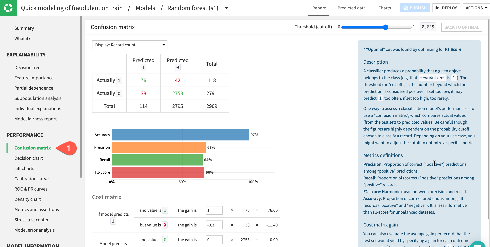


### Check Model Explainability - What If?

What if analyses can be a useful exercise to help both data scientists and business analysts get a sense for what a model will predict, given different input values. You can use the drop-down menus and sliders to adjust the values, type in your own, or even choose to ignore features to simulate a situation with missing values. On the right, you can review the new prediction based on your inputs.

1. Click on the `What If?` to open the panel.

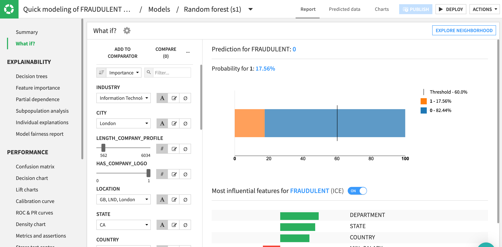


### Check Model Information

Alongside the results, you’ll also want to be sure how exactly the model was trained.

1. In the Model Information section, click to open the Features panel to check which features were included in the model, which were rejected (such as the text features), and how they were handled.

2. When finished, at the top of the model report, click on Models to return to the Result home.

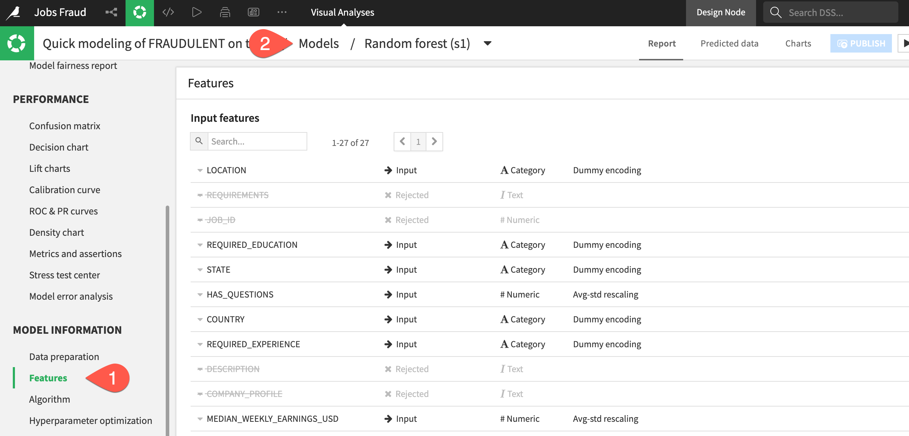


> aside positive
> There are many more features to better understand your model. Feel free to explore them as time permits

<!-- ------------------------ -->
## Iterate On The Model Training Design (optional)

Duration: 10

> aside positive
> This chapter is optional in the lab for timing reasons but would be a standard part of real world model development. 
> Feel free to cover it now if you have time or return to it later to improve your model

Thus far, Dataiku has produced quick prototypes. From these baseline models, you can work on iteratively adjusting the design, training new sessions of models, and evaluating the results.

1. Switch to the `Design` tab at the top center of the screen.

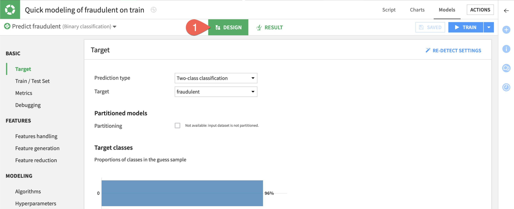

### Tour the Design tab

From the Design tab, you have full control over the design of a model training session. Take a quick tour of the available options. Some examples include:

1. In the `Train / Test Set` panel, you could apply a k-fold cross validation strategy.

2. In the `Feature reduction` panel, you could apply a reduction method like Principal Component Analysis.

3. In the `Algorithms` panel, you could select different machine learning algorithms or import custom Python models.

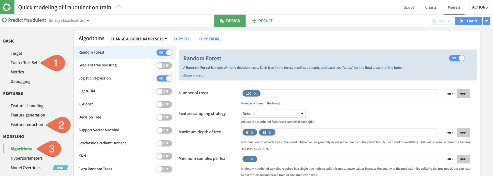

### Reduce the number of features

Instead of adding complexity, let’s simplify the model by including only the most important features. Having fewer features could hurt the model’s predictive performance, but it may bring other benefits, such as greater interpretability, faster training times, and reduced maintenance costs.

1. In the `Design` tab, navigate to the `Features handling` panel on the left.

2. Click the box at the top left of the feature list to select all.

3. For the role, click `Reject` to de-select all features.

4. Turn on the three most influential features according to the Feature importance chart seen earlier: `COUNTRY, HAS_COMPANY_LOGO, LENGTH_COMPANY_PROFILE`.

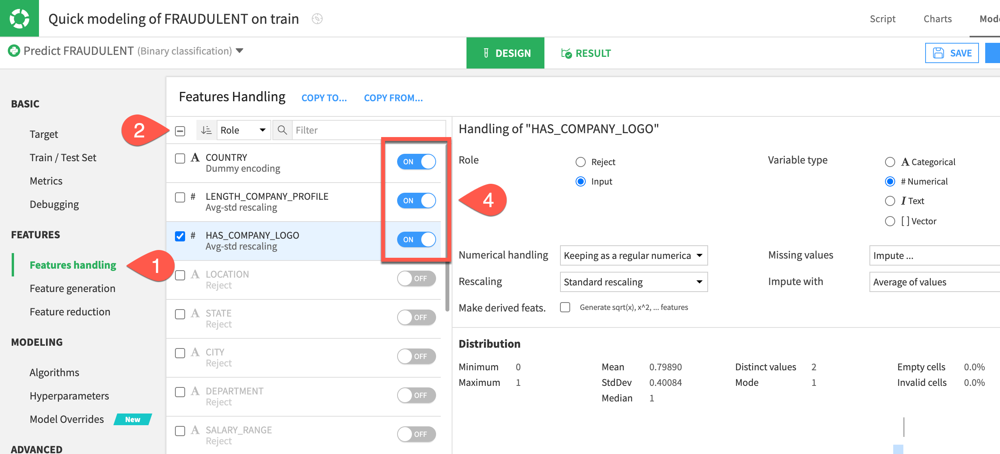

>aside positive
> Your top three features may be slightly different. Feel free to choose these three or the three most important from your own results.

### Train a second session 

Once you have just the top three features in the model design, you can kick off another training session.

1. Click the blue `Train` button near the top right to start the next session.
2. Click `Train` once more to confirm.

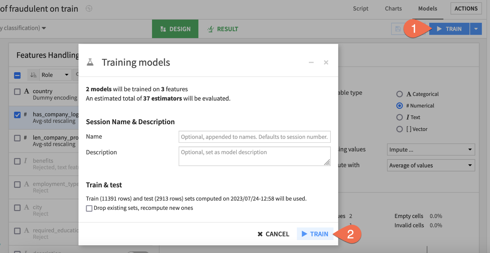

>aside negative
> In reality our results from both training runs are suspiciously high and would merit further investigation. Indeed if you click on the diagnostics that Dataiku helpfully runs for each training session you can see a warning for an imbalanced dataset. If you switch the metric to `F1` (which is a better metric for imbalanced datasets) you will see a significant drop in score. There are many ways Dataiku can help, for example with the `class rebalancing` sampling method. It is beyond the scope of this course but read up in our 
> documentation or blogs or take one of the more advanced Dataiku Academy ML courses to understand how Dataiku ML Diagnostics can help you identify and troubleshoot potential issues and suggest possible improvements as you build your model. 

<!-- ------------------------ -->

## Apply A Model To Generate Predictions On New Data

Duration: 8

Up until now, the models you’ve trained are present only in the Lab, a space for experimental prototyping and analysis. You can’t actually use any of these models until you have added them to the Flow, where your actual project pipeline of datasets and recipes lives. Let’s do that now!

### Choose a model to deploy

Many factors could impact the choice of which model to deploy. For many use cases, the model’s performance is not the only deciding factor.

Compared to the larger model, the simple model with three features cost about 4 hundredths of a point in performance. For some use cases, this may be a huge amount, but in others it may be a bargain for a model that is more interpretable, cheaper to train, and easier to maintain. Since performance is not too important in this tutorial, let’s choose the simpler option.

1. From the Result tab, click the Random forest (s2) to open the model report of the simpler random forest model from Session 2.

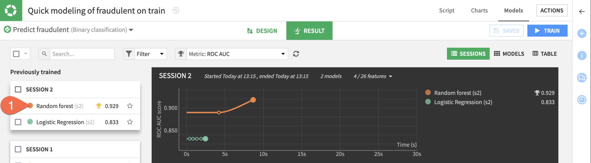

Now you just need to deploy this model from the Lab to the Flow.

1. Click `Deploy` near the top right.
2. Click `Create` to confirm.

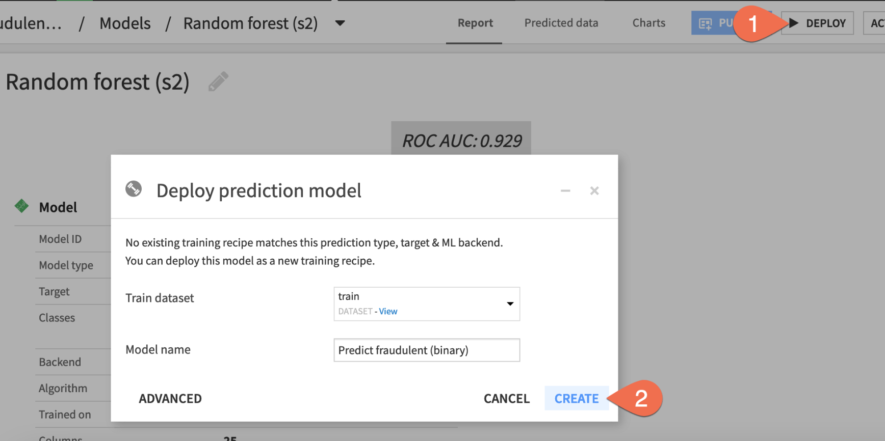

### Score Data

You now have two green objects in the Flow that you can use to generate predictions on new data: a training recipe and a saved model object.

1. From the Flow single click on the diamond-shaped saved model to select it
2. From the Actions menu select the `Score` recipe
3. For the `Input Dataset` select the `test` dataset
4. Click `CREATE RECIPE`

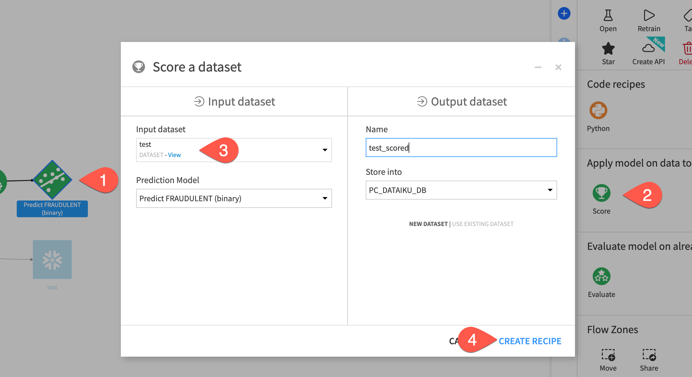

1. From the Score recipe you can leave the defaults but make sure that Snowflake Java UDF is selected as the engine. If it isn't click on the gear cog and select it. When you are done click `RUN` 

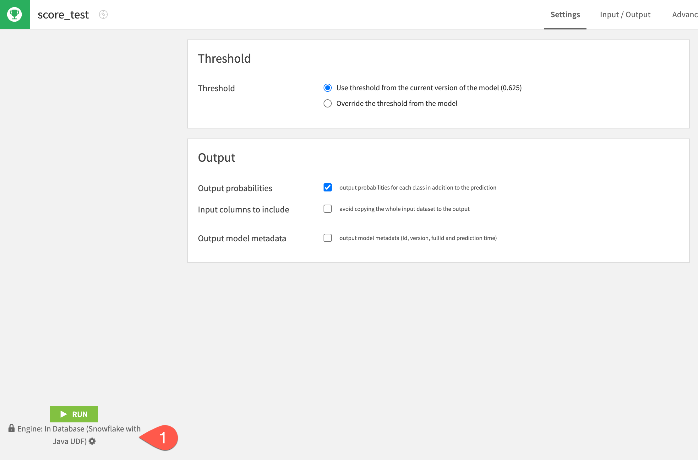

>aside positive
> You may notice the `..Java UDF` part of that engine. This is one of a number of places that Dataiku embeds Snowpark Java UDFs into the product for the 
> best integration and performance. From your perspective as a user Dataiku will take care of the details and it simply means the task at hand runs faster


### Inspect the scored data

Compare the schemas of the test and test_scored datasets.

1. When the job finishes, click Explore dataset `test_scored`.
2. Scroll to the right, and note the addition of three new columns: `proba_0, proba_1, and prediction`.
3. Navigate back to the Flow to see the scored dataset in the pipeline.

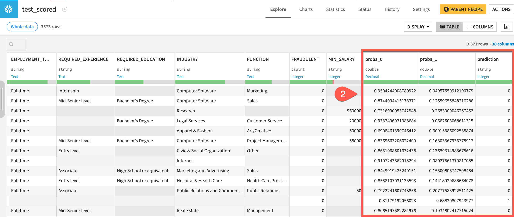

>aside positive
> How well was the model able to identify the fake job postings in the test dataset? That is a task for the Evaluate recipe, which you will encounter in other learning resources.

<!-- ------------------------ -->

## Document The Flow (optional)


> aside positive
> This chapter is optional in the lab for timing reasons but documenting your project along with other capabilities in Dataiku like automatic generation of model documentation is important in MLOps) 

Dataiku can generate explanations of project Flows. The feature leverages a Large Language Model (LLM) to do this.

- On the Flow screen open the Flow Actions menu
- Select Explain Flow

It is possible to adjust the generated explanations for language, purpose and length. Apply the following and then set the generated text as the project description.

- Language: English
- Purpose: Business
- Length: Medium

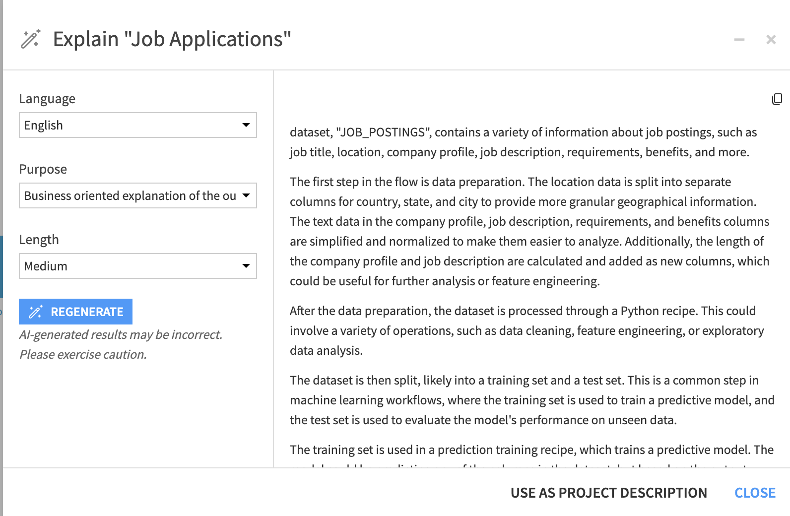

<!-- ------------------------ -->


## Using Snowpark ML Plugin (optional)

Snowflake recently released a collection of python APIs enabling efficient ML model development directly in Snowflake. You can, of course, use this library directly from Dataiku in a code recipe but we also provide a free to use plugin to provide a UI.

There are a few steps you need to take to install the plugin and prepare the data.

### Install the plugin

1. Return the Dataiku Cloud launchpad (https://launchpad-dku.app.dataiku.io)
2. In the `Plugins` section select `+ ADD A PLUGIN`
3. Search for and install the Visual SnowparkML plugin

### Data pre-processing

When using the plugin there are a few additional pre-processing steps necessary that we don't need to do when using Dataiku's standard Visual ML interface. Firstly we would need to make sure that all the column names are in uppercase but fortunately in our dataset that is already the case. Secondly we need to make sure that any columns of type `int` that have missing values are converted to `doubles`

1. Click once on the `Jobs_Python` dataset in the flow to select it and then choose the `Prepare` recipe from the Actions menu, just like we did earlier in the lab
2. There are a number of columns of type `int` with missing values. Change these to doubles by clicking on the datatype under the column name and selecting it.
3. Click `RUN`

### SnowparkML Plugin

Now we have performed our preprocessing select the output dataset and then the plugin from the `Actions` menu (Note: You may need to scroll down to find the plugins, they are below the code and LLM recipes)

There are a number of output fields to fill:

1. Set an output dataset name for the `Train Dataset Output`
2. Set an output dataset name for the `Test Dataset Output`
3. Set a name for `Model Folder` where the MLflow experiment tracking data and trained models will be stored
4. Optionally you can set a folder for the final best model but we can leave this blank

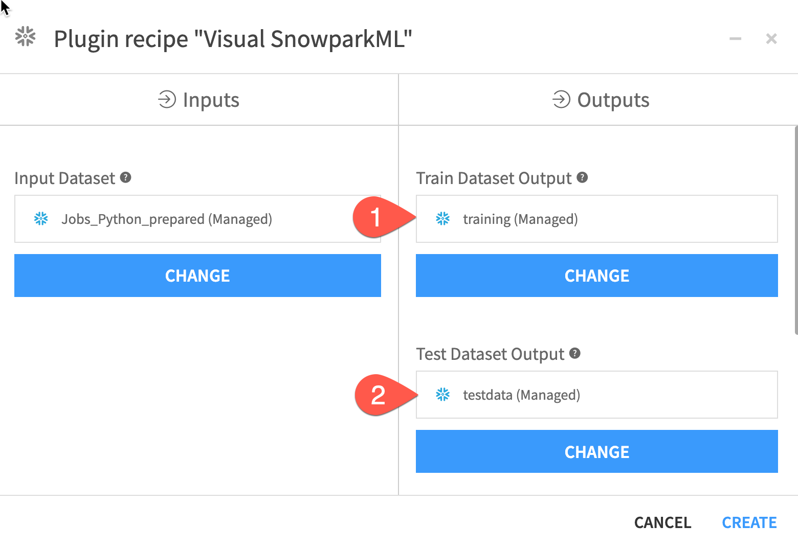

Now we can set the details of our training run. 

1. Give the final model a name
2. Set the target column to `Fraudulent`
3. This is a `Two-class classification` problem
4. The ratio can be set to `0.8` for the standard 80/20 split and a random seed can also be set.

You can now set your Metrics, Features, Algos and more for your training session. Just click `RUN` at the bottom left when you are happy with your setup

 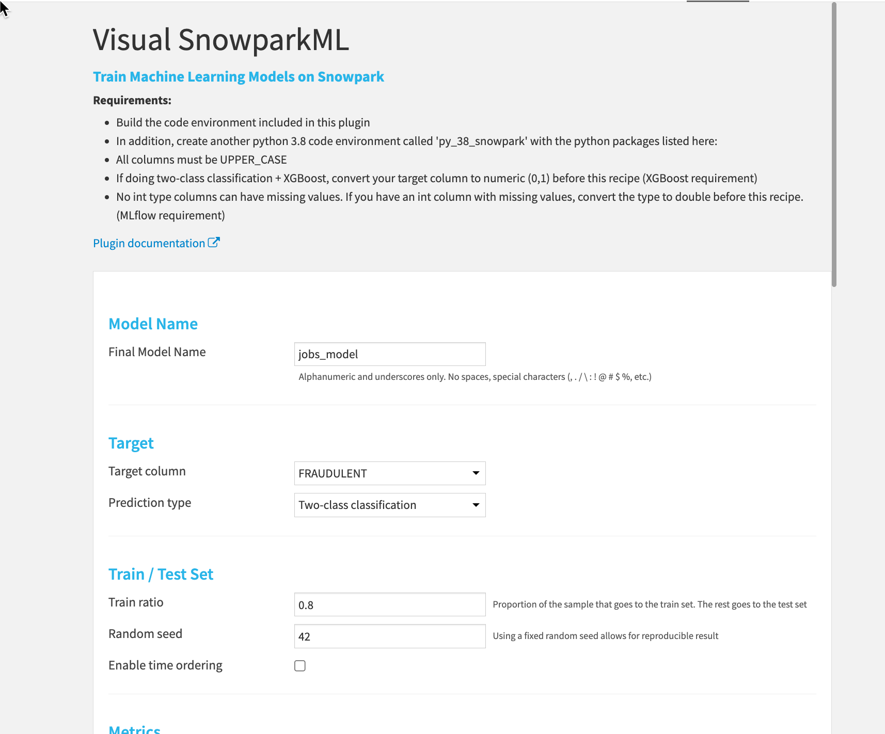

Congratulations. You are using SnowparkML from a UI! You can explore your model from the `MLflow` green diamond in the `Flow` looking at explainability and performance measures, model comparisons and much more.

<!-- ------------------------ -->

## Conclusions And Resources

Duration: 3

Congratulations on completing this introductory lab exercise! Congratulations! You've mastered the Snowflake basics and you’ve taken your first steps toward data cleansing, feature engineering and training machine learning models with Dataiku.

You have seen how Dataiku's deep integrations with Snowflake can allow teams with different skill sets get the most out of their data at every stage of the machine learning lifecycle.

We encourage you to continue with your free trial and continue to refine your models and by using some of the more advanced capabilities not covered in this lab.

### What You Learned:

- How to create stages, databases, tables, views, and virtual warehouses.
- How to load structured and semi-structured data.
- How to perform analytical queries on data in Snowflake, including joins between tables.
- How to create a Dataiku trial account through Partner Connect
- How to use both Visual and Code Recipes to explore and transform data
- How to train, explore and understand a machine learning model

### Related Resources

- Join the [Snowflake Community](https://community.snowflake.com/s/)
- Join the [Dataiku Community](https://community.dataiku.com/)
- Sign up for [Snowflake University](http://https://community.snowflake.com/s/snowflake-university)
- Join the [Dataiku Academy](https://academy.dataiku.com/)


