author: b-mckenna
id: A Faster Path to Operational AI with Continual and Snowflake
summary: Build an operational, continually updating predictive model for customer churn with Snowflake and Continual
categories: Getting Started
environments: web
status: Published 
feedback link: https://github.com/Snowflake-Labs/sfguides/issues
tags: Getting Started, Data Science, Data Engineering, Machine Learning, Operational AI

# A Faster Path to Operational AI with Continual and Snowflake
<!-- ------------------------ -->
## Guide Overview
Duration: 1

Continual is the Operational AI layer for the [Modern Data Stack](https://continual.ai/post/the-future-of-the-modern-data-stack) with Snowflake as the foundation. This guide is a simple introduction that will cover connecting Continual to Snowflake, building feature sets and models from data stored in Snowflake, and analyzing and maintaining ML models continuously over time. After completing this guide, there are [more advanced examples](https://docs.continual.ai/customer-churn/) to try with other Modern Data Stack technologies like [dbt](https://www.getdbt.com/).

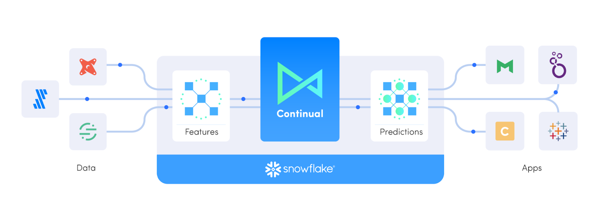

To keep things simple, we’ll use a nicely manicured dataset to illustrate how Snowflake and Continual team up to enable modern data teams to effectively build, deploy, and utilize production grade ML models. The dataset consists of customer information such as account data, demography, geographic area, and phone activity of a fictional telecommunications business. It also contains a boolean value defining whether or not a customer has ended their contract and “churned”. While this dataset will suffice the purposes of quickly trying Continual and Snowflake, we don’t believe it's the most realistic example, which is why we created a more comprehensive [example you can try next](https://docs.continual.ai/customer-churn/)! 

### Prerequisites
- Basic experience with Snowflake and SQL
- Basic knowledge of ML and data science problems

### You'll Learn
1. How to connect Continual to Snowflake and do ML on your data cloud
2. Create feature sets and models in Continual
3. Evaluate and maintain production ML models
4. Analyze model performance, input data, and features to iteratively improve performance
5. Write predictions to Snowflake 

### You’ll Need 
- [Sign up for a Continual account](https://cloud.continual.ai/register?utm_campaign=Snowflake%20QuickStarts&utm_source=continual%20guide)
- [Snowflake account](https://signup.snowflake.com/)

### You’ll Build 
- An operational, continually updating customer churn ML model

## Prepare your lab environment
### Set up Snowflake
Duration: 6

Login using your unique credentials if you have a Snowflake account. If you don’t have a Snowflake account, visit https://signup.snowflake.com/ and sign up for a free 30-day trial environment.
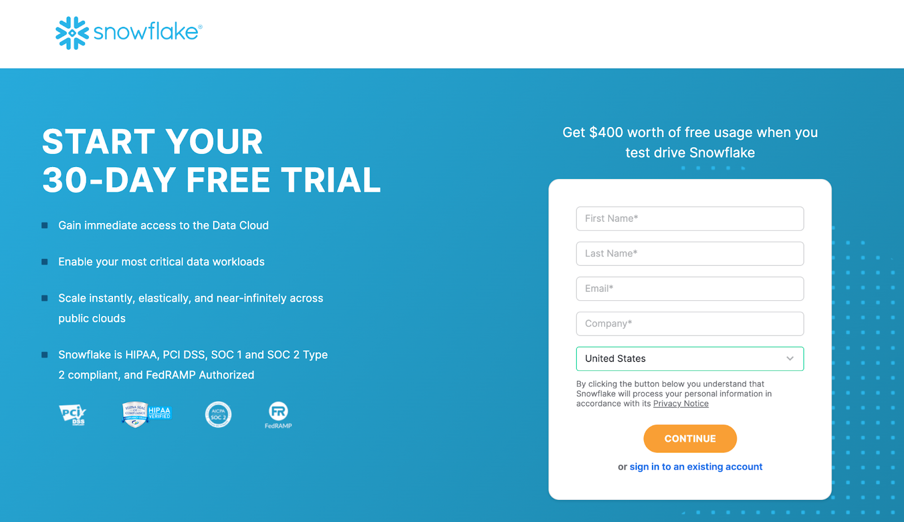

For this example, you will only need the Standard edition on **AWS**. But you may want to select **Enterprise** to try out rad features like time travel, materialized views, or database failover. 

Choose **US West (Oregon)** for the AWS region. 
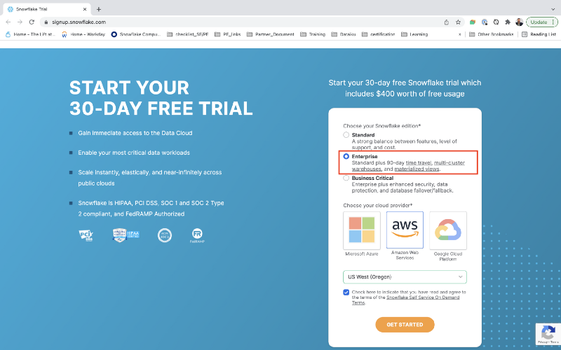
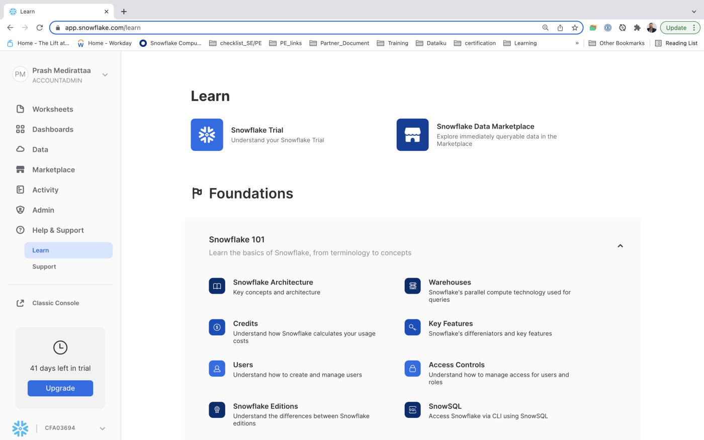

Once you've logged in, open a new **Worksheet**. 
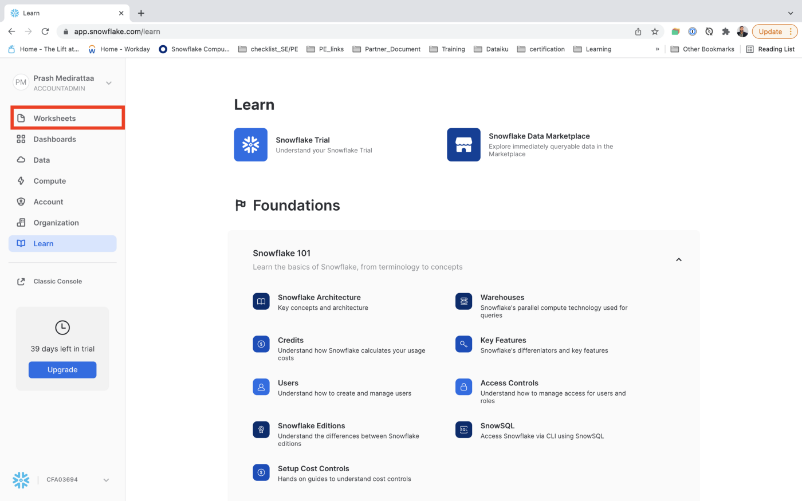
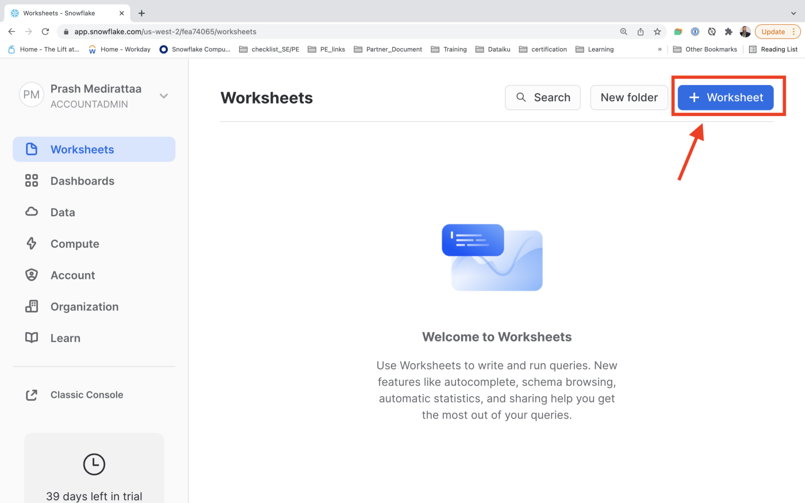
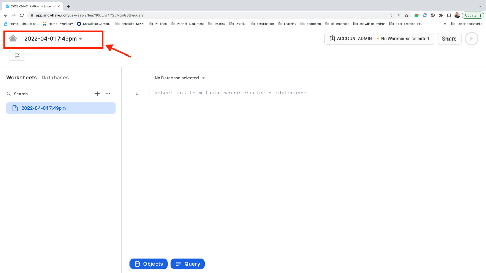
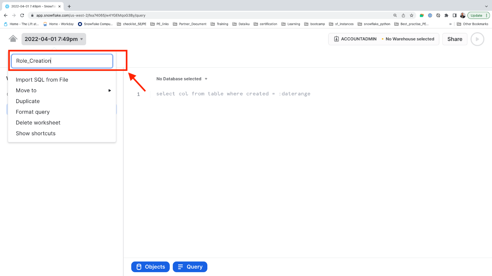

Create a role, user, warehouse and database for Continual to use. 

In Worksheets, **copy and paste the following SQL** into your worksheet. 

**ACTION REQUIRED:** Make sure to update the user_password

~~~sql
begin; 

-- ACTION NEEDED: choose a password for CONTINUAL_USER.
set user_password = 'REPLACE ME WITH A SECURE PASSWORD';
set role_name = 'CONTINUAL_ROLE';
set user_name = 'CONTINUAL_USER';
set warehouse_name = 'CONTINUAL_WAREHOUSE';
set database_name = 'CONTINUAL'; 

-- change role to securityadmin for user / role steps
use role securityadmin; 

-- create role for Continual
create role if not exists identifier($role_name);
grant role identifier($role_name) to role SYSADMIN;

-- create a user for Continual
create user if not exists identifier($user_name)
password = $user_password
default_role = $role_name
default_warehouse = $warehouse_name; 

grant role identifier($role_name) to user identifier($user_name);

-- change role to sysadmin for warehouse / database steps 

use role sysadmin; 

-- create a warehouse for Continual
create warehouse if not exists identifier($warehouse_name)
warehouse_size = medium
warehouse_type = standard
auto_suspend = 10
auto_resume = true
initially_suspended = true; 

-- create database for Continual
create database if not exists identifier($database_name); 

-- grant Continual role access to warehouse
grant USAGE
on warehouse identifier($warehouse_name)
to role identifier($role_name);

-- grant Continual access to database
grant CREATE SCHEMA, MONITOR, USAGE
on database identifier($database_name)
to role identifier($role_name); 

Commit;
~~~

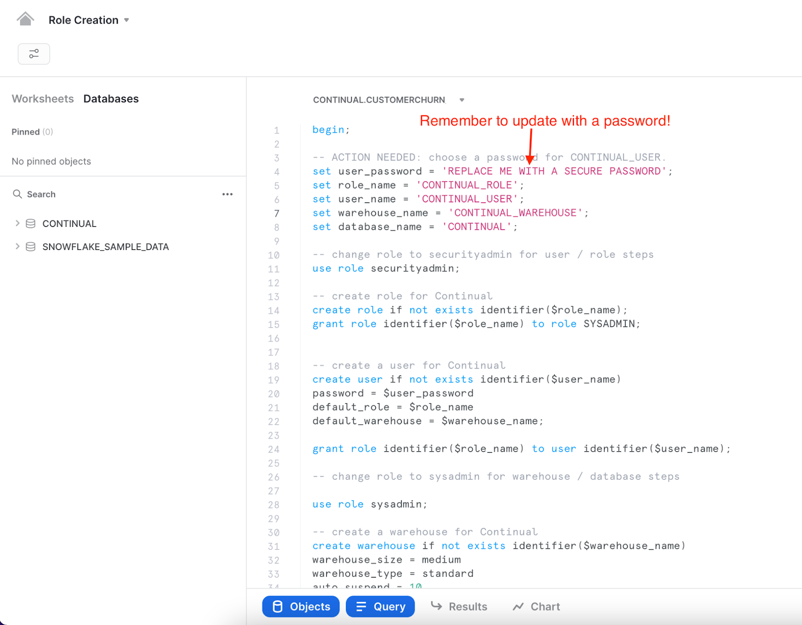

Outside of what we defined above, we will not use additional databases/schemas/tables as sources for feature sets or models in this example. But for an actual use case, you will likely use additional sources and will need to grant the Continual user USAGE permission on any such resources. See [our docs](https://docs.continual.ai/snowflake/#snowflake) for more information.

## Set up Continual
Duration: 4
### Signup for a trial account
To get started, navigate to [Continual.ai](https://cloud.continual.ai/register?utm_campaign=Snowflake%20QuickStarts&utm_source=continual%20guide) and register an account. Continual has a free 30-day trial and no credit card is required.

You’ll need to verify your email address. If you don’t receive a verification email within a few minutes, check your spam folder and email support@continual.ai. If your link expires, you can log back into your account to send a new verification email.

### Create an organization
Organizations allow you to share projects within a company and collaborate with team members under a shared billing account.

### Create a project
After creating your organization you will see your organization's project dashboard with the option to create a project. Projects are isolated workspaces for feature sets and models and connect bi-directionally with Snowflake. 

Go ahead and create a new project and name it **CustomerChurn**

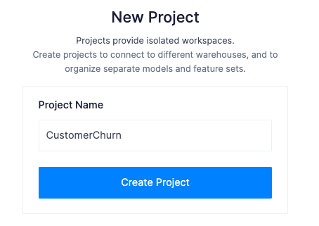

### Connect Continual to Snowflake
Each Continual project connects bi-directionally to one Snowflake Database. Continual maintains tables and views for all your feature sets, models, and model predictions inside a schema. This makes it easy to build models from your existing data and consume the predictions Continual maintains using your existing tools in Snowflake! 

Click **Connect your data warehouse** and then select **Snowflake**

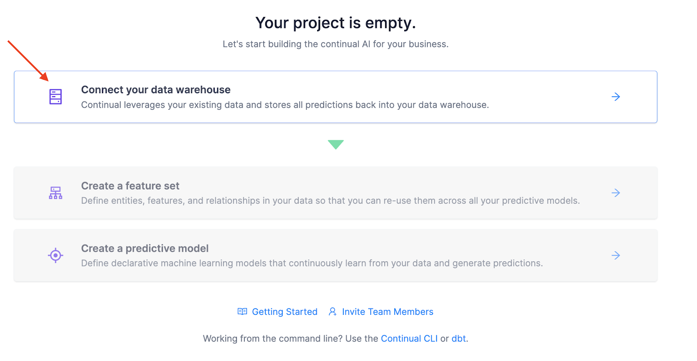
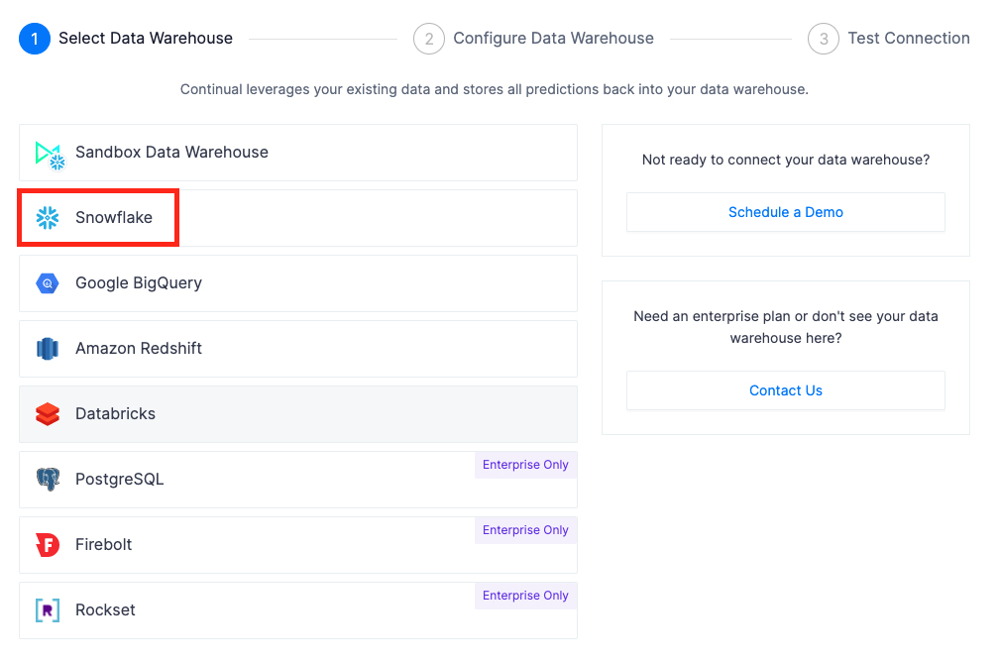

Enter your snowflake account identifier, username, password, database name, warehouse name, and role. Leave the schema field blank for Continual to automatically create one. 

> **NOTE:** The Host (Endpoint) is the [Snowflake account identifier](https://docs.snowflake.com/en/user-guide/admin-account-identifier.html#account-identifiers). If you selected a region other than US West (Oregon) you need [additional segments depending on the region](https://docs.snowflake.com/en/user-guide/admin-account-identifier.html#account-identifiers).

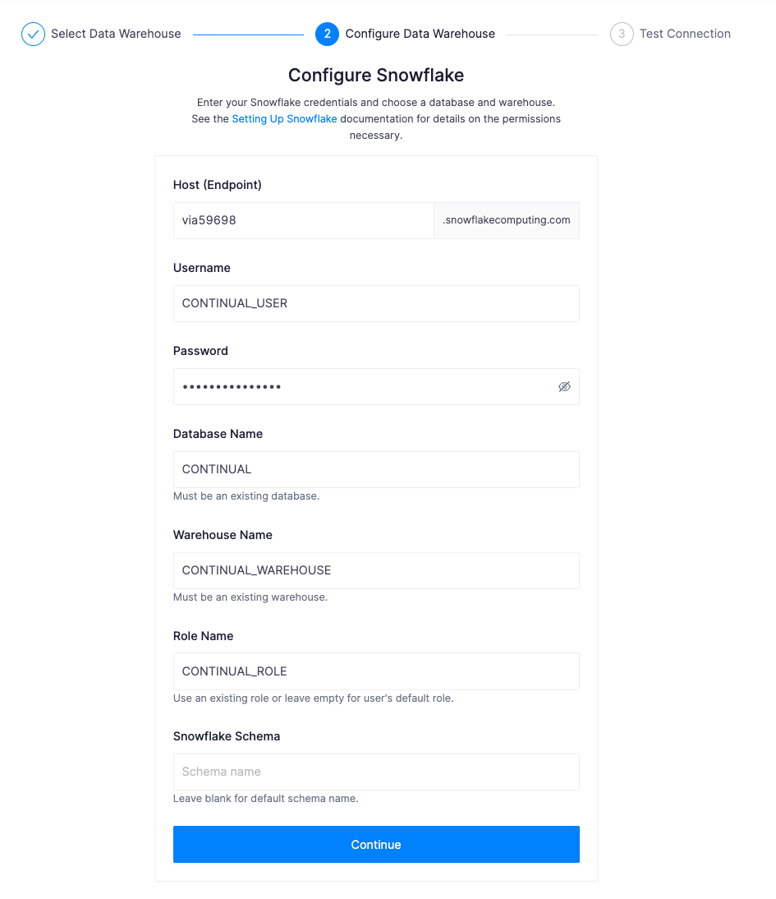

Test the connection and then create the connection between Continual and Snowflake. 

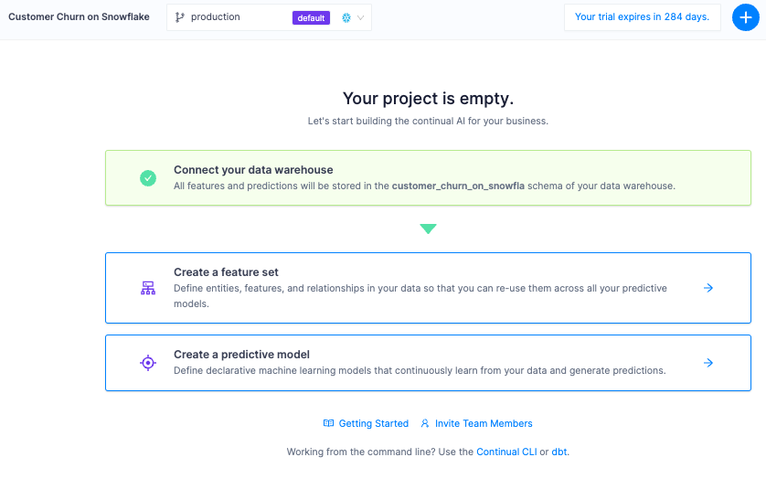

## Create a feature set
Duration: 2

Now that we’ve established our connection and can access data in Snowflake, it’s time to prepare features for a model. 

A [feature set](https://docs.continual.ai/feature-sets/) is one of the main objects in Continual and describes a collection of related features. Feature sets are defined by a SQL query in a YAML configuration file. Continual uses this query to build a view in your feature store corresponding to the feature set query definition. 

Click **Create a feature set**:

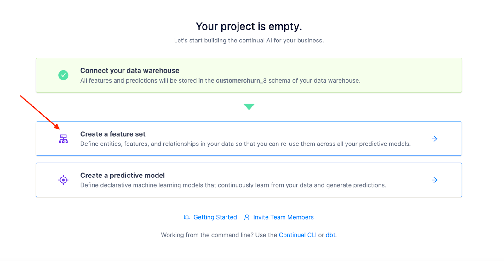

The first step in creating a feature set is the Query Data step. This is where we use SQL to select the data defining our feature set. To make it easy, we have an example ready to go that will copy a csv from an object store into your Snowflake database and pre-populate the query editor, configurations and metadata, and schema. You are living the good life! 

Click **Use an Example** on the right-hand side and select **Predict Customer Churn**

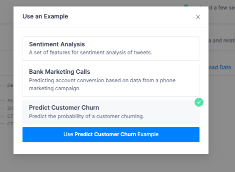

**Preview** the data to verify the query is selecting the data required for the feature set. 

Then select **Configure Feature Set** on the bottom right to advance to the next step.

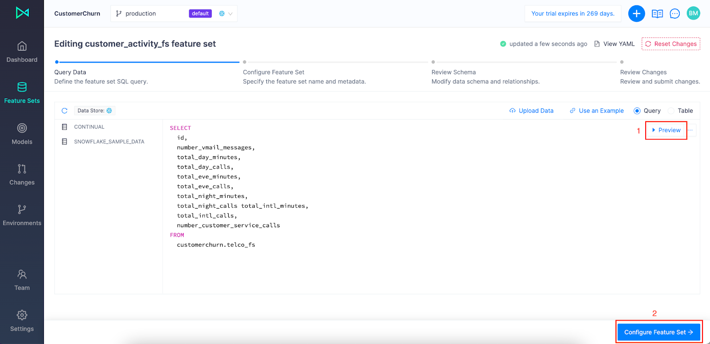

The **Configure Feature Set** step is where you add the metadata to the feature set: name, description, entity, and index. An [entity](https://docs.continual.ai/feature-sets/) is a higher level object that combines feature sets that represent common business objects such as "customers", "products", and "sales". The [index](https://docs.continual.ai/feature-sets/#feature-set) is what uniquely identifies the feature set and connects it to an entity. All feature sets in an entity have the same index. 

Populate the fields as shown below and create a new entity called **customer**. 

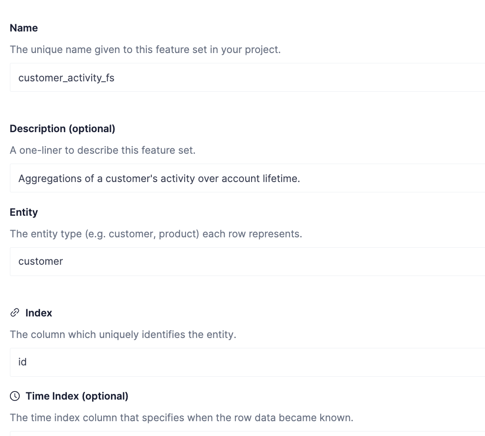

Click **Define Schema** to advance to the next step. 

Notice our feature set is displayed in the Data Model graph with all the columns, data types, and inclusion status. 

Okay, time to review and create! Click **Review Changes** and then **Submit Changes**: 

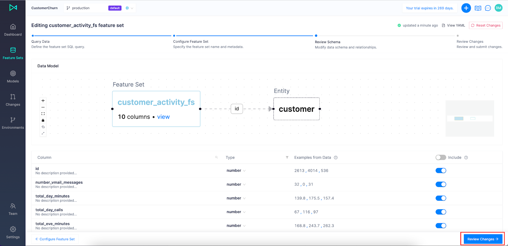

Now, click on the **Changes** tab on the left hand side to see the action added to the activity feed:

Once the Feature Set has been created, we can see it listed on **Feature Sets** on the left vertical menu:

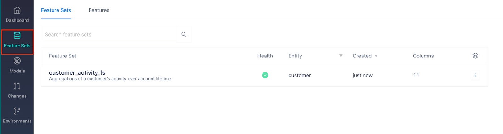

## Create a model
Duration: 5

In the last section, we connected to Snowflake and created a feature set for a ML model. Now it’s time to create a model that will ingest our feature set, along with a few additional individual features, to predict the probability of a customer churning. The flow is very similar to creating a feature set except with some additional configurations. 

Unlike when creating a feature set, at the configuration step, we’ll need to provide a target column to train our model on. Then we'll set policies for re-training, promotion, and running predictions. Click on **Models** on the left hand side, then **Create Model**:

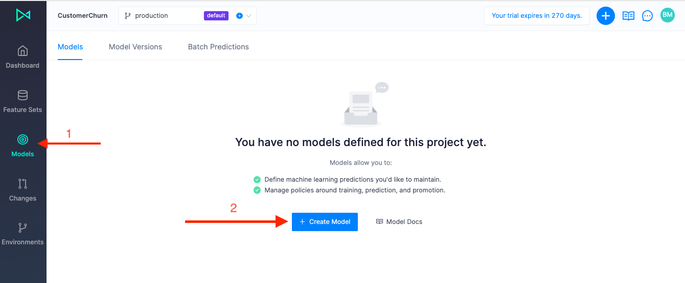

Click **Use an example** and then select **Predict Customer Churn**:

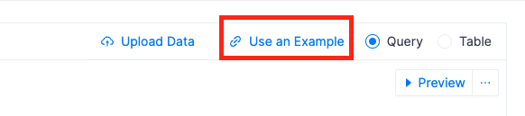

We need to make sure our SQL query contains a unique index, features, and a target. In addition to new features we’ll define in our model spine, we want to include the feature set we built in the last section. The way we include our feature set is by including the index column of our feature set in our query and then linking it to our “customers” entity in the **Review Schema** step. Then, at model training time, Continual will join the feature set with the model to create the training data set. 

We typically recommend storing your features in feature sets and connecting them to your models via [entity linking](https://docs.continual.ai/feature-sets/?h=entity+linking#entity), but it's also possible to specify a list of columns in your model that represent additional features to bring into the model. 

Click **Configure Model**: 
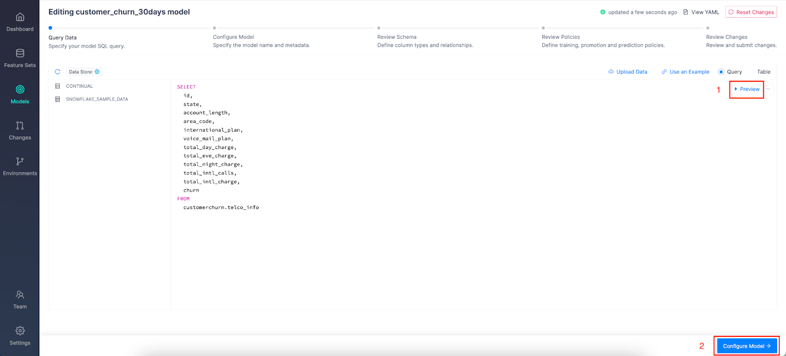

Cool, so let’s give our model a name and description and define our model index and target column. These attributes, along with a sql query that generates the data and linked entities, forms the core of a model definition, and this is sometimes referred to as the model spine.

Click **Define Schema**: 

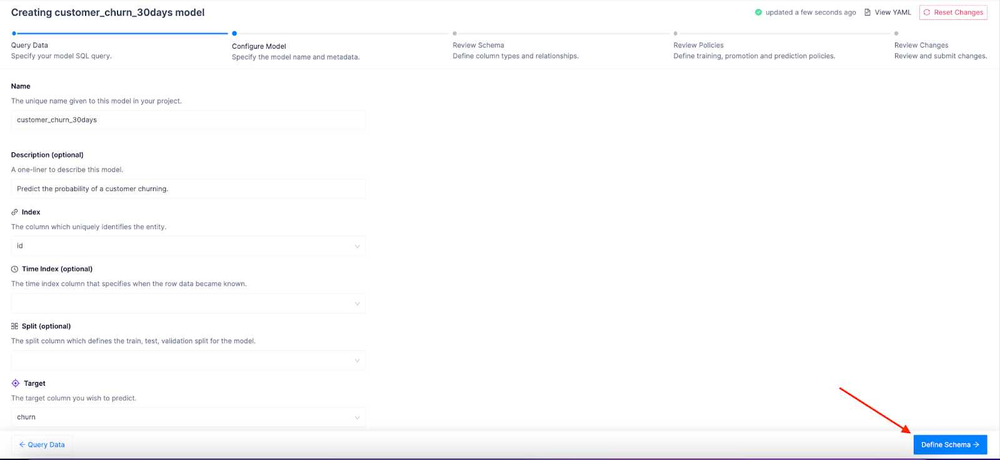

Now it’s time to link our feature set index to our "customer" entity. Click the chain icon on the **id** row and then select **customer**:

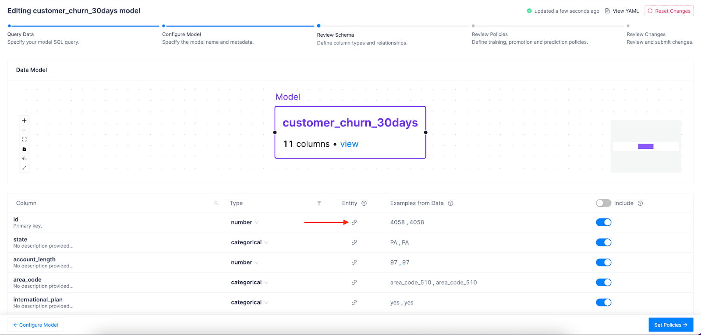

Type "customer" into the pop up box:

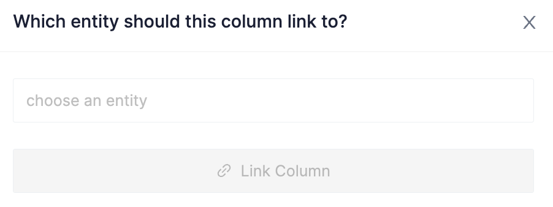

Then click **Link Column**:

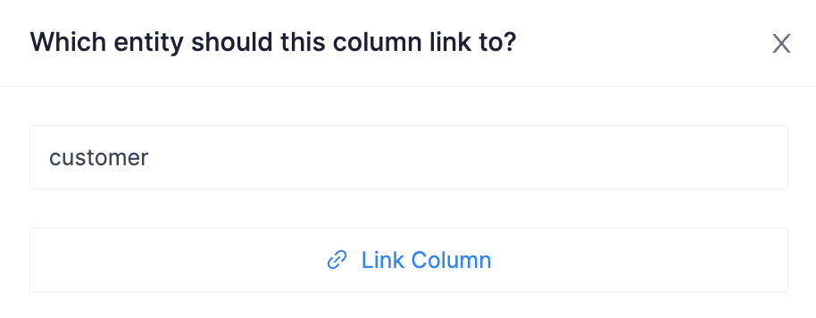

Click **Set Policies**: 

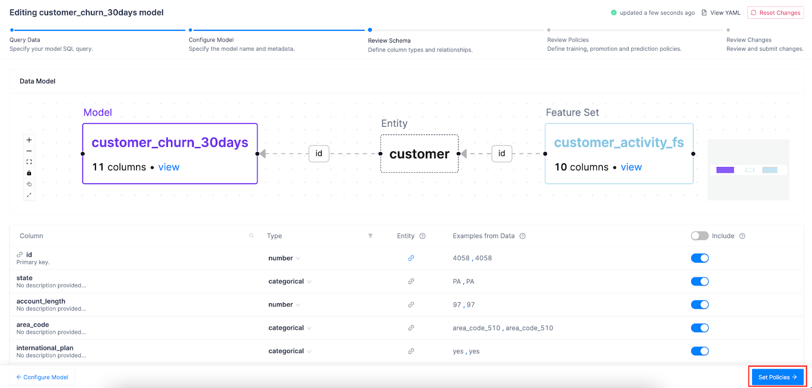

In Continual, you can configure recurring training schedules to ensure your model is updating as frequently as it needs to. You can also set advanced settings such as which performance metric to optimize for, the size of the container, and even which models to include or exclude in the experiment.  While automated, Continual allows you to have control over how your model is created, optimized, deployed, and managed. 

[Data checks](https://docs.continual.ai/data_checks/?h=data+checks), [Data Profiling](https://docs.continual.ai/mlops/?h=data+profiling#data-profiling), and other automated capabilities are enabled by default. But for additional analysis such as [Shapley values](https://docs.continual.ai/xai/?h=shapley#shapley-values-global), let's toggle **Additional Plots** to **On**.

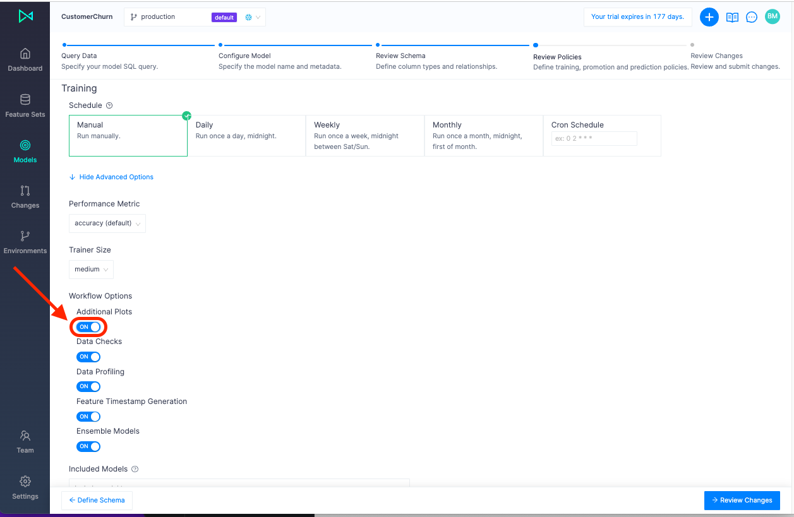

You can also set how the system chooses which model to promote to production and when new predictions should be made.

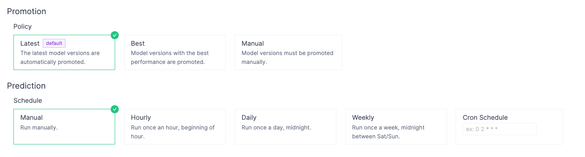

Go ahead and create the model by clicking **Submit Changes**: 

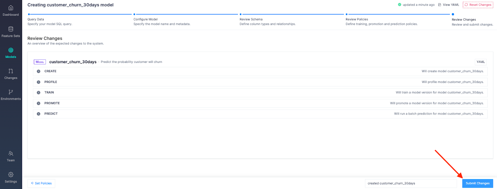

Well done! How easy was that? 

All changes you make in Continual, such as creating a new feature set or editing/updating an existing model, is listed in the **Changes** tab. This gives you a lineage of your team’s work you can reference at any time. 

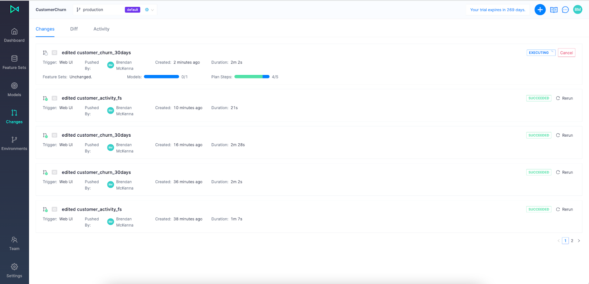

Once your model has been created and promoted it will write predictions directly back to Snowflake. Continual creates a table in your feature store for every model you create in the system that tracks all predictions made by model versions in that model over time. This table lives under <feature_store>.<project_id>.model_<model_id>_predictions_history. Continual additionally builds a view under <feature_store>.<project_id>.model_<model_id>_predictions which represents the latest prediction made for each record in your model spine. 

Let’s use the latest predictions view. In Snowflake, paste the following sql statement in to view all your predictions: 
~~~sql
SELECT * FROM continual.customerchurn.model_customer_churn_30days_predictions; 
~~~
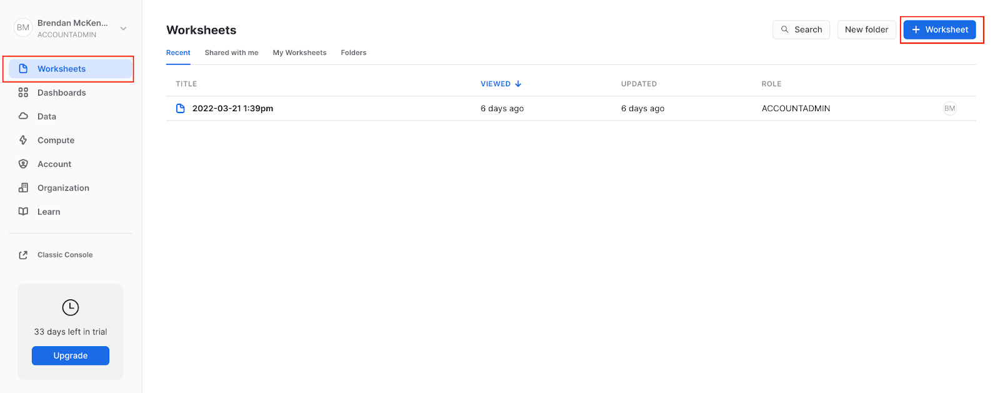

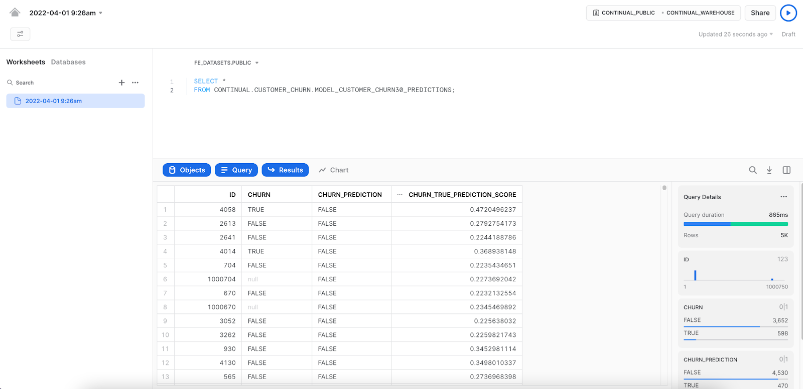

## MLOps: Monitoring data and models
Duration: 3

Back in Continual, there are many tools and automation for monitoring data, models, and prediction jobs.

Navigate to **Models** and select the customer_churn_30days model:

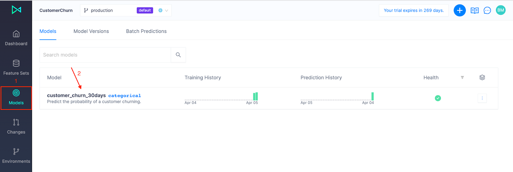

Each time you train a model, a new version is produced and managed under the **Model Version** view. 

Click **Versions** and choose a Model Version to evaluate:

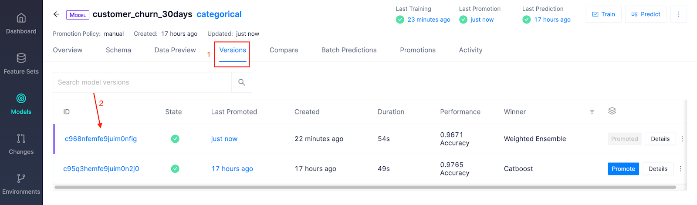

### Performance Analysis
The **Overview** page shows the performance of the winning model, as well as each model that was tested. Continual runs a series of experiments across different model algorithms and optimizes performance across a specified performance metric. 

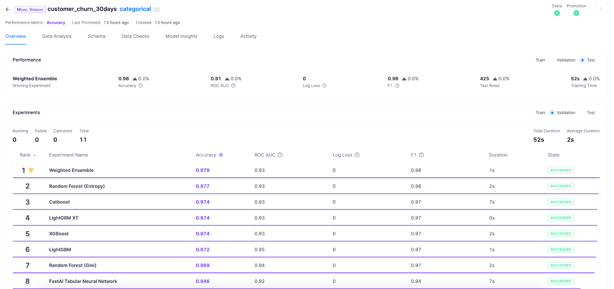

### Monitoring Data
Click on **Data Analysis** to look closer at the data used to train the model. 
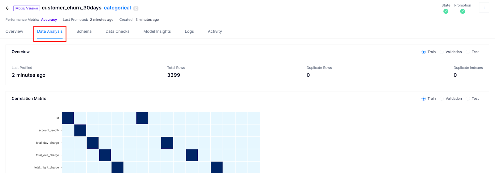

Here you can look at the [correlation matrix](https://docs.continual.ai/mlops/#correlation-matrix) to see which two variables are correlated and [category scores](https://docs.continual.ai/mlops/#data-profiling) to look at each feature’s profile to check if there are features with many Null values, large outliers, or unexpected distributions. 

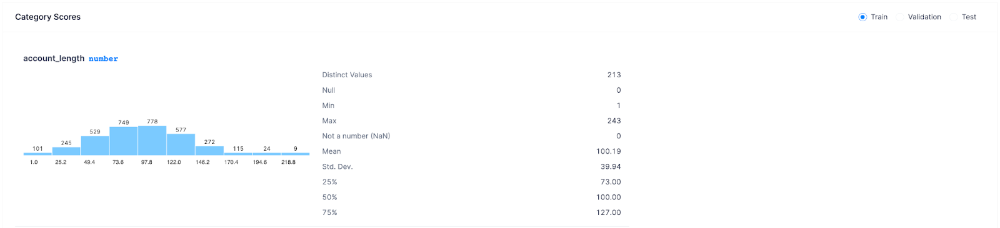

### Analyzing the model

Click on **Model Insights** and look at the confusion matrix to understand what your model is getting right and what types of errors it’s making. 

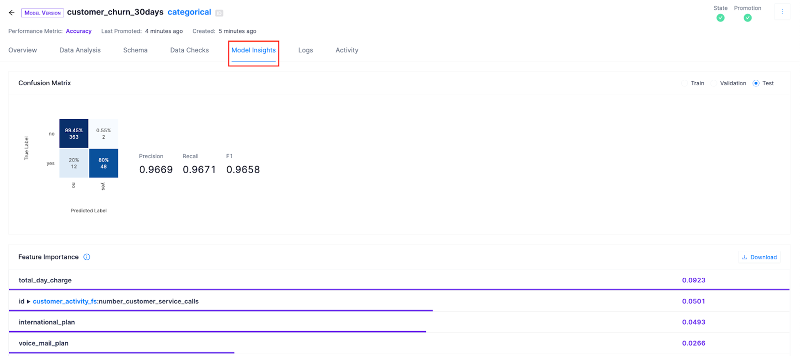

We can also reference Feature Importance to view which features were the most impactful. Continual performs [permutation-based](https://scikit-learn.org/stable/modules/permutation_importance.html) feature importance on the winning experiment and is available for each model version.

Let's take a look at [shapley values](https://docs.continual.ai/xai/?h=shapley#shapley-values-global) for insights about how each feature affects a prediction with regard to its expected value: 

## Getting Started with a Use Case
Just like that you’ve enabled ML on Snowflake. Continual is the Operational AI layer for the modern data stack and designed with the shared principles of simplicity, minimal management overhead, and elasticity. 

In less than 20 minutes, we connected Continual to Snowflake, created a feature set, used it as input to experiment among more than 10 ML models and added other relevant features, promoted the best performing model to production, wrote prediction results back to Snowflake, analyzed our features and model performance to learn what improvements we can make. We completed our work in the UI but could’ve used the CLI or SDK. 

This concludes the guide to quickly getting started with Continual on Snowflake. Now you’re ready for a [more advanced example of predicting customer churn](https://docs.continual.ai/customer-churn/) with Continual and dbt on Snowflake. If you need a little help or have questions along the way, [book some time](https://continual.ai/book-a-demo?uisource=Snowflake-Quickstart-Guide) with one of our AI experts.  You can also learn more and see a demo of Continual on Snowflake at our recent webinar replay, available [here](https://continual.ai/events/the-new-ai-dream-teams).