author: Ritika Sharma
id: a_guide_to_kipi_marketing_mix_modelling_analytics_app
summary: This is a sample Snowflake Guide
categories: Applications & Collaboration, Apps & Collab: External Collaboration, AI - Snowflake ML, Apps & Collab - Native Apps
environments: web
status: Published 
feedback link: https://github.com/Snowflake-Labs/sfguides/issues
tags: Getting Started, Data Science, MMM , Marketing, Native Apps

# A Guide to Kipi Marketing Mix Modelling and Analytics App
<!-- ------------------------ -->
## Overview 
Duration: 5

### What is MMM and Why is it needed?
Companies often struggle to accurately attribute their marketing spend to specific outcomes. Businesses invest significant amounts in marketing, but without clear insights into ROI from different channels, they may overspend on less effective tactics or underfund the ones driving real results. This inefficiency can lead to wasted budget and missed opportunities for growth.  
Marketing Mix Modeling (MMM) enables data-driven decision-making by providing insights into the effectiveness of marketing channels, optimizing budget allocation, and offering predictive analytics to refine future strategies, leading to better overall performance.

Marketing Mix Modelling & Analytics is a free Snowflake Native App which provides a suite of tools to better understand marketing campaigns analytics data. With a user-friendly interface, this app enables marketers to unlock the full potential of their marketing analytics data. Key features include:

- **Campaign & Ad Analysis \-** Monitor and analyze key performance indicators (KPIs) such as impressions, clicks, conversions, and engagement rates for each marketing campaign.  
- **Diagnostic Analysis \-** Explore how marketing efforts interact with each other over time and identify the long-term impact of campaigns on business outcomes.  
- **Sales Analysis \-** Analyze the cost of advertising campaigns to assess the efficiency of the spending. Determine the revenue generated by each advertising campaign and attribute it to specific channels or marketing activities.  
- **Budget Optimization \-** Use predictive analytics to forecast the impact of budget allocation changes on key performance metrics. Evaluate different budget scenarios to identify the most efficient allocation of resources for optimal ROI.

In this Quickstart, we’ll walk through installing a Snowflake Native App [Kipi Marketing Mix Modelling & Analytics App](https://app.snowflake.com/marketplace/listing/GZSTZ4CLE1N4E/kipi-ai-kipi-marketing-mix-modeling-analytics-app) that brings Marketing Mix Modeling (MMM) directly into your Snowflake environment.
You’ll learn how to set it up and explore all the key features the app has to offer, so you can start analyzing and optimizing your marketing performance right where your data lives.

### What You’ll Learn 
* How to install Kipi's Marketing Mix Modelling and Analytics native app from Snowflake marketplace.
* Sales analysis and Budget optimisation through MMM.

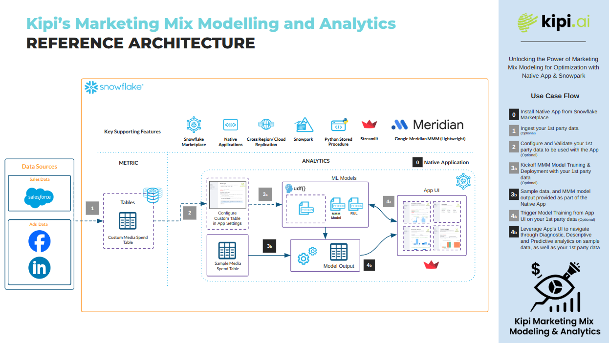

### Prerequisites
- Access to Snowflake's Native Apps on marketplace. If you do not have a Snowflake account, you can register for a [free trial account](https://signup.snowflake.com/?utm_cta=quickstarts_). You may need to contact Snowflake Support to enable this for a trial account.
- `ACCOUNTADMIN` role in your Snowflake account is required to install the application.

<!-- ------------------------ -->
## Install Kipi's MMM Native App
Duration: 10
1. First, log in to a snowflake account in your browser, as a user with `ACCOUNTADMIN` privileges.
2. Navigate to the `Data Products -> Marketplace` tab on the left sidebar. Search for the App [Kipi Marketing Mix Modelling & Analytics App](https://app.snowflake.com/marketplace/listing/GZSTZ4CLE1N4E/kipi-ai-kipi-marketing-mix-modeling-analytics-app) in the Snowflake Marketplace.

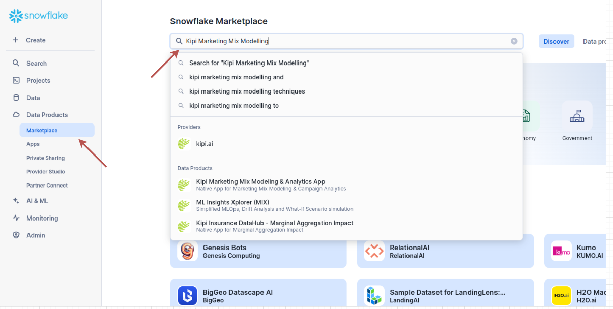

3. After searching for the app, click on the blue "Get" button to install the app. You will see a popup like below. Feel free to change the application name, we can leave it as-is too.

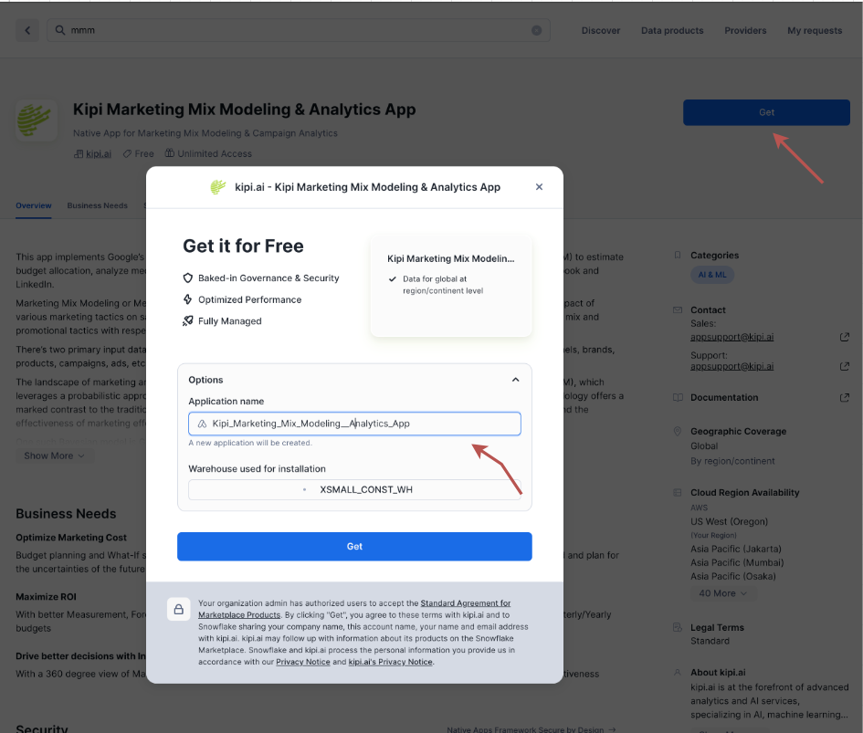

4. Once installed, launch the app. On top-right, click on Security icon-button to configure the app and grant permissions to the app, as seen below:

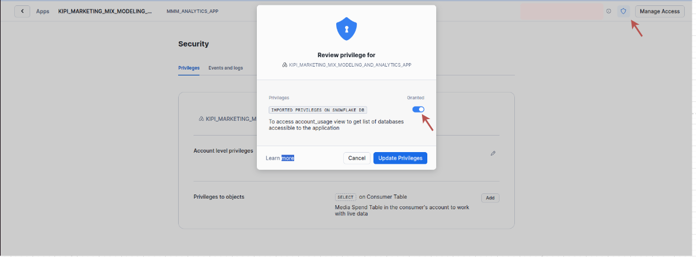

5. In the Event and Logs tab, enable event sharing with provider (optional):

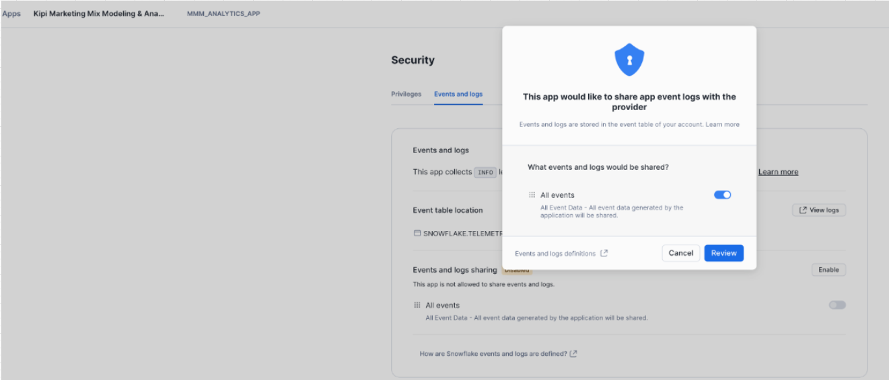

6. Once done, click on MMM\_ANALYTICS\_APP button. It should take \< 1min to get started

 

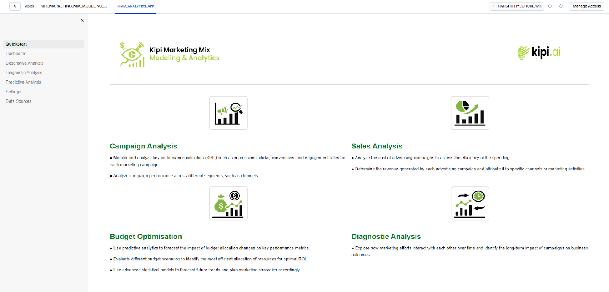 

<!-- ------------------------ -->
## Explore In-App Sample Data and Dashboard
Duration: 5

To help users get started with analyzing their marketing campaigns, the app comes preloaded with a sample dataset of media campaign aggregated dataset containing 288K rows. This dataset simulates real-world marketing activities and consists of various metrics related to advertising spend and campaign performance.  
Sample structure and rows can be viewed under the `Data Sources Tab` in the application.

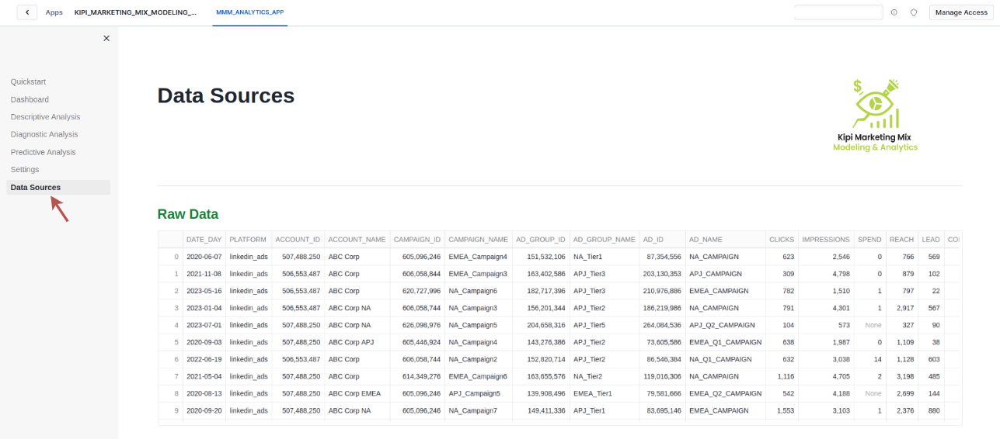

For complete data overview, Move to the database section in snowsight and locate the **Media Campaign Spend** table under the installed app database. 

The sample dataset includes 17 columns as listed below, all the columns in bold are mandatory to run seamless MMM with your own first party data. 
- **Date day**
- **Platform** 
- Account id 
- **Account name** 
- Campaign id 
- **Campaign name** 
- Ad group id 
- **Ad group name** 
- Ad id
- **Ad name**
- **Clicks**
- **Impressions**
- **Spend** 
- Reach
-  Lead
- **Conversion**
- **Revenue**  

After you configure your first-party data, you can preview the data at the same place in the Data Sources tab. To set up your data, follow the steps in this guide [Kipi MMM Live-Data Setup](https://docs.google.com/document/d/1cCOrtV5a59Hjc7zDKW0N6Z0VRrTfEQszst0Ze5Oj9gg/edit?tab=t.0#heading=h.4d7j2a4cv0n)

Now let’s jump into the **Dashboard** section.
This tab gives you a high-level overview of your marketing campaign data. You’ll see key metrics like Impressions, Clicks, Reach, Leads, Spend, Conversions, and Revenue—all in one place.
It’s designed to be intuitive, helping you quickly understand how your campaigns are performing and where to focus next. With these insights, you can make smarter, data-driven decisions to optimize your marketing efforts.

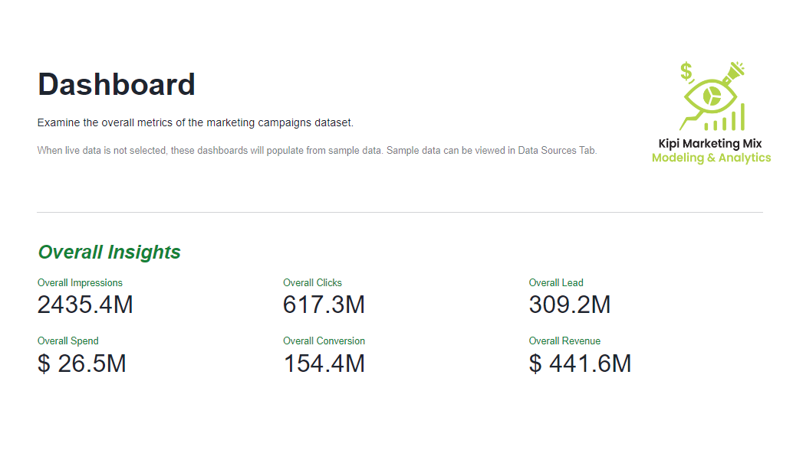

In next few sections, we will explore insights from marketing sales & spend data in respective tabs.

<!-- ------------------------ -->
## Descriptive Analytics
Duration: 10

### **A. Media Channel Analysis:** 

This section allows you to analyze the performance of different media channels based on metrics like spend, impressions, clicks, and reach. You can filter the data by selecting specific media channels and choosing a custom time period. The visualizations include bar charts for media channel spend and impressions, as well as line charts for clicks and reach over time.  

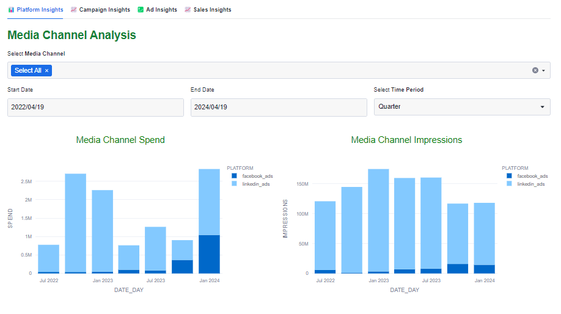

Select a specific media channel and set the time period to a particular year which will allow you to explore trends variations specific to that channel and time frame, giving you a clearer picture of how it influences overall results.

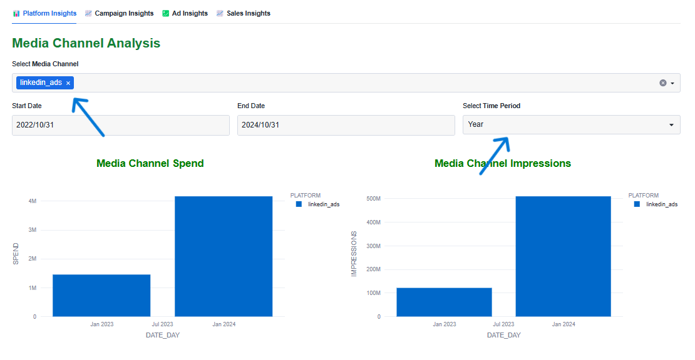

### **B. Campaign Insights:** 

In this section, you can delve into the performance of individual campaigns. You can select one or more campaigns and specify a date range to view relevant statistics. The dashboard provides insights such as campaign-wise spend, impressions, clicks, click-through rate (CTR), cost-per-click (CPC), cost-per-mile (CPM), conversion rate, and lead conversion rate. Additionally, a funnel chart illustrates the conversion journey of the selected campaign.

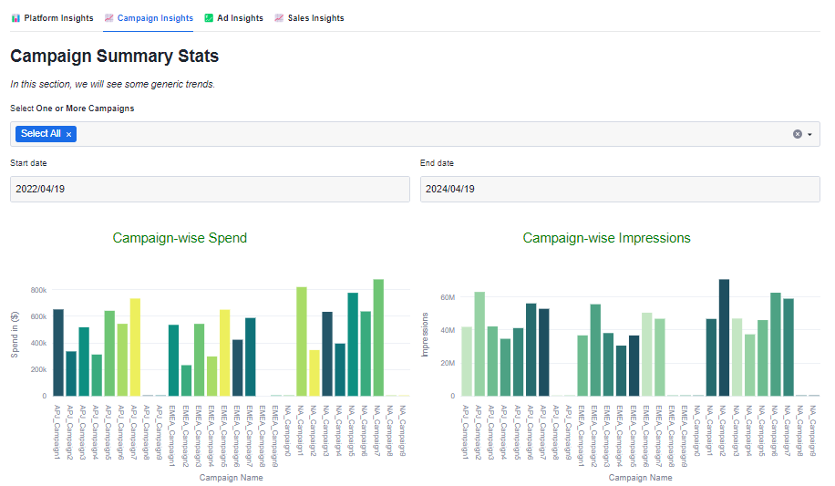

Selecting a specific campaign name explores variations specific to that campaign.  

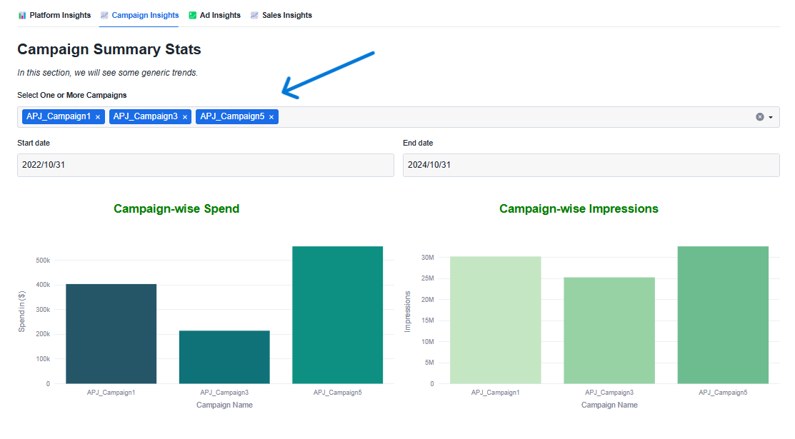

### **C. Ad Insights:** 

Here, you can analyze the performance of specific ads within your campaigns. You can select one or more ads and define a date range to view metrics such as click-through rate (CTR), cost-per-click (CPC), cost-per-mile (CPM), impressions, and clicks. The dashboard also highlights the top 5 ads based on impressions and clicks.

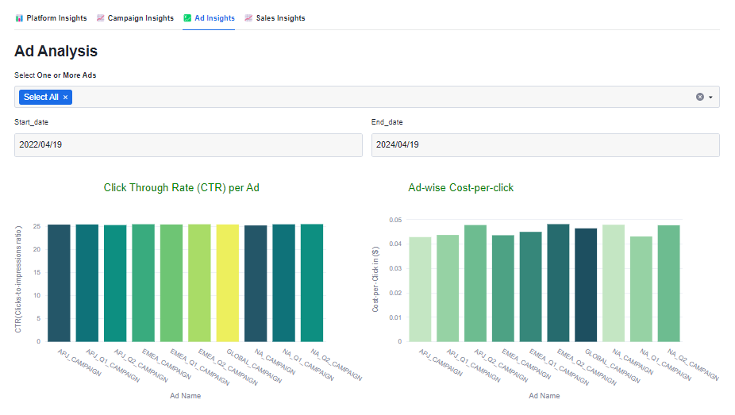

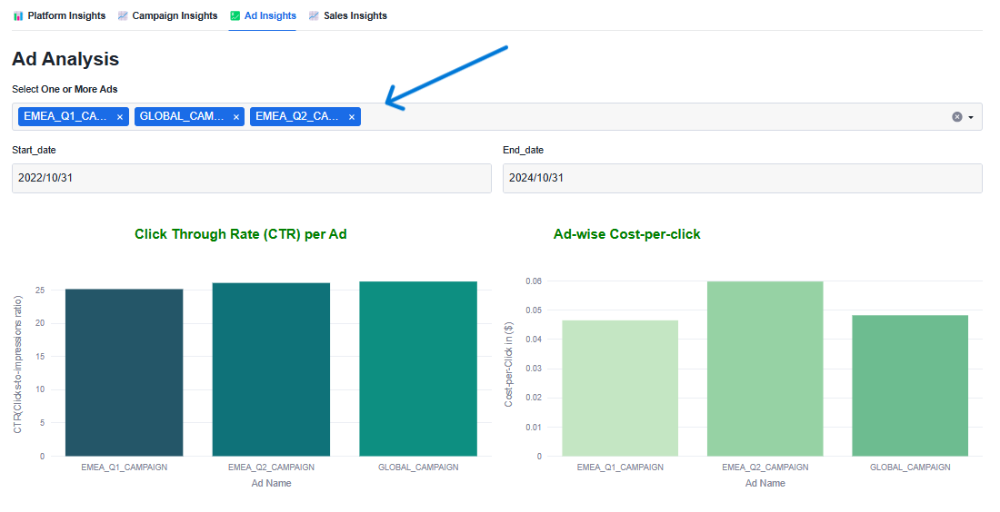

### **D. Sales Insights:** 

The "Sales Insights" tab offers a detailed analysis of campaign performance, focusing on key metrics like revenue, conversion rates, and cost per acquisition. It helps businesses understand the effectiveness of their advertising efforts in driving actual sales, optimize conversion journeys, and identify trends for informed decision-making.

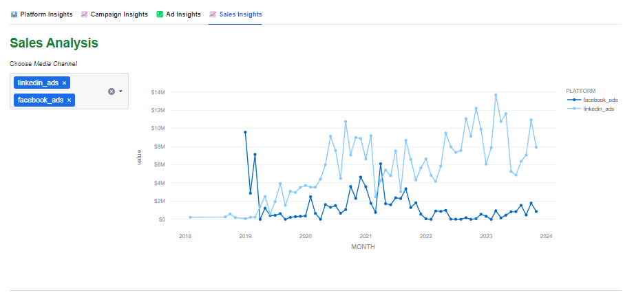

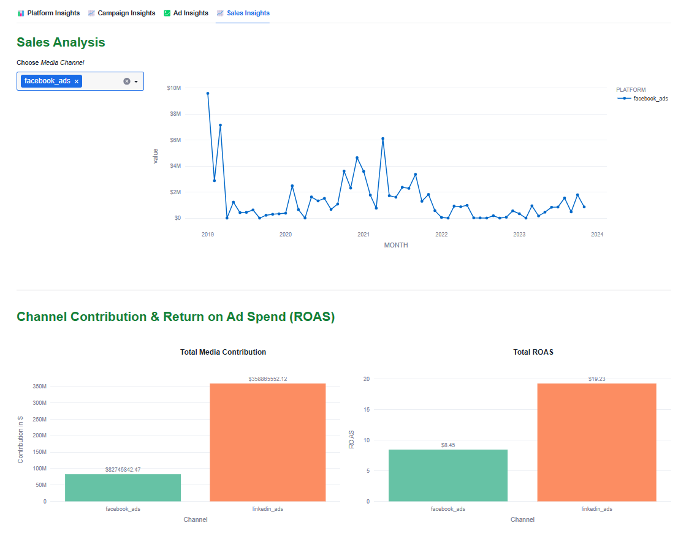

<!-- ------------------------ -->
## Diagnostic Analytics
Duration: 5

The Diagnostic Analysis feature allows you to perform in-depth exploratory analysis on your Snowflake-hosted datasets. It provides interactive visualizations to help you understand how different metrics behave over time and in response to various marketing factors.
In this step, we’ll filter the data to focus on specific campaigns and uncover performance trends.

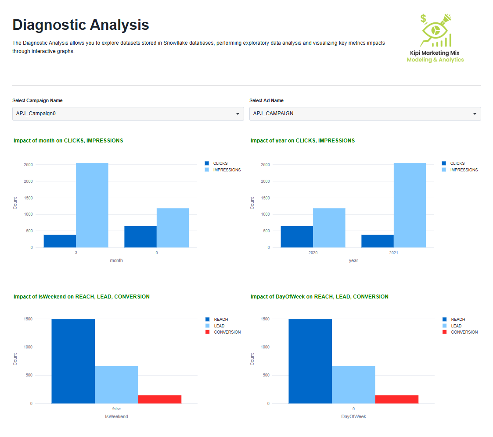

Using filters such as Campaign0 and APJ_Campaign, you can narrow down the dataset to specific campaigns for targeted analysis.

The dashboard presents dynamic, time-based visualizations of key metrics like Clicks, Impressions, Reach, Leads, and Conversions. These charts are generated based on your selected filters, allowing you to uncover meaningful trends and performance patterns.
This step helps you identify seasonal shifts and strategic opportunities within your campaigns—giving you a clearer picture of what’s working and where to optimize.

<!-- ------------------------ -->
## Predictive Analytics
Duration: 10

This section allows you to use predictive analytics to forecast how changes in budget allocation may impact your key performance metrics. You can evaluate different budget scenarios to identify the most efficient resource allocation for maximizing ROI.
The screen is divided into two key sub-tabs:

1. Saturation Curve  
2. Budget Optimization

**Saturation Curve**  
The Saturation Curve illustrates the relationship between your target KPI (e.g., Sales) and marketing spend.
As you increase spend, the return typically follows a **diminishing returns** pattern. That means: up to a certain point, more spend yields higher returns—but beyond that **inflection** point, additional spend results in minimal incremental gains.

The curve below demonstrates this concept:

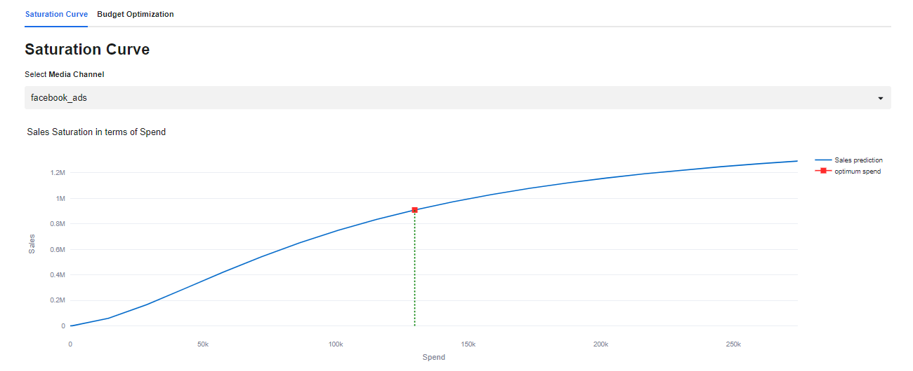

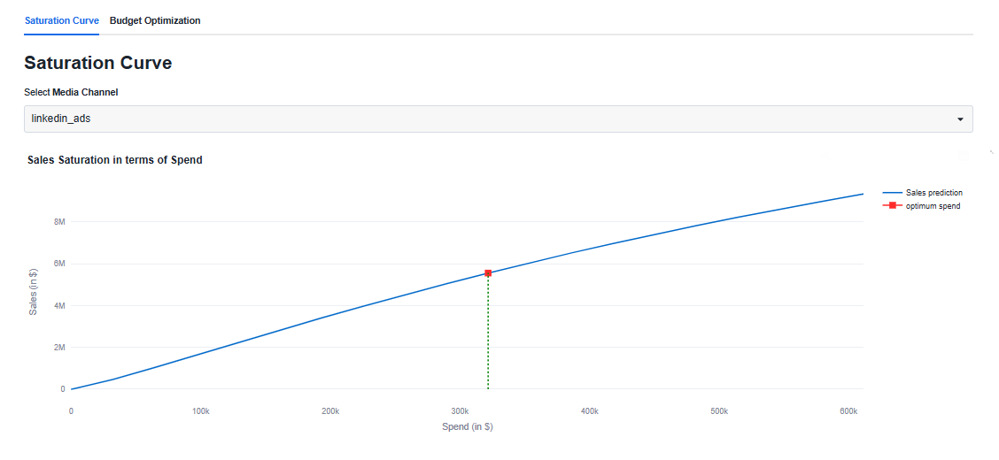

**Budget Optimization**  
The Budget Optimization tab helps you plan your future budget allocation across different media platforms based on model predictions.

You’ll find two dropdowns on this page:

- **% Change in Total Budget**
- **Number of Future Weeks to Plan For**

Let's say, a company wants to allocate a $10,000 budget over the next 10 weeks across Facebook and LinkedIn.
The left chart compares the current (historical) budget split with the optimized distribution recommended by the model. In this case, it suggests reducing spend on Facebook and reallocating more to LinkedIn.
The right chart shows the predicted Sales (Target KPI) outcome for both scenarios—helping you visualize the potential impact of budget reallocation on performance.

<!-- ------------------------ -->
## Use Your Own Data(Optional)
Duration: 5

Now that we’ve walked through all the tabs and key features. To customize the app and use it with your own data, head over to the Settings page.You can refer to this guide for custom-data configuration [Kipi MMM Live-Data Setup](https://docs.google.com/document/d/1cCOrtV5a59Hjc7zDKW0N6Z0VRrTfEQszst0Ze5Oj9gg/edit?tab=t.0#heading=h.4d7j2a4cv0n)

1. On the Settings page, check the checkbox labeled "**Use Live Data.**"  
2. You'll be prompted to Select Data—choose your custom media spend table.

Note : Currently, only a single aggregated table is supported.  

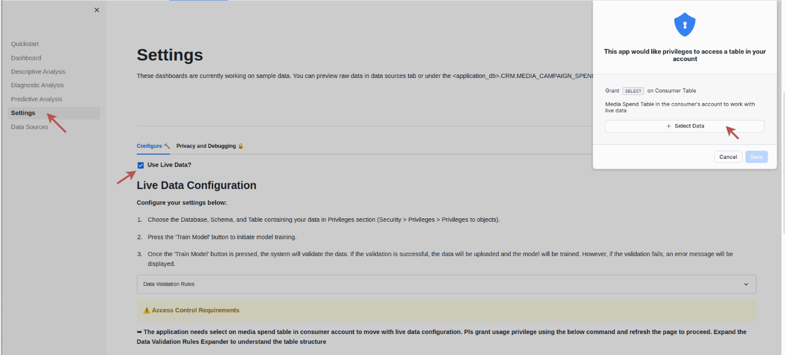

3. After selecting your table, you can click **Data Preview** to view a sample of your data.  
4. Once everything looks good, click on the **Train Model** button . The app will validate the dataset based on specific validation rules, and then proceed to train the MMM model using your data.

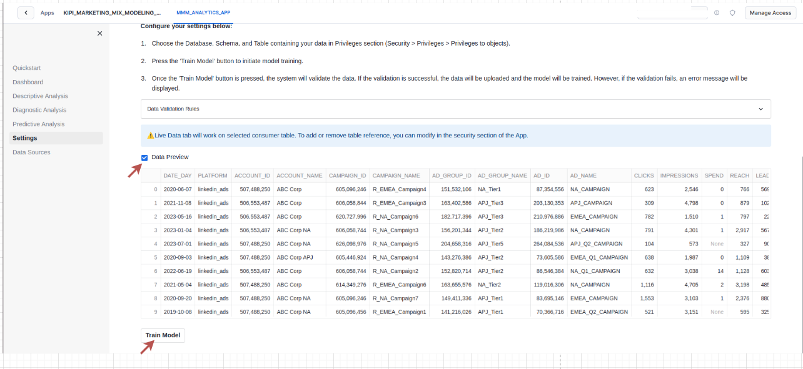

<!-- ------------------------ -->
## Conclusion And Resources
Duration: 5

Congratulations! In just a few minutes, we have successfully set up a Snowflake Native Application that enables you to harness the power of a Marketing Mix Modeling (MMM) solution directly within your account. Additionally, access to this app can be extended to other roles beyond the `ACCOUNTADMIN`, ensuring that relevant team members can also utilize its features. This completes your setup, and you are now ready to explore the full potential of the MMM solution on your own data.

### What we've covered
We've covered a ton in this Quickstart, and here are the highlights:

* Install Native App through Snowflake Marketplace
* Descriptive analysis of marketing campaigns data
* Sales and Trend analysis using Diagnostic Analytics
* Budget optimisation through MMM.

### Related Resources
And finally, here's a quick recap of related resources:

- Read through the Blog- [Unlocking the Power of Marketing Mix Modeling ](https://www.kipi.ai/insights/unlocking-the-power-of-marketing-mix-modeling-with-snowpark/)
- [Download Reference Architecture](https://quickstarts.snowflake.com/guide/a_guide_to_kipi_marketing_mix_modelling_analytics_app/img/3be51d0b94a8705c.png)
- [Watch the Demo](https://youtu.be/YTtJsVXDEOg?list=TLGGeghw6iBwBOcyNDA5MjAyNQ)
