author: Joyce
id: a_postman_tutorial_for_snowflake_sql_api
summary: Explore the Snowflake SQL API with Postman
categories: Getting-Started
environments: web
status: Published
feedback link: https://github.com/loopDelicious/sfquickstarts
tags: Getting Started, REST, API, Postman

# A Postman Tutorial for the Snowflake SQL API

<!-- ------------------------ -->

## Overview

Duration: 1

The [Snowflake SQL API](https://docs.snowflake.com/en/developer-guide/sql-api/index.html) is a REST API that you can use to access and update data in a Snowflake database. You can use this API to execute [standard queries](https://docs.snowflake.com/en/sql-reference/constructs.html) and statements.

This getting started guide will walk through the basics of executing a SQL statement with the Snowflake SQL API and constructing an API workflow in Postman.

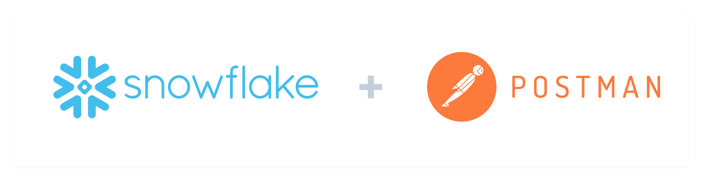

### Prerequisites

- A Snowflake Account with an accessible warehouse, database, schema, and role
- [Install SnowSQL](https://docs.snowflake.com/en/user-guide/snowsql-install-config.html) 1.2.17 or higher
- Working [Key-Pair authentication](https://docs.snowflake.com/en/user-guide/key-pair-auth.html#configuring-key-pair-authentication)
- [Sign up](https://identity.getpostman.com/signup) for a free Postman account, and then [sign in](https://go.postman.co/).
- [Download and install](https://www.postman.com/downloads/postman-agent/) the Postman desktop agent, which will enable you to use the web version of Postman

### What You’ll Learn

- Authorize the Snowflake SQL API
- Perform simple queries
- Use variables in Postman to store data
- Generate code to replicate API calls for your own applications

### What You’ll Need

- A [Postman](https://postman.com/) Account
- [SnowSQL](https://docs.snowflake.com/en/user-guide/snowsql-install-config.html) Installed

### What You’ll Build

- A Postman Collection with an API workflow

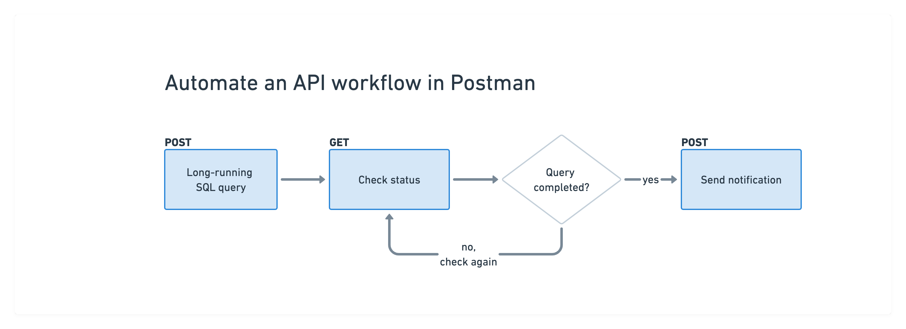

<!-- ------------------------ -->

## Fork the sample collection

Duration: 2

### Fork the collection

In Postman, [fork](https://learning.postman.com/docs/collaborating-in-postman/version-control/#forking-postman-entities) the following collection to your own workspace.

> aside negative
> 
>  [Get Started with Snowflake in Postman](https://www.postman.com/devrel/workspace/snowflake-build/collection/13191452-d6d009f2-8cd0-48ee-9b5a-989ad77fd403)

- Select the collection in the sidebar.
- In the overview tab that appears, select the **Fork** icon in the upper right.
  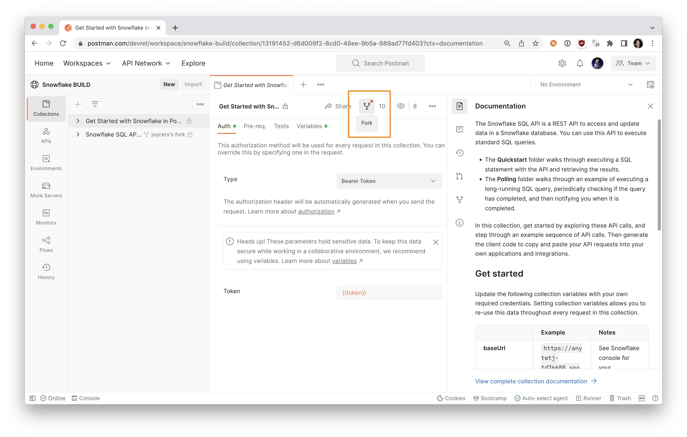
- Enter a label for your fork, and select a workspace to save it to.
- Select **Fork Collection**.
  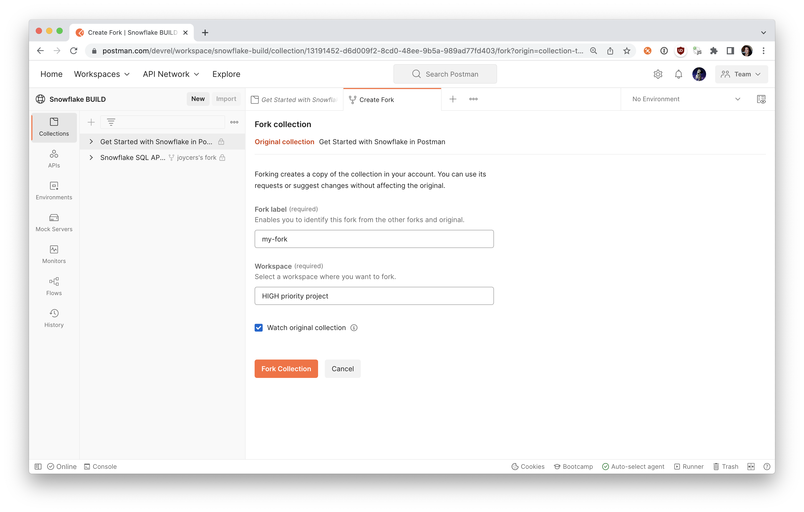

Postman creates your fork in the selected workspace. You can now update this version of the collection as you wish. If you optionally chose to watch the collection, you can pull changes to your own collection when the main collection is updated.

For each folder and request, review the companion documentation in the context bar to the right.

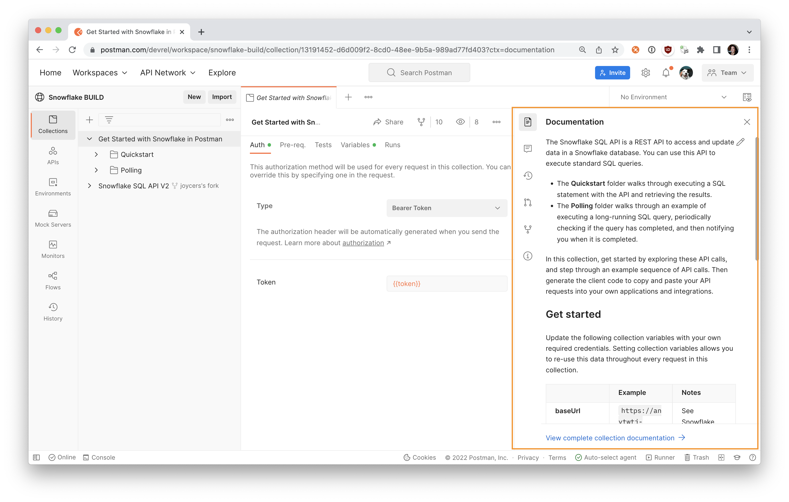

<!-- ------------------------ -->

## Introducing the API

Duration: 5

Select the sample collection in the sidebar, and update the `baseUrl` collection variable under the **Variables** tab with your version of the following URL, replacing `*account_locator*` with the account locator for your own Snowflake account:

```
https://*account_locator*.snowflakecomputing.com/api/v2
```

> aside negative
> 
>  Note that the account locator might include additional segments for your region and cloud provider. See [Specifying Region Information in Your Account Hostname](https://docs.snowflake.com/en/user-guide/intro-regions.html#label-region-ids) for details.

In Postman, your `baseUrl` should look like this.

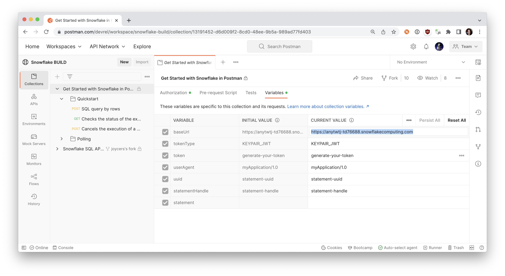

Now let's break down the parts of the API before we begin using it. You can follow along more closely by inspecting each request within the `Quickstart` folder.

The API consists of the `/api/v2/statements/` resource and provides the following endpoints:

- `/api/v2/statements`: You'll use this endpoint to [submit a SQL statement for execution](https://docs.snowflake.com/en/developer-guide/sql-api/reference.html#post-api-v2-statements).
- `/api/v2/statements/{{statementHandle}}`: You'll use this endpoint to [check the status of the execution of a statement](https://docs.snowflake.com/en/developer-guide/sql-api/reference.html#get-api-v2-statements-statementhandle).
- `/api/v2/statements/{{statementHandle}}/cancel`: You'll use this endpoint to [cancel the execution of a statement](https://docs.snowflake.com/en/developer-guide/sql-api/reference.html#post-api-v2-statements-statementhandle-cancel).

In the steps to come, you shall use all these endpoints to familiarize yourself with the API.

<!-- ------------------------ -->

## Authorize API requests

Duration: 5

When you send a request, the request must include authorization information. There are two options for providing authorization: OAuth and JWT key pair authorization. You can use whichever one you have previously implemented or whichever one you are most comfortable with. This example will be detailing authorization with [JWT](https://jwt.io/).

If you haven't done so already, make sure you have [key pair authentication](https://docs.snowflake.com/en/user-guide/key-pair-auth.html#configuring-key-pair-authentication) working with Snowflake already.

You can test to make sure you can successfully connect to Snowflake Key Pairs using the following command in your terminal:

```
$ snowsql -a <account> -u <user> --private-key-path <path to private key>
```

> aside negative
> 
>  If you'd rather authenticate with OAuth, please visit our documentation on authenticating with [OAuth](https://docs.snowflake.com/en/developer-guide/sql-api/guide.html#using-oauth).

After you've verified you can connect to Snowflake using key-pair authentication, you'll need to generate a JWT token. This JWT token is time limited token which has been signed with your key and Snowflake will know that you authorized this token to be used to authenticate as you for the SQL API.

```
$ snowsql -a <account> -u <user> --private-key-path <path to private key> --generate-jwt
<returns JWT token>
```

Here is an example of what that might look like in your terminal.

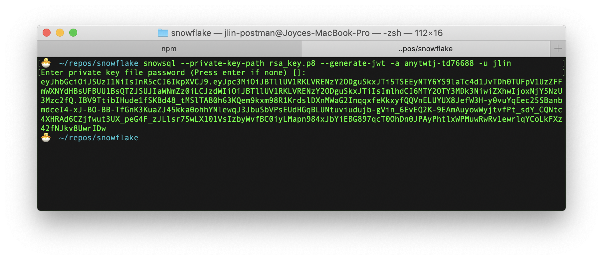

You'll need the JWT token generated to use the Snowflake SQL API. The following headers need be set in each API request that you send within your application code:

- `Authorization: Bearer {{token}}` where `{{token}}` is the generated JWT token from SnowSQL

- `X-Snowflake-Authorization-Token-Type: KEYPAIR_JWT`

In Postman, once again select the sample collection. Under the **Authorization** tab, notice the authorization method is set to `Bearer Token` so that Postman will automatically add an `Authorization` header formatted properly with the variable `{{token}}` to each request within this collection.

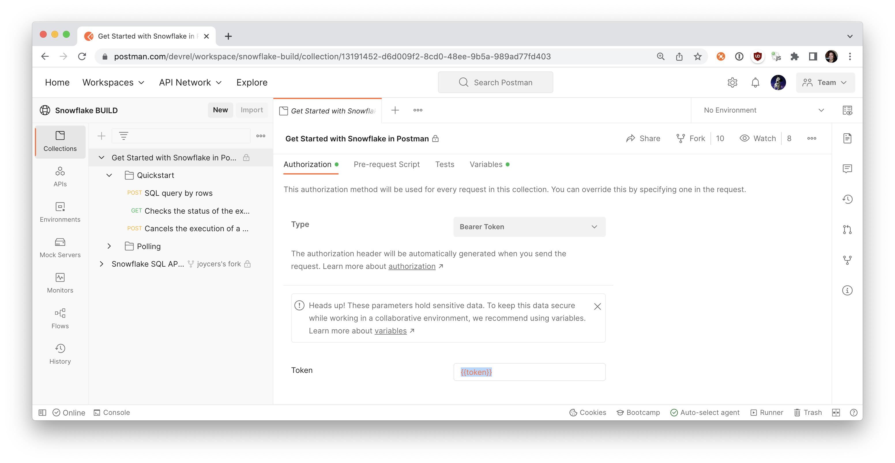

Let's update our `token` variable value next. Tab over to the **Variables** tab, and update the `token` variable with the JWT token generated with the previous SnowSQL command, and save your changes.

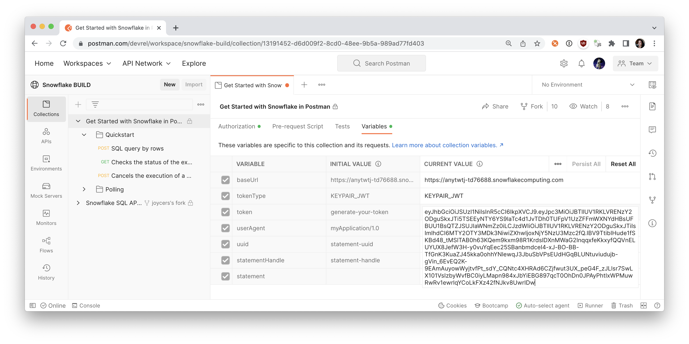

> aside negative
> 
>  ⚠️ If you are working in a team or public workspace, you can keep the data private by pasting the token under the CURRENT VALUE only when working in a team or public workspace. You can also work privately in a personal workspace. If you are working in a team or public workspace and you want to share this data with others, persist values under INITIAL VALUE. Read [the docs about sharing and persisting data in Postman](https://learning.postman.com/docs/sending-requests/variables/#sharing-and-persisting-data).

Once you set up these authorization details for the collection, select one of the API requests. The **Authorization** tab indicates the request inherits the authorization method that we just set up for the collection.

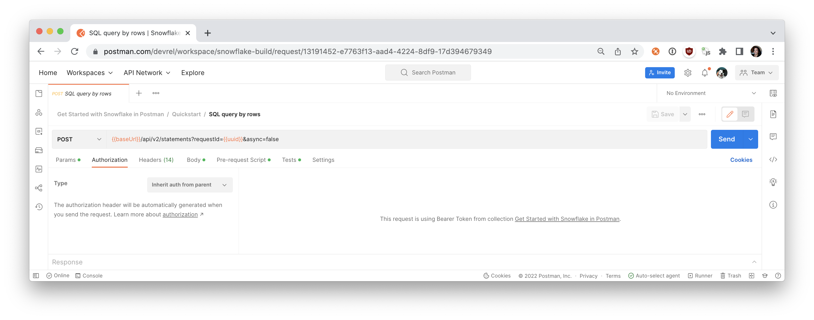

Under the **Headers** tab of the request, find the `Authorization` key. You may need to expand the auto-generated headers. Hover over the `Bearer {{token}}` to see how Postman is updating the header with your credentials saved in a variable.

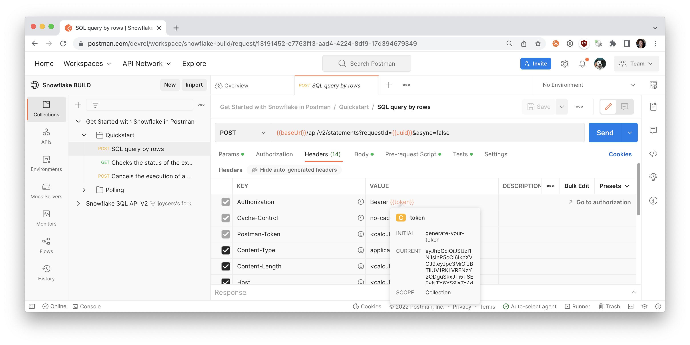

<!-- ------------------------ -->

## Assign a Unique Request ID to Resubmit Requests

Duration: 3

In some cases, it might not be clear if Snowflake executed the SQL statement in an API request (e.g. due to a network error or a timeout). You might choose to resubmit the same request to Snowflake again in case Snowflake did not execute the statement.

If Snowflake already executed the statement in the initial request and you resubmit the request again, the statement is executed twice. For some types of requests, repeatedly executing the same statement can have unintended consequences (e.g. inserting duplicate data into a table).

To prevent Snowflake from executing the same statement twice when you resubmit a request, you can use a request ID to distinguish your request from other requests. Suppose you specify the same request ID in the initial request and in the resubmitted request. In that case, Snowflake does not execute the statement again if the statement has already executed successfully.

To specify a request ID, generate a [universally unique identifier (UUID)](https://en.wikipedia.org/wiki/Universally_unique_identifier) and include this identifier in the `requestId` query parameter:

```
POST /api/v2/statements?requestId={{uuid}} HTTP/1.1
```

In Postman, select the first `POST` request in the `Quickstart` folder. Then select the **Pre-request Scripts** tab that contains JavaScript to execute before the primary API request. On row 2, the code randomly generates a unique identifier and saves the data to a variable called `uuid`.

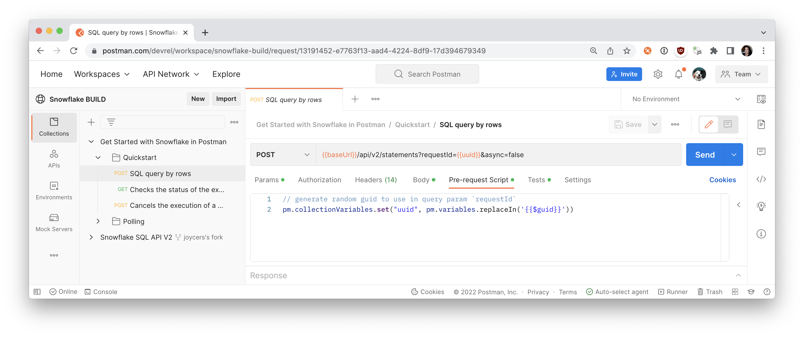

This data can then be used in the primary request as a query parameter variable for a unique request ID. If Snowflake fails to process a request, you can submit the same request again with the same request ID. Using the same request ID indicates to the server that you are submitting the same request again. This data can also be used in subsequent requests, like the next `GET` request in the folder to check the status of the execution of your statement.

Under the first `POST` request in the `Quickstart` folder, look under the **Tests** tab to see similar code to parse the `statementHandle` from the anticipated server response, and save that data as a variable to be used in subsequent requests.

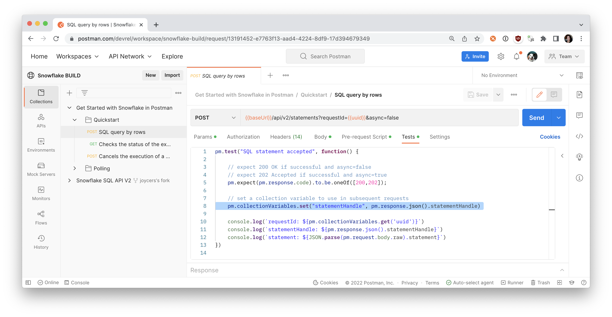

Now that you have been introduced to authorization and unique request IDs, let's submit a request to execute a SQL statement.

<!-- ------------------------ -->

## Submit a Request to Execute a SQL Statement

Duration: 3

To submit a SQL statement for execution, send a `POST` request to the [`/api/v2/statements/`](https://docs.snowflake.com/en/developer-guide/sql-api/reference.html#post-api-v2-statements) endpoint:

```
POST /api/v2/statements?requestId=<UUID> HTTP/1.1
Authorization: Bearer <jwt_token>
Content-Type: application/json
Accept: application/json
User-Agent: myApplication/1.0
X-Snowflake-Authorization-Token-Type: KEYPAIR_JWT

(request body)
```

In Postman, select the first `POST` request in the `Quickstart` folder. Review the various elements of the request, including request URL, parameters, authorization method, headers, and request body.

In the request URL, you can set query parameters to:

- Execute the statement asynchronously: `async=true`

For the [body of the request](https://docs.snowflake.com/en/developer-guide/sql-api/reference.html#body-of-the-post-request-to-api-v2-statements), set the following fields:

- The `statement` field specifies the SQL statement to execute.
- To set a timeout for the statement execution, set the `timeout` field to the maximum number of seconds to wait. If the `timeout` field is not set, the timeout specified by the [STATEMENT_TIMEOUT_IN_SECONDS](https://docs.snowflake.com/en/sql-reference/parameters.html#label-statement-timeout-in-seconds) parameter is used.
- To specify the warehouse, database, schema, and role to use, set the `warehouse`, `database`, `schema`, and `role` fields.

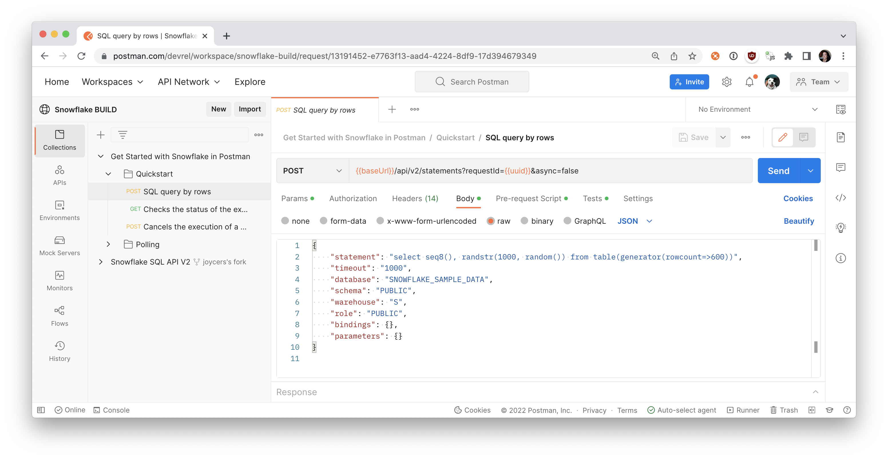

> aside negative
> 
>  Note: the values in these fields are case-sensitive.

In Postman, **Send** the API request. If the statement was executed successfully, Snowflake returns the HTTP response code 200 and the first results in a [ResultSet](https://docs.snowflake.com/en/developer-guide/sql-api/reference.html#resultset) object. Review the server response on the bottom.

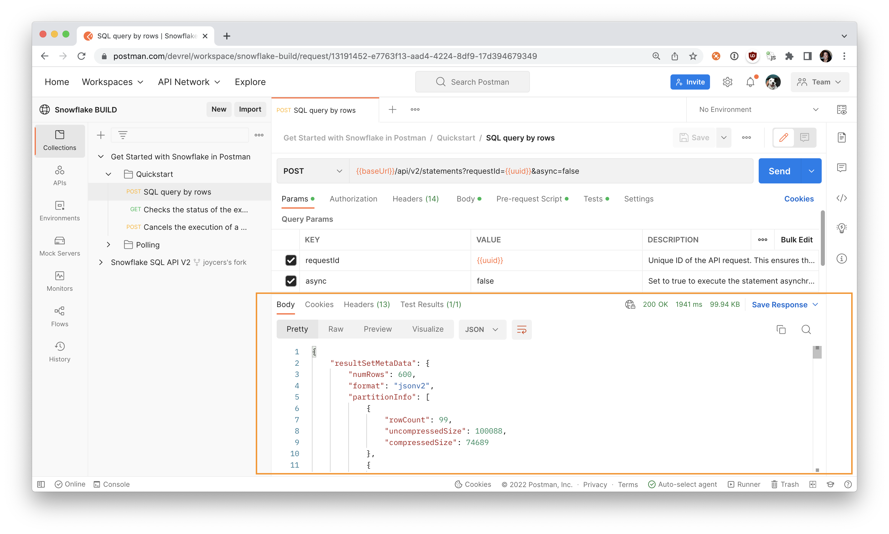

Select the collection, and tab over to **Variables** to verify that your `uuid` and `statementHandle` are stored as variables.

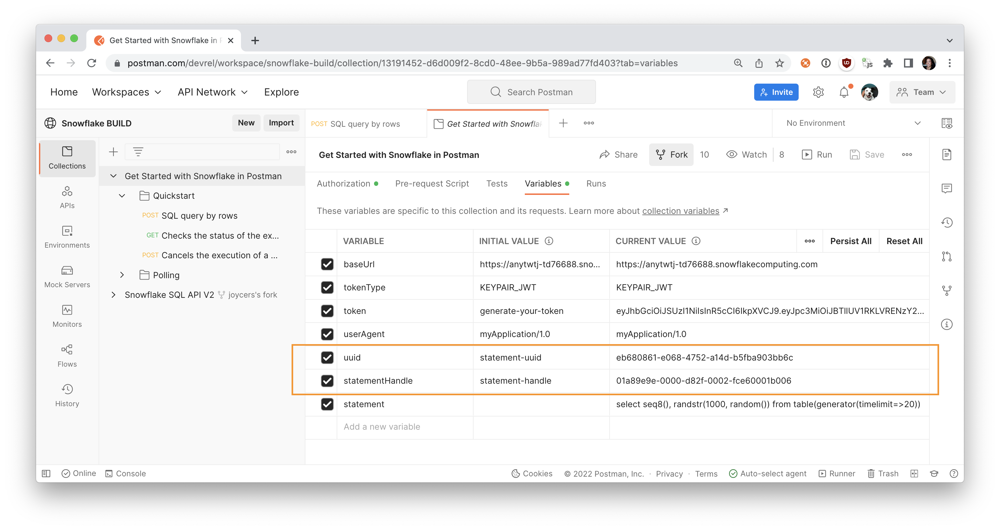

Now let's check the status of the execution of the statement.

<!-- ------------------------ -->

## Check the Status of the Execution of the Statement

Duration: 1

When you submit a SQL statement for execution, Snowflake returns a 202 response code if the execution of the statement has not yet been completed or if you submitted an asynchronous query.

In the body of the response, Snowflake includes a [QueryStatus](https://docs.snowflake.com/en/developer-guide/sql-api/reference.html#querystatus) object. The `statementStatusUrl` field in this object specifies the URL to the [`/api/v2/statements/{{statementHandle}}endpoint`](https://docs.snowflake.com/en/developer-guide/sql-api/reference.html#get-api-v2-statements-statementhandle) that you can use to check the execution status:

```
{
"code": "333334",
"message": "Asynchronous execution in progress. Use provided query id to perform query monitoring and management.",
"statementHandle": "01a89ea6-0000-d838-0002-fce60001c006",
"statementStatusUrl": "/api/v2/statements/01a89ea6-0000-d838-0002-fce60001c006"
}
```

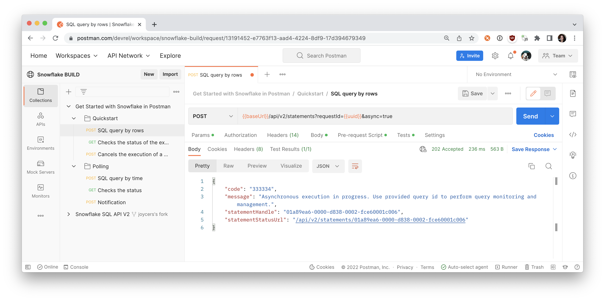

As illustrated by the URL above, in requests to check the status of a statement and cancel the execution of a statement, you specify the statement handle (a unique identifier for the statement) as a path parameter in order to identify the statement to use.

Note that the `QueryStatus` object also provides the statement handle as a separate value in the `statementHandle` field.

To check the status of the execution of the statement, send a GET request using this URL:

```
GET /api/v2/statements/{{statementHandle}}
```

For example, the following request checks the execution status of the statement with the handle `01a89ea6-0000-d838-0002-fce60001c006`:

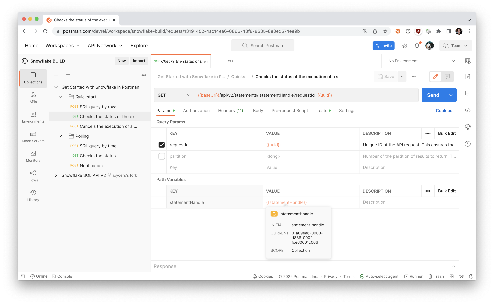

In Postman, select the `GET` request in the `Quickstart` folder. Under the **Params** tab, hover over the `uuid` and `statementHandle` variables to ensure you are submitting the same unique request ID and statement handle from the previous API call. Then **Send** the API request.

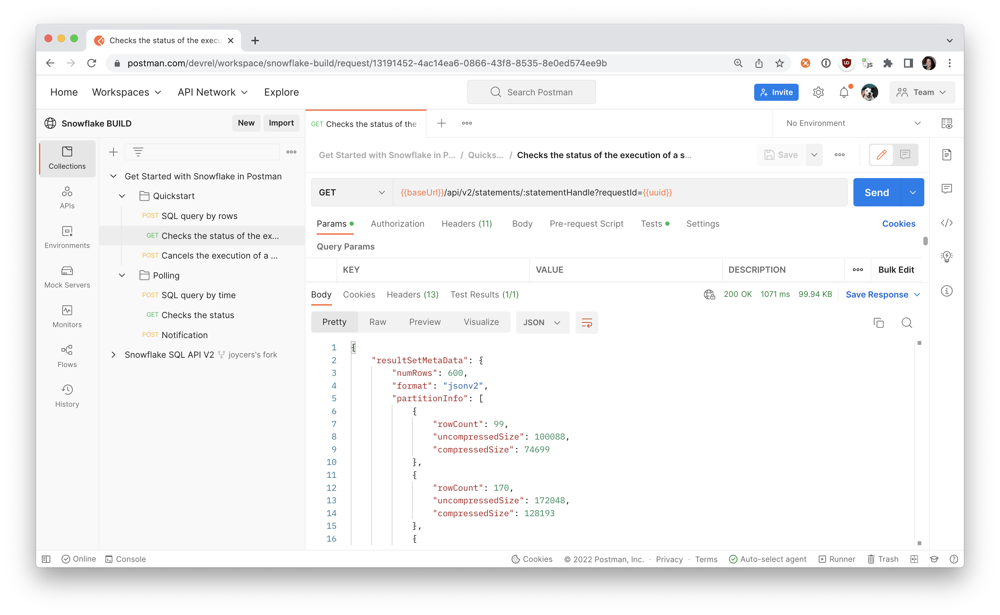

If the statement has finished executing successfully, Snowflake returns the HTTP response code 200 and the first results in a [ResultSet](https://docs.snowflake.com/en/developer-guide/sql-api/reference.html#resultset) object. However, if an error occurred when executing the statement, Snowflake returns the HTTP response code 422 with a [QueryFailureStatus](https://docs.snowflake.com/en/developer-guide/sql-api/reference.html#queryfailurestatus) object.

### Cancel the Execution of a SQL Statement

To cancel the execution of a statement, send a POST request to the [cancel endpoint](https://docs.snowflake.com/en/developer-guide/sql-api/guide.html#cancelling-the-execution-of-a-sql-statement).

```
POST /api/v2/statements/{{statementHandle}}/cancel
```

In the next step, let's walk through an example of automating an API workflow.

<!-- ------------------------ -->

## Automate an API workflow

Duration: 3

### Walk through an API workflow in Postman

In Postman, the folder `Polling` contains an example workflow of a long-running query and periodically checking if the process is completed.

The first request contains a long-running SQL query intended to take 20 seconds in duration. The second request checks if the query is completed, and will continue to check the status. Once a server response indicates the query is complete, the third request then runs, to simulate a notification about the query completion.

For each request, review the data under the following tabs to better understand how each API call works.

- Params
- Body
- Pre-request Scripts
- Tests

Step through each call, as we did in the previous sections, and click **Send** to observe the response from the server. You can manually check the status of the long-running query by repeatedly sending the `Checks the status` API request and inspecting the response.


Or you can automate the checking and [run the folder](https://learning.postman.com/docs/running-collections/running-collections-overview/) in its entirety.

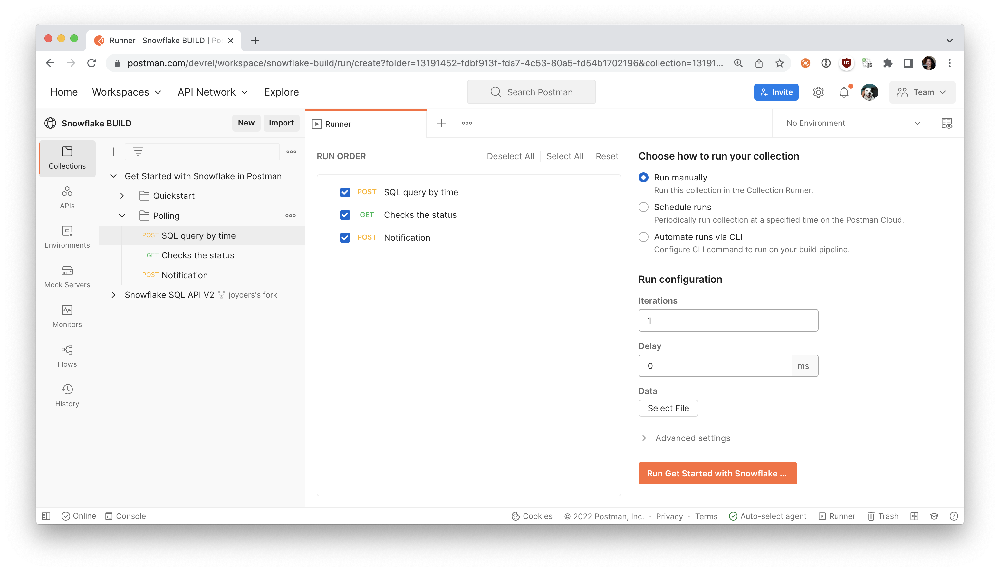

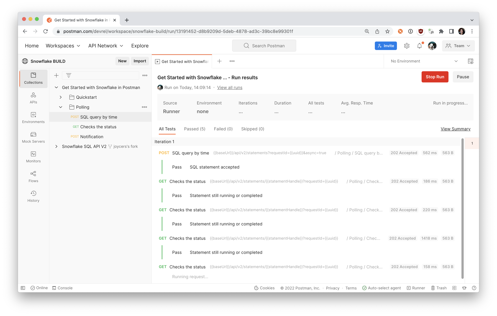

### Generate code snippets for your application

Once you have your API workflow running the way you want, you can [schedule it to run periodically on Postman servers](https://learning.postman.com/docs/running-collections/scheduling-collection-runs/). Or you can replicate the API calls to run from your own applications and integrations.

Update the SQL statement and parameters to your liking, and then find the `Code` icon on the right context bar. Postman generates [code snippets](https://learning.postman.com/docs/sending-requests/generate-code-snippets/#generating-code-snippets-in-postman) to replicate the API requests. Select from several frameworks and languages, and then copy and paste the code into your own applications.

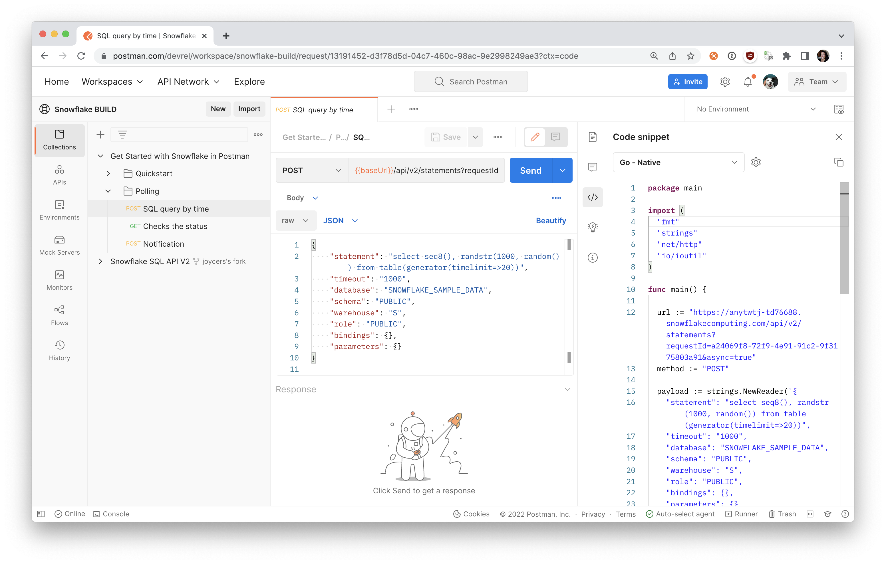

<!-- ------------------------ -->

## Next Steps

Duration: 1

This tutorial was a hands-on introduction to the Snowflake SQL API. To see what else you can do with the API, check out the [Snowflake SQL API Reference](https://docs.snowflake.com/en/developer-guide/sql-api/reference.html) and the [Snowflake public workspace in Postman](https://www.postman.com/snowflake/workspace/snowflake-public-workspace/overview).

If you want more hands-on learning, check out [this in-depth lab](https://quickstarts.snowflake.com/guide/getting_started_snowflake_sql_api/index.html) to dig deeper into the Snowflake SQL API, and learn about the following topics:

- Using bind variables in a statement
- Retriving and getting metadata about the result
- Iterating and retrieving result partitions

If you've completed this lab using the Snowflake free trial, continue exploring what Snowflake can help you accomplish. There are several ways Snowflake can help you with this:

- At the very top of the UI, click on the "Partner Connect" icon to get access to trial/free ETL and BI tools to help you analyze your data with Snowflake
- Read the "[Definitive Guide to Maximizing Your Free Trial](https://www.snowflake.com/test-driving-snowflake-the-definitive-guide-to-maximizing-your-free-trial/)"
- Attend a Snowflake virtual or in-person [event](https://www.snowflake.com/about/webinars/) to learn more about our capabilities and how customers use us
- Contact [Sales](https://www.snowflake.com/free-trial-contact-sales/) to learn more
