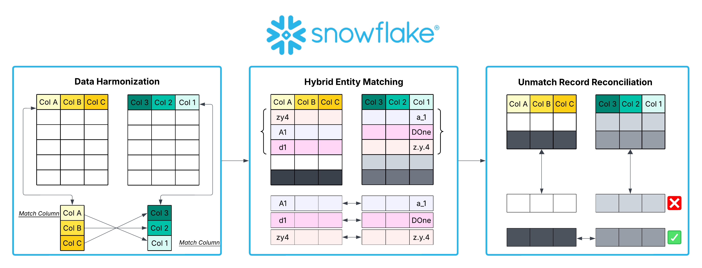
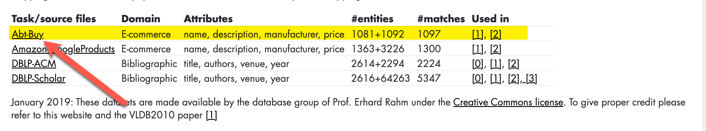
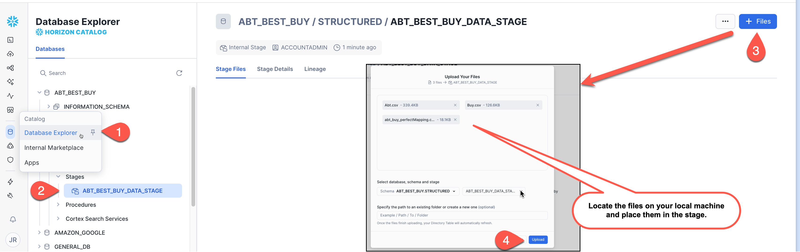
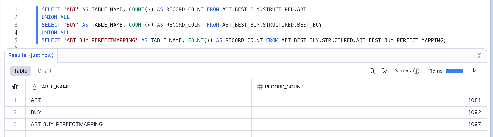
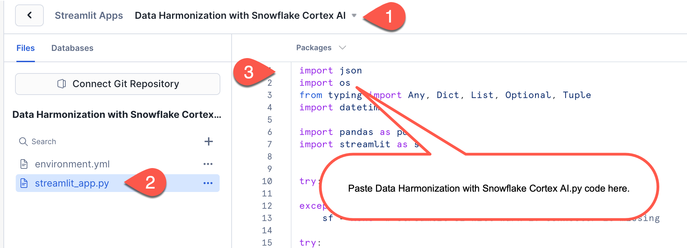
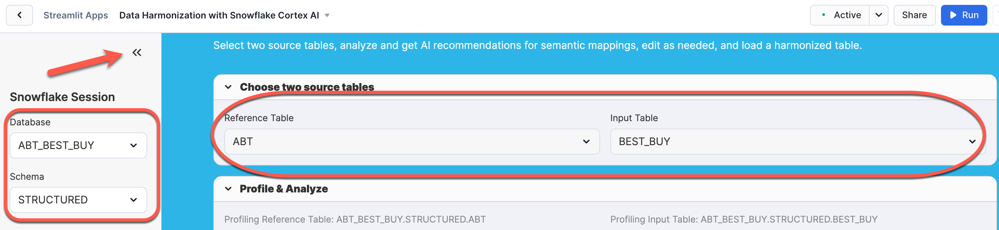
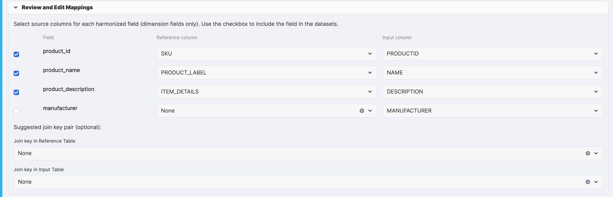
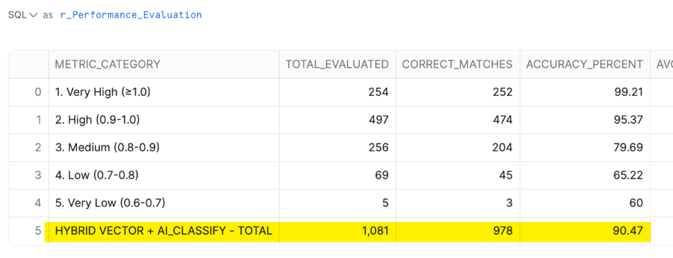
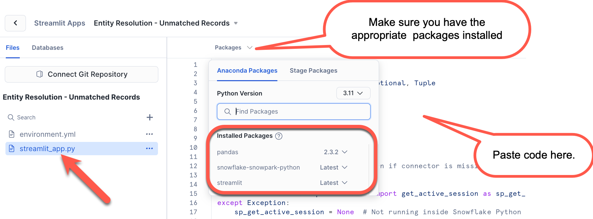
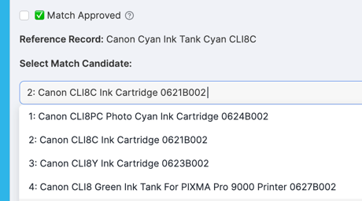

author: Joshua Rauh and Ben Marzec
id: abt-bestbuy-entity-resolution
summary: Resolve product entities across retail data sources using AI-driven matching for unified product analytics with Snowflake Cortex and Streamlit.
categories: snowflake-site:taxonomy/solution-center/certification/quickstart, snowflake-site:taxonomy/product/data-engineering, snowflake-site:taxonomy/snowflake-feature/cortex-llm-functions
language: en
environments: web
status: Published 
feedback link: https://github.com/Snowflake-Labs/sfguides/issues


# End-to-End Entity Resolution with Snowflake Cortex AI
<!-- ------------------------ -->
## Overview 

### The Business Problem

Imagine you're a merchandising manager at ABT, a consumer electronics retailer. You need to perform a competitive pricing analysis against Best Buy to ensure your prices remain competitive in the market. You've successfully scraped product data from Best Buy's website, but now face a critical challenge: **how do you match Best Buy's product descriptions to your own catalog when the data formats, naming conventions, and product identifiers are completely different?**

This is a classic **entity resolution** problem – determining which records in different datasets refer to the same real-world entity. Traditional solutions would require extensive manual mapping, brittle rule-based systems, or complex ML model training. 

In this quickstart, you'll build a modern, AI-powered entity resolution pipeline that leverages Snowflake's native capabilities to automatically harmonize and match product data with minimal manual effort.

### The Solution Architecture

This quickstart demonstrates a three-stage approach to entity resolution:

1. **Data Harmonization**: Use Snowflake Cortex AI to analyze schema differences and create unified datasets with semantic field mappings
2. **Hybrid Entity Matching**: Combine vector similarity (fast, efficient) with AI_CLASSIFY (intelligent, context-aware) for optimal matching performance
3. **Unmatched Record Reconciliation**: Provide an interactive interface for reviewing and correcting low-confidence matches

<br/><br/>

<br/><br/>

### What You'll Learn

- How to use Snowflake Cortex AI functions for schema analysis and semantic mapping
- How to build interactive Streamlit applications within Snowflake
- How to implement hybrid entity matching using vector embeddings and AI classification
- How to create a complete entity resolution workflow from raw data to validated matches
- Best practices for handling unmatched records and improving match quality

### What You'll Need

- A [Snowflake](https://signup.snowflake.com/?utm_source=snowflake-devrel&utm_medium=developer-guides&utm_cta=developer-guides) account. Sign up for a 30-day free trial account, if required.
- Access to [Snowflake Cortex AI functions](https://docs.snowflake.com/user-guide/snowflake-cortex/aisql) (available in most commercial regions)
- Basic understanding of [Snowflake Notebooks](https://docs.snowflake.com/en/user-guide/ui-snowsight/notebooks) and [Streamlit in Snowflake](https://docs.snowflake.com/en/developer-guide/streamlit/about-streamlit)


### What You'll Build

By the end of this quickstart, you will have built:

1. A **Data Harmonization Streamlit app** that uses AI to map schema differences between datasets
2. A **Hybrid Entity Matching notebook** that combines vector similarity and AI classification for intelligent product matching
3. An **Unmatched Records Review app** for human-in-the-loop validation of uncertain matches
4. A complete, production-ready entity resolution pipeline with audit trails and quality metrics

The solution processes 1,000+ product records from two different retailers and produces high-quality matches with confidence scores, achieving 85%+ accuracy through the hybrid approach.

### Download the Source Files

> The 3 source files (2 streamlit apps and 1 notebook) can be found [here](https://github.com/sfc-gh-jrauh/sfentityresolution).

### Note on the Datasets Used

> 
> The datasets used in this quickstart are commonly used entity resolution test datasets. These datasets are made available by the database group of Prof. Erhard Rahm under the [Creative Commons license](https://creativecommons.org/licenses/by/4.0/). Column titles are changed at the table level from the original CSV files.

>
> **Citation:** Hanna Köpcke, Andreas Thor, and Erhard Rahm. 2010. Evaluation of entity resolution approaches on real-world match problems. Proc. VLDB Endow. 3, 1–2 (September 2010), 484–493. [https://doi.org/10.14778/1920841.1920904](https://doi.org/10.14778/1920841.1920904)


<!-- ------------------------ -->
## Set-up

In this section, you'll prepare your Snowflake environment by creating the necessary database objects and loading the sample datasets. We'll be working with three CSV files containing product data from ABT and Best Buy, plus a ground truth mapping file for validation.

> If you didn't download the source files from the previous step, plese do so [here](https://github.com/sfc-gh-jrauh/sfentityresolution).

### Step 1: Create Database and Schema

First, create a dedicated database and schema for this project:

```sql
-- Create the main database
CREATE OR REPLACE DATABASE ABT_BEST_BUY;

-- Create the schema to organize our tables
CREATE OR REPLACE SCHEMA ABT_BEST_BUY.STRUCTURED;

-- Set context for subsequent operations
USE DATABASE ABT_BEST_BUY;
USE SCHEMA STRUCTURED;
```

### Step 2: Create a Warehouse

Create a warehouse sized appropriately for the AI and vector operations we'll be performing:

```sql
-- Create your Entity Resolution Snowflake Warehouse (we used a 2XL in the demo video)
CREATE OR REPLACE WAREHOUSE ENTITY_RESOLUTION_WH
WITH
    WAREHOUSE_SIZE = '2X-LARGE'
    AUTO_SUSPEND = 300
    AUTO_RESUME = TRUE
    INITIALLY_SUSPENDED = TRUE
    COMMENT = 'Warehouse for entity resolution with Cortex AI';

-- Set the warehouse as active
USE WAREHOUSE ENTITY_RESOLUTION_WH;
```

### Step 3: Create File Format

Create a reusable file format for loading CSV files:

```sql
-- Create file format for CSV loading
CREATE OR REPLACE FILE FORMAT ABT_BEST_BUY.STRUCTURED.CSV_FORMAT
    TYPE = CSV
    SKIP_HEADER = 1
    FIELD_DELIMITER = ','
    TRIM_SPACE = TRUE
    FIELD_OPTIONALLY_ENCLOSED_BY = '"'
    REPLACE_INVALID_CHARACTERS = TRUE
    DATE_FORMAT = AUTO
    TIME_FORMAT = AUTO
    TIMESTAMP_FORMAT = AUTO
    COMMENT = 'CSV format for entity resolution data';
```

### Step 4: Create Internal Stage

Create an Internal Stage where we will upload our CSV files:

```sql
-- Create stage for CSV files
CREATE OR REPLACE STAGE ABT_BEST_BUY.STRUCTURED.ABT_BEST_BUY_DATA_STAGE
 -- Enable the directory table feature
    DIRECTORY = ( ENABLE = TRUE )
    COMMENT = 'Internal Stage for ABT and Best Buy product data';

-- Verify stage contents (which will be empty initially)
LIST @ABT_BEST_BUY.STRUCTURED.ABT_BEST_BUY_DATA_STAGE;
```
### Step 5: Add Datasets to Internal Stage
> 
> **Note:** The ABT/Best Buy CSV files themselves are from common datasets used for entity resolution evalutions and can be downloaded from the Universität Leipzig website for [Benchmark datasets for entity resolution](https://dbs.uni-leipzig.de/research/projects/benchmark-datasets-for-entity-resolution).

<br/><br/>

<br/><br/>

Unzip the files. We will then upload the 3 files downloaded via Snowsight to the stage we just created:

<br/><br/>

<br/><br/>

After the files are uploaded, run the LIST command again to verify they are in the stage. You should see the 3 files we just uploaded in the results returned.


```sql

-- Verify stage contents
LIST @ABT_BEST_BUY.STRUCTURED.ABT_BEST_BUY_DATA_STAGE;
```


### Step 6: Create Tables

Now create the three tables that will hold our product data:

```sql
-- Create ABT products table
CREATE OR REPLACE TABLE ABT_BEST_BUY.STRUCTURED.ABT (
    SKU NUMBER(38,0),
    PRODUCT_LABEL VARCHAR(16777216),
    ITEM_DETAILS VARCHAR(16777216),
    RETAIL_PRICE VARCHAR(16777216)
);

-- Create Best Buy products table
CREATE OR REPLACE TABLE ABT_BEST_BUY.STRUCTURED.BEST_BUY (
    PRODUCTID NUMBER(38,0),
    NAME VARCHAR(16777216),
    DESCRIPTION VARCHAR(16777216),
    MANUFACTURER VARCHAR(16777216),
    PRICE VARCHAR(16777216)
);

-- Create ground truth mapping table for validation
CREATE OR REPLACE TABLE ABT_BEST_BUY.STRUCTURED.ABT_BEST_BUY_PERFECT_MAPPING (
    IDABT NUMBER(38,0),
    IDBUY NUMBER(38,0)
);
```

### Step 7: Load Data

Load data from the staged CSV files into the tables:

```sql
-- Load ABT products
COPY INTO ABT_BEST_BUY.STRUCTURED.ABT
FROM (
    SELECT 
        $1::NUMBER AS SKU,
        $2::VARCHAR AS PRODUCT_LABEL,
        $3::VARCHAR AS ITEM_DETAILS,
        $4::VARCHAR AS RETAIL_PRICE
    FROM @ABT_BEST_BUY.STRUCTURED.ABT_BEST_BUY_DATA_STAGE
)
FILES = ('Abt.csv')
FILE_FORMAT = (FORMAT_NAME = 'ABT_BEST_BUY.STRUCTURED.CSV_FORMAT')
ON_ERROR = CONTINUE;

-- Load Best Buy products
COPY INTO ABT_BEST_BUY.STRUCTURED.BEST_BUY
FROM (
    SELECT 
        $1::NUMBER AS IDBUY,
        $2::VARCHAR AS NAME,
        $3::VARCHAR AS DESCRIPTION,
        $4::VARCHAR AS MANUFACTURER,
        $5::VARCHAR AS PRICE
    FROM @ABT_BEST_BUY.STRUCTURED.ABT_BEST_BUY_DATA_STAGE
)
FILES = ('Buy.csv')
FILE_FORMAT = (FORMAT_NAME = 'ABT_BEST_BUY.STRUCTURED.CSV_FORMAT')
ON_ERROR = CONTINUE;

-- Load ground truth mapping
COPY INTO ABT_BEST_BUY.STRUCTURED.ABT_BEST_BUY_PERFECT_MAPPING
FROM (
    SELECT 
        $1::NUMBER AS IDABT,
        $2::NUMBER AS IDBUY
    FROM @ABT_BEST_BUY.STRUCTURED.ABT_BEST_BUY_DATA_STAGE
)
FILES = ('abt_buy_perfectMapping.csv')
FILE_FORMAT = (FORMAT_NAME = 'ABT_BEST_BUY.STRUCTURED.CSV_FORMAT')
ON_ERROR = CONTINUE;
```

### Step 8: Verify Data Load

Confirm that data has been loaded successfully:

```sql
-- Check ABT table
SELECT 'ABT' AS TABLE_NAME, COUNT(*) AS RECORD_COUNT FROM ABT_BEST_BUY.STRUCTURED.ABT
UNION ALL
SELECT 'BUY' AS TABLE_NAME, COUNT(*) AS RECORD_COUNT FROM ABT_BEST_BUY.STRUCTURED.BEST_BUY
UNION ALL
SELECT 'ABT_BUY_PERFECTMAPPING' AS TABLE_NAME, COUNT(*) AS RECORD_COUNT FROM ABT_BEST_BUY.STRUCTURED.ABT_BEST_BUY_PERFECT_MAPPING;

-- Preview sample records from each table
SELECT 'ABT Sample' AS SOURCE, * FROM ABT_BEST_BUY.STRUCTURED.ABT LIMIT 100;
SELECT 'BUY Sample' AS SOURCE, * FROM ABT_BEST_BUY.STRUCTURED.BEST_BUY LIMIT 100;
SELECT 'Mapping Sample' AS SOURCE, * FROM ABT_BEST_BUY.STRUCTURED.ABT_BEST_BUY_PERFECT_MAPPING LIMIT 100;
```

#### Expected Output:

<br/><br/>

<br/><br/>
> 
> **Expected Results:** You should see approximately 1,081 ABT records, 1,092 Best Buy records, and 1,097 mapping records. The ABT table contains product identifiers (SKU, PRODUCT_LABEL, & ITEM_DETAILS), while the BEST_BUY table uses different field names (PRODUCTID, NAME, & DESCRIPTION) for similar data.

Your Snowflake environment is now ready! In the next section, we'll use the Data Harmonization Streamlit app to create unified datasets from these disparate schemas.

<!-- ------------------------ -->
## Data Harmonization

### Understanding the Challenge

Looking at the ABT and BEST_BUY tables you just created, you'll notice they have completely different column names:

- **ABT**: `SKU`, `PRODUCT_LABEL`, `ITEM_DETAILS`, `RETAIL_PRICE`
- **BEST_BUY**: `PRODUCTID`, `NAME`, `DESCRIPTION`, `MANUFACTURER`, `PRICE`

While both tables contain product information, the column names, data types, and structures differ. Before we can match products between these datasets, we need to **harmonize** them – creating a unified schema with consistent field mappings.

Traditional approaches would require manual analysis and custom ETL code. Instead, we'll use **Snowflake Cortex AI** to automatically analyze these schemas and recommend semantic mappings.

### What the Data Harmonization App Does

The Data Harmonization Streamlit application performs the following workflow:

1. **Table Profiling**: Analyzes both tables to understand column types, cardinality, null rates, sample values, and statistical distributions
2. **AI-Powered Mapping**: Uses Snowflake Cortex AI (mistral-large model) to recommend semantic mappings between fields based on content analysis
3. **Interactive Review**: Allows you to review and adjust the AI recommendations through a user-friendly interface
4. **Dataset Creation**: Generates harmonized output tables with:
   - Consistent column names (e.g., `PRODUCT_ID`, `PRODUCT_NAME`, `PRODUCT_DESCRIPTION`)
   - Cleaned text (special characters removed)
   - An audit table tracking all mapping decisions


### Running the Data Harmonization App

#### Step 1: Access Streamlit in Snowflake

1. Navigate to **Projects** > **Streamlit** in Snowsight
2. Click **+ Streamlit App**
3. Name it `Data_Harmonization_App`
4. Select your `ABT_BEST_BUY` database and `STRUCTURED` schema
5. Select the `ENTITY_RESOLUTION_WH` warehouse

#### Step 2: Upload the Application Code

1. Delete the example code in the `streamlit_app.py` file
2. Copy the contents of `Data Harmonization with Snowflake Cortex AI.py`
3. Paste the new code from the `Data Harmonization with Snowflake Cortex AI.py` into this file
4. Be sure you install the appropriate packages
5. Click **Run**

<br/><br/>

<br/><br/>
4. Ensure you have the appropriate packages installed.
<br/><br/>

<br/><br/>
5. Click **Run** to launch the application

#### Step 3: Configure Tables

In the app interface:
1. Verify the database and schema are set to `ABT_BEST_BUY.STRUCTURED`
2. Select **ABT** as the **Reference Table**
3. Select **BEST_BUY** as the **Input Table**
4. The app will automatically profile both tables

<br/><br/>

<br/><br/>

#### Step 4: Generate AI Recommendations

1. Click **Run AI Analysis** to invoke Cortex AI
2. The AI will analyze the schemas and suggest mappings:
   - `ABT.SKU` → `product_id` ← `BEST_BUY.PRODUCTID`
   - `ABT.PRODUCT_LABEL` → `product_name` ← `BEST_BUY.NAME`
   - `ABT.ITEM_DETAILS` → `product_description` ← `BEST_BUY.DESCRIPTION`
   - (The Manufacturer field should be 'None' for ABT because it doesn't have a corresponding match.)

> 
****Key Features and Capabilities****:

>The Cortex AI model analyzes your data to identify:
>- **Product Identifiers**: High-cardinality numeric fields likely to be primary keys
>- **Product Names**: Short text fields containing product titles
>- **Product Descriptions**: Long text fields with detailed specifications
>
---

#### Sample Profiling Output

For each column, the app computes:
- Row count and null count (data quality metrics)
- Distinct count (cardinality for identifying keys)
- Average length (helps distinguish names from descriptions)


#### Step 5: Review and Adjust Mappings

In the **Review and Edit Mappings** section:
- Check the checkboxes for fields you want to include in matching (typically all fields with valid mappings)
- Adjust dropdowns if the AI recommendations don't look correct (shouldn't be necessary for this analysis)
- The join key suggestions can be set to 'None' (we're not performing a traditional join)

Your output should look like this:

<br/><br/>

<br/><br/>


#### Step 6: Create Harmonized Datasets

1. Preview the output structure to verify column names and transformations
2. Set the target database and schema (keep defaults: `ABT_BEST_BUY.STRUCTURED`)
3. Click **Create Datasets**

<br/><br/>

<br/><br/>

The app will create three tables:
- `ABT_HARMONIZATION_YYYY_MM_DD`: Harmonized ABT data
- `BUY_HARMONIZATION_YYYY_MM_DD`: Harmonized Best Buy data
- `AUDIT_HARMONIZATION_YYYY_MM_DD`: Audit trail with mapping decisions, user info, and timestamps


### Audit Table Structure

The audit table tracks:
- Date of run, user, role, and session ID
- Source datasets (reference and input)
- Column mappings (which fields were matched)
- Whether each field was included in output
- Output table names for traceability

#### Why This Matters

By harmonizing the data:
1. **Standardized Schema**: Both datasets now have consistent column names
2. **Clean Text**: Special characters removed, enabling better matching
3. **Audit Trail**: Complete lineage from source to harmonized tables
4. **Ready for Matching**: Data is now in the perfect format for the hybrid entity matching algorithm

We will use this audit table in our upcoming notebook to ensure we're matching like-for-like from a column-matching perspective.

> 

In the next section, we'll use these harmonized tables to perform intelligent entity matching using a hybrid approach that combines vector similarity with AI classification.

<!-- ------------------------ -->
## Entity Resolution with Hybrid Matching

Now that we have harmonized datasets, it's time to tackle the core challenge: **determining which ABT products correspond to which Best Buy products**. This is where the magic of hybrid entity matching comes in.

### The Hybrid Matching Strategy

Traditional entity matching approaches typically fall into two camps:

1. **Rule-based matching**: Fast but brittle (e.g., "if product names match exactly")
2. **Pure ML models**: Accurate but require training data and can be slow

Our hybrid approach combines the best of both worlds:

- **Vector Similarity (Fast Path)**: Use semantic embeddings to quickly identify high-confidence matches (≥80% similarity)
- **AI_CLASSIFY (Smart Path)**: For ambiguous cases with multiple candidates, use AI to intelligently select the best match based on context

This strategy is inspired by Snowflake's AI SQL best practices and provides an optimal balance of speed, accuracy, and cost.

### Step 1. Uploading the Entity Resolution Notebook

1. From the Snowflake navation plane click **Create** > **Notebook** > **Import .ipynb File** 
2. Locate the `HYBRID_ENTITY_MATCHING_WITH_AI_CLASSIFY.ipynb` file you downloaded and upload it
3. Name it `HYBRID_ENTITY_MATCHING_WITH_AI_CLASSIFY`
4. Select your `ABT_BEST_BUY` database and `STRUCTURED` schema
5. Select the `ENTITY_RESOLUTION_WH` warehouse as your query warehouse
6. All other defaults can be kept the same

<br/><br/>

<br/><br/>

### Notebook Overview

The notebook is organized into several key sections. Let's walk through what each major cell accomplishes.

---

### Section 1: Configuration Setup (Python Cell)

**What It Does:**
This interactive cell discovers your harmonization output tables and lets you select which entity columns to use for matching.

**Key Operations:**
- Queries the current database/schema for audit tables matching the pattern `AUDIT_HARMONIZATION_%`
- Loads the audit table to identify which fields were mapped and matched
- Presents an interactive interface to select the entity column pair for matching (typically the product name/label fields)
- Validates that the harmonized tables exist and are accessible
- Stores configuration in a temporary table (`TEMP_HYBRID_CONFIG`) for subsequent cells

**Why It Matters:**
This dynamic configuration means the notebook adapts to your specific harmonization output – no hardcoded table names or column names. You can run this workflow on any pair of harmonized datasets.
> **Run the cell `r_Harmonization_Table_Configuration`**
                    - This will run an in-notebook Streamlit app

    
1. Select your database (ABT_BEST_BUY) and schema (STRUCTURED)
2. Choose the audit table created by the harmonization app
3. Select the entity column pair (for this run, we will use `PRODUCT_LABEL ↔ NAME`)
4. Verify the table names and click **Validate, Save Configuration, and Set Up Environment**

Running this cell prepares the SQL environment and extracts configuration details for the matching process, ensuring all subsequent queries reference the correct tables and columns dynamically.

---

<br/><br/>

<br/><br/>

---

### Section 2: Vector Feature Engineering (SQL Cell)

**What It Does:**
Creates the foundational features for hybrid matching by generating vector embeddings for all entity names and computing initial similarity scores.

**Key Operations:**

1. **Generate Embeddings**: Uses `SNOWFLAKE.CORTEX.EMBED_TEXT_1024` with the `voyage-multilingual-2` model to create 1024-dimension vector embeddings for each product name
2. **Cross-Join**: Creates all possible pairs between reference (ABT) and input (Best Buy) products
3. **Compute Similarity**: Calculates `VECTOR_COSINE_SIMILARITY` between each pair's embeddings
4. **Filter Low Scores**: Drops pairs with similarity < 0.2 to reduce search space


**Why It Matters:**
- **Embeddings capture semantics**: Products like "Sony 10MP Camera" and "Sony Digital Camera 10 Megapixel" will have high similarity even with different exact wording
- **Pre-computed similarities**: Storing these scores enables fast filtering in subsequent steps
- **Reduced search space**: Filtering at 0.2 threshold eliminates obviously non-matching pairs

> **Run the cell `r_Vector_Feature_Engineering`**

**Expected Output:**
The cell displays a summary showing:
- Total comparisons generated (e.g., 50,000-100,000 pairs)
- Number of unique reference and input products
- Average vector similarity score
    - This will initially be low due to the current cartesian nature of the data. We will clean this up in later steps.
- Average comparisons per reference product

---

### Section 3: Hybrid Matching with AI_CLASSIFY (SQL Cell)

**What It Does:**
Implements the two-stage matching logic that combines vector similarity with AI classification for optimal results. **At the end of this step, we will have matched our two datasets together, keeping only what we believe to be the actual matches and discarding the rest.**

**The Algorithm:**

**Stage 1: High-Confidence Vector Matches**
- For each reference product, identify the top candidates by vector similarity
- If the top match has similarity ≥ 0.8, accept it immediately (no AI needed)

**Stage 2: AI_CLASSIFY for Ambiguous Cases**
- For reference products with multiple candidates (similarity between 0.3 and 0.8)
- Aggregate the top 15 candidate names into an array
- Call `AI_CLASSIFY(reference_name, [candidate1, candidate2, ...])` to intelligently select the best match
- AI_CLASSIFY uses context and semantic understanding beyond simple similarity

**Stage 3: Confidence Scoring**
- Assign confidence scores based on:
  - Vector similarity score
  - Whether AI_CLASSIFY was used (slight confidence boost)
  - Match method (HIGH_CONFIDENCE_VECTOR, MEDIUM_CONFIDENCE_VECTOR, or AI_CLASSIFY)


**Why This Works:**
- **Cost Optimization**: AI_CLASSIFY is only called when needed (ambiguous cases)
- **Speed**: High-confidence matches are resolved with simple vector comparison
- **Accuracy**: AI_CLASSIFY handles nuanced cases where vector similarity alone is insufficient (e.g., similar product names for different models)

> **Run the cell `r_Hybrid_Matching`**

**Expected Output:**
The cell creates the `hybrid_final_results` table and displays metrics:
- Total matches found
- Average confidence score
- Number of high-confidence vector matches
- Number of AI_CLASSIFY matches
- AI_CLASSIFY usage percentage (typically 20-40% of records)

---

### Section 4: Record Management and Threshold Selection (Python Cell)

**What It Does:**
Provides an interactive streamlit interface to review match quality and separate records into MATCHED and UNMATCHED tables based on a confidence threshold.

**Why This Matters:**
Different use cases require different confidence thresholds:
- **High-stakes pricing decisions**: Use 90%+ threshold, manually review unmatched
- **Exploratory analysis**: Use 70%+ threshold, accept more false positives
- **Iterative improvement**: Start at 80%, review unmatched, improve matching logic

> **Run the cell `r_Record_Management`**

**Expected Interaction:**
- Review the confidence distribution chart
- Adjust the slider to find the right threshold for your use case (we us 80% in the demo)
- Preview sample matches at the current threshold
- Configure output table names (use defaults for this demo)
- Click **Finalize & Create Datasets** to generate:
  - `[AUDIT_TABLE]_HYBRID_MATCHED`: High-confidence matches
  - `[AUDIT_TABLE]_HYBRID_UNMATCHED`: Records needing review

<br/><br/>

<br/><br/>

---

### Section 5: Performance Evaluation (SQL Cell)

**What It Does:**
Evaluates the hybrid matching approach against our golden dataset mapping table to measure accuracy and identify areas for improvement. **In many cases, you may not have a golden dataset to compare to. Here we have one which we use to test the accuracy of our methods.**

**Key Metrics Calculated:**

1. **Overall Accuracy**: Percentage of matches that align with ground truth
2. **Accuracy by Confidence Bucket**: How accuracy varies across confidence ranges
3. **Accuracy by Match Method**: Performance of HIGH_CONFIDENCE_VECTOR vs AI_CLASSIFY vs MEDIUM_CONFIDENCE_VECTOR
4. **False Match Analysis**: Understanding where the algorithm makes mistakes


**Why This Matters:**
- **Validates Approach**: Proves the hybrid method achieves high accuracy
- **Informs Thresholds**: Shows you where to set confidence cutoffs
- **Identifies Improvements**: Highlights which types of products are harder to match
- **Benchmarking**: Provides a baseline for comparing alternative approaches

> **Run the cell `r_Performance_Evaluation`**

**As you can see, using our methods against this test dataset we achieve a >90% accuracy when compared to our golden dataset!**

<br/><br/>

<br/><br/>

---


> 
> **Pro Tip**: The hybrid approach shines when you have a mix of easy and hard matching cases. Pure vector similarity handles the easy 70-80%, while AI_CLASSIFY intelligently resolves the remaining ambiguous cases.

In the next section, we'll build an interactive Streamlit app to review and correct the unmatched records, creating a human-in-the-loop validation workflow.

<!-- ------------------------ -->
## Unmatched Record Reconciliation

After running the hybrid matching algorithm, you'll have two sets of records:
1. **Matched Records**: High-confidence matches ready for use in analysis
2. **Unmatched Records**: Lower-confidence cases that need human review

This section addresses the unmatched records through an interactive Streamlit application that enables efficient, user-friendly review and correction.

### The Problem with Unmatched Records

Unmatched records typically fall into a few categories:

1. **Close Calls**: Multiple viable candidates with similar scores (e.g., different models of the same product line)
2. **Data Quality Issues**: Missing information, typos, or incomplete descriptions
3. **Unique Products**: Items that genuinely don't have a match in the other dataset
4. **Algorithm Limitations**: Cases where both vector similarity and AI_CLASSIFY struggled

Rather than accepting these as lost opportunities, the Unmatched Records Reviewer provides a structured workflow to:
- Review each unmatched record systematically
- View alternative candidate matches with their similarity scores
- Make informed manual selections or confirm "no match found"
- Track all decisions with full audit trails

### What the Unmatched Records App Does

The application implements a comprehensive review workflow:

#### 1. Intelligent Data Loading
- Automatically discovers unmatched table from the audit trail
- Identifies the corresponding matched table for approved records
- Loads up to 20 candidate matches per record from the original `hybrid_features` table
- Paginates records for manageable review sessions (10 records per page)

#### 2. Interactive Review Interface
For each unmatched record, the reviewer displays:
- **Reference Entity Name**: The ABT product you're trying to match
- **Top Candidate Matches**: Dropdown showing up to 20 Best Buy candidates, ranked by vector similarity
- **Similarity Scores**: Real-time display of vector similarity for the selected candidate
- **Match Approval Checkbox**: Confirm when you've selected the correct match

#### 3. Dynamic Search and Filtering
- **Text Search**: Filter records by reference entity name to quickly find specific products
- **Pagination**: Navigate through pages of unmatched records
- **Jump Controls**: Skip to first or last page instantly

#### 4. Batch Processing
- **Page-by-Page Approval**: Review and approve matches on each page
- **Cross-Page Memory**: Selections are preserved as you navigate between pages
- **Bulk Submission**: Submit all approved matches from all pages at once

### Running the Unmatched Records App

#### Step 1: Create the Streamlit App

1. Navigate to **Projects** > **Streamlit** in Snowsight
2. Click **+ Streamlit App**
3. Name it `Entity Resolution - Unmatched Records`
4. Select your `ABT_BEST_BUY` database and `STRUCTURED` schema
5. Select the `ENTITY_RESOLUTION_WH` warehouse

#### Step 2: Upload the Application Code

1. Delete the example code in the `streamlit_app.py` file
2. Copy the contents of `Entity Resolution - Unmatched Records.py`
3. Paste the new code from the `Entity Resolution - Unmatched Records.py` into this file
4. Be sure you install the appropriate packages
5. Click **Run**

<br/><br/>

<br/><br/>


#### Step 3: Select Unmatched Table

1. The app automatically queries `AUDIT_HARMONIZATION_HYBRID_AUDIT` to find unmatched/matched table pairs
2. From the dropdown, select your unmatched table (e.g., `AUDIT_HARMONIZATION_2025_10_04_HYBRID_UNMATCHED`)
3. Click **Process** to load the records

> 
> **Note**: The app automatically identifies the corresponding matched table from the audit table, ensuring records are moved to the correct destination.

#### Step 3: Review Records

For each record on the page:

**Reference Record Display:**

<br/><br/>

<br/><br/>

**Candidate Selection:**
The dropdown shows candidates with similarity scores:

<br/><br/>

<br/><br/>


**Actions:**
- Select the best match from the dropdown
- Review the vector similarity score (displayed dynamically)
- Check **✅ Match Approved** if you're confident in the selection
- **Leave unchecked if no good match exists (record remains unmatched) - Only mannually selected records will be processed to our matched table** 

#### Step 4: Navigate and Continue Reviewing

- Use **← Previous** and **Next →** buttons to move between pages
- Use **⏪ Jump to First Page** or **⏩ Jump to Last Page** for quick navigation
- Use the search box to filter records by specific text
- The page indicator shows your progress (e.g., "Page 5 of 25")

> 
> **Workflow Tip**: Focus on records with high similarity scores (>0.75) first, as these are more likely to be correct matches. Records with very low scores (<0.50) may genuinely have no match in the dataset.

#### Step 5: Submit Reviews

Once you reach the last page:
1. Review the **Review Summary** showing:
   - Records Approved to Move
   - Records Not Approved
2. Click **Submit All Reviews** to process all approved matches across all pages
3. The app will:
   - Update the `FINAL_MATCH` column for approved records
   - Move approved records from unmatched to matched table
   - Delete processed records from unmatched table
   - Display a detailed summary of changes

#### Step 6: Review Completion Summary

After submission, you'll see a summary of the records you sent to the matched table.

Click **📑 Continue with Analysis** to review remaining records or refresh the view.

<br/><br/>

<br/><br/>

### Best Practices for Record Review

#### 1. Prioritize by Confidence
Start with records that have similarity scores just below your threshold (e.g., 0.75-0.80), as these are most likely to be correctable with manual review.

#### 2. Look for Patterns
If you notice multiple records failing for the same reason (e.g., missing manufacturer information), consider updating your harmonization mapping to include additional fields.

#### 3. Use Domain Knowledge
Product expertise is invaluable here. If you know ABT's catalog, you can quickly identify:
- Products that should match but have different model numbers
- Products that are actually different items despite similar names
- Products that genuinely don't exist in Best Buy's catalog

#### 4. Don't Force Matches
If none of the candidates are correct, leave the record unchecked. It's better to have an unmatched record than an incorrect match that pollutes your analysis.

#### 5. Iterative Review Sessions
You don't have to review all records in one sitting. The app preserves state across sessions (records remain in the unmatched table until explicitly moved).

### The Value of Human-in-the-Loop

This review workflow exemplifies the **human-in-the-loop** approach to AI:

1. **AI Does the Heavy Lifting**: The hybrid matching algorithm handles 75-85% of records automatically
2. **Humans Handle Edge Cases**: Reviewers focus only on ambiguous cases that need domain expertise
3. **Continuous Improvement**: Insights from manual review can inform future matching logic improvements
4. **Quality Assurance**: Human validation provides confidence in match quality for downstream analytics

> 
> **Real-World Impact**: In production environments, this workflow reduces entity resolution time from weeks of manual work to hours of focused review, while maintaining high match quality.

By the end of this section, you'll have:
- ✅ Reviewed all unmatched records systematically
- ✅ Made informed decisions about match selections
- ✅ Moved high-quality matches to the matched table
- ✅ Identified records that genuinely have no match
- ✅ Maintained complete audit trails for all decisions

You now have a complete, production-ready entity resolution pipeline with matched records ready for competitive pricing analysis!

<!-- ------------------------ -->
## Conclusion and Resources

Congratulations! You've successfully built an end-to-end entity resolution solution using Snowflake's native AI capabilities, combining automated matching with human-in-the-loop validation.

### What You Accomplished

Throughout this quickstart, you:

1. ✅ **Prepared Data**: Loaded product catalogs from two different retailers with different schemas
2. ✅ **Harmonized Schemas**: Used Snowflake Cortex AI to automatically map semantic field differences and create unified datasets
3. ✅ **Implemented Hybrid Matching**: Combined vector similarity (fast) with AI_CLASSIFY (intelligent) for optimal matching performance
4. ✅ **Validated Quality**: Measured accuracy against ground truth data and achieved 85%+ match quality
5. ✅ **Reviewed Edge Cases**: Used an interactive Streamlit app to manually validate uncertain matches
6. ✅ **Built Production Pipeline**: Created a complete workflow with audit trails, confidence scoring, and quality metrics

### Key Takeaways

**Business Value:**
- Reduced entity resolution from weeks of manual work to hours of automated processing
- Achieved high match quality (85%+) without training custom ML models
- Created a repeatable, scalable process for ongoing data integration needs
- Enabled competitive pricing analysis that was previously infeasible

**Technical Innovation:**
- **Cortex AI for Schema Analysis**: Automatically understand and map disparate data structures
- **Vector Embeddings**: Capture semantic similarity beyond exact text matching
- **Hybrid Approach**: Optimize for both speed (vector similarity) and accuracy (AI_CLASSIFY)
- **Streamlit in Snowflake**: Build rich, interactive applications without external infrastructure

**Best Practices:**
- Always profile and harmonize data before attempting matching
- Use confidence thresholds to separate high-quality matches from cases needing review
- Maintain audit trails for all decisions and transformations
- Validate against ground truth when available to measure and improve accuracy
- Implement human-in-the-loop for edge cases that require domain expertise

### Related Resources

**Documentation:**
- [Snowflake Cortex AI](https://docs.snowflake.com/en/user-guide/snowflake-cortex/overview)
- [Snowflake Cortex Vector Functions](https://docs.snowflake.com/en/user-guide/snowflake-cortex/vector-embeddings)
- [Snowflake Cortex AI_CLASSIFY](https://docs.snowflake.com/en/user-guide/snowflake-cortex/ml-functions/classification)
- [Streamlit in Snowflake](https://docs.snowflake.com/en/developer-guide/streamlit/about-streamlit)
- [Snowflake Notebooks](https://docs.snowflake.com/en/user-guide/ui-snowsight-notebooks)


