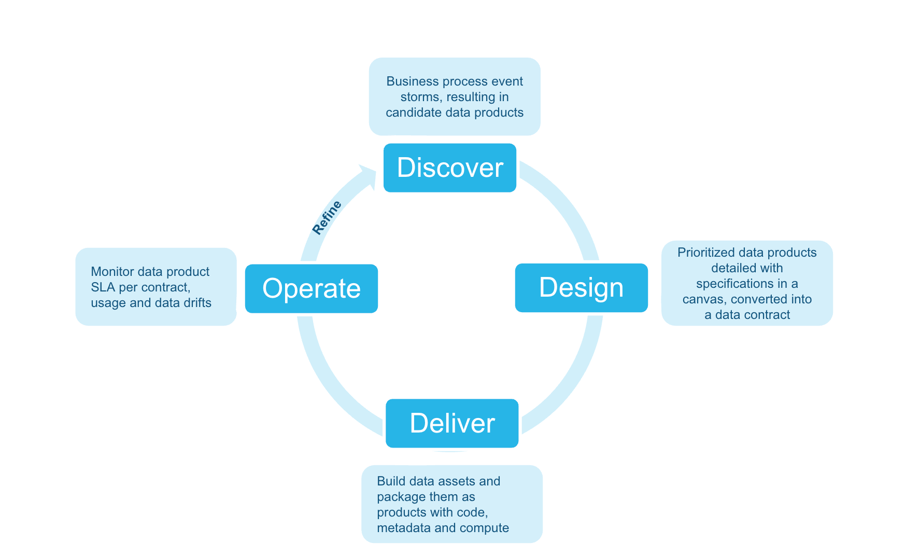
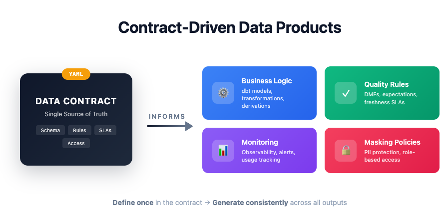

author: Srinivasan Kuppusamy
id: accelerate-data-product-delivery
language: en
summary: Learn how to accelerate data product delivery from requirements to production in one sprint using Snowflake Cortex Code. Automate design, code generation, governance, and monitoring using an AI agent and a machine-readable data contract. Uses an FSI example but applicable to any industry.
categories: snowflake-site:taxonomy/solution-center/certification/quickstart,snowflake-site:taxonomy/product/ai,snowflake-site:taxonomy/product/data-engineering,snowflake-site:taxonomy/snowflake-feature/compliance-security-discovery-governance,snowflake-site:taxonomy/snowflake-feature/cortex-llm-functions,snowflake-site:taxonomy/industry/financial-services
environments: web
status: Published
feedback link: https://github.com/Snowflake-Labs/sfquickstarts/issues
fork repo link: https://github.com/srini86/data-products-lifecycle-fsi-example

# Accelerate Data Product Delivery with Snowflake Cortex Code
<!-- ------------------------ -->
## Overview

Duration: 5 minutes

This guide shows how to deliver a governed data product in **a single sprint** using [Cortex Code (CoCo)](https://docs.snowflake.com/en/user-guide/snowflake-cortex/cortex-code) and a machine-readable **data contract** as the single source of truth. One document captures the requirements; an agent reads it and generates, deploys, and monitors every artifact automatically.

The example uses a **Retail Customer Churn Risk** data product in a retail banking context, but the approach works for any data product in any industry.

> **Note:** The Discover phase is pre-done. Open `01_discover/data_product_canvas.png` to see the agreed requirements — this canvas is the only input to all phases that follow. The sprint goal is to deliver `RETAIL_BANKING_DB.DATA_PRODUCTS.RETAIL_CUSTOMER_CHURN_RISK` — governed, tested, and monitored — by end of sprint.

### What You'll Learn

- How a machine-readable data contract (ODCS v2.2) drives all downstream automation — one document replaces days of manual artifact authoring
- How a Cortex Code agent generates a dbt project, masking policies, and DMF quality checks from the contract in minutes
- How to deploy, monitor, and evolve a governed data product on Snowflake

### What You'll Need

- A Snowflake account with `ACCOUNTADMIN` role
- [Cortex Code (CoCo) CLI](https://docs.snowflake.com/en/user-guide/snowflake-cortex/cortex-code) installed
- [Snow CLI](https://docs.snowflake.com/en/developer-guide/snowflake-cli/index) installed
- Git

### What You'll Build

In one sprint you will produce a complete, production-ready data product. Source tables are pre-loaded — everything below is generated and deployed by the Cortex Code agent:

- A dbt model transforming five source tables into a governed output table
- Masking policies protecting PII columns (email, phone, date of birth)
- Data Metric Functions enforcing null, range, and freshness quality expectations
- Automated monitoring for SLA freshness, quality gate status, and usage by role

<!-- ------------------------ -->
## Environment Setup

Duration: 10 minutes

### Step 1: Clone the Repository

Clone `https://github.com/srini86/data-products-lifecycle-fsi-example` and `cd` into the repo root.

### Step 2: Run Setup SQL in Snowsight

Open `00_setup/setup.sql` in Snowsight and run each step in order:

| Step | What it does |
|------|-------------|
| Step 1 | Creates `RETAIL_BANKING_DB` with four schemas (`RAW`, `DATA_PRODUCTS`, `GOVERNANCE`, `MONITORING`) and an XSmall warehouse |
| Step 2 | Creates two Snowflake stages in `GOVERNANCE`: `data_contracts` and `streamlit_apps` |
| Step 3 | Creates five source tables in the `RAW` schema |
| Step 4 | Loads synthetic FSI sample data into the source tables |
| Step 5 *(optional)* | Deploys a Streamlit code generator app — skip if following the Cortex Code path |
| Step 6 | Verifies all five source tables exist with expected row counts |

Source tables loaded by Steps 3–4:

| Table | Description | Rows |
|-------|-------------|------|
| `CUSTOMERS` | Demographics, segment, KYC status | ~1,000 |
| `ACCOUNTS` | Accounts by type, balance, status | ~2,500 |
| `TRANSACTIONS` | Six months of transaction history | ~25,000 |
| `DIGITAL_ENGAGEMENT` | App logins, feature usage, NPS | ~1,000 |
| `COMPLAINTS` | Complaint records and resolution times | ~200 |

Confirm Step 6 shows all five tables before continuing.

<!-- ------------------------ -->
## Start Cortex Code

Duration: 2

From the repo root, run `cortex` to start a session, then invoke the lifecycle accelerator with `$dplc-accelerator` (or type `start lifecycle`). The skill detects your current phase, displays a progress tracker, and presents each prompt one step at a time.

**Keep this session open for all phases — Design through Refine.** You will return to it at the start of each phase.

<!-- ------------------------ -->
## Design: Create the Data Contract

Duration: 10 minutes

A data contract (ODCS v2.2 YAML) is the sprint's single source of truth — every artifact in the Deliver phase is generated from it.

### Prompt 1: Review the Example Contract

Open `02_design/_example/churn_risk_data_contract.yaml`. The contract has three key sections:

**Schema** — every output column with type, description, derivation logic, and a `pii` flag. Columns marked `pii: true` (email, phone, date of birth) automatically trigger masking policy generation in the Deliver phase.

**Quality rules** — null checks on required columns, a value range rule (churn score must be 0–100), and a freshness rule (max 24-hour age). These drive the DMF setup generated in Deliver.

**SLAs and governance** — daily refresh schedule, 99.5% availability target, data steward contact, retention period, and regulatory tags (GDPR, PSD2). These drive the monitoring alerts and access control setup.

### Prompt 2: Generate Your Own Contract *(Optional)*

Use Cortex Code to generate a contract from your own canvas:

"Generate an ODCS v2.2 data contract for `<your data product>`. Use `02_design/_example/churn_risk_data_contract.yaml` as a reference."

<!-- ------------------------ -->
## Deliver: Cortex Code Agent

Duration: 25 minutes

This phase uses the `dplc-accelerator` skill — an interactive orchestrator that detects your current phase, displays a progress tracker, and presents each prompt one step at a time.

### Prompt 1: Generate the dbt Project

"Read the data contract at `02_design/_example/churn_risk_data_contract.yaml` and generate a complete dbt project — model SQL, schema.yml, and tests."

Output: `03_deliver/dbt_project/models/` — model SQL joining all five source tables, schema.yml with not_null/unique/accepted_values tests, and singular tests for range and referential integrity rules.

> **Review checkpoint:** Verify the join logic matches the source tables in the contract. Confirm the churn score derivation aligns with the contract's `derivation` field.

### Prompt 2: Generate Governance Artifacts

"Generate masking policies and DMF setup SQL based on the governance rules in the data contract."

Output: `masking_policies.sql` — one conditional masking policy per `pii: true` column, granting unmasked access to privileged roles only. `dmf_setup.sql` — attaches Snowflake Data Metric Functions for each quality rule, scheduled to match the contract's refresh schedule.

> **Review checkpoint:** Every `pii: true` column has a masking policy. The DMF schedule matches the contract's `refresh_schedule`.

### Prompt 3: Generate Monitoring SQL

"Generate monitoring and observability SQL — freshness SLAs, quality checks, usage tracking, and alerts."

Output: `04_operate/_example/monitoring_observability.sql` — freshness check, DMF quality dashboard (PASS/FAIL per rule), usage tracking by role/user, and a Snowflake Alert that fires on SLA or quality breach.

> **Review checkpoint:** Confirm the freshness threshold in the generated SQL matches `sla.max_acceptable_lag_hours` (24 hours) from the contract.

### Prompt 4: Deploy via Snow CLI

"Deploy the dbt project to Snowflake using `snow dbt deploy` and run it."

The agent runs `snow dbt deploy` targeting `RETAIL_BANKING_DB.DATA_PRODUCTS`, then `snow dbt run` to materialise the output table. It then applies masking policies and DMF attachments from Prompts 1 and 2.

> **Review checkpoint:** Confirm `RETAIL_BANKING_DB.DATA_PRODUCTS.RETAIL_CUSTOMER_CHURN_RISK` exists with ~1,000 rows in Snowsight.

### Prompt 5: Validate the Deployment

"Validate the deployment — run tests, check row counts, verify masking is applied."

The agent runs `dbt test`, checks row and null counts, then queries the table as the `PUBLIC` role to confirm PII columns are masked (email → `*****@domain.com`, phone → `***-***-XXXX`).

> **Review checkpoint:** All dbt tests pass. If any fail, CoCo consults the Error Playbook and suggests a targeted fix.

<!-- ------------------------ -->
## Operate: Automated Monitoring

Duration: 5 minutes

The monitoring SQL was generated in Deliver Prompt 3. Open `04_operate/_example/monitoring_observability.sql` in Snowsight to review or re-run any check independently.

### Prompt 1: Run Monitoring Checks

Open `04_operate/_example/monitoring_observability.sql` in Snowsight and run each section in order:

| Check | What it does |
|-------|-------------|
| **Freshness SLA** | Reports hours since last refresh; flags `SLA_BREACH` if > 24 hours |
| **Quality gate** | Queries DMF metric history and reports PASS/FAIL per quality rule |
| **Usage tracking** | Returns query count and compute time per role/user over the last 7 days |

**RACI Template:** `04_operate/raci_template.md` provides a reusable responsibility matrix — copy and fill in for your team.

<!-- ------------------------ -->
## Refine: Evolve the Data Product

Duration: 3 minutes

### Prompt 1: Review the v2 Contract

Open `05_refine/_example/churn_risk_data_contract_v2.yaml`. Two new columns have been added driven by consumer feedback. Compare with the v1 contract to see what changed — the agent will use this diff to regenerate only the affected artifacts.

### Prompt 2: Regenerate Affected Artifacts

"The contract has been updated to v2 with new columns. Regenerate only the affected dbt model SQL, schema.yml, and DMF setup — no full rebuild required."

The agent compares the contract versions, identifies the changed sections, and regenerates only those artifacts. Review `05_refine/_example/evolution_example.sql` to see the incremental ALTER TABLE statements produced.

> **Adapting to your industry:** Update any contract field — schema, quality rules, or SLAs — and re-run this prompt. Only the downstream artifacts that depend on the changed section are regenerated.

<!-- ------------------------ -->
## Cleanup

Duration: 2 minutes

Run `06_cleanup/cleanup.sql` in Snowsight. It drops `RETAIL_BANKING_DB` and `DATA_PRODUCTS_WH`, removing all objects created by this guide.

> **Note:** This permanently deletes all tables, views, stages, and data. Save any outputs you want to keep before running.

<!-- ------------------------ -->
## Conclusion and Resources

Duration: 2 minutes

### What You Learned

- How a data contract (ODCS v2.2) drives all downstream automation — one document replaces days of manual artifact authoring
- How the `dplc-accelerator` skill orchestrates dbt generation, governance, deployment, and monitoring in a single sprint
- How to evolve a data product by updating the contract and re-running only the affected artifacts

### Related Resources

- [Source repo with full example code](https://github.com/srini86/data-products-lifecycle-fsi-example)
- [Cortex Code documentation](https://docs.snowflake.com/en/user-guide/snowflake-cortex/cortex-code)
- [dbt Core with Snowflake](https://docs.snowflake.com/en/user-guide/ecosystem-dbt)
- [Data Metric Functions](https://docs.snowflake.com/en/user-guide/data-quality-intro)
- [Snowflake Semantic Views](https://docs.snowflake.com/en/user-guide/views-semantic)
- [Open Data Contract Standard (ODCS)](https://bitol-io.github.io/open-data-contract-standard/)
- [Internal Marketplace](https://docs.snowflake.com/en/user-guide/data-exchange-internal-marketplace)
- [Blog post: Building Enterprise Grade Data Products for FSI](https://datadonutz.medium.com/building-regulatory-grade-data-products-on-snowflake-for-fsi-938895e25e35)
