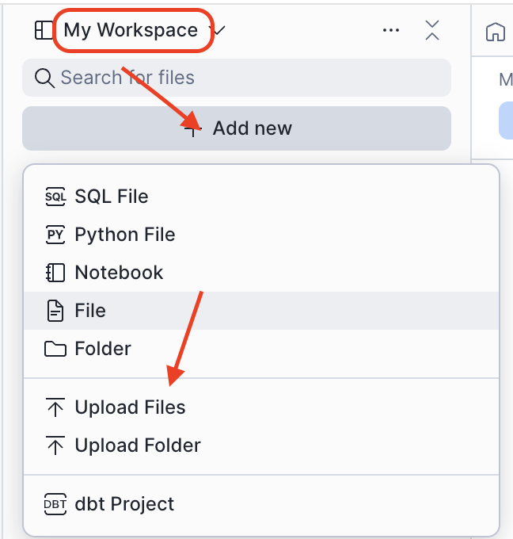
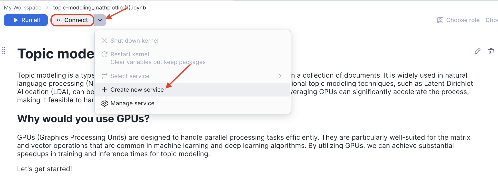
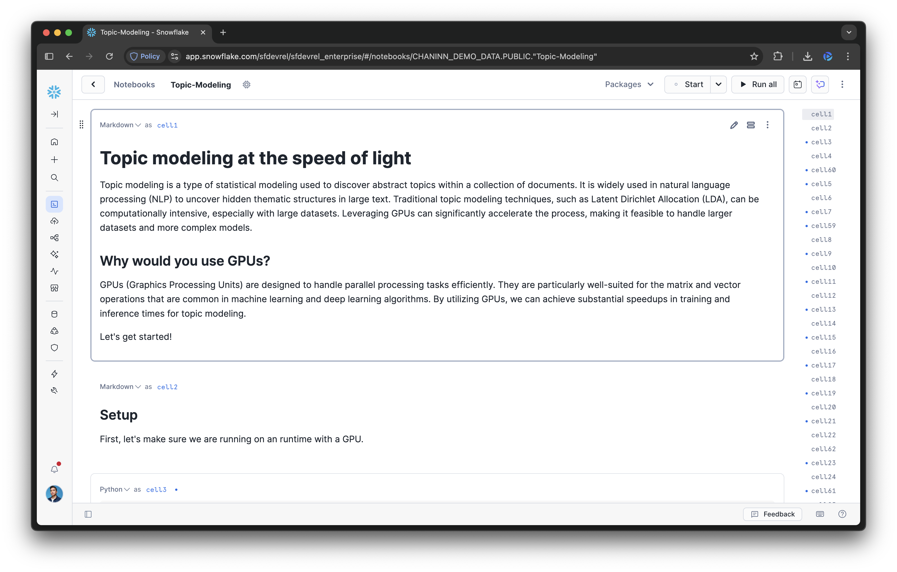

author: Chanin Nantasenamat, Vinay Sridhar, Lucy Zhu, Dureti Shemsi
id: accelerate-topic-modeling-with-gpus-in-snowflake-ml
summary: Accelerate topic modeling with GPU acceleration. NVIDIA's cuML and cuDF libraries are now in Snowflake ML for fast text analysis, document clustering, and content classification.
categories: snowflake-site:taxonomy/solution-center/certification/quickstart, snowflake-site:taxonomy/product/data-engineering, snowflake-site:taxonomy/snowflake-feature/snowflake-ml-functions, 
environments: web
language: en
status: Published
feedback link: https://github.com/Snowflake-Labs/sfguides/issues
tags: Snowflake, Machine Learning, Python, NVIDIA, GPU, scikit-learn, pandas


# Accelerate Topic Modeling with GPUs in Snowflake ML

<!-- ------------------------ -->
## Overview

As datasets continue to grow, GPU acceleration has become critical for machine learning workflows. To address this, [Snowflake ML](http://www.snowflake.com/ml) has integrated with NVIDIA's cuML and cuDF libraries to provide significant performance boosts for popular ML algorithms. These libraries are part of the [NVIDIA CUDA-X Data Science](https://developer.nvidia.com/topics/ai/data-science/cuda-x-data-science-libraries) ecosystem, an open-source suite of GPU-accelerated tools designed to speed up data processing pipelines. 

Snowflake ML is an integrated set of capabilities for end-to-end machine learning workflows directly on top of the governed data. Snowflake ML now integrates with NVIDIA's [cuML](https://rapids.ai/cuml-accel/) and [cuDF](https://rapids.ai/cudf-pandas/) libraries directly in the Container Runtime, accelerating ML algorithms like scikit-learn and pandas on GPUs. This powerful solution helps Snowflake customers tackle large datasets in areas like topic modeling, boosting efficiency for computationally demanding tasks.

This guide will walk you through how to leverage this native integration in Snowflake. You will learn how to accelerate model development cycles for libraries like scikit-learn and pandas with no code changes required, turning processing times from hours into minutes. We will explore a topic modeling example to demonstrate how these integrated libraries make it fast and seamless to work with large datasets in Snowflake ML.

### What You'll Learn
- How to set up a Snowflake Notebook to use GPU-enabled compute instances.
- How to enable NVIDIA's cuML and cuDF libraries to accelerate existing Python code.
- How to accelerate a topic modeling workflow using pandas, UMAP, and HDBSCAN on GPUs.

### What You'll Build
You will build and execute a topic modeling pipeline that processes 500,000 book reviews in under a minute using GPU-accelerated libraries.

### Prerequisites
- Access to a Snowflake account. Sign up for a [30-day free trial account](https://signup.snowflake.com/?utm_source=snowflake-devrel&utm_medium=developer-guides&utm_cta=developer-guides).
- Basic understanding of Python and machine learning concepts

<!-- ------------------------ -->
## Setup and Environment Configuration

This section covers environment setup, running the setup script, and uploading the notebook to Snowflake.

### Run the Setup Script

1. Open Snowflake and navigate to **Projects** > **Workspaces**
2. Create a new SQL file
3. Copy and paste the following setup script
4. Run the entire script as **ACCOUNTADMIN**

```sql
-- ============================================
-- SETUP FOR TOPIC MODELING NOTEBOOK
-- ============================================

-- Step 1: Create Network Rule (Allow All)
-- ============================================
CREATE OR REPLACE NETWORK RULE allow_all_rule
  MODE = EGRESS
  TYPE = HOST_PORT
  VALUE_LIST = ('0.0.0.0:443', '0.0.0.0:80');


-- Step 2: Create External Access Integration
-- ============================================
CREATE OR REPLACE EXTERNAL ACCESS INTEGRATION topic_modeling_eai
  ALLOWED_NETWORK_RULES = (allow_all_rule)
  ENABLED = TRUE;


-- Step 3: Create GPU Compute Pool
-- ============================================
CREATE COMPUTE POOL IF NOT EXISTS topic_modeling_gpu_pool
  MIN_NODES = 3
  MAX_NODES = 3
  INSTANCE_FAMILY = GPU_NV_M
  AUTO_RESUME = TRUE
  AUTO_SUSPEND_SECS = 600;


-- Step 4: Grant Permissions 
-- ============================================
GRANT USAGE ON COMPUTE POOL topic_modeling_gpu_pool TO ROLE ACCOUNTADMIN;
GRANT USAGE ON INTEGRATION topic_modeling_eai TO ROLE ACCOUNTADMIN;

-- ============================================
-- SETUP COMPLETE
-- ============================================
```

This will create:
- A network rule: `allow_all_rule`
- An external access integration: `topic_modeling_eai`
- A GPU compute pool: `topic_modeling_gpu_pool`

### Upload Notebook to Workspaces

Download the notebook file to your local machine:

1. Click this link: [0_start_here.ipynb](https://github.com/Snowflake-Labs/sfquickstarts/blob/master/site/sfguides/src/accelerate-topic-modeling-with-gpus-in-snowflake-ml/assets/notebooks/0_start_here.ipynb)
2. On the GitHub page, click the **Download raw file** button (download icon in the top right of the file preview)
3. Save the `.ipynb` file to your computer

Now upload the notebook to Snowflake Workspaces:

1. Navigate to **Projects** > **Workspaces** in Snowsight
2. Click **Add new** > **Upload Files**
3. Select the downloaded `0_start_here.ipynb` file from your computer



### Create Service

After uploading, open the notebook and create a service with GPU access:

1. Click on the uploaded notebook file to open it
2. Click the **Connect** button in the top toolbar
3. In the **Connect your notebook** dialog, configure the service:
   - Enter a **Service name** (e.g., `topic_modeling_service`)
   - Under **External access integrations**, select `TOPIC_MODELING_EAI`
   - Expand **Service settings** and configure:
     - **Compute type**: Select **GPU**
     - **Compute pool**: Select `TOPIC_MODELING_GPU_POOL`
4. Click **Create and connect**

<table>
<tr>
<td></td>
<td></td>
</tr>
</table>

The notebook will connect to the GPU container runtime and be ready to run.

### Enabling GPU Acceleration Libraries

With the latest update to the Snowflake ML Container Runtime, cuML and cuDF are fully integrated into the default GPU environment. To activate their drop-in acceleration capabilities for pandas, scikit-learn, UMAP, and HDBSCAN, you only need to import them and run their respective `install()` functions at the beginning of your notebook.

```python
# Import the libraries and enable the acceleration
import cudf; cudf.pandas.install()
import cuml; cuml.accel.install()
```

> IMPORTANT:
> - These two lines of code are the only changes needed to enable GPU acceleration for your existing pandas and scikit-learn code.
> - This "flips the switch," allowing the libraries to automatically handle the execution on GPUs.

<!-- ------------------------ -->
## Use Case: Large-Scale Topic Modeling

### The Challenge with Large-Scale Text Analysis
Topic modeling is a common text analysis technique, but it can be computationally expensive, especially with large datasets. The iterative nature of data science means that waiting hours for a single run is not practical. With NVIDIA CUDA-X libraries in Snowflake, you can achieve significant speed-ups with zero or near-zero code changes. This example demonstrates topic modeling on 500,000 book reviews, reducing the runtime from over 8 hours on a CPU to a few minutes on a GPU.

### Implementing the Accelerated Workflow
The topic modeling workflow consists of four main steps, all of which can now be accelerated on GPUs:
1.  **Read data**: Use pandas (accelerated by cuDF) to load the text data.
2.  **Create embeddings**: Convert text into numerical representations using SentenceTransformers, which automatically uses CUDA.
3.  **Reduce dimensionality**: Condense the high-dimensional embeddings using `umap-learn` (accelerated by cuML).
4.  **Cluster topics**: Identify topics by clustering the reduced embeddings with `hdbscan` (accelerated by cuML).

After running the setup commands from the previous section, the rest of your code remains unchanged.

```python
import cudf; cudf.pandas.install()
import cuml; cuml.accel.install()

import pandas as pd
from bertopic import BERTopic
from sentence_transformers import SentenceTransformer

# This pandas operation is now GPU-accelerated by cuDF
data = pd.read_json(data_path, lines=True)
docs = data["text"].tolist()

# This model automatically uses CUDA-enabled PyTorch
sentence_model = SentenceTransformer("all-MiniLM-L6-v2")
embeddings = sentence_model.encode(docs, batch_size=128, show_progress_bar=True)

# BERTopic uses UMAP and HDBSCAN, which are now GPU-accelerated by cuML
topic_model = BERTopic()
topics, probs = topic_model.fit_transform(docs, embeddings)
```

With just two initial lines of code, the entire topic modeling pipeline is accelerated, allowing for rapid iteration and analysis.

You can proceed to the remainder of the [topic modeling notebook](https://github.com/Snowflake-Labs/sfquickstarts/blob/master/site/sfguides/src/accelerate-topic-modeling-with-gpus-in-snowflake-ml/assets/notebooks/0_start_here.ipynb).



<!-- ------------------------ -->
## Conclusion and Resources

The integration of NVIDIA's cuML and cuDF libraries into Snowflake ML offers a powerful solution for accelerating large-scale machine learning workflows. By abstracting away the complexities of GPU infrastructure management, Snowflake enables data scientists to significantly boost performance for popular libraries like pandas and scikit-learn with no code changes. This enhancement dramatically speeds up iterative development in computationally demanding fields like topic modeling from hours to minutes.

### What You Learned
- How to configure a Snowflake Notebook for GPU-accelerated workloads.
- How to enable cuDF and cuML with just two lines of code to accelerate pandas and scikit-learn.
- How GPU acceleration can reduce runtimes from hours to minutes for topic modeling.

### Related Resources

Ready for more? After you complete this quickstart, you can try one of the following additional examples:
- [Intro Quickstart: Getting Started with Snowflake Notebook Container Runtime](https://www.snowflake.com/en/developers/guides/notebook-container-runtime/)
- [Scale Embeddings with Snowflake Notebooks on Container Runtime](https://www.snowflake.com/en/developers/guides/scale-embeddings-with-snowflake-notebooks-on-container-runtime/)
- [Getting Started with Running Distributed PyTorch Models on Snowflake](https://www.snowflake.com/en/developers/guides/getting-started-with-running-distributed-pytorch-models-on-snowflake/)
- [Defect Detection Using Distributed PyTorch With Snowflake Notebooks](https://www.snowflake.com/en/developers/guides/defect-detection-using-distributed-pytorch-with-snowflake-notebooks/)

Learn more about Snowflake ML:
- [Snowflake ML Docs](https://docs.snowflake.com/en/developer-guide/snowflake-ml/overview)
- [Snowflake ML Webpage](/en/data-cloud/snowflake-ml/)

