author: Matt
id: accelerate_your_graphql_development_on_snowflake_with_hasura
summary: Instantly Build GraphQL APIs on Your Snowflake Data with Hasura
categories: app-development,data-engineering,featured,getting-started,partner-integrations
environments: web
status: Published
feedback link: https://github.com/matt-hasura
tags: API, Getting Started, GraphQL, Hasura, Quick Start, REST

# Accelerate Your GraphQL Development on Snowflake with Hasura
<!-- ------------------------ -->
## Overview
Duration: 1

The Hasura GraphQL Engine is a blazingly-fast GraphQL server that allows developers to instantly build and deploy real-time GraphQL and REST APIs on top of any new or existing Snowflake database.

In this tutorial, you will learn how to use [Hasura Cloud](https://cloud.hasura.io/signup) to connect to your Snowflake database and query your data using GraphQL.


### Prerequisites
- A Snowflake account with an accessible warehouse and role to create a new database and schema

### What You’ll Learn
- How to create and configure an Hasura Cloud project
- How to connect Hasura Cloud to a Snowflake database
- How to query data in your Snowflake database using GraphQL

### What You’ll Need
- A valid email address to create an Hasura Cloud account

### What You’ll Build
- A GraphQL API for your Snowflake database


<!-- ------------------------ -->

## Create a Cloud Account
Duration: 2

> aside positive
> If you are an existing Hasura Cloud user, sign in to your account and proceed to **Create a Project**.

Navigate to <button>[Hasura Cloud](https://cloud.hasura.io/signup)</button> and click on the **Sign Up With Email** link.

  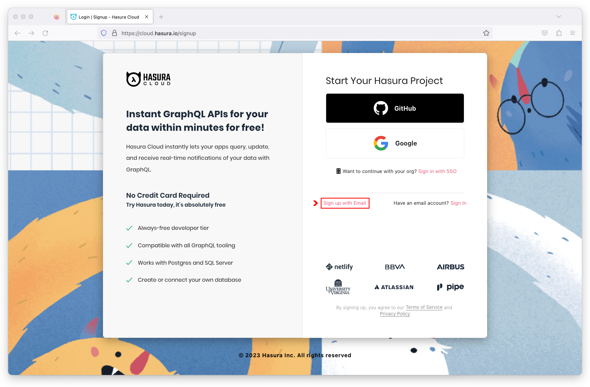

Complete the sign up form and click on the **Create My Account** button.

  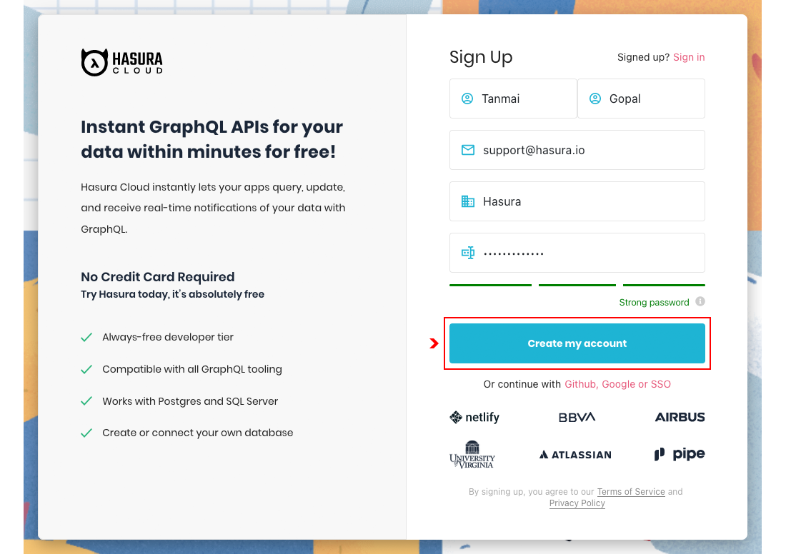

Check your inbox for a verifcation email to confirm your account. If you did not receive an email, scan your spam/junk folder or request another verification email.

<!-- ------------------------ -->

## Create a Project
Duration: 2

> aside positive
> If you are new to Hasura Cloud, a free tier project has automatically been deployed for you in *AWS us-west-1*. If you require a different region, continue with this step, otherwise proceed to **Configure a Project**.

> aside negative
> **Snowflake Beta Availability**
>
> The Hasura Snowflake connector is currently available in **beta** for all Hasura Cloud projects including free tier. When the Snowflake connector becomes generally available (GA), it will only be avilable for paid tier projects.

> aside negative
> **Snowflake Beta Regions**  
> 
> At this time, the Hasura Snowflake connector is only available in AWS regions.

In the Hasura Cloud dashboard, click on the **New Project** button.

  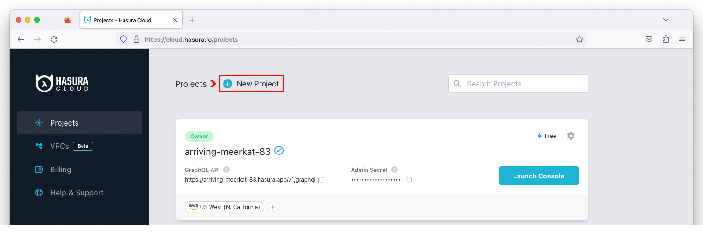

Select **Free** from the pricing plans, pick an **AWS** region from the drop-down menu, and click on the **Create Free Project** button to create a project.

  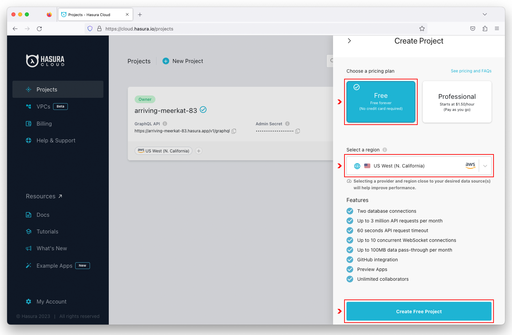


<!-- ------------------------ -->

## Configure a Project
Duration: 1

> aside positive
> Each Hasura Cloud project is automatically assigned a dynamic name and corresponding DNS hostname. If you want to change your project name, continue with this step, otherwise proced to **Create a Sample Database**.

> aside negative
> Users on free tier projects are not allowed to change regions. If you want to change regions without upgrading to a paid tier project, create a new project in the desired AWS region.

Click on the  icon for the project you want to configure.

  

Click on the  icon to the right of the `Name` field. Enter a globally unique project name and click on **Save**.

  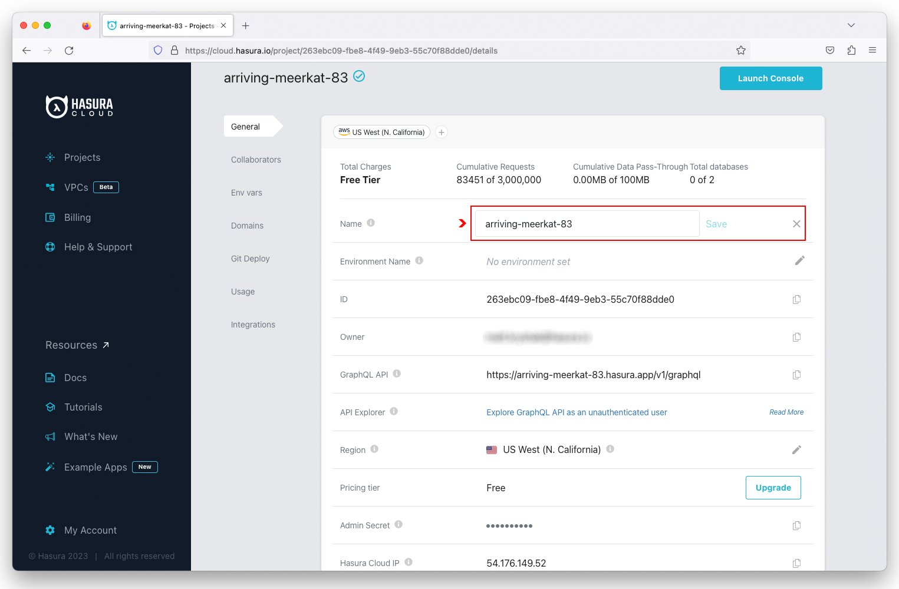

Additional information worth noting on the configuration page includes:

  - GraphQL API Endpoint
  - Admin Secret
  - Hasura Cloud IP Address


<!-- ------------------------ -->

## Create a Sample Database
Duration: 2

Sign in to your Snowflake account and create a new **SQL Worksheet**.

  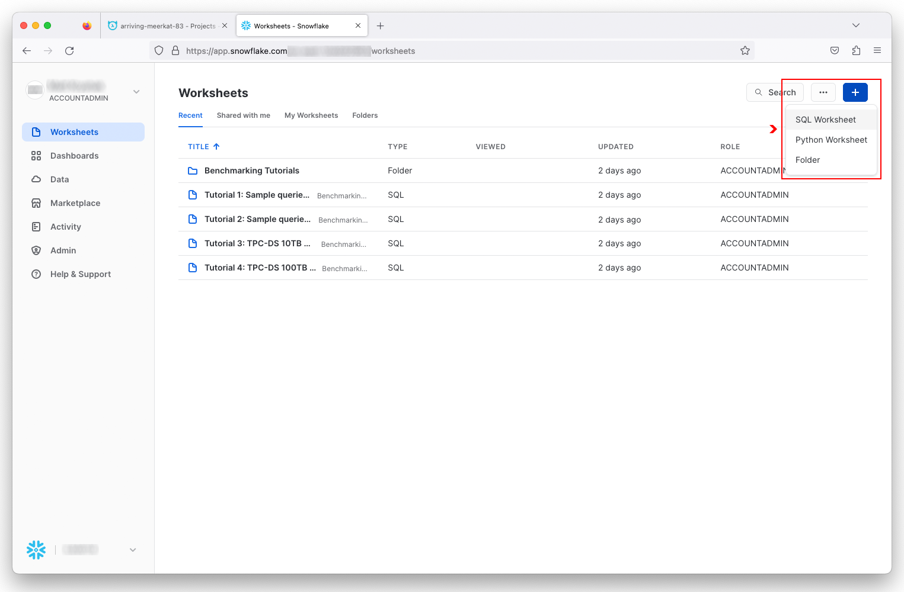

Copy the <button>[SQL Script](https://raw.githubusercontent.com/hasura/snowflake-quickstart/main/sql/sample_music_database.sql)</button> and paste it into the SQL Worksheet, then click on the **Run All** button to execute the script.

  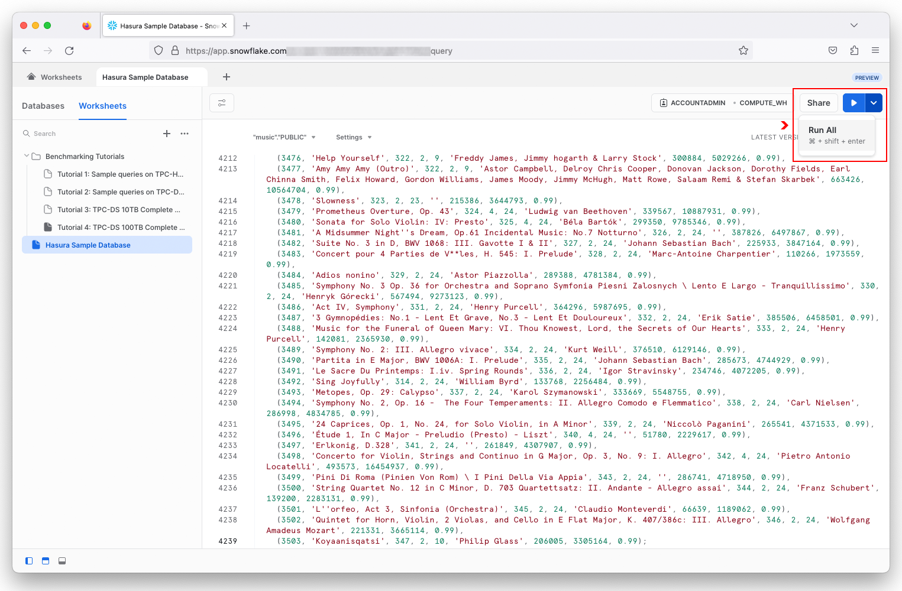

After the script has successfully executed, you will see a `MUSIC` database with the following tables:

  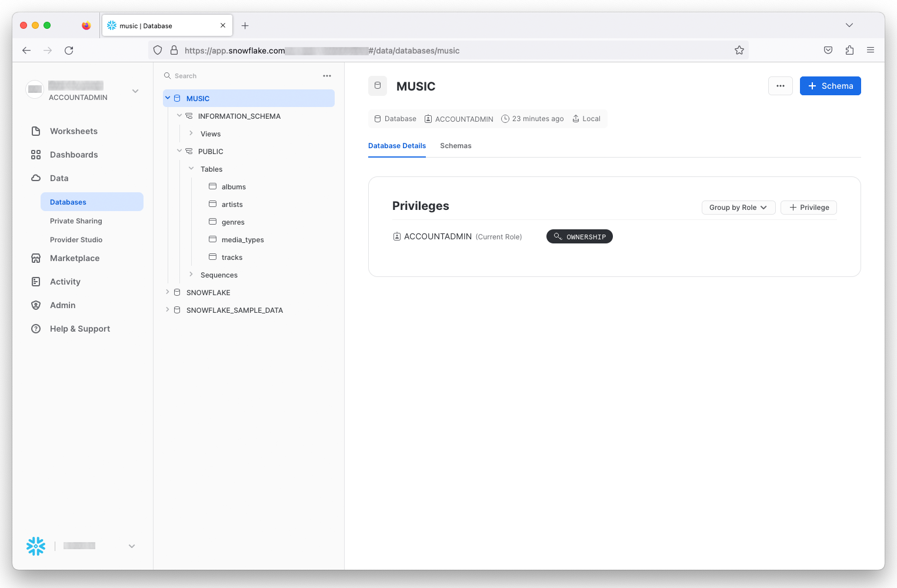


<!-- ------------------------ -->

## Connect Your Database
Duration: 3

In the Hasura Cloud dashboard, click on the **Launch Console** for your project.

  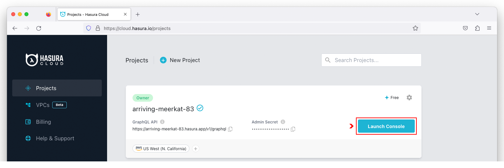

Click on **Data** in the navigation bar and select **Snowflake** as the database type. Click on the **Connect Existing Database** button to configure the Snowflake connector.

  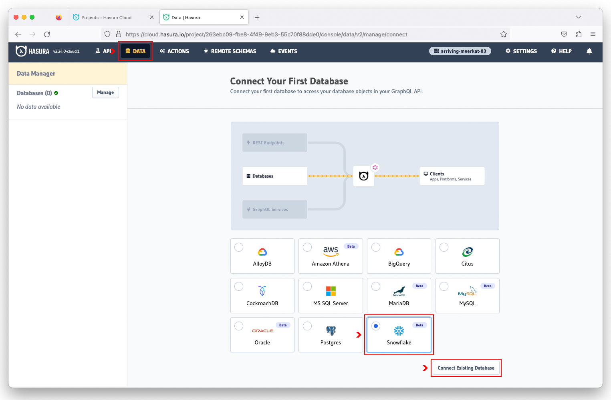

Enter **music** as the database name, followed by your JDBC connection string.

  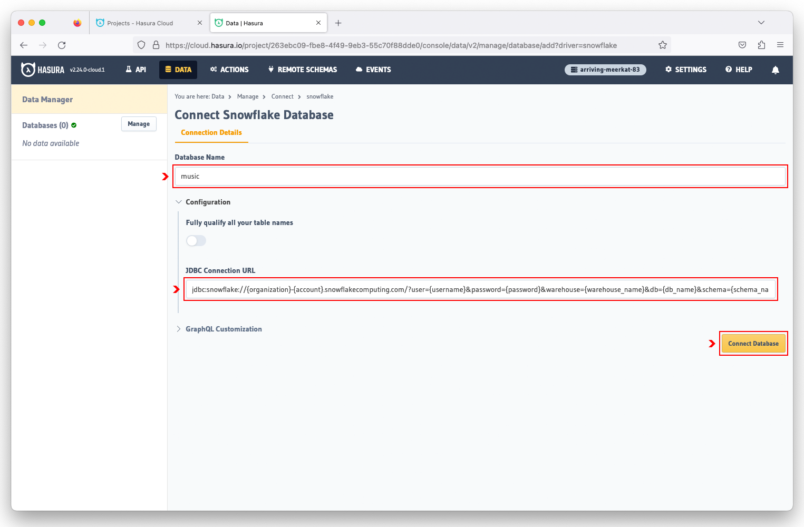

> aside negative
> Special characters in the JDBC connection string must be URL encoded.

The Snowflake JDBC connection string uses the following format:
```
Format:
  jdbc:snowflake://{organization}-{account}.snowflakecomputing.com/?user={username}&password={password}&warehouse={warehouse_name}&db={db_name}&schema={schema_name}

Example:
  jdbc:snowflake://RLTEPEF-LKR90823.snowflakecomputing.com/?user=hasura&password=Hasura%2123&warehouse=compute_wh&db=music&schema=public
```

> aside positive
> For more information on Snowflake's JDBC Driver Connection String, please visit the Hasura [documentation](https://docs.snowflake.com/developer-guide/jdbc/jdbc-configure#jdbc-driver-connection-string).


> aside positive
> **Using Environment Variables**
> 
> Setting the connection string as an environment viariable is a security best practice to prevent any secret information from being exposed in your instance's metadata. For more information on using an environment variable to connect to your Snowflake database, please visit the Hasura [documentation](https://docs.snowflake.com/developer-guide/jdbc/jdbc-configure#jdbc-driver-connection-string).


<!-- ------------------------ -->

## Create a GraphQL API
Duration: 3

On the left side of the Hasura Cloud console, click on the **music** database and select all of the tables. Click on the **Track Selected** button to enable Hasura to track all of the database tables and instantly create a GraphQL API.

  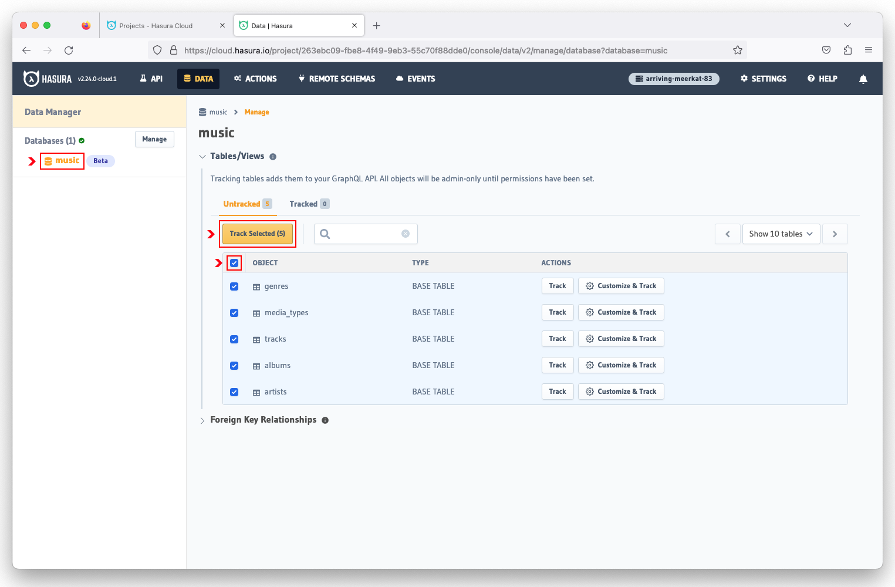

With the auto-generated GraphQL API, you can now query for non-related data.

  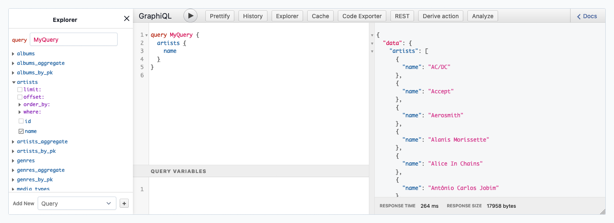

Click on the  to expand the `Foreign Key Relationships` and select all of the suggested relationships. Hasura automatically discovers table relationships by introspecting the schema. Click on the **Track Selected** button to re-generate the GraphQL API.

  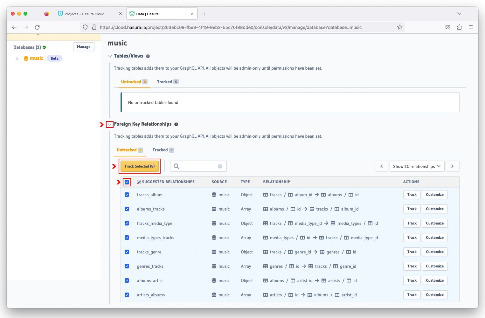

You are now able to query for all related data (i.e. nested query).

  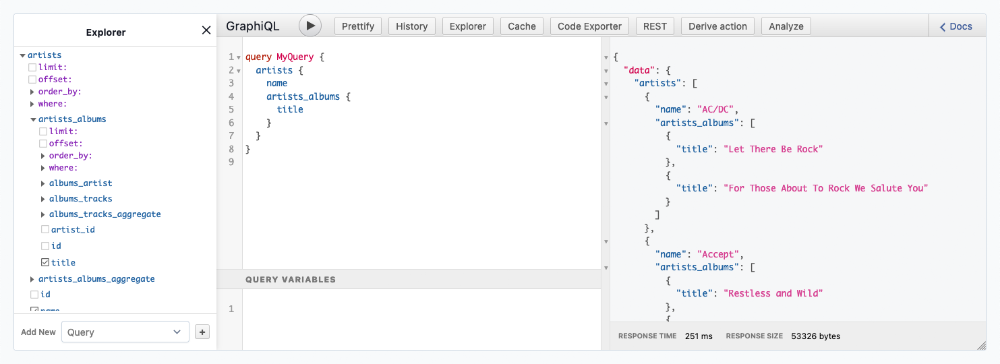


<!-- ------------------------ -->

## GraphQL Queries
Duration: 5

> aside negative
> Hasura support for Snowflake is currently limited to GraphQL read-only queries, relationships, and permissions.

Click on the **API** button in the navigation bar. In the GraphiQL Explorer, paste the **AllArtists** query to retrieve the `name` and `id` of all artists.

```graphql
query AllArtists {
  artists {
    name
    id
  }
}
```

Execute the query by clicking on the **Play** button. The results will be displayed in the box to the right of the query.

  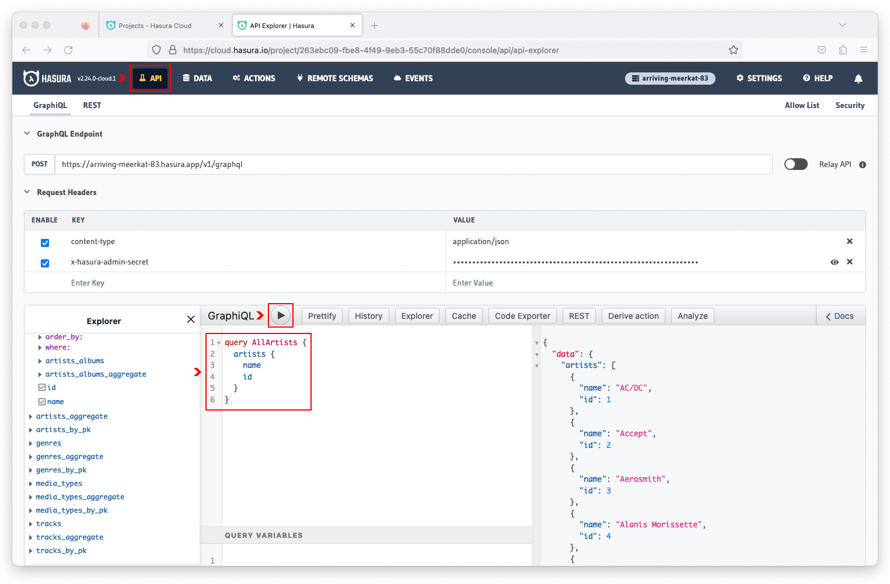
  
Now let's query for both artists and their respective albums. In the GraphiQL Explorer, paste the **AllArtistsAlbums** query and execute it.

```graphql
query AllArtistsAlbums {
  artists {
    name
    id
    artists_albums {
      title
      artist_id
    }
  }
}
```

This is a nested query that fetches artist and album information based on the related `id` of the artist and `artist_id` of the album.

  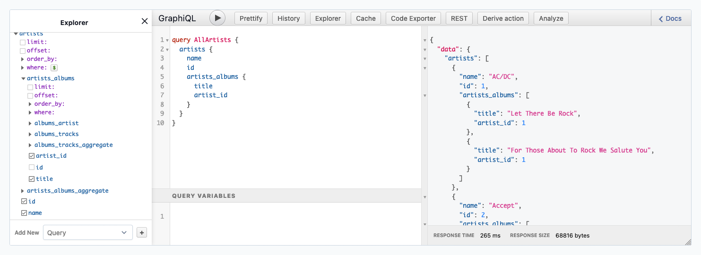

Using a variable, we can narrow the results for a specific artist. In the GraphiQL Explorer, paste the **ArtistAlbums** query that contains a filter using the `$artist` variable.

```graphql
query ArtistAlbums($artist: string!) {
  artists(where: {name: {_eq: $artist}}) {
    name
    artists_albums {
      title
    }
  }
}
```

In the Query Variables box, paste the JSON string to set the `$artist` variable to `Green Day`.
```json
{
  "artist": "Green Day"
}
```

Execute the query and now the results are filtered for albums belong to the artist `Green Day`.

  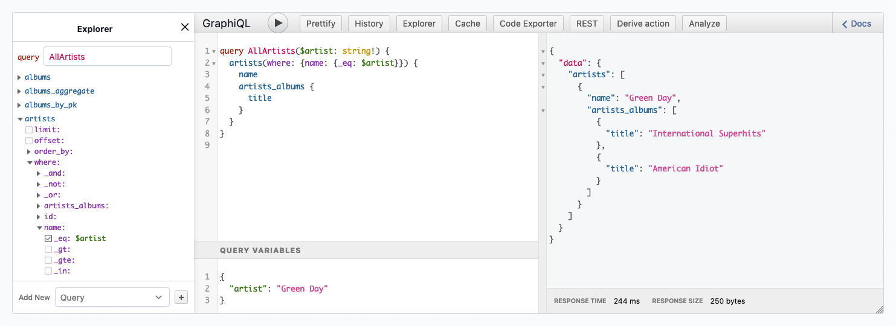

> aside positive
> For more information on GraphQL queries, please visit the Hasura documentation [website](https://hasura.io/docs/latest/queries/quickstart/).


<!-- ------------------------ -->

## Summary
Duration: 1

Congratulations! You've just deployed a GraphQL API for your Snowflake database in less than 20 minutes! And by doing so, you've discovered how easily Hasura can accelerate your application development on Snowflake by providing a fast way to create and deploy real-time GraphQL (and REST) APIs on top of your new or existing Snowflake databases. 

What we did not cover in this Quickstart is Hasura's robust and flexible authorization engine that enables fine-grained access controls for your Snowflake databases. This will be a topic of a future Quickstart.

Hasura requires minimal setup and configuration, making it an ideal solution for any developer who wants to quickly fetch Snowflake data in a uniform and consistent manner without having to be a database or SQL expert.

### What You've Learned
- How to connect Hasura to your Snowflake database with automatic schema introspection.
- How to use Hasura to instantly create a GraphQL API for your Snowflake data.
- How to execute GraphQL queries, including nested queries with variables.

### Related Resources
- [Instant Realtime GraphQL and REST APIs on Snowflake](https://hasura.io/blog/introducing-instant-graphql-apis-for-snowflake-cloud-data-platform/)
- [Get Started with Snowflake](https://hasura.io/docs/latest/databases/snowflake/getting-started/index/)
- [GraphQL Queries](https://hasura.io/docs/latest/queries/overview/)
- [Authorization](https://hasura.io/docs/latest/auth/authorization/index/)
- [RESTified Endpoints](https://hasura.io/docs/latest/restified/overview/)
- [GraphQL Federation](https://hasura.io/docs/latest/data-federation/overview/)