authors: Bobby Birstock, Amy Chen
id: accelerating_data_teams_with_snowflake_and_dbt_cloud_hands_on_lab
summary: Build a dbt project and data pipeline with dbt Cloud and Snowflake
categories: getting-started,data-engineering,partner-integrations
environments: web
status: Published 
feedback link: https://github.com/Snowflake-Labs/sfguides/issues
tags: Getting Started, Data Engineering, dbt, Data

# Accelerating Data Teams with Snowflake and dbt Cloud Hands On Lab
<!-- ------------------------ -->
## Overview 
Duration: 2

Modern businesses need modern data strategies built on platforms that support agility, growth, and operational efficiency.

[Snowflake](https://signup.snowflake.com/?utm_source=google&utm_medium=paidsearch&utm_content=go-eta-ld-free-trial&utm_term=c-g-snowflake-e&utm_campaign=na-en-Branded&_bt=470247374327&_bk=snowflake&_bm=e&_bn=g&_bg=64805047909&gclid=Cj0KCQjw18WKBhCUARIsAFiW7JwA-C_HmNQzG_OFKhM1Hn9vlW6EAs-9mveiMXychVbbK34lh4vGfHsaAv4NEALw_wcB&gclsrc=aw.ds) is the Data Cloud that enables you to build data-intensive applications without operational burden, so you can focus on data and analytics instead of infrastructure management.

[dbt](https://www.getdbt.com/) is a transformation workflow that lets teams quickly and collaboratively deploy analytics code following software engineering best practices like modularity, portability, CI/CD, and documentation. Now anyone who knows SQL can build production-grade data pipelines. It transforms data in the warehouse leveraging cloud data platforms like Snowflake.

In this Hands On Lab you will follow a step-by-step guide to using dbt with Snowflake, and see some of the benefits this tandem brings.

Let's get started.

### What You'll Use During the Lab

* A trial [Snowflake](https://signup.snowflake.com/) account with ACCOUNTADMIN access

* A [dbt Cloud](https://www.getdbt.com/signup/) account

### What You'll Learn

* How to build scalable data transformation pipelines using dbt & Snowflake

* How to establish data trust with stakeholders by incorporating key dbt testing capabilities

* How to scale Snowflake compute capabilities with the dbt workflow

* How to build lightweight charts and visualizations in Snowflake

### What You'll Build

* A set of data analytics pipelines for retail data leveraging dbt and Snowflake, making use of best practices like data quality tests and code promotion between environments

<!-- ------------------------ -->
## Architecture and Use Case Overview
Duration: 1

In this lab we’ll be transforming raw retail data into a consumable orders model that’s ready for visualization. We’ll be utilizing the TPC-H dataset that comes out of the box with your Snowflake account and transform it using some of dbt’s most powerful features. By the time we’re done you’ll have a fully functional dbt project with testing and documentation, dedicated development and production environments, and experience with the dbt git workflow.

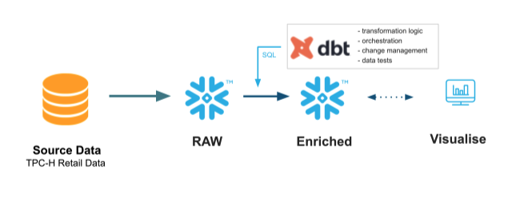

Here's a sneak peak of the model lineage that we'll be creating using dbt!

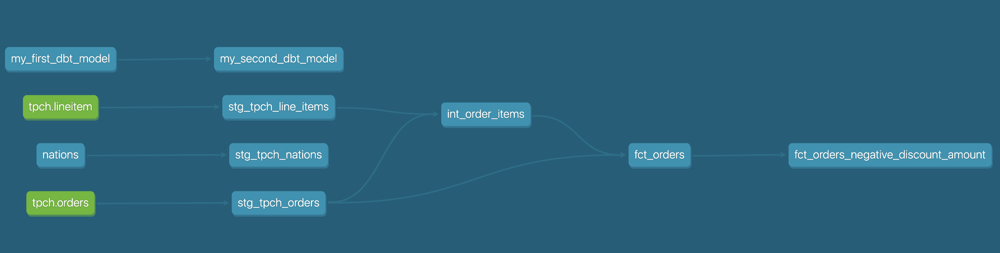

<!-- ------------------------ -->
## Let's Get Started With Snowflake
Duration: 5

To create a Snowflake trial account, follow [this link](https://signup.snowflake.com/) and fill out the form before clicking `Continue`. You’ll be asked to choose a cloud provider and for the purposes of this workshop any of them will do. After checking the box to agree to the terms, click `Get Started`. <br> <br> 
Once your account is created you’ll receive an email confirmation. Within that email, click the `Click to Activate` button and then create your login credentials. You should now be able to see your account! 


For a detailed Snowflake UI walkthrough, please refer [here](https://docs.snowflake.com/en/user-guide/ui-snowsight-gs.html#getting-started-with-snowsight). From here on out we’ll be using the new Snowflake UI (Snowsight) and any Snowflake specific directions you see will be for Snowsight. Feel free to use the Snowflake Classic UI as it won’t affect your dbt experience, but it may change the location of certain features within Snowflake.

The dataset we’ll be using for the workshop comes standard as part of your Snowflake trial. From the `Worksheets` tab click the blue `Worksheet` button in the upper right hand corner of the page to create a new worksheet. 

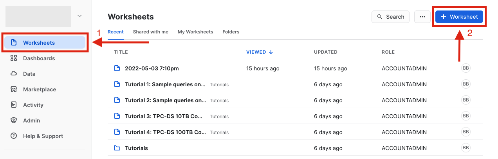

Once there, click `Databases` and you should see a database called `Snowflake_Sample_Data` in the list of objects.<br>


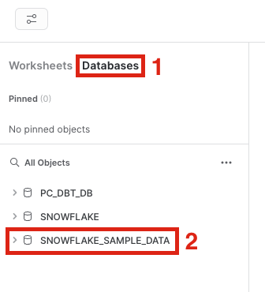<br>

    If you don’t see the database, you may have removed it from your account. To reinstate it, run the following command in your worksheet:

    ```sql
    create or replace database snowflake_sample_data from share sfc_samples.sample_data;
    ```

    You should now see the database as one of your database objects, with associated schemas within it.

Clicking the database name will reveal a schema dropdown, including the schema that we’ll be using for our source data, [TPCH_SF1](https://docs.snowflake.com/en/user-guide/sample-data-tpch.html).

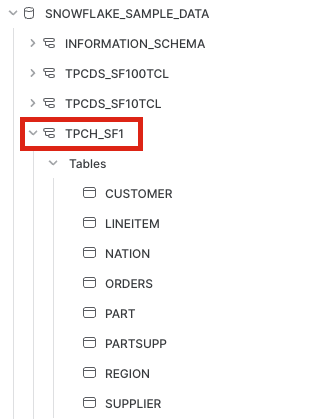

Let’s query one of the tables in the dataset to make sure that you’re able to access the data. Copy and paste the following code into your worksheet and run the query.

```
select *
    from snowflake_sample_data.tpch_sf1.orders
    limit 100; 
```

You should be able to see results, in which case we’re good to go. If you’re receiving an error, check to make sure that your query syntax is correct.
Great! Now it’s time to set up dbt Cloud.

<!-- ------------------------ -->
## Launching dbt Cloud via Partner Connect
Duration: 5


1. We are going to use [Snowflake Partner Connect](https://docs.snowflake.com/en/user-guide/ecosystem-partner-connect.html) to set up your dbt Cloud account and project. Using Partner Connect will allow you to create a complete dbt account with your [Snowflake connection](https://docs.getdbt.com/docs/dbt-cloud/cloud-configuring-dbt-cloud/connecting-your-database#connecting-to-snowflake), [managed repository](https://docs.getdbt.com/docs/dbt-cloud/cloud-configuring-dbt-cloud/cloud-using-a-managed-repository), [environments](https://docs.getdbt.com/docs/guides/managing-environments), and credentials with just a few clicks.

2. In the Snowflake UI, click on the home icon in the top left hand corner of the screen. To access Partner Connect, click on your user and then click `Partner Connect`.<br>

    <br>

    Check to make sure your role is set as the ACCOUNTADMIN role. If you're using the classic console, the Partner Connect button will be in the top bar just right of center.

3. Find the dbt tile by typing `dbt` into the `Search Partner Connect` search bar. Click on the dbt tile.

    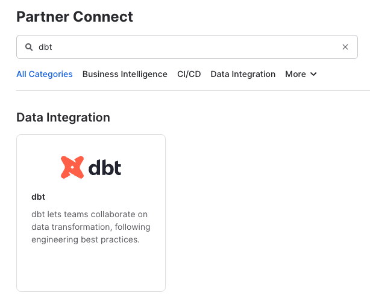

4. You should now see a popup that says `Connect to dbt` that contains all of the associated objects created by Partner Connect. Click on the `Optional Grant` dropdown menu and add `Snowflake_Sample_Data` in the text box. This will grant your new dbt user role access to the database. Once that’s entered, click `Connect`. This will create a dedicated dbt user, database, warehouse, and role for your dbt Cloud trial.

    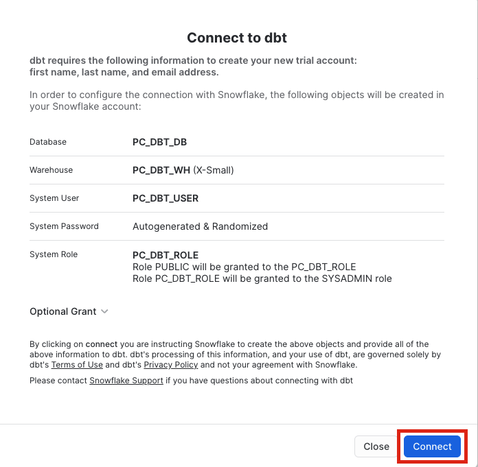

5. When you see the popup that says `Your partner account has been created`, click on `Activate`.

    

6. You should be redirected to a dbt Cloud registration page. Fill out the form and make sure to save the password somewhere for login in the future.

    

7. Click on `Complete Registration`. You should now be redirected to your dbt Cloud account, complete with a connection to your Snowflake account, a deployment and a development environment, as well as a sample job.

    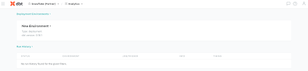

8. To help you version control your dbt project we have connected it to a [managed repository](https://docs.getdbt.com/docs/dbt-cloud/cloud-configuring-dbt-cloud/cloud-using-a-managed-repository), which means that dbt Labs will be hosting your repository for you. This will give you access to a git workflow without you having to create and host the repository yourself. You will not need to know git for this workshop; dbt Cloud will help guide you through the workflow. In the future, when you're developing your own project, feel free to use [your own repository](https://docs.getdbt.com/docs/dbt-cloud/cloud-configuring-dbt-cloud/cloud-installing-the-github-application). This will allow you to play with features like [Slim CI](https://docs.getdbt.com/docs/dbt-cloud/using-dbt-cloud/cloud-enabling-continuous-integration-with-github) builds after this workshop.

<!-- ------------------------ -->
## IDE Walkthrough
Duration: 7

1. Now that our dbt Cloud account is set up, let’s open up the IDE (Integrated Development Environment) and familiarize ourselves with some of the key product features. Click on the `Develop` button in the upper left hand corner of the screen.<br>

    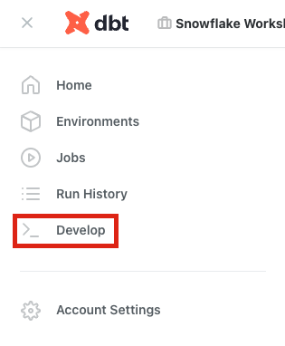

2. When the IDE is done loading, click on the green `initialize dbt project` button in the upper left hand corner of the screen. The initialization process creates a dbt project in the file tree on the left hand side of the screen with all of the core dbt files and folders needed.<br>

3. After the initialization is finished, you should see a new folder structure in the left hand sidebar. As we move through the workshop we’ll be sure to touch on a few key files and folders that we’ll work with to build out our project.

4. Next click `commit and push` in the upper left hand corner to commit the new files and folders from the initialize step. We always want our commit messages to be relevant to the work we’re committing, so be sure to provide a message like `initialize project` and click `Commit Changes` in the pop-up window.

5. [Committing](https://www.atlassian.com/git/tutorials/saving-changes/git-commit) your work here will save it to the managed git repository that was created during the Partner Connect signup. This initial commit is the only commit that will be made directly to our `main` branch and from here on out we’ll be doing all of our work on a development branch. This allows us to keep our development work separate from our production code. 

6. There are a couple of key features to point out about the IDE before we get to work. It is a text editor, a SQL runner, and a CLI with git version control all baked into one package. This allows you to focus on editing your SQL files, previewing the results with the SQL runner (it even runs Jinja!), and building models at the command line without having to move between different applications. The git workflow in dbt Cloud allows both git beginners and experts alike to be able to easily version control all of their work with a couple clicks.

    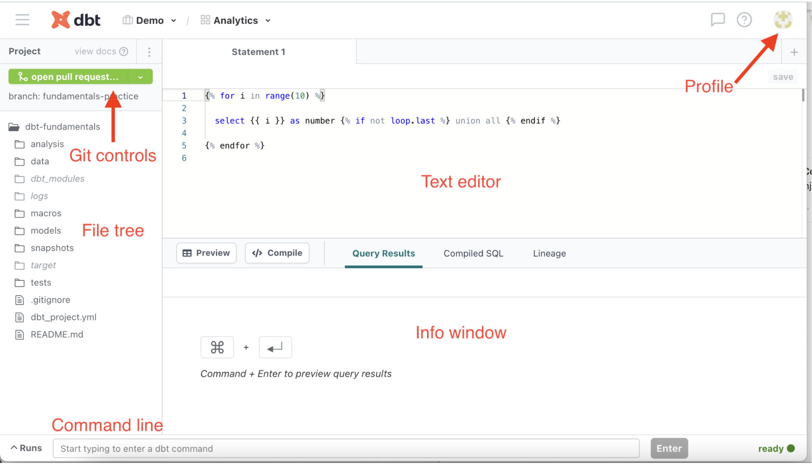

7. Let’s run our first dbt models! Two example models are included in your dbt project in the `models/examples` folder that we can use to illustrate how to run dbt at the command line.<br> 

    Type in `dbt run` into the command line at the bottom of the screen and hit `Enter` on your keyboard. When the run bar expands you’ll be able to see the results of the run, where you should see the run complete successfully.<br>

    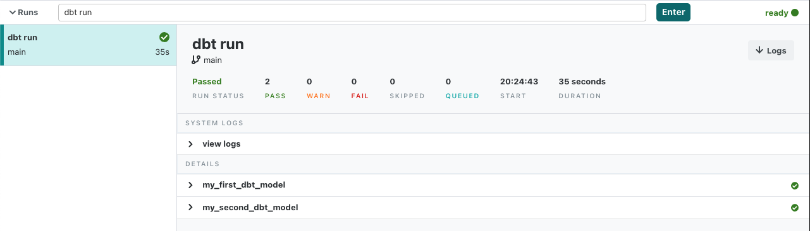

    The run results allow you to see the code that dbt compiles and sends to Snowflake for execution. To view the logs for this run, click one of the model tabs and then click `details`. If you scroll down a bit you’ll be able to see the compiled code and how dbt interacts with Snowflake. Given that this run took place in our development environment, the models were created in your development schema, structured as your first initial and last name.

    

8. Now let’s switch over to Snowflake to confirm that the objects were actually created. Click on the 3 dots above your database objects and then click `Refresh`. Expand the `PC_DBT_DB` database and you should see your development schema. Click on the schema, then click `tables` and `views`. Now you should be able to see `MY_FIRST_DBT_MODEL` as a table and `MY_SECOND_DBT_MODEL` as a view.

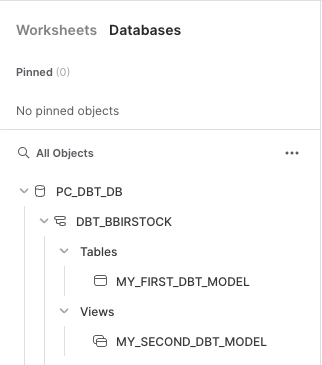

9. While we’re in our worksheet, we’re going to create a new warehouse that we’ll be using in our dbt project. Copy and paste the following series of commands and run them in order within your Snowflake worksheet. 

    ```
    use role accountadmin;

    create warehouse pc_dbt_wh_large with warehouse_size = large;

    grant all on warehouse pc_dbt_wh_large to role pc_dbt_role;
    ```

10. Great! We’re ready to move on to developing our dbt project.

<!-- ------------------------ -->
## Foundational Structure
Duration: 12


### Configuring the dbt_project.yml 

1. To get started with development for our project, we’ll need to create a new git branch for our work. Clicking on the green `create branch` button in the upper left hand corner of the screen will bring up a window to name your branch. We’ll call our branch `snowflake_workshop`. After entering in the name click `Submit`. 

2. The first piece of development we’ll do on the project is to update the `dbt_project.yml` file. This is the file that dbt looks for to recognize that the file directory we’re working in is a dbt project. 

    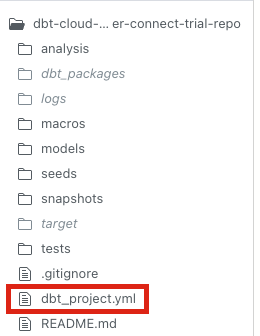<br>

    Click on the file to open it and replace all of the existing contents with the following code. When you’re done, save the file using the `save` button in the upper right hand corner of the screen. 

```yaml
name: 'snowflake_workshop'
version: '1.0.0'
config-version: 2

profile: 'default'

source-paths: ["models"]
analysis-paths: ["analysis"]
test-paths: ["tests"]
seed-paths: ["seeds"]
macro-paths: ["macros"]
snapshot-paths: ["snapshots"]

target-path: "target"  
clean-targets:         
    - "target"
    - "dbt_modules"

models:
  snowflake_workshop:
    staging:
      materialized: view
      snowflake_warehouse: pc_dbt_wh
    marts:
      materialized: table
      snowflake_warehouse: pc_dbt_wh_large
```
<br>
    The key configurations to point out in the file with relation to the work that we’re going to do are in the models section. Here we are defining configurations at the folder level that we want applied to all of the models within that folder. Specifically we are demonstrating:

* the `materialized` config, which tells dbt how to materialize models when compiling the code before it pushes it down to Snowflake, and 

* the `snowflake_warehouse` config, which specifies which Snowflake warehouse should be used when building models in Snowflake


[Materializations](https://docs.getdbt.com/docs/building-a-dbt-project/building-models/materializations) are strategies for persisting dbt models in a warehouse, with `tables` and `views` being the most commonly utilized types. By default, all dbt models are materialized as views and other materialization types can be configured in the `dbt_project.yml` file or in a model itself (we’re going to do both!). 

Based on the configuration in our `dbt_project.yml` file, dbt will materialize all of the models in the staging folder as views (not necessary because it is the default but included for example purposes) and all of the models in the marts folder as tables. dbt uses a hierarchical model for configurations where any model configuration overrides the project configuration. The benefit of using dbt materializations is when you execute a dbt model, dbt will use the right DDL associated with the materialization to create the model’s equivalent in the data warehouse, allowing for a bespoke creation flow so you can just focus on writing the select statement. 

Each dbt connection declares a default warehouse to use when building models in Snowflake. With the `snowflake_warehouse` config in our file, dbt will use the x-small `pc_dbt_wh` warehouse to build everything in the staging folder and the large `pc_dbt_wh_large` warehouse to build everything in the marts folder. This configuration allows us to scale up and scale down warehouse size based on the compute needs for different parts of our project.
 
Materializations and warehouses aren’t the only type of configurations you can apply at the project level, [check out this doc](https://docs.getdbt.com/reference/dbt_project.yml) to learn more about how you can apply configurations on your models, seeds, and even tests. 

### Folder Structure

dbt Labs has developed a [project structure guide](https://docs.getdbt.com/guides/best-practices/how-we-structure/1-guide-overview/) that contains a number of recommendations for how to build the folder structure for your project.  The folder structure we’ll be building in this lab follows this guidance and fits into the following categories mentioned in the guide:

* **Sources**: This is our TPC-H dataset and it will be defined in a source YAML file.

* **Staging models**: These models have a one-to-one relationship with their corresponding source and serve as the place for renaming, recasting, and generally performing light transformation that will be used consistently throughout the rest of your project.

* **Marts models**: Models that represent business processes and entities, abstracted from the data sources they are based on. Here is where we perform our major transformations.<br>

    By having a defined project structure (even if it’s not this exact one), you create a predictable file tree so there’s never guessing which folder a model should exist in. Let’s implement our folder structure to set the stage for model development. 

1. Because we have quite a few folders to create, we’re going to fast track this by using a shortcut to build multiple folders at the same time. 

* In your file tree take your cursor and hover over the `models` subdirectory, click the three dots that appear to the right of the folder name, then click `Create Folder`. We’re going to add two new folders to the file path, `staging` and `tpch` (in that order) by typing `staging/tpch` into the file path. Make sure you’re not including additional folder names and click `Create`. <br>

    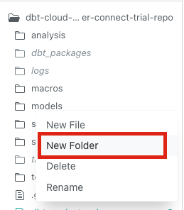<br>

    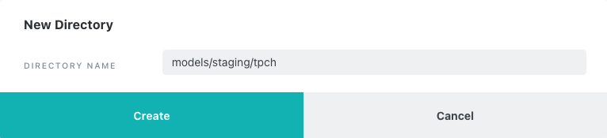

* If you click into your `models` directory now, you should see the new `staging` folder nested within `models` and the `tpch` folder nested within `staging`.

2. We are going to create our final two folders the same way. Take your cursor and hover over the `models` subdirectory, click the three dots that appear to the right of the folder name, then click `Create Folder`. This time in the popup window you’re going to enter in the following file path: `marts/core`. Here we’re creating a `marts` folder within `models` and then a `core` folder within `marts`. Your folder tree should look like this when it’s all said and done:<br>

    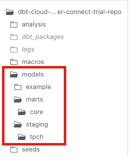

### Packages


The last thing we are going to do to set up your dbt project is implement packages. `dbt packages` are essentially dbt projects that you can bring into your project and use the code as if it was your own. Many packages are hosted on the [dbt Packages Hub](https://hub.getdbt.com/) and provide you with the ability to [generate reusable code](https://hub.getdbt.com/dbt-labs/codegen/latest/) for creating dbt sources and models, access a variety of helpful macros in jinja, and build [database constraints](https://hub.getdbt.com/snowflake-labs/dbt_constraints/latest/) for your Snowflake databases. 

Wait, what’s jinja? And what’s a macro? 

[Jinja](https://docs.getdbt.com/docs/building-a-dbt-project/jinja-macros#overview) is a pythonic templating language that you can use in dbt to do things that usually aren’t possible with SQL. Some examples include building control structures like `if` statements and `for` loops and abstracting code snippets into reusable macros so that you don’t repeat yourself (DRY). 

A [macro](https://docs.getdbt.com/docs/building-a-dbt-project/jinja-macros#macros) is a piece of jinja code that can be reused multiple times throughout a dbt project, like a function in other programming languages. Some of dbt’s most important functions like `source` and `ref` are also macros (we’ll cover these later in the lab). If you find yourself repeating a common SQL transformation throughout your models, chances are that there’s a macro in a package that will make your life easier. And if there isn’t, you can always build your own! 

We won’t be writing our own macros in this workshop but we do recommend checking out our [Using Jinja doc](https://docs.getdbt.com/tutorial/learning-more/using-jinja) to get leveled up. And remember when we declared warehouses specifically in our `dbt_project.yml` file? Well, there’s a macro to make that process dynamic and you can read more about it [here](https://github.com/Montreal-Analytics/dbt-snowflake-utils).

1. We’re going to add the `dbt_utils` package to our project. There are a couple of places throughout the workshop that we’ll be using macros from the `dbt_utils` package to help us write DRY code. To install the package, first create a new file within your home directory (same level as your `dbt_project.yml` file) and call it `packages.yml`. <br>

    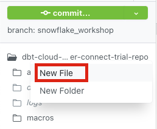<br>

    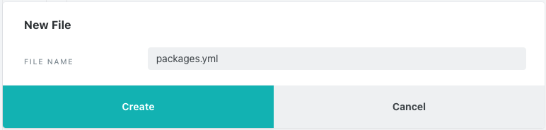

    Then copy and paste the following code into it and click save: 

```yaml
packages:
  - package: dbt-labs/dbt_utils
    version: 0.8.4
```

2. The last step to install the package is to run `dbt deps` at the command line, which tells dbt to install the packages defined in your `packages.yml` file. Type in `dbt deps` to the command line, click `Enter`, and you should see a success message there when it completes. 

3. Let’s take a second here to commit our work before moving on to the next step. Click the `Commit and push` button, write in a commit message like `setup structure for project`, and click `Commit Changes`.


<!-- ------------------------ -->

## Sources and Staging
Duration: 8

In this section, we are going to learn about sources and staging models. 

Sources in dbt allow you to name and describe raw data from your warehouse in your dbt project, allowing you to establish lineage from raw data to transformed models. When you define your sources in dbt, you are able to apply the same testing and documentation best practices to those sources in addition to your transformed models.   

Staging models have a 1:1 relationship with source tables. This is where you will perform simple transformations like renaming, recasting, or altering a column to a more usable format. Building staging models provides a clear foundation for your downstream modeling to build upon and allows for modular DRY (Don’t Repeat Yourself) modeling. If your logic ever changes, you have one model to update rather than potentially 5 with the same subquery.

### Create Sources

We’re going to be using the `orders` and `lineitem` tables from the `TPCH_SF1` schema for our transformations and we want to create those tables as sources in our project. Create a new file called `tpch_sources.yml` with the following file path: `models/staging/tpch/tpch_sources.yml`<br>

Then paste the following code into the file before saving it:

```yaml
version: 2
sources:
  - name: tpch
    description: source tpch data
    database: snowflake_sample_data
    schema: tpch_sf1
    tables:
      - name: orders
        description: main order tracking table
        
        columns:
          - name: o_orderkey
            description: SF*1,500,000 are sparsely populated
            tests: 
              - unique
              - not_null

      - name: lineitem
        description: main lineitem table
        columns:
          - name: l_orderkey
            description: Foreign Key to O_ORDERKEY
            tests:
              - relationships:
                  to: source('tpch', 'orders')
                  field: o_orderkey
```
<br>

In the file you can see that we’ve defined the database where the data is coming from (`snowflake_sample_data`), the schema (`tpch_sf1`), and both tables that we’ll be building with and transforming. Below each table name we have descriptions and tests that we’ve applied to our sources, which we’ll cover in more detail when we get to the testing and documentation section later on. 

### Create Staging Models

The next step is to set up the staging models for the two data sources. Given the one to one relationship between staging models and their corresponding source tables, we’ll build two staging models here. 

Let’s start with the orders table. Create a new file called `stg_tpch_orders.sql` with the following file path: `models/staging/tpch/stg_tpch_orders.sql` 
Then paste the following code into the file before saving it:

```sql
with source as (

    select * from {{ source('tpch', 'orders') }}

),

renamed as (

    select

        o_orderkey as order_key,
        o_custkey as customer_key,
        o_orderstatus as status_code,
        o_totalprice as total_price,
        o_orderdate as order_date,
        o_orderpriority as priority_code,
        o_clerk as clerk_name,
        o_shippriority as ship_priority,
        o_comment as comment

    from source

)

select * from renamed
```

All we’re doing here is pulling the source data into the model using the `source` function, which we’ll discuss in more detail in just a bit, and doing some column renaming. This serves as the starting point for all other models that need to reference this data so that naming stays consistent throughout your project. 

For the second model, we’ll create another file in the same folder called `stg_tpch_line_items.sql` with the following file path: `models/staging/tpch/stg_tpch_line_items.sql`

Then paste the following code into it before saving the file:

```sql
with source as (

    select * from {{ source('tpch', 'lineitem') }}

),

renamed as (

    select
    
        {{ dbt_utils.surrogate_key(
            ['l_orderkey', 
            'l_linenumber']) }}
                as order_item_key,
        l_orderkey as order_key,
        l_partkey as part_key,
        l_suppkey as supplier_key,
        l_linenumber as line_number,
        l_quantity as quantity,
        l_extendedprice as extended_price,
        l_discount as discount_percentage,
        l_tax as tax_rate,
        l_returnflag as return_flag,
        l_linestatus as status_code,
        l_shipdate as ship_date,
        l_commitdate as commit_date,
        l_receiptdate as receipt_date,
        l_shipinstruct as ship_instructions,
        l_shipmode as ship_mode,
        l_comment as comment

    from source

)

select * from renamed
```

Here we have renaming similar to what we did in the first staging model, as well as the addition of a new column using the `dbt_utils` package. `dbt_utils.surrogate_key` creates a hashed surrogate key that we call `order_item_key` using the columns listed in the macro. Implementing this surrogate key gives us a unique column that we can use to easily test for uniqueness later on in the lab. You can find more information about how the surrogate key macro works [here](https://github.com/dbt-labs/dbt-utils#surrogate_key-source).

### The Source Function

Let’s take a second to discuss the [source function](https://docs.getdbt.com/docs/building-a-dbt-project/using-sources) we’re using in the first cte of each of our staging models to refer to our raw data sources. 

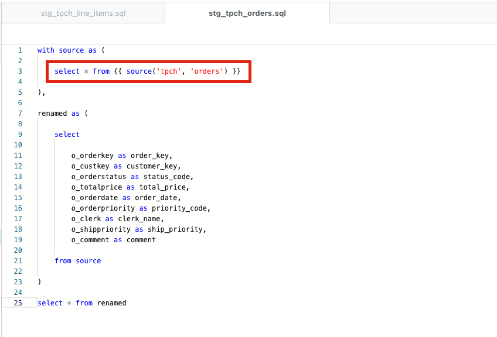

There are a number of reasons why the source function is used instead of a hardcoded database reference, but one reason to highlight here is that it creates a dependency between our source database object and our staging models. This is going to be really important when we take a look at our data lineage later on in the workshop. Defining sources and referring to them with the source function also allows you to test and document those sources as you can with any other model in your project that you build on top of your sources. Also, if your source changes database or schema, you only have to update it in your `tpch_sources.yml` file rather than updating all of the models it might be used in.

### Build Staging Models

Now that the staging models are built and saved, it’s time to create the models in our development schema in Snowflake. To do this we’re going to pass the `dbt run` command at the command line to run all of the models in our project, which includes the two new staging models and the existing example models. 

Your run should complete successfully and you should see green checkmarks next to all of your models in the run results.

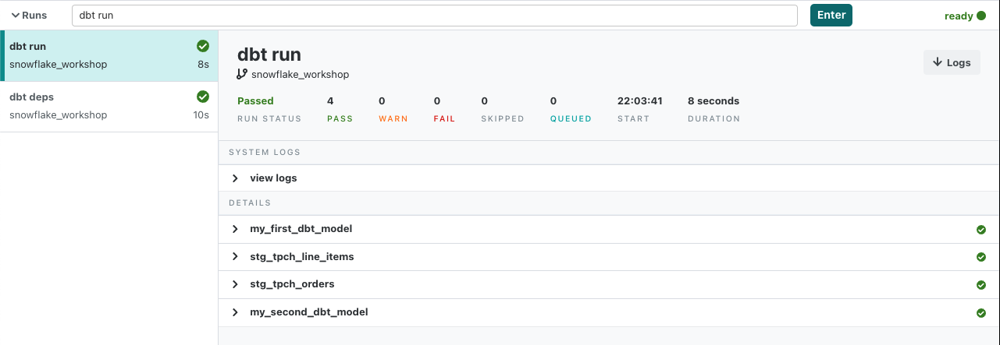

An important concept to note here is that when you rerun the example models the output will be exactly the same as it was after the first run. This is an example of an [idempotent](https://docs.getdbt.com/terms/idempotent) process, which means that the output of the process is the same after each execution of the process, no matter how many times the process is executed. Similar to the example models, if you were to rerun the staging models we just built, the output would be the same as the first run. One of the key tenets of dbt is to maintain idempotent workflows.

Let’s take a quick look in Snowflake, refresh database objects, open our development schema, and confirm that the new models are there. If you can see them then we’re good to go! 

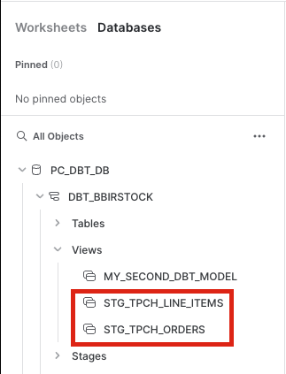

Before we move onto the next section be sure to commit your new models to your git branch. Click the `Commit and push` button and give your commit a message like `sources and staging` before moving on. 

<!-- ------------------------ -->

## Seeds and Incremental Materialization
Duration: 15

Seeds and incremental models are both key dbt features that we’re going to bring together to create an incremental staging model. 

[Seeds](https://docs.getdbt.com/docs/building-a-dbt-project/seeds) are CSV files in your dbt project and are best used for smaller, static datasets that rarely change. By uploading a CSV file as a seed with dbt, you’re able to apply the same best practices to your CSV as you would with your other models, such as version control, testing, and documentation. Seeds are great for things like a list of mappings of country codes or a list of employee user ids to exclude from a particular model. Here we’ll be creating a seed with country names/regions that orders are taking place in and we’ll use the `dbt seed` command to have dbt load the seed into Snowflake for us.

[Incremental models](https://docs.getdbt.com/docs/building-a-dbt-project/building-models/configuring-incremental-models) are great for large datasets where you want to limit the amount of data that needs to be transformed since the last time dbt ran. They allow you to maintain idempotency while improving warehouse performance and reducing compute costs. The way they work is that the model is built as a table in Snowflake. The first time a model runs, the table is built by transforming all of the rows in the query. On subsequent runs, dbt will transform only the rows that you tell dbt to filter for, either based on a timestamp or unique key. In Snowflake, we have two methods to insert records into the target table (i.e. the table built in the initial run): [merge or delete+insert](https://docs.getdbt.com/reference/resource-configs/snowflake-configs#merge-behavior-incremental-models). The merge method is the default method and the one we will demonstrate here. 

Although our TPC-H dataset isn’t changing and in this case is rather small, we will make one of our models incremental to demonstrate how this core functionality works, providing you a clear flow without the complexity introduced with much larger datasets. We are going to first build the seed, which will allow us to reference that seed like any other dbt model. Then, we’ll build an incremental model that references the seed and we will have dbt build the incremental model completely to reflect the original state (version 1) of the seed. Next, we’re going to update the seed and rebuild it to reflect the most current state (version 2) of the seed. And finally we’ll rerun the incremental model on version 2 of the seed, which will only run the specific changes we’ve made to the seed and fully demonstrate the incremental materialization strategy. 

1. Let’s start with the seed. We’re going to copy and paste the seed data into a new file in the `seeds` folder. First let’s create a file in that folder called `nations.csv` with the following file path: `seeds/nations.csv`

2. Next, copy and paste the following data into the file before clicking save:

    ```
    N_NATIONKEY,	N_NAME,	N_REGIONKEY,	LAST_UPDATED_DATE
    0,	ALGERIA,	0,	1998-08-02
    1,	ARGENTINA,	1,	1998-08-02
    2,	BRAZIL,	1,	1998-08-02
    3,	CANADA,	1,	1998-08-02
    4,	EGYPT,	4,	1998-08-02
    5,	ETHIOPIA,	0,	1998-08-02
    6,	FRANCE,	3,	1998-08-02
    7,	GERMANY,	3,	1998-08-02
    8,	INDIA,	2,	1998-08-02
    9,	INDONESIA,	2,	1998-08-02
    10,	IRAN,	4,	1998-08-02
    11,	IRAQ,	4,	1998-08-02
    12,	JAPAN,	2,	1998-08-02
    13,	JORDAN,	4,	1998-08-02
    14,	KENYA,	0,	1998-08-02
    15,	MOROCCO,	0,	1998-08-02
    16,	MOZAMBIQUE,	0,	1998-08-02
    17,	PERU,	1,	1998-08-02
    18,	CHINA,	2,	1998-08-02
    19,	ROMANIA,	3,	1998-08-02
    20,	SAUDI ARABIA,	4,	1998-08-02
    21,	VIETNAM,	2,	1998-08-02
    22,	UNITED KINGDOM,	3,	1998-08-02
    23,	UNITED STATES,	1,	1998-08-02
    ```

    As mentioned above, the data here is a list of countries and their region where we have associated orders. This type of data fits our use case for seeds perfectly because the data changes infrequently and doesn’t require consistent updating like our other models. 

3. Let’s run our seed to build our initial `nations` table. In the command line write `dbt seed` and click `Enter`. 

    The seed command prompts Snowflake to build a table with all of the data that we’ve provided in the CSV file and to create it in our default schema because we have not specified that it should be built elsewhere. 

    Once the seed successfully builds, pop over to your Snowflake account and refresh your database objects. When you open your development schema and look at the tables in it, you should now see the `nations` table. 

    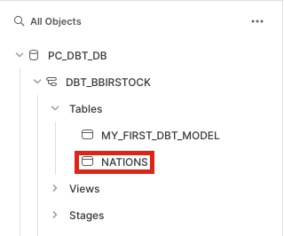<br>

    To confirm that the data in the table matches the CSV, run the following command and do a quick check of the output:

    ```
    select *
      from pc_dbt_db.<your_dev_schema>.nations
    ```

    Be sure to update the query with your personal development schema accordingly so that it runs successfully.

4. We could just leave it there with the table created by our seed, but we just got word from our sales team that we’re going to need to make some changes. Specifically, we’re starting to sell in more countries and they’d like to update the `region_key` column to better align with the countries we’re currently selling in. So, we’re going to build an incremental model to show how dbt makes it easy to incrementally add and update data in an existing model. 

5. Let’s create our incremental model. Create a new file called `stg_tpch_nations.sql` with the following file path: `models/staging/tpch/stg_tpch_nations.sql`<br>

    Then paste the following code into it before clicking save:

    ```
    {{
        config(
            materialized='incremental',
            unique_key='nation_key'
        )
    }}
    
    with source as (
    
        select * from {{ ref('nations') }}
    
    ),
    
    renamed as (
    
        select
        
            n_nationkey as nation_key,
            n_name as name,
            n_regionkey as region_key,
            last_updated_date as last_updated_date
    
        from source
    
    )
    
    select * from renamed
    
    
    
      -- this filter will only be applied on an incremental run
      where last_updated_date > (select max(last_updated_date) from {{ this }})
    
    
    ```

6. Before we dive into how this model is set up, let’s run the model so that we can see the output details alongside the model structure. Instead of running all our models, let’s do a `dbt run` on this model only. To do so, we’ll add some extra syntax to our command so that it looks like this: `dbt run --select stg_tpch_nations`. The `--select` argument tells dbt to specifically run the model or path that we provide after the argument, in this case our `stg_tpch_nations` model. <br><br>

    Once it’s complete, click on the model name in the run window, then click `details`, and then scroll down to be able to see the specifics about what query was run in Snowflake during this first go round. <br><br>

    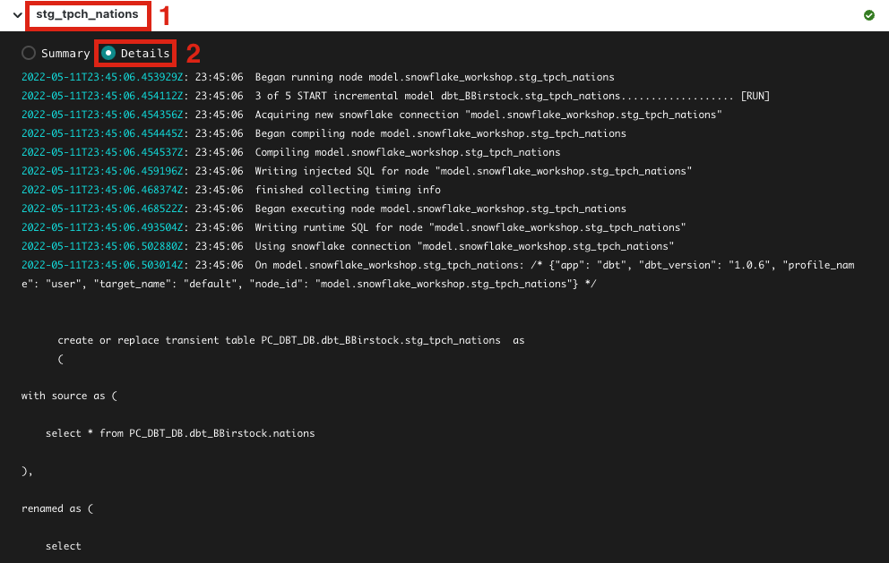<br><br>

    One of the first things to notice in the results is that dbt is running this model as an incremental, as shown by the second line: <br><br>

    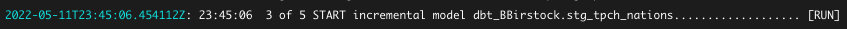<br><br>

    If we look back at the code, we’ll notice that the config block at the top of the model applies the defined configs to this model only and the first thing we’re saying is that we want to materialize it as an incremental model. However, the DDL ran as a regular dbt table materialization. This is because the first time an incremental model is executed, there is no existing database object in Snowflake so it needs to create the table first. We will see the model executed as a true incremental run when we run the model again.

    That same config block also defines the unique key of the model as `nation_key`. Defining a unique key means that when we run this model incrementally, the unique key will be used to determine if there are updates to individual rows and if there are, it will update those rows in addition to appending any new rows to the end of the model. By extension, using a unique key to identify rows for updates will prevent duplicates from being created.

    The rest of the model in this run is very straightforward. dbt is creating the model as a table and we are selecting everything from the `nations` seed that we uploaded, performing some light renaming, and returning those values. <br><br>

    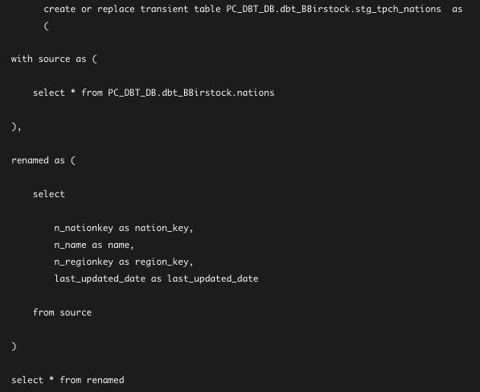<br><br>

    While that’s it for our run details, our code also contains an `is_incremental` macro at the bottom of the query. The macro is set to run on any incremental run of the model based on the specific core conditionals. Given that this first run of the incremental model is not an incremental run, `is_incremental = false` and dbt does not compile the `where` clause defined within the macro, which is confirmed by our run details. For our next run, `is_incremental` will be true, the macro will be compiled, and we’ll be able to see the `where` clause in action.
      

7. Now we’re ready to update our seed to meet the needs of our sales team. Let’s open up our seed file again and delete the existing contents. Once that’s done, copy and paste the following into the file before clicking save: 

    ```
    N_NATIONKEY,	N_NAME,	N_REGIONKEY,	LAST_UPDATED_DATE
    0,	ALGERIA,	0,	1998-08-02
    1,	ARGENTINA,	1,	1998-08-02
    2,	BRAZIL,	1,	1998-08-02
    3,	CANADA,	5,	2022-05-09
    4,	EGYPT,	4,	1998-08-02
    5,	ETHIOPIA,	0,	1998-08-02
    6,	FRANCE,	3,	1998-08-02
    7,	GERMANY,	3,	1998-08-02
    8,	INDIA,	2,	1998-08-02
    9,	INDONESIA,	2,	1998-08-02
    10,	IRAN,	4,	1998-08-02
    11,	IRAQ,	4,	1998-08-02
    12,	JAPAN,	2,	1998-08-02
    13,	JORDAN,	4,	1998-08-02
    14,	KENYA,	0,	1998-08-02
    15,	MOROCCO,	0,	1998-08-02
    16,	MOZAMBIQUE,	0,	1998-08-02
    17,	PERU,	1,	1998-08-02
    18,	CHINA,	2,	1998-08-02
    19,	ROMANIA,	3,	1998-08-02
    20,	SAUDI ARABIA,	4,	1998-08-02
    21,	VIETNAM,	2,	1998-08-02
    22,	UNITED KINGDOM,	3,	1998-08-02
    23,	UNITED STATES,	5,	2022-05-09
    24,	MEXICO,	5,	2022-05-09
    25,	AUSTRALIA,	2,	2022-05-09
    26,	NEW ZEALAND,	2,	2022-05-09
    27,	SOUTH KOREA,	2,	2022-05-09
    28,	BELGIUM,	3,	2022-05-09
    29,	SWEDEN,	3,	2022-05-09
    30,	SPAIN,	3,	2022-05-09
    ```

    There are a couple of updates to discuss here about our seed file. The first is that the sales team requested that countries in North America have their own `region_key`, which is designated as region 5. Canada and the US were existing countries in our seed and their regions have been updated accordingly. There are also a handful of new countries added to the list and their regions are updated and current. Finally, for all new and updated rows the `last_updated_date` was updated to reflect the changes (only took a couple of years to get things updated :) ). 

8. Let’s recreate our seed with the new contents by running `dbt seed` again at the command line. Once it completes, let’s use the dbt Cloud IDE to check the results. Within the IDE, click the plus button in the upper right corner to open a new tab, then copy and paste the following command into the new tab before clicking `Preview`: 

   ```
   select *
     from pc_dbt_db.<your_dev_schema>.nations
   ```

    Again, be sure to update the query with your personal development schema accordingly so that it runs successfully. The results in the preview window are the same results you would see if running the query in Snowflake and provides a convenient way to check your data without having to switch back and forth between applications.

9. Now we’re ready for the update to our incremental model with the new seed loaded. From here all we need to do is rerun the incremental model using the same command we used before: `dbt run --select stg_tpch_nations`. When it finishes, let’s open up the details of the model run again to take a look under the hood and see exactly what’s happening on this incremental run.

    The first thing to notice is that instead of creating a table to start, dbt compiles the code necessary to create a temporary table with the contents of our model *including* the where clause in the `is_incremental` macro. The where clause is filtering rows based on the `last_updated_date` and it will only include records where the `last_updated_date` is greater than the max date in the current results of the model. All of our new and updated rows with a `last_updated_date = 2022-05-09` are returned and stored in our temp table at this stage in the process.<br><br>

    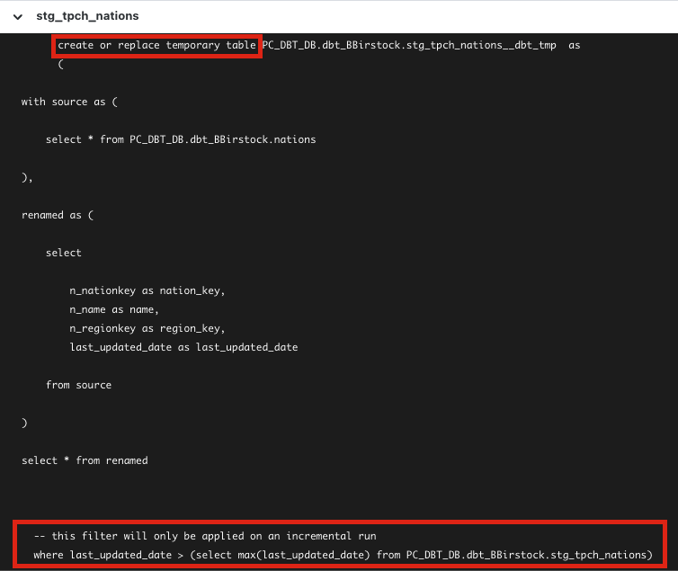<br><br>

    The next piece of compiled code is a `merge` statement that merges the results of the temp table with the existing `stg_tpch_nations` table in your warehouse, using the `nation_key` as the uniqueness constraint to join on. It defines the existing `stg_tpch_nations` table as the target table and the temp table created in the first part of the process as the source table to join with the target table. <br><br>

    To tackle the update vs. insert question with our modified and new records, dbt compiles the code for the `matchedClause` for updates and the `notMatchedClause` for inserts. For all of the rows where there is a match between the `nation_key` in the temp table and the target table, the `matchedClause` is used to update that row with all of the column values in the temp table. <br><br>

    For all of the rows where the `nation_key` in the temp table doesn’t exist yet in the target table, `notMatchedClause` is used to insert those rows into the target table. <br><br>

    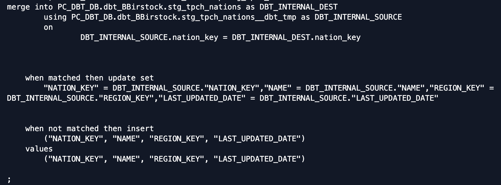<br><br>

10. And that does it for our incremental model and associated seed. This example is a textbook use case of how you want to utilize seeds with dbt, as we had a small list stored in a CSV that changed *very* infrequently. 

    We also showed how dbt abstracts away the complex DDL to create an incremental model and standardized it in an approachable manner. Even though incremental models are best applied to very large datasets that don’t require rebuilding the entire result set during each run, we were able to dive into the nitty gritty details with this example. It should be noted that on Snowflake, there are two standard incremental methods with merge being the default and [delete+insert](https://docs.getdbt.com/reference/resource-configs/snowflake-configs#merge-behavior-incremental-models) as an alternative option.  

    Last thing before we move on is to commit our work. Click the `Commit and push` button and give your commit a message like `seed and incremental model` before moving on. 

<!-- ------------------------ -->

## Transformed Models
Duration: 8

Now that we have our staging models built we’re able to start transforming our data to meet our modeling needs. The plan here is to build two transformed models: one is an intermediate model that performs new line items calculations and the other is a fact model that aggregates the new line items calculations back at the order level. The final fact model is what we will use to [build a chart ](https://docs.snowflake.com/en/user-guide/ui-snowsight-dashboards.html)[in Snowsight](https://docs.snowflake.com/en/user-guide/ui-snowsight-dashboards.html).

### Create Marts Models

Let’s start by creating a new file called `int_order_items.sql` with the following file path: `models/marts/core/int_order_items.sql` 

Then copy and paste the following code block into the new model and click save:

```sql
with orders as (
    
    select * from {{ ref('stg_tpch_orders') }}

),

line_item as (

    select * from {{ ref('stg_tpch_line_items') }}

)
select 

    line_item.order_item_key,
    orders.order_key,
    orders.customer_key,
    orders.order_date,
    orders.status_code as order_status_code,
    line_item.part_key,
    line_item.supplier_key,
    line_item.return_flag,
    line_item.line_number,
    line_item.status_code as order_item_status_code,
    line_item.ship_date,
    line_item.commit_date,
    line_item.receipt_date,
    line_item.ship_mode,
    line_item.extended_price,
    line_item.quantity,
    
    -- extended_price is actually the line item total,
    -- so we back out the extended price per item
    (line_item.extended_price/nullif(line_item.quantity, 0))::decimal(16,2) as base_price,
    line_item.discount_percentage,
    (base_price * (1 - line_item.discount_percentage))::decimal(16,2) as discounted_price,

    line_item.extended_price as gross_item_sales_amount,
    (line_item.extended_price * (1 - line_item.discount_percentage))::decimal(16,2) as discounted_item_sales_amount,
    -- We model discounts as negative amounts
    (-1 * line_item.extended_price * line_item.discount_percentage)::decimal(16,2) as item_discount_amount,
    line_item.tax_rate,
    ((gross_item_sales_amount + item_discount_amount) * line_item.tax_rate)::decimal(16,2) as item_tax_amount,
    (
        gross_item_sales_amount + 
        item_discount_amount + 
        item_tax_amount
    )::decimal(16,2) as net_item_sales_amount

from
    orders
inner join line_item
        on orders.order_key = line_item.order_key
order by
    orders.order_date
```

Let’s break down what’s happening in this model. At the top we’re selecting all of the data from our staging models in two cte’s using the `ref` function, which we’ll touch on shortly. The main select statement is joining the two staging models together, pulling through a chunk of existing columns and then performing a number of different calculations on the line items data. All of the calculations are data points that we’re interested in and were not calculated in our raw data source, such as individual item prices with discounts and total sales amounts with tax.

The [`ref`](https://docs.getdbt.com/reference/dbt-jinja-functions/ref/)function is the most important function in dbt and is similar to the source function we used earlier. In this case it is referencing our staging models. As a rule, you should always use the `ref` function to refer to any existing dbt model when building models. This is important for creating dependencies between dbt models as well as allowing you to seamlessly promote code between different environments. When we promote our code from our development environment to our production environment later on in the lab, the `ref` function will compile the correct database object associated with the production environment based on our configurations (both in the connection and in the project). We’ll touch more on environments in more detail in the deployment section of the lab. 
  
Now let’s create our final transformed fact model. Start by creating a new file called `fct_orders.sql` with the following file path: `models/marts/core/fct_orders.sql`

Then copy and paste the following code into the file before saving:

```sql
with orders as (
    
    select * from {{ ref('stg_tpch_orders') }} 

),
order_item as (
    
    select * from {{ ref('int_order_items') }}

),
order_item_summary as (

    select 
        order_key,
        sum(gross_item_sales_amount) as gross_item_sales_amount,
        sum(item_discount_amount) as item_discount_amount,
        sum(item_tax_amount) as item_tax_amount,
        sum(net_item_sales_amount) as net_item_sales_amount
    from order_item
    group by
        1
),
final as (

    select 

        orders.order_key, 
        orders.order_date,
        orders.customer_key,
        orders.status_code,
        orders.priority_code,
        orders.clerk_name,
        orders.ship_priority,
                
        1 as order_count,                
        order_item_summary.gross_item_sales_amount,
        order_item_summary.item_discount_amount,
        order_item_summary.item_tax_amount,
        order_item_summary.net_item_sales_amount
    from
        orders
        inner join order_item_summary
            on orders.order_key = order_item_summary.order_key
)
select 
    *
from
    final

order by
    order_date
```

This model starts by bringing in our staging orders data and our transformed order items data using the `ref` function in each case. It then takes the new order items calculations and aggregates those values at the order level before joining them back with order level attributes to get the final transformed output. The result is that we’re able to report on orders with their corresponding discount and tax amounts, which we weren’t able to do given the staging data alone. 

### Build Models and Results

Great! Now that we’ve built our transformed models let’s do another `dbt run` to build these models into our development schemas. This time instead of doing `dbt run` and running all of the models in our project, we’re going to tell dbt to build only our new intermediate and fact models. To do this we’ll use the following command: `dbt run --select int_order_items+`. 

There are a couple of concepts to talk about with this command so let’s dive into them:

* We’ve already used the `--select` argument to tell dbt to specifically run the model or path that we provide after the argument, in this case our `int_order_items` model.

* The plus sign appended to the end of `int_order_items` is a graph operator that uses dbt’s dependency graph to run all of the models downstream of the selected model. So in this case dbt will run `int_order_items` and all downstream dependencies of that model as well, which is how this command runs both our intermediate and fact model. You can read more about graph operators [here](https://docs.getdbt.com/reference/node-selection/graph-operators).

Now let’s take a look at the detailed results of our `fct_orders` model so we can understand what is happening in the compiled code. 

When we created our `dbt_project.yml` file we configured all models in the marts folder to run using the `pc_dbt_wh_large` warehouse, and we can see that in action towards the top of the log: 

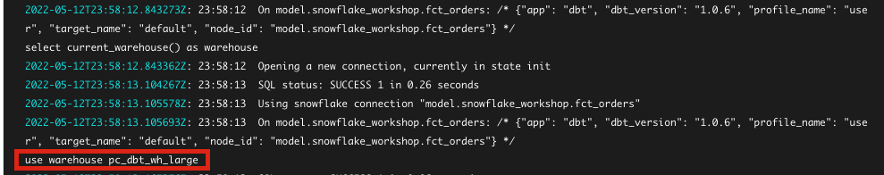

There are also a couple pieces about the model itself to point out. The first is that dbt is wrapping our select statement in DDL for us and building the table in our development schema. The `materialized` config in our `dbt_project.yml` file is responsible for building this as a table, as opposed to the default view materialization. 

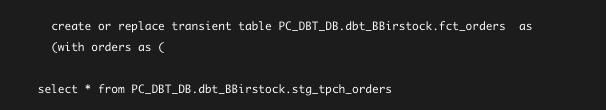

The other important point here is how the `ref` statements in each of the first two cte’s have been compiled to the appropriate database object. Here you can see that dbt has compiled the code to reference the `stg_tpch_orders` model and the `int_order_items` model in the development schema, given that we are building the model in our development environment. 

### Lineage

Now that we’ve completed building all of our models, we can see the lineage graph coming together. We’ll get another look at this when we pop into the docs site, but this is what you should be able to see by clicking on the lineage tab in the IDE with the `fct_orders` model tab open: 

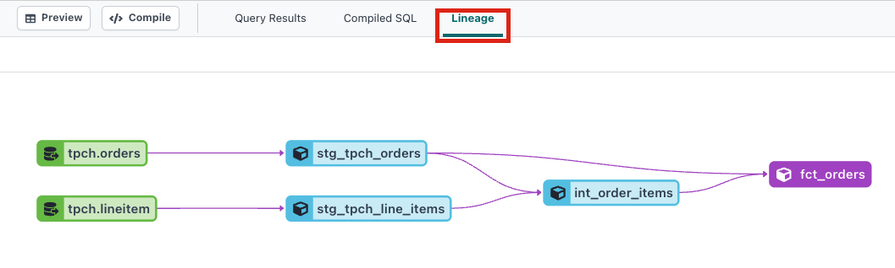

From left to right we have our sources (green nodes) leading into our staging models, our intermediate model, and then our final fact model. As was mentioned earlier, declaring sources in dbt and using the `ref` and `source` functions is what allows dbt to create these relations. This becomes very powerful as a project grows in size to include hundreds of models!

Let’s make sure to save our work before moving on to the next section. Take a moment to click the `commit` button and provide a message like `create intermediate and fact models` to save your most recent changes. 

<!-- ------------------------ -->

## Tests and Docs
Duration: 12

Now that we’ve built out our models and transformations, it’s really important to document and test them. This ensures we catch any errors that violate our assumptions about our data models and provides a guide to anyone else that comes across our work and wants to understand what we built. dbt’s native features include both a data testing and documentation framework to help us accomplish all of our documentation and testing needs.

Testing in dbt comes in two flavors: generic and singular. A [singular test](https://docs.getdbt.com/docs/building-a-dbt-project/tests#singular-tests) is testing in its simplest form: if you can write a SQL query that returns failing rows, it’s a dbt test that can be executed by the dbt test command. [Generic tests](https://docs.getdbt.com/docs/building-a-dbt-project/tests#generic-tests) are basically the same, but with the ability to accept arguments. You define them in a test block (similar to a macro) and once defined, you can reference them by name in your .yml files (applying them to models, columns, sources, snapshots, and seeds). dbt ships with four generic tests that work out of the box that we’re going to use here: `unique`, `not null`, `accepted values`, and `relationships`. We’re also going to write our own singular test to understand a flavor of custom testing in dbt.  And while we won’t cover them in this workshop, you can also access other generic tests from packages like the dbt_utils package as well as [dbt_expectations](https://hub.getdbt.com/calogica/dbt_expectations/latest/), which brings tests inspired by the Great Expectations python package into dbt. 


When it comes to documentation, dbt brings together both column and model level descriptions that you can provide as well as details from your Snowflake information schema in a static site for consumption by other data team members and stakeholders.

### Create Tests And Descriptions

Generic tests and descriptions for documentation are both defined in YAML files so to get started we’ll create a new file called `core.yml` with the following file path: `models/marts/core/core.yml`
 
Next we’ll copy and paste the following code block into the new file and click save:

```yaml
version: 2

models:
  - name: fct_orders
    description: orders fact table
    columns:
      - name: order_key
        description: primary key of the model
        tests:
          - unique
          - not_null
          - relationships:
              to: ref('stg_tpch_orders')
              field: order_key
              severity: warn
      - name: customer_key
        description: foreign key for customers
      - name: order_date
        description: date of the order
      - name: status_code
        description: status of the order
        tests:
          - accepted_values:
              values: ['P','O','F']
      - name: priority_code
        description: code associated with the order
      - name: clerk_name
        description: id of the clerk
      - name: ship_priority
        description: numeric representation of the shipping priority, zero being the default
      - name: order_count
        description: count of order
      - name: gross_item_sales_amount
        description: '{{ doc("gross_item_sales_amount") }}'
      - name: item_discount_amount
        description: item level discount amount. this is always less than or equal to zero
      - name: item_tax_amount
        description: item level tax total
      - name: net_item_sales_amount
        description: the net total which factors in discount and tax
```

Let’s take a moment to describe what’s happening in this file and how we’re defining everything. This file is in the `models/marts/core` directory and contains tests and descriptions specifically for the models in this directory, in this case for `fct_orders`. This is an organizational step and at the end of the day it is up to you and your team how you’d like to organize your YAML files and the models they test and define. As a best practice, we do recommend having at least one YAML file for testing and documentation per directory.

In looking at the formatting, the top level is the model we’re describing and we provide any model level information we’d like to directly under the model name. In our case, we’ve provided a description for our model and this will show as the model level when we view the documentation site for this model.

Moving down to the column level you’ll see that is where most of our work is being done, both from a description and testing standpoint. In looking at the testing on this model, you’ll see that we’re utilizing all of the generic tests on a variety of columns. We expect the `order_key` to be both `unique` and `not_null` and are using the associated tests to check. The `relationships` test is checking to make sure that the `order_key` in this model also exists as an id in `stg_tpch_orders`. And finally, there is an `accepted values` test on the `status_code` to ensure that the values outputted from that column meet our expectations.

When we take a look at the descriptions, we’re able to see that they are split between two different notations, one using plain text and the other using a jinja reference to a doc block. The plain text description works just as it does at the model level and allows you to document any column in the YAML file. The doc block expands our documentation capabilities by allowing us to write descriptions in markdown files, which we’ll jump into in the next step.

### Build Markdown File

Let’s build our markdown file to accompany our doc block description. Create a new file called `core.md` with the following file path: `models/marts/core/core.md` 

Then copy and paste the following code into it before saving:

```markdown
# the below are descriptions from fct_orders

 same as extended_price 
```

This markdown file has one doc block corresponding to the one column with a doc block description in our YAML file (note that a markdown file can have multiple doc blocks). The name within quotes in the YAML doc block description connects with the name in the opening doc block in our markdown file. In this case, `'{{doc("gross_item_sales_amount") }}'` in the YAML description matches `` in our markdown file. 

From there, the text description in our markdown file is what is passed as the description in our YAML file. This is what we’ll see when we open the corresponding model in our documentation site.

Building descriptions with doc blocks in markdown files gives you the ability to format your descriptions with markdown and are particularly helpful when building long descriptions, either at the column or model level. Also, if you have a column that exists in multiple models with the same description, you’re able to reuse the same doc block for that column as many times as you’d like. You can learn more about doc blocks [here](https://docs.getdbt.com/docs/building-a-dbt-project/documentation#using-docs-blocks).

### Build A Singular Test

Taking a look at our descriptions we can see that `item_discount_amount` specifies that the output for that column should always be less than or equal to zero. Let’s test it! 

For this we’ll need a custom data test, so we’ll start by creating a new file called `fct_orders_negative_discount_amount.sql` with the following file path: `tests/fct_orders_negative_discount_amount.sql` 

Copy and paste the following code into the new file before saving:

```sql
--If no discount is given it should be equal to zero 
--Otherwise it will be negative

select *
  from {{ ref('fct_orders') }}  
 where item_discount_amount > 0
```

Custom tests are written as SQL select statements where a failing test will return the failing records as the output. This means that in order for the test to pass the result will return no rows and we will need to write the test with this expectation in mind. Given that our assumption about the `item_discount_amount` is that it will always be less than or equal to zero, we then want to write the test to look for when the amount is greater than zero. The where clause in the select statement is written for this and will return failing records if there are any.

You may be wondering, if we aren’t listing this test in the YAML file, how does dbt know when to run this test? It’s the combination of the file living in the `tests` directory (as defined in our `dbt_project.yml` file) and the select statement using the `ref` function to create a dependency with the appropriate model. This way anytime you use the `dbt test` command to test that model, this test will run alongside all of the other column level tests.

### Run Tests 

Speaking of which, let’s finally run our tests! You can enter the following command into the command line: `dbt test --select fct_orders`. 

Similar to our model runs, the compiled code that is passed to Snowflake for each test is visible within the `Details` section of the test results. And from the looks of it, all of our tests passed! 

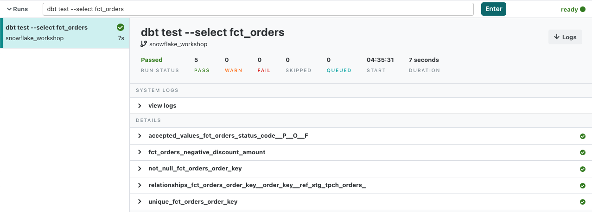

### Documentation

Let’s switch gears to take a look at the documentation that we created. The command to tell dbt to create our docs is `dbt docs generate`. Run that command and when it completes click on the book icon in the upper left hand corner of the IDE above the version control pane to launch your documentation. 

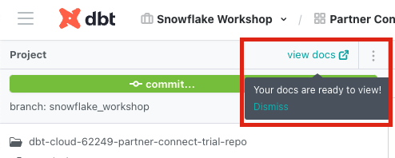

The documentation site will launch in a new tab. After that loads enter `fct_orders` into the top search bar and click on the top result to take you the documentation for that model. 

When that loads you should be able to see our model level description, the column level descriptions we wrote in the YAML file, and the description that came from doc blocks. You should also be able to see references to the tests being run for the two columns with tests.

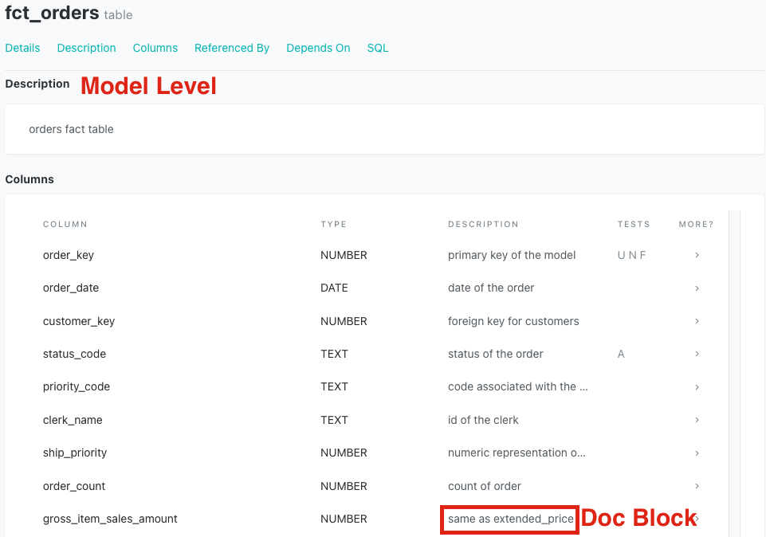

If you scroll down a bit farther you’ll be able to see information about the relationships this model has with other models as well. Clicking on the bubble in the bottom right hand corner opens up a preview of the lineage graph and clicking on the expand button in the upper right hand corner takes you to the full view. 

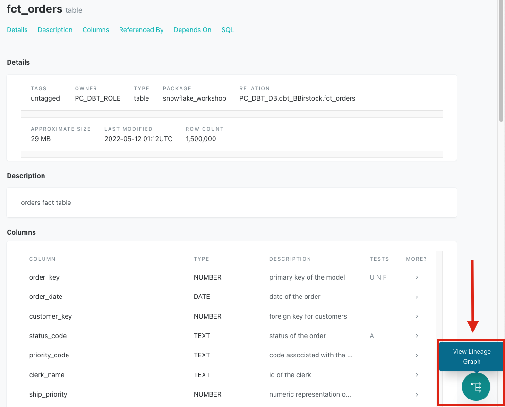

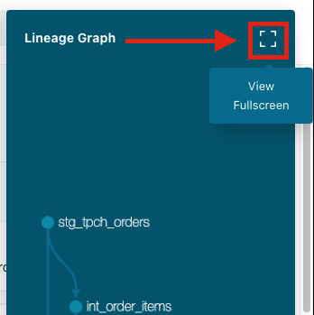

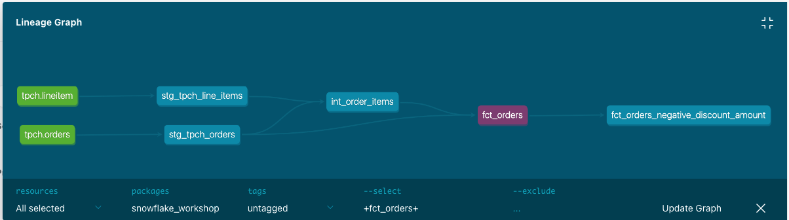

This is the end result of using the `ref` function throughout your project to reference your models as it allows dbt to build dependencies and lineage. The lineage graph is a powerful feature that gets more powerful as your project gets bigger and allows you to have much more informed architecture discussions as your project continues to grow.

Let’s commit our work for the section. Click the `Commit and push` button and provide a message like `tests and docs` to save your most recent changes. 

<!-- ------------------------ -->

## Deployment
Duration: 12

Before we jump into deploying our code, let’s have a quick primer on environments. Up to this point all of the work we’ve done in the dbt Cloud IDE has been in our development environment, with code committed to a feature branch and the models we’ve built created in our development schema in Snowflake as defined in our Development environment connection. Doing this work on a feature branch allows us to separate our code from what other coworkers are building, as well as code that is already deemed production ready. Building models in a development schema in Snowflake allows us to separate the database objects we might still be modifying and testing from the database objects running production dashboards or other downstream dependencies. Together, the combination of git branch and Snowflake database objects form our environment. 

Now that we’ve completed testing and documenting our work, we’re ready to deploy our code from our development environment to our production environment and this involves two steps: 

* Promoting code from our feature branch to the production branch in our repository. Generally the production branch is going to be named your main branch and there’s a review process to go through before merging code to the main branch of a repository, but here we are going to merge without review for ease of this workshop.

* Deploying code to our production environment. Once our code is merged to the main branch, we’ll need to run dbt in our production environment to build all of our models and run all of our tests. This will allow us to build production ready objects into our production environment in Snowflake. Luckily for us, the Partner Connect flow has already created our deployment environment and job to facilitate this step.

1. Before getting started, let’s make sure that we’ve committed all of our work to our feature branch. If you still have work to commit you’ll be able to click the `Commit and push` button, provide a message, and then click `Commit` again. 

2. Once all of your work is committed, the git workflow button will now appear as `Merge to main`. Click `Merge to main` and the merge process will automatically run in the background. 

    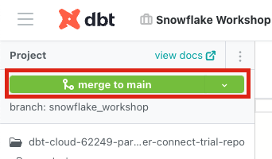<br><br>

    When it’s completed you should see the button read `Create branch` and the branch you’re currently looking at will become `main`. 

3. Now that all of our development work has been merged to the main branch, we can build our deployment job. Given that our production environment and production job were created automatically for us through Partner Connect, all we need to do here is update some default configurations to meet our needs.

4. Click on the Deploy tab in the top bar and then click `Environments`. 

    You should see two environments listed and you’ll want to click on the `Deployment` environment to open it up and then `Settings` in the upper right hand corner to modify it.<br><br>

    Before making any changes, let’s touch on what is defined within this environment.

    The Snowflake connection shows the credentials that dbt Cloud is using for this environment and in our case they are the same as what was created for us through Partner Connect. Our deployment job will build in our `PC_DBT_DB` database and use the default Partner Connect role and warehouse to do so.

    The deployment credentials section also uses the info that was created in our Partner Connect job to create the credential connection. However, it is using the same default schema that we’ve been using as the schema for our development environment. Let’s update the schema to create a new schema specifically for our production environment. 

    Click `Edit` in the upper right hand corner to allow you to modify the existing field values. Scroll down to the `schema` field in the `Deployment Credentials` section and update the schema name to `production`. Be sure to click `Save` in the upper right hand corner after you’ve made the change.

    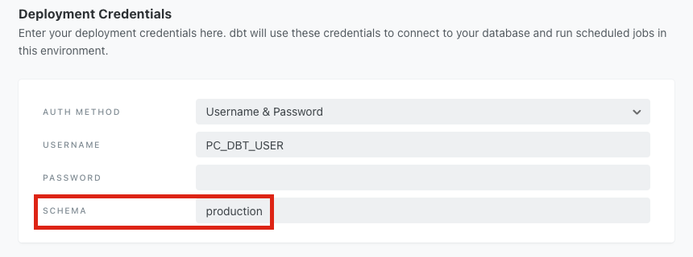

    By updating the schema for our production environment to `production`, it ensures that our deployment job for this environment will build our dbt models in the `production` schema within the `PC_DBT_DB` database as defined in the Snowflake Connection section.

5. Now let’s switch over to our production job. Click on the deploy tab again and then select `Jobs`. You should see an existing and pre-configured `Partner Connect Trial Job`. Similar to the environment, click on the job, then select `Settings` to modify it. Let’s take a look at the job to understand it before making changes. <br><br>

    The Environment section is what connects this job with the environment we want it to run in. This job is already defaulted to use the Deployment environment that we just updated and the rest of the settings we can keep as is. 

    The Execution settings section gives us the option to generate docs, run source freshness, and defer to a previous run state. For the purposes of our lab, we’re going to keep these settings as is as well and stick with just generating docs.

    The Commands section is where we specify exactly which commands we want to run during this job, and we also want to keep this as is. We want our seed to be uploaded first, then run our models, and finally test them. The order of this is important as well, considering that we need our seed to be created before we can run our incremental model, and we need our models to be created before we can test them. 

    Finally we have the Triggers section, where we have a number of different options for scheduling our job. Given that our data isn’t updating regularly here and we’re running this job manually for now, we’re also going to leave this section alone. 

    So, what are we changing then? Just the name! Click `Edit` in the upper right hand corner of the job to allow you to make changes. Then update the name of the job to `Production Job` to denote this as our production deployment job. After that’s done click `save` at the top of the screen.

6. Now let’s go to run our job. Clicking on the job name in the path at the top of the screen will take you back to the job run history page where you’ll be able to click `Run now` to kick off the job. <br><br>

    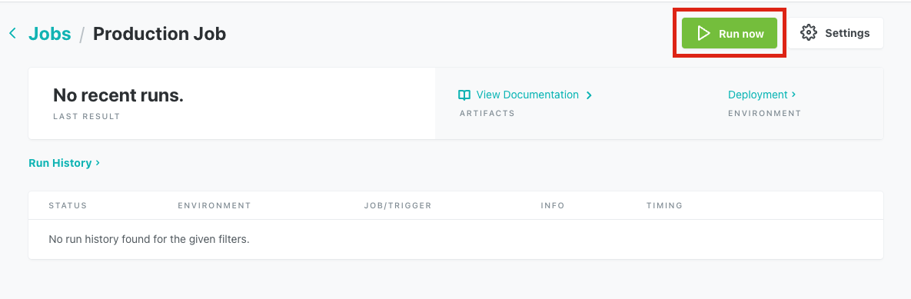<br><br>

    Once the run starts you’ll be able to click on the run itself and see all of the details about the run, including all of the commands that dbt runs and all of the models and tests run within each step. And if you click into the details of the `dbt run` step, you’ll see that the DDL has been updated to create your models in the `production` schema. 

    When it finishes you’ll notice that the job experienced an error, which is weird considering that there weren’t any issues when we ran our jobs and tests earlier. Looking more closely we can see there’s an issue in the test step and we want to click into that step to expand the logs and see what’s going on.<br><br>

    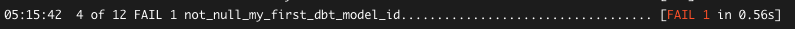<br><br>

    One of the tests from our example models failed! That was a bit unexpected, but in looking at all of the logs again we can see that the models we created were built successfully in Snowflake and the tests for those models passed. At this point, we can move forward and fix the failing example test another day. 

    While this process is great for your scheduling and running your dbt jobs, we recognize that transformation jobs don’t live in a silo for many data teams. It’s not uncommon for a data team to have a data process occurring outside of dbt that has to happen prior to a dbt job running, or for there to be a data process that needs to be triggered after a dbt job finishes. In these sorts of cases, we recommend using our [API](https://docs.getdbt.com/dbt-cloud/api-v2) with a third party orchestration tool to orchestrate and manage these situations. There are also a number of blog posts and articles, including this [one](https://docs.getdbt.com/blog/dbt-airflow-spiritual-alignment), to help you think about the best way to manage this alongside dbt Cloud.

7. Let’s go over to Snowflake to confirm that everything built as expected in our production schema. Refresh the database objects in your Snowflake account and you should see the `production` schema now within our default Partner Connect database. If you click into the schema and everything ran successfully, you should be able to see all of the models we developed there. <br><br>

    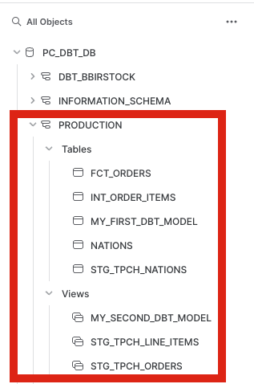

<!-- ------------------------ -->

## Visualizing Your Data with [Snowsight Dashboards](https://docs.snowflake.com/en/user-guide/ui-snowsight-dashboards.html)
Duration: 5

With all of our data now live in our production environment courtesy of our production job, we’re ready to visualize our data! Our sales team has asked us to build a dashboard showing all time sales by quarter. We’re going to take our `fct_orders` model and create a bar chart in order to do this. Before we jump in, take a second to make sure that you’re in the new Snowflake UI so that you’ll be able to access the dashboard feature.

1. On the left hand side of the screen click `Dashboards` and then click the blue `+ Dashboard` button in the upper right hand corner to create a new dashboard. Create a name for your dashboard in the popup window and then click `Create Dashboard`.<br><br>

    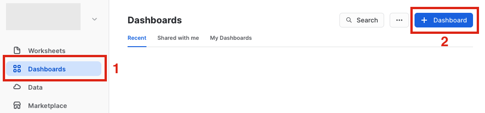

2. In the new window, go to the upper right hand corner of the screen and click on the box with the role and warehouse options. Be sure to select the `PC_DBT_ROLE` and the `PC_DBT_WH` warehouse. <br><br>

    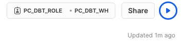<br><br>

    Next, click `New Tile` in the center of the screen. Within the new tile screen, click the timestamp at the top-center of the screen and update the tile name to `Quarterly Sales`. <br><br> 

    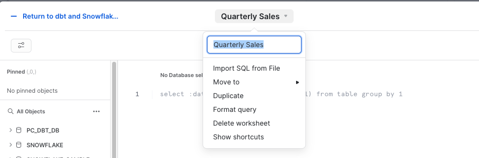<br><br>

    At the top of the editor, be sure that the database and schema is set to `PC_DBT_DB` and `PRODUCTION`.<br><br>

    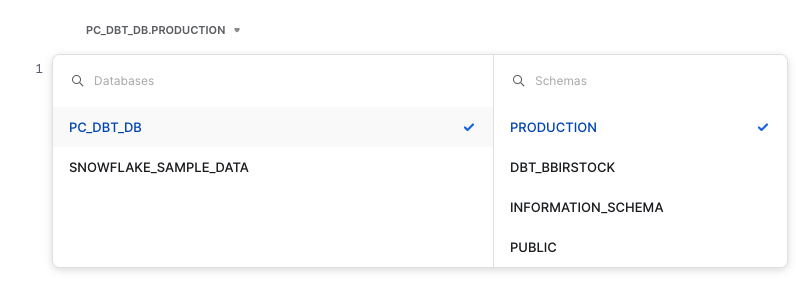<br><br>

    Then copy and paste the following code into the editor: <br><br>

    ```
    select order_date
         , sum(net_item_sales_amount) as sum_net_sales
      from pc_dbt_db.production.fct_orders
     where order_date = :daterange
     group by :datebucket(order_date), order_date
    ```

    Next, in the top left hand corner of the screen update the time period from `Last Day` to `All Time`. Finally, use the corresponding run query shortcut on your keyboard to run the code. The final output should look like this:<br><br>

    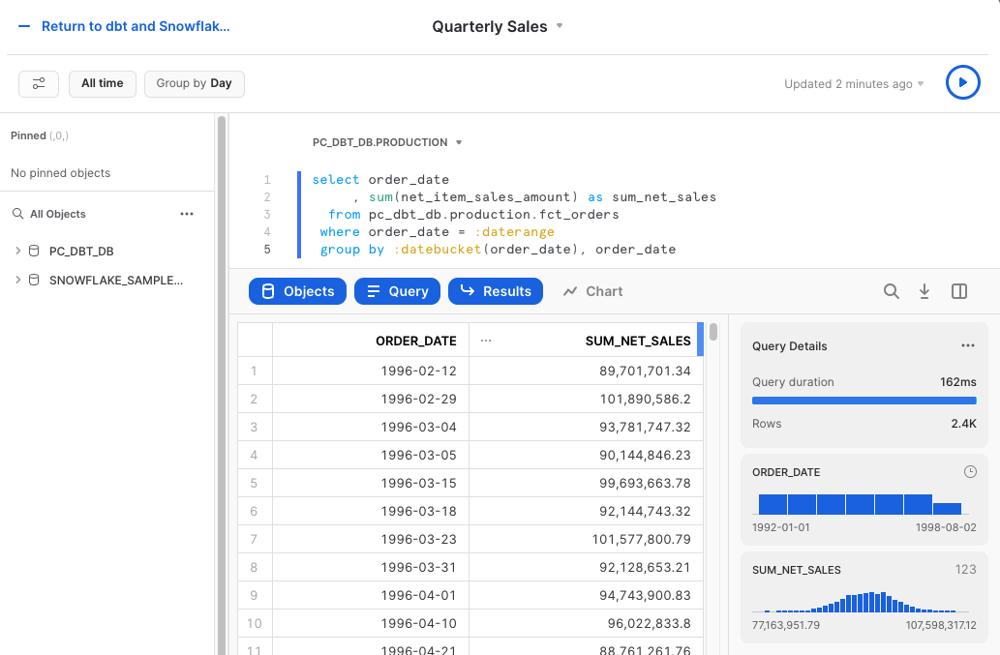

3. Now let’s transform our results into a chart. Click the `chart` button in the middle of the screen to bring up the initial chart and options sidebar. <br><br>

    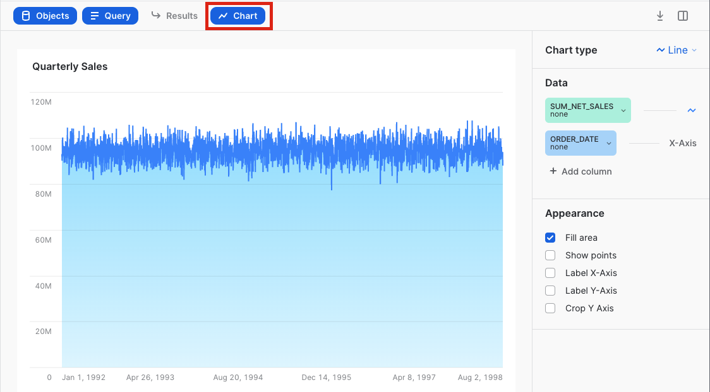<br><br>

    Our query is aggregating the `net_item_sales_amount` and grouping by `order_date`, but at the moment we’re seeing every date in what has become a very busy line chart. Let’s transform this into a bar chart where the date is grouped by quarter.

    Start by clicking on the chart type and updating it to `Bar`. Then click `order_date` and select `quarter` as the bucketing. Finally, change the order direction from `descending` to `ascending`. <br><br>

    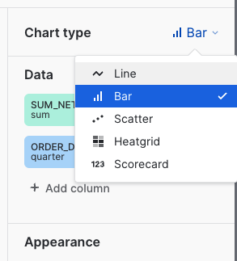<br><br>

    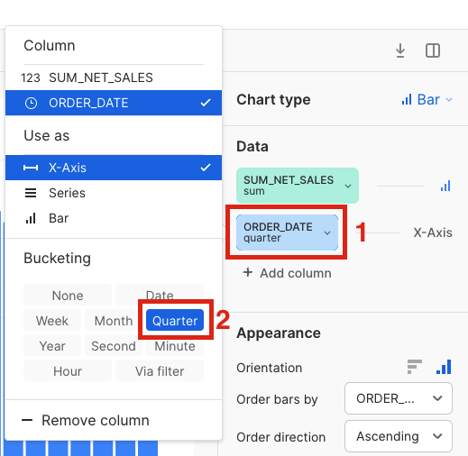<br><br>

    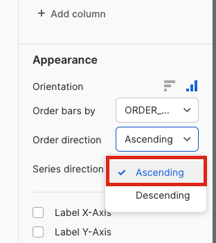<br><br>

4. With the tile completed, all you have to do now is click the `Return` button in the upper left hand corner of the tile and you’ll be taken to the dashboard with our tile at the top. <br><br>

    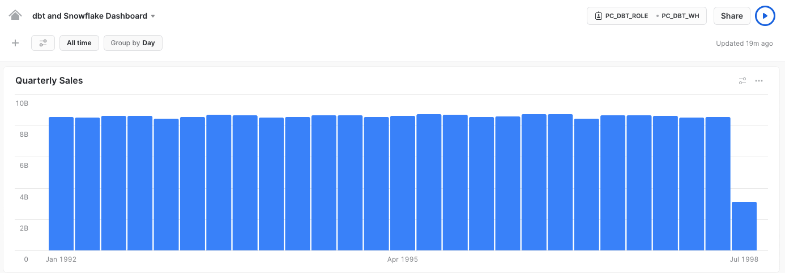<br><br>

    Congrats! You've built the visualization the sales team was looking for and it looks like total sales remained very steady with the exception of the last quarter in 1998. We'll need to check in with them about that!

<!-- ------------------------ -->

## Conclusion & Next Steps

Congratulations on completing the lab!

Today you learned how to use dbt and Snowflake to build data transformation pipelines for analytics. You're now ready to apply these fundamentals to your own data. We encourage you to continue with your free trial by loading your own sample or production data, and by continuing to dive into some of the more advanced functionality of dbt Cloud and Snowflake.

### What We've Covered

* How to build scalable data transformation pipelines using dbt & Snowflake

* How to establish data trust with stakeholders by incorporating key dbt testing capabilities

* How to scale Snowflake compute capabilities with the dbt workflow

* How to build lightweight charts and visualizations in Snowflake

### Additional Resources 

* Join our [dbt community Slack ](https://community.getdbt.com/)which contains more than 29,000 data practitioners today. We have a dedicated slack channel #db-snowflake to Snowflake related content.

* To continue your dbt education, check out the [dbt Learn site](https://learn.getdbt.com/).

* Contact the [dbt Cloud Sales team](https://www.getdbt.com/contact/) if you're interested in exploring dbt Cloud for your team or organization.