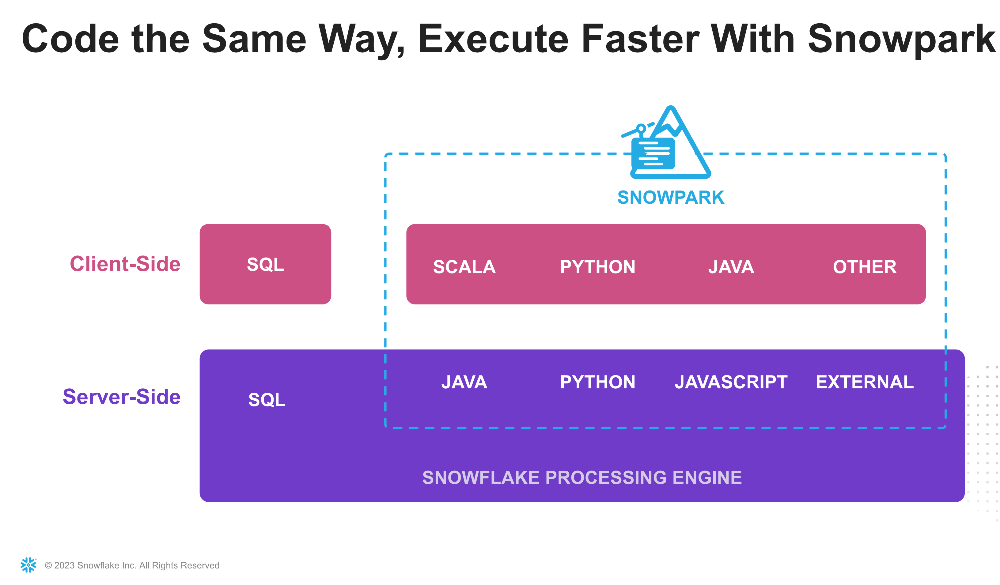
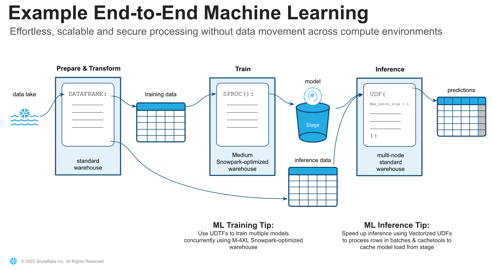
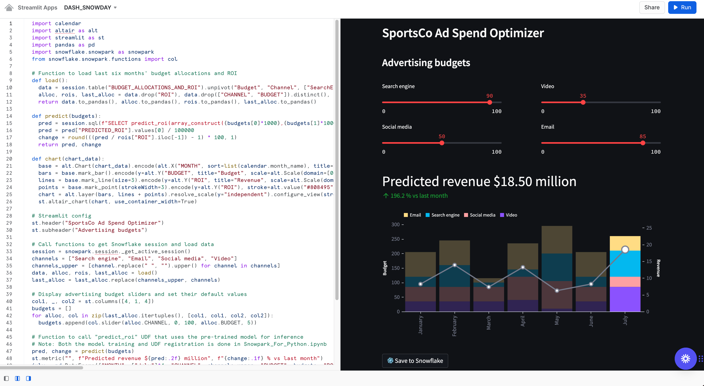

id: ad_spend_roi_snowpark_python_scikit_learn_streamlit
summary: This guide provides the instructions for performing data engineering tasks (data analysis and data preparation) as well as training, deploying, and running a ML model using Snowpark for Python, scikit-learn, and Streamlit.
categories: Data-Applicatons
environments: web
status: Hidden
feedback link: <https://github.com/Snowflake-Labs/sfguides/issues>
tags: Data Applicatons, Getting Started, Snowpark Python, Streamlit, scikit-learn, Data Engineering, Machine Learning
authors: Dash Desai

# Ad Spend and ROI Prediction App using Snowpark for Python, Streamlit, and scikit-learn
<!-- ------------------------ -->
## Overview

Duration: 5

In this guide, we will perform data engineering (data analysis and data preparation) and machine learning tasks to train a Linear Regression model to predict future ROI (Return On Investment) of variable ad spend budgets across multiple channels including search, video, social media, and email using Snowpark for Python, Streamlit and scikit-learn. By the end of the session, you will have an interactive web application deployed visualizing the ROI of different allocated advertising spend budgets.

First things first though for those that are new to some of these technologies.

### What is Snowpark?

It allows developers to query data and write data applications in languages other than SQL using a set of APIs and DataFrame-style programming constructs in Python, Java, and Scala. These applications run on and take advantage of the same distributed computation on Snowflake's elastic engine as your SQL workloads. Learn more about [Snowpark](https://www.snowflake.com/snowpark/).

---



---

### What is Streamlit?

Streamlit is a pure-Python [open source](https://github.com/streamlit/streamlit) application framework that enables developers to quickly and easily write, share, and deploy data applications. Learn more about [Streamlit](https://streamlit.io/).

### What is scikit-learn?

It is one of the most popular [open source](https://scikit-learn.org/) machine learning libraries for Python that also happens to be pre-installed and available for developers to use in Snowpark for Python via [Snowflake Anaconda](https://snowpark-python-packages.streamlit.app/) channel. This means that you can use it in Snowpark for Python User-Defined Functions and Stored Procedures without having to manually install it and manage all of its dependencies.

### What You’ll Learn

- How to analyze data and perform data engineering tasks using Snowpark DataFrames and APIs
- How to use open-source Python libraries like scikit-learn from curated Snowflake Anaconda channel
- How to deploy ML model training code on Snowflake using Snowpark Python Stored Procedure
- How to create Scalar and Vectorized Snowpark Python User-Defined Functions (UDFs) for online and offline inference respectively
- How to create Snowflake Tasks to automate data pipelines
- How to create Streamlit web application that uses the Scalar UDF for inference based on user input

### What You’ll Build

- A Linear Regression model to predict ROI (Return On Investment)
- An interactive Streamlit application that visualizes the ROI of different allocated advertising budgets. This application will also call the Snowpark for Python User-Defined Function (UDF) to load ML model for predicting ROI on new budget allocations based on user input.

### Prerequisites

- A Snowflake account with [Anaconda Packages enabled by ORGADMIN](https://docs.snowflake.com/en/developer-guide/udf/python/udf-python-packages.html#using-third-party-packages-from-anaconda). If you do not have a Snowflake account, you can register for a [free trial account](https://signup.snowflake.com/).
- A Snowflake account login with ACCOUNTADMIN role. If you have this role in your environment, you may choose to use it. If not, you will need to 1) Register for a free trial, 2) Use a different role that has the ability to create database, schema, tables, stages, tasks, user-defined functions, and stored procedures OR 3) Use an existing database and schema in which you are able to create the mentioned objects.

<!-- ------------------------ -->
## Setup Environment

Duration: 15

### Create Tables, Load Data and Setup Stages

Log into [Snowsight](https://docs.snowflake.com/en/user-guide/ui-snowsight.html#) using your credentials and create tables, load data, and setup Snowflake internal stages as described below.

***IMP: If you use different names for objects created in this section, be sure to update scripts and code in the following sections accordingly.***

Run the following SQL commands to create the warehouse, database and schema.

```sql
CREATE OR REPLACE WAREHOUSE DASH_L;

CREATE OR REPLACE DATABASE DASH_DB;

CREATE OR REPLACE SCHEMA DASH_SCHEMA;

USE DASH_DB.DASH_SCHEMA;
```

Run the following SQL commands to create table CAMPAIGN_SPEND from data hosted on publicly accessible S3 bucket.

```sql
CREATE or REPLACE file format csvformat
  skip_header = 1
  type = 'CSV';

CREATE or REPLACE stage campaign_data_stage
  file_format = csvformat
  url = 's3://sfquickstarts/ad-spend-roi-snowpark-python-scikit-learn-streamlit/campaign_spend/';

CREATE or REPLACE TABLE CAMPAIGN_SPEND (
  CAMPAIGN VARCHAR(60), 
  CHANNEL VARCHAR(60),
  DATE DATE,
  TOTAL_CLICKS NUMBER(38,0),
  TOTAL_COST NUMBER(38,0),
  ADS_SERVED NUMBER(38,0)
);

COPY into CAMPAIGN_SPEND
  from @campaign_data_stage;
```

Run the following SQL commands to create table MONTHLY_REVENUE from data hosted on publicly accessible S3 bucket.

```sql
CREATE or REPLACE stage monthly_revenue_data_stage
  file_format = csvformat
  url = 's3://sfquickstarts/ad-spend-roi-snowpark-python-scikit-learn-streamlit/monthly_revenue/';

CREATE or REPLACE TABLE MONTHLY_REVENUE (
  YEAR NUMBER(38,0),
  MONTH NUMBER(38,0),
  REVENUE FLOAT
);

COPY into MONTHLY_REVENUE
  from @monthly_revenue_data_stage;
```

Run the following SQL commands to create table BUDGET_ALLOCATIONS_AND_ROI that holds the last six months of budget allocations and ROI.

```sql
CREATE or REPLACE TABLE BUDGET_ALLOCATIONS_AND_ROI (
  MONTH varchar(30),
  SEARCHENGINE integer,
  SOCIALMEDIA integer,
  VIDEO integer,
  EMAIL integer,
  ROI float
);

INSERT INTO BUDGET_ALLOCATIONS_AND_ROI (MONTH, SEARCHENGINE, SOCIALMEDIA, VIDEO, EMAIL, ROI)
VALUES
('January',35,50,35,85,8.22),
('February',75,50,35,85,13.90),
('March',15,50,35,15,7.34),
('April',25,80,40,90,13.23),
('May',95,95,10,95,6.246),
('June',35,50,35,85,8.22);
```

Run the following commands to create Snowflake (internal) stages for storing Stored Procedures, UDFs, and ML model files.

```sql
CREATE OR REPLACE STAGE dash_sprocs;

CREATE OR REPLACE STAGE dash_models;

CREATE OR REPLACE STAGE dash_udfs;
```

Optionally, you can also open [setup.sql](https://github.com/Snowflake-Labs/sfguide-ad-spend-roi-snowpark-python-streamlit-scikit-learn/blob/main/setup.sql) n Snowsight and run all SQL statements to create the objects and load data from AWS S3.

***IMP: If you use different names for objects created in this section, be sure to update scripts and code in the following sections accordingly.***

<!-- ------------------------ -->
## Clone GitHub Repository

Duration: 10

This section covers cloning of the GitHub repository and creating a Python 3.8 environment.

- Clone [GitHub repository](https://github.com/Snowflake-Labs/sfguide-ad-spend-roi-snowpark-python-streamlit-scikit-learn)

- Download the miniconda installer from [https://conda.io/miniconda.html](https://conda.io/miniconda.html). *(OR, you may use any other Python environment with Python 3.8)*.

- From the root folder *sfguide-ad-spend-roi-snowpark-python-streamlit-scikit-learn*, create conda environment. (Let's name the environment **snowpark-scikit**.) Then, activate conda environment and install Snowpark for Python and other libraries including Streamlit.

```python
conda create --name snowpark-scikit -c https://repo.anaconda.com/pkgs/snowflake python=3.8
conda activate snowpark-scikit
conda install -c https://repo.anaconda.com/pkgs/snowflake snowflake-snowpark-python pandas notebook scikit-learn cachetools
pip install streamlit
```

  *Note: The versions at the time of writing this -- snowflake-snowpark-python 1.0.0, streamlit 1.18.1.*

- Update [connection.json](https://github.com/Snowflake-Labs/sfguide-ml-model-snowpark-python-scikit-learn-streamlit/blob/main/connection.json) with your Snowflake account details and credentials.

  *Note: For the account parameter, specify your [account identifier](https://docs.snowflake.com/en/user-guide/admin-account-identifier.html) and do not include the snowflakecomputing.com domain name. Snowflake automatically appends this when creating the connection.*

<!-- ------------------------ -->
## Data Engineering

Duration: 20

The Notebook linked below covers the following data engineering tasks.

1) Establish secure connection from Snowpark Python to Snowflake
2) Load data from Snowflake tables into Snowpark DataFrames
3) Perform Exploratory Data Analysis on Snowpark DataFrames
4) Pivot and Join data from multiple tables using Snowpark DataFrames
5) Automate data pipeline tasks using Snowflake Tasks

### Data Engineering Notebook

To get started, follow these steps:

1) In a terminal window, browse to this folder and run `jupyter notebook` at the command line. (You may also use other tools and IDEs such Visual Studio Code.)

2) Open and run through the [Snowpark_For_Python_DE.ipynb](https://github.com/Snowflake-Labs/sfguide-ad-spend-roi-snowpark-python-streamlit-scikit-learn/blob/main/Snowpark_For_Python_DE.ipynb)

  **Note**: Make sure in the Jupyter notebook the (Python) kernel is set to ***snowpark-scikit***-- which is the name of the environment created in **Clone GitHub Repository** step.

### Data Pipeline As a Task

In the above Notebook, there's a section that demonstrates how to build and run data pipelines as [Snowflake Tasks](https://docs.snowflake.com/en/user-guide/tasks-intro).

For reference purpose, here are the code snippets.

#### **Root/parent Task**

```python
def campaign_spend_data_pipeline(session: Session) -> str:
  # DATA TRANSFORMATIONS
  # Perform the following actions to transform the data

  # Load the campaign spend data
  snow_df_spend_t = session.table('campaign_spend')

  # Transform the data so we can see total cost per year/month per channel using group_by() and agg() Snowpark DataFrame functions
  snow_df_spend_per_channel_t = snow_df_spend_t.group_by(year('DATE'), month('DATE'),'CHANNEL').agg(sum('TOTAL_COST').as_('TOTAL_COST')).\
      with_column_renamed('"YEAR(DATE)"',"YEAR").with_column_renamed('"MONTH(DATE)"',"MONTH").sort('YEAR','MONTH')

  # Transform the data so that each row will represent total cost across all channels per year/month using pivot() and sum() Snowpark DataFrame functions
  snow_df_spend_per_month_t = snow_df_spend_per_channel_t.pivot('CHANNEL',['search_engine','social_media','video','email']).sum('TOTAL_COST').sort('YEAR','MONTH')
  snow_df_spend_per_month_t = snow_df_spend_per_month_t.select(
      col("YEAR"),
      col("MONTH"),
      col("'search_engine'").as_("SEARCH_ENGINE"),
      col("'social_media'").as_("SOCIAL_MEDIA"),
      col("'video'").as_("VIDEO"),
      col("'email'").as_("EMAIL")
  )

  # Save transformed data
  snow_df_spend_per_month_t.write.mode('overwrite').save_as_table('SPEND_PER_MONTH')

# Register data pipelining function as a Stored Procedure so it can be run as a task
session.sproc.register(
  func=campaign_spend_data_pipeline,
  name="campaign_spend_data_pipeline",
  packages=['snowflake-snowpark-python'],
  is_permanent=True,
  stage_location="@dash_sprocs",
  replace=True)

campaign_spend_data_pipeline_task = """
CREATE OR REPLACE TASK campaign_spend_data_pipeline_task
    WAREHOUSE = 'DASH_L'
    SCHEDULE  = '3 MINUTE'
AS
    CALL campaign_spend_data_pipeline()
"""
session.sql(campaign_spend_data_pipeline_task).collect()
```

#### **Child/dependant Task**

```python
def monthly_revenue_data_pipeline(session: Session) -> str:
  # Load revenue table and transform the data into revenue per year/month using group_by and agg() functions
  snow_df_spend_per_month_t = session.table('spend_per_month')
  snow_df_revenue_t = session.table('monthly_revenue')
  snow_df_revenue_per_month_t = snow_df_revenue_t.group_by('YEAR','MONTH').agg(sum('REVENUE')).sort('YEAR','MONTH').with_column_renamed('SUM(REVENUE)','REVENUE')

  # Join revenue data with the transformed campaign spend data so that our input features (i.e. cost per channel) and target variable (i.e. revenue) can be loaded into a single table for model training
  snow_df_spend_and_revenue_per_month_t = snow_df_spend_per_month_t.join(snow_df_revenue_per_month_t, ["YEAR","MONTH"])

  # SAVE in a new table for the next task
  snow_df_spend_and_revenue_per_month_t.write.mode('overwrite').save_as_table('SPEND_AND_REVENUE_PER_MONTH')

# Register data pipelining function as a Stored Procedure so it can be run as a task
session.sproc.register(
  func=monthly_revenue_data_pipeline,
  name="monthly_revenue_data_pipeline",
  packages=['snowflake-snowpark-python'],
  is_permanent=True,
  stage_location="@dash_sprocs",
  replace=True)

monthly_revenue_data_pipeline_task = """
  CREATE OR REPLACE TASK monthly_revenue_data_pipeline_task
      WAREHOUSE = 'DASH_L'
      AFTER campaign_spend_data_pipeline_task
  AS
      CALL monthly_revenue_data_pipeline()
  """
session.sql(monthly_revenue_data_pipeline_task).collect()
```

***Note***: In the ***monthly_revenue_data_pipeline_task*** above, notice the **AFTER campaign_spend_data_pipeline_task** clause.

Here is how to start the tasks.

```sql
session.sql("alter task monthly_revenue_data_pipeline_task resume").collect()
session.sql("alter task campaign_spend_data_pipeline_task resume").collect()
```

***Note***: Suspend tasks to avoid unecessary resource utilization.

```sql
session.sql("alter task campaign_spend_data_pipeline_task suspend").collect()
session.sql("alter task monthly_revenue_data_pipeline_task suspend").collect()
```

### Task Observability

These tasks and their [DAGs](https://docs.snowflake.com/en/user-guide/tasks-intro#label-task-dag) can be viewed in [Snowsight](https://docs.snowflake.com/en/user-guide/ui-snowsight-tasks#viewing-individual-task-graphs) as shown below.

---


---

### Error Notificatons For Tasks

Snowflake can push error notifications to a cloud messaging service when it encounters errors while executing tasks. For more information, please refer to the [documentation](https://docs.snowflake.com/en/user-guide/tasks-errors).

<!-- ------------------------ -->
## Machine Learning

Duration: 20

The Notebook linked below covers the following machine learning tasks.

1) Establish secure connection from Snowpark Python to Snowflake
2) Load features and target from Snowflake table into Snowpark DataFrame
3) Prepare features for model training
4) Create a Python Stored Procedure to deploy model training code on Snowflake
5) Create Python Scalar and Vectorized User-Defined Functions (UDF) for inference on new data points.

---



---

### Machine Learning Notebook

To get started, follow these steps:

1) In a terminal window, browse to this folder and run `jupyter notebook` at the command line. (You may also use other tools and IDEs such Visual Studio Code.)

2) Open and run through the [Snowpark_For_Python_ML.ipynb](https://github.com/Snowflake-Labs/sfguide-ad-spend-roi-snowpark-python-streamlit-scikit-learn/blob/main/Snowpark_For_Python_ML.ipynb)

  **Note**: Make sure in the Jupyter notebook the (Python) kernel is set to ***snowpark-scikit*** -- which is the name of the environment created in **Clone GitHub Repository** step.

<!-- ------------------------ -->
## Streamlit Application

Duration: 10

### Running Streamlit App Locally

In a terminal window, browse to this folder and execute the following command to run the Streamlit application [Snowpark_Streamlit_Revenue_Prediction.py](https://github.com/Snowflake-Labs/sfguide-ad-spend-roi-snowpark-python-streamlit-scikit-learn/blob/main/Snowpark_Streamlit_Revenue_Prediction.py) locally on your machine.

```shell
streamlit run Snowpark_Streamlit_Revenue_Prediction.py
```

If all goes well, you should see a browser window open with the app loaded as shown below.

---


---

### Running Streamlit App in Snowflake -- Streamlit-in-Snowflake (SiS)

If you have SiS enabled in your account, follow these steps to run the application in Snowsight instead of locally on your machine.

#### ***IMP: SiS is in Private Preview as of Feburary 2023.***

  1) Click on **Streamlit Apps** on the left navigation menu
  2) Click on **+ Streamlit App** on the top right
  3) Enter **App name**
  4) Select **Warehouse** and **App locaton** (Database and Schema) where you'd like to create the Streamlit applicaton
  5) Click on **Create**
  6) At this point, you will be provided code for an example Streamlit application. Now open [Snowpark_Streamlit_Revenue_Prediction_SiS.py](https://github.com/Snowflake-Labs/sfguide-ad-spend-roi-snowpark-python-streamlit-scikit-learn/blob/main/Snowpark_Streamlit_Revenue_Prediction_SiS.py) and copy-paste the code into the example Streamlit application.
  7) Click on **Run** on the top right

If all goes well, you should see the following app in Snowsight as shown below.

---



---

#### **Save Data To Snowflake**

In both applications, adjust the sliders to see the predicted ROI change. You can also click on **Save to Snowflake** button to save the current allocations and predcted ROI into BUDGET_ALLOCATIONS_AND_ROI table.

### Differences between two Streamlit Apps

The main difference between the two versions of Streamlit applications is how you create and access the Session object.

When running locally, you'd create and access the new Session object it like so:

```python
# Function to create Snowflake Session to connect to Snowflake
def create_session():
    if "snowpark_session" not in st.session_state:
        session = Session.builder.configs(json.load(open("connection.json"))).create()
        st.session_state['snowpark_session'] = session
    else:
        session = st.session_state['snowpark_session']
    return session
```

When running in Snowflake (SiS), you'd access the current Session object like so:

```python
session = snowpark.session._get_active_session()
```

<!-- ------------------------ -->
## Conclusion And Resources

Duration: 3

Congratulations! You've successfully perfomred data engineering tasks and trained a Linear Regression model to predict future ROI (Return On Investment) of variable advertising spend budgets across multiple channels including Search, Video, Social Media, and Email using Snowpark for Python and scikit-learn. And then you created a Streamlit application that uses that model to generate predictions on new budget allocations.

### What You Learned

- How to analyze data and perform data engineering tasks using Snowpark DataFrames and APIs
- How to use open-source Python libraries like scikit-learn from curated Snowflake Anaconda channel
- How to deploy ML model training code on Snowflake using Snowpark Python Stored Procedure
- How to create Scalar and Vectorized Snowpark Python User-Defined Functions (UDFs) for online and offline inference respectively
- How to create Snowflake Tasks to automate data pipelining and (re)training of the model
- How to create Streamlit web application that uses the Scalar UDF for inference

### Related Resources

- [Source Code on GitHub](https://github.com/Snowflake-Labs/sfguide-ad-spend-roi-snowpark-python-streamlit-scikit-learn)
- [Snowpark for Python Demos](https://github.com/Snowflake-Labs/snowpark-python-demos/blob/main/README.md)
- [Snowpark for Python Developer Guide](https://docs.snowflake.com/en/developer-guide/snowpark/python/index.html)
- [Streamlit Docs](https://docs.streamlit.io/)
