id: advanced-guide-to-snowflake-feature-store
categories: snowflake-site:taxonomy/solution-center/certification/quickstart, snowflake-site:taxonomy/product/ai, snowflake-site:taxonomy/snowflake-feature/model-development, snowflake-site:taxonomy/snowflake-feature/dynamic-tables
language: en
summary: Implement advanced Feature Store patterns in Snowflake for online serving, feature pipelines, and ML experimentation.
environments: web
status: Published 
feedback link: https://github.com/Snowflake-Labs/sfguides/issues
authors: Simon Field

# Advanced Guide to Snowflake Feature Store
<!-- --------------------------------------- -->
## Overview 

This advanced guide walks through an end-to-end customer segmentation machine-learning use-case using Snowflake Feature Store and Model Registry.  By completing this guide, you will be able to go from ingesting raw data through to implementing a production inference data-pipeline with Snowflake ML to maintain customer segments.

The primary focus in this guide is the Snowflake Feature Stores functionality and how it integrates within the broader ecosystem within Snowflake ML.

Here is a summary of what you will be able to learn in each step by following this Guide:

- **Setup Environment**: Use stages and tables to ingest and organize raw data from S3 into Snowflake tables.  Setup a scheduled process to simulate incremental data-ingest into Snowflake tables.
- **Feature Engineering**: Leverage Snowparks Python DataFrames to perform data cleansing, transformations such as group by, aggregate, pivot, and join to create features for machine learning.
- **Feature Store**: Use Snowflakes Feature Store to register and maintain feature-engineering pipelines and understand how to monitor them once operational. 
- **Machine Learning**: Perform feature transformation and run ML Training in Snowflake using Snowpark ML. Register the trained ML model for inference from the Snowflake Model Registry
- **Operationalise a Model**: Implementing a production inference data-pipeline to maintain customer segments as underlying customer behaviors change in source data.

The diagram below provides an overview of what we will be building in this Guide.
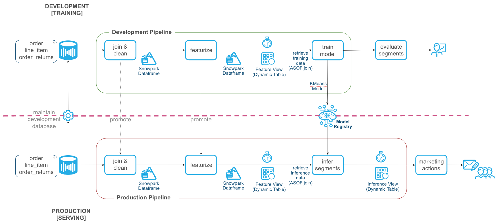

> 
> __Note__:  Snowflake Feature Store uses Snowflake Enterprise Edition features and therefore requires Enterprise Edition or higher.

In case you are new to some of the technologies mentioned above, here’s a quick summary with links to documentation.

### What is Snowpark?

Snowpark is the set of libraries and code execution environments that run Python and other programming languages next to your data in Snowflake.


**Client Side Libraries** - Snowpark libraries can be downloaded, installed and used from any client-side notebook or IDE and are used for code development and deployment. Libraries include the [Snowpark ML API)[https://docs.snowflake.com/en/developer-guide/snowpark-ml/overview#installing-snowpark-ml], which provides Python APIs for machine learning workflows in Snowflake.

**Code Execution Environments** - Snowpark provides elastic compute environments for secure execution of your code in Snowflake. Runtime options include Python, Java, and Scala in warehouses, container runtimes for out-of-the-box distributed processing with CPUs or GPUs using any Python framework, or custom runtimes brought in from Snowpark Container Services to execute any language of choice with CPU or GPU compute.

Learn more about Snowpark [here](/snowpark/).

### What is Snowflake ML?

[Snowflake ML](https://docs.snowflake.com/en/developer-guide/snowpark-ml/overview) is the integrated set of capabilities for end-to-end machine learning in a single platform on top of your governed data. Snowflake ML can be used for fully custom and out-of-the-box workflows. For ready-to-use ML, analysts can use [ML Functions](https://docs.snowflake.com/en/guides-overview-ml-functions) to shorten development time or democratize ML across your organization with SQL from Studio, our no-code user interface. For custom ML, data scientists and ML engineers can easily and securely develop and productionize scalable features and models without any data movement, silos or governance tradeoffs.

Capabilities for custom ML include:
- Snowflake Notebooks for a familiar, easy-to-use notebook interface that blends Python, SQL, and Markdown
- Container Runtimes for distributed CPU and GPU processing out of the box from Snowflake Notebooks
- Snowpark ML Modeling for feature engineering and model training with familiar Python frameworks
- Snowflake Feature Store for continuous, automated refreshes on batch or streaming data
- Snowflake Model Registry to manage models and their metadata
- ML Lineage to trace end-to-end feature and model lineage (currently in private preview)

To get started with Snowflake ML, developers can use the Python APIs from the [Snowpark ML library](https://docs.snowflake.com/en/developer-guide/snowpark-ml/index) to interact with all development and operations features across the ML workflow.

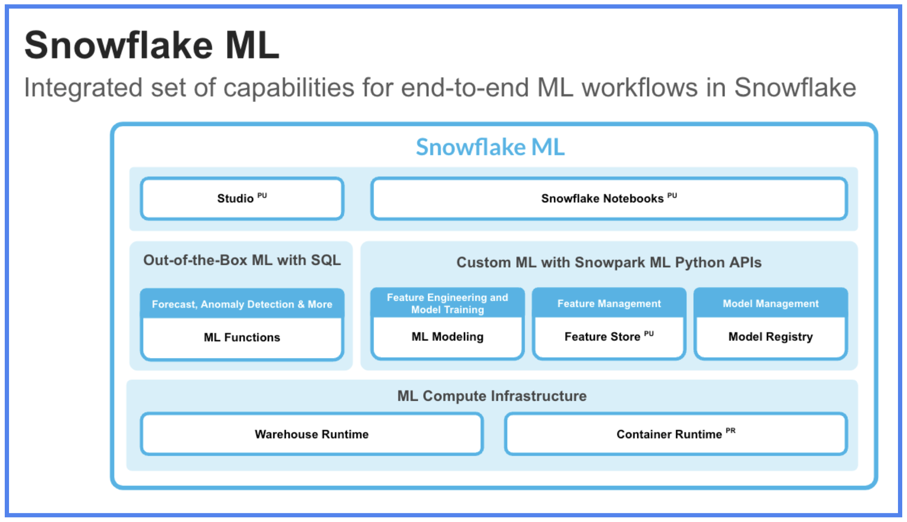

This guide will focus on

- [Snowflake Feature Store](https://docs.snowflake.com/LIMITEDACCESS/snowflake-feature-store#generating-datasets-for-training), which enables the creation of feature-engineering pipelines, and efficient, time-accurate retrieval of features for model training and inference. Snowflake Feature Store enables data engineers, data scientists and ML engineers to centralize the curation, maintenance and sharing of features that can be used in machine-learning models.  

  You can create multiple Feature-Stores within a Snowflake account, for example organized by environment or business unit.  Features are automatically maintained using Snowflake Dynamic Tables to ensure that the feature-engineering pipeline keeps features updated to the required level of freshness. When retrieving features for training or inference, feature-store ensures that the feature values are retrieved at the required point-in-time using Snowflake AsOf joins.

  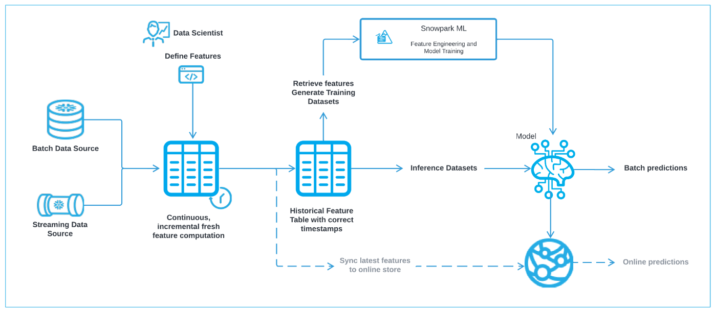

- [Snowpark ML Modeling](https://docs.snowflake.com/en/developer-guide/snowpark-ml/snowpark-ml-modeling), which enables the use of popular Python ML frameworks, such as scikit-learn and XGBoost, for feature pre-processing and model training without the need to move data out of Snowflake.


- [Snowflake Model Registry](https://docs.snowflake.com/en/developer-guide/snowpark-ml/snowpark-ml-mlops-model-registry), which provides scalable and secure model management of ML models in Snowflake, regardless of origin.
Using these features, you can build and operationalize a complete ML workflow, taking advantage of Snowflake's scale and security features.

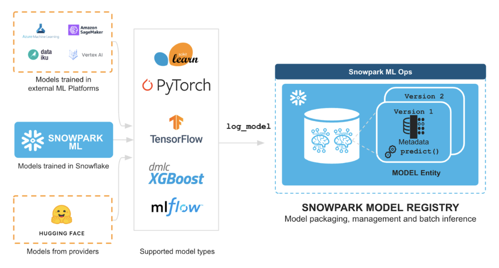


### What You Will Learn

- How to perform data and feature engineering tasks using Snowpark DataFrames and APIs
- How to create a Snowflake Feature Store, and the key objects within it like Entities and Feature Views
- How to train ML model using Snowpark ML in Snowflake using features and training data derived from Snowflake Feature Store
- How to register ML model and use it for inference from Snowflake Model Registry.
- How to operationalize an end-to-end feature-engineering and ML model to perform micro-batch inference.

### Prerequisites

- [Git](https://git-scm.com/book/en/v2/Getting-Started-Installing-Git) installed
- [Python 3.11](https://www.python.org/downloads/) installed
  - Note that you will be creating a Python environment with 3.11 in the **Get Started** step
- A Snowflake account with [Anaconda Packages enabled by ORGADMIN](https://docs.snowflake.com/en/developer-guide/udf/python/udf-python-packages.html#using-third-party-packages-from-anaconda). 
- A Snowflake account login with the ACCOUNTADMIN role. If you have this role in your environment, you may choose to use it. If not, you will need to use a different role that has the ability to create database, schema, tables, dynamic tables, tags,  stages, tasks, user-defined functions, and stored procedures OR 3) Use an existing database and schema in which you have been granted the permissions to create the afore mentioned objects.

> **IMPORTANT**: Before proceeding, make sure you have a Snowflake account with Anaconda packages enabled by ORGADMIN as described [here](https://docs.snowflake.com/en/developer-guide/udf/python/udf-python-packages#getting-started).


### What You’ll Build 
- An end-to-end Machine Learning use-case including data-retrieval, feature-engineering and management, model-training and storage and operationalization as a scheduled inference process.

<!-- ------------------------ -->
## Setup Python

### Get Started


This section covers cloning of the GitHub repository and setting up your Snowpark for Python environment.

### Clone GitHub Repository

The very first step is to clone the [GitHub repository](https://github.com/Snowflake-Labs/sfguide-getting-started-with-snowflake-feature-store). This repository contains all the code you will need to successfully complete this Guide.

Using HTTPS:

```shell
git clone https://github.com/Snowflake-Labs/sfguide-getting-started-with-snowflake-feature-store.git
```

OR, using SSH:

```shell
git clone git@github.com:Snowflake-Labs/sfguide-getting-started-with-snowflake-feature-store.git
```

### Snowpark for Python

To complete the Guide we will need a Python environment installed with the prerequisite packages.

#### Local Python Environment Installation

**Step 1:** Download and install the miniconda installer from [https://conda.io/miniconda.html](https://conda.io/miniconda.html). *(OR, you may use any other Python environment with Python 3.10, for example, [virtualenv](https://virtualenv.pypa.io/en/latest/))*.

**Step 2:** Open a new terminal window and execute the following commands in the same terminal window.

**Step 3:** Create Python 3.10 conda environment called **snowpark-de-ml** with initial required packages by running the following command in the same terminal window

```python
conda create -n py-snowpark_df_ml_fs python=3.10 numpy pandas pyarrow jupyterlab tabulate --override-channels -c https://repo.anaconda.com/pkgs/snowflake
```

Note: if you are installing onto a Apple Mac with Apple silicon you will need to use the following instead

```python
CONDA_SUBDIR=osx-64 conda create -n py-snowpark_df_ml_fs python=3.10 numpy pandas pyarrow jupyterlab tabulate --override-channels -c https://repo.anaconda.com/pkgs/snowflake
```

**Step 4:** Activate conda environment **snowpark-de-ml** by running the following command in the same terminal window

```python
conda activate py-snowpark_df_ml_fs
```

Note: if you are installing onto a Apple Mac with Apple silicon you will need to use the following command after you have activated the Conda environment.

```python
conda config --env --set subdir osx-64
```

**Step 5:** Install Snowpark Python, Snowpark ML, and other libraries in conda environment **py-snowpark_df_ml_fs** from [Snowflake Anaconda channel](https://repo.anaconda.com/pkgs/snowflake/) by running the following command in the same terminal window

```python
conda install -c https://repo.anaconda.com/pkgs/snowflake snowflake-snowpark-python=1.16.0 snowflake-ml-python=1.5.1 notebook
pip install snowflake
```


**Step 6:** Create a Jupyter Kernel to represent the environment that we have just created using

```python
ipython kernel install --user --name=py-snowpark_df_ml_fs
```
**Step 7:** Make sure you are in the top level directory for this Guide, and start Jupyter to test the it is setup correctly

```python
jupyter lab
```

Follow the instructions output by Jupyter in the console to open jupyter lab in your browser, if it has not automatically open a tab in your browser.

**Step 8:** 
You will need a Snowflake login and to setup a connection for use within the provided Jupyter Notebooks. 

There are several options for creating a Snowpark connection.  You can use the method described here in [snowpark connection](https://docs.snowflake.com/en/developer-guide/snowpark-ml/overview#connecting-to-snowflake).  You will need to create an entry in your [SnowSQL configuration file](https://docs.snowflake.com/en/user-guide/snowsql-config).

Alternatively, you can update [connection.json](https://github.com/Snowflake-Labs/sfguide-getting-started-with-snowflake-feature-store/connection.json) with your Snowflake account details and credentials.

Here's a sample ***connection.json*** based on the object names mentioned in **Setup Database Environment** step.

```json
{
  "account"   : "<your_account_identifier_goes_here>",
  "user"      : "<your_username_goes_here>",
  "password"  : "<your_password_goes_here>",
  "role"      : "FS_QS_ROLE",
  "warehouse" : "TPCXAI_SF0001_WH",
  "database"  : "TPCXAI_SF0001_QUICKSTART_INC",
  "schema"    : "TRAINING"
}
```

You can then read the parameters into Python with 
```python
connection_parameters = json.load(open('connection.json'))
```

And connect to the database using:

```python
session = Session.builder.configs(connection_parameters).create()
```

> 
> __Note__: For the **account** parameter above, specify your **account identifier** and do not include the snowflakecomputing.com domain name. Snowflake automatically appends this when creating the connection. For more details on that, [refer to the documentation](https://docs.snowflake.com/en/user-guide/admin-account-identifier.html).  

> 
> __Note_: Initially, before you have executed the Setup Notebook below, you will need to use pre-existing objects (database, schema, warehouse) you have access to in your account. Once we have setup the Database environment with the Notebook below you can update `connection.json` with the objects created. 

<!-- ------------------------ -->
## Setup Database Environment


We will now need to setup the Database to mimic development and production databases environments, where new data is being regularly ingested to maintain the latest data from source systems.  Snowflakes Feature Store automates the maintenance of the feature-engineering pipelines from source tables in Snowflake which we want to observe in this Guide.

We are using the dataset from [TPCX-AI](https://www.tpc.org/tpcx-ai/default5.asp) and it's usecases for this Guide example.  We will use Usecase 1, which performs a customer segmentation using customer Orders, Line-Items and Order-Returns tables.  We will also load the Customer data should you wish to further enrich the use-case with additional customer data.

For each table TPCX-AI provides three parts to the data:
* __TRAINING__ (_Development_)
* __SCORING__ (_Test_)
* __SERVING__ (_Production_)

We can think of Training as representing our Development environment where we maintain a sample of historical data that is used for development purposes.  The Scoring environment represents a Test environment where we store data not used in Development to validate our code is working. In Machine Learning this data is used to validate that the features and models we have developed, will generalise well to typical data not observed during the development (training) process.  Finally Serving represents the Production environment where we have new 'live' data arriving from source systems. It is on this new data that we want to operationalize our machine-learning pipeline to perform predictions/inference on new data, taking actions as a result.

We will create a Snowflake Database (__TPCXAI_SF0001_QUICKSTART__) to hold three schemas (__TRAINING__, __SCORING__, __SERVING__) representing the environments and different data subsets for each table.  This database will contain static source data loaded from Parquet files.  From this we will create another Database (__TPCXAI_SF0001_QUICKSTART_INC__) with the same schemas, and objects, that will incrementally ingest data from __TPCXAI_SF0001_QUICKSTART__ to mimic a 'Live' environment.  We also have the __CONFIG__ schema that holds the Stages, File-Formats, Tasks, Streams etc, that populate and maintain the data in from source and between the two database.

To simplify the overall creation and setup of these databases and the required objects within them we provide a Jupyter Notebook ([Step01_TPCXAI_UC01_Setup.ipynb](https://github.com/Snowflake-Labs/sfguide-getting-started-with-snowflake-feature-store/tree/main/Step01_TPCXAI_UC01_Setup.ipynb))

The Notebook uses the SnowSQL configuration method of creating the database connection.  If you prefer you can use the `connections.json` method by adjusting this file :
* `connections.json` : Containing the connection credentials for the Account that you are using. Customise as appropriate to your account.

You will need to adjust the Notebook to load the file into python:

```python
connection_parameters = json.loads('connections.json)
```

Within your Jupyter session you should see the Notebook file (`Step01_TPCXAI_UC01_Setup.ipynb`) in the file-browswer.  Open the Notebook, select (top-right) the Conda Environment/Jupyter Kernel (`py-snowpark_df_ml_fs`) that we created earlier for the Notebook.

You will need to do the same for the other Notebooks used in this Guide

Step through the Notebook running the cells to setup the Database environment.
> 
> __Note:__ Pay particular attention to the third code cell, and make any adjustments needed for your account/environment and user. See below:

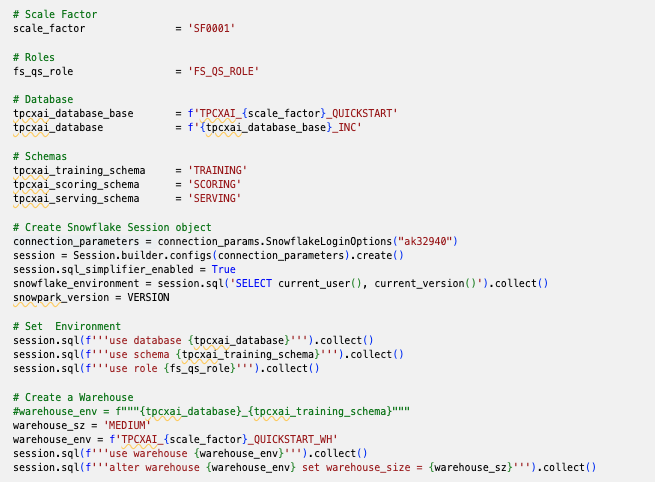

> 
> __Note:__ If you are lacking specific elevated privileges needed for some of the operations, you may encounter issues executing some of the steps.  You will need to work with an Account administrator to resolve these.

Once you have successfully executed the Notebook, you can check in Snowsight that your environment has been created.  The Database viewer should look something like this:

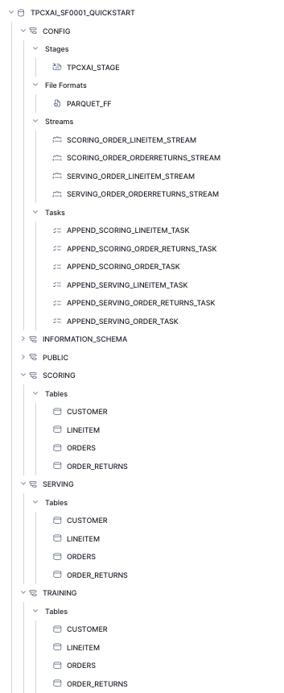

You will find a similar hierarchy under the TPCXAI_SF0001_QUICKSTART_INC

We can see that a number of Streams & Tasks have been created that are running frequently to incrementally add new data into your __TPCXAI_SF0001_QUICKSTART_INC__ database tables.  We can check that these are running by looking at Snowsight Task History under Monitoring on the left-hand side.  Once it has been running for a while it should something like this.

> 
> __Note:__ If you have only just created the Tasks you will see less execution history.

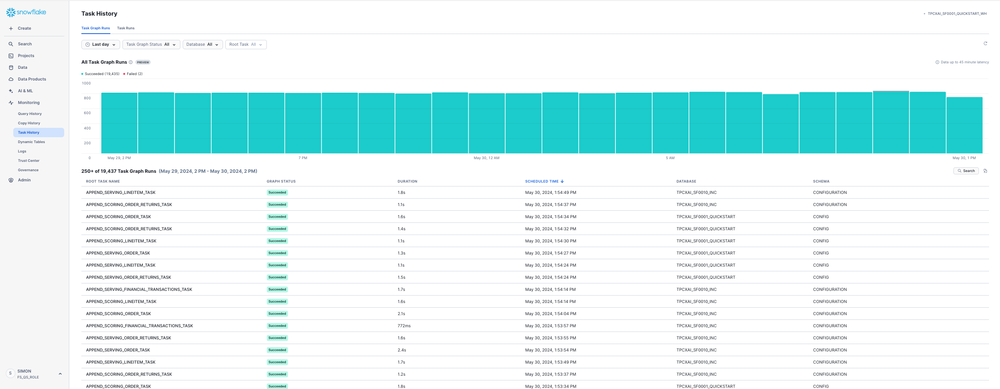

You can drill into the Task details from the Data viewer.  For example:

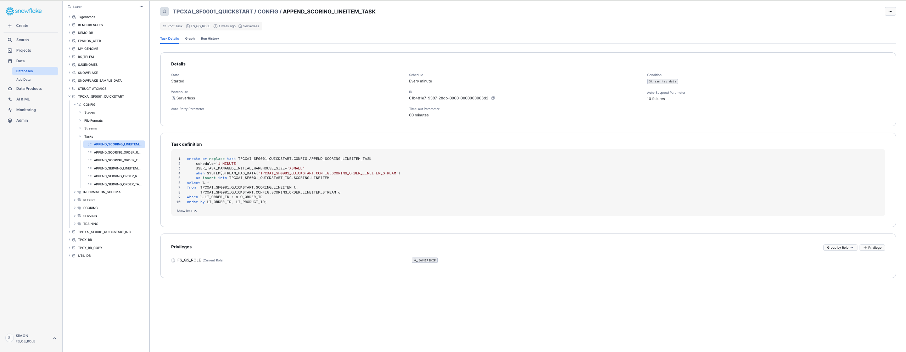

You can see that the Tasks are set to execute every minute if new data is available.  Feel free to reduce the frequency should you want to, although you will then need to wait longer to observe changes in FeatureViews when you create them in the Guide.

> 
> __Note:__ If you are going to leave these running for any length of time, assuming you are completing the Guide over a few days. You should also `SUSPEND` the Tasks to minimise costs.  You can `RESUME` them when you want to restart, and they will pick up where they left off, loading any additional data for the interim period.  You can do this via the Elipsis in the top-right corner, or programmatically with SQL if you prefer.


<!-- ------------------------ -->
## Feature Engineering & Model Training

### Key Snowfake Feature Store API Concepts
In the Snowflake Feature Store, as typical of other Feature Store solutions:
* __Entities__ - define the business-entity and the level that we want to gather data and develop ML models at. (e.g. store or/and product key etc). 
* __Features__ are defined and grouped within __FeatureViews__.  In Snowflake Feature Store features are columns, or column-expressions defined via the Snowpark for Python dataframe api, or via SQL directly.
* __FeatureViews__ are associated (defined) for one or more __Entities__. A __FeatureView__ can be defined with 1:n Entities, but typically only one.
Several (many) __FeatureViews__ may contain Features for the same Entity. FeatureViews tend to get defined based on the data-source they are derived from, the data’s refresh or calculation frequency.  A __FeatureView__ us defined via a Snowpark Dataframe (or SQL expression) enabling a complex pipeline to be used.
* The __Entity__ (key columns) are used to join __FeatureViews__ together when needed to gather features from multiple __FeatureViews__ within a single training or inference dataset, or derive new __FeatureViews__.
* A __FeatureSlice__ provides a way of creating a subset of the Features from a single __FeatureViews__ when needed.  It can be used within the API, pretty much anywhere the __FeatureViews__ can be used.
* __FeatureViews__ and __FeatureSlices__ can be merged (via merge_features) to gather features together and create a new __FeatureView__. For example, all the features for a given __Entity__ could be gathered via the merge into a single. 

You can  learn more about Snowflake Feature Store in this [section](https://docs.snowflake.com/developer-guide/snowpark-ml/feature-store/overview) of the documentation. 

### Setting up the Feature Store
With our database established, we are now ready to get started on Feature Engineering and Model Training.  Open the Jupyter Notebook ([Step02_TPCXAI_UC01_Feng_and_Train.ipynb](https://github.com/Snowflake-Labs/sfguide-getting-started-with-snowflake-feature-store/tree/main/Step02_TPCXAI_UC01_Feng_and_Train.ipynb)) to get started.  Adjust the Notebook connection method if needed for your environment.

You can step through the Notebook to create Feature Engineering Pipeline, Feature-Store & Model-Registry, interact with the Feature Store and train a model using Snowpark ML.  We will describe some of the key steps in the Notebook below.

> 
> __Note:__ You can now adjust your ***connection.json*** file, to reflect the database, schema and warehouse that you have created in the prior Step.

> 
> __Note:__ As before , pay particular attention to the third code cell, and make any adjustments needed for your account/environment and user. See below:


We use a couple of helper functions `create_FeatureStore` and `create_ModelRegistry` imported from `useful_fns.py` to create our Feature-Store and Model-Registry.  These functions check for the prior creation of these, and create them if they are not already created.  If they are already created they create a python class-instance referencing them.

Creating the Feature Store creates a schema (with the provided name `_TRAINING_FEATURE_STORE` ) in our (__TPCXAI_SF0001_QUICKSTART_INC__) database. This schema contains all the objects created through your interactions with the Python Feature Store API.  Database objects are tagged with Feature Store related tags to denote that they are part of the Feature Store.  These tags are used by Snowsight to discover and present Feature Store objects.  The two main other types of database objects that you will see being created are Dynamic Tables and Views.  We will describe these in more detail later in this section.

The diagram below depicts the Feature Store information-architecture and how objects in the Python API relate to Database objects.

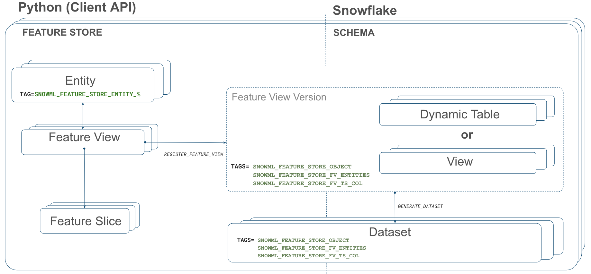

### Entity creation
Now we have our Feature Store created we can create the Entity that we will be using for this use case.  We are building a customer segmentation process, so we will primarily be deriving features at the Customer level.

```python
customer_entity = Entity(name="CUSTOMER", join_keys=["O_CUSTOMER_SK"],desc="Primary Key for CUSTOMER")
fs.register_entity(customer_entity)
```
The code above defines an instance of the Feature Store entity.  The `register_entity` method creates the object in the database. Entities are created as database tags.  Other Feature Store objects that are created that relate to this Entity are tagged with this tag as we will see shortly.

We can `list_entities()` which returns a Snowpark dataframe that can be `.show()` or filtered as needed.  We can also provide SQL wild-card expressions within `list_entities()` for filtering by name elements.

### Feature Engineering Pipeline
Feature engineering pipelines are defined using Snowpark dataframes (or SQL expressions).  In the `feature_engineering_fns.py` file We have created two feature engineering functions to create our pipeline :
* __uc01_load_data__(order_data: DataFrame, lineitem_data: DataFrame, order_returns_data: DataFrame) -> DataFrame   
* __uc01_pre_process__(data: DataFrame) -> DataFrame

`uc01_load_data`, takes the source tables, as dataframe objects, and joins them together, performing some data-cleansing by replacing NA's with default values. It returns a dataframe as it's output.

`uc01_pre_process`, takes the dataframe output from `uc01_load_data`  and performs aggregation on it to derive some features that will be used in our segmentation model.  It returns a dataframe as output, which we will use to provide the feature-pipeline definition within our FeatureView.

In this way we can build up a complex pipeline step-by-step and use it to derive a FeatureView, that will be maintained as a pipeline in Snowflake.

### FeatureView Creation
We will use the dataframe that we defined in the prior step for the FeatureView we are creating. The FeatureView will create a Dynamic Table in our Feature Store schema.  We could use the dataframe directly within the definition of the FeatureView.  The SQL query generated from Snowpark through the dataframe definition, is machine generated and not necessarily easy for a human to parse, when used and viewed within the Dynamic Table.  Therefore optionally we can parse the SQL and format it to something more human readable.  We use the `sqlglot` Python package to do this.  We created a simple function that takes the raw SQL generated from Snowpark, parses it and returns a formatted SQL statement. Depending on your preference, you can choose to convert sub-selects to common-table-expressions.  

The image below shows the FeatureView creation process, and calls out a few key elements of the FeatureView definition.

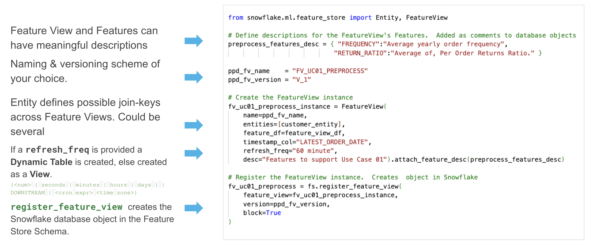

Similarly to the Entity creation,  this is a two step process, first creating the python instance, and then registering the instance to create an object in the database.  We provide the feature view name, version, description, and individual descriptions for each feature. We can create new versions of a Feature as it evolves, for example if the definition of some of the Features within change. Once created a version is immutable, unless a forced replacement is needed and invoked via `overwrite = True`. 

We add the Entity (`CUSTOMER`) that we created earlier. This allows the relationship, and join keys, available in the Feature View to be defined.  We will see how this is used when we want to retrieve Features from the feature store. 

If we provide `refresh_freq` [optional argument] the database object that is created from the Feature View definition is a Dynamic Table, otherwise a View is created.  In the case of a Dynamic Table, the table is initially populated with data, and from that point forward incrementally maintained when new data lands in the source tables. As we have created incrementing data sources, we can observe this incremental processing being applied to the table, using Snowsight's Dynamic Table observation features.  See the image below.


The Snowsight UI also contains a new section supporting Feature Store discovery and observability. can be used to search, discover and review available Features for a given machine-learning task, enabling re-use of features across multiple models, and expediting the time required to implement machine-learning projects. The below image shows the Snowsight UI Feature Store section, Entity level view.  We can see the FeatureView that we have created, under the Customer Entity.  We can also see other Entities, and FeatureViews that have been created for other use-cases within this Feature Store.

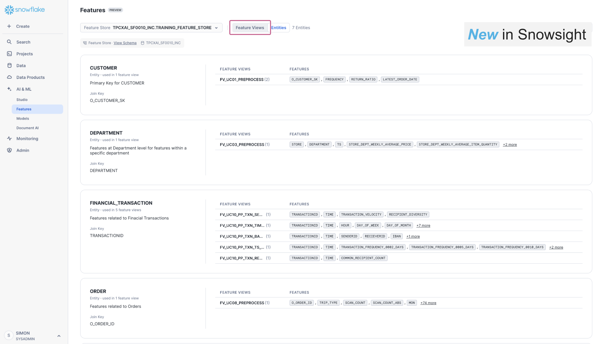

The feature-store provides lineage of data from source tables, through feature-engineering to model and model-inference enabling users to understand the broader impact in data-quality issues in source data, answering questions like:
  * what features and models are derived from this source/table.
  * what data-engineering and transformations are applied to derive this feature.

### Feature Retrieval
Now we have a Feature View with data being maintained within it, we can use it to retrieve data for model-training, and model-inference.  The Feature Store enables feature-values to be retrieved for a given set of Entity-keys, relative to a reference point-in-time.  Under the covers the Feature Store uses the new SQL AsOf join functionality in Snowflake to efficiently retrieve the requested features across the FeatureViews.  The Entity-Keys and Timestamps are provided as a dataframe, which we call a Spine.  The Spine can be defined using Snowpark Dataframe funcionality, or via a SQL expression.

For example, we can create the spine with the following:
```python
spine_sdf =  fv_uc01_preprocess.feature_df.group_by('O_CUSTOMER_SK').agg( F.max('LATEST_ORDER_DATE').as_('ASOF_DATE')
```

We can then use the Spine to create a Dataset.  Datasets are a new type of data-object in Snowflake that allows immutable datasets that are optimised for Machine Learning to be persisted and read directly into common machine learning frameworks like scikit-learn, Tensorflow and Pytorch.  We create the Dataset with the following:
```python
training_dataset = fs.generate_dataset( name = 'UC01_TRAINING',
                                        spine_df = spine_sdf, features = [fv_uc01_preprocess], 
                                        spine_timestamp_col = 'ASOF_DATE'
                                        )  
```
The Dataset can also be converted into other object types if needed.  For example, we can create a Snowpark Dataframe or a Pandas dataframe from the Dataset with the following code.
```python
# Snowpark Dataframe
training_dataset_sdf = training_dataset.read.to_snowpark_dataframe()
# Pandas Dataframe
training_dataset_pdf = training_dataset.read.to_pandas()
```

### Fit a Snowpark-ML Kmeans Model
We use the training Dataset we created in the previous step to fit a Snowpark-ML Kmeans model. You can read more about Snowpark ML Model Development in this [section](https://docs.snowflake.com/developer-guide/snowpark-ml/modeling) of the documentation. To do so we define our model fitting pipeline as a function that includes some feature pre-processing to scale our input variables using min-max scaling.  These transformations need to be applied at model time, as they capture the global state (e.g. minimum and maximum values for columns) of our training sample.

We fit the model and log it to the Model Registry that we created earlier. You can read more about Snowflake ML Model Registry in this [section](https://docs.snowflake.com/en/developer-guide/snowpark-ml/model-registry/overview) of the documentation. As with the Snowflake Feature Store, models in the registry are versioned. When we fit our model with Snowpark ML, using the Feature Store and register the model in the Registry, Snowflake captures the full lineage from source tables through to the model. We can interogate the lineage information to understand what models might be impacted by a data-quality problem in our source tables for example.

Model fitting and optimisation is typically a highly iterative process where different subsets of features, over varying data samples are used in combination with different sets of model hyper-parameters.  With feature store and model lineage and Model Registry all the the information related to each fitting run is captured, so that we have full Model Reproducibility and Discovery should we need. During this process we would normally check our model against a test dataset, to generate test-scores for the model.   Many more sophisticated  validation techniques exist, but are beyond the scope of this Guide. 

* Within-Cluster Sum of Squares
* Silhouette Score
* Gap Statistics
* Cross-Validation

In the Notebook we have simply plotted the clusters to review visually.

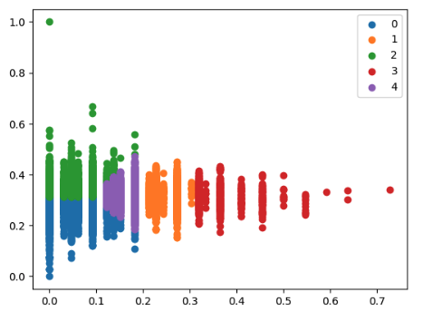

This ends the model-development phase.  From this point on, we assume that the simple model we created is good enough for production and operationalization. 

<!-- ------------------------ -->
## Model Operationalization in Production

We will use a new Notebook ([Step03_TPCXAI_UC01_Operations.ipynb](https://github.com/Snowflake-Labs/sfguide-getting-started-with-snowflake-feature-store/tree/main/Step03_TPCXAI_UC01_Operations.ipynb)) for the Model Operationalisation stage.  This may be created by a different person/role in the organisation. For example a data or ML engineer.  Open the Notebook and adjust the Notebook connection method if needed for your environment.

This notebook shows how you can easily replicate the training feature-engineering pipeline, created during model development, in the SERVING (_Production_) schema. We then create an inference function and deploy a new FeatureView that schedules ongoing inference from new data flowing through our Feature Engineering pipeline from our source data.  We can monitor the production pipeline (Dynamic Tables) using the same tools that we have already seen in the Feature Engineering and Model Training phase.

### Recreate the Feature-Engineering pipeline
We created FeatureViews in our `_TRAINING_FEATURE_STORE` (Development) schema.  We will create another Feature Store (`_SERVING_FEATURE_STORE`) for the Production environment. This will hold new FeatureViews created with the same definition, but running over Production data.  We can easily modify the tables that are referenced in production, versus development, by changing the Schema in the dataframe definition. We assume that the database tables are defined identically between development and production.

For this Guide we have chosen to share the Model-Registry across all environments as we will use the model we trained in Development, in Production for inference.  Alternatively, we could also create a new seperate Model Registry for production and Copy models between environments, or retrain the Model in production with appropriate checks and balances to ensure the new model over production data is still good for operationalisation.

When we register our model in the Model Registry it packages it as a Python function which enables direct access from [Python](https://docs.snowflake.com/developer-guide/snowpark-ml/model-registry/overview#calling-model-methods) or from [SQL](https://docs.snowflake.com/sql-reference/commands-model#label-snowpark-model-registry-model-methods).  This allows the creation of an inference Feature View that uses the model directly for prediction from our Feature Engineering pipeline, 

### Create an Inference Feature view
We define our model inference function, which we pass our feature values and model into.
```python
def uc01_serve(featurevector, km4_purchases) -> DataFrame:
    return km4_purchases.run(featurevector, function_name="predict")
```

We define a dataframe that reads all the records from our feature engineering pipeline. When used within the FeatureView, the Dynamic Table that gets created, will incrementally process change data once the initial Dynamic Table has been created. 
```python
inference_input_sdf = fs.read_feature_view(fv_uc01_preprocess)
```

We then create a FeatureView that will compute Inference on incremental data in the feature engineering pipeline, keeping an up to date set of customer segments through time.  
```python
## Create & Register Inference-FeatureView to run scheduled Inference
inf_fvname = "FV_UC01_INFERENCE_RESULT"
inf_fv_version = "V_1"

inference_features_desc = { "FREQUENCY":"Average yearly order frequency",
                              "RETURN_RATIO":"Average of, Per Order Returns Ratio.  Per order returns ratio : total returns value / total order value", 
                              "RETURN_RATIO_MMS":f"Min/Max Scaled version of RETURN_RATIO using Model Registry ({tpcxai_database}_MODEL_REGISTRY) Model ({mv.model_name}) Model-Version({mv.version_name}) Model Comment ({mv.comment})",
                              "FREQUENCY_MMS":f"Min/Max Scaled version of FREQUENCY using Model Registry ({tpcxai_database}_MODEL_REGISTRY) Model ({mv.model_name}) Model-Version({mv.version_name})  Model Comment ({mv.comment}",
                              "CLUSTER":f"Kmeans Cluster for Customer Clustering Model (UC01) using Model Registry ({tpcxai_database}_MODEL_REGISTRY) Model ({mv.model_name}) Model-Version({mv.version_name})  Model Comment ({mv.comment}"}

try:
   fv_uc01_inference_result = fs.get_feature_view(name= inf_fvname, version= inf_fv_version)
except:
   fv_uc01_inference_result = FeatureView(
         name= inf_fvname, 
         entities=[customer_entity], 
         feature_df=inference_result_sdf,
         refresh_freq="60 minute",  # <- specifying optional refresh_freq creates FeatureView as Dynamic Table, else created as View.         
         desc="Inference Result from kmeans model for Use Case 01").attach_feature_desc(inference_features_desc)
   
   fv_uc01_inference_result = fs.register_feature_view(
         feature_view=fv_uc01_inference_result, 
         version= inf_fv_version, 
         block=True
   )
   print(f"Inference Feature View : fv_uc01_inference_result_{inf_fv_version} created")   
else:
   print(f"Inference Feature View : fv_uc01_inference_result_{inf_fv_version} already created")
finally:
   fs_serving_fviews = fs.list_feature_views().filter(F.col("NAME") == inf_fvname ).sort(F.col("VERSION").desc())
   fs_serving_fviews.show() 
```

In the FeatureView definition we have embellished our feature comments with the model name and model-version to make it directly available in the database object definition, but this information can also be derived through the feature and model registry lineage api.

Once we have created the FeatureView we can retrieve inferences from it.

```python
fv_uc01_inference_result.feature_df.sort(F.col("LATEST_ORDER_DATE").desc()).show(100)
```
We can monitor how CUSTOMERS behaviour (segment) changes over time and take targetted action as a result.


<!-- ------------------------ -->
## Clean Up

Once you have completed this Guide and no longer need the databases and objects created by it you will want to clean up.  We provide a Notebook that does this. [Step04_TPCXAI_UC01_Cleanup.ipynb](https://github.com/Snowflake-Labs/sfguide-getting-started-with-snowflake-feature-store/tree/main/Step04_TPCXAI_UC01_Cleanup.ipynb)

If you want to keep the data, but shut down the Tasks and Dynamic Tables to minimise compute cost, you will need to go to each Task and Dynamic Table to `SUSPEND` them.  This can be done in the Snowsight UI, or you can use the applicable SQL commands to achieve the same.

<!-- ------------------------ -->
## Conclusion And Resources


Congratulations! You've successfully performed Feature Engineering using Snowpark, made use of Snowflake Feature Store to publish and maintain features in a development and production environment. You've learnt how you can deploy a model from the Snowflake Model Registry and combine it with a feature-engineering pipeline in Feature Store to operationalise an incremental inference process in Snowflake ML.

We would love your feedback on this Guide! Please submit your feedback using this [Feedback Form](https://forms.gle/JeZWYwkCMk3gty7D7).

### What You Learned

- How to analyze data and perform data engineering tasks using Snowpark DataFrames and APIs
- How to use open-source Python libraries from curated Snowflake Anaconda channel
- How to create Snowflake Tasks to automate data pipelines
- How to train ML model using Snowpark ML in Snowflake
- How to register ML model and use it for inference from Snowflake Model Registry
- How to create Streamlit application that uses the ML Model for inference based on user input

### Related Resources

- [Source Code on GitHub](https://github.com/Snowflake-Labs/sfguide-getting-started-with-snowflake-feature-store)
- [Intro to Machine Learning with Snowpark ML](/en/developers/guides/intro-to-machine-learning-with-snowpark-ml-for-python/)
- [Advanced: Snowpark for Python Data Engineering Guide](/en/developers/guides/data-engineering-pipelines-with-snowpark-python/)
- [Advanced: Snowpark for Python Machine Learning Guide](/en/developers/guides/getting-started-snowpark-machine-learning/)
- [Snowpark for Python Developer Guide](https://docs.snowflake.com/en/developer-guide/snowpark/python/index.html)
- [Snowpark for Python API Reference](https://docs.snowflake.com/en/developer-guide/snowpark/reference/python/index.html)
- [Snowflake Feature Store](https://docs.snowflake.com/developer-guide/snowpark-ml/feature-store/overview)
- [Snowpark ML Modelling](https://docs.snowflake.com/developer-guide/snowpark-ml/modeling)
- [Snowflake Model Registry](https://docs.snowflake.com/en/developer-guide/snowpark-ml/model-registry/overview)


<!-- ------------------------ -->
