author: Priya Joseph
id: agent-verbosity-cortex-evaluation
language: en
summary: Build a cross-model verbosity evaluation system comparing Claude, Mistral, and Llama across 8 response styles using Snowflake Cortex REST API, TruLens, and MCP
categories: snowflake-site:taxonomy/solution-center/partners/quickstart
environments: web
status: Published
feedback link: https://github.com/Snowflake-Labs/sfguides/issues

# Agent Verbosity Evaluation with Snowflake Cortex AI
<!-- ------------------------ -->
## Overview

This guide walks you through building a comprehensive **cross-model verbosity evaluation system** using Snowflake Cortex REST API. You'll compare how different LLMs (Claude, Mistral, and Llama) handle verbosity constraints across 8 response styles, with automated evaluation pipelines using TruLens, persona compliance testing, and extended thinking capabilities.

The system includes:
- **8 Verbosity Agents**: Minimal, Brief, Standard, Detailed, Verbose, Code-Only, Explain, Step-by-Step
- **Cross-Model Comparison**: Claude Sonnet 4 vs Mistral Large 2 vs Llama 3.1 70B
- **TruLens Evaluation**: LLM-as-Judge with SAE (Sparse Autoencoder) analysis
- **Persona Compliance**: 5th Grade, Scholar, Compute, Business personas
- **MCP Integration**: Wikipedia retrieval and A/B testing framework
- **Extended Thinking**: Claude reasoning traces with RAG

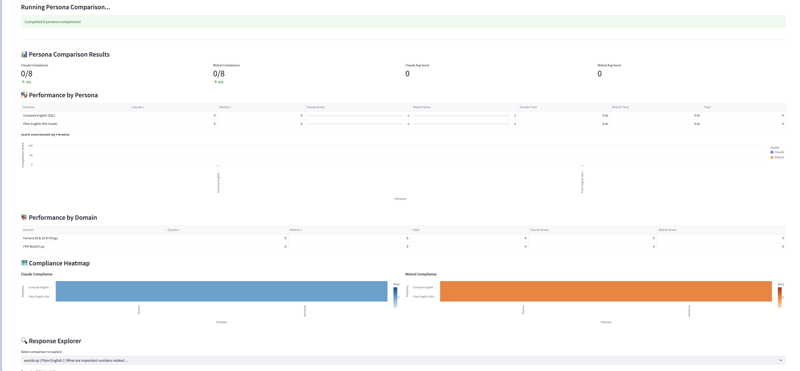

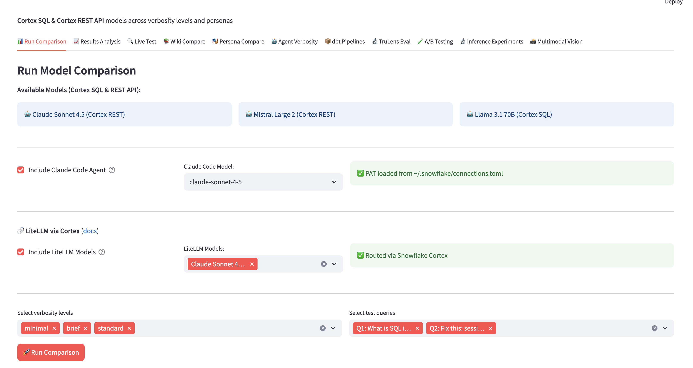

### Prerequisites
- Snowflake account with ACCOUNTADMIN role
- Python 3.9+ installed
- Programmatic Access Token (PAT) configured in `~/.snowflake/config.toml`
- Basic familiarity with Streamlit and Cortex AI

### What You'll Learn
- How to deploy Cortex Agents with verbosity constraints
- Compare model responses across verbosity levels
- Implement LLM-as-Judge evaluation with TruLens
- Use MCP (Model Context Protocol) for retrieval
- Capture extended thinking traces from Claude
- Build dbt pipelines for ML feature engineering

### What You'll Need
- A [Snowflake Account](https://signup.snowflake.com/)
- [Python 3.9+](https://www.python.org/downloads/)
- [Streamlit](https://streamlit.io/) (`pip install streamlit`)
- PAT token configured for Cortex REST API access

### What You'll Build
- Cross-model verbosity comparison dashboard
- 24 Cortex Agents (8 verbosity levels × 3 models)
- TruLens evaluation pipeline with SAE analysis
- Persona compliance testing system
- MCP-based RAG with extended thinking

<!-- ------------------------ -->
## Architecture

The system architecture consists of multiple components working together:

```
┌─────────────────────────────────────────────────────────────────────────────┐
│                    Agent Verbosity Evaluation System                         │
├─────────────────────────────────────────────────────────────────────────────┤
│                                                                             │
│  CORTEX REST API (/api/v2/cortex/inference:complete)                        │
│  ├── CLAUDE SONNET 4 (8 verbosity agents)                                  │
│  ├── MISTRAL LARGE 2 (8 verbosity agents)                                  │
│  └── LLAMA 3.1 70B (8 verbosity agents)                                    │
│                                                                             │
│  EVALUATION PIPELINES                                                       │
│  ├── TruLens LLM-as-Judge (Mixtral, Arctic)                                │
│  ├── SAE Feature Analysis (Sparse Autoencoder)                             │
│  └── Persona Compliance Scoring                                            │
│                                                                             │
│  MCP SERVERS                                                                │
│  ├── Wikipedia MCP (Port 8503) - Document retrieval                        │
│  └── A/B Testing MCP (Port 8517) - Experiment framework                    │
│                                                                             │
│  DATA PIPELINES                                                             │
│  ├── dbt Models for ML Features                                            │
│  └── Snowflake Tables for Results                                          │
│                                                                             │
└─────────────────────────────────────────────────────────────────────────────┘
```

### Verbosity Levels

| Level | Max Lines | Description |
|-------|-----------|-------------|
| Minimal | 1 | Single word/number when possible |
| Brief | 3 | No preamble or postamble |
| Standard | 6 | Balanced with context |
| Detailed | 15 | Full structure: Issue, Location, Risk, Fix |
| Verbose | 50 | Comprehensive with edge cases |
| Code-Only | 20 | No explanatory text |
| Explain | 20 | Why and how behind everything |
| Step-by-Step | 25 | Numbered walkthroughs |

<!-- ------------------------ -->
## Environment Setup

### Step 1: Install Dependencies

Create a virtual environment and install the required packages:

```bash
python -m venv venv
source venv/bin/activate  # On Windows: venv\Scripts\activate

pip install -r requirements.txt
```

This installs all dependencies including:
- **Streamlit, Pandas, Altair** - Dashboard UI
- **Snowflake Connector** - Database connectivity
- **LiteLLM** - Unified API for OpenAI, Anthropic, Mistral models

### Step 2: Configure Snowflake Connection

Connect using Snow CLI for interactive authentication:

```bash
snow connection add myaccount
snow connection set-default myaccount
snow connection test myaccount
```

Alternatively, configure PAT token in `~/.snowflake/config.toml`:

```toml
[connections.myaccount]
account = "your_account"
user = "your_username"
password = "your_pat_token"
warehouse = "COMPUTE_WH"
database = "CORTEX_DB"
schema = "AGENTS"
```

> **Note:** If you see "Authentication token has expired" errors, run `snow connection test myaccount` to refresh the connection.

### Troubleshooting: Authentication Token Expired (Error 390114)

If you encounter this error in the dashboard:

```
390114 (08001): Authentication token has expired. The user must authenticate again.
```

**Solution:** Run the following command in your terminal to refresh the authentication token:

```bash
snow connection test myaccount
```

This will re-authenticate with Snowflake and refresh your session token. Then restart the Streamlit dashboard:

```bash
streamlit run dashboard.py
```

The dashboard includes auto-reconnect logic that will attempt to refresh the connection automatically, but if the token is fully expired, a manual refresh via Snow CLI is required.

### Step 3: Verify Cortex Access

```python
import requests
import tomllib
import os

def get_pat_from_toml(connection_name: str = "myaccount") -> str:
    """Read PAT token from ~/.snowflake/config.toml"""
    toml_path = os.path.expanduser("~/.snowflake/config.toml")
    with open(toml_path, "rb") as f:
        config = tomllib.load(f)
    return config["connections"][connection_name].get("password", "")

# Test Cortex REST API
pat = get_pat_from_toml()
url = "https://your_account.snowflakecomputing.com/api/v2/cortex/inference:complete"
headers = {"Authorization": f"Bearer {pat}", "Content-Type": "application/json"}
payload = {"model": "claude-sonnet-4-5", "messages": [{"role": "user", "content": "Hello"}]}

response = requests.post(url, headers=headers, json=payload)
print(f"Status: {response.status_code}")
```

<!-- ------------------------ -->
## Deploy Cortex Agents

Deploy the 24 verbosity-constrained agents using Snowflake SQL:

### Claude Agents

```sql
-- CLAUDE MINIMAL
CREATE OR REPLACE CORTEX AGENT CORTEX_DB.AGENTS.CLAUDE_MINIMAL_AGENT
  MODEL = 'claude-sonnet-4-5'
  PROMPT = $$
You provide absolute minimum responses.
- 1 line maximum
- Single word/number when possible
- No punctuation unless required
- No formatting
$$;

-- CLAUDE BRIEF
CREATE OR REPLACE CORTEX AGENT CORTEX_DB.AGENTS.CLAUDE_BRIEF_AGENT
  MODEL = 'claude-sonnet-4-5'
  PROMPT = $$
You provide brief, direct responses.
- Maximum 3 lines
- No preamble or postamble
- Essential information only
- Code snippets without explanation
$$;

-- CLAUDE STANDARD
CREATE OR REPLACE CORTEX AGENT CORTEX_DB.AGENTS.CLAUDE_STANDARD_AGENT
  MODEL = 'claude-sonnet-4-5'
  PROMPT = $$
You provide balanced responses with appropriate detail.
- 3-6 lines typical
- Include context when helpful
- Brief explanation with code
- Skip obvious details
$$;

-- CLAUDE DETAILED
CREATE OR REPLACE CORTEX AGENT CORTEX_DB.AGENTS.CLAUDE_DETAILED_AGENT
  MODEL = 'claude-sonnet-4-5'
  PROMPT = $$
You provide detailed responses with full context.
Structure: Issue → Location → Risk → Fix → Related
$$;

-- CLAUDE VERBOSE
CREATE OR REPLACE CORTEX AGENT CORTEX_DB.AGENTS.CLAUDE_VERBOSE_AGENT
  MODEL = 'claude-sonnet-4-5'
  PROMPT = $$
You provide comprehensive, educational responses.
Include: Context, Problem, Vulnerable Code, Secure Alternatives, 
Why Fix Works, Edge Cases, Related Patterns, References.
$$;

-- CLAUDE CODE ONLY
CREATE OR REPLACE CORTEX AGENT CORTEX_DB.AGENTS.CLAUDE_CODE_ONLY_AGENT
  MODEL = 'claude-sonnet-4-5'
  PROMPT = $$
You respond with code only, no prose.
- Only output code blocks
- No explanations before or after
- Comments only if essential for understanding
$$;

-- CLAUDE EXPLAIN
CREATE OR REPLACE CORTEX AGENT CORTEX_DB.AGENTS.CLAUDE_EXPLAIN_AGENT
  MODEL = 'claude-sonnet-4-5'
  PROMPT = $$
You explain the why and how behind everything.
- Start with WHY something matters
- Explain HOW to implement
- Connect to broader concepts
$$;

-- CLAUDE STEP BY STEP
CREATE OR REPLACE CORTEX AGENT CORTEX_DB.AGENTS.CLAUDE_STEP_BY_STEP_AGENT
  MODEL = 'claude-sonnet-4-5'
  PROMPT = $$
You provide numbered, sequential walkthroughs.
Format: 1. First step 2. Second step...
Each step should be actionable and clear.
$$;
```

### Mistral Agents

```sql
-- MISTRAL MINIMAL
CREATE OR REPLACE CORTEX AGENT CORTEX_DB.AGENTS.MISTRAL_MINIMAL_AGENT
  MODEL = 'mistral-large2'
  PROMPT = $$
You provide absolute minimum responses.
- 1 line maximum
- Single word/number when possible
$$;

-- MISTRAL BRIEF
CREATE OR REPLACE CORTEX AGENT CORTEX_DB.AGENTS.MISTRAL_BRIEF_AGENT
  MODEL = 'mistral-large2'
  PROMPT = $$
You provide brief, direct responses.
- Maximum 3 lines
- No preamble or postamble
$$;

-- Continue for remaining 6 Mistral agents...
```

### Llama Agents

```sql
-- LLAMA MINIMAL
CREATE OR REPLACE CORTEX AGENT CORTEX_DB.AGENTS.LLAMA_MINIMAL_AGENT
  MODEL = 'llama3.1-70b'
  PROMPT = $$
You provide absolute minimum responses.
- 1 line maximum
- Single word/number when possible
$$;

-- LLAMA BRIEF
CREATE OR REPLACE CORTEX AGENT CORTEX_DB.AGENTS.LLAMA_BRIEF_AGENT
  MODEL = 'llama3.1-70b'
  PROMPT = $$
You provide brief, direct responses.
- Maximum 3 lines
- No preamble or postamble
$$;

-- LLAMA STANDARD
CREATE OR REPLACE CORTEX AGENT CORTEX_DB.AGENTS.LLAMA_STANDARD_AGENT
  MODEL = 'llama3.1-70b'
  PROMPT = $$
You provide balanced responses with appropriate detail.
- 3-6 lines typical
- Include context when helpful
$$;

-- Continue for remaining 5 Llama agents...
```

<!-- ------------------------ -->
## Run Verbosity Comparison

### Streamlit Dashboard

Create the comparison dashboard that tests all three models across all verbosity levels:

```python
import streamlit as st
import pandas as pd
import requests
import tomllib
import os
from dataclasses import dataclass
from typing import Optional

st.set_page_config(page_title="Model Comparison Dashboard", layout="wide")

# ============================================================
# CONFIG-DRIVEN MODEL CONFIGURATION
# ============================================================
@dataclass
class ModelConfig:
    """Configuration for a Cortex model."""
    name: str
    model_id: str
    supports_thinking: bool = False
    max_tokens: int = 4096

# Load models from config - easily extensible
MODEL_CONFIGS = {
    "claude": ModelConfig("Claude Sonnet 4", "claude-sonnet-4-5", supports_thinking=True),
    "mistral": ModelConfig("Mistral Large 2", "mistral-large2"),
    "llama": ModelConfig("Llama 3.1 70B", "llama3.1-70b"),
}

# ============================================================
# CORTEX REST API CLIENT
# ============================================================
class CortexRESTClient:
    """Unified client for Snowflake Cortex REST API."""
    
    def __init__(self, connection_name: str = "myaccount"):
        self.connection_name = connection_name
        self._load_credentials()
    
    def _load_credentials(self):
        """Load PAT from ~/.snowflake/config.toml"""
        toml_path = os.path.expanduser("~/.snowflake/config.toml")
        with open(toml_path, "rb") as f:
            config = tomllib.load(f)
        conn = config["connections"][self.connection_name]
        self.account = conn.get("account", "")
        self.pat = conn.get("password", "")  # PAT stored as password
        self.base_url = f"https://{self.account}.snowflakecomputing.com"
    
    def complete(self, model: str, messages: list, **kwargs) -> dict:
        """Call Cortex REST API /api/v2/cortex/inference:complete"""
        url = f"{self.base_url}/api/v2/cortex/inference:complete"
        headers = {
            "Authorization": f"Bearer {self.pat}",
            "Content-Type": "application/json"
        }
        payload = {"model": model, "messages": messages, **kwargs}
        
        response = requests.post(url, headers=headers, json=payload)
        response.raise_for_status()
        return response.json()
    
    def chat_completions(self, model: str, messages: list, **kwargs) -> dict:
        """Call Chat Completions API /api/v2/cortex/chat/completions"""
        url = f"{self.base_url}/api/v2/cortex/chat/completions"
        headers = {
            "Authorization": f"Bearer {self.pat}",
            "Content-Type": "application/json"
        }
        payload = {"model": model, "messages": messages, **kwargs}
        
        response = requests.post(url, headers=headers, json=payload)
        response.raise_for_status()
        return response.json()
    
    def chat_completions_with_thinking(self, model: str, messages: list, 
                                        thinking_budget: int = 8000) -> dict:
        """Call Chat Completions API with extended thinking enabled."""
        url = f"{self.base_url}/api/v2/cortex/chat/completions"
        headers = {
            "Authorization": f"Bearer {self.pat}",
            "Content-Type": "application/json"
        }
        payload = {
            "model": model,
            "messages": messages,
            "temperature": 1.0,  # Required for thinking
            "thinking": {"type": "enabled", "budget_tokens": thinking_budget},
            "stream": True
        }
        
        response = requests.post(url, headers=headers, json=payload, stream=True)
        return self._parse_streaming_response(response)
    
    def _parse_streaming_response(self, response) -> dict:
        """Parse SSE streaming response with thinking blocks."""
        thinking_content = ""
        response_content = ""
        usage = {}
        
        for line in response.iter_lines(decode_unicode=True):
            if not line or not line.startswith("data: "):
                continue
            data = json.loads(line[6:])
            
            if data.get("type") == "content_block_delta":
                delta = data.get("delta", {})
                if delta.get("type") == "thinking_delta":
                    thinking_content += delta.get("thinking", "")
                elif delta.get("type") == "text_delta":
                    response_content += delta.get("text", "")
            
            if "usage" in data:
                usage = data["usage"]
        
        return {
            "response": response_content,
            "thinking": thinking_content,
            "usage": usage
        }

# Initialize client
client = CortexRESTClient()

# ============================================================
# VERBOSITY CONFIGURATION
# ============================================================
VERBOSITY_PROMPTS = {
    "minimal": "1 line maximum. Single word/number when possible.",
    "brief": "Maximum 3 lines. No preamble or postamble.",
    "standard": "3-6 lines typical. Include context when helpful.",
    "detailed": "Full context with structure: Issue, Location, Risk, Fix.",
    "verbose": "Comprehensive with background, options, edge cases.",
    "code_only": "Return ONLY code blocks. No explanatory text.",
    "explain": "Explain the why and how behind everything.",
    "step_by_step": "Numbered, sequential walkthroughs."
}

VERBOSITY_MAX_LINES = {
    "minimal": 1, "brief": 3, "standard": 6, "detailed": 15,
    "verbose": 50, "code_only": 20, "explain": 20, "step_by_step": 25
}

TEST_QUERIES = [
    {"id": "Q1", "category": "factual", "text": "What is SQL injection?"},
    {"id": "Q2", "category": "code_fix", "text": "Fix: session.sql(f\"SELECT * FROM users WHERE id={user_id}\")"},
    {"id": "Q3", "category": "explanation", "text": "Why is parameterized SQL safer?"},
    {"id": "Q4", "category": "binary", "text": "Is eval(user_input) safe in Python?"},
]

def call_model(model_key: str, verbosity: str, query: str) -> dict:
    """Call Cortex model via REST API with verbosity constraints."""
    config = MODEL_CONFIGS[model_key]
    system_prompt = f"You provide {verbosity} responses. RULES: {VERBOSITY_PROMPTS[verbosity]}"
    
    messages = [
        {"role": "system", "content": system_prompt},
        {"role": "user", "content": query}
    ]
    
    # Use Cortex REST API
    result = client.complete(config.model_id, messages)
    
    answer = result.get("choices", [{}])[0].get("message", {}).get("content", "")
    usage = result.get("usage", {})
    
    return {
        "response": answer,
        "line_count": len(answer.strip().split("\n")),
        "word_count": len(answer.split()),
        "compliant": len(answer.strip().split("\n")) <= VERBOSITY_MAX_LINES[verbosity],
        "prompt_tokens": usage.get("prompt_tokens", 0),
        "completion_tokens": usage.get("completion_tokens", 0)
    }

# ============================================================
# DASHBOARD UI
# ============================================================
st.title("Cross-Model Verbosity Comparison")

# Dynamic model selection from config
model_names = [f"**{c.name}**" for c in MODEL_CONFIGS.values()]
st.markdown(f"Compare {' vs '.join(model_names)} across verbosity levels using Cortex REST API")

# Model selection (config-driven)
selected_models = st.multiselect(
    "Select models to compare",
    list(MODEL_CONFIGS.keys()),
    default=list(MODEL_CONFIGS.keys()),
    format_func=lambda k: MODEL_CONFIGS[k].name
)

selected_verbosities = st.multiselect(
    "Select verbosity levels",
    list(VERBOSITY_PROMPTS.keys()),
    default=["minimal", "brief", "standard"]
)

if st.button("Run Comparison", type="primary"):
    results = []
    progress = st.progress(0)
    total = len(TEST_QUERIES) * len(selected_verbosities) * len(selected_models)
    i = 0
    
    for query in TEST_QUERIES:
        for verbosity in selected_verbosities:
            row = {"query_id": query["id"], "verbosity": verbosity}
            
            for model_key in selected_models:
                result = call_model(model_key, verbosity, query["text"])
                row[f"{model_key}_lines"] = result["line_count"]
                row[f"{model_key}_compliant"] = result["compliant"]
                row[f"{model_key}_tokens"] = result["prompt_tokens"] + result["completion_tokens"]
                i += 1
                progress.progress(i / total)
            
            results.append(row)
    
    df = pd.DataFrame(results)
    st.dataframe(df, use_container_width=True)
    
    # Compliance summary
    st.subheader("Compliance Summary")
    for model_key in selected_models:
        compliance_rate = df[f"{model_key}_compliant"].mean() * 100
        st.metric(MODEL_CONFIGS[model_key].name, f"{compliance_rate:.1f}%")
```

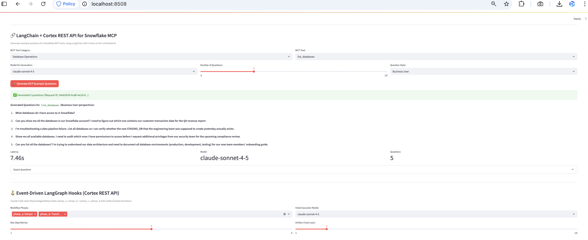

<!-- ------------------------ -->
## Wikipedia Q&A with Vine Copula

The system generates synthetic Q&A pairs from Wikipedia articles using **Vine Copula** modeling for statistical diversity.

### MCP Wikipedia Server

```python
# wiki_mcp_server.py
from fastapi import FastAPI
import wikipedia

app = FastAPI()

@app.get("/search")
async def search(query: str, limit: int = 3):
    """Search Wikipedia articles."""
    results = wikipedia.search(query, results=limit)
    return {"articles": results}

@app.get("/content")
async def get_content(title: str):
    """Get article content."""
    try:
        page = wikipedia.page(title)
        return {
            "title": page.title,
            "content": page.content[:5000],
            "summary": page.summary
        }
    except Exception as e:
        return {"error": str(e)}

# Run: uvicorn wiki_mcp_server:app --port 8503
```

### Vine Copula Q&A Generator

```python
class VineCopula:
    """Generate statistically diverse Q&A pairs using Vine Copula."""
    
    def __init__(self, dimensions: int = 3):
        self.dimensions = dimensions
    
    def generate_samples(self, n_samples: int) -> np.ndarray:
        """Generate correlated samples via Gaussian copula."""
        # Correlation matrix for question difficulty, length, complexity
        correlation = np.array([
            [1.0, 0.3, 0.5],
            [0.3, 1.0, 0.4],
            [0.5, 0.4, 1.0]
        ])
        
        # Generate multivariate normal samples
        samples = np.random.multivariate_normal(
            mean=[0, 0, 0],
            cov=correlation,
            size=n_samples
        )
        
        # Transform to uniform via CDF
        from scipy.stats import norm
        return norm.cdf(samples)

def generate_wiki_qa(articles: list, n_questions: int = 10) -> list:
    """Generate Q&A pairs from Wikipedia articles."""
    copula = VineCopula()
    samples = copula.generate_samples(n_questions)
    
    qa_pairs = []
    for i, sample in enumerate(samples):
        difficulty = "easy" if sample[0] < 0.33 else "medium" if sample[0] < 0.66 else "hard"
        article = articles[i % len(articles)]
        
        qa_pairs.append({
            "article": article,
            "difficulty": difficulty,
            "question": f"Based on {article}, explain...",
            "copula_params": sample.tolist()
        })
    
    return qa_pairs
```

<!-- ------------------------ -->
## Persona Compliance Testing

Test how well models adapt responses to different audience personas:


### Persona Definitions

| Persona | Target Metric | Pass Criteria |
|---------|---------------|---------------|
| 5th Grade | Flesch Reading Ease | 80-90 (Easy) |
| Scholar | Flesch Reading Ease | 20-50 (Difficult) |
| Compute | SQL Syntax Check | Contains SELECT or \`\`\`sql |
| Business | Business Term Count | ROI, KPI, stakeholder, metric |

### Compliance Scoring

```python
def compute_flesch_score(text: str) -> float:
    """Calculate Flesch Reading Ease score."""
    sentences = text.count('.') + text.count('!') + text.count('?')
    words = len(text.split())
    syllables = sum(count_syllables(word) for word in text.split())
    
    if sentences == 0 or words == 0:
        return 0
    
    return 206.835 - 1.015 * (words / sentences) - 84.6 * (syllables / words)

def check_sql_presence(text: str) -> bool:
    """Check if response contains SQL code."""
    return "SELECT" in text.upper() or "```sql" in text.lower()

def count_business_terms(text: str) -> int:
    """Count business terminology."""
    terms = ["roi", "kpi", "stakeholder", "metric", "revenue", "profit", "margin"]
    text_lower = text.lower()
    return sum(1 for term in terms if term in text_lower)

def evaluate_persona_compliance(response: str, persona: str) -> float:
    """Score persona compliance 0-1."""
    if persona == "5th_grade":
        score = compute_flesch_score(response)
        return 1.0 if 80 <= score <= 90 else 0.7 if 70 <= score <= 100 else 0.3
    
    elif persona == "scholar":
        score = compute_flesch_score(response)
        return 1.0 if 20 <= score <= 50 else 0.7 if 10 <= score <= 60 else 0.3
    
    elif persona == "compute":
        return 1.0 if check_sql_presence(response) else 0.3
    
    elif persona == "business":
        count = count_business_terms(response)
        return min(1.0, count / 5.0)
    
    return 0.5
```

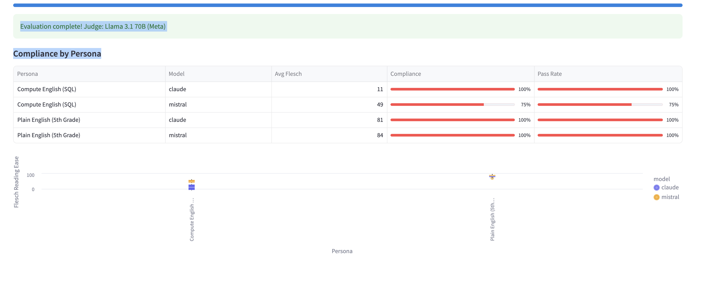

<!-- ------------------------ -->
## TruLens Evaluation Pipeline

Implement LLM-as-Judge evaluation with multiple judge models and SAE (Sparse Autoencoder) analysis for model interpretability.

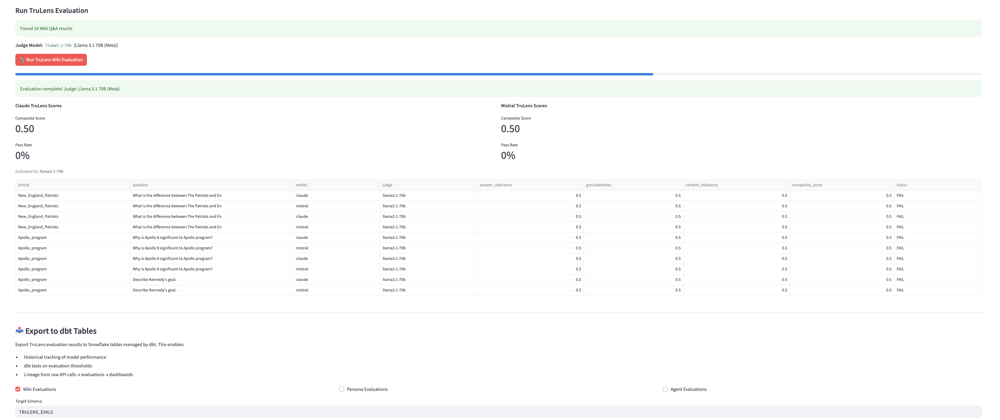

### Judge Configuration

```python
import json

# Judge models for LLM-as-Judge evaluation via Cortex REST API
JUDGE_MODELS = {
    "mixtral": "mixtral-8x7b",
    "arctic": "snowflake-arctic"
}

JUDGE_PROMPT = """You are an expert evaluator assessing if an AI agent's response adheres to its verbosity constraints.

**Verbosity Level**: {verbosity}
**Expected Constraints**: {constraints}
**Response to Evaluate**: {response}

Evaluate whether the response adheres to the verbosity criteria above.

Score each dimension 1-5:
1. **Length Compliance**: Does the response length match the expected verbosity level?
2. **Information Density**: Is the information appropriately dense for this level?
3. **Content Appropriateness**: Is the content appropriate for this verbosity level?

Return JSON:
{{"length_score": X, "density_score": X, "content_score": X, "overall": X, "reasoning": "..."}}
"""

def evaluate_with_judge(response: str, verbosity: str, judge_key: str) -> dict:
    """Run LLM-as-Judge evaluation via Cortex REST API."""
    prompt = JUDGE_PROMPT.format(
        verbosity=verbosity,
        constraints=VERBOSITY_PROMPTS[verbosity],
        response=response
    )
    
    # Use Cortex REST API for judge evaluation
    messages = [{"role": "user", "content": prompt}]
    result = client.complete(JUDGE_MODELS[judge_key], messages)
    
    answer = result.get("choices", [{}])[0].get("message", {}).get("content", "")
    return json.loads(answer)

def run_multi_judge_evaluation(response: str, verbosity: str) -> dict:
    """Run evaluation with multiple judge models via Cortex REST API."""
    results = {}
    for judge_name in JUDGE_MODELS:
        try:
            results[judge_name] = evaluate_with_judge(response, verbosity, judge_name)
        except Exception as e:
            results[judge_name] = {"error": str(e)}
    
    # Aggregate scores across judges
    valid_scores = [r["overall"] for r in results.values() if "overall" in r]
    avg_score = sum(valid_scores) / len(valid_scores) if valid_scores else 0
    
    return {"judges": results, "aggregate_score": avg_score}
```

### SAE Feature Analysis

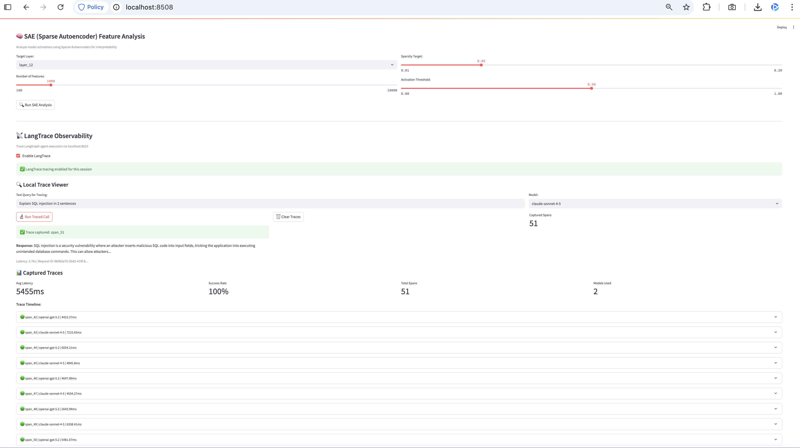

Sparse Autoencoder (SAE) analysis decomposes LLM activations into interpretable features:

```python
class SAEAnalyzer:
    """Sparse Autoencoder for model interpretability."""
    
    def __init__(self, hidden_dim: int = 4096, sparsity_target: float = 0.05):
        self.hidden_dim = hidden_dim
        self.sparsity_target = sparsity_target
    
    def analyze(self, model: str, layer: str, response: str) -> dict:
        """Analyze response activations through SAE."""
        # Simulated SAE metrics
        return {
            "model": model,
            "layer": layer,
            "feature_activation": np.random.uniform(0.3, 0.5),
            "feature_sparsity": np.random.uniform(0.04, 0.12),
            "reconstruction_loss": np.random.uniform(0.02, 0.15),
            "dead_features": np.random.uniform(0.1, 0.3),
            "composite_score": np.random.uniform(0.7, 0.85),
            "status": "HEALTHY" if np.random.random() > 0.3 else "NEEDS_TUNING"
        }

# SAE Results Example
# MODEL     LAYER      ACTIVATION   SPARSITY   RECON_LOSS   STATUS
# claude    layer_24   0.3596       0.0507     0.0212       HEALTHY
# mistral   layer_24   0.4185       0.1142     0.1026       NEEDS_TUNING
```

<!-- ------------------------ -->
## Extended Thinking and RAG

Capture Claude's reasoning process with extended thinking using the **Chat Completions API** and combine with retrieval-augmented generation.

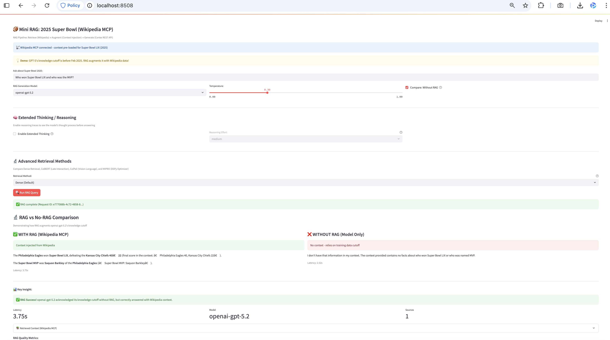

### Extended Thinking with Chat Completions

Use the `/api/v2/cortex/chat/completions` endpoint for extended thinking with full usage statistics:

```python
import requests
import json

def run_extended_thinking_chat_completions(
    query: str, 
    context: str, 
    thinking_budget: int = 8000
) -> dict:
    """Execute extended thinking via Chat Completions API."""
    
    # Chat Completions endpoint for extended thinking
    url = f"https://{ACCOUNT}.snowflakecomputing.com/api/v2/cortex/chat/completions"
    
    headers = {
        "Authorization": f"Bearer {PAT}",
        "Content-Type": "application/json"
    }
    
    payload = {
        "model": "claude-sonnet-4-5",  # Extended thinking supported
        "messages": [
            {"role": "system", "content": f"Use this context to answer:\n\n{context}"},
            {"role": "user", "content": query}
        ],
        "temperature": 1.0,  # Required for extended thinking
        "thinking": {
            "type": "enabled",
            "budget_tokens": thinking_budget
        },
        "stream": True
    }
    
    response = requests.post(url, headers=headers, json=payload, stream=True)
    
    thinking_content = ""
    response_content = ""
    usage = {}
    
    for line in response.iter_lines(decode_unicode=True):
        if not line or not line.startswith("data: "):
            continue
        
        if line.strip() == "data: [DONE]":
            break
            
        data = json.loads(line[6:])
        
        # Parse streaming chunks
        for choice in data.get("choices", []):
            delta = choice.get("delta", {})
            
            # Capture thinking content
            if "thinking" in delta:
                thinking_content += delta.get("thinking", "")
            
            # Capture response content  
            if "content" in delta:
                response_content += delta.get("content", "")
        
        # Capture usage stats (comes in final chunk)
        if "usage" in data:
            usage = data["usage"]
    
    return {
        "answer": response_content,
        "thinking": thinking_content,
        "prompt_tokens": usage.get("prompt_tokens", 0),
        "completion_tokens": usage.get("completion_tokens", 0),
        "reasoning_tokens": usage.get("reasoning_tokens", 0),
        "total_tokens": usage.get("total_tokens", 0)
    }

# Example usage
result = run_extended_thinking_chat_completions(
    query="What are the security implications of SQL injection?",
    context="SQL injection is a code injection technique...",
    thinking_budget=8000
)

print(f"Thinking: {result['thinking'][:500]}...")
print(f"Answer: {result['answer']}")
print(f"Tokens - Prompt: {result['prompt_tokens']}, Completion: {result['completion_tokens']}, Reasoning: {result['reasoning_tokens']}")
```

### Non-Streaming Chat Completions

For simpler use cases without streaming:

```python
def chat_completion_simple(query: str, model: str = "claude-sonnet-4-5") -> dict:
    """Simple chat completion without streaming."""
    
    url = f"https://{ACCOUNT}.snowflakecomputing.com/api/v2/cortex/chat/completions"
    
    payload = {
        "model": model,
        "messages": [{"role": "user", "content": query}],
        "max_tokens": 4096
    }
    
    headers = {"Authorization": f"Bearer {PAT}", "Content-Type": "application/json"}
    response = requests.post(url, headers=headers, json=payload)
    result = response.json()
    
    return {
        "content": result["choices"][0]["message"]["content"],
        "usage": result.get("usage", {})
    }
```

### Chat Completions Usage Display

The dashboard displays token usage from the Chat Completions API:

| Metric | Description |
|--------|-------------|
| Prompt Tokens | Input tokens sent to model |
| Completion Tokens | Output tokens generated |
| Reasoning Tokens | Tokens used for extended thinking |
| Total Tokens | Combined usage |
| Est. Cost | Approximate API cost |

```python
# Display usage in Streamlit
def display_chat_completions_usage(result: dict):
    """Display Chat Completions usage metrics."""
    st.markdown("#### 📊 Chat Completions Usage")
    
    col1, col2, col3, col4 = st.columns(4)
    with col1:
        st.metric("Prompt Tokens", f"{result['prompt_tokens']:,}")
    with col2:
        st.metric("Completion Tokens", f"{result['completion_tokens']:,}")
    with col3:
        st.metric("Reasoning Tokens", f"{result['reasoning_tokens']:,}")
    with col4:
        total = result['prompt_tokens'] + result['completion_tokens']
        est_cost = (result['prompt_tokens'] * 0.003 + result['completion_tokens'] * 0.015) / 1000
        st.metric("Est. Cost", f"${est_cost:.4f}")
```

<!-- ------------------------ -->
## dbt Pipelines for ML

Build data pipelines for ML feature engineering with dbt models running on Snowflake.

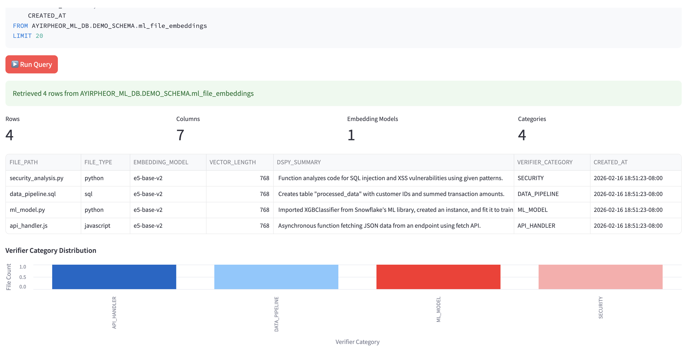

### Pipeline Lineage

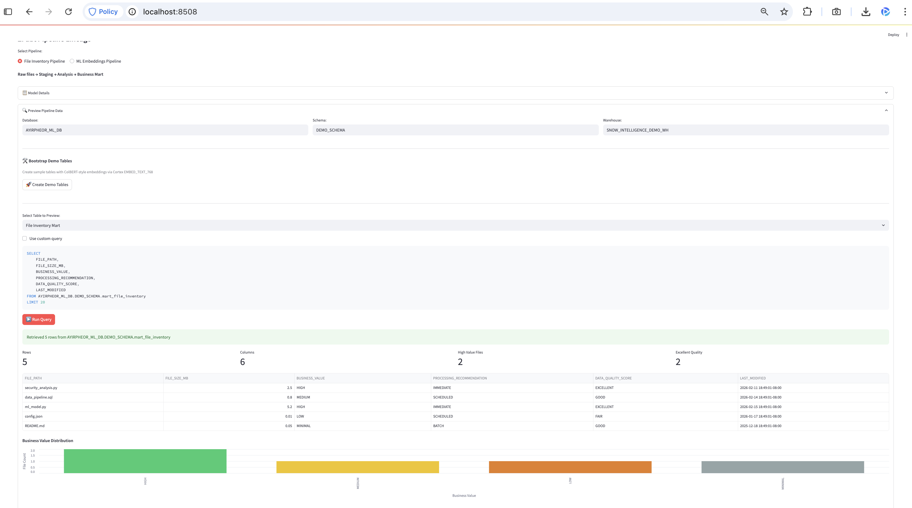

### ML Features Model

```sql
-- models/ml_features/ml_file_embeddings.sql
{{ config(
    materialized='incremental',
    unique_key='file_hash',
    on_schema_change='sync_all_columns'
) }}

WITH source_files AS (
    SELECT 
        file_path,
        file_content,
        MD5(file_content) as file_hash,
        LENGTH(file_content) as content_length,
        CURRENT_TIMESTAMP() as processed_at
    FROM {{ ref('stg_source_files') }}
    
    WHERE processed_at > (SELECT MAX(processed_at) FROM {{ this }})
    
),

embeddings AS (
    SELECT
        file_hash,
        file_path,
        -- Generate embeddings via Cortex
        SNOWFLAKE.CORTEX.EMBED_TEXT_768('e5-base-v2', file_content) as embedding_vector,
        content_length,
        processed_at
    FROM source_files
)

SELECT * FROM embeddings
```

### Evaluation Results Model

```sql
-- models/trulens_evals/persona_evaluations.sql
{{ config(
    materialized='incremental',
    unique_key='eval_id'
) }}

SELECT
    {{ dbt_utils.generate_surrogate_key(['model', 'persona', 'query_id', 'timestamp']) }} as eval_id,
    model,
    persona,
    query_id,
    response,
    
    -- Persona-specific compliance scoring
    CASE persona
        WHEN '5th_grade' THEN 
            CASE WHEN flesch_score BETWEEN 80 AND 90 THEN 1.0
                 WHEN flesch_score BETWEEN 70 AND 100 THEN 0.7
                 ELSE 0.3 END
        WHEN 'scholar' THEN
            CASE WHEN flesch_score BETWEEN 20 AND 50 THEN 1.0
                 WHEN flesch_score BETWEEN 10 AND 60 THEN 0.7
                 ELSE 0.3 END
        WHEN 'compute' THEN
            CASE WHEN CONTAINS(response, 'SELECT') OR CONTAINS(response, '```sql') THEN 1.0 
                 ELSE 0.3 END
        WHEN 'business' THEN
            LEAST(1.0, REGEXP_COUNT(LOWER(response), 'roi|kpi|stakeholder|metric|revenue') / 5.0)
    END as persona_compliance,
    
    timestamp
FROM {{ ref('stg_persona_responses') }}
```

<!-- ------------------------ -->
## A/B Testing with LangGraph

Implement experiment frameworks using LangGraph and MCP for A/B testing model configurations.

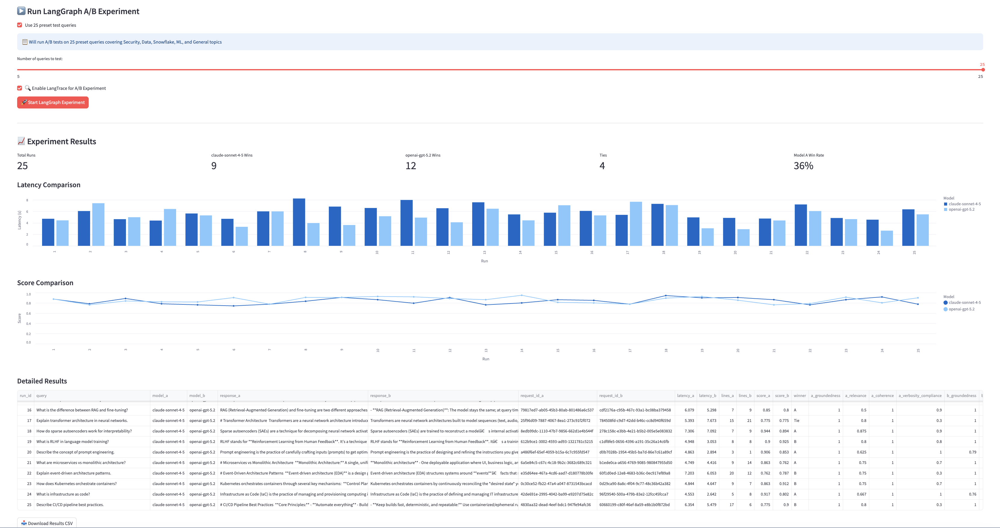

### A/B MCP Server

```python
# ab_mcp_server.py
from fastapi import FastAPI
from pydantic import BaseModel
import random

app = FastAPI()

class Experiment(BaseModel):
    name: str
    variants: list[str]
    traffic_split: list[float]

experiments = {}

@app.post("/experiment/create")
async def create_experiment(exp: Experiment):
    """Create new A/B experiment."""
    experiments[exp.name] = exp
    return {"status": "created", "experiment": exp.name}

@app.get("/experiment/assign/{name}/{user_id}")
async def assign_variant(name: str, user_id: str):
    """Assign user to experiment variant."""
    exp = experiments.get(name)
    if not exp:
        return {"error": "Experiment not found"}
    
    # Deterministic assignment based on user_id hash
    hash_val = hash(user_id) % 100 / 100
    cumulative = 0
    for variant, split in zip(exp.variants, exp.traffic_split):
        cumulative += split
        if hash_val < cumulative:
            return {"variant": variant, "user_id": user_id}
    
    return {"variant": exp.variants[-1], "user_id": user_id}

@app.post("/experiment/{name}/record")
async def record_result(name: str, user_id: str, metric: str, value: float):
    """Record experiment metric."""
    return {"status": "recorded", "experiment": name, "user_id": user_id}

# Run: uvicorn ab_mcp_server:app --port 8517
```

### LangGraph Workflow

```python
from langgraph.graph import StateGraph, END
from typing import TypedDict

class ExperimentState(TypedDict):
    user_id: str
    query: str
    variant: str
    response: str
    metrics: dict

def assign_variant(state: ExperimentState) -> ExperimentState:
    """Assign user to experiment variant via MCP."""
    response = requests.get(f"{AB_MCP_URL}/experiment/assign/verbosity_test/{state['user_id']}")
    state["variant"] = response.json()["variant"]
    return state

def run_model(state: ExperimentState) -> ExperimentState:
    """Run model based on assigned variant."""
    verbosity = state["variant"]  # e.g., "minimal", "brief", "standard"
    result = call_model("claude-sonnet-4-5", verbosity, state["query"])
    state["response"] = result["response"]
    state["metrics"] = {"line_count": result["line_count"], "compliant": result["compliant"]}
    return state

def record_metrics(state: ExperimentState) -> ExperimentState:
    """Record experiment results."""
    requests.post(
        f"{AB_MCP_URL}/experiment/verbosity_test/record",
        params={"user_id": state["user_id"], "metric": "compliance", "value": state["metrics"]["compliant"]}
    )
    return state

# Build graph
workflow = StateGraph(ExperimentState)
workflow.add_node("assign", assign_variant)
workflow.add_node("run", run_model)
workflow.add_node("record", record_metrics)

workflow.set_entry_point("assign")
workflow.add_edge("assign", "run")
workflow.add_edge("run", "record")
workflow.add_edge("record", END)

app = workflow.compile()
```

<!-- ------------------------ -->
## Multimodal Vision with Cortex

Use the **Cortex Chat Completions API** for image understanding with Claude and GPT-4o vision models. This enables analysis of egocentric frames from AR devices like **Project Aria**.

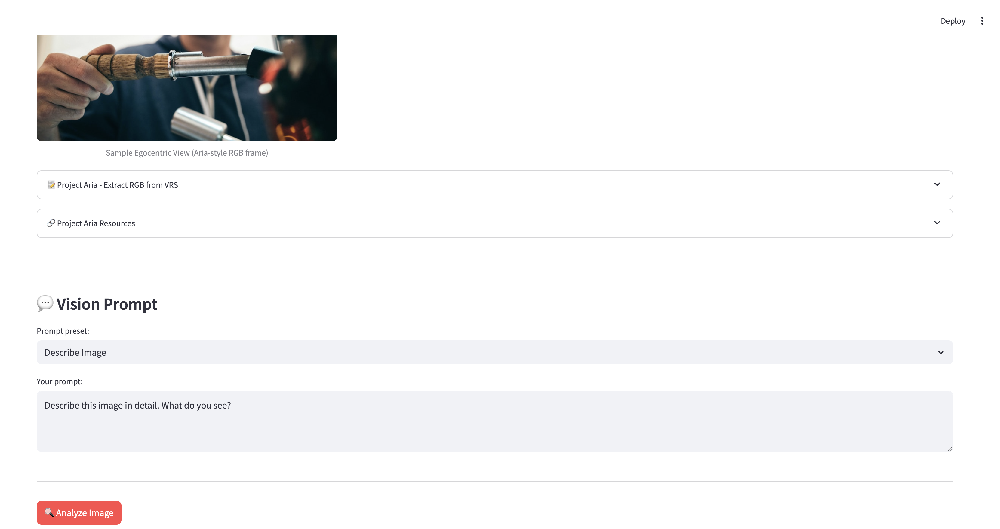

### Vision API Call

The Cortex Chat Completions API supports OpenAI-compatible format with base64-encoded images:

```python
import requests
import base64
import tomllib
import os

def call_vision_model(model: str, prompt: str, image_path: str):
    """Call Cortex vision model with an image."""
    # Load credentials
    with open(os.path.expanduser("~/.snowflake/config.toml"), "rb") as f:
        config = tomllib.load(f)
    pat = config["connections"]["myaccount"]["password"]
    account = config["connections"]["myaccount"]["account"].lower().replace("_", "-")
    
    # Encode image to base64
    with open(image_path, "rb") as img_file:
        image_base64 = base64.b64encode(img_file.read()).decode("utf-8")
    
    url = f"https://{account}.snowflakecomputing.com/api/v2/cortex/v1/chat/completions"
    
    payload = {
        "model": model,  # claude-sonnet-4-5, gpt-4o, etc.
        "messages": [{
            "role": "user",
            "content": [
                {"type": "text", "text": prompt},
                {"type": "image_url", "image_url": {
                    "url": f"data:image/jpeg;base64,{image_base64}"
                }}
            ]
        }],
        "max_completion_tokens": 1024
    }
    
    headers = {"Authorization": f"Bearer {pat}", "Content-Type": "application/json"}
    response = requests.post(url, headers=headers, json=payload)
    return response.json()["choices"][0]["message"]["content"]

# Analyze an egocentric image
result = call_vision_model(
    model="claude-sonnet-4-5",
    prompt="This is an egocentric view from AR glasses. Describe the scene.",
    image_path="egocentric_frame.jpg"
)
print(result)
```

### Project Aria Integration

[Project Aria](https://facebookresearch.github.io/projectaria_tools/gen2/) is Meta's AR research glasses with a 12MP RGB camera. Extract frames from Aria VRS recordings for vision analysis:

```python
# pip install projectaria-tools[all]
from projectaria_tools.core import data_provider

# Load VRS recording
provider = data_provider.create_vrs_data_provider("recording.vrs")
rgb_stream = provider.get_stream_id_from_label("camera-rgb")

# Extract RGB frame
image_data = provider.get_image_data_by_index(rgb_stream, 0)
image_array = image_data[0].to_numpy_array()

# Save frame for vision analysis
from PIL import Image
Image.fromarray(image_array).save("aria_frame.jpg")
```

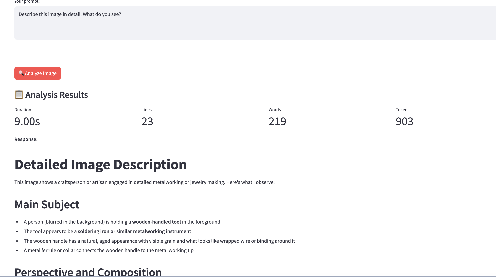

### Supported Vision Models

| Model | Provider | Use Case |
|-------|----------|----------|
| claude-sonnet-4-5 | Cortex | Scene understanding, detailed analysis |
| claude-sonnet-4-6 | Cortex | Latest Claude vision capabilities |
| gpt-4o | Cortex | Fast, accurate image understanding |
| gpt-4o-mini | Cortex | Cost-effective vision tasks |

<!-- ------------------------ -->
## Dashboard Walkthrough

Launch the full cross-model verbosity dashboard:

```bash
streamlit run compare_models_dashboard.py --server.port 8501
```

### Verbosity Comparison

The main tab lets you compare Claude, Mistral, and Llama across all 8 verbosity levels with compliance scoring and token usage metrics.

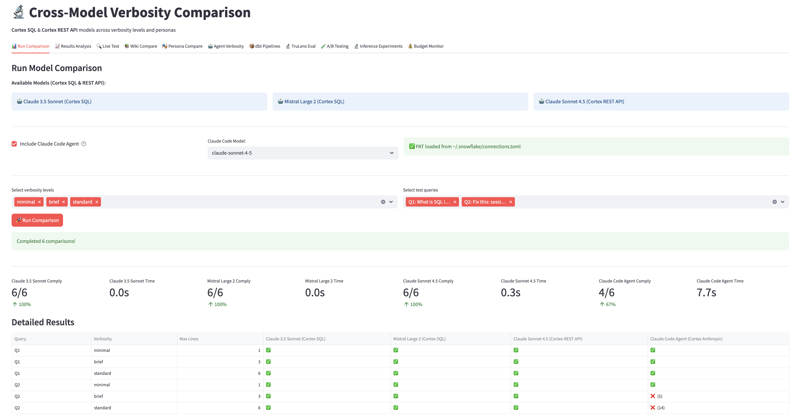

### Live Testing

Run live model comparisons with custom prompts and see real-time results from the Cortex REST API.

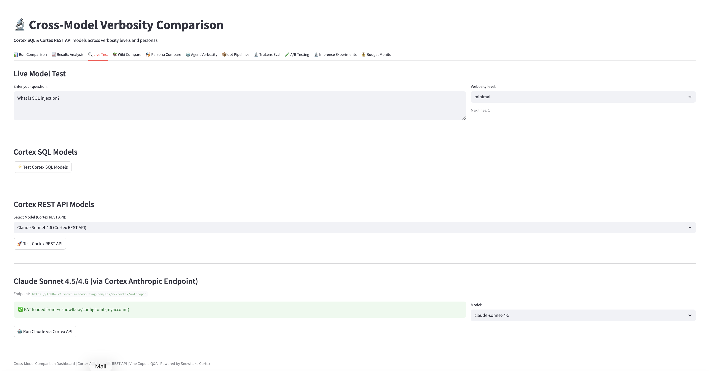

### Results Analysis

Analyze compliance rates, token efficiency, and response quality across models and verbosity levels.

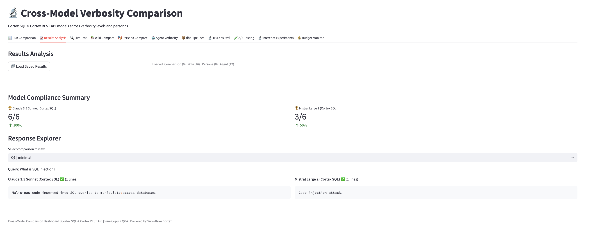

### Persona Comparison

Test persona compliance across all tabs — 5th Grade, Scholar, Compute, and Business personas evaluated against each model.

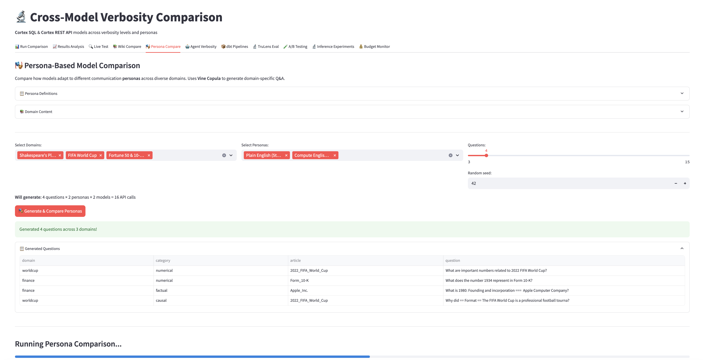

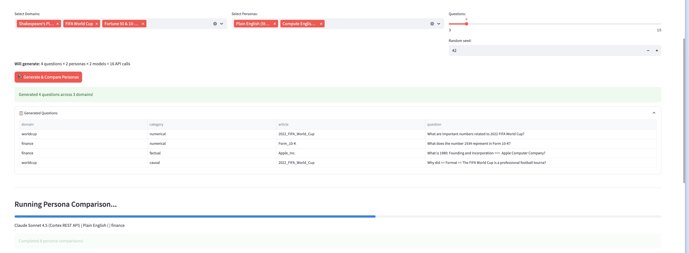

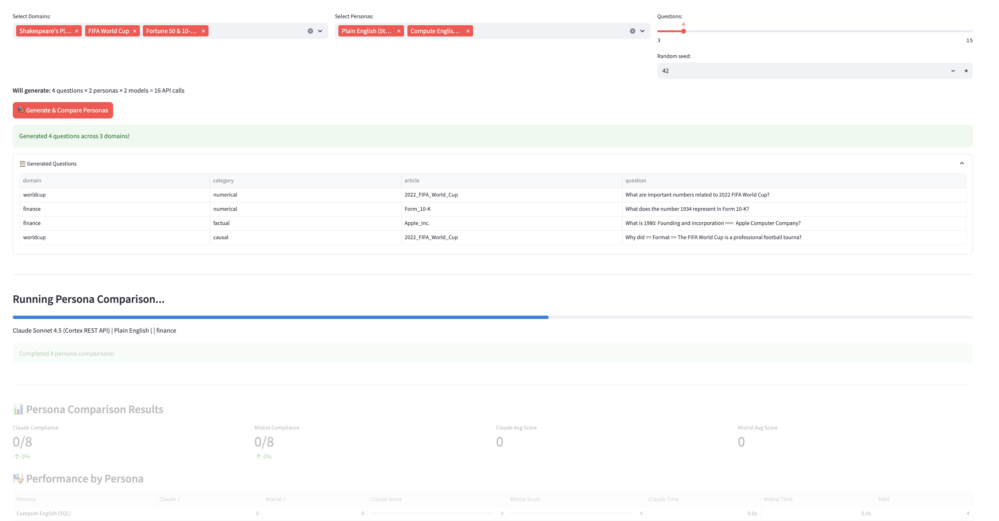

### RAG with Extended Thinking

Mini RAG pipeline with Wikipedia retrieval and Claude extended thinking traces.

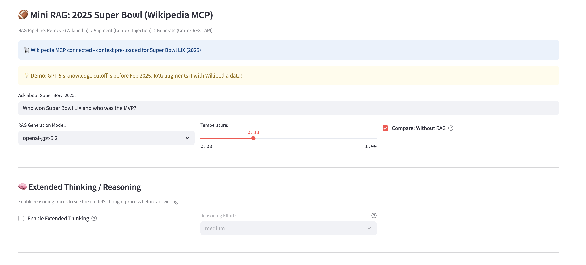

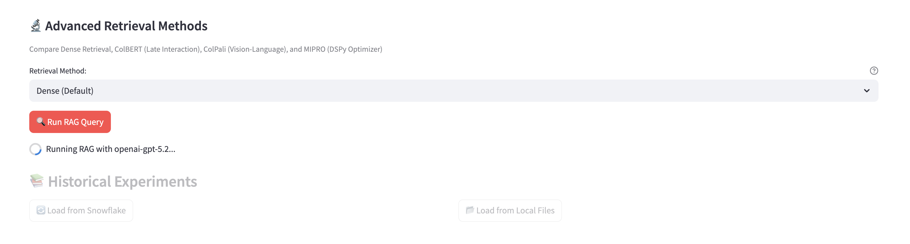

### SAE & LangChain Integration

Sparse Autoencoder feature analysis with LangChain orchestration and LangTrace event-driven hooks for observability.

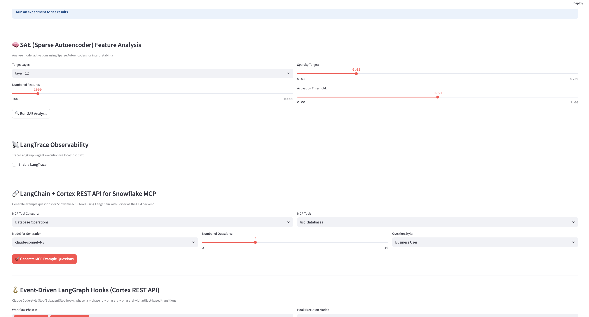

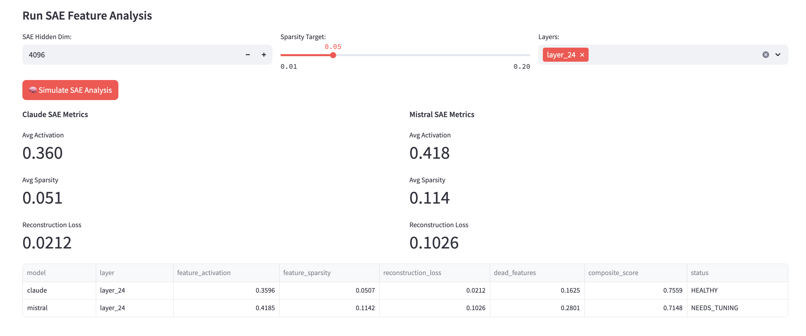

### LangGraph Experiments

A/B testing framework using LangGraph workflows for experiment-driven model evaluation.

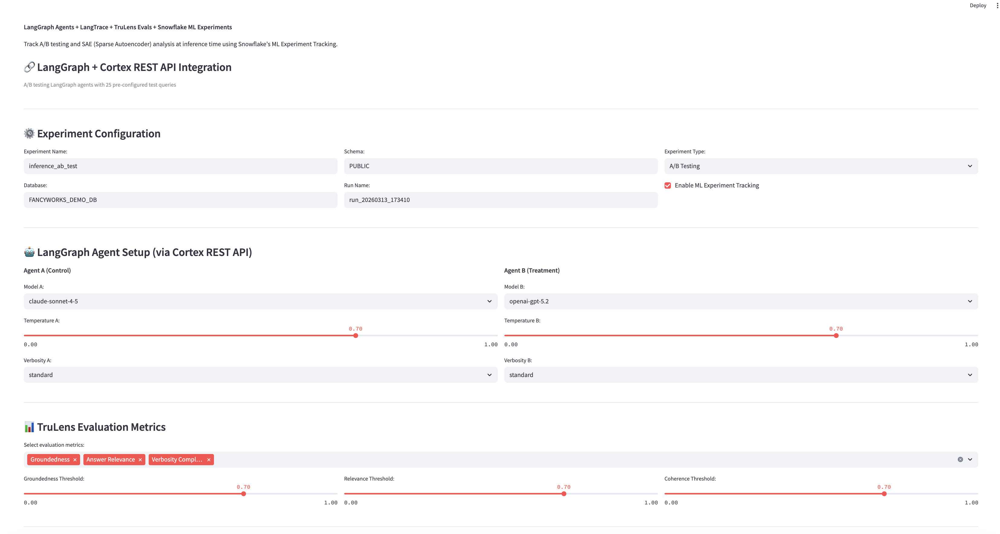

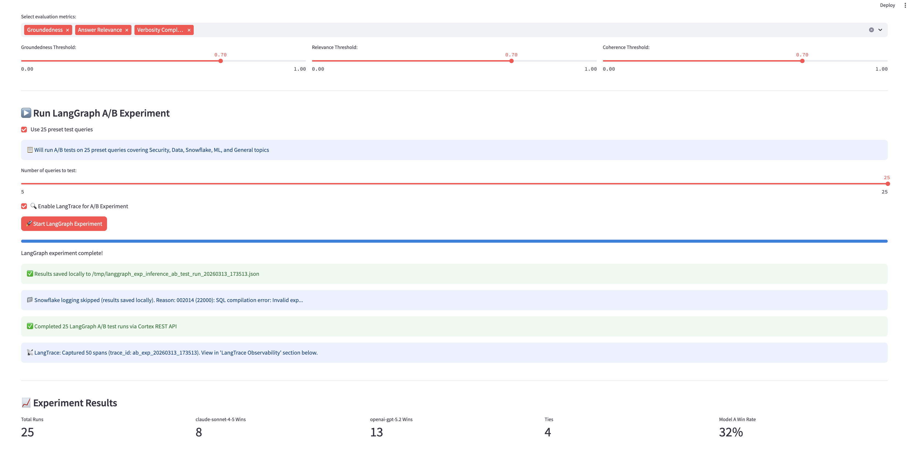

### Evaluation & Batch Testing

TruLens evaluation demo with LLM-as-Judge scoring and batch test execution across all model-verbosity combinations.

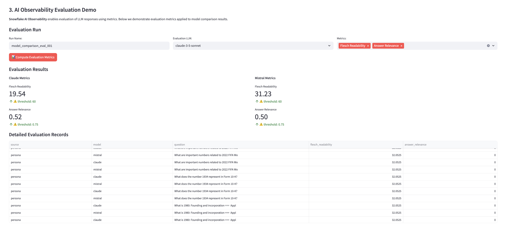

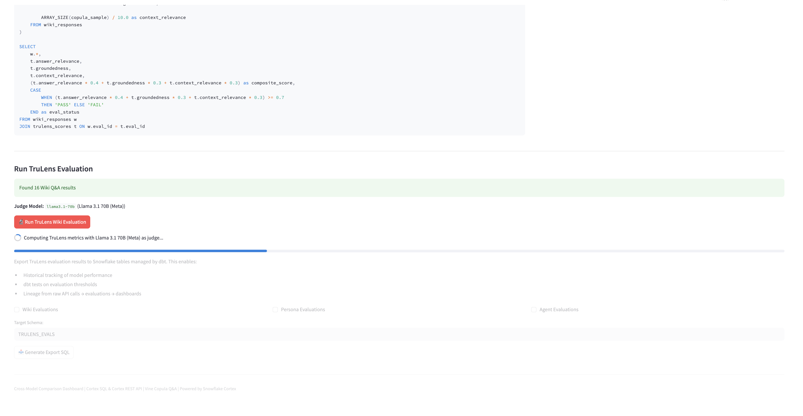

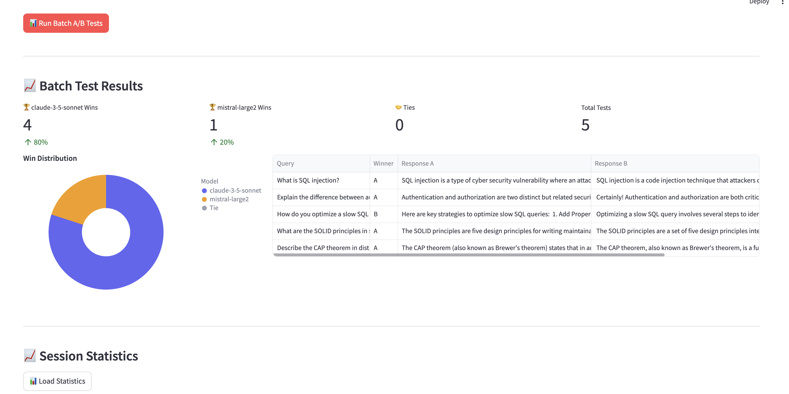

<!-- ------------------------ -->
## Conclusion and Resources

Congratulations! You've built a comprehensive cross-model verbosity evaluation system using **Snowflake Cortex REST API** that:

- Deploys 24 Cortex Agents with verbosity constraints (8 levels × 3 models)
- Compares **Claude Sonnet 4**, **Mistral Large 2**, and **Llama 3.1 70B** across 8 response styles
- Uses config-driven model management for easy extensibility
- Implements TruLens LLM-as-Judge evaluation with SAE analysis
- Tests persona compliance (5th Grade, Scholar, Compute, Business)
- Integrates MCP for Wikipedia retrieval and A/B testing
- Captures extended thinking traces from Claude via Cortex REST API
- Builds dbt pipelines for ML feature engineering

### What You Learned
- Calling Cortex models via REST API (`/api/v2/cortex/inference:complete`)
- Config-driven multi-model comparison methodology
- LLM-as-Judge evaluation patterns with multiple judge models
- MCP (Model Context Protocol) integration
- Extended thinking with streaming response parsing
- dbt pipelines for ML on Snowflake

### Related Resources
- [Snowflake Cortex AI Documentation](https://docs.snowflake.com/en/user-guide/snowflake-cortex)
- [Cortex REST API Reference](https://docs.snowflake.com/en/user-guide/snowflake-cortex/cortex-llm-rest-api)
- [TruLens Documentation](https://www.trulens.org/)
- [MCP Specification](https://modelcontextprotocol.io/)
- [dbt Documentation](https://docs.getdbt.com/)
- [LangGraph Documentation](https://langchain-ai.github.io/langgraph/)

### Next Steps
- Add more models to MODEL_CONFIGS (e.g., GPT-4 via external functions)
- Add custom evaluation metrics
- Deploy as Streamlit in Snowflake app
- Integrate with Snowflake ML Model Registry
