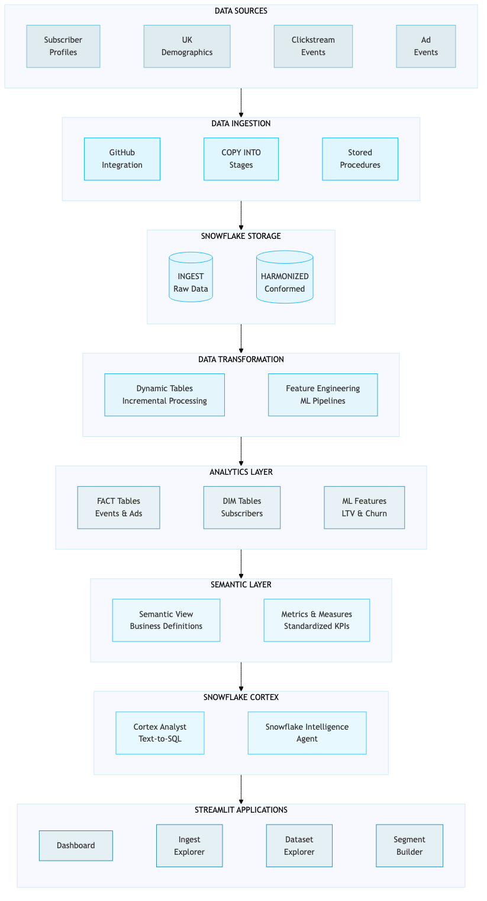
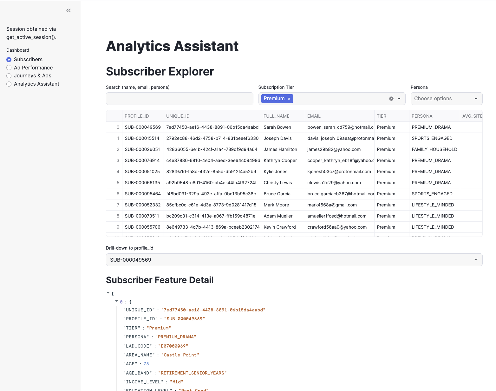
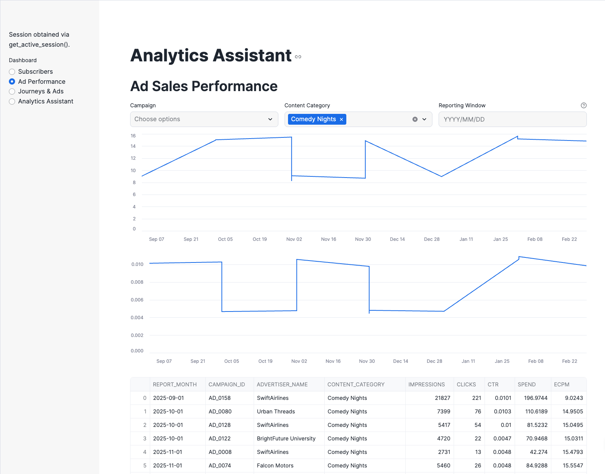
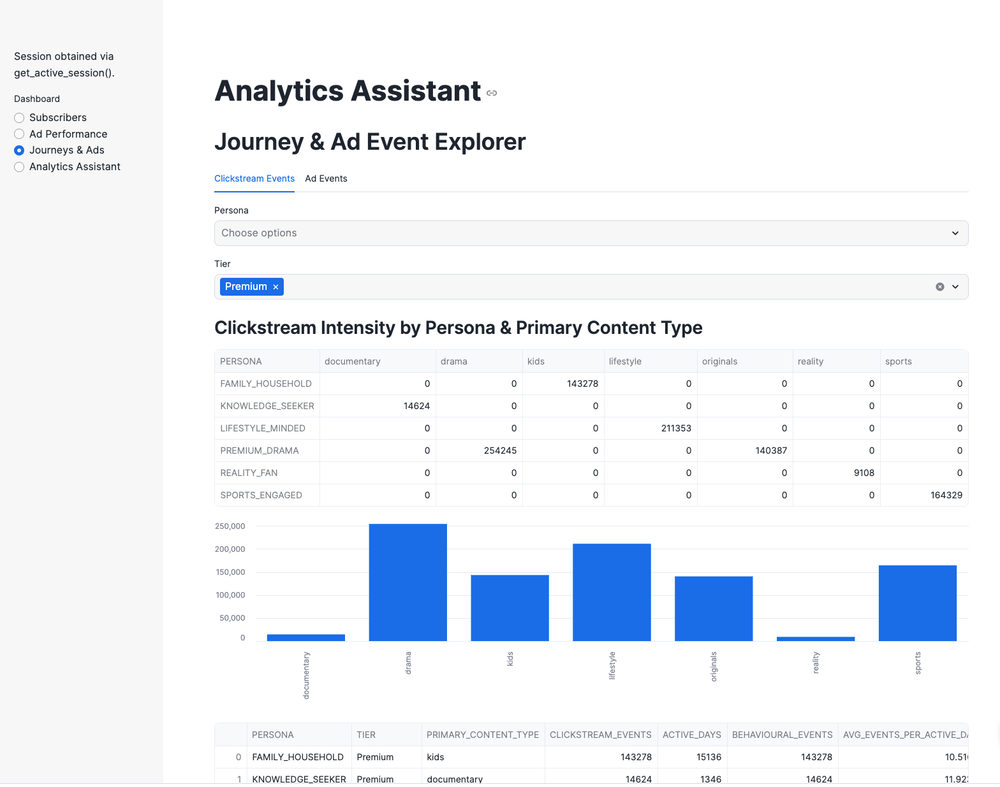
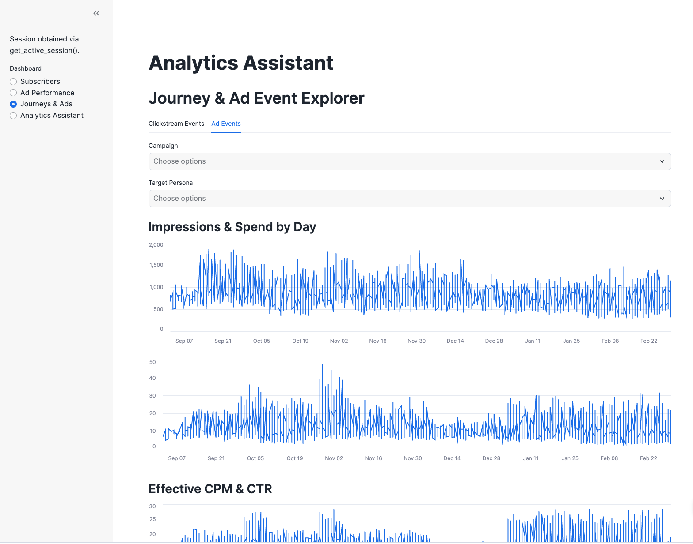
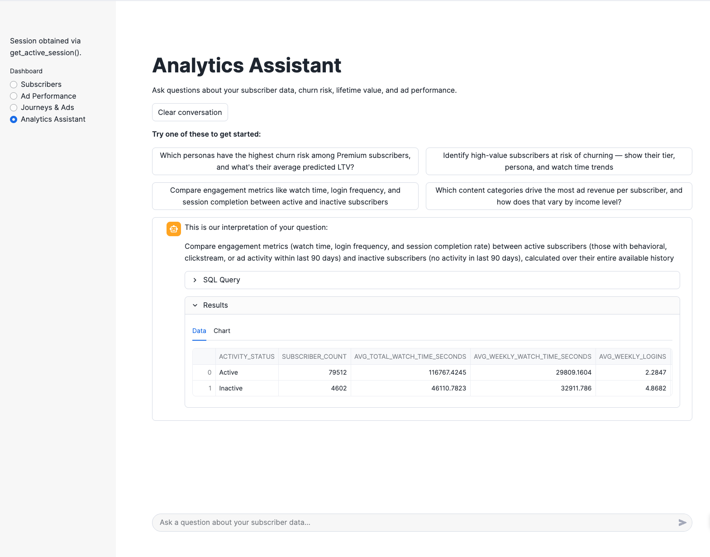
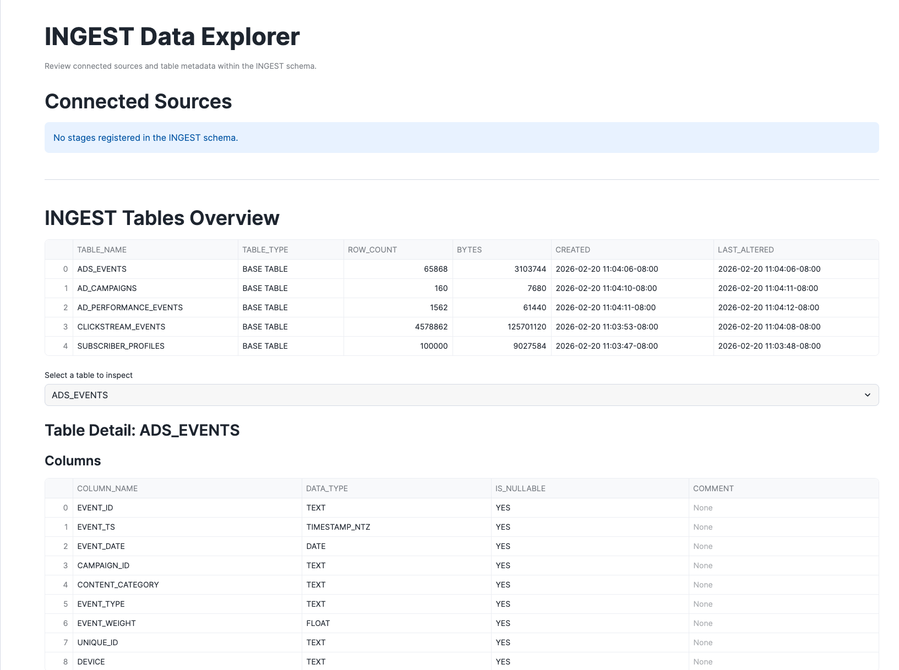
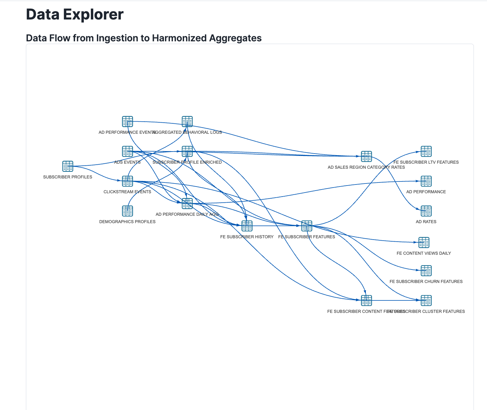
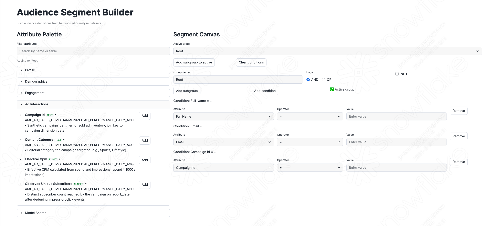
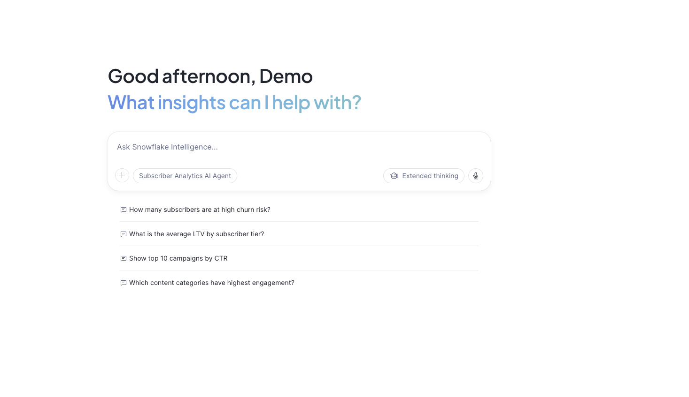

author: Fredrik Goransson, Joviane Bellegarde
id: agentic-audience-analytics
summary: Build an end-to-end Media & Entertainment subscriber analytics solution with audience segmentation, ML scoring, and Snowflake Intelligence for natural language queries
categories: snowflake-site:taxonomy/solution-center/certification/quickstart, snowflake-site:taxonomy/solution-center/certification/certified-solution, snowflake-site:taxonomy/industry/advertising-media-and-entertainment, snowflake-site:taxonomy/product/ai, snowflake-site:taxonomy/snowflake-feature/cortex-analyst, snowflake-site:taxonomy/snowflake-feature/dynamic-tables, snowflake-site:taxonomy/snowflake-feature/snowpark, snowflake-site:taxonomy/snowflake-feature/snowflake-intelligence, snowflake-site:taxonomy/snowflake-feature/conversational-assistants
environments: web
language: en
status: Published
feedback link: https://github.com/Snowflake-Labs/sfguides/issues
tags: Getting Started, Media, Entertainment, Advertising, Streamlit, Snowflake Intelligence, Cortex, Semantic View, Audience Segmentation, LTV, Churn
fork repo link: https://github.com/Snowflake-Labs/sfguide-mea-subscriber-analytics

# Agentic Audience Analytics for Media & Entertainment

## Overview


This guide demonstrates how to build an **end-to-end AI-powered analytics platform** for streaming media advertising using Snowflake. You'll deploy a complete solution that transforms raw subscriber data into actionable audience insights using Dynamic Tables, ML-powered predictions, Semantic Views, and Cortex Analyst.

The solution uses **synthetic data** representing a fictional UK-based streaming media company. All subscriber profiles, demographics, clickstream events, and ad interactions are generated for demonstration purposes only.

### What You Will Learn

- **Data Pipeline Architecture**: Understand how data flows from raw ingestion through Dynamic Tables to analytics-ready datasets
- **ML-Powered Insights**: See how Lifetime Value (LTV) and Churn Risk scores are computed using feature engineering
- **Natural Language Analytics**: Query subscriber data using Cortex Analyst powered by a Semantic View
- **Audience Segmentation**: Discover attributes available for building targeted advertising segments

### What You Will Build

| Feature | Description |
|---------|-------------|
| **Dynamic Tables** | Incremental data pipelines transforming raw data to analytics-ready tables |
| **Feature Engineering** | ML feature tables computing subscriber LTV and churn risk scores |
| **Semantic View** | Natural language interface for querying subscriber analytics |
| **Streamlit Apps** | Four interactive applications for data exploration and analysis |

### Prerequisites

- A Snowflake account with ACCOUNTADMIN privileges
- Go to the <a href="https://signup.snowflake.com/?utm_source=snowflake-devrel&utm_medium=developer-guides&utm_cta=developer-guides" target="_blank">Snowflake sign-up page</a> and register for a free account if needed
- Basic familiarity with SQL

<!-- ------------------------ -->
## Architecture Overview

### Solution Architecture



### Sample Data

All data in this solution is **synthetic** and generated for demonstration purposes:

| Table | Description | Approximate Rows |
|-------|-------------|------------------|
| **SUBSCRIBER_PROFILES** | Synthetic UK subscriber profiles | ~780,000 |
| **DEMOGRAPHICS_PROFILES** | Regional demographic and behavioral data | ~780,000 |
| **CLICKSTREAM_EVENTS** | Simulated app/web interaction events | ~180,000,000 |
| **ADS_EVENTS** | Synthetic ad impression and engagement data | ~595,000 |
| **AD_CAMPAIGNS** | Campaign definitions and booking details | ~160 |
| **AD_PERFORMANCE_EVENTS** | Daily campaign performance metrics | ~2,000 |

### Data Flow

Data flows through four layers:

| Schema | Stage | Purpose |
|--------|-------|---------|
| **INGEST** | Landing | Raw data from sources |
| **HARMONIZED** | Conformed | Cleaned, joined, business-ready |
| **ANALYSE** | Features | ML features and predictions |
| **ACTIVATION** | Output | Audience segments for campaigns |

<!-- ------------------------ -->
## Setup Snowflake Environment


In this step, you'll create all the Snowflake objects needed for the Audience Analytics solution.

### Step 1: Create Database Objects

1. In Snowsight, click **Projects**, then **Workspaces** in the left navigation
2. Click **+ Add new** to create a new Workspace
3. Click **SQL File** to create a new SQL file
4. Copy the setup script from <a href="https://github.com/Snowflake-Labs/sfguide-mea-subscriber-analytics/blob/main/scripts/sql/setup.sql" target="_blank">setup.sql</a> and paste it into your SQL file

### Step 2: Run Infrastructure Setup

Run the setup script to create:

- **Database**: **AME_AD_SALES_DEMO** with schemas (INGEST, HARMONIZED, ANALYSE, ACTIVATION, DATA_SHARING, APPS)
- **Warehouses**: **APP_WH** for queries
- **Stages**: **S3_DATA** for loading pre-generated data from S3, **SEMANTIC_MODELS** for semantic views

The script automatically:
1. Loads pre-generated synthetic data from S3 into the INGEST and DATA_SHARING schemas
2. Transforms data through Harmonized layer with enrichment and aggregation
3. Creates ML features for LTV and churn scoring
4. Deploys four Streamlit applications
5. Creates a Semantic View and Snowflake Intelligence Agent

<!-- ------------------------ -->
## Explore the Dashboard


The Dashboard is your executive analytics hub providing subscriber insights, ad performance metrics, and behavioral analytics.

**Location:** **AME_AD_SALES_DEMO.APPS.DASHBOARD**



### Launch the App

1. In Snowsight, navigate to **Projects** → **Streamlit**
2. Find **DASHBOARD** in the **AME_AD_SALES_DEMO.APPS** schema
3. Click to launch

### Subscriber Explorer

This view lets you search and filter the subscriber base to find specific profiles.

**How to Use It:**

1. **Search for subscribers** - Type a name, email, or persona keyword in the search box. The table updates as you type.

2. **Filter by Subscription Tier** - Use the dropdown to show only subscribers on a specific plan:
   - **Ad-supported** - Free tier with ads
   - **Standard** - Paid tier
   - **Premium** - Top tier

3. **Filter by Persona** - Narrow results to behavioral segments:
   - **SPORTS_ENGAGED**
   - **PREMIUM_DRAMA**
   - **FAMILY_HOUSEHOLD**
   - **KNOWLEDGE_SEEKER**
   - **LIFESTYLE_MINDED**
   - **REALITY_FAN**

4. **Drill into a profile** - Click any Profile ID. A detail panel shows LTV score, churn probability, engagement metrics, and demographic details.

> **Try This:** Filter to **Premium** tier, select the **SPORTS_ENGAGED** persona, click a Profile ID to see their churn risk, and compare their LTV score to the segment average.

### Ad Sales Performance



This view shows advertising campaign metrics over time.

**How to Use It:**

1. **Select a Campaign** - Use the Campaign ID dropdown to focus on a specific campaign, or leave it on "All" for aggregate performance.

2. **Filter by Content Category** - Choose content genres: Sports Enthusiasts, Premium Drama, Family Entertainment, Comedy Nights, Documentary & Knowledge, Lifestyle & Wellness

3. **Adjust the date range** - Use date pickers to zoom into a specific time window.

4. **Read the charts** - Top chart shows eCPM (effective cost per thousand impressions) trends. Bottom chart shows CTR (click-through rate) over time. Hover for exact values.

> **Try This:** Select a specific Campaign ID, look at eCPM trends, compare CTR across content categories, and identify underperforming campaigns.

### Journey & Event Explorer

This view analyzes user behavior through two sub-tabs.

**Clickstream Events Tab:**


1. Filter by Persona or Subscription Tier using the dropdowns
2. The heatmap shows event intensity by hour and day (darker = more activity)
3. Use this to identify peak engagement windows for your audience

**Ad Events Tab:**



1. Filter by Campaign ID or Target Persona
2. The chart shows daily metrics: Impressions, Clicks, and Completions (video ads watched fully)
3. Compare campaign performance across different audience segments

> **Try This:** Go to Clickstream Events, filter to **Premium** subscribers, identify their most active time of day, then switch to Ad Events to see if ad performance aligns with peak times.

### Analytics Assistant



This view provides a conversational AI interface powered by Cortex Analyst. Ask natural language questions about your subscriber data and get instant SQL-backed answers.

**How to Use It:**

1. Select **Analytics Assistant** from the sidebar
2. Click any sample question to get started, or type your own in the input box
3. The assistant translates your question into SQL, runs it, and returns results with charts and tables

**Sample Questions to Try:**

| Persona | Question |
|---------|----------|
| **Data Analyst** | Which personas have the highest churn risk among Premium subscribers, and what's their average predicted LTV? |
| **Marketing Manager** | Identify high-value subscribers at risk of churning — show their tier, persona, and watch time trends |
| **Ad Sales Executive** | Which content categories drive the most ad revenue per subscriber, and how does that vary by income level? |
| **Executive** | What's the churn probability distribution by persona and tier? Which segments should we prioritize for retention? |

<!-- ------------------------ -->
## Explore the Ingest Explorer


The Ingest Explorer shows you the raw data before any transformation—this is where the data journey begins.

**Location:** **AME_AD_SALES_DEMO.APPS.INGEST_EXPLORER**



### Launch the App

1. In Snowsight, navigate to **Projects** → **Streamlit**
2. Find **INGEST_EXPLORER** in the **AME_AD_SALES_DEMO.APPS** schema
3. Click to launch

### Using the App

**View Your Data Sources:**
The top section shows connected stages (external data sources), indicating where raw data originates.

**Browse Available Tables:**
The middle section lists all tables in the INGEST schema with row counts:

| Table | What It Contains |
|-------|------------------|
| **SUBSCRIBER_PROFILES** | Raw subscriber records |
| **CLICKSTREAM_EVENTS** | User interaction events |
| **ADS_EVENTS** | Ad impression and engagement data |
| **AD_CAMPAIGNS** | Campaign definitions |
| **AD_PERFORMANCE_EVENTS** | Daily campaign performance metrics |

> **Tip:** If a table shows 0 rows, something may have failed upstream in the data pipeline.

**Inspect a Table:**
Click any table name to see:
1. **Columns panel** - Column names and data types (VARCHAR, NUMBER, TIMESTAMP, etc.)
2. **Statistics panel** - Min/max values, averages, distinct value counts, null counts
3. **Sample values** - Actual values for columns with few unique values
4. **Data preview** - First 50 rows to eyeball the data

> **Try This:** Click **SUBSCRIBER_PROFILES**, check how many distinct values are in **TIER**, look at null counts on **EMAIL**, preview the first 50 rows, and compare these raw fields to what you saw in the Dashboard.

<!-- ------------------------ -->
## Explore the Dataset Explorer


The Dataset Explorer shows how raw data transforms into analytics-ready tables that power the Dashboard.

**Location:** **AME_AD_SALES_DEMO.APPS.DATASET_EXPLORER**



### Launch the App

1. In Snowsight, navigate to **Projects** → **Streamlit**
2. Find **DATASET_EXPLORER** in the **AME_AD_SALES_DEMO.APPS** schema
3. Click to launch

### Using the App

**Select a Schema:**
Use the sidebar to explore the data flow layers:

| Schema | Stage | What's Here |
|--------|-------|-------------|
| **INGEST** | Landing | Raw data |
| **HARMONIZED** | Conformed | Cleaned, joined, business-ready tables |
| **ANALYSE** | Features | ML features, scores, and predictions |
| **ACTIVATION** | Output | Audience segments ready for campaigns |

**Explore the Lineage Graph:**
The interactive diagram shows how tables connect:
- **Nodes** are tables
- **Edges** show data flow (which tables feed into which)
- Click and drag to pan, zoom in/out for details

**Profile a Table:**
Click any table to see column names and types, value distributions, and sample data.

### Understanding the Data Pipeline

```
INGEST                    HARMONIZED                      ANALYSE
───────────────────────────────────────────────────────────────────
SUBSCRIBER_PROFILES  →  SUBSCRIBER_PROFILE_ENRICHED  →  FE_SUBSCRIBER_FEATURES
                                                     →  FE_SUBSCRIBER_CHURN_RISK
                                                     →  FE_SUBSCRIBER_LTV_SCORES

CLICKSTREAM_EVENTS   →  CLICKSTREAM_DAILY_AGG        →  (feeds into features)

AD_CAMPAIGNS         →  AD_PERFORMANCE_DAILY_AGG     →  (feeds into features)
AD_PERFORMANCE_EVENTS
```

> **Try This:** Select the **HARMONIZED** schema, find **SUBSCRIBER_PROFILE_ENRICHED** in the lineage graph, click it to see the column profile, then trace what INGEST tables feed into it and what ANALYSE tables consume it downstream.

<!-- ------------------------ -->
## Explore the Segment Builder


The Segment Builder shows all attributes available for building audience segments—this is how you turn data into action.

**Location:** **AME_AD_SALES_DEMO.APPS.SEGMENT_BUILDER**



### Launch the App

1. In Snowsight, navigate to **Projects** → **Streamlit**
2. Find **SEGMENT_BUILDER** in the **AME_AD_SALES_DEMO.APPS** schema
3. Click to launch

### Available Attributes

The left panel organizes attributes into categories:

| Category | What's In It |
|----------|-------------|
| **Profile** | Subscription tier, location codes, media propensity |
| **Demographics** | Age, age band, income level, marital status |
| **Engagement** | Site visits, login frequency, behavioral personas |
| **Ad Interactions** | Campaign IDs, impression counts, CPM values |
| **Model Scores** | Churn probability, risk segments, predicted LTV |

### Building a Segment

**Add Conditions:**
Click the **"Add"** button next to any attribute. It appears on your segment canvas.

**Configure Each Condition:**

| Operator | Use For | Example |
|----------|---------|--------|
| **=** | Exact match | TIER = "Premium" |
| **!=** | Not equal | TIER != "Ad-supported" |
| **>**, **>=**, **<**, **<=** | Numeric comparison | PREDICTED_LTV >= 500 |
| **IN** | Multiple values | TIER IN "Premium,Standard" |
| **NOT IN** | Exclude values | PERSONA NOT IN "REALITY_FAN" |
| **BETWEEN** | Range | AGE BETWEEN 18,35 |
| **CONTAINS** | Substring match | EMAIL CONTAINS "gmail" |

**Combine with Logic:**
- **AND group** - Every condition must match
- **OR group** - At least one condition must match
- **NOT** - Inverts the entire group

Click **"Add subgroup"** for nested logic.

### Example Segments

**High-Value Subscribers at Risk of Churning:**

| Condition | Operator | Value |
|-----------|----------|-------|
| TIER | = | Premium |
| CHURN_RISK_SEGMENT | = | High |
| PREDICTED_LTV | >= | 500 |

**Young Adults with High Digital Engagement:**

| Condition | Operator | Value |
|-----------|----------|-------|
| AGE_BAND | = | Young Adults/Early |
| INCOME_LEVEL | = | High |
| DIGITAL_MEDIA_PROPENSITY | = | Very High |

> **Try This:** Build a segment for "Premium subscribers in urban areas with high churn risk": Add TIER = "Premium", add CHURN_RISK_SEGMENT = "High", add REGION (pick a major metro area), check the live count, and save with a descriptive name.

<!-- ------------------------ -->
## Snowflake Intelligence


In Snowsight, click **AI & ML**, then **Snowflake Intelligence** in the left navigation.



The setup script automatically creates the Semantic View and Snowflake Intelligence Agent:

**Semantic View** (**AME_AD_SALES_SEMANTIC_VIEW**):
- Table definitions for subscriber profiles and events
- Column descriptions for natural language understanding
- Relationships between dimension and fact tables
- Verified queries for common analysis patterns

**Snowflake Intelligence Agent** (**SUBSCRIBER_ANALYTICS_AGENT**):
- Uses Snowflake's default orchestration model for natural language understanding
- System prompt configured for media & entertainment domain expertise
- Semantic View tool for data access

### Test the Agent

Try these persona-specific queries:

**Data Analyst:**
- "Which personas have the highest churn risk among Premium subscribers, and what's their average predicted LTV?"
- "Compare engagement metrics like watch time, login frequency, and session completion between active and inactive subscribers in the last 90 days"

**Marketing Manager:**
- "Identify high-value subscribers at risk of churning — show their tier, persona, and watch time trends"
- "Find subscribers with high digital media consumption but declining ad engagement in the last 30 days"

**Ad Sales Executive:**
- "Which content categories drive the most ad revenue per subscriber, and how does that vary by income level?"
- "What are the top performing campaigns by CTR, and how does their eCPM compare to booked CPM?"

**Executive:**
- "What's the churn probability distribution by persona and tier? Which segments should we prioritize for retention?"
- "How many subscribers are in each tier, and what's the average LTV and churn risk for each?"

<!-- ------------------------ -->
## Conclusion and Resources


Congratulations! You have successfully built a comprehensive Media & Entertainment audience analytics solution with Snowflake Intelligence.

### What You Learned

- **Data Pipeline Architecture**: How data flows from INGEST → HARMONIZED → ANALYSE → ACTIVATION
- **ML-Powered Insights**: How LTV and churn risk scores are computed using feature engineering
- **Natural Language Analytics**: How to query subscriber data using Cortex Analyst
- **Audience Segmentation**: How to build targeted segments using available attributes

### Business Value

| Capability | Benefit |
|------------|---------|
| **Unified Subscriber View** | 360-degree visibility into subscriber behavior |
| **Self-Service Segmentation** | Marketing teams can build audiences without SQL |
| **Natural Language Analytics** | Executives can query data conversationally |
| **ML-Powered Insights** | Predictive churn and LTV scoring |

### Related Resources

- <a href="https://docs.snowflake.com/en/user-guide/snowflake-cortex/snowflake-intelligence" target="_blank">Snowflake Intelligence Documentation</a>
- <a href="https://docs.snowflake.com/en/developer-guide/streamlit/about-streamlit" target="_blank">Streamlit in Snowflake</a>
- <a href="https://docs.snowflake.com/en/user-guide/snowflake-cortex/cortex-analyst" target="_blank">Cortex Analyst</a>
