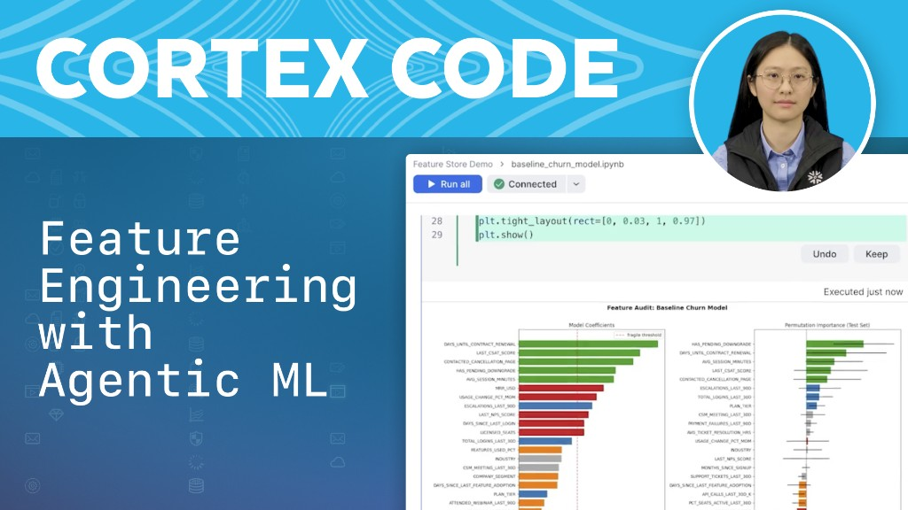

author: Doris Lee, Vinay Sridhar, Jeffrey Geevarghese, Lucy Zhu, Krista Rockson
id: agentic-machine-learning-best-practices-cortex-code
language: en
summary: Learn best practices for building end-to-end ML pipelines with Cortex Code, Snowflake's AI coding agent, using natural language prompts - from feature engineering to model deployment and monitoring.
categories: snowflake-site:taxonomy/solution-center/ai-ml/quickstart
environments: web
status: Published

# Agentic Machine Learning Best Practices with Cortex Code

Agents are redefining workflows everywhere. And getting started for ML has never been easier.

Traditionally, building ML models has been slow and manual, involving tedious troubleshooting cycles. Snowflake is now an agentic-first ML platform. With [**Cortex Code**](https://docs.snowflake.com/en/user-guide/cortex-code/overview), Snowflake's native AI coding agent, data science teams can develop production-ready ML pipelines using simple natural language prompts, from the CLI or Snowsight.

By automating everything from feature engineering to model training to deployment in [Snowflake ML](https://docs.snowflake.com/en/developer-guide/snowflake-ml/overview), you can experiment and iterate faster and focus on higher-impact initiatives for your business. All of the ML workflows in this guide are powered by the `$machine-learning` skill in Cortex Code.

[](https://www.youtube.com/watch?v=zARMUTv_H5Y)

[Watch: Feature Engineering with Agentic ML](https://www.youtube.com/watch?v=zARMUTv_H5Y)

## Get started with Cortex Code

Step 1: Ensure [Cortex Code is enabled](https://docs.snowflake.com/en/user-guide/cortex-code/overview#enabling-cortex-code) with appropriate permissions on your account


### In Snowsight

Cortex Code is built directly into [Snowsight](https://docs.snowflake.com/en/user-guide/cortex-code/cortex-code-snowsight), Snowflake's web UI. No installation required - open Workspaces in Snowsight and start a Cortex Code session to generate fully functional ML pipelines that run directly inside a Snowflake Notebook.

> **[Try Cortex Code today in Snowsight with a 30-day free trial.](https://signup.snowflake.com/)**

### In CLI

To use Cortex Code from your terminal, VS Code, or Cursor, install the CLI:

```
curl -LsS https://ai.snowflake.com/static/cc-scripts/install.sh | sh
```

For more details see the [Cortex Code CLI documentation](https://docs.snowflake.com/en/user-guide/cortex-code/cortex-code-cli). You can also try the CLI with a [30-day Cortex Code CLI trial](https://signup.snowflake.com/cortex-code).

## Terminology

- **[Agentic ML](https://www.snowflake.com/en/blog/agentic-ml-snowflake-predictive-insights/)**: The ability to automate development of production-ready ML pipelines from simple natural language prompts.
- **[Cortex Code](https://docs.snowflake.com/en/user-guide/cortex-code/overview)**: Snowflake's AI coding agent that can be used to build, debug, and deploy ML pipelines through natural language conversations, available in the CLI and in Snowsight.
- **[Skills](https://docs.snowflake.com/en/user-guide/cortex-code/extensibility)**: Reusable instruction packs (playbooks) that guide Cortex Code through specific workflows, such as feature engineering, model training, registry, and deployment.
- **[Snowflake Notebooks](https://www.snowflake.com/en/product/features/notebooks/)**: Fully-managed Jupyter-powered notebook built for end-to-end DS and ML development on Snowflake data. Runs in a pre-built [container environment](https://docs.snowflake.com/en/developer-guide/snowflake-ml/container-runtime-ml) optimized for scalable AI/ML development. 
- **[Snowflake Feature Store](https://docs.snowflake.com/en/developer-guide/snowflake-ml/feature-store/overview)**: Create, store and serve ML features, enabling reuse across models and consistent training/serving definitions.
- **[Snowflake Model Registry](https://docs.snowflake.com/en/developer-guide/snowflake-ml/model-registry/overview)**: Securely manage models and their metadata in Snowflake and run scalable batch and real-time model inference
- **[Model Monitoring](https://docs.snowflake.com/en/developer-guide/snowflake-ml/model-registry/model-monitor)**: Monitor models in production to ensure more reliable predictions over time

## Best practices

> **Always ensure you're on the latest CLI version.** Run `cortex --version` and update with `cortex update` if needed.

> **Use the `$machine-learning` skill for ML workflows.** This skill contains curated workflows for the full ML lifecycle - feature engineering, model training, registry, and deployment. Cortex Code can trigger it automatically based on intent, but this is non-deterministic. To be certain the right skill is active, invoke it explicitly at the start of your session or before any ML task.

1. **Use plain language** - describe what you want, not how to do it. Cortex Code understands intent; you don't need to write code or SQL to get started.

2. **Front-load context, focus each turn on a single goal** - give Cortex Code comprehensive background and constraints upfront, but limit each prompt to one primary objective. This maximizes its reasoning capacity for your main goal. ✅ *"I have a customer churn dataset for a telecom company. Our target is binary churn within 30 days. Build me an end-to-end ML pipeline focusing on interpretable features our business team can act on."* ❌ *"Build me a churn model using this customer data."*

3. **Be specific and prescriptive** - the more specific you are about requirements, methods, and constraints, the better the output. ✅ *"Convert the feature strings in the 'FEATURE' column to embeddings using sentence transformers, then apply K-means clustering with k=5."* ❌ *"Cluster my feature strings."*

4. **Build iteratively - start small, refine often** - build one ML pipeline stage at a time, validate it, then use follow-up prompts to improve the result. Each turn should focus on a single improvement area. Avoid combining multiple disconnected changes in one prompt (e.g. *"Try different algorithms, add new features, fix data quality, and make it faster"*).

5. **Use `/plan` for complex tasks** - before starting a multi-step workflow, ask Cortex Code to lay out its full approach so you can review and adjust before any code runs.

6. **Reiterate critical information** - in long conversations, the agent focuses on your initial request and the most recent turn. Keep your analysis on track by:
   - Reiterating critical instructions - e.g. *"Let's try a Gradient Boosting model now, and remember to continue using MAPE for the evaluation."*
   - Reminding the agent of its discoveries - e.g. *"You found that COLUMN_X was the most important feature. Using that insight, let's now engineer two new features based on it."*
   - Correcting confused context - e.g. *"That's not the right dataset. Please perform the next step on the PROD.SALES.FORECAST_DATA table."*

7. **Ask what's available when you're unsure** - at any point in the workflow, ask *"What steps are available to me?"* to surface what Cortex Code can do next, or *"What skills are available?"* to discover specialized ML workflows for feature engineering, model training, deployment, and more.

8. **Review before accepting** - understand proposed changes before they're executed, especially DDL/DML operations and compute pool provisioning. If unsure, ask: *"Why are you doing this?"* or *"What will this change?"*

9. **Review privilege grants and RBAC changes carefully** - when Cortex Code provisions compute pools, creates stages, or grants access to models and feature views, verify each permission change before accepting. ML workflows often require elevated privileges that can have unintended downstream effects.

10. **Validate on a small sample before scaling up** - before running your full pipeline, add a small-scale validation step using `TABLESAMPLE` (for a representative slice across categories, nulls, and edge cases) or `LIMIT 100` and confirm the workflow runs end-to-end on Snowflake first. Subtle issues like missing packages, column-type mismatches between training and scoring pipelines, or serialization problems only surface at execution time, and failures are more expensive the later they occur in an ML workflow.

The following sections walk through key stages of the ML lifecycle with example prompts you can use as starting points in your own Cortex Code sessions. Each prompt uses the `$machine-learning` skill, which you can invoke explicitly at any time to see available ML workflows.

## Engineer and Register Features

Feature engineering is often the most time-consuming step in ML development. Manual creation of RFM signals and rolling aggregations across multiple time windows can take days. Cortex Code handles it in a single prompt and registers the outputs directly as versioned feature views in the [Snowflake Feature Store](https://docs.snowflake.com/en/developer-guide/snowflake-ml/feature-store/overview).

```
Create features for recency, frequency, and monetary value per customer, plus
rolling 7/30/90-day aggregations on spend and register them as feature views.
```

Once your baseline features are registered, keep iterating:

```
Which of the RFM features have the highest correlation with the target variable?
Drop any that are redundant or have near-zero variance.
```

```
Add a feature that captures the ratio of spend in the last 7 days versus the
30-day rolling average, and register it as a new version of the feature view.
```

## Train and Evaluate Models

Choosing the right model architecture for fraud detection means comparing multiple candidates against the same validation split - a tedious loop that [Snowflake ML](https://docs.snowflake.com/en/developer-guide/snowflake-ml/overview) and Cortex Code automate, logging every run as a named experiment so results are reproducible and comparable.

```
Explore multiple model architectures to train a fraud detection model and evaluate
the model versions, suggesting the best one to deploy. Use 20% of the training set
to validate against. Log each run as an experiment.
```

Build on the results to dig deeper into the winning model:

```
The XGBoost model had the best F1-score. Explain which features drove that result
using SHAP values, and flag any features that might introduce data leakage.
```

```
Use hyperparameter tuning strategies beyond grid search for XGBoost to optimize
F1-score given class imbalance in the fraud labels.
```

## Log Models to Registry

Without a governed audit trail, it's hard to compare model versions, understand what changed between runs, or safely roll back. Cortex Code logs the model and its evaluation metrics to the [Snowflake Model Registry](https://docs.snowflake.com/en/developer-guide/snowflake-ml/model-registry/overview) in a single step.

```
Log this model to the registry and include performance metrics from the evaluation
step as attributes.
```

Extend the registry entry with additional context:

```
Add the training dataset version, feature view version, and the hyperparameter
configuration as additional metadata attributes on the logged model.
```

```
Show me all versions of this model in the registry, sorted by F1-score, and
recommend which version should be promoted to production.
```

## Deploy and Monitor in Production

Taking a model from registry to a live inference endpoint with monitoring already configured is often where ML projects stall. Cortex Code provisions the compute pool, deploys the endpoint, and configures a [Model Monitor](https://docs.snowflake.com/en/developer-guide/snowflake-ml/model-registry/model-monitor) in one conversation.

```
Deploy this model as a real-time inference endpoint using a GPU compute pool.
Set up a model monitor for this deployment and track both drift and accuracy.
```

Refine your deployment and monitoring configuration:

```
Set alert thresholds on the model monitor so that I get notified if prediction
drift exceeds 10% or accuracy drops more than 5% from the baseline.
```

```
Show me the current drift and accuracy metrics for the deployed model and
summarize whether any thresholds have been breached.
```

## Conclusion and resources

The key to success with agentic ML in Snowflake is to start with a focused goal, iterate one step at a time, and let Cortex Code handle the boilerplate while you apply your domain expertise. Use the prompting best practices above to get faster, higher-quality results and take advantage of Snowflake's integrated Feature Store, Model Registry, and Model Monitor to build pipelines that are reproducible, governed, and production-ready.

- [Learn more about Snowflake ML](https://docs.snowflake.com/en/developer-guide/snowflake-ml/overview)
- [Cortex Code documentation](https://docs.snowflake.com/en/user-guide/cortex-code/overview)
- [Cortex Code in Snowsight](https://docs.snowflake.com/en/user-guide/cortex-code/cortex-code-snowsight)
- [Start your 30-day Cortex Code trial in Snowsight](https://signup.snowflake.com/)
- [Snowflake Feature Store](https://docs.snowflake.com/en/developer-guide/snowflake-ml/feature-store/overview)
- [Snowflake Model Registry](https://docs.snowflake.com/en/developer-guide/snowflake-ml/model-registry/overview)
- [Best Practices for Cortex Code CLI](https://www.snowflake.com/en/developers/guides/best-practices-cortex-code-cli/)
