author: Sikha Das
id: ai-agent-health-payers-cc
categories: snowflake-site:taxonomy/solution-center/certification/quickstart, snowflake-site:taxonomy/solution-center/certification/certified-solution, snowflake-site:taxonomy/solution-center/includes/architecture, snowflake-site:taxonomy/industry/healthcare-and-life-sciences, snowflake-site:taxonomy/product/ai, snowflake-site:taxonomy/snowflake-feature/build, snowflake-site:taxonomy/snowflake-feature/cortex-llm-functions
language: en
summary: Build AI agents for Healthcare using Snowflake Cortex for automated member support, claims inquiries, and benefits assistance.
environments: web
status: Published 
feedback link: https://github.com/Snowflake-Labs/sfguides/issues

# Building an AI Agent for Healthcare Using Snowflake Cortex, Notebooks, and ML Classification
<!-- ------------------------ -->
## Overview


In this quickstart, you will learn how to easily build an AI agent entirely in Snowflake. We will walk through a scenario in the healthcare industry to illustrate this.

Contact Center is a critical business function for a Payer/Health Plan. There is heightened focus particularly with the growing market demand for customer centric experiences in Healthcare. Improving the operational efficiency of contact centers and reducing agent burnout are also key priorities for all enterprises.

#### Business Scenario

You are the Business Leader for a Payer/Health Plan's Contact Center operations. There are 4 primary caller personas reaching your Contact Center - Member, Provider, Employer and Broker.

You have a dual imperative to deliver improved caller experience and at the same time reduce the overall Contact Center operations cost.

Based on a detailed study, you have identified key challenges faced by Contact Center Agents that are leading to operational inefficiency and lower caller satisfaction.

#### Key problems that Contact Centers face
- **Lack of timely information:** Limited ability to gain quicker insights from key information sources makes it harder to have a more personalized interaction with the caller:
    - Prior call interactions with the specific caller
    - Knowledge base/documentation assets such as help docs, benefit documents, contact documents, etc

- **Lack of contextualized information:** The Enterprise Data team has a curated Member 360 Data Product Table which holds rich information on each member. However, there is no usage of this rich information during member call interactions since the Contact Center Agents are more proficient in natural language interactions and not technologically savvy.

- **Lack of predictive insights:** Agents are not equipped with any form of predictive intelligence (e.g. potential call reason) that can help in faster resolution of issues.
 
- **Lack of guided workflows:** Agents are expecting advanced features such as recommended "next best action" and AI generated drafts to get their tasks done more efficiently.

### What You Will Learn
- How to use [Snowflake Notebooks](https://docs.snowflake.com/en/user-guide/ui-snowsight/notebooks) to develop agentic workflows using any open-source model such as Whisper
- How to leverage [Cortex Search](https://docs.snowflake.com/en/user-guide/snowflake-cortex/cortex-search/cortex-search-overview) for a hybrid (vector and keyword) search engine on text data
- How to use [Cortex Analyst](https://docs.snowflake.com/user-guide/snowflake-cortex/cortex-analyst?_fsi=6CVthwI0) to help you create applications capable of reliably answering business questions based on your structured data in Snowflake
- How to use [ML Functions](https://docs.snowflake.com/en/user-guide/ml-functions/classification) to build a classification model in a low-code way
- How to use [Cortex LLM functions](https://docs.snowflake.com/en/user-guide/snowflake-cortex/llm-functions) (Cortex Complete) for access to industry-leading large language models (LLMs)
- How to use [Cortex Agents](https://docs.snowflake.com/en/user-guide/snowflake-cortex/cortex-agents) to orchestrate across both structured and unstructured data sources to deliver insights
- How to build a chatbot application using [Streamlit](https://docs.streamlit.io/) in Snowflake

### Prerequisites
- A [GitHub](https://github.com/) Account to access the [GIT REPO](https://github.com/Snowflake-Labs/sfguide-ai-agent-hcls-payers-cc-cortex-notebooks-mlclassification/tree/main)
- A Snowflake account login with a role that has the ability to create database, schema, tables, stages, user-defined functions, and stored procedures.

### What You Will Build
- A Snowflake Notebook on Container Runtime to process unstructured data (audio files and PDFs) and build a Caller Intent ML Classification Model and execute predictions:
     - Audio-to-text transcription using `whisper`
     - PDF processing and text chunking using Snowflake LLM functions
- A Cortex Agent to orchestrate across both structured and unstructured data sources to deliver insights
- A chatbot application using Streamlit

**Architecture Diagram:**

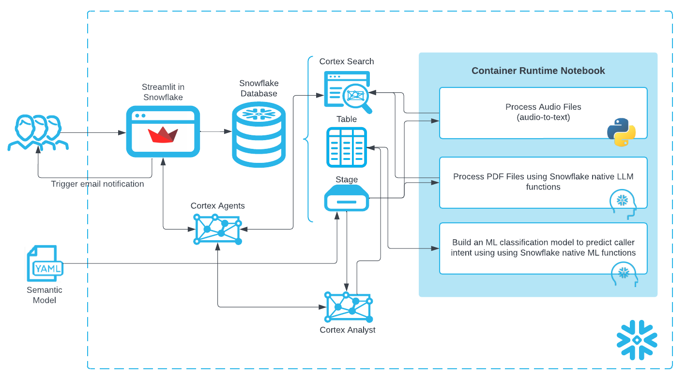

The created "Data Agent" ties these features together to provide a single app for end users to use natural language to ask questions and get answers in natural language regardless of whether the underlying data is structured or unstructured.

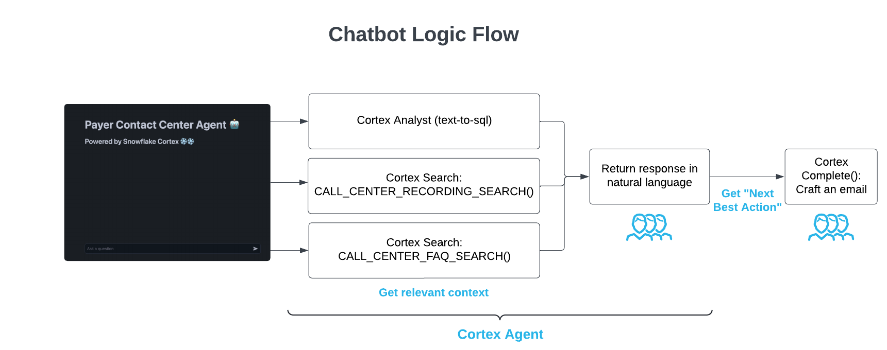

**Note:** We also include an older Streamlit app to show how to build an "agentic" workflow without Cortex Agent as well.

## Data and Snowflake Setup


> **You can access the full code in [this GIT REPO](https://github.com/Snowflake-Labs/sfguide-ai-agent-hcls-payers-cc-cortex-notebooks-mlclassification/tree/main).**

#### Data Overview
There are 3 types of data we're dealing with in this solution: 

- **Audio files:** Previously recorded calls between a Contact Center Agent and Member 

- **PDF files:** Knowledge documents currently referred to manually by Contact Center Agents to help answer member inquiries. 

- **Structured data:** Member 360 and Caller Intent training data

#### Setup
To get started using Snowflake Notebooks, first login to Snowsight. In the top-left corner, click "+ Create" to create a new Worksheet, and choose "SQL Worksheet".

Paste and run the following [setup.sql](https://github.com/Snowflake-Labs/sfguide-ai-agent-hcls-payers-cc-cortex-notebooks-mlclassification/blob/main/scripts/setup.sql) in the SQL worksheet to create Snowflake objects.

```sql
USE ROLE SYSADMIN;

CREATE OR REPLACE WAREHOUSE PAYERS_CC_WH; --by default, this creates an XS Standard Warehouse
CREATE OR REPLACE DATABASE PAYERS_CC_DB;
CREATE OR REPLACE SCHEMA PAYERS_CC_SCHEMA;

USE WAREHOUSE PAYERS_CC_WH;
USE DATABASE PAYERS_CC_DB;
USE SCHEMA PAYERS_CC_SCHEMA;

----------------------------------
----------------------------------
/* NOTEBOOK AND STREAMLIT SETUP */
----------------------------------
----------------------------------
USE ROLE ACCOUNTADMIN;

DROP COMPUTE POOL IF EXISTS PAYERS_GPU_POOL;

CREATE COMPUTE POOL PAYERS_GPU_POOL
        MIN_NODES = 1
        MAX_NODES = 5
        INSTANCE_FAMILY = GPU_NV_S;

CREATE OR REPLACE NETWORK RULE PAYERS_CC_DB.PAYERS_CC_SCHEMA.allow_all_rule
          TYPE = HOST_PORT
          MODE = EGRESS
          VALUE_LIST = ('0.0.0.0:443','0.0.0.0:80');

CREATE OR REPLACE EXTERNAL ACCESS INTEGRATION payers_allow_all_integration
        ALLOWED_NETWORK_RULES = (PAYERS_CC_DB.PAYERS_CC_SCHEMA.allow_all_rule)
        ENABLED = TRUE;

CREATE OR REPLACE NETWORK RULE PAYERS_CC_DB.PAYERS_CC_SCHEMA.pipy_network_rule
          TYPE = HOST_PORT
          MODE = EGRESS
          VALUE_LIST = ('pypi.org', 'pypi.python.org', 'pythonhosted.org',  'files.pythonhosted.org');

CREATE OR REPLACE EXTERNAL ACCESS INTEGRATION payers_pipy_access_integration
        ALLOWED_NETWORK_RULES = (PAYERS_CC_DB.PAYERS_CC_SCHEMA.pipy_network_rule)
        ENABLED = TRUE;

GRANT OWNERSHIP ON COMPUTE POOL PAYERS_GPU_POOL TO ROLE SYSADMIN;
GRANT OWNERSHIP ON INTEGRATION payers_pipy_access_integration TO ROLE SYSADMIN;
GRANT OWNERSHIP ON INTEGRATION payers_allow_all_integration TO ROLE SYSADMIN;

USE ROLE SYSADMIN;

-- Create email integration for streamlit app
CREATE OR REPLACE NOTIFICATION INTEGRATION payers_cc_email_int
TYPE=EMAIL
ENABLED=TRUE;

----------------------------------
----------------------------------
/*          DATA SETUP          */
----------------------------------
----------------------------------

CREATE OR REPLACE FILE FORMAT PAYERS_CC_DB.PAYERS_CC_SCHEMA.CSVFORMAT 
    SKIP_HEADER = 1
    TYPE = 'CSV'
    FIELD_OPTIONALLY_ENCLOSED_BY = '"';

CREATE OR REPLACE STAGE NOTEBOOK DIRECTORY=(ENABLE=true); --to store notebook assets
CREATE OR REPLACE STAGE CHATBOT_APP DIRECTORY=(ENABLE=true); --to store streamlit assets
CREATE OR REPLACE STAGE RAW_DATA 
DIRECTORY = (ENABLE = TRUE) 
ENCRYPTION=(TYPE='SNOWFLAKE_SSE'); --to store data assets
```

**Upload files** to the stages within the `PAYER_CC_SCHEMA`
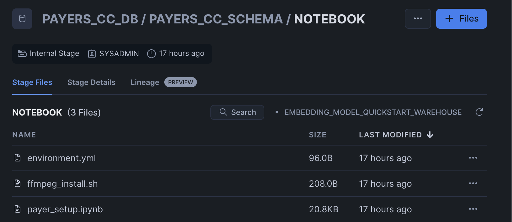
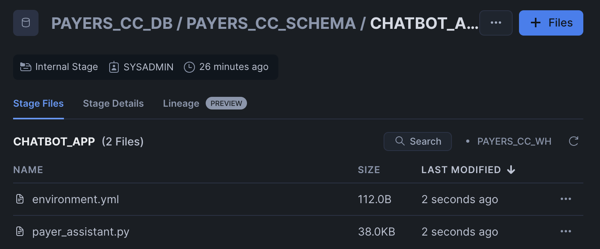
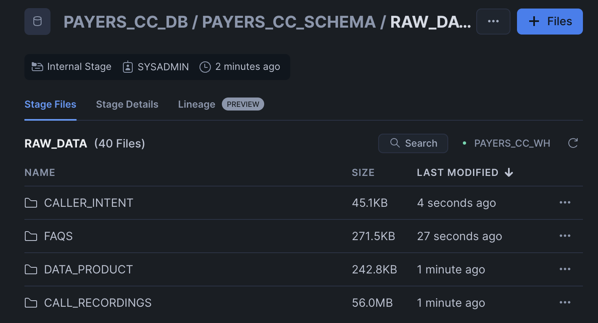

Click '+ Files' in the top right of the stage. Upload all files that you downloaded from GitHub into the stage. The contents should match the app directory. **Make sure your the files in your stages match the following**:

- **Data Files:** Upload data files to the `RAW_DATA` stage from [data](https://github.com/Snowflake-Labs/sfguide-ai-agent-hcls-payers-cc-cortex-notebooks-mlclassification/tree/main/notebooks/data). MAKE SURE TO KEEP THE SAME FOLDER STRUCTURE.
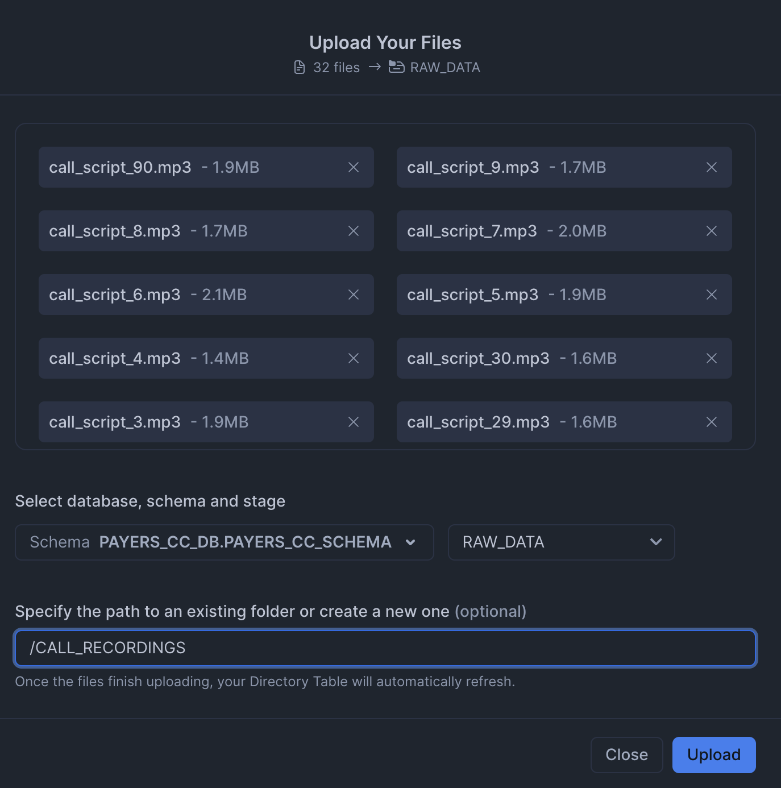
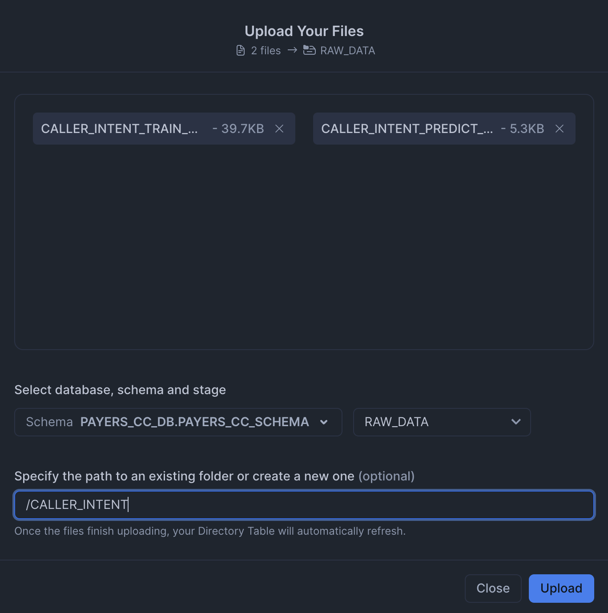
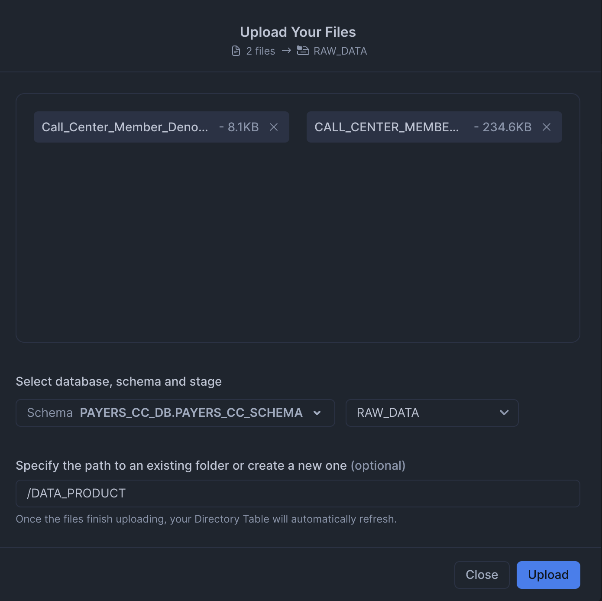
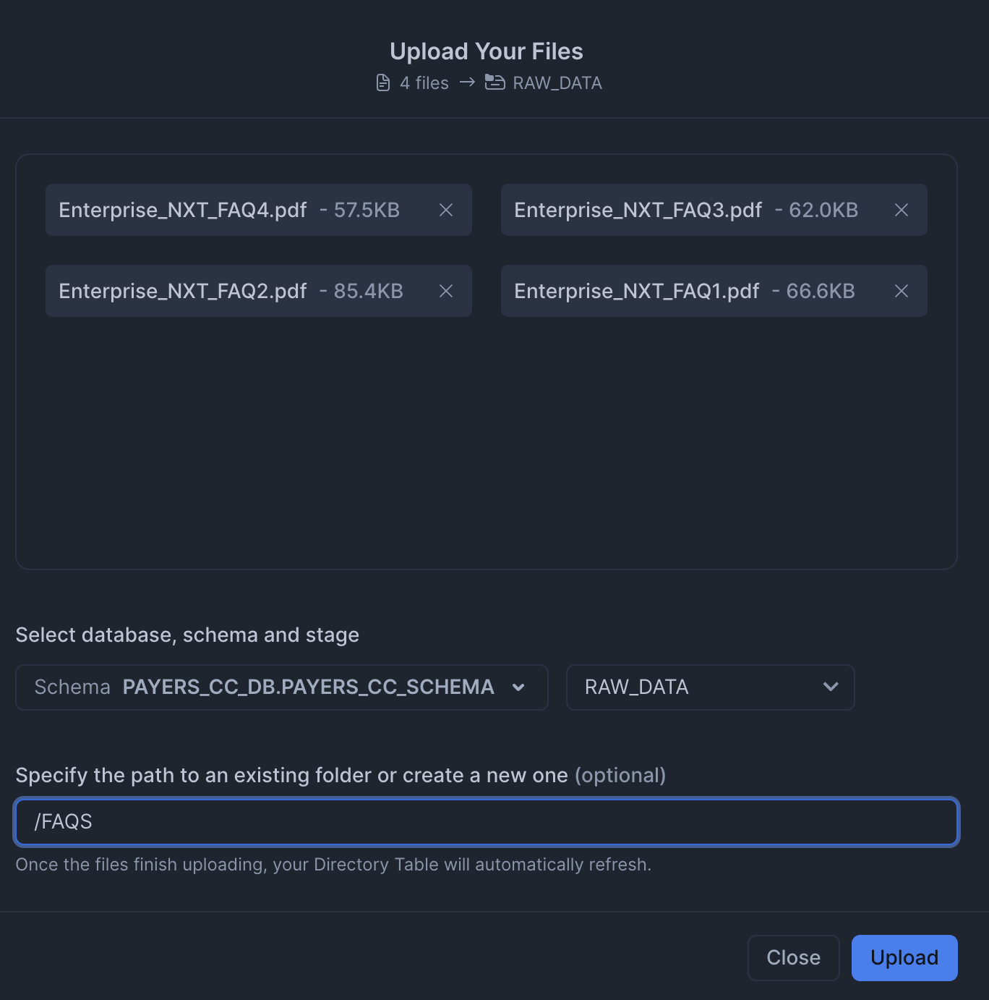

- **Notebook Files:** Upload notebook files to the `NOTEBOOK` stage from [notebook](https://github.com/Snowflake-Labs/sfguide-ai-agent-hcls-payers-cc-cortex-notebooks-mlclassification/tree/main/notebooks).
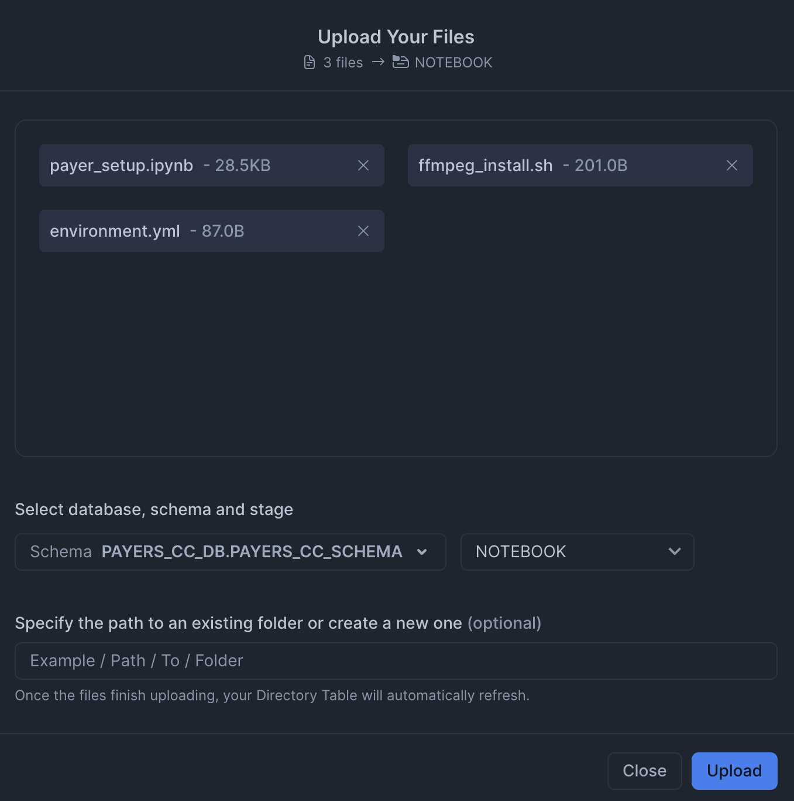

- **Streamlit Files:** Upload all Streamlit and chatbot-related files to the `CHATBOT_APP` stage from [streamlit](https://github.com/Snowflake-Labs/sfguide-ai-agent-hcls-payers-cc-cortex-notebooks-mlclassification/tree/main/scripts/streamlit). Remember to upload [the streamlit-specific environment.yml](https://github.com/Snowflake-Labs/sfguide-ai-agent-hcls-payers-cc-cortex-notebooks-mlclassification/blob/main/scripts/streamlit/environment.yml) file as well. You can also upload the older Streamlit app (`payer_assistant_old.py`), which does not use Cortex Agents.
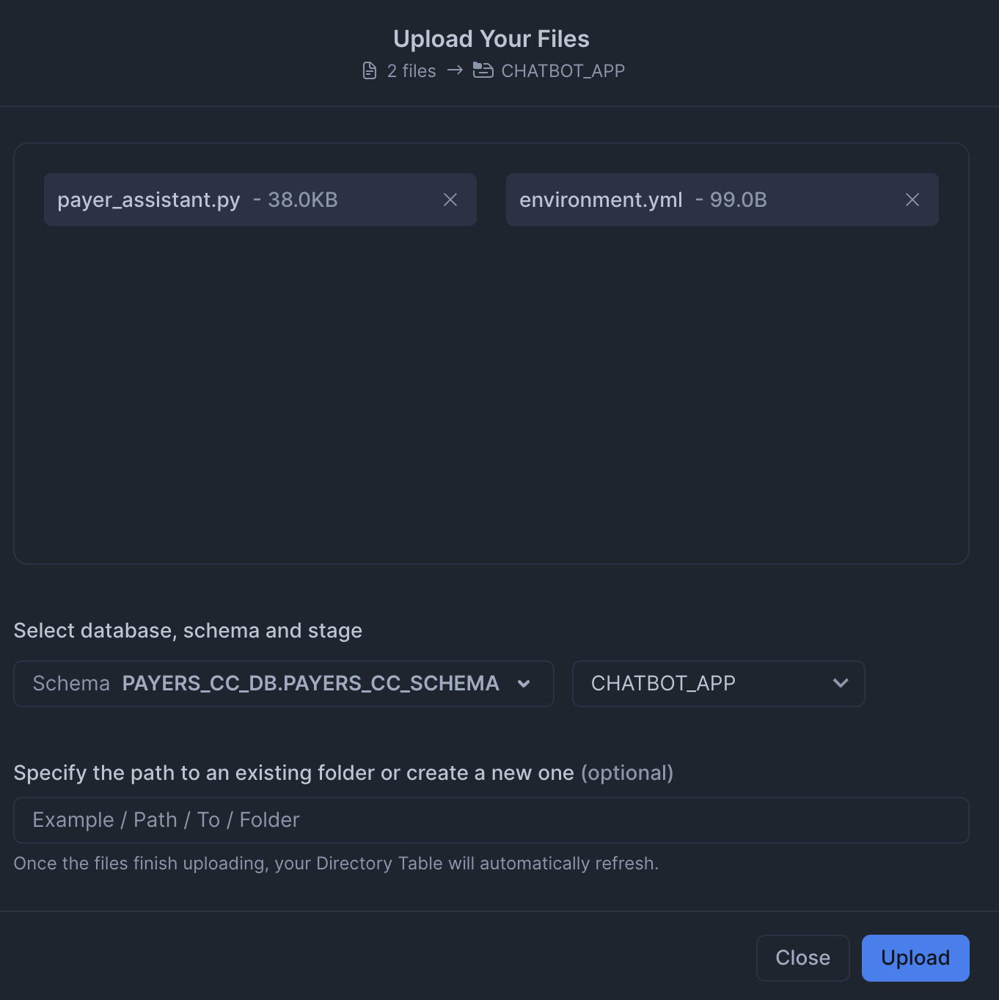

Paste and run the following [setup.sql](https://github.com/Snowflake-Labs/sfguide-ai-agent-hcls-payers-cc-cortex-notebooks-mlclassification/blob/main/scripts/setup.sql) in the SQL worksheet to create the Notebooks and Streamlit app from the staged files.

```sql
TRUNCATE TABLE IF EXISTS CALL_CENTER_MEMBER_DENORMALIZED;

CREATE OR REPLACE TABLE CALL_CENTER_MEMBER_DENORMALIZED (
    MEMBER_ID NUMBER(38,0),
    NAME VARCHAR(16777216),
    DOB DATE,
    GENDER VARCHAR(16777216),
    ADDRESS VARCHAR(16777216),
    MEMBER_PHONE VARCHAR(16777216),
    PLAN_ID VARCHAR(16777216),
    PLAN_NAME VARCHAR(16777216),
    CVG_START_DATE DATE,
    CVG_END_DATE DATE,
    PCP VARCHAR(16777216),
    PCP_PHONE VARCHAR(16777216),
    PLAN_TYPE VARCHAR(16777216),
    PREMIUM NUMBER(38,0),
    SMOKER_IND BOOLEAN,
    LIFESTYLE_INFO VARCHAR(16777216),
    CHRONIC_CONDITION VARCHAR(16777216),
    GRIEVANCE_ID VARCHAR(16777216),
    GRIEVANCE_DATE DATE,
    GRIEVANCE_TYPE VARCHAR(16777216),
    GRIEVANCE_STATUS VARCHAR(16777216),
    GRIEVANCE_RESOLUTION_DATE DATE,
    CLAIM_ID VARCHAR(16777216),
    CLAIM_SERVICE_FROM_DATE DATE,
    CLAIM_PROVIDER VARCHAR(16777216),
    CLAIM_SERVICE VARCHAR(16777216),
    CLAIM_BILL_AMT NUMBER(38,0),
    CLAIM_ALLOW_AMT NUMBER(38,0),
    CLAIM_COPAY_AMT NUMBER(38,0),
    CLAIM_COINSURANCE_AMT NUMBER(38,0),
    CLAIM_DEDUCTIBLE_AMT NUMBER(38,0),
    CLAIM_PAID_AMT NUMBER(38,0),
    CLAIM_STATUS VARCHAR(16777216),
    CLAIM_PAID_DATE DATE,
    CLAIM_SERVICE_TO_DATE DATE,
    CLAIM_SUBMISSION_DATE DATE
);

COPY INTO CALL_CENTER_MEMBER_DENORMALIZED
FROM @RAW_DATA/DATA_PRODUCT/CALL_CENTER_MEMBER_DENORMALIZED.csv
FILE_FORMAT = PAYERS_CC_DB.PAYERS_CC_SCHEMA.CSVFORMAT
ON_ERROR=CONTINUE
FORCE = TRUE;

-- Load caller intent training data
TRUNCATE TABLE IF EXISTS CALLER_INTENT_TRAIN_DATASET;

CREATE OR REPLACE TABLE CALLER_INTENT_TRAIN_DATASET (
    MEMBER_ID VARCHAR(16777216),
    RECENT_ENROLLMENT_EVENT_IND BOOLEAN,
    PCP_CHANGE_IND BOOLEAN,
    ACTIVE_CM_PROGRAM_IND BOOLEAN,
    CHRONIC_CONDITION_IND BOOLEAN,
    ACTIVE_GRIEVANCE_IND BOOLEAN,
    ACTIVE_CLAIM_IND BOOLEAN,
    POTENTIAL_CALLER_INTENT_CATEGORY VARCHAR(16777216)
);

COPY INTO CALLER_INTENT_TRAIN_DATASET
FROM @RAW_DATA/CALLER_INTENT/CALLER_INTENT_TRAIN_DATASET.csv
FILE_FORMAT = PAYERS_CC_DB.PAYERS_CC_SCHEMA.CSVFORMAT
ON_ERROR=CONTINUE
FORCE = TRUE;

-- Load caller intent prediction data
TRUNCATE TABLE IF EXISTS CALLER_INTENT_PREDICT_DATASET;

CREATE OR REPLACE TABLE CALLER_INTENT_PREDICT_DATASET (
    MEMBER_ID VARCHAR(16777216),
    RECENT_ENROLLMENT_EVENT_IND BOOLEAN,
    PCP_CHANGE_IND BOOLEAN,
    ACTIVE_CM_PROGRAM_IND BOOLEAN,
    CHRONIC_CONDITION_IND BOOLEAN,
    ACTIVE_GRIEVANCE_IND BOOLEAN,
    ACTIVE_CLAIM_IND BOOLEAN
);

COPY INTO CALLER_INTENT_PREDICT_DATASET
FROM @RAW_DATA/CALLER_INTENT/CALLER_INTENT_PREDICT_DATASET.csv
FILE_FORMAT = PAYERS_CC_DB.PAYERS_CC_SCHEMA.CSVFORMAT
ON_ERROR=CONTINUE
FORCE = TRUE;

-- Make sure staged files can be seen by directory
ALTER STAGE RAW_DATA REFRESH;

-- Main setup notebook
CREATE OR REPLACE NOTEBOOK PAYERS_CC_MAIN_SETUP
FROM '@PAYERS_CC_DB.PAYERS_CC_SCHEMA.NOTEBOOK'
MAIN_FILE = 'payer_setup.ipynb'
QUERY_WAREHOUSE = 'PAYERS_CC_WH'
COMPUTE_POOL='PAYERS_GPU_POOL'
RUNTIME_NAME='SYSTEM$GPU_RUNTIME';

ALTER NOTEBOOK PAYERS_CC_MAIN_SETUP ADD LIVE VERSION FROM LAST;
ALTER NOTEBOOK PAYERS_CC_MAIN_SETUP set external_access_integrations = (
"PAYERS_PIPY_ACCESS_INTEGRATION", 
"PAYERS_ALLOW_ALL_INTEGRATION");

CREATE OR REPLACE STREAMLIT PAYERS_CC_CHATBOT
ROOT_LOCATION = '@PAYERS_CC_DB.PAYERS_CC_SCHEMA.CHATBOT_APP'
MAIN_FILE = 'payer_assistant.py'
QUERY_WAREHOUSE = 'PAYERS_CC_WH'
COMMENT = '{"origin":"sf_sit-is", "name":"payer_call_center_assistant_v2", "version":{"major":1, "minor":0}, "attributes":{"is_quickstart":1, "source":"streamlit"}}';

CREATE OR REPLACE STREAMLIT PAYERS_CC_CHATBOT_OLD
ROOT_LOCATION = '@PAYERS_CC_DB.PAYERS_CC_SCHEMA.CHATBOT_APP'
MAIN_FILE = 'payer_assistant_old.py'
QUERY_WAREHOUSE = 'PAYERS_CC_WH'
COMMENT = '{"origin":"sf_sit-is", "name":"payer_call_center_assistant_v2", "version":{"major":1, "minor":0}, "attributes":{"is_quickstart":1, "source":"streamlit"}}';
```

## Access Setup Notebook


The notebook has already been created in your Snowflake account! All packages and Python setup has already been completed.

To access it, navigate to Snowsight, select the `SYSADMIN` role, and click the Project, click the Notebooks tab. Open `PAYERS_CC_MAIN_SETUP` and run each of the cells.


Within this notebook, you'll prepare all the unstructured data needed before you can run the Streamlit App. Once this data is processed, the chatbot will have a rich knowledge base to start from that's all stored within the Cortex Search and Cortex Analyst services.

You will also predict the intent of a caller using historical data.This will allow Contact Center Agents to be better prepared when faced with an incoming call.

## Run Streamlit Application


The Streamlit in Snowflake Application has been deployed as part of the setup process. To access it, navigate to Snowsight, select the `SYSADMIN` role, and under Projects, click the Streamlit tab. Open `PAYERS_CC_CHATBOT` and explore.

This app simulates a few different scenarios where Contact Center Agents have to assist with incoming calls. You will find sample questions and other configs in the sidebar.

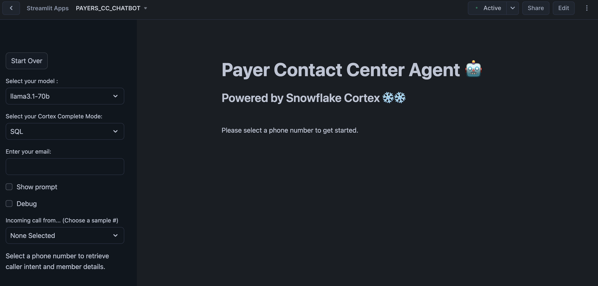

You can also open `PAYERS_CC_CHATBOT_OLD` to access the version that does not include Cortex Agents to show you what a more manual "agentic" flow would look like.

## Conclusion And Resources


In this guide, you processed a knowledge base of unstructured and structured Enterprise data and then used it to build an AI-powered Assistant for a Contact Center.

### What You Learned
- How to use Snowflake Notebooks for unstructured data processing
- How to build a Caller Intent ML Classification Model and execute predictions with low-code using Snowflake's ML Functions
- How to leverage Cortex Search for a hybrid (vector and keyword) search engine on text data
- How to use Cortex LLM functions (Cortex Complete) for access to industry-leading large language models (LLMs)
- How to use Cortex Agents to orchestrate between structured and unstructured data sources
- How to prototype a UI using Streamlit

### Related Resources
- [Docs: Snowflake Notebooks on Container Runtime](https://docs.snowflake.com/en/user-guide/ui-snowsight/notebooks-on-spcs)
- [Docs: Snowflake Cortex](https://docs.snowflake.com/en/user-guide/snowflake-cortex.html)
- [Docs: Snowflake ML Classification](https://docs.snowflake.com/en/user-guide/ml-functions/classification)
- [Docs: Streamlit](https://docs.streamlit.io/)
- [Quickstart: Getting Started with Cortex Agents](/en/developers/guides/getting-started-with-cortex-agents/)
- [Quickstart: Getting Started with Snowflake Cortex Agents API and React](/en/developers/guides/getting-started-with-snowflake-agents-api-and-react/)
- [Fork Notebook on GitHub](https://github.com/Snowflake-Labs/sfguide-ai-agent-hcls-payers-cc-cortex-notebooks-mlclassification/tree/main?tab=readme-ov-file)
- [Download Reference Architecture](https://quickstarts.snowflake.com/guide/ai_agent_health_payers_cc/img/16ed9348c75c10c0.png?_ga=2.261525770.687428192.1757961332-1806211272.1741193538)
- [Watch Demo](https://youtu.be/UXge7Vv8uSg?si=aUg8-uVOgx7iSulk)
