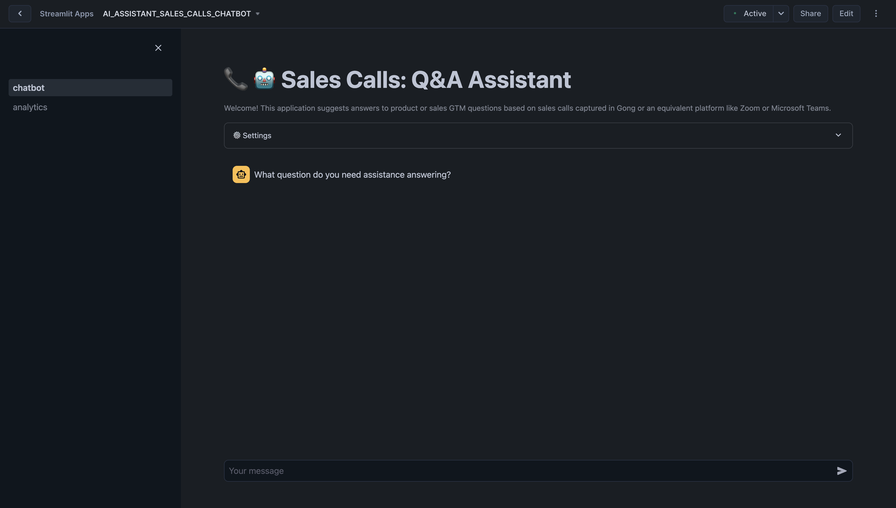
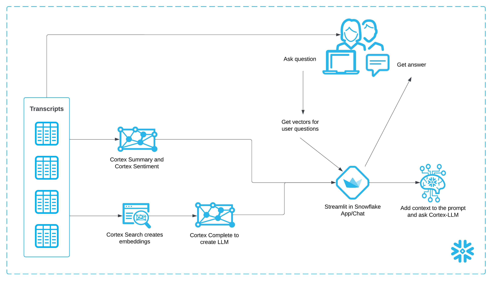
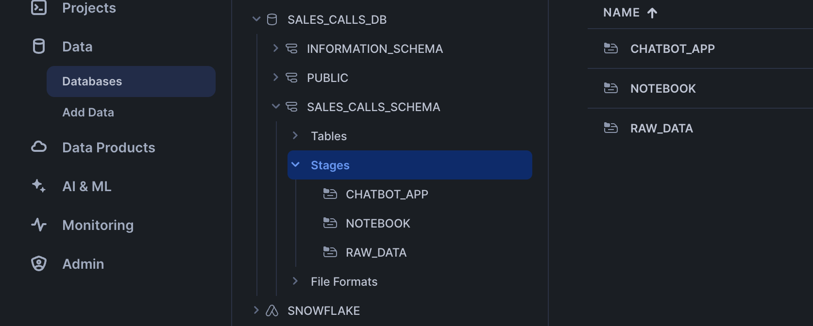
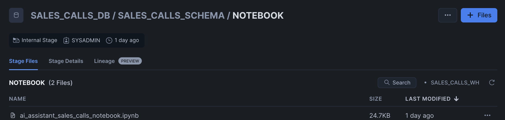
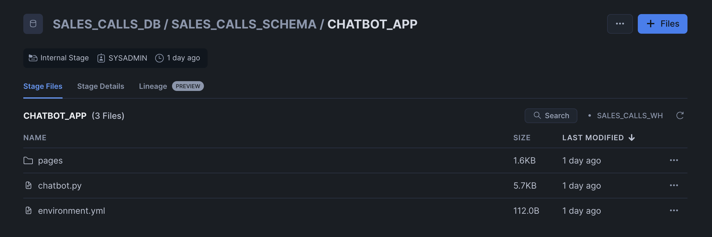
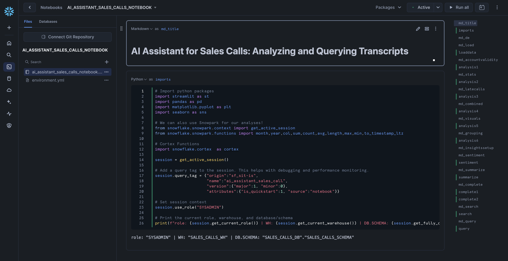
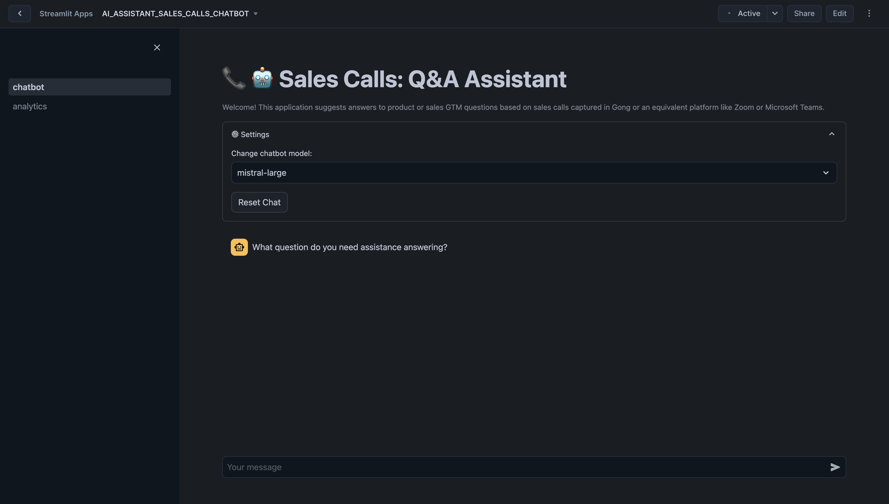
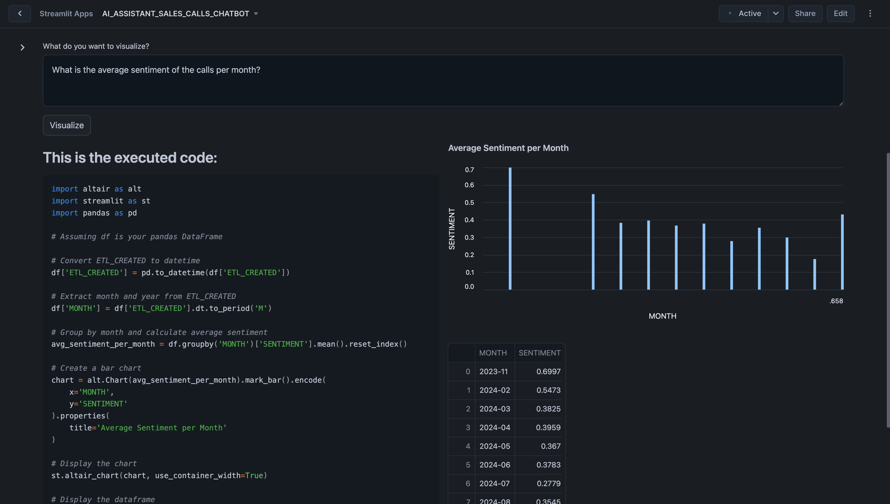

author: Sikha Das
id: ai-assistant-for-sales-calls
categories: snowflake-site:taxonomy/solution-center/certification/quickstart, snowflake-site:taxonomy/solution-center/certification/certified-solution, snowflake-site:taxonomy/solution-center/includes/architecture, snowflake-site:taxonomy/product/ai, snowflake-site:taxonomy/snowflake-feature/build, snowflake-site:taxonomy/snowflake-feature/cortex-llm-functions
language: en
summary: Build AI assistants for sales call analysis using Snowflake Cortex for transcription, summarization, coaching insights, and trends.
environments: web
status: Published 
feedback link: https://github.com/Snowflake-Labs/sfguides/issues


# Building AI Assistant using Snowflake Cortex in Snowflake Notebooks
<!-- ------------------------ -->
## Overview


Sales teams in SaaS organizations often face challenges in consolidating and analyzing call data to identify gaps in their go-to-market (GTM) strategies and product offerings. A common limitation is the inability to comprehensively capture and centralize transcripts across all sales calls, which results in fragmented insights. This lack of a holistic view creates challenges for both GTM and product teams:

- **Product Teams**: Struggle to close feedback loops due to limited access to consolidated, searchable insights from customer and sales team interactions. This hinders their ability to align product development with customer needs.

- **GTM Teams**: Have a narrow understanding of the key factors negatively impacting sales performance across various segments and verticals. This limits their ability to optimize strategies and address pressing issues effectively.

Addressing these challenges with a centralized, AI-driven approach can empower teams to gain actionable insights, enhance decision-making, and drive better alignment between product and GTM strategies.

The AI Assistant for Sales Calls helps organizations derive actionable insights from their sales call data. Built using Snowflake Cortex, this guide demonstrates how to query, analyze, and visualize sales call transcripts and associated datasets to improve sales strategies and customer interactions.


This guide covers:
- **Data Consolidation**: Aggregating transcripts and related call data into a single platform for efficient analysis.

- **Call Performance Metrics**: Evaluating transcript lengths, call durations, and scheduling efficiency.

- **Customer Engagement Analysis**: Identifying key accounts and understanding call volumes to prioritize efforts.

- **Strategic Insights**: Discovering trends, patterns, and anomalies in sales conversations.


### What You Will Learn

- How to use [Snowflake Notebooks](https://docs.snowflake.com/en/user-guide/ui-snowsight/notebooks) and [Snowpark Python](https://docs.snowflake.com/en/developer-guide/snowpark/python/index) for unstructured data processing
- How to leverage [Cortex Search](https://docs.snowflake.com/en/user-guide/snowflake-cortex/cortex-search/cortex-search-overview) for a hybrid (vector and keyword) search engine on text data
- How to use [Cortex LLM functions](https://docs.snowflake.com/en/user-guide/snowflake-cortex/llm-functions) (Cortex Complete) for access to industry-leading large language models (LLMs)
- How to build a chatbot and analytics application using [Streamlit](https://docs.streamlit.io/) in Snowflake


### Prerequisites
- A [GitHub](https://github.com/) Account to access the [GIT REPO](https://github.com/Snowflake-Labs/sfguide-building-ai-assistant-using-snowflake-cortex-snowflake-notebooks/tree/main)
- A Snowflake account login with a role that has the ability to create database, schema, tables, stages, user-defined functions, and stored procedures. If not, you will need to register for [a free trial](https://signup.snowflake.com/?utm_source=snowflake-devrel&utm_medium=developer-guides&_fsi=OuImfiWC&_fsi=OuImfiWC&utm_cta=developer-guides) or use a different role.

### What You Will Build

- A Notebook to process and analyze sales call transcripts
- A Streamlit application to interact with the analyzed data and extract actionable insights

**Architecture Diagram:**




## Data and Snowflake Setup

> **You can access the full code in [this GIT REPO](https://github.com/Snowflake-Labs/sfguide-building-ai-assistant-using-snowflake-cortex-snowflake-notebooks/tree/main).**

To get started using Snowflake Notebooks, first login to Snowsight. In the top-left corner, click "+ Create" to create a new Worksheet, and choose "SQL Worksheet".


<br></br>
Paste and run the following [setup.sql](https://github.com/Snowflake-Labs/sfguide-ai-assistant-for-sales-calls/blob/main/scripts/setup.sql) in the SQL worksheet to create Snowflake objects (warehouse, database, schema).

```sql
USE ROLE SYSADMIN;

CREATE OR REPLACE WAREHOUSE SALES_CALLS_WH; --by default, this creates an XS Standard Warehouse
CREATE OR REPLACE DATABASE SALES_CALLS_DB;
CREATE OR REPLACE SCHEMA SALES_CALLS_SCHEMA;

USE WAREHOUSE SALES_CALLS_WH;
USE DATABASE SALES_CALLS_DB;
USE SCHEMA SALES_CALLS_SCHEMA;

----------------------------------
----------------------------------
/*          DATA SETUP          */
----------------------------------
----------------------------------

-- Create csv format
CREATE OR REPLACE FILE FORMAT SALES_CALLS_DB.SALES_CALLS_SCHEMA.CSVFORMAT 
    SKIP_HEADER = 0 
    TYPE = 'CSV'
    FIELD_OPTIONALLY_ENCLOSED_BY = '"';

-- Create external stage with the csv format to stage the diamonds dataset
CREATE OR REPLACE STAGE RAW_DATA
    FILE_FORMAT = SALES_CALLS_DB.SALES_CALLS_SCHEMA.CSVFORMAT 
    URL = 's3://sfquickstarts/sfguide_building_ai_assistant_using_snowflake_cortex_snowflake_notebooks/'
    DIRECTORY = (ENABLE = TRUE);

-- Setup ACCOUNT_D Table
CREATE OR REPLACE TABLE ACCOUNT_D (
    ACCOUNT_NAME VARCHAR(225),
    SFDC_ACCOUNT_ID VARCHAR(16777216),
    ETL_VALID_NOW VARCHAR(1),
    ACCOUNT_STATE VARCHAR(16777216)
);

TRUNCATE TABLE IF EXISTS ACCOUNT_D;

COPY INTO ACCOUNT_D
FROM @RAW_DATA/ACCOUNT_D.csv
FILE_FORMAT = SALES_CALLS_DB.SALES_CALLS_SCHEMA.CSVFORMAT
ON_ERROR=CONTINUE
FORCE = TRUE;

-- Setup CALLS Table
CREATE OR REPLACE TABLE CALLS (
	ID VARCHAR(16777216),
	URL VARCHAR(16777216),
	TITLE VARCHAR(16777216),
	SCHEDULED VARCHAR(16777216),
	STARTED VARCHAR(16777216),
	DURATION VARCHAR(16777216)
);

TRUNCATE TABLE IF EXISTS CALLS;

COPY INTO CALLS
FROM @RAW_DATA/CALLS.csv
FILE_FORMAT = SALES_CALLS_DB.SALES_CALLS_SCHEMA.CSVFORMAT
ON_ERROR=CONTINUE
FORCE = TRUE;

-- Setup CALLS_TRANSCRIPT Table
CREATE OR REPLACE TABLE CALLS_TRANSCRIPT (
	CALLID VARCHAR(16777216),
	TRANSCRIPT VARIANT,
	ETL_CREATED TIMESTAMP_TZ(9)
);

TRUNCATE TABLE IF EXISTS CALLS_TRANSCRIPT;

COPY INTO CALLS_TRANSCRIPT
FROM @RAW_DATA/CALLS_TRANSCRIPT.csv
FILE_FORMAT = SALES_CALLS_DB.SALES_CALLS_SCHEMA.CSVFORMAT
ON_ERROR=CONTINUE
FORCE = TRUE;

-- Setup GONG_GONG_CALL_C
CREATE OR REPLACE TABLE GONG_GONG_CALL_C (
	GONG_CALL_ID_C VARCHAR(384),
	GONG_PRIMARY_ACCOUNT_C VARCHAR(18)
);

TRUNCATE TABLE IF EXISTS GONG_GONG_CALL_C;

COPY INTO GONG_GONG_CALL_C
FROM @RAW_DATA/GONG_GONG_CALL_C.csv
FILE_FORMAT = SALES_CALLS_DB.SALES_CALLS_SCHEMA.CSVFORMAT
ON_ERROR=CONTINUE
FORCE = TRUE;

-- make sure staged files can be seen by directory
ALTER STAGE RAW_DATA REFRESH;

----------------------------------
----------------------------------
/* NOTEBOOK AND STREAMLIT SETUP */
----------------------------------
----------------------------------

CREATE OR REPLACE STAGE NOTEBOOK DIRECTORY=(ENABLE=true); --to store notebook assets
CREATE OR REPLACE STAGE CHATBOT_APP DIRECTORY=(ENABLE=true); --to store streamlit assets
```

**Upload required files** to the correct stages within the `SALES_CALLS_SCHEMA`



Click '+ Files' in the top right of the stage. Upload all files that you downloaded from GitHub into the stage. The contents should match the app directory. **Make sure your the files in your stages match the following**:

- **Notebook Files:** Upload notebook files to the `NOTEBOOK` stage from [notebook](https://github.com/Snowflake-Labs/sfguide-ai-assistant-for-sales-calls/tree/main/notebooks).


- **Streamlit Files:** Upload all Streamlit and chatbot-related files to the `CHATBOT_APP` stage from [streamlit](https://github.com/Snowflake-Labs/sfguide-ai-assistant-for-sales-calls/tree/main/scripts/streamlit). Remember to upload [the streamlit-specific environment.yml](https://github.com/Snowflake-Labs/sfguide-building-ai-assistant-using-snowflake-co[…]snowflake-notebooks/blob/main/scripts/streamlit/environment.yml) file as well. Make sure to upload the [analytics.py](https://github.com/Snowflake-Labs/sfguide-building-ai-assistant-using-snowflake-cortex-snowflake-notebooks/blob/main/scripts/streamlit/pages/analytics.py) within a `/pages/` path.


<br></br>


<br></br>

Paste and run the following [setup.sql](https://github.com/Snowflake-Labs/sfguide-ai-assistant-for-sales-calls/blob/main/scripts/setup.sql) in the SQL worksheet to load the  data into tables and create a notebook and streamlit app from the staged files.

```sql
-- Create Notebook 
CREATE OR REPLACE NOTEBOOK ai_assistant_sales_calls_notebook
FROM @NOTEBOOK
MAIN_FILE = 'ai_assistant_sales_calls_notebook.ipynb' 
QUERY_WAREHOUSE = SALES_CALLS_WH
RUNTIME_NAME = 'SYSTEM$BASIC_RUNTIME' 
COMPUTE_POOL = 'SYSTEM_COMPUTE_POOL_CPU'
IDLE_AUTO_SHUTDOWN_TIME_SECONDS = 3600;
ALTER NOTEBOOK ai_assistant_sales_calls_notebook ADD LIVE VERSION FROM LAST;

-- Create Streamlit App
CREATE OR REPLACE STREAMLIT ai_assistant_sales_calls_chatbot
ROOT_LOCATION = @CHATBOT_APP
MAIN_FILE = 'chatbot.py'
QUERY_WAREHOUSE = SALES_CALLS_WH
COMMENT = '{"origin":"sf_sit-is", "name":"ai_assistant_sales_call", "version":{"major":1, "minor":0}, "attributes":{"is_quickstart":1, "source":"streamlit"}}';
```

## Access Notebook

The notebook has already been created in your Snowflake account! All packages and Python setup has already been completed.

To access it, navigate to Snowsight, select the `SYSADMIN` role, and click the Project, click the Notebooks tab. Open **ai_assistant_sales_calls_notebook** and run each of the cells.



Within this notebook, you'll explore sales call transcripts, apply Snowflake Cortex AI models for sentiment analysis and summarization, and visualize key trends such as customer sentiment, product feedback, and competitor mentions.

## Run Streamlit Application

Chatbot Streamlit in Snowflake Application has been deployed as part of the setup process. To access it, navigate to Snowsight, select the `SYSADMIN` role, and under Projects, click the Streamlit tab. Open **ai_assistant_sales_calls_chatbot** and explore.

In the **Chatbot** tab, you can interact with your sales call transcripts using an intuitive Q&A interface powered by Snowflake Cortex. Ask questions about customer sentiment, product feedback, competitor mentions, and other key insights. Customize the AI model settings, search for specific details, and receive concise answers backed by transcript context.


Here are some example questions you can ask the chatbot:
1. How do customers feel about the notification features? Are there any consistent suggestions or frustrations that should be prioritized?
2. What are the main reasons customers are considering or switching to competitors, and how can we address these concerns in our messaging?
3. Are there any competitive strengths or weaknesses that our sales team should emphasize when engaging with prospects?
4. Are there any recurring concerns about the current reporting or analytics capabilities that need to be addressed in future updates?

Once you ask a question, the assistant begins processing it. You'll see a status update showing the steps being performed. Once the process completes, the assistant provides a concise answer to your question in the chat window. Below the answer, you’ll see a section titled 'Context used to generate the answer'. Click on any transcript ID to expand and view the full context of the relevant document.


<br></br>

In the **Analytics** tab, you can explore visualizations and metrics derived from your sales call data. Analyze sentiment trends, product and competitor mentions, and other critical metrics to uncover actionable insights and improve decision-making.


Here are some examples you can visualize:
1. What is the average sentiment of the calls per month?
2. Plot the average sentiment score for calls mentioning each product.

When you submit a question, the system processes your input by generating Python code to query and analyze the relevant data. The generated code and its corresponding output—such as graphs, charts, or tables—are displayed in the interface, allowing you to immediately see the insights.




## Conclusion And Resources

In this guide, you learned how to use Snowflake's Cortex AI to analyze sales call transcripts and extract actionable insights to improve go-to-market (GTM) strategies and product offerings. You also learned how to use Streamlit to create an intuitive application for interacting with the analyzed data.

### What You Learned

- How to use Snowflake Notebooks and Snowpark Python for unstructured data processing
- How to leverage Cortex Search for a hybrid (vector and keyword) search engine on text data
- How to use Cortex LLM functions (Cortex Complete) for access to industry-leading large language models (LLMs)
- How to prototype a UI using Streamlit

### Related Resources
- [Snowflake Cortex Documentation](https://docs.snowflake.com/en/user-guide/snowflake-cortex.html)
- [Streamlit Documentation](https://docs.streamlit.io/)
- [Fork notebook on GitHub](https://github.com/Snowflake-Labs/sfguide-ai-assistant-for-sales-calls/)
- [Download Reference Architecture](/content/dam/snowflake-site/developers/2024/12/ai-assistant-sales-calls.pdf)
- [Read Medium Blog](https://medium.com/snowflake/conversations-to-insights-building-an-ai-sales-assistant-with-snowflake-cortex-and-da82a2f154e5)
- [Watch Demo](https://youtu.be/-26LxIDOOxI?list=TLGGiS_zeHqWzZsxOTA5MjAyNQ)
