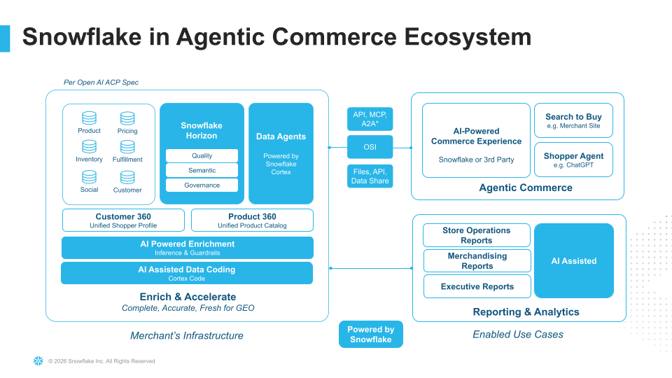

author: Amit Gupta, Joviane Bellegarde
id: ai-powered-beauty-advisor-for-retail
summary: Build an AI-powered beauty advisor using Snowflake Cortex Agents, Cortex Search, Cortex Analyst, and Snowpark Container Services for personalized product recommendations.
categories: snowflake-site:taxonomy/solution-center/certification/quickstart, snowflake-site:taxonomy/product/ai, snowflake-site:taxonomy/snowflake-feature/cortex-llm-functions, snowflake-site:taxonomy/snowflake-feature/ingestion/conversational-assistants, snowflake-site:taxonomy/industry/retail-cpg
environments: web
language: en
status: Hidden
feedback link: https://github.com/Snowflake-Labs/sfguides/issues
tags: Cortex Agents, Cortex Analyst, Cortex Search, SPCS, Retail, AI, Semantic Views
fork repo link: https://github.com/Snowflake-Labs/sfguide-ai-powered-beauty-advisor-for-retail

# AI-Powered Beauty Advisor for Retail

<!-- ------------------------ -->
## Overview

In this guide, you will build an **AI-powered beauty advisor** that helps retail customers discover products, get personalized recommendations, and complete purchases — all through natural language conversation. The application combines structured product data, unstructured social content, and real-time face analysis into a unified agentic experience powered by Snowflake Cortex.

### What You Will Build

A full-stack agentic commerce application that includes:
- A **Cortex Agent** with 16 tools spanning product search, social media analysis, customer identification, cart management, and checkout
- **5 Semantic Views** enabling Cortex Analyst to answer natural language questions about products, customers, orders, promotions, and social trends
- **2 Cortex Search Services** for semantic search across product catalogs and social media content
- **Custom UDFs and Stored Procedures** for face analysis, customer identification, and product matching
- A **React + TypeScript frontend** with a conversational chat interface that renders product cards, cart previews, and order confirmations
- A **FastAPI backend** deployed on Snowpark Container Services for face recognition and skin analysis

### What You Will Learn

- How to create Semantic Views for Cortex Analyst
- How to configure Cortex Search Services for hybrid semantic + keyword search
- How to build a multi-tool Cortex Agent with orchestration budget tuning
- How to deploy a containerized backend on Snowpark Container Services (SPCS)
- How to build a React frontend that streams responses from the Cortex Agent REST API
- How to connect structured analytics, unstructured search, and custom ML tools in a single agent

### Prerequisites

- A <a href="https://signup.snowflake.com/?utm_source=snowflake-devrel&utm_medium=developer-guides&utm_cta=developer-guides" target="_blank">Snowflake account</a> with ACCOUNTADMIN access (or a role with CREATE DATABASE, CREATE WAREHOUSE, CREATE COMPUTE POOL, and BIND SERVICE ENDPOINT privileges)
- Access to <a href="https://docs.snowflake.com/en/user-guide/snowflake-cortex/cortex-agents" target="_blank">Cortex Agents</a>, <a href="https://docs.snowflake.com/en/user-guide/snowflake-cortex/cortex-search/cortex-search-overview" target="_blank">Cortex Search</a>, and <a href="https://docs.snowflake.com/en/user-guide/snowflake-cortex/cortex-analyst" target="_blank">Cortex Analyst</a>
- <a href="https://git-scm.com/book/en/v2/Getting-Started-Installing-Git" target="_blank">Git</a> installed
- <a href="https://www.docker.com/products/docker-desktop/" target="_blank">Docker Desktop</a> installed and running
- <a href="https://nodejs.org/" target="_blank">Node.js</a> (v18+) installed

### Architecture

The Beauty Advisor uses a multi-layer architecture:

1. **Data Layer** — 25 tables (18 standard + 7 hybrid) across 6 schemas holding products, customers, orders, social content, and face embeddings
2. **AI Services Layer** — 5 Semantic Views, 2 Cortex Search Services, and 6 vector embedding procedures
3. **Agent Layer** — A Cortex Agent with 16 tools that orchestrates across all services
4. **Application Layer** — React frontend + FastAPI backend communicating via the Cortex Agent REST API



<!-- ------------------------ -->
## Setup Environment

Clone the solution repository and set up the Snowflake environment.

**Step 1.** Clone the repository:
```bash
git clone https://github.com/Snowflake-Labs/sfguide-ai-powered-beauty-advisor-for-retail.git
cd sfguide-ai-powered-beauty-advisor-for-retail
```

**Step 2.** Open a <a href="https://app.snowflake.com/_deeplink/#/workspaces" target="_blank">SQL Workspace</a> in Snowsight.

**Step 3.** Open <a href="https://github.com/Snowflake-Labs/sfguide-ai-powered-beauty-advisor-for-retail/blob/master/scripts/sql/01_setup_database.sql" target="_blank">01_setup_database.sql</a> and execute all statements from top to bottom.

This script will:
- Create the `AGENT_COMMERCE_ROLE` and grant it to your user
- Grant account-level privileges (CREATE DATABASE, CREATE WAREHOUSE, CREATE COMPUTE POOL, BIND SERVICE ENDPOINT)
- Create the `AGENT_COMMERCE` database with 6 schemas: `PRODUCTS`, `CUSTOMERS`, `ORDERS`, `SOCIAL`, `UTIL`, and `ML`
- Create the `AGENT_COMMERCE_WH` warehouse (X-Small, auto-suspend 60s)
- Create the `AGENT_COMMERCE_POOL` compute pool (CPU_X64_S, 1–3 nodes)
- Create an image repository for the SPCS backend container
- Create an internal API integration for Git repository access

> **Note:** The script uses `CURRENT_USER()` to dynamically grant the role to whoever runs it — no manual username edits needed.

<!-- ------------------------ -->
## Create Tables

**Step 1.** In the same workspace, open <a href="https://github.com/Snowflake-Labs/sfguide-ai-powered-beauty-advisor-for-retail/blob/master/scripts/sql/02_create_tables.sql" target="_blank">02_create_tables.sql</a> and execute all statements.

This creates 25 tables across 6 schemas:

| Schema | Tables | Type |
|--------|--------|------|
| `PRODUCTS` | BRANDS, CATEGORIES, PRODUCTS, PRODUCT_INGREDIENTS, PRODUCT_LABELS, PRODUCT_REVIEWS, SKINCARE_ROUTINES | Standard |
| `CUSTOMERS` | CUSTOMERS, CUSTOMER_PREFERENCES, CUSTOMER_SKIN_PROFILES, LOYALTY_PROGRAM, PURCHASE_HISTORY | Standard |
| `ORDERS` | CART_ITEMS, ORDERS, ORDER_ITEMS, PROMOTIONS | Standard |
| `SOCIAL` | INFLUENCER_PROFILES, SOCIAL_POSTS, SOCIAL_TRENDS, BRAND_SOCIAL_METRICS, TREND_PRODUCTS | Standard |
| `ML` | FACE_IMAGES, FACE_EMBEDDINGS | Standard |
| `UTIL` | (stages and service objects only) | — |

The **7 hybrid tables** (CART_ITEMS, CUSTOMERS, CUSTOMER_PREFERENCES, CUSTOMER_SKIN_PROFILES, LOYALTY_PROGRAM, ORDERS, ORDER_ITEMS) support low-latency transactional operations needed for the cart and checkout flow.

<!-- ------------------------ -->
## Load Sample Data

**Step 1.** Open <a href="https://github.com/Snowflake-Labs/sfguide-ai-powered-beauty-advisor-for-retail/blob/master/scripts/sql/03_load_sample_data.sql" target="_blank">03_load_sample_data.sql</a> and execute all statements.

This script:
- Creates a Git Repository integration pointing to the solution repo
- Fetches CSV data files from the repository
- Loads approximately **148,000 rows** across all tables using `COPY INTO` from the Git-based stage

> **Note:** If the solution repo is private, you will need to create a SECRET with a GitHub Personal Access Token and add it to the API integration. See the comments at the top of the script for instructions.

**Expected data volumes:**

| Table | Approximate Rows |
|-------|-----------------|
| PRODUCTS | 500 |
| PRODUCT_REVIEWS | 50,000 |
| SOCIAL_POSTS | 50,000 |
| PURCHASE_HISTORY | 25,000 |
| CUSTOMERS | 1,000 |
| PROMOTIONS | ~354 |
| Others | Various |

<!-- ------------------------ -->
## Create Semantic Views

Semantic Views define the business vocabulary that Cortex Analyst uses to convert natural language questions into SQL.

**Step 1.** Open <a href="https://github.com/Snowflake-Labs/sfguide-ai-powered-beauty-advisor-for-retail/blob/master/scripts/sql/04_create_semantic_views.sql" target="_blank">04_create_semantic_views.sql</a> and execute all statements.

This creates **5 Semantic Views**:

| Semantic View | Schema | Purpose |
|---------------|--------|---------|
| `PRODUCT_ANALYTICS_VIEW` | PRODUCTS | Product catalog, pricing, ratings, ingredients |
| `CUSTOMER_ANALYTICS_VIEW` | CUSTOMERS | Customer profiles, preferences, skin types, loyalty |
| `ORDER_ANALYTICS_VIEW` | ORDERS | Orders, items, revenue, purchase patterns |
| `PROMOTION_ANALYTICS_VIEW` | ORDERS | Active promotions, discounts, eligibility |
| `SOCIAL_ANALYTICS_VIEW` | SOCIAL | Influencer posts, engagement, trending products |

Each Semantic View includes:
- **Dimensions** for grouping and filtering (e.g., brand name, skin type, product category)
- **Measures** for aggregation (e.g., average rating, total revenue, engagement rate)
- **Verified queries** that serve as examples for Cortex Analyst to learn your data patterns
- **Join relationships** that define how tables connect

After running, verify by navigating to <a href="https://app.snowflake.com/_deeplink/#/cortex/analyst" target="_blank">AI & ML → Cortex Analyst</a> and confirming the semantic views appear.

<!-- ------------------------ -->
## Create Cortex Search Services

Cortex Search provides hybrid semantic + keyword search over text data.

**Step 1.** Open <a href="https://github.com/Snowflake-Labs/sfguide-ai-powered-beauty-advisor-for-retail/blob/master/scripts/sql/05_create_cortex_search.sql" target="_blank">05_create_cortex_search.sql</a> and execute all statements.

This creates **2 Cortex Search Services**:

| Service | Schema | Searches Over |
|---------|--------|---------------|
| `PRODUCT_SEARCH_SERVICE` | PRODUCTS | Product names, descriptions, ingredients, brand names |
| `SOCIAL_SEARCH_SERVICE` | SOCIAL | Social media posts, influencer content, trend descriptions |

Each service:
- Uses **change tracking** on source tables for automatic refresh
- Combines multiple text columns into a single searchable field
- Returns structured metadata (product IDs, prices, ratings) alongside search results

Verify by navigating to <a href="https://app.snowflake.com/_deeplink/#/cortex/search" target="_blank">AI & ML → Cortex Search</a> and confirming both services appear.

<!-- ------------------------ -->
## Create Vector Embeddings

Vector embeddings enable face-based customer identification.

**Step 1.** Open <a href="https://github.com/Snowflake-Labs/sfguide-ai-powered-beauty-advisor-for-retail/blob/master/scripts/sql/06_create_vector_embeddings.sql" target="_blank">06_create_vector_embeddings.sql</a> and execute all statements.

This creates **6 stored procedures** in the `ML` schema for vector similarity search:

| Procedure | Purpose |
|-----------|---------|
| `FIND_SIMILAR_FACES` | Find closest matching customer by face embedding |
| `STORE_FACE_EMBEDDING` | Store a new face embedding vector |
| `MATCH_CUSTOMER_BY_FACE` | End-to-end customer identification pipeline |
| `EXTRACT_FACE_EMBEDDING` | Call SPCS backend to extract embedding from an image |
| `ANALYZE_SKIN_TONE` | Call SPCS backend for skin tone analysis |
| `COMPARE_EMBEDDINGS` | Cosine similarity between two embedding vectors |

> **Note:** The face embedding procedures use 128-dimensional vectors and cosine similarity for matching.

<!-- ------------------------ -->
## Create Agent Tools

Custom tools extend the Cortex Agent beyond what Semantic Views and Search Services can handle.

**Step 1.** Open <a href="https://github.com/Snowflake-Labs/sfguide-ai-powered-beauty-advisor-for-retail/blob/master/scripts/sql/07_create_agent_tools.sql" target="_blank">07_create_agent_tools.sql</a> and execute all statements.

This creates **3 UDFs** and **6 stored procedures** that serve as agent tools:

**UDFs (Read-Only Analysis):**

| Tool | Purpose |
|------|---------|
| `TOOL_ANALYZE_FACE` | Analyze a face image for skin characteristics |
| `TOOL_IDENTIFY_CUSTOMER` | Identify a customer from a face image |
| `TOOL_MATCH_PRODUCTS` | Match products to a customer's skin profile and preferences |

**Stored Procedures (Transactional — ACP Tools):**

| Tool | Purpose |
|------|---------|
| `TOOL_ADD_TO_CART` | Add a product to the customer's shopping cart |
| `TOOL_VIEW_CART` | View current cart contents with pricing |
| `TOOL_REMOVE_FROM_CART` | Remove an item from the cart |
| `TOOL_UPDATE_CART_QUANTITY` | Change quantity of a cart item |
| `TOOL_CHECKOUT` | Process checkout and create an order |
| `TOOL_SUBMIT_ORDER` | Finalize and submit an order |

The cart and checkout tools operate on **hybrid tables** for low-latency transactional reads and writes.

<!-- ------------------------ -->
## Create the Cortex Agent

The Cortex Agent orchestrates across all 16 tools to handle any beauty-related query.

**Step 1.** Open <a href="https://github.com/Snowflake-Labs/sfguide-ai-powered-beauty-advisor-for-retail/blob/master/scripts/sql/08_create_cortex_agent.sql" target="_blank">08_create_cortex_agent.sql</a> and execute the full `CREATE OR REPLACE AGENT` statement.

This creates `UTIL.AGENTIC_COMMERCE_ASSISTANT` with:

- **5 Cortex Analyst tools** (one per Semantic View) for structured data queries
- **2 Cortex Search tools** for product and social content search
- **3 Generic UDF tools** for face analysis, customer identification, and product matching
- **6 ACP (Agent Callable Procedure) tools** for cart and checkout operations
- **Orchestration model:** `claude-4-sonnet`
- **Budget:** 120 seconds / 32,000 tokens per request

**Key orchestration instructions** guide the agent to:
1. Identify the customer first (via face or name)
2. Use Semantic Views for data questions, Cortex Search for discovery
3. Recommend products based on skin profile and preferences
4. Manage cart and checkout in a conversational flow

Verify by navigating to <a href="https://app.snowflake.com/_deeplink/#/agents" target="_blank">AI & ML → Agents</a> and confirming `AGENTIC_COMMERCE_ASSISTANT` appears.

<!-- ------------------------ -->
## Deploy the Backend on SPCS

The backend provides face recognition and skin analysis endpoints via Snowpark Container Services.

**Step 1.** Pull the pre-built Docker image (no authentication required):
```bash
docker pull --platform linux/amd64 amitgupta392/agent-commerce-backend:latest
```

> **Important:** The `--platform linux/amd64` flag is required on Apple Silicon (M-series) Macs. It is safe to include on all platforms.

**Step 2.** Log in to your Snowflake image registry:
```bash
export REGISTRY="<your-account>.registry.snowflakecomputing.com"
docker login $REGISTRY
```
Replace `<your-account>` with your Snowflake account identifier (e.g., `sfsenorthamerica-myaccount`). Use your Snowflake username and password when prompted.

**Step 3.** Tag and push the image to Snowflake:
```bash
docker tag amitgupta392/agent-commerce-backend:latest \
  $REGISTRY/agent_commerce/util/agent_commerce_repo/agent-commerce-backend:latest

docker push $REGISTRY/agent_commerce/util/agent_commerce_repo/agent-commerce-backend:latest
```

**Step 4.** Open <a href="https://github.com/Snowflake-Labs/sfguide-ai-powered-beauty-advisor-for-retail/blob/master/scripts/sql/09_deploy_spcs.sql" target="_blank">09_deploy_spcs.sql</a> and execute the `CREATE SERVICE` statement.

**Step 5.** Wait for the service to reach `READY` status:
```sql
SELECT SYSTEM$GET_SERVICE_STATUS('UTIL.AGENT_COMMERCE_BACKEND');
```

This typically takes 2–3 minutes. The service exposes a public HTTPS endpoint on port 8000 with:
- `GET /health` — Health check
- `POST /extract-embedding` — Extract face embedding from a base64 image
- `POST /analyze-skin` — Analyze skin tone from a base64 image

**Step 6.** Get your service endpoint URL:
```sql
SHOW ENDPOINTS IN SERVICE UTIL.AGENT_COMMERCE_BACKEND;
```
Save this URL — you will need it for the frontend configuration.

<!-- ------------------------ -->
## Load Face Data

Load sample face images and generate embeddings for the customer identification demo.

**Step 1.** Open <a href="https://github.com/Snowflake-Labs/sfguide-ai-powered-beauty-advisor-for-retail/blob/master/scripts/sql/10_load_face_images_and_embeddings.sql" target="_blank">10_load_face_images_and_embeddings.sql</a> and execute all statements.

This script:
- Copies **200 sample face images** from the Git repository stage to the `ML.FACE_IMAGES` table
- Generates **128-dimensional face embeddings** for each image
- Stores the embeddings in `ML.FACE_EMBEDDINGS` for vector similarity search

**Step 2.** Open <a href="https://github.com/Snowflake-Labs/sfguide-ai-powered-beauty-advisor-for-retail/blob/master/scripts/sql/11_add_demo_customer.sql" target="_blank">11_add_demo_customer.sql</a> and execute all statements.

This adds a demo customer (`DEMO-CUSTOMER-001`, Sarah Johnson) with a pre-configured skin profile and face embedding, allowing you to test the full face identification → product recommendation flow.

<!-- ------------------------ -->
## Build the Frontend

The frontend is a React + TypeScript application built with Vite that provides a conversational chat interface.

**Step 1.** Install dependencies:
```bash
cd frontend
npm install
```

**Step 2.** Create a `.env.local` file in the `frontend/` directory:
```
VITE_SNOWFLAKE_ACCOUNT=<your-account>
VITE_SNOWFLAKE_HOST=<your-account>.snowflakecomputing.com
```

**Step 3.** Start the development server:
```bash
npm run dev
```

The frontend runs on `http://localhost:5173` and includes:
- A **chat widget** that streams responses from the Cortex Agent
- **Product cards** with images, pricing, and ratings rendered inline
- **Cart preview** and **order confirmation** components
- A **camera capture** interface for face-based customer identification

### Connecting to the Agent

The frontend communicates with the Cortex Agent via the <a href="https://docs.snowflake.com/en/user-guide/snowflake-cortex/cortex-agents#rest-api" target="_blank">Cortex Agent REST API</a>. For local development, the `vite.config.ts` includes a proxy that routes `/api/*` requests to a local backend running on `localhost:8000`.

For production, the backend runs on SPCS and the frontend calls the SPCS endpoint directly.

<!-- ------------------------ -->
## Test the Application

With everything deployed, test the end-to-end flow.

**Step 1: Test via Snowflake Intelligence**

Navigate to <a href="https://app.snowflake.com/_deeplink/#/agents" target="_blank">AI & ML → Agents</a>, select `AGENTIC_COMMERCE_ASSISTANT`, and try these questions:

- *"What are the top-rated moisturizers for dry skin?"* — Tests Cortex Analyst (Product Semantic View)
- *"Find trending skincare products on social media"* — Tests Cortex Search (Social Search Service)
- *"What promotions are currently active?"* — Tests Cortex Analyst (Promotion Semantic View)
- *"Show me products recommended by top influencers"* — Tests combined Cortex Search + Analyst

**Step 2: Test via the Frontend**

Open `http://localhost:5173` and try the conversational flow:

1. *"Hi, I'm looking for a moisturizer for my dry, sensitive skin"*
2. *"What do influencers recommend for this skin type?"*
3. *"Add the top-rated one to my cart"*
4. *"Show me my cart"*
5. *"Checkout"*

The agent should use multiple tools across each query — product search, social search, cart management — and return rich responses with product details.

<!-- ------------------------ -->
## Cleanup

When you are done with the guide, clean up all objects to avoid incurring costs.

**Step 1.** Open <a href="https://github.com/Snowflake-Labs/sfguide-ai-powered-beauty-advisor-for-retail/blob/master/scripts/sql/99_teardown.sql" target="_blank">99_teardown.sql</a> and execute all statements.

This will:
1. Drop the SPCS service (`AGENT_COMMERCE_BACKEND`)
2. Drop both Cortex Search Services
3. Drop the Cortex Agent
4. Drop the compute pool
5. Drop the database (cascades all schemas, tables, views, stages, UDFs, procedures)
6. Drop the warehouse
7. Drop the API integration
8. Drop the `AGENT_COMMERCE_ROLE`

> **Important:** Suspend the SPCS service (`ALTER SERVICE UTIL.AGENT_COMMERCE_BACKEND SUSPEND;`) if you want to keep the setup but avoid compute costs between sessions.

<!-- ------------------------ -->
## Conclusion and Resources

Congratulations! You have built an AI-powered beauty advisor that combines structured analytics, unstructured search, and custom ML tools into a single conversational agent.

### What You Learned

- How to define **Semantic Views** so Cortex Analyst can answer natural language questions about your business data
- How to configure **Cortex Search Services** for hybrid semantic and keyword search
- How to build a **multi-tool Cortex Agent** that orchestrates across diverse data sources and capabilities
- How to deploy a **containerized ML backend** on Snowpark Container Services
- How to build a **React frontend** that streams agent responses via the REST API

### Related Resources

- <a href="https://docs.snowflake.com/en/user-guide/snowflake-cortex/cortex-agents" target="_blank">Cortex Agents Documentation</a>
- <a href="https://docs.snowflake.com/en/user-guide/snowflake-cortex/cortex-analyst" target="_blank">Cortex Analyst Documentation</a>
- <a href="https://docs.snowflake.com/en/user-guide/snowflake-cortex/cortex-search/cortex-search-overview" target="_blank">Cortex Search Documentation</a>
- <a href="https://docs.snowflake.com/en/developer-guide/snowpark-container-services/overview" target="_blank">Snowpark Container Services Documentation</a>
- <a href="https://github.com/Snowflake-Labs/sfguide-ai-powered-beauty-advisor-for-retail" target="_blank">Solution Repository</a>
