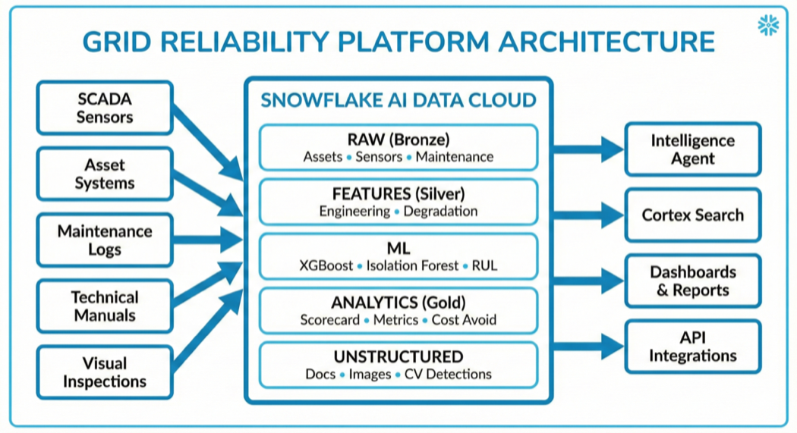
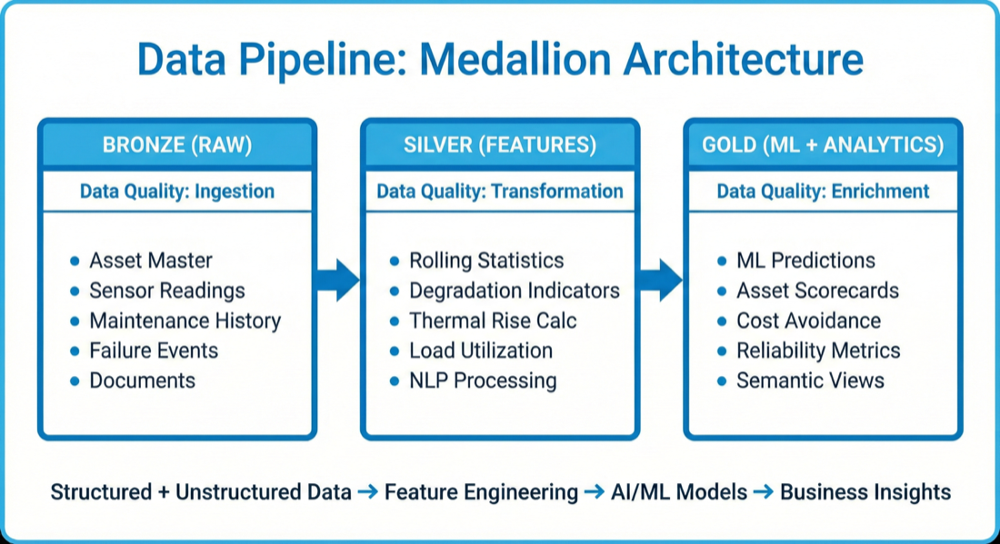
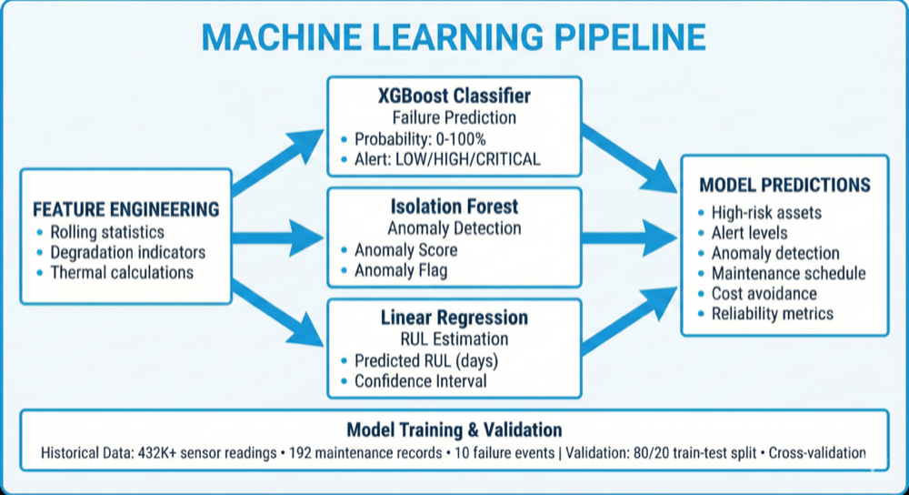
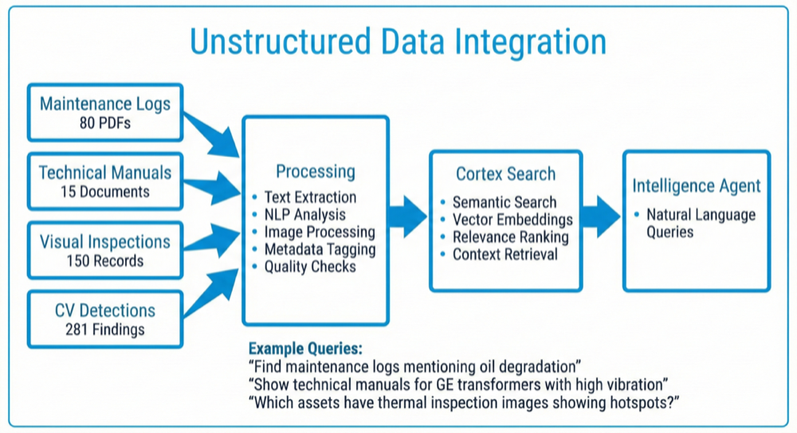

id: ai-powered-predictive-grid-maintenance
language: en
summary: AI-powered predictive maintenance solution for power grid transformers built on Snowflake
categories: snowflake-site:taxonomy/industry/manufacturing, snowflake-site:taxonomy/product/ai, snowflake-site:taxonomy/product/analytics, snowflake-site:taxonomy/snowflake-feature/ingestion/conversational-assistants, snowflake-site:taxonomy/snowflake-feature/model-development, snowflake-site:taxonomy/snowflake-feature/applied-analytics, snowflake-site:taxonomy/snowflake-feature/cortex-analyst, snowflake-site:taxonomy/snowflake-feature/cortex-search, snowflake-site:taxonomy/snowflake-feature/snowflake-intelligence, snowflake-site:taxonomy/snowflake-feature/snowpark, snowflake-site:taxonomy/snowflake-feature/snowflake-ml-functions, snowflake-site:taxonomy/solution-center/certification/certified-solution
environments: web
status: Published
authors: Sri Subramanian, Tripp Smith, Dureti Shemsi
feedback link: https://github.com/Snowflake-Labs/sfguides/issues
tags: Cortex AI, Snowflake Intelligence, Cortex Analyst, Cortex Search, Snowpark ML, Predictive Maintenance, Machine Learning, Energy & Utilities, Streamlit, Unstructured Data, Power Grid, Transformers
fork repo link: https://github.com/Snowflake-Labs/sfguide-ai-powered-predictive-grid-maintenance

# AI-Powered Predictive Grid Maintenance

## Overview

This guide delivers a comprehensive AI-powered predictive maintenance platform for power grid infrastructure built entirely on Snowflake. By integrating machine learning models, natural language AI agents, and real-time analytics across structured and unstructured data, utilities can predict equipment failures, optimize maintenance schedules, and improve reliability metrics (SAIDI/SAIFI).

The platform demonstrates how utilities can modernize asset management by unifying IT and OT data, automating failure prediction, and enabling conversational analytics through Snowflake Intelligence Agents.

## The Business Challenge

**Aging Infrastructure**: Approximately 40% of transformers and circuit breakers exceed 20 years old, with traditional 25-year design life under stress from increased loading and climate extremes.

**Reactive Maintenance Is Costly**: 60-70% of failures occur despite calendar-based maintenance. Emergency replacements cost 3-5x more than planned maintenance, with average transformer failures costing approximately $400K+, 4+ hours of outage, and affecting thousands of customers.

**Data Silos Prevent Intelligence**: OT sensor data trapped in SCADA systems, IT asset data in separate enterprise systems, and maintenance logs in unstructured formats create fragmented visibility across critical assets.

**Regulatory Pressure**: State commissions closely monitor SAIDI/SAIFI metrics with penalties for poor reliability performance, requiring data-driven justification for rate cases and infrastructure investments.

## The Solution: AI-Powered Predictive Maintenance

This platform transforms raw operational data into actionable asset intelligence through Snowflake's unified data cloud.

The platform implements a modern **Medallion Architecture** across Snowflake:

**RAW Layer**: Ingests SCADA sensor data (temperature, load, vibration, DGA), asset master data, maintenance history, failure events, and unstructured documents (PDFs, images).

**FEATURES Layer**: Performs feature engineering including rolling statistics, degradation indicators, thermal rise calculations, and document text extraction.

**ML Layer**: Deploys XGBoost classifiers for failure prediction, Isolation Forest for anomaly detection, and linear regression for remaining useful life estimation.

**ANALYTICS Layer**: Generates asset health scorecards, cost avoidance calculations, reliability metrics, and maintenance optimization insights.

**UNSTRUCTURED Layer**: Processes maintenance log documents, technical manuals, visual inspection records, and computer vision detections for corrosion, cracks, hotspots, and oil leaks.

**Semantic Layer**: Provides natural language interface through Snowflake Intelligence Agents with Cortex Search for unstructured data retrieval.

## Business Value & ROI

**Cost Avoidance Potential**: $15M-$30M annual savings from prevented failures, 30-50% reduction in emergency maintenance costs, 20-40% reduction in total maintenance spend, and 5-7 year extension of asset lifespan through condition-based maintenance.

**Reliability Improvement Potential**: 50-70% reduction in unplanned outages, 15-25% improvement in SAIDI/SAIFI scores, and 60-80% of failures detectable 14-30 days in advance with mature models.

**Operational Efficiency**: 40-60% improvement in maintenance workforce productivity, 50-70% faster response to degradation indicators, and near real-time visibility into thousands of critical assets.

> Industry benchmarks compiled from EPRI, Deloitte, McKinsey, GE Digital, and IEEE studies. Actual results vary by utility size, data quality, and implementation approach.

## Technical Capabilities

**Machine Learning Models**: Failure prediction (XGBoost) outputs probability scores and alert levels. Anomaly detection (Isolation Forest) identifies unusual sensor patterns. Remaining useful life (Linear Regression) estimates days until maintenance required.

**Unstructured Data Integration**: 80 maintenance log documents with NLP-ready text extraction and severity classification. 15 technical manuals from ABB, GE, Siemens, and Westinghouse. 150 visual inspection records from drone, thermal, and LiDAR scans. 281 computer vision detections with GPS coordinates for field navigation.

**Cortex Agents**: Natural language queries across structured and unstructured data via Grid Reliability Intelligence Agent. Three Cortex Search services for documents, maintenance logs, and technical manuals. Semantic views optimized for Cortex Analyst text-to-SQL conversion.

## Key Differentiators

**Unified IT/OT Data Platform**: Breaks down silos between SCADA and enterprise systems with a single source of truth for all asset data.

**Unstructured Data Intelligence**: First utility guide integrating maintenance logs, manuals, visual inspections, and CV detections with Cortex Search enabling natural language queries.

**Rapid Deployment**: Deploy entire platform in under 1 hour with pre-built models, semantic views, and intelligence agents providing immediate value.

**Scalability**: Handles 5,000+ assets with 432,000+ sensor readings, scaling to millions of records without performance degradation.

## Use Cases & Demos

**High-Risk Asset Identification**: Query "Show me transformers with HIGH or CRITICAL alert levels with recent maintenance logs indicating severe issues" to identify 12+ transformers with failure probability >75%, linked maintenance logs, and thermal inspection images—enabling proactive intervention preventing millions in emergency replacements.

**Root Cause Analysis**: Query "What are the most common root causes of circuit breaker failures?" to aggregate insights across 80 maintenance log documents, identifying top causes like contact erosion (32%), coil degradation (24%), and mechanical binding (18%).

**Predictive Maintenance Scheduling**: Query "Show assets with predicted RUL < 90 days, ordered by criticality" to optimize Q4 maintenance schedules grouped by substation for efficient crew dispatch.

**Unstructured Data Search**: Search "GE transformer oil temperature alarm troubleshooting" via Cortex Search to retrieve technical manuals with troubleshooting procedures and maintenance logs with similar issues and reguides.

## Get Started

Ready to build predictive maintenance for your grid assets? This guide includes everything you need to get up and running quickly.

**[GitHub Repository →](https://github.com/Snowflake-Labs/sfguide-ai-powered-predictive-grid-maintenance)**

The repository contains complete setup scripts, SQL deployment files, data generators, semantic model definitions, and step-by-step instructions for deploying the full solution.

## Resources

- [Snowflake CLI Documentation](https://docs.snowflake.com/en/developer-guide/snowflake-cli/index)
- [Cortex Analyst Documentation](https://docs.snowflake.com/en/user-guide/snowflake-cortex/cortex-analyst)
- [Cortex Agents Documentation](https://docs.snowflake.com/en/user-guide/snowflake-cortex/cortex-agents)
- [Cortex Search Documentation](https://docs.snowflake.com/en/user-guide/snowflake-cortex/cortex-search)
- [Snowflake Intelligence Documentation](https://docs.snowflake.com/user-guide/snowflake-cortex/snowflake-intelligence)
- [Streamlit in Snowflake Documentation](https://docs.snowflake.com/en/developer-guide/streamlit/about-streamlit)
- [Snowflake ML Documentation](https://docs.snowflake.com/en/developer-guide/snowflake-ml/overview)
