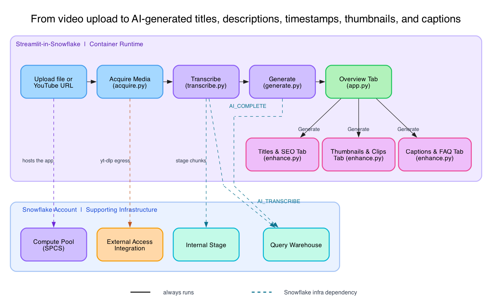
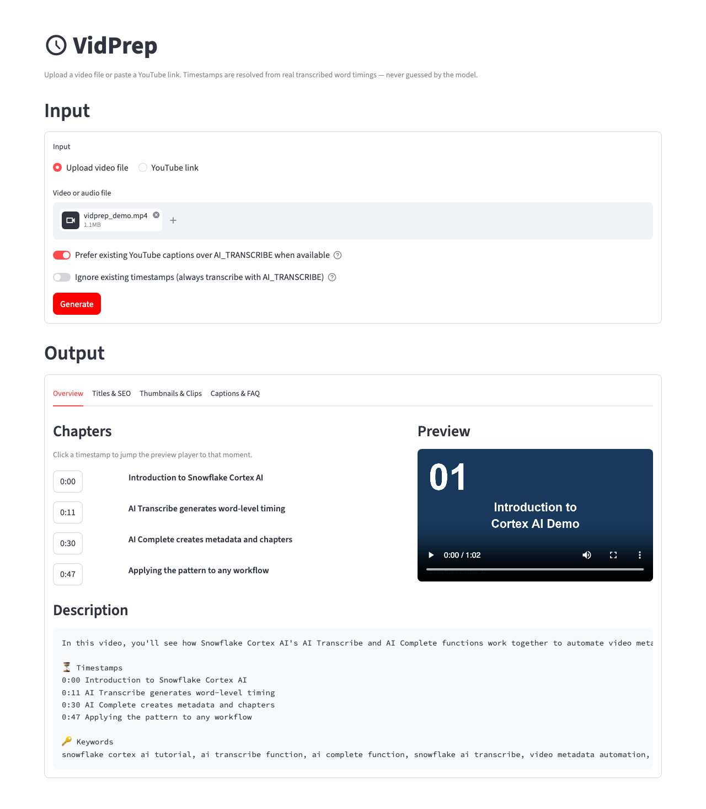
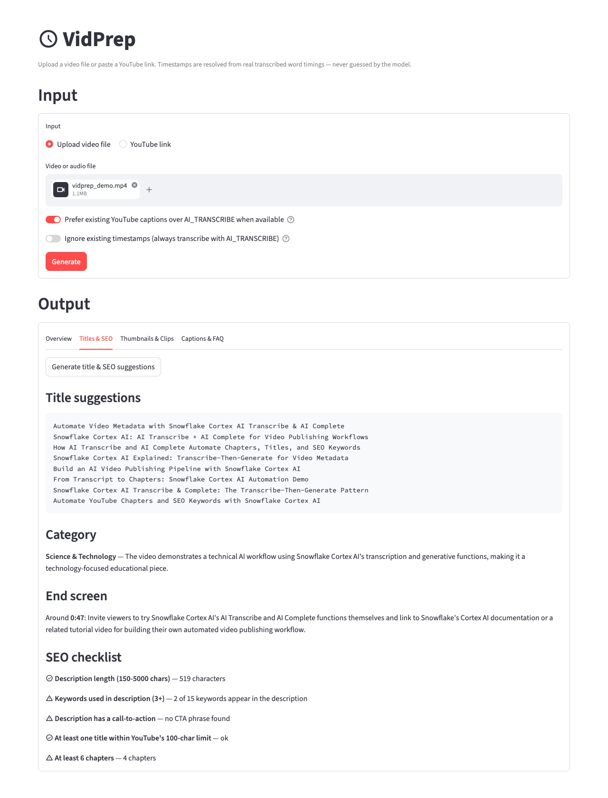
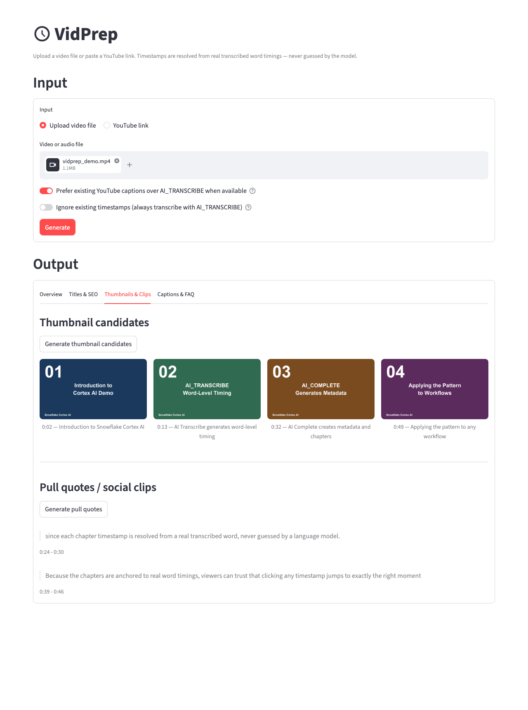
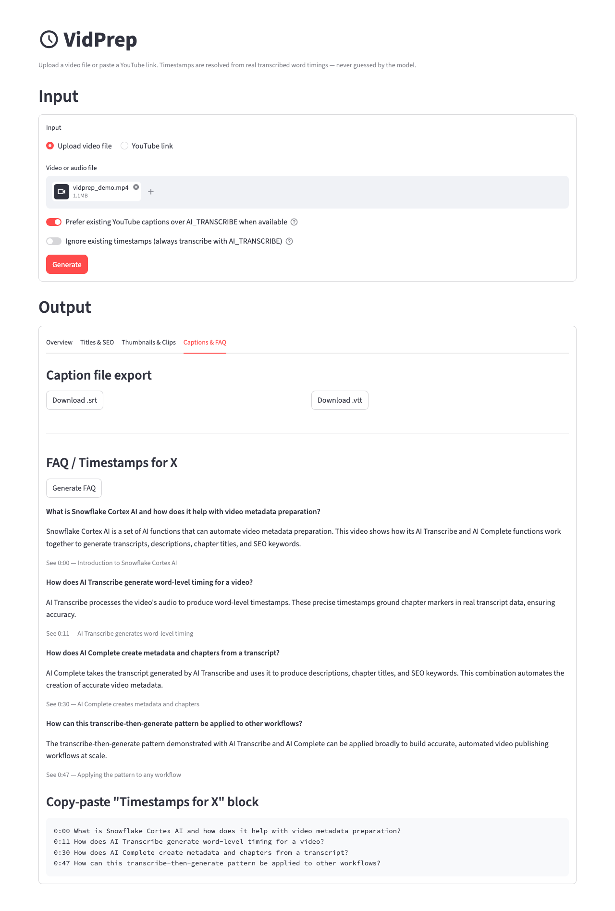
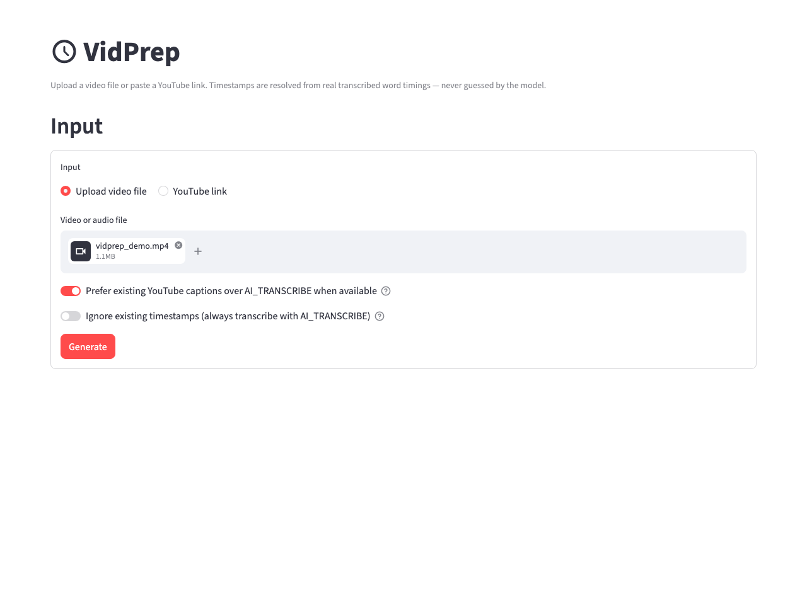

author: Chanin Nantasenamat
id: ai-powered-video-publishing
categories: snowflake-site:taxonomy/solution-center/certification/quickstart,snowflake-site:taxonomy/product/ai,snowflake-site:taxonomy/snowflake-feature/cortex-llm-functions
language: en
summary: Build VidPrep, a Streamlit-in-Snowflake app that uses AI_TRANSCRIBE and AI_COMPLETE to draft video chapters, descriptions, SEO metadata, thumbnails, and captions.
environments: web
status: Published
feedback link: https://github.com/Snowflake-Labs/sfguides/issues
fork repo link: https://github.com/sfc-gh-cnantasenamat/ai-powered-video-publishing


# Build an AI-Powered Video Publishing App on Snowflake
## Overview

Creators publishing a video usually have to write a description, mark chapter timestamps, pick SEO keywords, choose a thumbnail, and write captions. VidPrep prepares drafts of these outputs from an uploaded video or audio file using Snowflake Cortex. Review the transcript and generated copy before publishing; transcription and model output can contain errors. YouTube URL downloads are an optional, best-effort input path.

The core design principle behind VidPrep is that a large language model should never be trusted to emit a timestamp directly, because it can hallucinate one that doesn't correspond to anything said in the video. Instead, the model is only ever asked to point at a position in a real, transcribed word array, and the actual timestamp is looked up in code from that position. This guide walks through that architecture and how to build and deploy the whole app on Snowflake.



Read the solid arrows as processing order, not unconditional execution: cached results can skip work, captions can replace transcription, and extras run only when requested. The warehouse provides the SQL query context; Cortex runs AI inference on its own compute. The diagram's warehouse arrows indicate SQL calls, not the location of model execution.

### What You'll Learn
- How to use `AI_TRANSCRIBE` to produce word-level timestamped transcripts, including chunking media that exceeds its length limit
- How to use `AI_COMPLETE` with a structured JSON response format to extract chapters, descriptions, and SEO metadata
- Why timestamps should be resolved from real transcript data in code, never generated directly by a model
- How to build a multi-tab Streamlit UI with lazy, cached AI generation per tab
- How to deploy a Streamlit app that needs outbound internet access (via `yt-dlp`) using Snowpark Container Services and an External Access Integration

### What You'll Build
VidPrep, a Streamlit-in-Snowflake app, with:
- An **Overview** tab with generated chapters (clickable: they open the matching moment on YouTube for YouTube input, or seek the preview player for uploads), a video preview, and a copy-paste description block
- A **Titles & SEO** tab with title suggestions, a YouTube category pick, an end-screen suggestion, and a free SEO checklist
- A **Thumbnails & Clips** tab with real extracted thumbnail frames and verbatim pull quotes
- A **Captions & FAQ** tab with downloadable `.srt`/`.vtt` caption files and a generated FAQ









These screenshots show a synthetic demo upload and its generated results. The SEO checklist includes warnings, and generated copy should always be reviewed before publishing.

### Prerequisites
- Access to a [Snowflake account](https://signup.snowflake.com/?utm_source=snowflake-devrel&utm_medium=developer-guides&utm_cta=developer-guides)
- A role with privileges to create a warehouse, database, stage, compute pool, network rule, and external access integration (e.g. `ACCOUNTADMIN`, or an equivalent custom role)
- [Snowflake CLI](https://docs.snowflake.com/en/developer-guide/snowflake-cli/index) (`snow`) installed locally
- Python 3.11+ installed locally
- Familiarity with Python and basic SQL

## Setup

### Create the Snowflake objects
Use a dedicated tutorial environment, and record which resources you create. Do not reuse or replace another project's app. Cortex calls and container compute incur usage charges.

Run the following as a role with sufficient privileges. This creates a dedicated warehouse, database/schema, an internal stage (used to hand media files to `AI_TRANSCRIBE`), a compute pool for the Streamlit container runtime, and two External Access Integrations: one so the app can reach YouTube, and one so the container runtime can install the Python dependencies in `pyproject.toml` from PyPI (container runtime apps have no PyPI access by default).

```sql
-- XSMALL is enough here: the AI_TRANSCRIBE/AI_COMPLETE calls run on Cortex's
-- own compute, not this warehouse, so it only needs to handle staging and metadata queries.
CREATE WAREHOUSE IF NOT EXISTS VIDPREP_WH WAREHOUSE_SIZE = XSMALL;

CREATE DATABASE IF NOT EXISTS VIDPREP_DB;
CREATE SCHEMA IF NOT EXISTS VIDPREP_DB.APPS;

CREATE STAGE IF NOT EXISTS VIDPREP_DB.APPS.VIDPREP_STAGE
  ENCRYPTION = (TYPE = 'SNOWFLAKE_SSE');

CREATE COMPUTE POOL IF NOT EXISTS VIDPREP_COMPUTE_POOL
  MIN_NODES = 1
  MAX_NODES = 1
  INSTANCE_FAMILY = CPU_X64_XS;

CREATE NETWORK RULE IF NOT EXISTS VIDPREP_EGRESS_RULE
  MODE = EGRESS
  TYPE = HOST_PORT
  VALUE_LIST = ('youtube.com', '*.youtube.com', '*.googlevideo.com');

CREATE EXTERNAL ACCESS INTEGRATION IF NOT EXISTS VIDPREP_EAI
  ALLOWED_NETWORK_RULES = (VIDPREP_EGRESS_RULE)
  ENABLED = TRUE;

-- Container runtime apps need this to install pyproject.toml's dependencies
-- from PyPI. SNOWFLAKE.EXTERNAL_ACCESS.PYPI_RULE is a Snowflake-managed
-- network rule, so no separate CREATE NETWORK RULE is needed for it.
CREATE EXTERNAL ACCESS INTEGRATION IF NOT EXISTS PYPI_ACCESS
  ALLOWED_NETWORK_RULES = (SNOWFLAKE.EXTERNAL_ACCESS.PYPI_RULE)
  ENABLED = TRUE;
```

### Clone the project
```bash
git clone https://github.com/sfc-gh-cnantasenamat/ai-powered-video-publishing.git
cd ai-powered-video-publishing
```

### Review the dependencies
The app's `pyproject.toml` pulls in everything needed, including `yt-dlp` for media acquisition, `imageio-ffmpeg` for a bundled ffmpeg binary (the container runtime has no system ffmpeg), and `deno`, which `yt-dlp` needs as a JavaScript runtime to solve YouTube's signature challenges:

```toml
[project]
name = "vidprep"
version = "0.1.0"
requires-python = ">=3.11"
dependencies = [
    "snowflake-connector-python>=3.3.0",
    "streamlit[snowflake]>=1.64.0",
    "webvtt-py>=0.5.1",
    "yt-dlp[default]>=2026.8.19",
    "imageio-ffmpeg>=0.5.1",
    "deno>=2.9.0",
]
```

### Connect with Streamlit's managed connection
The app never opens its own Snowflake connection. It uses `st.connection("snowflake")`, which reads local secrets during development and the app's embedded identity once deployed (the same code path either way):

```python
"""Snowflake connection helper. Uses Streamlit's managed connection, which
reads `.streamlit/secrets.toml` locally and embedded identity when hosted in
Snowflake (Streamlit in Snowflake). Same code path both places."""

import streamlit as st


def run_query(sql: str, params=None):
    """Execute a single SQL statement and return all rows."""
    cur = st.connection("snowflake").cursor()
    cur.execute(sql, params)
    return cur.fetchall()
```

For local development, use an existing named Snowflake connection without copying credentials into the project. Start the app with the intended profile explicitly selected:

```bash
SNOWFLAKE_DEFAULT_CONNECTION_NAME=<your_connection_name> python -m streamlit run app.py
```

Confirm that profile targets the intended account and has access to the configured stage. Hosted Streamlit uses its embedded identity. For isolated tests, set `VIDPREP_STAGE_FQN` to a test-only stage and `VIDPREP_CACHE_DIR` to a fresh local directory. Stage names must contain three unquoted identifiers. Never commit connection credentials.

> aside negative
> **Important**: `st.connection("snowflake")` sets `snowflake.connector.paramstyle` to `"qmark"` as a side effect. Every SQL statement in this app uses `?` placeholders, never `%s`; mixing in `%s` produces a confusing syntax error at the Snowflake parser, not a Python error.

## Acquire the Media

`acquire.py` normalizes uploaded files and available YouTube downloads into one `AcquiredMedia` object. Start with media you own or are authorized to process. Uploads use unique temporary filenames so an uploaded filename cannot overwrite another file.

For a YouTube video, you can enter its URL and attach the original video/audio file below it. This fallback processes the attached file without contacting YouTube, while preserving clickable chapter links. URL-only downloads may be refused with HTTP 403, rate limits, or interactive bot verification. The app reports these failures rather than claiming to bypass them.

For YouTube links, `yt-dlp` fetches metadata (title, description, existing chapters, captions) and downloads audio for transcription plus a small local preview video:

```python
def _base_ydl_opts() -> dict:
    """Optional local cookies do not guarantee that YouTube permits access.

    Hosted deployment does not include cookies. Use the original-file fallback
    when YouTube refuses a request rather than attempting to bypass a challenge.
    """
    opts: dict = {}
    if YOUTUBE_COOKIES_FILE and os.path.exists(YOUTUBE_COOKIES_FILE):
        opts["cookiefile"] = YOUTUBE_COOKIES_FILE
    return opts
```

No cookie file is required or deployed. Optional local credentials are read only from an explicitly configured `VIDPREP_YOUTUBE_COOKIES_FILE` path. Do not commit, package, or upload browser session cookies with the app. Use the original-file fallback when URL-only access fails.

A small, low-resolution preview video is also downloaded for the UI player, muxing a video-only stream with an audio-only stream via `ffmpeg`, since most videos have no single pre-combined file below 360p:

```python
preview_opts = {
    **_base_ydl_opts(),
    "quiet": True,
    "no_warnings": True,
    "format": (
        "bestvideo[height<=240][ext=mp4]+bestaudio[ext=m4a]/"
        "bestvideo[height<=240]+bestaudio/"
        "best[height<=240]/worst[ext=mp4]/worst"
    ),
    "merge_output_format": "mp4",
    "ffmpeg_location": imageio_ffmpeg.get_ffmpeg_exe(),
    "outtmpl": preview_template,
}
```

## Transcribe with AI_TRANSCRIBE

`transcribe.py` builds a single transcript timeline for the media. Downstream timestamps are resolved against that timeline, whose accuracy depends on the transcription or supplied captions.

`AI_TRANSCRIBE` has a practical limit on media length when requesting word-level timestamps, so longer media is split into chunks with `ffmpeg`, transcribed independently, and re-based onto one continuous timeline using each chunk's *measured* duration (not the requested split point, which can drift):

```python
def _transcribe_chunk_with_ai_transcribe(chunk_path: str) -> dict:
    """Stage the chunk and call AI_TRANSCRIBE with word-level timestamps."""
    staged_name = put_file(chunk_path, STAGE_FQN)
    sql = (
        f"SELECT AI_TRANSCRIBE(TO_FILE('@{STAGE_FQN}', ?), "
        "OBJECT_CONSTRUCT('timestamp_granularity', 'word'))"
    )
    try:
        rows = run_query(sql, params=(staged_name,))
        if not rows or rows[0][0] is None:
            raise TranscriptionError("AI_TRANSCRIBE returned no result.")
        return json.loads(rows[0][0])
    finally:
        try:
            run_query(f"REMOVE '@{STAGE_FQN}/{staged_name}'")
        except Exception:
            logging.getLogger(__name__).warning("Staged media cleanup failed; check the configured stage.")
```

Cleanup is attempted even if transcription or response parsing fails. A cleanup warning means you should inspect the stage and remove only the files from your own run. Caption-preferred and forced-AI transcription use separate cache keys.

When available captions are selected, VidPrep uses them instead of calling `AI_TRANSCRIBE`. This avoids a transcription call but uses coarser cue-level timing rather than measured word-level timing.

## Generate with AI_COMPLETE

This is the section that enforces VidPrep's core correctness rule. `generate.py` never asks the model for a timestamp. It only asks for a `word_index` into the transcript array it was shown, tagged inline as `[INDEX]word`:

```python
_CHAPTER_SCAN_SCHEMA = {
    "type": "object",
    "properties": {
        "chapter_candidates": {
            "type": "array",
            "items": {
                "type": "object",
                "properties": {
                    "word_index": {"type": "number"},
                    "title": {"type": "string"},
                },
                "required": ["word_index", "title"],
            },
        },
        "chunk_summary": {"type": "string"},
    },
    "required": ["chapter_candidates", "chunk_summary"],
}
```

The `AI_COMPLETE` call requests structured JSON with this schema. A request can occasionally return NULL, so the helper retries a bounded number of times before reporting an error:

```python
def _ai_complete_json(prompt: str, schema: dict) -> dict:
    sql = "SELECT AI_COMPLETE(?, ?, PARSE_JSON(?), PARSE_JSON(?))"
    model_params = json.dumps({"temperature": 0.2, "max_tokens": COMPLETE_MAX_TOKENS})
    response_format = json.dumps({"type": "json", "schema": schema})
    params = (COMPLETE_MODEL, prompt, model_params, response_format)
    for attempt in range(1, AI_COMPLETE_ATTEMPTS + 1):
        rows = run_query(sql, params=params)
        if rows and rows[0][0] is not None:
            raw = rows[0][0]
            # AI_COMPLETE with response_format returns the structured object directly.
            return json.loads(raw) if isinstance(raw, str) else raw
        if attempt < AI_COMPLETE_ATTEMPTS:
            time.sleep(AI_COMPLETE_RETRY_DELAY_SECONDS * attempt)
    raise GenerationError(
        f"AI_COMPLETE returned no result after {AI_COMPLETE_ATTEMPTS} attempts. "
        "This is usually transient; please try again."
    )
```

The generated result and each extra (titles, quotes, FAQ) are cached under a key that includes a hash of the model and the inputs the prompt uses, so a changed transcript or regenerated result never reuses stale suggestions.

This app uses `claude-sonnet-5` as the `AI_COMPLETE` model (set in `config.py`'s `COMPLETE_MODEL`), configurable to any model your account has access to.

The transcript is scanned in overlapping word-count windows rather than one full-transcript call. Returned indices are converted to integers and clamped to the transcript's bounds. This keeps timestamps within the transcript; it does not establish that the selected chapter boundary is suitable:

```python
def _resolve_and_clean_chapters(words, raw_candidates: list[dict]) -> list[Chapter]:
    n = len(words)
    resolved: list[tuple[int, str]] = []
    for c in raw_candidates:
        try:
            idx = int(c["word_index"])
        except (KeyError, TypeError, ValueError):
            continue
        idx = max(0, min(idx, n - 1))
        title = (c.get("title") or "").strip()
        if title:
            resolved.append((idx, title))
    resolved.sort(key=lambda x: x[0])
    # Always start at the true beginning.
    if not resolved or resolved[0][0] != 0:
        resolved.insert(0, (0, "Introduction"))
    ...
```

A second `AI_COMPLETE` call, given the combined per-chunk summaries, writes the description and suggests SEO keywords in the same structured response:

```python
_DESCRIPTION_SCHEMA = {
    "type": "object",
    "properties": {
        "description": {"type": "string"},
        "keywords": {"type": "array", "items": {"type": "string"}},
    },
    "required": ["description", "keywords"],
}
```

## Add Publishing Extras

`enhance.py` layers eight more publishing-prep features on top of the core pipeline, following the same "never invent, always resolve" rule:

- **Titles, category, and an end-screen suggestion** come from one bundled `AI_COMPLETE` call. The category is constrained to YouTube's fixed list of categories and validated against it in code.
- **A SEO checklist** is pure Python (no model call at all), checking description length, keyword usage, call-to-action presence, title length, and chapter count.
- **Thumbnail candidates** are real JPEG frames extracted with `ffmpeg` near each chapter start, using a two-second offset where the media duration permits.
- **Pull quotes** reuse the same chunked-scan pattern as chapters: the model picks a `start_word_index`/`end_word_index` span, and the quote text is built verbatim from the transcript:

```python
def generate_quotes(media: AcquiredMedia, transcript: Transcript, max_quotes: int = 6) -> list[Quote]:
    ...
    quotes = [
        Quote(
            start_seconds=words[s].start,
            end_seconds=words[e].end,
            text=" ".join(w.text for w in words[s : e + 1]),
        )
        for s, e in all_spans
    ]
    return quotes
```

- **Caption files** (`.srt`/`.vtt`) are built deterministically from the word-level transcript by grouping words into cues, with no model call needed.
- **An FAQ** phrases each chapter as a question, tied back to that chapter's real `start_seconds` by index, never a model-invented timestamp.

## Build the UI

`app.py` wraps the Input controls in a bordered container, then, once a result exists in `st.session_state`, renders the Output section as four tabs. The tab set has a `key` and `on_change="rerun"` (available in Streamlit 1.64 and later), so the selected tab survives the rerun that every button click triggers. Without it, clicking an extras button would send the user back to Overview:



```python
tab_overview, tab_titles_seo, tab_thumbs, tab_captions = st.tabs(
    ["Overview", "Titles & SEO", "Thumbnails & Clips", "Captions & FAQ"],
    key="output_tab",
    on_change="rerun",
)
```

The three "extras" tabs are lazy: each has its own **Generate** button, and results are kept in `st.session_state["extras"]` so switching tabs doesn't lose them or re-trigger a model call:

```python
with tab_titles_seo:
    if st.button("Generate title & SEO suggestions", key="gen_titles_seo"):
        try:
            with st.spinner("Generating title, category, and end-screen suggestions..."):
                extras["titles_seo"] = enhance.generate_titles_seo(media, result, transcript.duration)
        except GenerationError as e:
            st.error(f"Generation failed: {e}")

    titles_seo = extras.get("titles_seo")
    if titles_seo:
        st.subheader("Title suggestions")
        st.code("\n".join(titles_seo.titles), language=None)
```

The app clears previous media, transcript, results, extras, and the selected tab when Generate is clicked, including when input is missing or the next request fails. A failed request therefore cannot leave another video's output displayed as its result, and each new result opens on Overview.

If a model call still returns no result after its retries, the tab shows a "Generation failed" message. Click that tab's Generate button again; earlier results stay in place.

## Deploy to Snowflake

VidPrep runs on the [Streamlit-in-Snowflake container runtime](https://docs.snowflake.com/en/developer-guide/streamlit/app-development/runtime-environments), using Python dependencies and the `ffmpeg` executable bundled by `imageio-ffmpeg`. The optional YouTube downloader requires outbound access. Upload processing does not require a YouTube session or YouTube download.

Define the deployment in `snowflake.yml`:

```yaml
definition_version: 2
entities:
  vidprep:
    type: streamlit
    identifier:
      name: VIDPREP
      database: VIDPREP_DB
      schema: APPS
    query_warehouse: VIDPREP_WH
    runtime_name: SYSTEM$ST_CONTAINER_RUNTIME_PY3_11
    compute_pool: VIDPREP_COMPUTE_POOL
    external_access_integrations:
      - PYPI_ACCESS
      - VIDPREP_EAI
    main_file: app.py
    artifacts:
      - app.py
      - acquire.py
      - generate.py
      - transcribe.py
      - enhance.py
      - cache.py
      - config.py
      - snowflake_conn.py
      - pyproject.toml
```

Check that `snowflake.yml` references the resources you created in Setup. If you chose different names, update the identifier, warehouse, compute pool, integrations, and `config.py` stage default together. Confirm each listed artifact exists and no credentials or cookies are included. Use a distinct app name for a test deployment; `--replace` must not overwrite an app you need to preserve.

```bash
snow streamlit deploy vidprep --connection <your_connection_name> --replace
```

The first deploy resolves and locks Python dependencies inside the container, which can take a few minutes. If you later change `pyproject.toml`, redeploy with `--prune` to clear the stale lockfile left on the stage. The keyed output tabs require Streamlit 1.64 or later; if the deployed app fails on `st.tabs`, confirm the container resolved a version that satisfies the `pyproject.toml` floor.

## Verify the Workflow

1. Upload a short original video and select Generate. Confirm a description, ordered chapter timestamps, and a working local preview appear. Click a later chapter timestamp and confirm the preview player moves to that time.
2. Generate titles/SEO suggestions, thumbnails, pull quotes, and an FAQ from their respective tabs. Each tab should stay selected after its Generate button runs. Download both caption formats and inspect their text and timestamps.
3. Choose YouTube link, enter the URL corresponding to your original media, attach that file, and Generate. Confirm the file is processed and chapter links retain the video ID without requiring a YouTube download.
4. For a fresh live check, use a new cache directory and test stage. A cached result or a mocked unit test is not proof of a new Snowflake call.
5. Review transcription accuracy, generated claims, and chapter suitability manually. Resolved timestamps refer to transcript entries; they do not guarantee correct transcription or ideal chapter boundaries.

## Clean Up

Save any generated outputs you need before removing tutorial resources. Stop only local app processes you started. Remove your run's temporary uploads, chunks, thumbnails, and caches after they are no longer needed by the preview.

Inspect the configured stage for leftover media, including files from failed requests, and remove only your own run's files. Ask the resource owner to remove the tutorial app and schema after confirming they are used exclusively for this exercise. Remove a tutorial-only warehouse or compute pool only if you created it and no other workload uses it. Keep shared databases, integrations, pools, warehouses, and preexisting apps unchanged. Do not use a broad cleanup command against a shared environment.

## Conclusion And Resources

VidPrep turns an uploaded video into draft publishing materials: chapters, a description, titles and keywords, thumbnail candidates, pull quotes, captions, and an FAQ. Chapter timestamps and quote spans are resolved from transcript data in code. Review those outputs before publishing, and use the original-file fallback when YouTube refuses a download.

### What You Learned
- How to get word-level timestamped transcripts from `AI_TRANSCRIBE`, including chunking long media
- How to request structured JSON from `AI_COMPLETE` and resolve returned indices against transcript data
- Why resolving timestamps from real data in code, rather than trusting a model to emit them, eliminates a whole class of hallucination bugs
- How to deploy a Streamlit app that needs outbound network access using the container runtime, a compute pool, and an External Access Integration

### Related Resources

Documentation:
- [AI_TRANSCRIBE](https://docs.snowflake.com/en/sql-reference/functions/ai_transcribe)
- [AI_COMPLETE](https://docs.snowflake.com/en/sql-reference/functions/ai_complete-single-string)
- [Streamlit in Snowflake](https://docs.snowflake.com/en/developer-guide/streamlit/about-streamlit)
- [External network access in Streamlit in Snowflake](https://docs.snowflake.com/en/developer-guide/streamlit/features/external-access)
- [Runtime environments for Streamlit apps](https://docs.snowflake.com/en/developer-guide/streamlit/app-development/runtime-environments)

Additional Reading:
- [ai-powered-video-publishing on GitHub](https://github.com/sfc-gh-cnantasenamat/ai-powered-video-publishing)
- [yt-dlp documentation](https://github.com/yt-dlp/yt-dlp)
