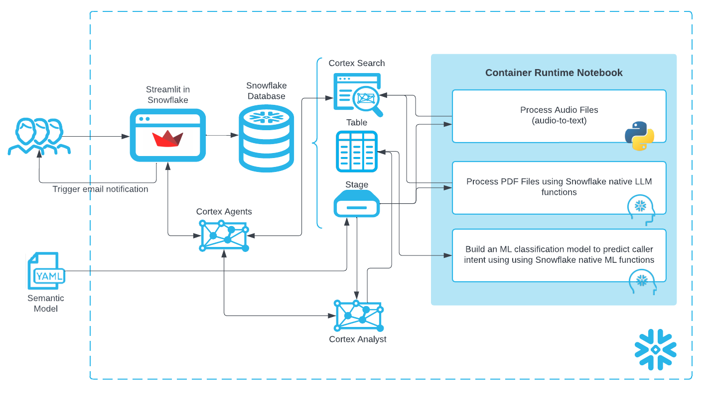
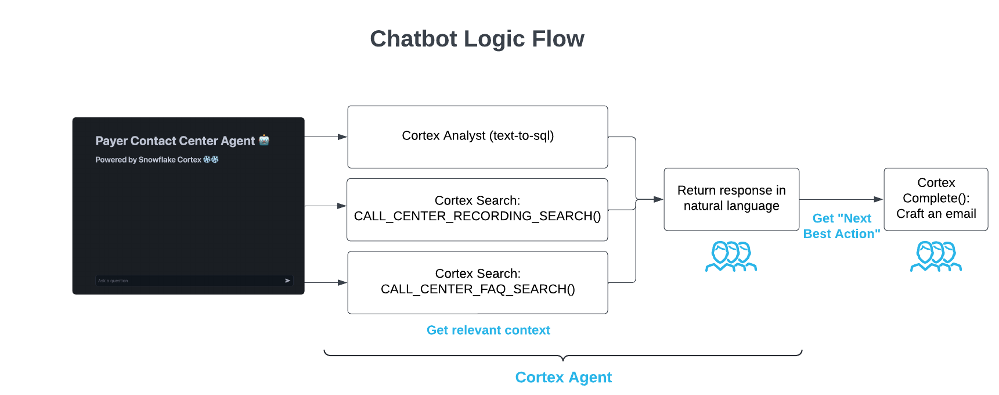
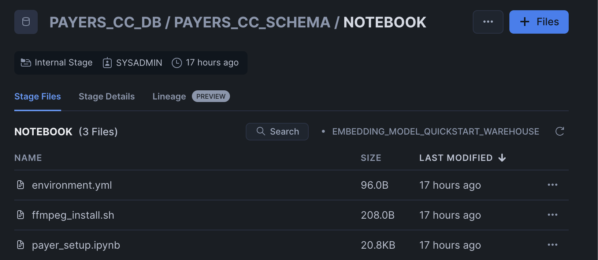
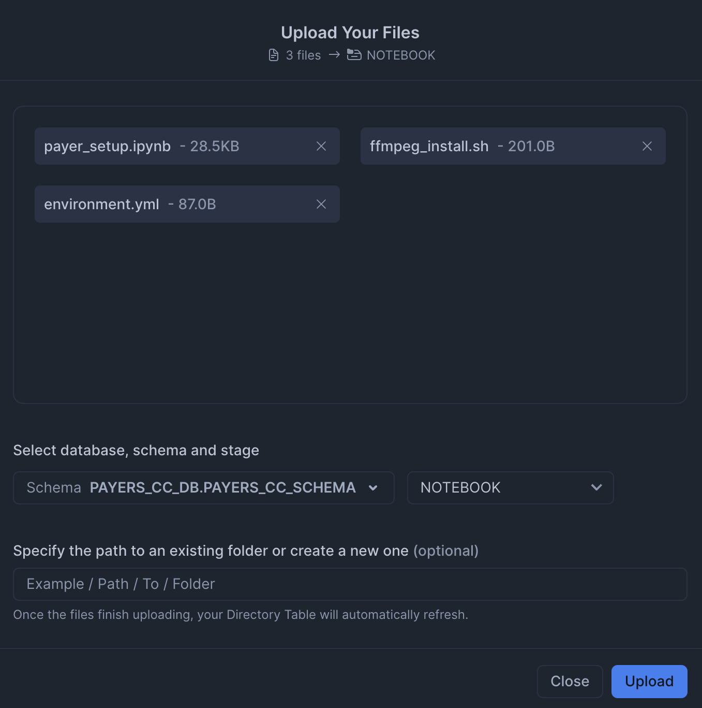
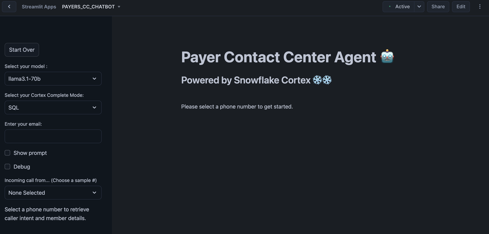

author: Sikha Das
id: ai_agent_health_payers_cc
summary: TODO
categories: Getting-Started, data-science-&-ml
environments: web
status: Published 
feedback link: https://github.com/Snowflake-Labs/sfguides/issues
tags: Getting Started, Snowpark Python, Streamlit, Data-Science-&-Ai

# Next Best Action Prediction using AI Agents for Healthcare Payers Contact Center
<!-- ------------------------ -->
## Overview

**Duration: 5 minutes**

TODO

### What You Will Learn

- How to use [Snowflake Notebooks](https://docs.snowflake.com/en/user-guide/ui-snowsight/notebooks) and [Snowpark Python](https://docs.snowflake.com/en/developer-guide/snowpark/python/index) for unstructured data processing
- How to leverage [Cortex Search](https://docs.snowflake.com/en/user-guide/snowflake-cortex/cortex-search/cortex-search-overview) for a hybrid (vector and keyword) search engine on text data
- How to use [Cortex LLM functions](https://docs.snowflake.com/en/user-guide/snowflake-cortex/llm-functions) (Cortex Complete) for access to industry-leading large language models (LLMs)
- How to build a chatbot and analytics application using [Streamlit](https://docs.streamlit.io/) in Snowflake


### Prerequisites
- A [GitHub](https://github.com/) Account to access the [GIT REPO](https://github.com/Snowflake-Labs/sfguide-ai-agent-hcls-payers-cc-cortex-notebooks-mlclassification/tree/main)
- A Snowflake account login with a role that has the ability to create database, schema, tables, stages, user-defined functions, and stored procedures. If not, you will need to register for [a free trial](https://signup.snowflake.com/?_fsi=OuImfiWC&_fsi=OuImfiWC) or use a different role.

### What You Will Build

- 

**Architecture Diagram:**



A simplified "agentic" workflow ties these features together to provide a single app for end users to use natural language to ask questions and get answers in natural language regardless of whether the underlying data is structured or unstructured.


## Data and Snowflake Setup
**Duration: 15 minutes**

> **You can access the full code in [this GIT REPO](https://github.com/Snowflake-Labs/sfguide-ai-agent-hcls-payers-cc-cortex-notebooks-mlclassification/tree/main).**

To get started using Snowflake Notebooks, first login to Snowsight. In the top-left corner, click "+ Create" to create a new Worksheet, and choose "SQL Worksheet".

Paste and run the following [setup.sql](https://github.com/Snowflake-Labs/sfguide-ai-agent-hcls-payers-cc-cortex-notebooks-mlclassification/blob/main/scripts/setup.sql) in the SQL worksheet to create Snowflake objects (warehouse, database, schema).

```sql
USE ROLE SYSADMIN;

CREATE OR REPLACE WAREHOUSE PAYERS_CC_WH; --by default, this creates an XS Standard Warehouse
CREATE OR REPLACE DATABASE PAYERS_CC_DB;
CREATE OR REPLACE SCHEMA PAYERS_CC_SCHEMA;

USE WAREHOUSE PAYERS_CC_WH;
USE DATABASE PAYERS_CC_DB;
USE SCHEMA PAYERS_CC_SCHEMA;

CREATE OR REPLACE STAGE RAW_DATA DIRECTORY=(ENABLE=true); --to store data assets
CREATE OR REPLACE STAGE NOTEBOOK DIRECTORY=(ENABLE=true); --to store notebook assets
CREATE OR REPLACE STAGE CHATBOT_APP DIRECTORY=(ENABLE=true); --to store streamlit assets
```

**Upload required files** to the correct stages within the `PAYER_CC_SCHEMA`




Click '+ Files' in the top right of the stage. Upload all files that you downloaded from GitHub into the stage. The contents should match the app directory. **Make sure your the files in your stages match the following**:

- **Data Files:** Upload all relevant datasets to the `RAW_DATA` stage from [data](https://github.com/Snowflake-Labs/sfguide-ai-agent-hcls-payers-cc-cortex-notebooks-mlclassification/tree/main/notebooks/data)


- **Notebook Files:** Upload notebook files (including environment.yml) to the `NOTEBOOK` stage from [notebook](https://github.com/Snowflake-Labs/sfguide-ai-agent-hcls-payers-cc-cortex-notebooks-mlclassification/tree/main/notebooks).

- **Streamlit Files:** Upload all Streamlit and chatbot-related files to the `CHATBOT_APP` stage from [streamlit](). Remember to upload [the streamlit-specific environment.yml](https://github.com/Snowflake-Labs/sfguide-building-ai-assistant-using-snowflake-co[…]snowflake-notebooks/blob/main/scripts/streamlit/environment.yml) file as well.


Paste and run the following [setup.sql](https://github.com/Snowflake-Labs/sfguide-ai-agent-hcls-payers-cc-cortex-notebooks-mlclassification/blob/main/scripts/setup.sql) in the SQL worksheet to load the data into tables and create a notebook and streamlit app from the staged files.

```sql
CREATE OR REPLACE FILE FORMAT PAYERS_CC_DB.PAYERS_CC_SCHEMA.CSVFORMAT 
    SKIP_HEADER = 1
    TYPE = 'CSV'
    FIELD_OPTIONALLY_ENCLOSED_BY = '"';

TRUNCATE TABLE IF EXISTS CALL_CENTER_MEMBER_DENORMALIZED;

CREATE OR REPLACE TABLE CALL_CENTER_MEMBER_DENORMALIZED (
    MEMBER_ID NUMBER(38,0),
    NAME VARCHAR(16777216),
    DOB DATE,
    GENDER VARCHAR(16777216),
    ADDRESS VARCHAR(16777216),
    MEMBER_PHONE VARCHAR(16777216),
    PLAN_ID VARCHAR(16777216),
    PLAN_NAME VARCHAR(16777216),
    CVG_START_DATE DATE,
    CVG_END_DATE DATE,
    PCP VARCHAR(16777216),
    PCP_PHONE VARCHAR(16777216),
    PLAN_TYPE VARCHAR(16777216),
    PREMIUM NUMBER(38,0),
    SMOKER_IND BOOLEAN,
    LIFESTYLE_INFO VARCHAR(16777216),
    CHRONIC_CONDITION VARCHAR(16777216),
    GRIEVANCE_ID VARCHAR(16777216),
    GRIEVANCE_DATE DATE,
    GRIEVANCE_TYPE VARCHAR(16777216),
    GRIEVANCE_STATUS VARCHAR(16777216),
    GRIEVANCE_RESOLUTION_DATE DATE,
    CLAIM_ID VARCHAR(16777216),
    CLAIM_SERVICE_FROM_DATE DATE,
    CLAIM_PROVIDER VARCHAR(16777216),
    CLAIM_SERVICE VARCHAR(16777216),
    CLAIM_BILL_AMT NUMBER(38,0),
    CLAIM_ALLOW_AMT NUMBER(38,0),
    CLAIM_COPAY_AMT NUMBER(38,0),
    CLAIM_COINSURANCE_AMT NUMBER(38,0),
    CLAIM_DEDUCTIBLE_AMT NUMBER(38,0),
    CLAIM_PAID_AMT NUMBER(38,0),
    CLAIM_STATUS VARCHAR(16777216),
    CLAIM_PAID_DATE DATE,
    CLAIM_SERVICE_TO_DATE DATE,
    CLAIM_SUBMISSION_DATE DATE
);

COPY INTO CALL_CENTER_MEMBER_DENORMALIZED
FROM @RAW_DATA/DATA_PRODUCT/CALL_CENTER_MEMBER_DENORMALIZED.csv
FILE_FORMAT = PAYERS_CC_DB.PAYERS_CC_SCHEMA.CSVFORMAT
ON_ERROR=CONTINUE
FORCE = TRUE;

-- load caller intent training data
TRUNCATE TABLE IF EXISTS CALLER_INTENT_TRAIN_DATASET;

CREATE OR REPLACE TABLE CALLER_INTENT_TRAIN_DATASET (
    MEMBER_ID VARCHAR(16777216),
    RECENT_ENROLLMENT_EVENT_IND BOOLEAN,
    PCP_CHANGE_IND BOOLEAN,
    ACTIVE_CM_PROGRAM_IND BOOLEAN,
    CHRONIC_CONDITION_IND BOOLEAN,
    ACTIVE_GRIEVANCE_IND BOOLEAN,
    ACTIVE_CLAIM_IND BOOLEAN,
    POTENTIAL_CALLER_INTENT_CATEGORY VARCHAR(16777216)
);

COPY INTO CALLER_INTENT_TRAIN_DATASET
FROM @RAW_DATA/CALLER_INTENT/CALLER_INTENT_TRAIN_DATASET.csv
FILE_FORMAT = PAYERS_CC_DB.PAYERS_CC_SCHEMA.CSVFORMAT
ON_ERROR=CONTINUE
FORCE = TRUE;

-- load caller intent prediction data
TRUNCATE TABLE IF EXISTS CALLER_INTENT_PREDICT_DATASET;

CREATE OR REPLACE TABLE CALLER_INTENT_PREDICT_DATASET (
    MEMBER_ID VARCHAR(16777216),
    RECENT_ENROLLMENT_EVENT_IND BOOLEAN,
    PCP_CHANGE_IND BOOLEAN,
    ACTIVE_CM_PROGRAM_IND BOOLEAN,
    CHRONIC_CONDITION_IND BOOLEAN,
    ACTIVE_GRIEVANCE_IND BOOLEAN,
    ACTIVE_CLAIM_IND BOOLEAN
);

COPY INTO CALLER_INTENT_PREDICT_DATASET
FROM @RAW_DATA/CALLER_INTENT/CALLER_INTENT_PREDICT_DATASET.csv
FILE_FORMAT = PAYERS_CC_DB.PAYERS_CC_SCHEMA.CSVFORMAT
ON_ERROR=CONTINUE
FORCE = TRUE;

-- make sure staged files can be seen by directory
ALTER STAGE RAW_DATA REFRESH;

-- create compute pool
CREATE COMPUTE POOL IF NOT EXISTS PAYERS_GPU_POOL
        MIN_NODES = 1
        MAX_NODES = 5
        INSTANCE_FAMILY = GPU_NV_S;

-- create network rules and external access integrations
CREATE OR REPLACE NETWORK RULE PAYERS_CC_DB.PAYERS_CC_SCHEMA.allow_all_rule
          TYPE = HOST_PORT
          MODE = EGRESS
          VALUE_LIST = ('0.0.0.0:443','0.0.0.0:80');

CREATE OR REPLACE EXTERNAL ACCESS INTEGRATION payers_allow_all_integration
        ALLOWED_NETWORK_RULES = (PAYERS_CC_DB.PAYERS_CC_SCHEMA.allow_all_rule)
        ENABLED = TRUE;

CREATE OR REPLACE NETWORK RULE PAYERS_CC_DB.PAYERS_CC_SCHEMA.pipy_network_rule
          TYPE = HOST_PORT
          MODE = EGRESS
          VALUE_LIST = ('pypi.org', 'pypi.python.org', 'pythonhosted.org',  'files.pythonhosted.org');

CREATE OR REPLACE EXTERNAL ACCESS INTEGRATION payers_pipy_access_integration
        ALLOWED_NETWORK_RULES = (PAYERS_CC_DB.PAYERS_CC_SCHEMA.pipy_network_rule)
        ENABLED = TRUE;

-- create main setup notebook
CREATE OR REPLACE NOTEBOOK PAYERS_CC_MAIN_SETUP
FROM '@PAYERS_CC_DB.PAYERS_CC_SCHEMA.NOTEBOOK'
MAIN_FILE = 'payer_setup.ipynb'
QUERY_WAREHOUSE = 'PAYERS_CC_WH'
COMPUTE_POOL='PAYERS_GPU_POOL'
RUNTIME_NAME='SYSTEM$GPU_RUNTIME';

ALTER NOTEBOOK PAYERS_CC_MAIN_SETUP ADD LIVE VERSION FROM LAST;
ALTER NOTEBOOK PAYERS_CC_MAIN_SETUP set external_access_integrations = (
"PAYERS_PIPY_ACCESS_INTEGRATION", 
"PAYERS_ALLOW_ALL_INTEGRATION");

-- create caller intent prediction notebook
CREATE OR REPLACE NOTEBOOK PAYERS_CALLER_INTENT_PREDICTION
FROM '@PAYERS_CC_DB.PAYERS_CC_SCHEMA.NOTEBOOK'
MAIN_FILE = 'caller_intent_prep.ipynb'
QUERY_WAREHOUSE = 'PAYERS_CC_WH';

ALTER NOTEBOOK PAYERS_CALLER_INTENT_PREDICTION ADD LIVE VERSION FROM LAST;

-- create streamlit app
CREATE OR REPLACE STREAMLIT PAYERS_CC_CHATBOT
ROOT_LOCATION = '@PAYERS_CC_DB.PAYERS_CC_SCHEMA.CHATBOT_APP'
MAIN_FILE = 'payer_assistant.py'
QUERY_WAREHOUSE = 'PAYERS_CC_WH'
COMMENT = '{"origin":"sf_sit-is", "name":"payer_call_center_assistant_v2", "version":{"major":1, "minor":0}, "attributes":{"is_quickstart":1, "source":"streamlit"}}';

-- create email integration for streamlit app
CREATE OR REPLACE NOTIFICATION INTEGRATION payers_cc_email_int
TYPE=EMAIL
ENABLED=TRUE;
```

## Access Main Setup Notebook
**Duration: 20 minutes**

The notebook has already been created in your Snowflake account! All packages and Python setup has already been completed.

To access it, navigate to Snowsight, select the `SYSADMIN` role, and click the Project, click the Notebooks tab. Open `PAYERS_CC_MAIN_SETUP` and run each of the cells.


Within this notebook, you'll prepare all the unstructured data needed before you can run the Streamlit App. Once this data is processed, the chatbot will have a rich knowledge base to start from that's all stored within the Cortex Search service, a fully managed indexing and retrieval service. Cortex Search will then be used for RAG.

## Access Caller Intent Prediction Notebook
**Duration: 10 minutes**

The notebook has already been created in your Snowflake account! All packages and Python setup has already been completed.

To access it, navigate to Snowsight, select the `SYSADMIN` role, and click the Project, click the Notebooks tab. Open `PAYERS_CALLER_INTENT_PREDICTION`and run each of the cells.


Within this notebook, you'll predict the intent of a caller using historical data. This will allow Contact Center Agents to be better prepared when faced with an incoming call.

## Run Streamlit Application
**Duration: 20 minutes**

The Streamlit in Snowflake Application has been deployed as part of the setup process. To access it, navigate to Snowsight, select the `SYSADMIN` role, and under Projects, click the Streamlit tab. Open `PAYERS_CC_CHATBOT` and explore.

This app simulates a few different scenarios where Contact Center Agents have to assist with incoming calls. You will find sample questions and other configs in the sidebar.



## Conclusion And Resources

**Duration: 1 minute**

In this guide, you learned how to **TODO**

### What You Learned

- How to use Snowflake Notebooks and Snowpark Python for unstructured data processing
- How to leverage Cortex Search for a hybrid (vector and keyword) search engine on text data
- How to use Cortex LLM functions (Cortex Complete) for access to industry-leading large language models (LLMs)
- How to prototype a UI using Streamlit

### Related Resources
- [Snowflake Cortex Documentation](https://docs.snowflake.com/en/user-guide/snowflake-cortex.html)
- [Streamlit Documentation](https://docs.streamlit.io/)
- [Tasty Bytes: Enhancing Customer Experience](https://quickstarts.snowflake.com/guide/tasty_bytes_customer_experience_app/index.html#0)
- [Building AI Assistant using Snowflake Cortex in Snowflake Notebooks](https://quickstarts.snowflake.com/guide/ai_assistant_for_sales_calls/index.html#0)
