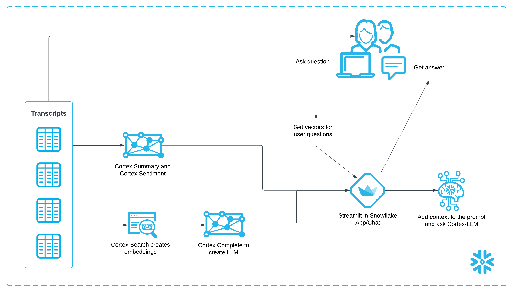
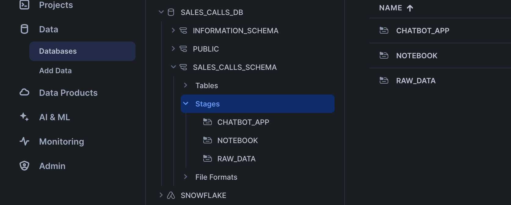
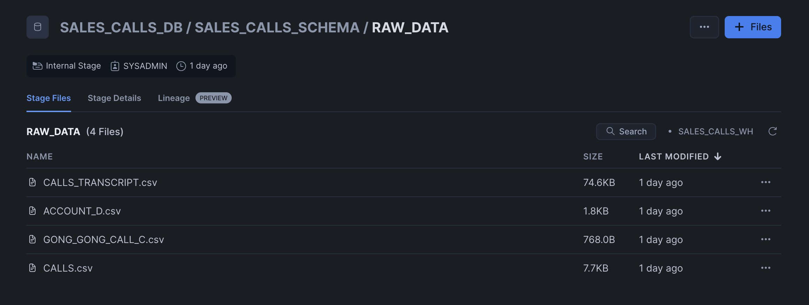
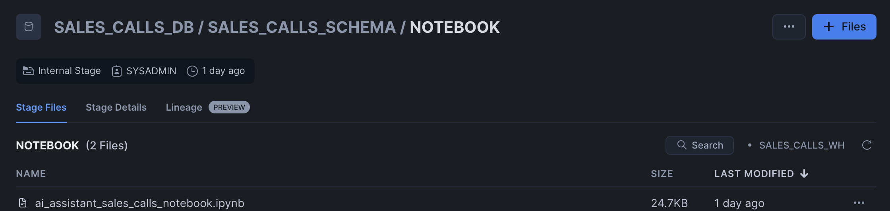
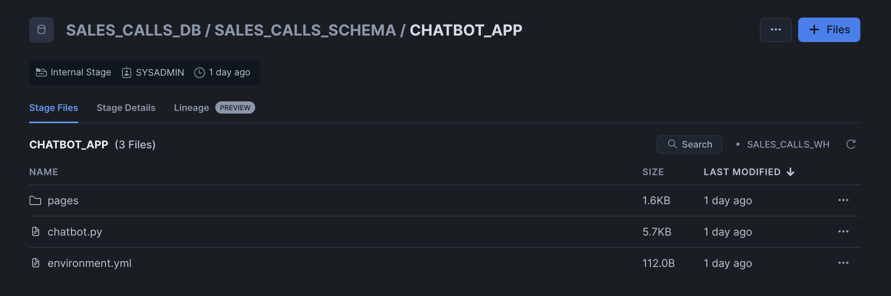
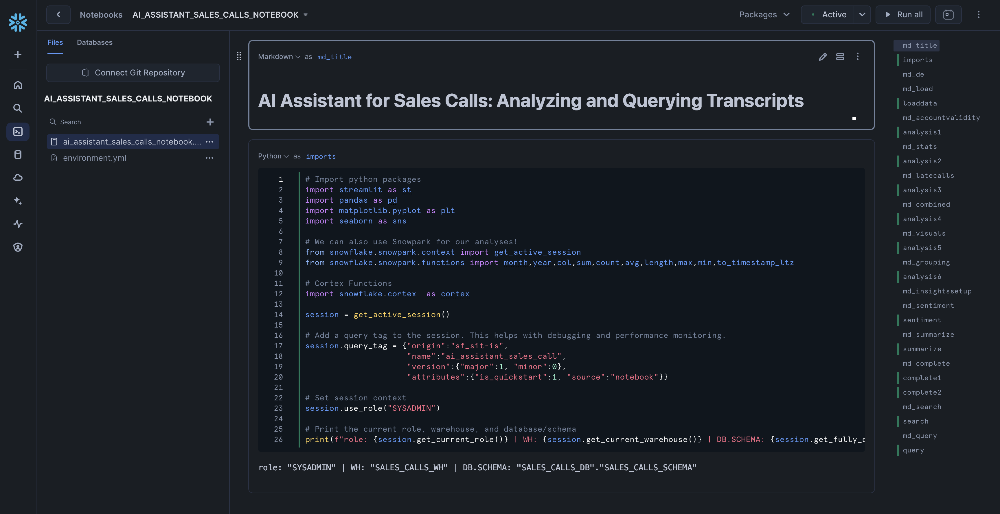

author: Sikha Das
id: ai_agent_health_payers_cc
summary: TODO
categories: Getting-Started
environments: web
status: Published 
feedback link: https://github.com/Snowflake-Labs/sfguides/issues
tags: Getting Started, Data Science, Data Engineering, Snowpark, Snowflake Cortex, Streamlit

# Building AI Assistant using Snowflake Cortex in Snowflake Notebooks
<!-- ------------------------ -->
## Overview

**Duration: 5 minutes**

TODO

### What You Will Learn

- How to use [Snowflake Notebooks](https://docs.snowflake.com/en/user-guide/ui-snowsight/notebooks) and [Snowpark Python](https://docs.snowflake.com/en/developer-guide/snowpark/python/index) for unstructured data processing
- How to leverage [Cortex Search](https://docs.snowflake.com/en/user-guide/snowflake-cortex/cortex-search/cortex-search-overview) for a hybrid (vector and keyword) search engine on text data
- How to use [Cortex LLM functions](https://docs.snowflake.com/en/user-guide/snowflake-cortex/llm-functions) (Cortex Complete) for access to industry-leading large language models (LLMs)
- How to build a chatbot and analytics application using [Streamlit](https://docs.streamlit.io/) in Snowflake


### Prerequisites
- A [GitHub](https://github.com/) Account to access the [GIT REPO](https://github.com/Snowflake-Labs/sfguide-ai-agent-hcls-payers-cc-cortex-notebooks-mlclassification/tree/main)
- A Snowflake account login with a role that has the ability to create database, schema, tables, stages, user-defined functions, and stored procedures. If not, you will need to register for [a free trial](https://signup.snowflake.com/?_fsi=OuImfiWC&_fsi=OuImfiWC) or use a different role.

### What You Will Build

- 

**Architecture Diagram:**



## Data and Snowflake Setup
**Duration: 15 minutes**

> **You can access the full code in [this GIT REPO](https://github.com/Snowflake-Labs/sfguide-ai-agent-hcls-payers-cc-cortex-notebooks-mlclassification/tree/main).**

To get started using Snowflake Notebooks, first login to Snowsight. In the top-left corner, click "+ Create" to create a new Worksheet, and choose "SQL Worksheet".


<br></br>
Paste and run the following [setup.sql](https://github.com/Snowflake-Labs/sfguide-ai-assistant-for-sales-calls/blob/main/scripts/setup.sql) in the SQL worksheet to create Snowflake objects (warehouse, database, schema).

```sql

```

**Upload required files** to the correct stages within the `SALES_CALLS_SCHEMA`



Click '+ Files' in the top right of the stage. Upload all files that you downloaded from GitHub into the stage. The contents should match the app directory. **Make sure your the files in your stages match the following**:

- *Data Files:* Upload all relevant datasets to the `RAW_DATA` stage from [data]()

- *Notebook Files:* Upload notebook files (including environment.yml) to the `NOTEBOOK` stage from [notebook](). Remember to upload [the notebook-specific environment.yml]() file as well.

- *Streamlit Files:* Upload all Streamlit and chatbot-related files to the `CHATBOT_APP` stage from [streamlit](). Remember to upload [the streamlit-specific environment.yml](https://github.com/Snowflake-Labs/sfguide-building-ai-assistant-using-snowflake-co[…]snowflake-notebooks/blob/main/scripts/streamlit/environment.yml) file as well.


<br></br>


<br></br>

Paste and run the following [setup.sql]() in the SQL worksheet to load the  data into tables and create a notebook and streamlit app from the staged files.

```sql

```

## Access Notebook
**Duration: 20 minutes**

The notebook has already been created in your Snowflake account! All packages and Python setup has already been completed.

To access it, navigate to Snowsight, select the `SYSADMIN` role, and click the Project, click the Notebooks tab. Open **TODO** and run each of the cells.



Within this notebook, you'll **TODO**

## Run Streamlit Application
**Duration: 20 minutes**

Chatbot Streamlit in Snowflake Application has been deployed as part of the setup process. To access it, navigate to Snowsight, select the `SYSADMIN` role, and under Projects, click the Streamlit tab. Open **TODO** and explore.

TODO: Add more info into the application

## Conclusion And Resources

**Duration: 1 minute**

In this guide, you learned how to **TODO**

### What You Learned

- How to use Snowflake Notebooks and Snowpark Python for unstructured data processing
- How to leverage Cortex Search for a hybrid (vector and keyword) search engine on text data
- How to use Cortex LLM functions (Cortex Complete) for access to industry-leading large language models (LLMs)
- How to prototype a UI using Streamlit

### Related Resources
- [Snowflake Cortex Documentation](https://docs.snowflake.com/en/user-guide/snowflake-cortex.html)
- [Streamlit Documentation](https://docs.streamlit.io/)
- [Tasty Bytes: Enhancing Customer Experience](https://quickstarts.snowflake.com/guide/tasty_bytes_customer_experience_app/index.html#0)
- [Building AI Assistant using Snowflake Cortex in Snowflake Notebooks](https://quickstarts.snowflake.com/guide/ai_assistant_for_sales_calls/index.html#0)
