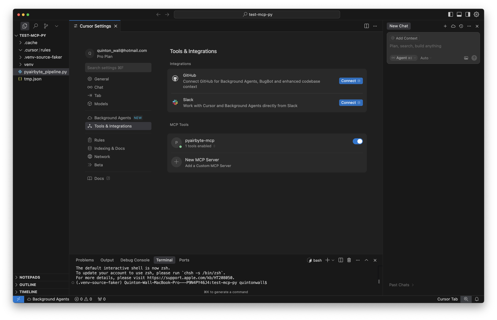
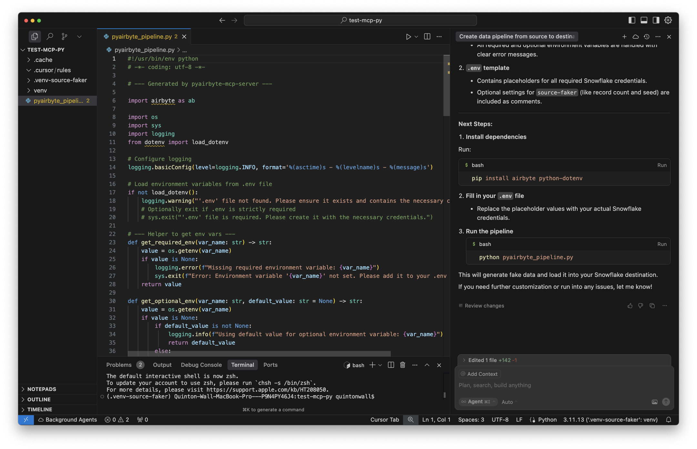

author: Quinton Wall
id: airbyte-mcp-server-generate-pipeline
summary: Learn how to add the Airbyte MCP server to Cursor and generate data pipelines
categories: Getting-Started, Data-Engineering
environments: web
status: Published
feedback link: https://github.com/Snowflake-Labs/sfguides/issues
tags: Getting Started, Data Science, Data Engineering, AI

# Generate Data Pipelines With Airbyte MCP
<!-- ------------------------ -->
## Overview

Duration: 2

(Airbyte)[https://airbyte.io?utm_source=snowflake-quickstarts] is an open source data movement platform designed to allow you to easily move data from and to any source/destination, including Snowflake. The PyAirbyte MCP server exposires a remote MCP server, designed to be used within Cursor  to generates Python-based data pipelines from natural language prompts. It leverages [PyAirbyte](https://github.com/airbytehq/pyairbyte?utm_source=snowflake-quickstarts) under the hood to create end-to-end pipelines that use any of [Airbyte's 600+ connectors](https://connectors.airbyte.com/files/generated_reports/connector_registry_report.html). You can read more on how we made this MCP server on the [Airbyte blog](https://airbyte.com/blog/how-we-built-an-mcp-server-to-create-data-pipelines?utm_source=snowflake-quickstarts)

<video id="t-o8YIfqA_g"></video>


### What You'll Learn

- How to add an MCP server to Cursor
- How to use the PyAirbyte MCP server to generate pipelines as code to move data to Snowflake

### What You'll Build

In this quickstart, you'll set up Cursor—a developer IDE with built-in AI agent support—to use the PyAirbyte MCP server. Then, you'll generate a complete pipeline that moves synthetic data from a [Faker](https://fakerjs.dev) (or any Airbyte supported) data source to a Snowflake destination using just one prompt:

> `create a data pipeline from source-faker to destination-snowflake`

Let’s walk through how to install, configure, generate, and run your first pipeline.

### What You'll Need

- Access to a [Snowflake account](https://signup.snowflake.com/)
- [Cursor IDE](https://cursor.com/) installed
- Basic knowledge of Python


## Step 1: Install and Configure the MCP Server in Cursor

Duration: 3

Open Cursor and navigate to Settings > Tools & Integrations, and tap New MCP Sever. Add the following json snippet. This file tells Cursor which remote MCP servers to connect to and what credentials to pass along.

Paste the following into your `mcp.json` file:

```json
{
  "mcpServers": {
    "pyairbyte-mcp": {
      "url": "https://pyairbyte-mcp-7b7b8566f2ce.herokuapp.com/mcp",
      "env": {
        "OPENAI_API_KEY": "your-openai-api-key"
      }
    }
  }
}
```

Make sure to replace `<your-openai-api-key>` with your actual key from the [OpenAI platform](https://platform.openai.com/account/api-keys).

Save the file. Cursor will automatically detect the MCP server and display **pyairbyte-mcp** as an available MCP tool with a green dot indicating that it has found the available tools.



## Step 2: Generate Your Pipeline

Duration: 3

Within your Cursor proect, start a new chat. In the input box, type the following prompt:

```bash
create a data pipeline from source-faker to destination-snowflake
```

The MCP server will process your prompt and respond by generating all the necessary Python code to extract data from `faker` and load it into `Snowflake`. We suggest you prefix your source and destination with `source-` and `destination-` to ensure specificity when the MCP server performs a embedded source on the Airbyte Connector registry. Connectors for sources and destinations may have the same name, but different configuration parameters.

In a few moments, your pipeline will be created typically in a file called `pyairbyte_pipeline.py`. In addition, the MCP server will generate complete instructions on how to use the server and configure required parameters using a  `.env` file that includes environment variables you’ll need to fill in. 

Create a `.env` file and populate it with your source parameters and Snowflake connection details, per generated instructions. For example:

```env
AIRBYTE_DESTINATION__SNOWFLAKE__HOST=your_account.snowflakecomputing.com
AIRBYTE_DESTINATION__SNOWFLAKE__USERNAME=your_user
AIRBYTE_DESTINATION__SNOWFLAKE__PASSWORD=your_password
AIRBYTE_DESTINATION__SNOWFLAKE__DATABASE=your_db
AIRBYTE_DESTINATION__SNOWFLAKE__SCHEMA=your_schema
AIRBYTE_DESTINATION__SNOWFLAKE__WAREHOUSE=your_warehouse
```

If you’re unsure of any of these values, you can retrieve them from your Snowfßlake console under **Admin > Accounts > Parameters**, or from your Snowflake connection string.


## Step 3: Run Your Pipeline

Duration: 3

With your `.env` file filled in and your pipeline script ready, it’s time to run it. We recommend using a virtual environment manager, such as uv, and Python 3.11 for compatibility with PyAirbyte.

```bash
 uv venv --python 3.11
```

Then, activate your virtual environment:

```bash
source .venv/bin/activate
```

Install the required dependencies:

```bash
 uv pip install -r requirements.txt
```

Then, simply execute the pipeline script:

```bash
python pyairbyte_pipeline.py
```

If everything is configured correctly, PyAirbyte will spin up the pipeline, `faker` will generate synthetic user data, and the data will be written directly into the schema you specified in Snowflake.

You can verify this by logging into your Snowflake account and querying the table created during the sync.



## Next Steps

Duration: 2

Now that you’ve set up your first pipeline with `faker`, you can generate pipelines with **any connector** from Airbyte’s massive ecosystem. Just change the source in your prompt.

For example:

- `create a data pipeline from source-postgres to destination-snowflake`
- `create a data pipeline from source-google-sheets to destination-snowflake`

You can even move data from a source directly to a dataframe for use in popular frameworks such as Streamlit

- `create a data pipeline from source-snowflake to a dataframe`

The PyAirbyte MCP server will handle the rest—generating your code, scaffolding `.env` variables, and letting you run it locally or deploy however you want.

You can browse the full list of supported connectors [here](https://connectors.airbyte.com/files/generated_reports/connector_registry_report.html).

## Conclusion And Resources

Duration: 1

That’s it! With just one prompt and a few environment variables, you’ve built a working data pipeline to Snowflake—powered by PyAirbyte, Airbyte connectors, and the magic of Cursor’s MCP support. For more information on PyAirbyte, check out the [online docs](https://github.com/airbytehq/pyairbyte?utm_source=snowflake-quickstarts) and the latest  [Airbyte AI tools and services](https://airbyte.com/embedded?utm_source=snowflake-quickstarts).