author: Praveen Padige
id: airflow-spcs
categories: snowflake-site:taxonomy/solution-center/certification/quickstart, snowflake-site:taxonomy/product/data-engineering, snowflake-site:taxonomy/snowflake-feature/snowpark-container-services
language: en
summary: Deploy Apache Airflow with Celery Executor on Snowpark Container Services for workflow scheduling and DAG orchestration.
environments: web
status: Published 
feedback link: https://github.com/Snowflake-Labs/sfguides/issues

# Running Apache Airflow on SPCS
<!-- ------------------------ -->
## Overview


In this guide, we will be walking you through how to deploy Apache Airflow application with Celery Executor in Snowpark Container Services.

This application is made up of the following containers:
- **Airflow Webserver**: Provides a user interface for managing and monitoring workflows. It allows users to trigger tasks, view logs, and visualize DAGs (Directed Acyclic Graphs).
- **Airflow Scheduler**: Monitors the DAGs and schedules the tasks to run. It determines the order of task execution based on the dependencies defined in the DAGs.
- **Airflow Workers**: Executes tasks distributed by the Airflow scheduler using Celery for parallel processing. 
- **Postgres**: Serves as the metadata database, storing the state of the DAGs, task instances, users, roles, and other operational data necessary for Airflow to function.
- **Redis**:Acts as a message broker, facilitating communication between the scheduler and the Celery workers. It queues the tasks that the scheduler hands off to the workers for execution.

Together, these components enable efficient scheduling, execution, and monitoring of complex workflows in Airflow.

##
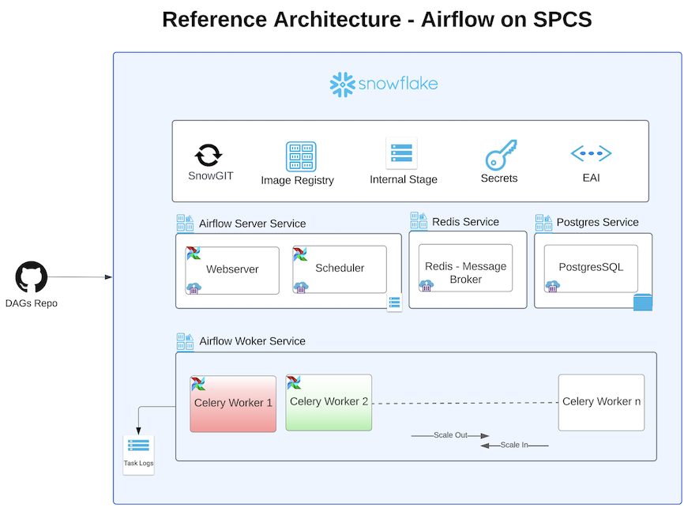
##

Here is a summary of what you will be doing in each step by following this quickstart:

- **Setup Environment**: Setup deidicated Airflow SPCS database,schema, role, compute pools, Image repository etc.
- **SnowGIT Integration**: Sync your Airflow environment with your Github repo to scan for DAG files.
- **Build Docker Images**: Build Airflow, Postgres, Redis & Git Docker images and push them to Snowflake image repository
- **Create Service Specifications**: Create Service specification files for Airflow Service, Redis Service, Postgres Service and upload these files to Snowflake Internal stage.
- **Create Services**: Create Airflow, Redis, Postgres services
- **Run DAG**: Run a sample DAG 
- **Clean up**: If you don’t plan to explore other tutorials, you should remove billable resources you created.

##
### What is Apache Airflow?

Apache Airflow is an open-source platform to programmatically author, schedule, and monitor workflows. Using Directed Acyclic Graphs (DAGs), Airflow allows users to define workflows as code, ensuring flexibility, scalability, and maintainability. It's widely used in various scenarios, from ETL processes and data pipeline automation to machine learning model training and deployment.

Learn more about [Apache Airflow](https://airflow.apache.org/docs/).

##
### What is Snowpark Container Services?
Snowpark Container Services (SPCS) is a feature provided by Snowflake that allows users to run containerized workloads within the Snowflake environment. It is designed to enable the execution of custom code and applications in a scalable and efficient manner, leveraging the Snowflake data platform's infrastructure

Learn more about [Snowpark Container Services](https://docs.snowflake.com/en/developer-guide/snowpark-container-services/overview/).
##

### What You Will Build
 - Apache Airflow application with Celery Executor, using a PostgreSQL database as the metadata store backed by block storage, and persisting task logs in a Snowflake internal stage. 

### What You Will Learn
- The working mechanics of Snowpark Container Services
- How to build and push a containerized Docker image to SPCS along with code and other files
- How to create SnowGIT integration with your Github repository
- How to create External Access Integration
- How to deploy Apache Airflow with Celery Executor in SPCS


### Prerequisites
- A Snowflake account with access to SnowPark Container Services.
- [Docker](https://www.docker.com/products/docker-desktop/) installed locally for building images.
- Basic knowledge of Apache Airflow and containerized deployments.


<!-- ------------------------ -->
## Setup Environment


### Create Snowflake Objects

Log into [Snowsight](https://docs.snowflake.com/en/user-guide/ui-snowsight.html#) using your credentials to create Snowflake objects.

1) In a new SQL worksheet, run the following SQL commands to complete [Common Setup for SPCS](https://docs.snowflake.com/en/developer-guide/snowpark-container-services/tutorials/common-setup#introduction).

```sql

USE ROLE ACCOUNTADMIN;
CREATE ROLE airflow_admin_rl;

CREATE DATABASE IF NOT EXISTS airflow_db;
GRANT OWNERSHIP ON DATABASE airflow_db TO ROLE airflow_admin_rl COPY CURRENT GRANTS;

CREATE OR REPLACE WAREHOUSE airflow_wh WITH
  WAREHOUSE_SIZE='X-SMALL';
GRANT USAGE ON WAREHOUSE airflow_wh TO ROLE airflow_admin_rl;

GRANT BIND SERVICE ENDPOINT ON ACCOUNT TO ROLE airflow_admin_rl;

GRANT ROLE airflow_admin_rl TO USER <user_name>;

```

2) In the same SQL worksheet, run the following SQL commands to create [compute pool](https://docs.snowflake.com/en/sql-reference/sql/create-compute-pool) for each of the Airflow services (Webserver, Scheduler, Celery Worker, Redis and Postgres).

```sql
USE ROLE ACCOUNTADMIN;
/* Compute pool for host Postgres and Redis services */
CREATE COMPUTE POOL postgres_redis
  MIN_NODES = 1
  MAX_NODES = 1
  INSTANCE_FAMILY = CPU_X64_S;

/* Compute pool for Airflow Webserver and Scheduler services */
CREATE COMPUTE POOL airflow_server
  MIN_NODES = 1
  MAX_NODES = 1
  INSTANCE_FAMILY = CPU_X64_S;

/* Compute pool for Airflow Workers, set max_nodes to 2 for auto scaling */
CREATE COMPUTE POOL airflow_workers
  MIN_NODES = 1
  MAX_NODES = 2
  INSTANCE_FAMILY = CPU_X64_S;

/* Grant access on these compute pools to role airflow_admin_rl */
GRANT USAGE, MONITOR ON COMPUTE POOL postgres_redis to ROLE airflow_admin_rl;
GRANT USAGE, MONITOR ON COMPUTE POOL airflow_server to ROLE airflow_admin_rl;
GRANT USAGE, MONITOR ON COMPUTE POOL airflow_workers to ROLE airflow_admin_rl;
```
##
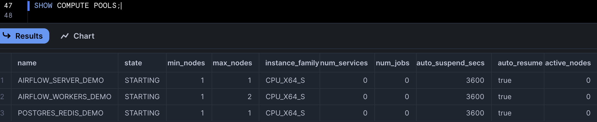
##

3) Run the following SQL commands in SQL worksheet to create [image repository](https://docs.snowflake.com/en/sql-reference/sql/create-image-repository) to upload docker images for these services, also create [internal stage](https://docs.snowflake.com/en/sql-reference/sql/create-stage) to upload service specification files.

```sql
USE ROLE airflow_admin_rl;
USE DATABASE airflow_db;
USE WAREHOUSE airflow_wh;

CREATE SCHEMA IF NOT EXISTS airflow_schema;
USE SCHEMA airflow_db.airflow_schema;
CREATE IMAGE REPOSITORY IF NOT EXISTS airflow_repository;
CREATE STAGE IF NOT EXISTS service_spec DIRECTORY = ( ENABLE = true );
```

4) Create Snowflake secret objects to store passwords for Postgres, Redis and [Airflow Fernet Key](https://airflow.apache.org/docs/apache-airflow/stable/security/secrets/fernet.html#fernet). Refer to this [document](https://airflow.apache.org/docs/apache-airflow/stable/security/secrets/fernet.html#generating-fernet-key) to generate Fernet Key.

```sql
USE ROLE airflow_admin_rl;
USE SCHEMA airflow_db.airflow_schema;

CREATE SECRET airflow_fernet_key
    TYPE = password
    username = 'airflow_fernet_key'
    password = '########'
    ;

CREATE SECRET airflow_postgres_pwd
    TYPE = password
    username = 'postgres'
    password = '########'
    ;

CREATE SECRET airflow_redis_pwd
    TYPE = password
    username = 'airflow'
    password = '########'
    ;
```

<!-- ------------------------ -->
## SnowGIT and External Access Integration


1) Create a [SnowGIT integration](https://docs.snowflake.com/en/developer-guide/git/git-setting-up). You will use this integration in the Airflow service to scan for DAG files from the repository. As soon as a DAG file is added or updated in the GitHub repo, it will be made available to the Airflow UI.

```sql
USE ROLE airflow_admin_rl;
USE SCHEMA airflow_db.airflow_schema;

/* create a secret object to store Github personal access token */
CREATE OR REPLACE SECRET git_airflow_secret
  TYPE = password
  USERNAME = '<username>'
  PASSWORD = 'patghp_token'
  ;

GRANT USAGE ON SECRET git_airflow_secret  TO ROLE accountadmin;

USE ROLE accountadmin;
CREATE OR REPLACE API INTEGRATION airflow_git_api_integration
  API_PROVIDER = git_https_api
  API_ALLOWED_PREFIXES = ('https://github.com/my-account')
  ALLOWED_AUTHENTICATION_SECRETS = (airflow_db.airflow_schema.git_airflow_secret)
  ENABLED = TRUE;

GRANT USAGE ON INTEGRATION airflow_git_api_integration TO ROLE airflow_admin_rl;

USE ROLE airflow_admin_rl;
USE SCHEMA airflow_db.airflow_schema;

CREATE OR REPLACE GIT REPOSITORY airflow_dags_repo
  API_INTEGRATION = airflow_git_api_integration
  GIT_CREDENTIALS = airflow_db.airflow_schema.git_airflow_secret
  ORIGIN = 'https://github.com/my-account/repo.git';

SHOW GIT BRANCHES IN airflow_dags_repo;

/* we will mount this stage as a volume to the Airflow service. git-sync container copies the DAGs to this stage. */
CREATE STAGE IF NOT EXISTS airflow_dags ENCRYPTION = (TYPE = 'SNOWFLAKE_SSE');

/* we will mount this stage as a volume to the Airflow service where it will store task logs. */
CREATE STAGE IF NOT EXISTS airflow_logs ENCRYPTION = (TYPE = 'SNOWFLAKE_SSE');
```
##
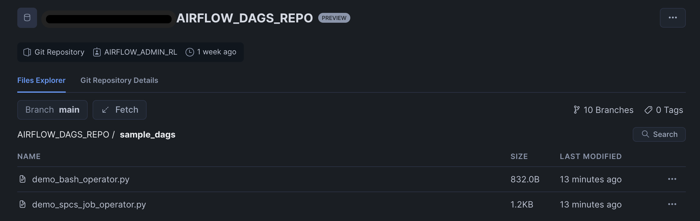
##
2) In SPCS by default outbound traffic is disabled. To enable it you will have to create a [Netwrok Rule](https://docs.snowflake.com/en/sql-reference/sql/create-network-rule) and [External Access Integration](https://docs.snowflake.com/en/sql-reference/sql/create-external-access-integration). This integration will be  passed as an input to Airflow Service. 

```sql
USE ROLE airflow_admin_rl;
USE SCHEMA airflow_db.airflow_schema;

CREATE OR REPLACE NETWORK RULE airflow_spcs_egress_rule
  MODE = EGRESS
  TYPE = HOST_PORT
  VALUE_LIST = (
  'my-account.snowflakecomputing.com',
  'api.slack.com',
  'hooks.slack.com',
  'events.pagerduty.com');

GRANT USAGE ON NETWORK RULE airflow_spcs_egress_rule TO ROLE accountadmin;

USE ROLE accountadmin;
CREATE OR REPLACE EXTERNAL ACCESS INTEGRATION airflow_spcs_egress_access_integration
  ALLOWED_NETWORK_RULES = (airflow_db.airflow_schema.airflow_spcs_egress_rule)
  ENABLED = true;

GRANT USAGE ON  INTEGRATION airflow_spcs_egress_access_integration to role airflow_admin_rl;

```

<!-- ------------------------ -->
## Build Docker Images


In this section you will be build the docker images and push them to Snowflake Image Repository.

1) Make sure you have the URL of the repository where you want to upload the images. To get this URL, you can execute the SHOW IMAGE REPOSITORIES command, using SnowSQL CLI or the Snowsight web interface. The command returns the repository URL, including the organization name and the account name.

2) Open a terminal window, and change to the directory of your choice.

3) Clone the GitHub repository.

```
git clone https://github.com/Snowflake-Labs/spcs-templates.git
```
4) Go to `airflow-spcs` directory. This directory has Dockerfiles for Airflow, Postgres, Redis and Git.

5) To enable Docker to upload images on your behalf to your image repository, you must use the docker login command to authenticate to the Snowflake registry:

```
docker login <registry_hostname> -u <username>
```
*Note: The <registry_hostname> is the hostname part of the repository URL. For example, myorg-myacct.registry.snowflakecomputing.com. <username> is your Snowflake username. Docker will prompt you for your password.*

6) Build Airflow Image. The base image used in Dockerfile is `apache/airflow:slim-2.7.3-python3.10`. If you want to use an another version of Airflow you can update the Dockerfile for the same.

```
docker build  --rm --platform linux/amd64 -t <registry_hostname>/airflow_db/airflow_schema/airflow_repository/airflow:2.7.3 -f ./airflow/airflow/Dockerfile .
```

7) Build Postgres Image. The base image used in Dockerfile is `postgres:14.10`.

```
docker build  --rm --platform linux/amd64 -t <registry_hostname>/airflow_db/airflow_schema/airflow_repository/postgres:14.10 -f ./airflow/postgres/Dockerfile .
```

8) Build Redis Image. The base image used in Dockerfile is `redis:7.0`.

```
docker build  --rm --platform linux/amd64 -t <registry_hostname>/airflow_db/airflow_schema/airflow_repository/redis:7.0 -f ./airflow/redis/Dockerfile .
```

9) Build git-sync Image.

```
docker build  --rm --platform linux/amd64 -t <registry_hostname>/airflow_db/airflow_schema/airflow_repository/gitsync:latest -f ./airflow/git-sync/Dockerfile .
```
10) Push images to Snowflake Image Repository

```
docker push <registry_hostname>/airflow_db/airflow_schema/airflow_repository/airflow:2.7.3
docker push <registry_hostname>/airflow_db/airflow_schema/airflow_repository/postgres:14.10
docker push <registry_hostname>/airflow_db/airflow_schema/airflow_repository/redis:7.0
docker push <registry_hostname>/airflow_db/airflow_schema/airflow_repository/gitsync:latest
```

11) Run this command to list the images in Snowflake Image Repository.

```sql
USE ROLE airflow_admin_rl;
USE SCHEMA airflow_db.airflow_schema;
SHOW IMAGES IN IMAGE REPOSITORY airflow_repository;
```
##
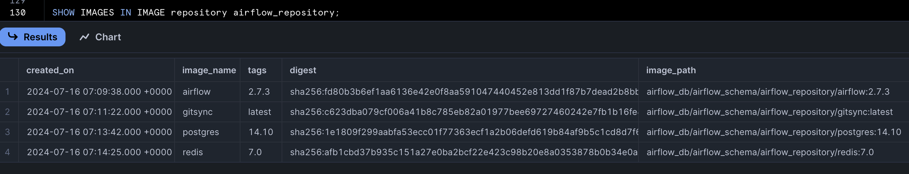
##
<!-- ------------------------ -->
## Create Service Specification files


In each of the service directory of the cloned repository you will see `.template` files. We rendere these `.template` files by running `render_template.py` script. It uses values from `values.yaml` file. You can modify values in `values.yaml` file to customize the application as per your needs.

1) Open a terminal window, and change directory to `airflow-spcs/airflow/template`

2) Run below script, it will generate `airflow/airflow_server.yaml`, `airflow/airflow_worker.yaml`, `postgres/postgres.yaml`, `redis/redis.yaml` and  `git-sync/gitsync.yaml` files.

```python
python render_template.py
```

3) Upload these specification files to `@airflow_db.airflow_schema.service_spec`. You can upload directly from Snowsight or you can use [SnowSQL CLI](https://docs.snowflake.com/en/user-guide/snowsql) to upload from terminal.

```sql
USE  ROLE airflow_admin_rl;
put file://~/airflow_spcs/redis/redis.yaml @airflow_db.airflow_schema.service_spec AUTO_COMPRESS=FALSE OVERWRITE=TRUE; 
put file://~/airflow_spcs/postgres/postgres.yaml @airflow_db.airflow_schema.service_spec AUTO_COMPRESS=FALSE OVERWRITE=TRUE; 
put file://~/airflow_spcs/airflow/airflow_server.yaml @airflow_db.airflow_schema.service_spec AUTO_COMPRESS=FALSE OVERWRITE=TRUE; 
put file://~/airflow_spcs/airflow/airflow_worker.yaml @airflow_db.airflow_schema.service_spec AUTO_COMPRESS=FALSE OVERWRITE=TRUE; 
```

<!-- ------------------------ -->
## Create Services


Run below commands in Snowsight to create Redis, Postgres, Airflow services.

```sql
USE  ROLE airflow_admin_rl;
USE SCHEMA airflow_db.airflow_schema;

/* creates Postgres service */
CREATE SERVICE postgres_service
  IN COMPUTE POOL postgres_redis
  FROM @service_spec
  SPECIFICATION_FILE='postgres.yaml'
  MIN_INSTANCES=1
  MAX_INSTANCES=1;

/* check status of the service */
SELECT SYSTEM$GET_SERVICE_STATUS('postgres_service');
/* check container logs of the service */
CALL SYSTEM$GET_SERVICE_LOGS('postgres_service', '0','postgres');
```
##
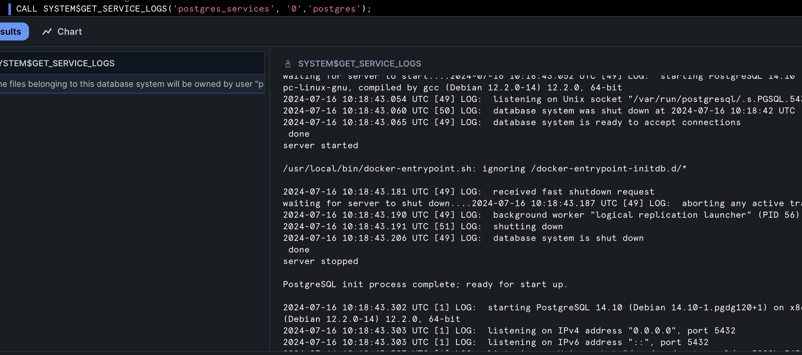
##

```sql
/* creates Redis service */
CREATE SERVICE redis_service
  IN COMPUTE POOL postgres_redis
  FROM @service_spec
  SPECIFICATION_FILE='redis.yaml'
  MIN_INSTANCES=1
  MAX_INSTANCES=1;

/* check status of the service */
SELECT SYSTEM$GET_SERVICE_STATUS('redis_service');
/* check container logs of the service */
CALL SYSTEM$GET_SERVICE_LOGS('redis_service', '0','redis');
```

##
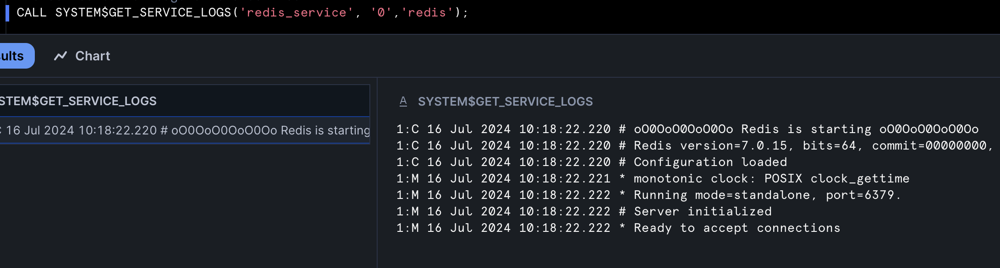
##

```sql
/* creates Airflow webserver, Scheduler and Git-Sync services */
CREATE SERVICE airflow_service
  IN COMPUTE POOL airflow_server
  FROM @service_spec
  SPECIFICATION_FILE='airflow_server.yaml'
  MIN_INSTANCES=1
  MAX_INSTANCES=1
  EXTERNAL_ACCESS_INTEGRATIONS = (airflow_spcs_egress_access_integration);

/* check status of the service */
SELECT SYSTEM$GET_SERVICE_STATUS('airflow_service');
/* check container logs of the service */
CALL SYSTEM$GET_SERVICE_LOGS('airflow_service', '0','webserver');
```
##
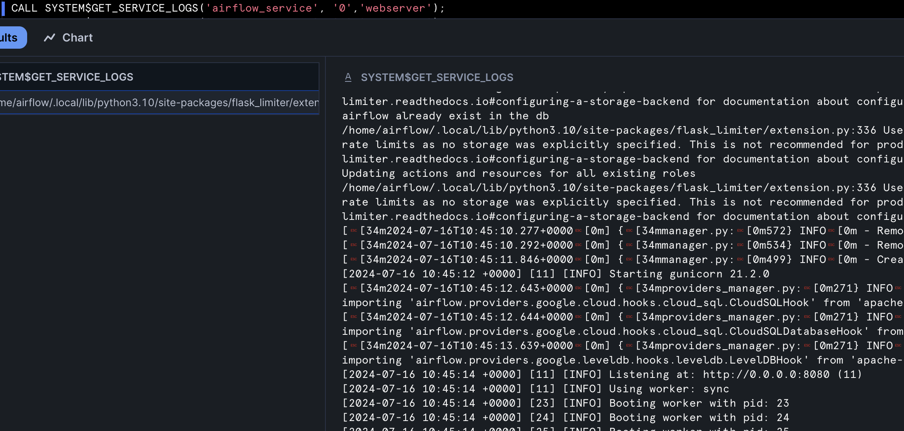
##
```sql
CALL SYSTEM$GET_SERVICE_LOGS('airflow_service', '0','scheduler');
```
##
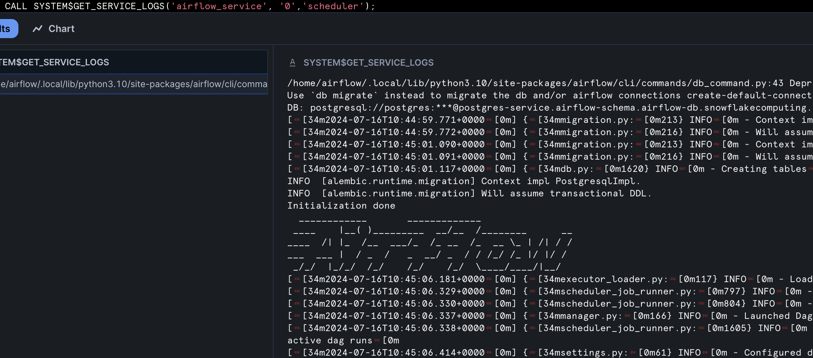
##
```sql
CALL SYSTEM$GET_SERVICE_LOGS('airflow_service', '0','git-sync');
/* creates Airflow Workers service */
CREATE SERVICE airflow_worker
  IN COMPUTE POOL airflow_workers
  FROM @service_spec
  SPECIFICATION_FILE='airflow_worker.yaml'
  MIN_INSTANCES=1
  MAX_INSTANCES=2
  EXTERNAL_ACCESS_INTEGRATIONS = (airflow_spcs_egress_access_integration);

/* check status of the service */
SELECT SYSTEM$GET_SERVICE_STATUS('airflow_worker');
/* check container logs of the service */
CALL SYSTEM$GET_SERVICE_LOGS('airflow_worker', '0','worker');
CALL SYSTEM$GET_SERVICE_LOGS('airflow_worker', '1','worker');
```
##
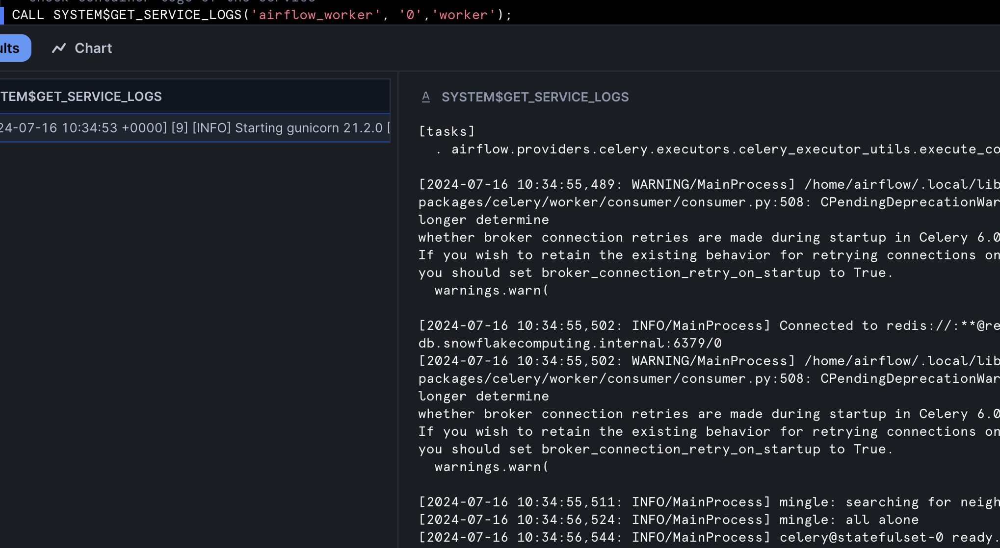
##

If you have changed Docker image or changed service specification files, run below command to restart the service with latest changes.

```sql
USE  ROLE airflow_admin_rl;
USE SCHEMA airflow_db.airflow_schema;
ALTER SERVICE airflow_worker FROM @service_spec SPECIFICATION_FILE='airflow_worker.yaml';
```

You can share this app with other Snowflake roles within the same account. Run the below grant command for the same.

```sql
USE  ROLE airflow_admin_rl;
USE SCHEMA airflow_db.airflow_schema;
GRANT SERVICE ROLE airflow_service!ALL_ENDPOINTS_USAGE TO ROLE <role-name>;
```

<!-- ------------------------ -->
## Run a DAG


Once all the services have created successfully and the containers are in running state, run the below command in Snowsight to get the endpoint for Airflow UI.

```sql
USE  ROLE airflow_admin_rl;
USE SCHEMA airflow_db.airflow_schema;
SHOW ENDPOINTS IN SERVICE airflow_service;
```
##
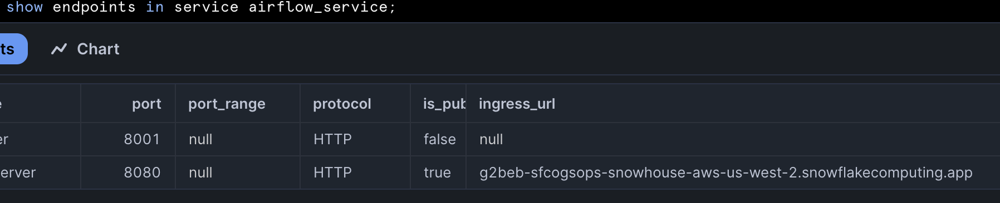
##

Copy `webserver` container `ingress_url` to the browser, after successful authentication you will be redirected to Airflow Login page. 

##
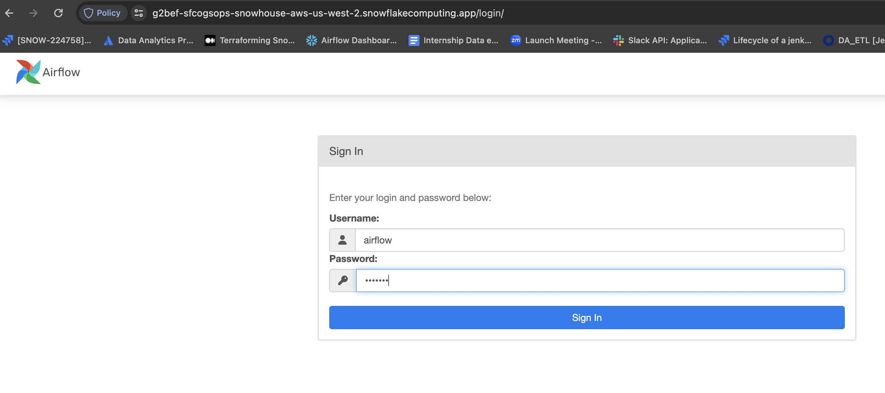
##

Pass the credentials as `airflow/airflow`. You will be redirected to Airflow DAGs home page.

In the home page, you will be seeing below two DAGs which are extracted from Snowflake stage `@airflow_db.airflow_schema.airflow_dags` mounted as a volume to Airflow containers.

##
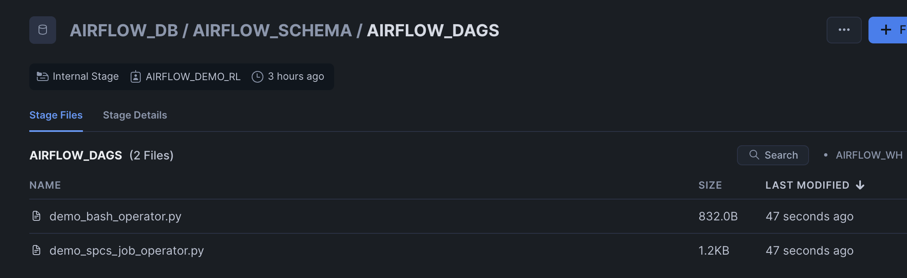
##


Enable `sample_python_dag`, this should run once.

##
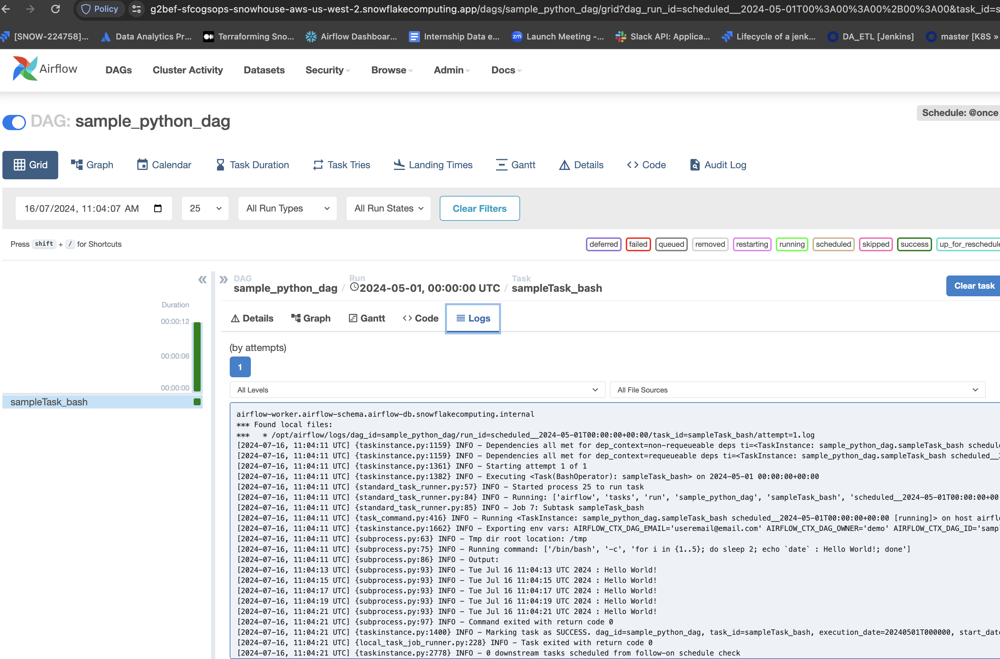
##

Task Logs are persisted in Snowflake's internal stage `@airflow_db.airflow_schema.airflow_logs`

##
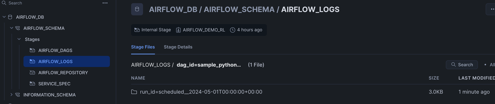
##

<!-- ------------------------ -->
## Clean up


Snowflake charges for the Compute Pool nodes that are active for your account. (See [Working With Compute Pools](https://docs.snowflake.com/developer-guide/snowpark-container-services/working-with-compute-pool)). To prevent unwanted charges, first stop all services that are currently running on a compute pool. Then, either suspend the compute pool (if you intend to use it again later) or drop it.

1. Stop all the services on the compute pool
```sql
USE ROLE airflow_admin_rl;
ALTER COMPUTE POOL postgres_redis STOP ALL;
ALTER COMPUTE POOL airflow_server STOP ALL;
ALTER COMPUTE POOL airflow_workers STOP ALL;
```

2. Drop the compute pool
```sql
DROP COMPUTE POOL postgres_redis;
DROP COMPUTE POOL airflow_server;
DROP COMPUTE POOL airflow_workers;
```

3. Clean up the image registry (remove all images), drop SnowGIT repository and the internal stage objects(remove specifications)
```sql
DROP IMAGE REPOSITORY airflow_repository;
DROP GIT REPOSITORY airflow_dags_repo;
DROP STAGE service_spec;
DROP STAGE airflow_logs;
DROP STAGE airflow_dags;
```

<!-- ------------------------ -->
## Additional Consideration


Steps to Integrate Airflow with Okta for RBAC.

1. In Airflow Dockerfile (`/airflow/airflow/Dockerfile`) uncomment below line and save the file. Build the docker image and push it to Snowflake image repository
```
#ADD --chown=airflow:root ./airflow/airflow/webserver_config.py /opt/airflow/webserver_config.py
```

2. Create Snowflake secret object to store Okta app `Client_Id` and `Client_Secret`
3. In `/template/values.yaml` file uncomment below secret objects also set `AIRFLOW__WEBSERVER__AUTHENTICATE` and  `AIRFLOW__WEBSERVER__RBAC` variables to True.

```
      # - snowflakeSecret: airflow_db.airflow_schema.airflow_user
      #   secretKeyRef: password
      #   envVarName: SNOWFLAKE_CONNECTIONS_SNOWHOUSE_PASSWORD
      # - snowflakeSecret: airflow_db.airflow_schema.airflow_spcs_okta
      #   secretKeyRef: username
      #   envVarName: AIRFLOW_WEB_CLIENT_ID
      # - snowflakeSecret: airflow_db.airflow_schema.airflow_spcs_okta
      #   secretKeyRef: password
      #   envVarName: AIRFLOW_WEB_CLIENT_SECRET
      AIRFLOW__WEBSERVER__AUTHENTICATE: False # Change its value to True if you are planning to put the UI behind Okta
      AIRFLOW__WEBSERVER__RBAC: False # Change its value to True if you are planning to put the UI behind Okta
```
4. Run `rendere_templates.py` script and upload `airflow_server.yaml` file to `@service_spec` stage. Once done, restart `airflow_server` service.


<!-- ------------------------ -->
## Conclusion and Resources

### Conclusion

Congratulations! You've successfully hosted Apache Airflow with Celery Executor on Snowpark Container Services.
Running Airflow on Snowpark Container Services simplifies the process of setting up a robust, production-ready orchestration environment. By leveraging Snowflake's integrated ecosystem and scalable infrastructure, you can focus on building and managing your data workflows without the overhead of traditional deployment complexities. Start leveraging the power of Airflow on SPCS today and experience the benefits of a seamless, efficient deployment process.

### What You Learned

- The working mechanics of Snowpark Container Services
- How to build and push a containerized Docker image to SPCS along with code and data files
- How to create SnowGIT integration with your Github repository
- How to create External Access Integration
- How to deploy Apache Airflow with Celery Executor in SPCS


### Resources

- [Apache Airflow](https://airflow.apache.org/docs/)
- [Celery Executor](https://airflow.apache.org/docs/apache-airflow-providers-celery/stable/celery_executor.html)
- [Snowpark Container Services](https://docs.snowflake.com/en/developer-guide/snowpark-container-services/overview/)
- [SnowGIT](https://docs.snowflake.com/en/developer-guide/git/git-setting-up)
- [Snowflake Secret Objects](https://docs.snowflake.com/en/sql-reference/sql/create-secret)
