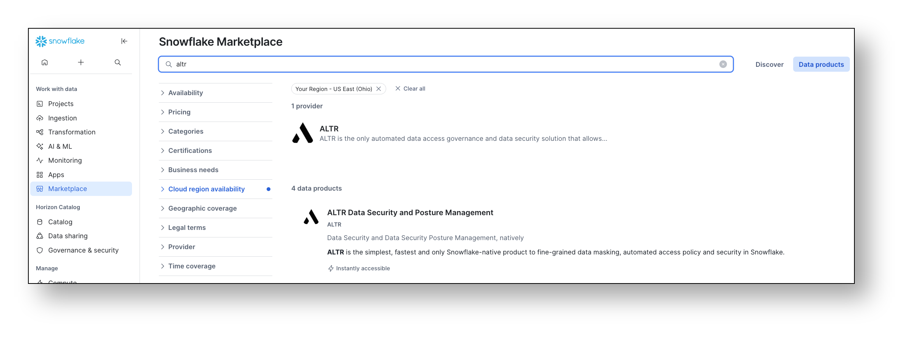
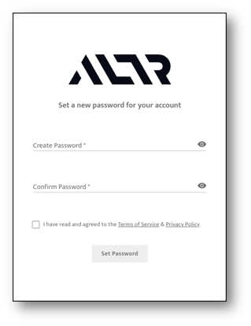
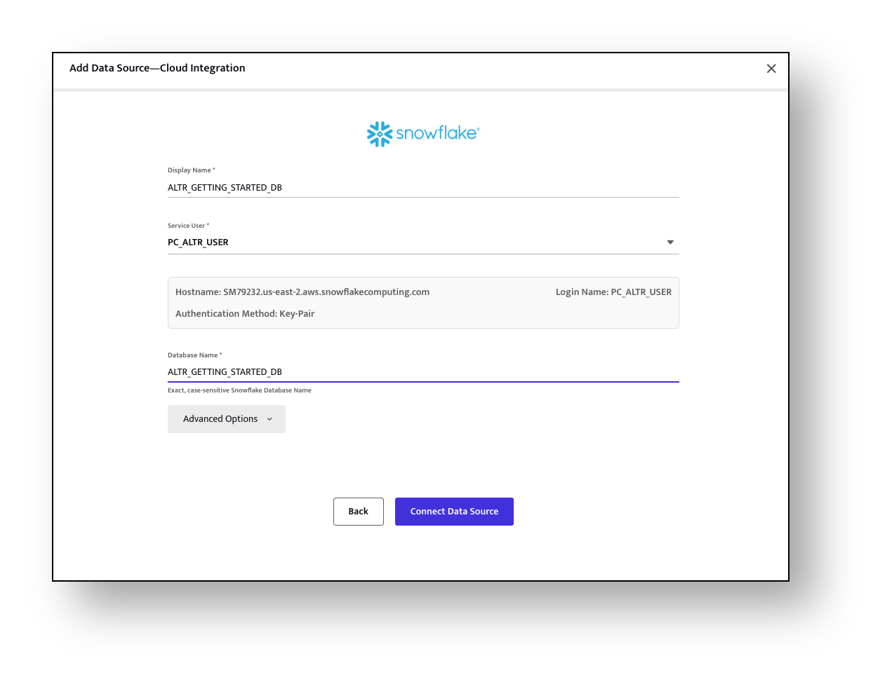
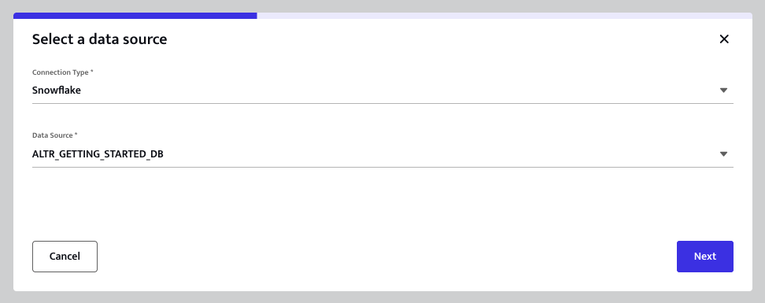
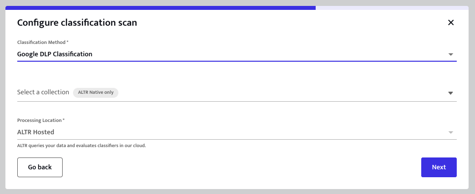
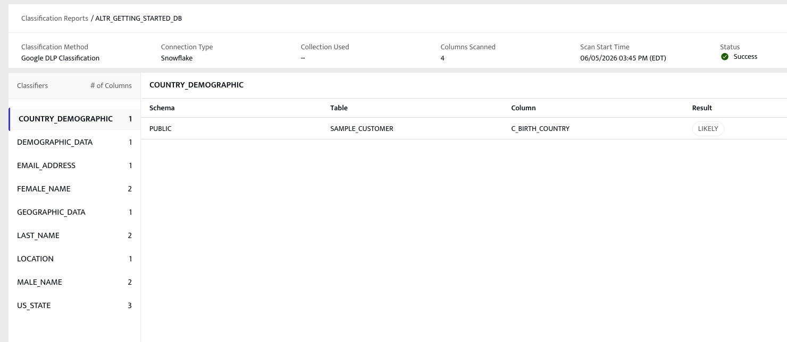
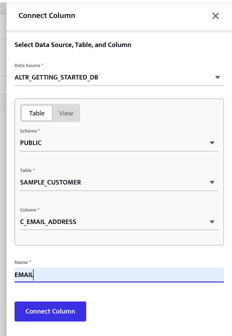
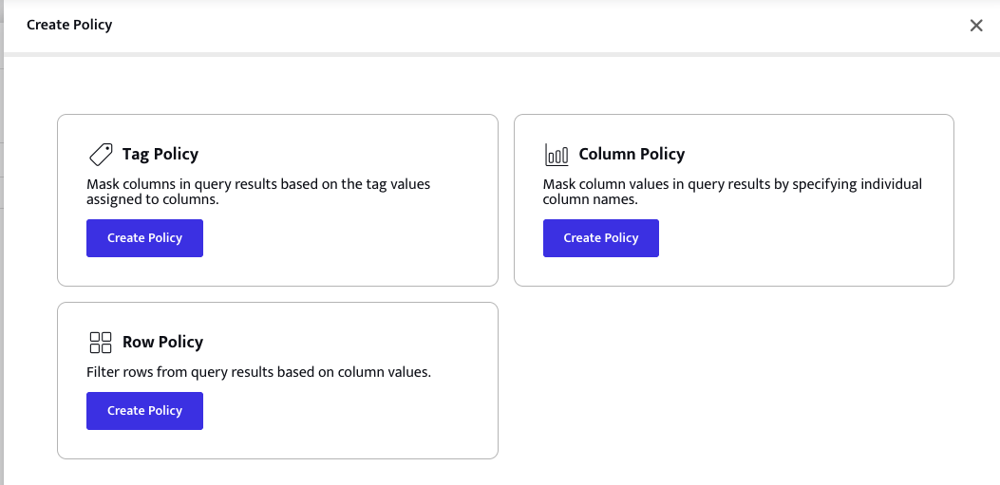
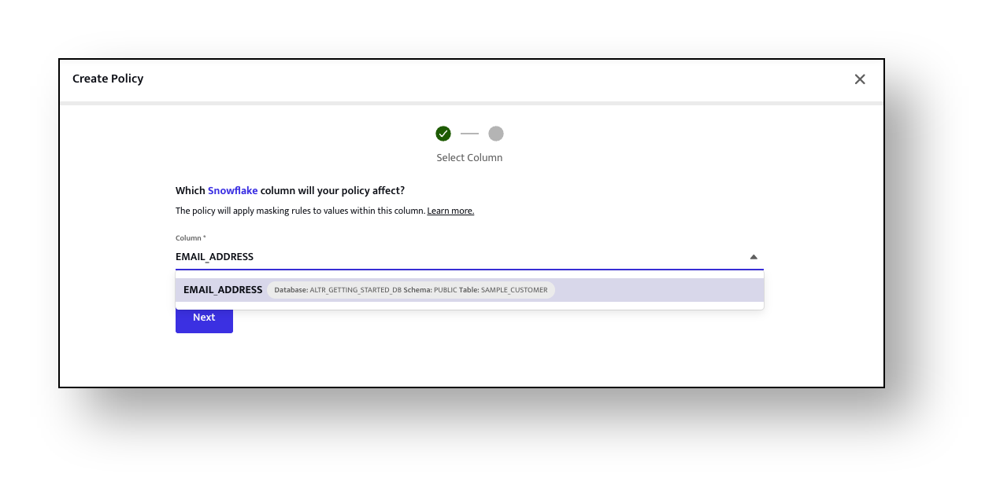
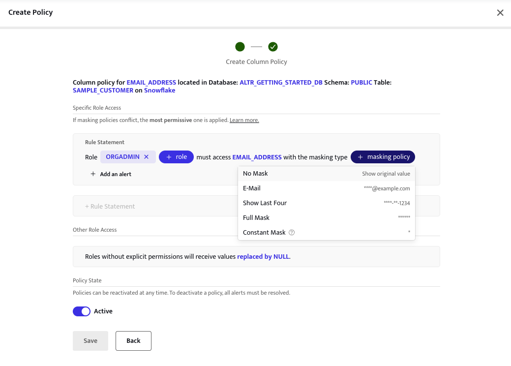

author: Parker Cummings
id: altr-get-started
categories: snowflake-site:taxonomy/solution-center/certification/quickstart, snowflake-site:taxonomy/product/platform, snowflake-site:taxonomy/snowflake-feature/compliance-security-discovery-governance
language: en
summary: Configure ALTR for Snowflake data governance with dynamic masking and role-based access control policies.
environments: web
status: Published 
feedback link: https://github.com/Snowflake-Labs/sfguides/issues


# ALTR Quickstart - Data Access Control

<!-- 1 ------------------------ -->
## ALTR Quickstart - Data Access Control  

This Quick Start Guide is intended for Data Owners and Data Stewards or any other role responsible for securing sensitive data in your Snowflake data warehouses. Its purpose is to demonstrate how ALTR automates data governance.

### Prerequisites
- A Snowflake Enterprise Edition account (or higher). 
    - We recommend that you sign up for a free [Snowflake Trial](https://signup.snowflake.com/?utm_source=snowflake-devrel&utm_medium=developer-guides&utm_cta=developer-guides)
- You need to be, or have access to, an ACCOUNTADMIN for your Snowflake instance. 


### What You'll Learn 
- How to use ALTR to discover sensitive data in Snowflake using automated classification
- How to secure that data with column-level masking policies enforced by role

### What You'll Build 
- A role-based data access policy for a Snowflake column that is automatically enforced by ALTR.

<!-- 2 ------------------------ -->
## Create a sample database

> 
>**In This Step:** 
We are creating a sample database by copying a small amount of data from Snowflake's shared *SNOWFLAKE_SAMPLE_DATA* database. We will use this sample database for the rest of this Quickstart. 
>

### Create a sample database

- To create the sample database, run the following SQL in a SQL worksheet: 

```sql
-- Use ACCOUNTADMIN role
USE ROLE ACCOUNTADMIN;

-- Create Sample Database
CREATE DATABASE ALTR_GETTING_STARTED_DB;

-- Set DB Context
USE DATABASE ALTR_GETTING_STARTED_DB;

-- Populate sample database from Snowflake's shared sample database. 
-- Usually named: SNOWFLAKE_SAMPLE_DATA
CREATE TABLE SAMPLE_CUSTOMER AS 
    SELECT 
        C_FIRST_NAME,
        C_LAST_NAME,
        C_EMAIL_ADDRESS,
        C_BIRTH_COUNTRY
    FROM SNOWFLAKE_SAMPLE_DATA.TPCDS_SF10TCL.CUSTOMER
    LIMIT 10000;
```

> 
> **Note:** If you can't access Snowflake's built-in sample data and want to use your own data, go for it! To match this guide we recommend creating a separate database named ALTR_GETTING_STARTED_DB. Populate it with fields from your own dataset — be sure to include columns with PII like email addresses, names, addresses, SSNs, etc.
>

<!-- 3 ------------------------ -->
## Setup a new ALTR account

> 
>**In This Step:** 
>We will create an ALTR account and connect it to Snowflake, all from within your browser. ALTR is a SaaS solution that integrates directly with Snowflake — no installation required on your premises. The process starts in Snowflake's Partner Connect portal.
>

> 
> **NOTE:** If you already have an ALTR account and want to use it instead of creating a new one, skip to Step 4 ***ALTR Setup for existing accounts*** 
>

### Connect to ALTR via Partner Connect

- Log in to your Snowflake instance and navigate to **Data Products → Partner Connect**. If you need help finding it, see: [Connecting with a Snowflake Partner](https://docs.snowflake.com/en/user-guide/ecosystem-partner-connect#connecting-with-a-snowflake-partner).
- Type "ALTR" in the search bar and click on the ALTR card
- Review the objects that will be created in your Snowflake account (`PC_ALTR_DB`, `PC_ALTR_WH`, `PC_ALTR_USER`, `PC_ALTR_ROLE`) and click **Connect**
- When you see the confirmation below, click **Activate** — this takes you to the ALTR portal to finish setup



### Set your ALTR Password

- Enter your password
- Accept Terms and Conditions
- Click **Set Password**

### Complete the ALTR Setup Wizard

The wizard will walk you through the remaining setup. The key steps are:

1. **Account Details** — enter an Organization Name for your ALTR account
2. **Configure ALTR for Snowflake** — choose **Express Configuration** (recommended). Copy the SQL snippet provided and run it in a Snowflake worksheet as `ACCOUNTADMIN`:
```sql
GRANT ROLE ACCOUNTADMIN TO USER "PC_ALTR_USER";
```
Then click **Test Configuration** to verify it worked.

3. **Connect Databases** — select `ALTR_GETTING_STARTED_DB` from the dropdown and complete the wizard

> 
> **NOTE:** After onboarding is complete you can revoke the `ACCOUNTADMIN` grant from `PC_ALTR_USER` if desired. Express Configuration is temporary by design.
>

<!-- 4------------------------ -->
## ALTR Setup for existing accounts

> 
>**In This Step**
>Only perform this step if you plan to use an ALTR account that existed before running this Quickstart. If you just created a new ALTR account in the previous step, skip to Step 5 **Run Data Classification**.
>

### Grant ALTR access to the sample database

- Log in to the Snowflake instance associated with your existing ALTR account
- Run the following stored procedure as `ACCOUNTADMIN` in a new worksheet:
```sql
CALL "PC_ALTR_DB"."PUBLIC"."SETUP_ALTR_SERVICE_ACCOUNT"(TRUE);
```

> 
> **NOTE**: If the stored procedure returns an error, try calling it again with `FALSE`:
>
```sql
CALL "PC_ALTR_DB"."PUBLIC"."SETUP_ALTR_SERVICE_ACCOUNT"(FALSE);
```

### Connect ALTR to the Sample Database

> 
> **NOTE**: Free tier ALTR accounts are limited to 3 connected databases. If you are already at that limit, disconnect an existing database before connecting this one, or use a database you already have connected (column names may differ from this guide).
>

- [Log in to your ALTR portal](https://altrnet.live.altr.com/api/auth/organization_login?uiredirect=true)
- Navigate to **Data Configuration → Data Sources**
- Click **Add Data Source**, select **Snowflake**, and fill in:
  - **Display Name:** `ALTR_GETTING_STARTED_DB`
  - **Service User:** `PC_ALTR_USER`
  - **Database Name:** `ALTR_GETTING_STARTED_DB`
- Click **Next**, then **Connect Data Source**


>

<!-- ------------------------ -->
## Run Data Classification

> 
>**In This Step**
>ALTR can scan your database and automatically identify columns that contain sensitive data. We call this *classification*. In this step we will trigger a Google DLP classification scan, which samples your data and sends it to Google's DLP API to detect information types like email addresses, names, and phone numbers.
>

### Start a classification scan

- In the ALTR portal, navigate to **Data Classification → Classification Reports**
- Click the **Classify Data** button
- In the modal that appears, select your **Connection Type** (Snowflake) and **Data Source** (ALTR_GETTING_STARTED_DB), then click **Next**



- On the next screen, set **Classification Method** to **Google DLP Classification**
- **Processing Location** is always **ALTR Hosted** for GDLP scans
- Click **Next** to start the scan



> 
> **NOTE:** ALTR does not send your raw data to Google DLP. Before submission, ALTR scrambles the sample by randomly mixing values across rows and columns, so individual records cannot be reconstructed.
>

ALTR will notify you by email when the scan is complete. The scan typically takes only a few minutes. Wait for it to finish before moving on.

### View the classification results

- Once the scan completes, click into the report from **Data Classification → Classification Reports**



> 
>**Classification Report Explainer:** 
>- The left panel lists every *classifier tag* (information type) detected, with a count of how many columns matched.
>- Clicking a classifier tag filters the right panel to show the specific Schema, Table, Column, and confidence level for each match.
>- [Get more information on data classification in ALTR](https://docs.altr.com/features/data-classification/)
>

Take note of the **EMAIL_ADDRESS** classifier — in the next step we will connect that column to ALTR so we can apply a masking policy to it.

<!-- ------------------------ -->
## Connect a Column to ALTR

> 
>**In This Step**
>Before ALTR can enforce a masking policy on a column, that column must be *connected* to ALTR. Connecting a column places ALTR in the query stream for any query that references it.
>

### Connect the C_EMAIL_ADDRESS column

- Navigate to **Data Configuration → Data Management**
- Click the **Columns** tab
- Click the **Add Column** button
- Fill in the form as follows:
  - **Data Source:** ALTR_GETTING_STARTED_DB
  - **Schema:** PUBLIC
  - **Table:** SAMPLE_CUSTOMER
  - **Column:** C_EMAIL_ADDRESS
  - **Name:** EMAIL_ADDRESS
- Click **Connect Column**



> 
> **Note:** To connect a *tag* instead of an individual column, the process is identical — navigate to the **Tags** tab and click **Add Tag**. Tag-based connections allow a single policy to apply to all columns sharing a tag, which is useful for managing large datasets at scale.
>

<!-- ------------------------ -->
## Define a Column-Based Access Policy

> 
>**In This Step**
>We will build a role-based masking policy for the EMAIL_ADDRESS column using ALTR Policies. A single policy can contain multiple rule statements — one per role — so we will define all three masking levels in one place.
>

### Create a Column Policy for EMAIL_ADDRESS

- Navigate to **Policy** in the left navigation menu
- Click **New Policy**
- Click **Create Policy** under the **Column Policy** card



- On the next screen, select **Snowflake** and click **Create Policy**
- Search for and select **EMAIL_ADDRESS** from the column dropdown (it will show the database, schema, and table)
- Click **Next**



### Configure Rule Statements

You are now on the **Create Column Policy** screen. Each rule statement defines what a specific Snowflake role sees when querying this column.



Add the following three rule statements. After adding each one (except the last), click **+ Rule Statement** to add the next:

1. **No Mask for ORGADMIN**
   - Set **Role** to `ORGADMIN`
   - Set **Masking Policy** to `No Mask`
   - *ORGADMIN users will see email addresses unredacted*

2. **E-Mail Mask for SYSADMIN**
   - Click **+ Rule Statement**
   - Set **Role** to `SYSADMIN`
   - Set **Masking Policy** to `E-Mail` (displays as `****@example.com`)
   - *SYSADMIN users will see the domain but not the local part of the email*

3. **Full Mask for PUBLIC**
   - Click **+ Rule Statement**
   - Set **Role** to `PUBLIC`
   - Set **Masking Policy** to `Full Mask` (displays as `******`)
   - *PUBLIC role users will see a fully masked placeholder*

> 
>**Policy Explainer**
>- Any Snowflake role **not** listed in a rule statement will receive `NULL` values for this column — ALTR defaults to deny.
>- If masking policies conflict across multiple policies on the same column, ALTR applies the **most permissive** rule.
>- [Get more information on ALTR Policies](https://docs.altr.com/features/data-access-controls/column-based-access-policy/)
>

- Confirm **Policy State** is set to **Active**
- Click **Save** to apply the policy. ALTR will immediately begin enforcing it via Snowflake dynamic masking policies.


<!-- ------------------------ -->
## Test Policy in Snowflake

### Copy test SQL into a new worksheet

Copy the SQL below into a new Snowflake worksheet. The first section grants the necessary privileges to our test roles. The second section runs queries under each role so you can observe ALTR enforcing the policy live.

```sql
--
-- Grant access to the sample database for our test roles:
--
USE ROLE ACCOUNTADMIN;
USE DATABASE ALTR_GETTING_STARTED_DB;

GRANT SELECT ON TABLE SAMPLE_CUSTOMER TO ROLE ORGADMIN;
GRANT USAGE ON DATABASE ALTR_GETTING_STARTED_DB TO ROLE ORGADMIN;
GRANT USAGE ON SCHEMA PUBLIC TO ROLE ORGADMIN;
GRANT USAGE ON WAREHOUSE COMPUTE_WH TO ROLE ORGADMIN;

GRANT SELECT ON TABLE SAMPLE_CUSTOMER TO ROLE SYSADMIN;
GRANT USAGE ON DATABASE ALTR_GETTING_STARTED_DB TO ROLE SYSADMIN;
GRANT USAGE ON SCHEMA PUBLIC TO ROLE SYSADMIN;
GRANT USAGE ON WAREHOUSE COMPUTE_WH TO ROLE SYSADMIN;

GRANT SELECT ON TABLE SAMPLE_CUSTOMER TO ROLE PUBLIC;
GRANT USAGE ON DATABASE ALTR_GETTING_STARTED_DB TO ROLE PUBLIC;
GRANT USAGE ON SCHEMA PUBLIC TO ROLE PUBLIC;
GRANT USAGE ON WAREHOUSE COMPUTE_WH TO ROLE PUBLIC;

USE WAREHOUSE COMPUTE_WH;

-- *** END OF GRANT ACCESS section ***


--
-- ALTR Policy Tests:
--

-- ORGADMIN sees emails with no masking:
USE ROLE ORGADMIN;
SELECT * FROM SAMPLE_CUSTOMER;

-- SYSADMIN sees the domain only (****@example.com):
USE ROLE SYSADMIN;
SELECT * FROM SAMPLE_CUSTOMER;

-- PUBLIC sees fully masked email values (******):
USE ROLE PUBLIC;
SELECT * FROM SAMPLE_CUSTOMER;

-- Now go into the ALTR portal and edit the policy:
--   - Remove PUBLIC from the Full Mask rule statement
-- Then re-run the query as PUBLIC and observe that policy changes
-- take effect immediately — no Snowflake changes required.

USE ROLE PUBLIC;
SELECT * FROM SAMPLE_CUSTOMER;

-- To see the default deny behavior:
--   - Remove PUBLIC from all rule statements in the policy entirely.
-- Querying as PUBLIC will now return NULL for C_EMAIL_ADDRESS.

USE ROLE PUBLIC;
SELECT * FROM SAMPLE_CUSTOMER;
```

### Run the Grant section
- Highlight and run all commands from the top through `-- *** END OF GRANT ACCESS section ***` to grant the required privileges to each test role.

### Run the policy tests
- Run each `USE ROLE` + `SELECT` pair one at a time and verify the results match what you configured:
  - **ORGADMIN** → real email addresses visible
  - **SYSADMIN** → `****@example.com` format
  - **PUBLIC** → `******`
- Then follow the inline comments to demonstrate live policy updates and the default-deny behavior.


<!-- ------------------------ -->
## Conclusion

### What we covered:
- How to set up an ALTR account and connect it to a Snowflake database
- Running an automated Google DLP classification scan to identify sensitive columns
- Connecting a column to ALTR so it can be governed
- Creating a column-based access policy with role-specific masking rules
- Testing ALTR's enforcement live from Snowsight

### Ideas for exploring further:
- Connect using any Snowflake client (Python, JDBC, ODBC, Snowpark, REST API, etc.) and query the protected table — ALTR enforces your policy regardless of how the data is accessed.
- Try a **Tag Policy** instead of a Column Policy. First assign a Snowflake object tag to your column, connect the tag in ALTR (**Data Configuration → Data Management → Tags**), then create a Tag Policy. A single tag-based policy automatically covers every column that shares the tag — ideal for governing large datasets at scale.
- Explore **Row Policies** to filter entire rows from query results based on column values.

### Getting Help:
- If you need help on this or another Quickstart, email us at support@altr.com (put 'quickstart help' in the subject line) and someone will reach out to you.
