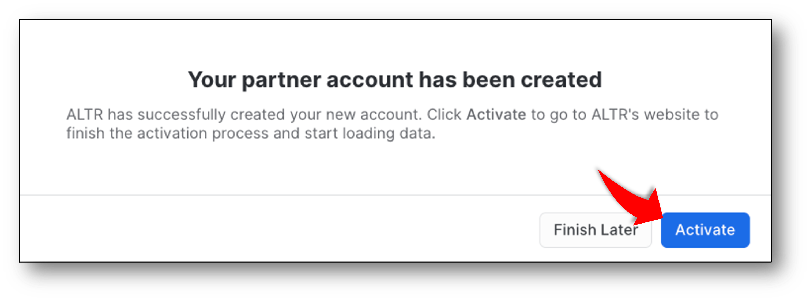
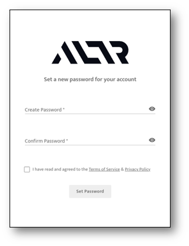
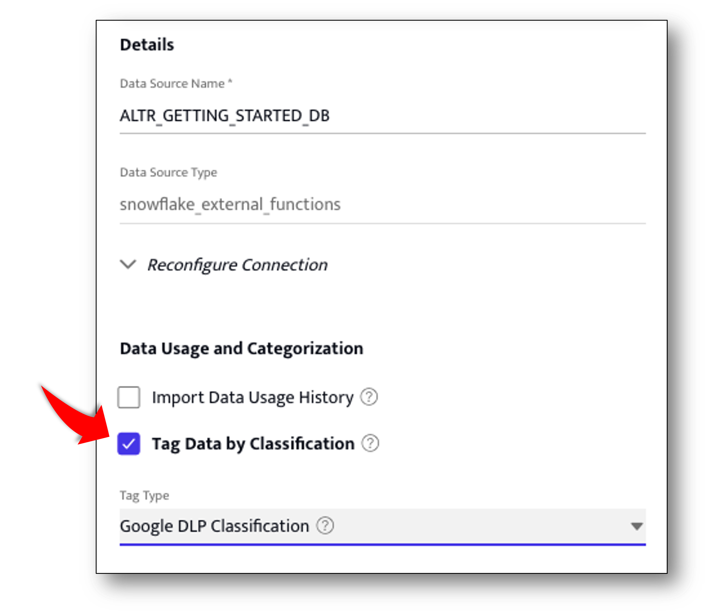
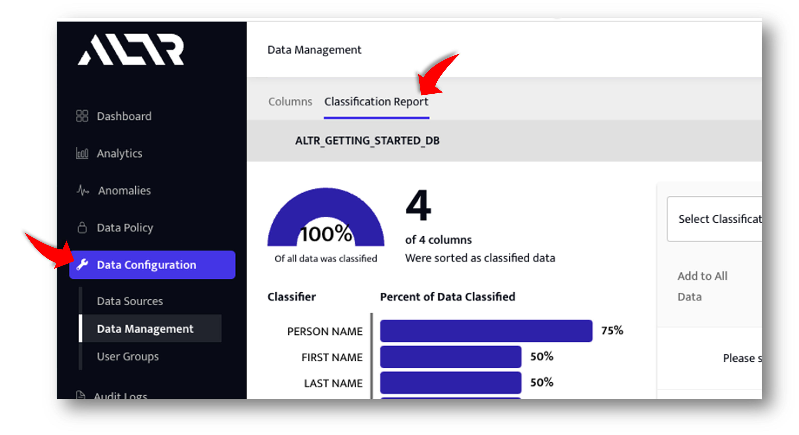
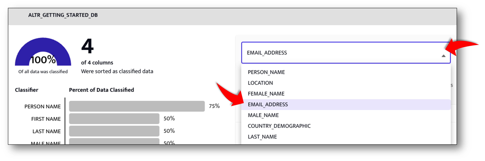
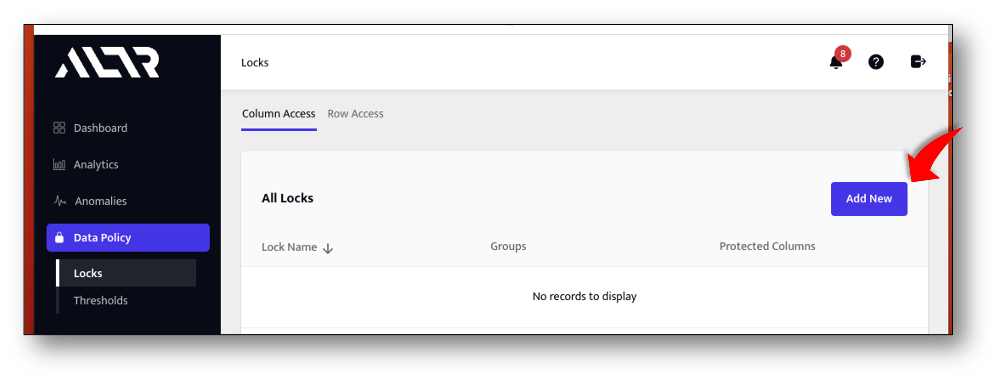
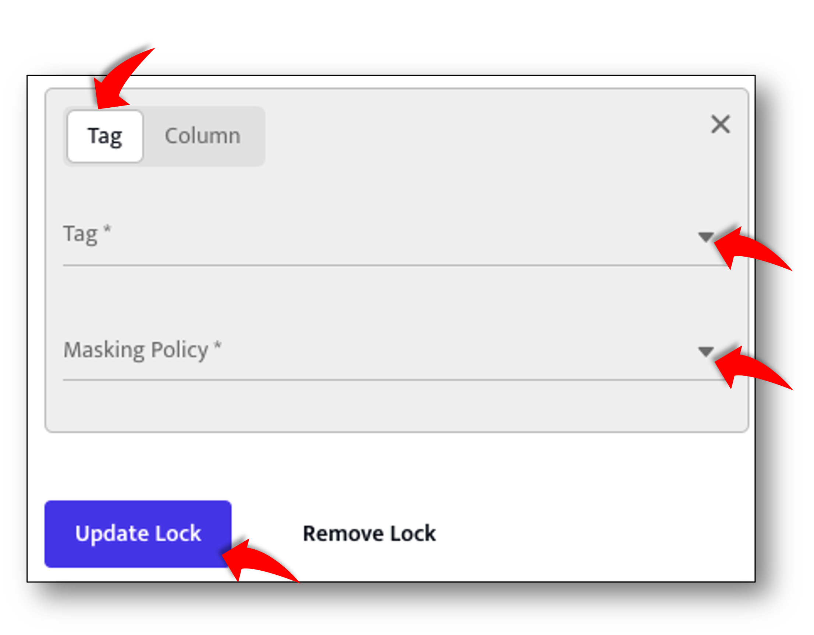

author: jeff ellerbee
id: altr_get_started
summary: ALTR Quickstart - Data Access Control. Connect ALTR to snowflake and create an automatically enforced role based data access policy.
categories: cybersecurity
environments: web
status: Published 
feedback link: https://github.com/Snowflake-Labs/sfguides/issues
tags: Getting Started, Data Steward, Data Owner, Data Security 

# ALTR Quickstart - Data Access Control

<!-- 1 ------------------------ -->
## ALTR Quickstart - Data Access Control  
Duration: 1

This Quick Start Guide is intended for Data Owners and Data Stewards or any other role responsible for securing sensitive data in your Snowflake data warehouses. Its purpose is to demonstrate how ALTR automates data governance.

### Prerequisites
- A Snowflake Enterprise Edition account (or higher). 
    - We recommend that you sign up for a free [Snowflake Trial](https://signup.snowflake.com)
- You need to be, or have access to, an ACCOUNTADMIN for your Snowflake instance. 


### What You’ll Learn 
- You will learn how to use ALTR to secure sensitive data in Snowflake with role based masking policies.

### What You’ll Build 
- A role based data access policy for Snowflake that is automatically enforced by ALTR.

<!-- 2 ------------------------ -->
## Create a sample database
Duration: 2

>aside positive
>**In This Step:** 
We are creating a sample database by copying a small amount of data from Snowflakes shared *SNOWFLAKE_SAMPLE_DATA* database. We will use this sample database in the rest of this Quickstart. 
>

### Create a sample database

- To create the sample database run the following SQL in a SQL worksheet: 

```sql
-- Use ACCOUNTADMIN role
USE ROLE ACCOUNTADMIN;

-- Create Sample Database
CREATE DATABASE ALTR_GETTING_STARTED_DB;

-- Set DB Context
USE DATABASE  ALTR_GETTING_STARTED_DB;

-- Populate Sample database from Snowflakes shared sample database. 
-- Usually named: SNOWFLAKE_SAMPLE_DATA
CREATE TABLE SAMPLE_CUSTOMER AS 
    SELECT 
        C_FIRST_NAME,
        C_LAST_NAME,
        C_EMAIL_ADDRESS,
        C_BIRTH_COUNTRY
    FROM SNOWFLAKE_SAMPLE_DATA.TPCDS_SF10TCL.CUSTOMER
    LIMIT 10000;
```

>aside negative
> **Note:** If you can't get access to Snowflake's built in sample data and you want to use your own data go for it! To match this guide we recommend creating a separate database using the name ALTR_GETTING_STARTED_DB.  Just populate it with fields from your own data set.  Be sure to include some columns that contain PII like email addresses, names, addresses, SSN's etc. 
>
<!-- 3 ------------------------ -->
## Setup a new ALTR account
Duration: 3

>aside positive
>**In This Step:** 
>We will create the ALTR account and connect it to Snowflake, all from within your browser. ALTR is a SaaS solution that integrates directly with Snowflake. There is no installation required on your premises. The process starts starts in Snowflake's Partner Connect portal
>

>aside negative
> **NOTE:** If you already have an ALTR account and want to use it instead of creating a new one then skip to Step 4 ***ALTR Setup for existing accounts*** 
>

### Create a new ALTR Account

- Log in to your Snowflake instance and go to the Partner Connect page. If you need help finding Partner connect open this link in a new tab: [Connecting with a Snowflake Partner](https://docs.snowflake.com/en/user-guide/ecosystem-partner-connect#connecting-with-a-snowflake-partner).
- Type "ALTR" in the search bar and then click on the "ALTR" card.

- Follow the prompts. When you see the screen above click the "Activate" button. This will take you out of Snowflake Partner connect and into the ALTR portal *Password Setting Screen*

### Set your ALTR Password and run ALTR Setup Wizard

- Enter your password
- Accept Terms and Conditions
- Click "Set Password" Button
- Follow the prompts in the ALTR Setup Wizard (there are multiple steps). 

>aside negative
> **NOTE:** When you get to the **choose a database to connect** prompt, you should see *ALTR_GETTING_STARTED_DB* in the list.  Choose it and then wait for the wizard to complete.
>
<!-- 4------------------------ -->
## ALTR Setup for existing accounts
Duration: 1

>aside positive
>**In This Step**
>Only perform this step if you plan to use an ALTR account that existed before running this quick start.  If you just created a new ALTR account in the previous step then skip to step 5 **Build Data Classification Report** 
>

### Log in to Snowflake and run the ALTR Stored Procedure
- Log in to the Snowflake instance that has already been associated with an ALTR account
- Create a new worksheet
- The stored procedure grants ALTR access to the newly created sample database
- Call the ALTR setup stored procedure as an ACCOUNTADMIN as follows
```sql
  CALL "PC_ALTR_DB"."PUBLIC"."SETUP_ALTR_SERVICE_ACCOUNT"(TRUE);
```

>aside negative
> **NOTE**: If the stored procedure runs but you get an error as a result then try calling it again with the parameter set to "FALSE" instead of TRUE as follows:
>
```sql
  CALL "PC_ALTR_DB"."PUBLIC"."SETUP_ALTR_SERVICE_ACCOUNT"(FALSE);
```
### Connect ALTR to Sample Database

>aside negative
> **NOTE**: If your current ALTR account is a free tier account you are limited to a single connected database.  You will need to disconnect the existing database from ALTR first in order to connect this quickstart's sample database.  Or, you can use the database you already have connected, just remember the column names may not match what is in this guide. 

- [Log in to your ALTR portal](https://altrnet.live.altr.com/api/auth/organization_login?uiredirect=true)
- Navigate to "Data Configuration -> Data Sources" 
- Click on the "Add New" button
- Fill in the required fields:
  - Data Source Name: A friendly name for the datasource, we recommend using the actual database name
  - Snowflake Host Name: url for snowflake account where this database resides.
  - Service Account ID: 'PC_ALTR_USER' if ALTR account created via Snowflake Partner Connect
  - Snowflake Database Name: Name given to the sample database (ALTR_GETTING_STARTED_DB)

>aside negative
> **NOTE:** If your ALTR account was not created via Snowflake Partner Connect try setting ALTR_SERVICE_USER as the Service Account ID.  One way to identify the Service Account ID: is to look at what value is set for other databases that are already connected to ALTR.  Click on a database that is already connected in the Data Sources page and then expand the "Reconfigure Connection" drop down in the detail pane to see the name of the Service Account ID field.
>

<!-- ------------------------ -->
## Build Data Classification Report
Duration: 1

>aside positive
>**In This Step**
>The preceding steps are one time setup required for ALTR.  Now that those tasks are complete we can start building our data access policy. The first task is to identify what data in our database contains sensitive information, what most people call *classification*. So in this step we will have ALTR generate a classification report sending a sample of data to Google DLP service to get classificaton results. 
>

### Start the data classification job
- In the ALTR portal navigate to Data Configuration -> Data Sources
- Open the settings panel for the *ALTR_GETTING_STARTED_DB* database by clicking on it in the list of databases
- Scroll down to *Data usage and classification* section of the settings panel and check the **Tag data by classification** checkbox

- Click the *Tag Type* drop down and choose *Google DLP Classification* 
- Click the *Update Button* to save the settings.  ALTR will start the classificaton process.  You will receive an email when the process is completed. Wait until the classificaton job is complete before moving on.  It should take only a few minutes.

### View the classification report
- Navigate to Data Configuration -> Data Management page.
- Click on the *Classification Report* tab.


>aside positive
>**Classification Report Explainer:** 
>- The classification job tags columns with the information type it believes are contained in the data column. We call these *classifier tags* 
>- A single column can be tagged with multiple *classifier tags* or none.  
>- The bar chart on the left lists the different types of *classifier tags*, and the percentage of columns in the database that have the tag.
>- You can click on a single *classifier tag's* bar on the left and the chart on the right will update to list all the columns that have that *classifier tag*.
>- Clicking the *Add Data* button next to a column will start ALTR *following* the column.  That means ALTR gets placed in the "Query Stream" of any query that references that column (Including Views)
>- [Get more information on data classification in ALTR](https://docs.altr.com/explore-altr-features/classification)

### Tell ALTR to start "Following" the C_EMAIL_ADDRESS column 
- Choose *EMAIL_ADDRESS* from the dropdown on the right hand side of the classification report. 

- Click the *Add Data* button for the *C_EMAIL_ADDRESS* column to have ALTR follow this column. 

<!-- ------------------------ -->
## Define Role Based Data Access Policy
Duration: 2

>aside positive
>**In This Step**
>We will build role based data access policies for EMAIL addresses from within the ALTR portal using ALTR *Locks*.  
>

### Create a policy defining what Snowflake roles will view email addresses unmasked
- Navigate to Data Policy -> Locks page in ALTR portal
- Click the *Add New* button and fill in the form as follows:
  - For the lock name enter *Email Unmasked*
  - Click the User Groups dropdown and check *SECURITYADMIN*
  
  - Under the Policy Section there should be an empty tag/column form.  Fill it in as follows:
    - Click the *Tag* tab (not the *Column* tab)
    - Select *EMAIL_ADDRESS* from the Tag dropdown
    - Select *No Mask* from the Masking Policy dropdown
- Click the *Update Lock* button to save this lock. 


>aside positive
>**Lock Explainer**
>- Congrats you just defined your first policy!
>- This lock defines the policy that will display *EMAIL_ADDRESS* values without any masking so long as the user querying snowflake is using the *SECURITYADMIN* role.  
>- This lock will not be applied to any other role because only *SECURITYADMIN* is selected in it.
>- Any user querying for *EMAIL_ADDRESS* under any other snowflake role will get the masking type configured for locks applicable to that role.
>- If a user is operating under a role where there is no applicable Lock then that user will get null's back for *EMAIL_ADDRESS*
>- [Get more information on using ALTR Locks](https://docs.altr.com/explore-altr-features/locks)


### Create a policy defining which Snowflake roles will view email addresses partially masked
- on the same Locks page click the *Add New* button and fill in the form as follows:
  - For the lock name enter *Email Partially Masked*
  - Click the User Groups dropdown and check *SYSADMIN* and *ACCOUNTADMIN*
- Under the Policy Section there should be an empty tag/column form.  Fill it in as follows:
  - Click the *Tag* tab (not the *Column* tab)
  - Select *EMAIL_ADDRESS* from the Tag dropdown
  - Select *Email Mask* from the Masking Policy dropdown
- Click the *Update Lock* button to save this lock. 


### Create a policy defining which Snowflake roles will view email addresses fully masked
- on the same Locks page click the *Add New* button and fill in the form as follows:
  - For the lock name enter *Email Fully Masked*
  - Click the User Groups dropdown and check *PUBLIC*
- Under the Policy Section there should be an empty tag/column form.  Fill it in as follows:
  - Click the *Tag* tab (not the *Column* tab)
  - Select *EMAIL_ADDRESS* from the Tag dropdown
  - Select *Email Mask* from the Masking Policy dropdown
- Click the *Update Lock* button to save this lock. 


<!-- ------------------------ -->
## Test Policy in Snowflake

### Copy test SQL into a new worksheet.
Copy the SQL code below into a new worksheet.  This sheet has commands and queries we will use to test the policies you just created.  The first section grants access to the sample database for the *SYSADMIN*, *SECURITYADMIN*, and *PUBLIC* roles.  The next section is a series of tests that show ALTR enforcing policy based on a users Snowflake role.

```sql
--
-- Grant access to the sample database to our test roles:
--
use database ALTR_GETTING_STARTED_DB;
use role accountadmin;

grant select on table SAMPLE_CUSTOMER to role SECURITYADMIN;
grant usage on database ALTR_GETTING_STARTED_DB to role SECURITYADMIN;
grant usage on schema PUBLIC to role SECURITYADMIN;
grant usage on warehouse COMPUTE_WH to role SECURITYADMIN;

grant select on table SAMPLE_CUSTOMER to role SYSADMIN;
grant usage on database ALTR_GETTING_STARTED_DB to role SYSADMIN;
grant usage on schema PUBLIC to role SYSADMIN;
grant usage on warehouse COMPUTE_WH to role SYSADMIN;

grant select on table SAMPLE_CUSTOMER to role PUBLIC;
grant usage on database ALTR_GETTING_STARTED_DB to role PUBLIC;
grant usage on schema PUBLIC to role PUBLIC;
grant usage on warehouse COMPUTE_WH to role PUBLIC;

-- warehouse
use COMPUTE_WH;

-- *** END OF GRANT ACCESS section ***


--
-- ALTR Policy Tests:
--

-- SECURITYADMIN gets to see emails with no masking at all:
use role SECURITYADMIN;
select * from SAMPLE_CUSTOMER;

-- SYSADMIN and ACCOUNT admin domain portion of emails only, email name portion is masked 
use role SYSADMIN;
select from SAMPLE_CUSTOMER;

use role ACCOUNTADMIN;
select from SAMPLE_CUSTOMER;

-- PUBLIC sees emails fully masked
use role PUBLIC;
select * from SAMPLE_CUSTOMER;

-- Now go into the ALTR portal and make the following changes 
-- 1. remove the PUBLIC role from the fully masked lock,
-- 2. add the PUBLIC role to the partially masked lock.

-- Run query as PUBLIC role again and observe that moving the role into the 
-- partially masked lock instantly updates access for that role

use role PUBLIC;
select * from SAMPLE_CUSTOMER;

-- See what happens when a role is not associated with any policy.  Do this by going
-- into the ALTR portal and unselecting the PUBLIC role from the partially masked lock.  
-- Make sure that the PUBLIC role is not a part of any other lock.
-- 

use role PUBLIC;
select * from SAMPLE_CUSTOMER;
```

### Run the Grant Portion of SQL
- In the worksheet you created above hilight the commands from the top through to the comment labeled: -- *** END OF GRANT ACCESS section ***  This will grant access to the sample database for our test roles.

### Run the policy tests
- There are six pairs of test commands.  The first command to set the correct role and then the query.  
- Run each policy test query one at a time and check that the results are what is expected. We've put comments in front of each pair to remind you what we configured in the policy.


<!-- ------------------------ -->
## Conclusion
Duration: 1

### What we covered:
- How to set up a Free ALTR Account and connect it to a Snowflake Database
- Generating and Using ALTR's integrated classification report to identify sensitive data.
- Creating automatically enforced, role based, data access policy for sensitive data
- Tested ALTR's role based data access enforcement live by querying from Snowflakes Snowsight user interface.

### Ideas for exploring futher:
- Use any client or method to connect to Snowflake and query the sample database we just protected with ALTR.  You will see that ALTR enforces your policy in the same way no matter how the data is accessed.  From Snowflakes web ui, through any connector, driver or Method Snowflake supports (Go, Python, JDBC, REST API, Snowpark, .NET, Node.js, ODBC etc... )

- 
### Getting Help:
- If you need help on this or another Quickstart email us at support@altr.com (put 'quickstart help' in the subject line please) and somebody will reach out to you.


