author: Piotr Paczewski, Lucas Galan
language: en
id: analytical-search-over-sec-filings-with-snowflake-cowork
summary: Build an analytical search agent that answers counting, listing, and trend questions over thousands of SEC filings — going far beyond what traditional RAG can do.
categories: snowflake-site:taxonomy/solution-center/certification/quickstart, snowflake-site:taxonomy/product/ai, snowflake-site:taxonomy/snowflake-feature/cortex-search
environments: web
status: Published
feedback link: https://github.com/Snowflake-Labs/sfguides/issues
fork repo link: https://github.com/Snowflake-Labs/sfquickstarts/tree/main/site/sfguides/src/analytical-search-over-sec-filings-with-snowflake-cowork

# Analytical Search over SEC Filings with Snowflake CoWork
<!-- ------------------------ -->

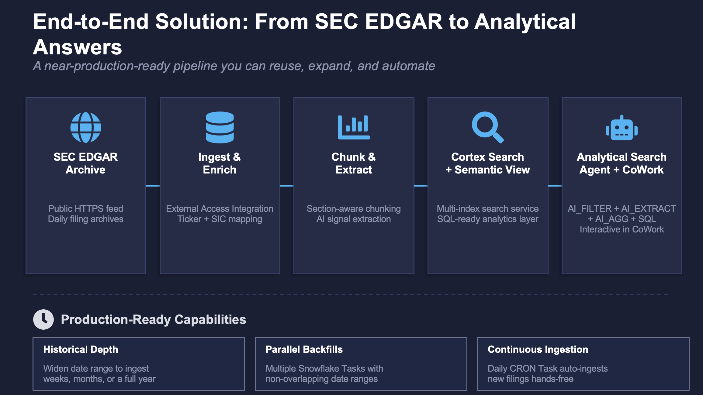

## Overview

**Answer analytical questions  over thousands of unstructured SEC filings using Cortex Agents with Analytical Search.**

Traditional RAG retrieves 10–50 passages and asks an LLM to summarize. That works for single-document lookups, but fails on questions that require processing hundreds of filings: "How many companies disclosed a cybersecurity incident?" or "List every M&A deal filed this week." Analytical Search solves this by combining semantic search, AI functions, and SQL into one orchestrated loop.

In this quickstart you will ingest SEC EDGAR filings directly from the SEC's public EDGAR archive using Snowflake's External Access Integration. A stored procedure fetches daily filing archives over HTTPS, parses metadata and document content, enriches filings with stock tickers and industry classification, chunks them into searchable passages, and extracts structured AI signals. 

You will then build a multi-index Cortex Search service, create a Semantic View for structured analytics, and deploy an Analytical Search agent in Snowflake CoWork — then ask it questions that no standard RAG system can answer. The result is a near-production-ready, end-to-end solution that you can easily reuse: expand the date range for historical depth, schedule ongoing ingestion with Snowflake Tasks, and the agent grows with the data automatically.

### What You'll Learn

-   Why traditional RAG breaks on analytical questions (top-k ceiling, no compute, no filters)
-   How Analytical Search combines Cortex Search with AI_FILTER, AI_EXTRACT, and AI_AGG
-   How auto-routing keeps simple questions cheap while powering analytical ones
-   How adaptive depth retrieves exactly as much data as the question requires

### What You'll Build

-   A **Data Pipeline** that ingests, enriches, chunks, and extracts signals from SEC EDGAR filings
-   A **Cortex Search service** with text + vector indexes over 3,400+ filing chunks
-   A **Semantic View** for structured analytics (counts, sentiment breakdowns, sector comparisons)
-   An **Analytical Search agent** wired to all Cortex Search and Semantic View tools, registered in Snowflake CoWork
-   Validated analytical queries demonstrating counting, listing, hybrid, and auto-routing capabilities

### What You'll Need

-   Snowflake account with `ACCOUNTADMIN` role
-   Cortex enabled in you Snowflake account 

### Source Code

All SQL files are available in the [source code repository](https://github.com/Snowflake-Labs/sfquickstarts/tree/main/site/sfguides/src/analytical-search-over-sec-filings-with-snowflake-cowork/sql):

| File | Purpose |
|------|---------|
| `sql/00_env_setup.sql` | Environment setup |
| `sql/01_pipeline.sql` | Full ingestion, enrichment, chunking, and signal extraction pipeline |
| `sql/02_create_search_service.sql` | Multi-index Cortex Search service |
| `sql/03_create_semantic_view.sql` | Semantic View for Cortex Analyst |
| `sql/04_deploy_agent.sql` | Agent deployment + CoWork registration |
| `sql/99_teardown.sql` | Full cleanup |

<!-- ------------------------ -->
## Why RAG Falls Short

Standard RAG has three fundamental limitations that make it unsuitable for analytical work over large document collections:

### Top-K Ceiling

RAG retrieves just 10–50 results to fit in the LLM context window. Extending beyond this typically reduces accuracy and increases cost. You cannot count 36 leadership changes by looking at 5 examples.

### Semantic Only

No structural filters over attributes such as date, status, or region. "Contextual chunking" can help, but doesn't allow for targeted search queries with precise date ranges or category filters.

### No Compute
Counts and sums are mostly hallucinated, not calculated. The LLM's worldview is limited to the handful of passages in its context — it estimates rather than computes.

### Why Agentic Search Isn't Enough Either

A natural evolution from standard RAG is **agentic search**: an AI agent searches, reads, reasons, reformulates its query, and searches again in a loop. By decomposing a problem and chasing missing evidence across multiple turns, agentic search drastically improves recall for complex document QA.

But at its core, agentic search is still **search-and-summarize in a reasoning loop**. The agent takes more turns to find better evidence, yet the final answer is still synthesized from a relatively small, sampled evidence set. It cannot perform true macro-analysis — there is no grouping, counting, or SQL-level aggregation happening. Ask it "how many filings mention cybersecurity risks?" and it will find more examples than basic RAG, but it still cannot give you a precise count because it never processes the full result set computationally.

The evolution looks like this:

| Stage | Approach | Limitation |
|-------|----------|-----------|
| **Standard RAG** | Retrieve top-k, summarize | Misses the long tail; no compute |
| **Agentic Search** | Loop: search → read → reformulate → search again | Better recall, but still sampling — no true aggregation |
| **Analytical Search** | Retrieve adaptively + compute with AI functions + SQL | Treats documents as a table: filter, aggregate, count, compare |

### Why Bigger Context Windows Don't Solve This

A popular argument says RAG is dead because LLMs can now ingest a million tokens — so just load the documents and let the model reason end-to-end. This solves the context window constraint, but it doesn't give the model a database.

Loading thousands of documents into a single prompt fails for three reasons:

1. **Cost** — It is orders of magnitude more expensive than targeted retrieval followed by focused computation.
2. **No auditable trace** — The model produces a final answer with no inspectable execution path. You cannot verify what was searched, filtered, counted, or excluded.
3. **No SQL-level precision** — LLMs estimate; they don't compute. Grouping, counting, ranking, and calculating deltas require an actual execution engine, not a language model approximating arithmetic over raw text.

Analytical Search takes the opposite approach: use retrieval to prune, then hand off to AI functions and SQL for precise computation — getting both scalability and rigor.

### Why Coding Agents Fall Short

Coding agents offer another alternative: grep through documents as local files, load matches into the agent's context, and write code to reason over the results. This is a strong agentic baseline — the agent can improvise an analytical loop (search, parse, aggregate) on every question and partially succeed.

However, coding agents don't scale once questions demand corpus-wide aggregation. On analytical benchmarks, they trail Analytical Search by 10–45% because:

- They lack adaptive depth — they either over-fetch (expensive) or under-fetch (incomplete)
- They have no built-in semantic operators (AI_FILTER, AI_EXTRACT) optimized for document-level classification
- Each question requires re-inventing the analytical workflow from scratch rather than executing a systematic, optimized pipeline

A system designed around the analytical loop — with retrieval, semantic classification, and SQL as first-class stages — does the work more reliably and at lower cost than ad-hoc coding for each question.

### Query Types That Break Traditional RAG

High-value enterprise queries requiring exhaustiveness, aggregates, or temporal analysis:

| Query Type | Example | Why RAG Fails |
|------------|---------|---------------|
| **List queries with multi-aspect filters** | "List all companies that disclosed a cybersecurity incident this month" | Top-k misses the long tail |
| **Aggregates** | "What percentage of filings mention supply chain risk in Finance vs Technology?" | Cannot count from a sample |
| **Temporal queries** | "What new risk themes emerged this quarter compared to last?" | No date filtering, no comparison logic |

### Traditional RAG vs Analytical Search

Consider the question: *"How many filings filed on Feb 3, 2025 mention cybersecurity risks?"*

**Traditional RAG approach:**
1. One search query with limit=10: `search("cybersecurity risks")`
2. Feeds 10 results back to the LLM to summarize

> Answer: "Based on the provided documents, several companies mention cybersecurity risks, including Boeing and GE. However, there may be more that were not analyzed."

→ Imprecise answer based on a sample. No actual count.

**Analytical Search approach:**
1. Structured search
2. AI_FILTER to classify which chunks discuss *actual* cybersecurity risks (not generic boilerplate)
3. COUNT(DISTINCT ACCESSION_NO) over the filtered table

> Answer: "5 filings filed on Feb 3, 2025 mention substantive cybersecurity risks. The companies are: [complete list with citations]."

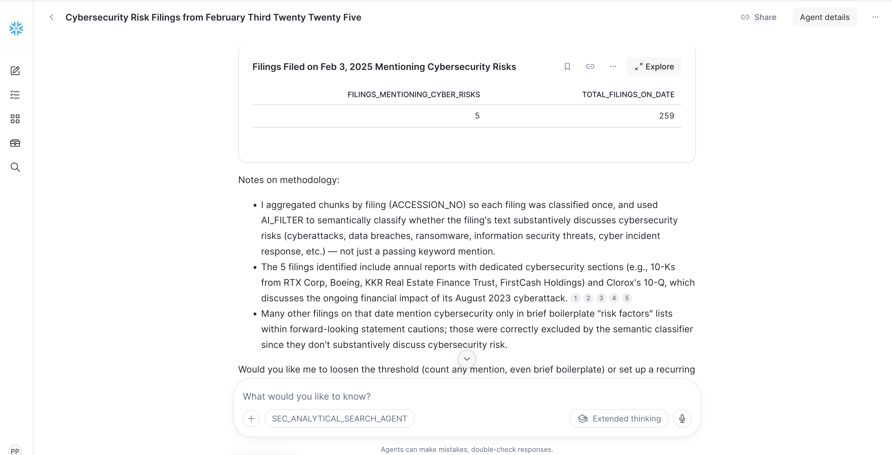

→ Quantitative, exhaustive answer with precise filtering and SQL-level computation.

<!-- ------------------------ -->
## How Analytical Search Works

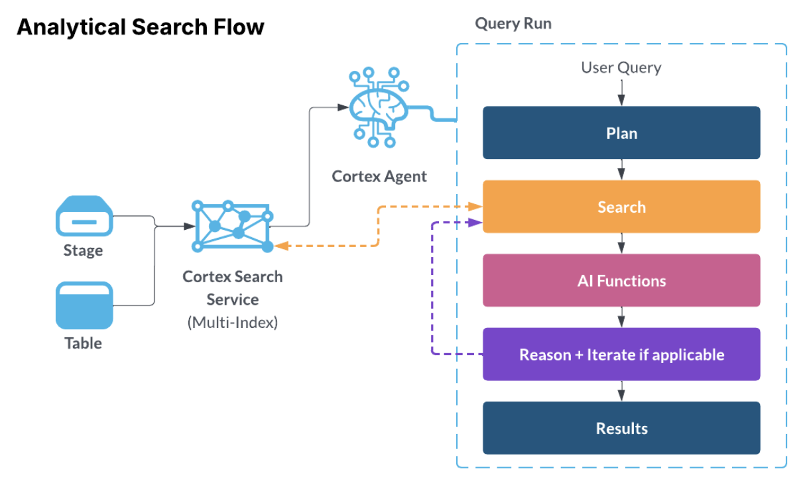

Analytical Search is an orchestration capability in Cortex Agents that enables analytical queries over large document collections. It operates in two layers:

### Layer 1: Search to Prune

Cortex Search narrows the full corpus to a relevant candidate set — finding documents about a specific topic, isolating records with a particular attribute, or filtering to a date range. This happens without scanning every document with a large model.

**Adaptive depth** controls how far to search. Rather than using a fixed top-k limit, the agent dynamically adjusts search depth based on the relevance of results. A fixed top-k gets two things wrong: too shallow (the missing item is often the data point that changes the answer), or too deep (the user asks for k=1,000 but only a few dozen documents are relevant — the rest is wasted compute).

Adaptive depth makes the cutoff a function of the data, not a guessed parameter, and works in two phases:

**Phase 1 — Bound the relevant region.** The system fetches an initial batch of results and uses a fast LLM to judge small samples at the head and tail of the ranked list. If the tail is still relevant, the system extends the fetch limit and rejudges the new tail — repeating until the tail goes off-topic or a hard ceiling is reached. If even the top results are irrelevant, the search returns nothing rather than feed AI functions material that would only generate noise.

**Phase 2 — Find the exact cutoff.** Once the relevant region is bounded, the system binary-searches inside it, LLM-judging a sample around the midpoint and tightening the window to land on the precise boundary in a handful of rounds.

The result: a narrow fact question stays shallow; a trend across a broad corpus goes deep; a question against a sparse corpus stops early — all without any parameter tuning.

> **Cost note:** Adaptive depth optimizes spend in both directions. Better coverage reduces wasted downstream AI function calls that would produce wrong answers. Better restraint avoids paying to extract and classify documents that would not have answered the question in the first place. AI functions are powerful but not free — every unnecessary call adds latency and dollars. Adaptive depth is the layer that decides how many of those calls are worth making.

### Layer 2: AI Functions and SQL to Analyze

Once the corpus is pruned, the agent applies semantic operators directly on the result set:

| Function | What It Does | Example |
|----------|-------------|---------|
| **AI_FILTER** | Semantic yes/no classification per row | "Is this about an actual cybersecurity incident (not generic risk boilerplate)?" |
| **AI_EXTRACT** | Pull structured fields from unstructured text | Extract person name, role, and whether it's a departure or appointment |
| **AI_AGG** | Deduplicate, cluster, and summarize across rows | Collapse 200 risk phrases into top-10 categories with counts |
| **SQL** | Group, count, join, rank, trend, calculate | COUNT BY sector, percentage breakdowns, temporal comparisons |

### Auto-Routing

The agent classifies query intent at runtime:
- **Simple, single-passage questions** → standard RAG path (no persist, no AI functions, low cost)
- **Corpus-wide analytical questions** → full Analytical Search loop

You don't need to specify which mode to use. The agent decides automatically.

### Planning Mode

Before executing analytical queries, the agent generates a clear execution plan and presents it for review. This lets you verify the logical steps before any data is processed. Example of an execution planned proposed for a review below.

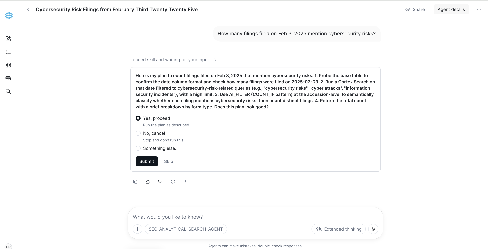

<!-- ------------------------ -->
## Environment Setup

> **File:** `sql/00_env_setup.sql`

Open a SQL file in Snowflake Workspace and run the following to create the infrastructure:

```sql
USE ROLE ACCOUNTADMIN;

-- Configuration — edit these values
SET config_database   = 'SEC_FILINGS';
SET config_schema     = 'FILING_DATA';
SET config_warehouse  = 'FILING_WH';
SET config_user_agent = 'YourOrg SEC-Filing-Demo your_name@company.com';
SET config_start_date = '2025-02-03';  -- single day for quickstart
SET config_end_date   = '2025-02-03';

-- Create database and schema
CREATE DATABASE IF NOT EXISTS IDENTIFIER($config_database);
USE DATABASE IDENTIFIER($config_database);
CREATE SCHEMA IF NOT EXISTS IDENTIFIER($config_schema);
USE SCHEMA IDENTIFIER($config_schema);

-- Create a dedicated warehouse
CREATE WAREHOUSE IF NOT EXISTS IDENTIFIER($config_warehouse)
    WAREHOUSE_SIZE = 'SMALL'
    AUTO_SUSPEND = 60
    AUTO_RESUME = TRUE
    INITIALLY_SUSPENDED = TRUE
    COMMENT = 'SEC pipeline: dynamically resized by RUN_PIPELINE()';
USE WAREHOUSE IDENTIFIER($config_warehouse);

-- Network access for SEC EDGAR
CREATE OR REPLACE NETWORK RULE SEC_EDGAR_NETWORK_RULE
    MODE = EGRESS
    TYPE = HOST_PORT
    VALUE_LIST = ('www.sec.gov:443', 'data.sec.gov:443', 'efts.sec.gov:443');

CREATE OR REPLACE EXTERNAL ACCESS INTEGRATION SEC_EDGAR_EAI
    ALLOWED_NETWORK_RULES = (SEC_EDGAR_NETWORK_RULE)
    ENABLED = TRUE;
```

> **NOTE:** SEC EDGAR requires a valid `User-Agent` header with your organization name and contact email. Edit `config_user_agent` above — this value is passed as a parameter to `RUN_PIPELINE()`, which forwards it to all HTTP calls. You only need to set it in this one place. See [SEC EDGAR access policies](https://www.sec.gov/os/accessing-edgar-data) for details.

<!-- ------------------------ -->
## Build the Data Pipeline

> **File:** `sql/01_pipeline.sql`

The data pipeline ingests SEC EDGAR filings, enriches them with tickers and industry classification, chunks them for search, and extracts AI signals.

### Core Tables

The pipeline creates four main tables:

| Table | Purpose | Key Columns |
|-------|---------|-------------|
| `FILING_INDEX` | Filing metadata registry | ACCESSION_NO, CIK, COMPANY_NAME, FORM_TYPE, FILED_AT, TICKER, INDUSTRY_SECTOR |
| `FILING_CONTENT` | Raw filing text | ACCESSION_NO, CONTENT_TEXT, PARSE_STATUS, SIGNAL_STATUS |
| `FILING_CHUNKS` | Searchable passages | CHUNK_ID, CHUNK_TEXT, SECTION_NAME, ~800 chars avg |
| `FILING_SIGNALS` | AI-extracted structured signals | SIGNAL_ID, EVENT_TYPE, SENTIMENT, REVENUE, KEY_METRICS |

### Running the Pipeline

Execute the entire `sql/01_pipeline.sql` file in Snowflake workspace. 

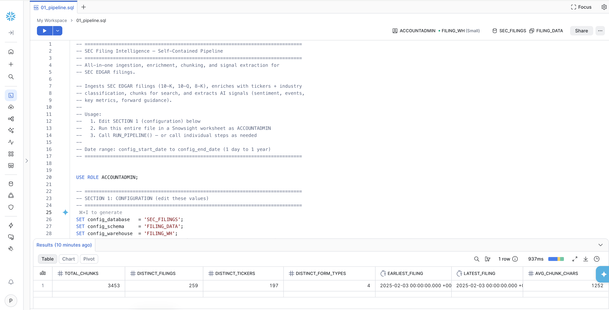

```sql
-- The last command in the script calls the pipeline:
CALL RUN_PIPELINE('2025-02-03', '2025-02-03', 'YourOrg SEC-Filing-Demo your_name@company.com');
```

The pipeline executes four phases automatically:

| Phase | What It Does | Warehouse Size |
|-------|-------------|---------------|
| 1. Ingest | Downloads daily EDGAR archives, parses filing metadata and content | LARGE (SNOWPARK-OPTIMIZED) |
| 2. Enrich | Resolves stock tickers via SEC company search, maps SIC codes to industry sectors | SMALL |
| 3. Chunk | Splits filings into searchable passages by section (Risk Factors, MD&A, Financial Statements, etc.) | SMALL |
| 4. Extract | AI extracts structured signals: sentiment, event type, key metrics, forward guidance | SMALL |

> **NOTE:** The pipeline dynamically resizes the warehouse between phases. **Total runtime for a single day: ~3-5 minutes**.

> **Scaling Beyond One Day**
>
> This quickstart ingests a single day for speed (~3-5 minutes). To load more historical data, simply widen `config_start_date` and `config_end_date` in `00_env_setup.sql` — the pipeline handles any date range up to a full year (runtime scales at ~3-5 minutes per business day). For large backfills (e.g., a full year), you can parallelize by creating multiple Snowflake Tasks that each call `RUN_PIPELINE()` with non-overlapping monthly date ranges (e.g., Jan, Feb, Mar…), allowing months to process concurrently.
>
> For continuous automated ingestion, schedule a single Snowflake Task with a daily CRON to call `RUN_PIPELINE()` for the current day — new filings flow into the Cortex Search service and Semantic View automatically with no manual intervention.

### Verify the Pipeline Output

```sql
-- Check corpus statistics
SELECT
    COUNT(*)                       AS total_chunks,
    COUNT(DISTINCT ACCESSION_NO)   AS distinct_filings,
    COUNT(DISTINCT TICKER)         AS distinct_tickers,
    COUNT(DISTINCT FORM_TYPE)      AS distinct_form_types,
    MIN(FILED_AT)                  AS earliest_filing,
    MAX(FILED_AT)                  AS latest_filing,
    AVG(LENGTH(CHUNK_TEXT))::INT   AS avg_chunk_chars
FROM FILING_CHUNKS
WHERE CHUNK_TEXT IS NOT NULL;
```

Expected output for Feb 3, 2025:

| Metric | Value |
|--------|-------|
| Total chunks | ~3,453 |
| Distinct filings | ~259 |
| Distinct tickers | ~197 |
| Form types | 10-K, 10-Q, 8-K, 8-K/A |
| Avg chunk chars | ~1,250 |

<!-- ------------------------ -->
## Create the Cortex Search Service

> **File:** `sql/02_create_search_service.sql`

> **NOTE:** If you already have a Cortex Search service, you can reuse it; you don’t need to create a new service specifically for analytical search. If your agent already has a Cortex Search tool configured, you don’t need to add another one.

### Create the Service
In this example we will be creating Cortex Search service from scratch.

```sql
USE ROLE ACCOUNTADMIN;
USE WAREHOUSE FILING_WH;

CREATE OR REPLACE CORTEX SEARCH SERVICE SEC_FILINGS.FILING_DATA.SEC_FILING_SEARCH
    TEXT INDEXES CHUNK_TEXT, CHUNK_ID, ACCESSION_NO, SECTION_NAME, COMPANY_NAME
    VECTOR INDEXES CHUNK_TEXT (model='snowflake-arctic-embed-l-v2.0')
    ATTRIBUTES COMPANY_NAME, TICKER, FORM_TYPE, SECTION_NAME, FILED_AT,
               PERIOD_OF_REPORT, INDUSTRY_SECTOR, INDUSTRY_TITLE, CHUNK_ID, ACCESSION_NO
    WAREHOUSE = FILING_WH
    TARGET_LAG = '1 day'
    COMMENT = 'SEC filing search - multi-index with text and vector'
AS (
    SELECT
        CHUNK_ID, CHUNK_TEXT, ACCESSION_NO, COMPANY_NAME, TICKER, FORM_TYPE,
        SECTION_NAME,
        TO_VARCHAR(FILED_AT, 'YYYY-MM-DD') AS FILED_AT,
        TO_VARCHAR(PERIOD_OF_REPORT, 'YYYY-MM-DD') AS PERIOD_OF_REPORT,
        COALESCE(INDUSTRY_SECTOR, 'Other') AS INDUSTRY_SECTOR,
        INDUSTRY_TITLE
    FROM SEC_FILINGS.FILING_DATA.FILING_CHUNKS
    WHERE CHUNK_TEXT IS NOT NULL AND LENGTH(CHUNK_TEXT) > 100
);
```

### Why Each Design Choice Matters for Analytical Search

| Config Element | Why It Matters |
|---------------|----------------|
| `TEXT INDEXES` on 5 columns | Enables keyword search on content, company names, section names — the agent searches on meaning AND exact names |
| `VECTOR INDEXES` with Arctic embed | Semantic similarity — "cybersecurity risks" matches "unauthorized access to our systems" even with no keyword overlap. `snowflake-arctic-embed-l-v2.0` is the recommended model for analytical search |
| `ATTRIBUTES` (10 columns) | Become **filterable** and **returnable** in search results. The agent can filter by `FORM_TYPE='10-K'` or `INDUSTRY_SECTOR='Finance'` server-side |
| `TARGET_LAG = '1 day'` | Refresh frequency. For a demo corpus that doesn't change, this is sufficient |

> **NOTE:** The search service indexes ~3,283 of the 3,453 total chunks. The `WHERE LENGTH(CHUNK_TEXT) > 100` filter excludes very short chunks (section headers, boilerplate) that would add noise to search results.

<!-- ------------------------ -->
## Create the Semantic View

> **File:** `sql/03_create_semantic_view.sql`

The Semantic View is required for Cortex Analyst tool execution. It allows the agent to answer counting and aggregation questions with SQL precision.

### Create the Semantic View

```sql
USE ROLE ACCOUNTADMIN;
USE DATABASE SEC_FILINGS;
USE SCHEMA FILING_DATA;
USE WAREHOUSE FILING_WH;

CREATE OR REPLACE SEMANTIC VIEW SEC_FILING_ANALYTICS
  TABLES (
    signals AS FILING_SIGNALS
      PRIMARY KEY (SIGNAL_ID)
      WITH SYNONYMS = ('investment signals', 'filing signals', 'EDGAR signals', 'SEC filings')
      COMMENT = 'AI-extracted investment signals from SEC EDGAR filings.',
    meta AS FILING_INDEX
      PRIMARY KEY (ACCESSION_NO)
      WITH SYNONYMS = ('filing metadata', 'EDGAR index', 'filing registry')
      COMMENT = 'SEC EDGAR filing metadata: accession numbers, CIKs, filing URLs, dates'
  )
  RELATIONSHIPS (
    signals_to_meta AS signals(ACCESSION_NO) REFERENCES meta(ACCESSION_NO)
  )
  FACTS (
    signals.accession_no AS signals.ACCESSION_NO
      WITH SYNONYMS = ('accession number', 'filing id')
      COMMENT = 'EDGAR accession number uniquely identifying the filing',
    signals.revenue AS signals.REVENUE
      WITH SYNONYMS = ('total revenue', 'sales', 'top line')
      COMMENT = 'Revenue in millions USD. NULL if not extractable.',
    signals.net_income AS signals.NET_INCOME
      WITH SYNONYMS = ('net income', 'profit', 'bottom line')
      COMMENT = 'Net income figure extracted from filing.',
    signals.eps AS signals.EPS
      WITH SYNONYMS = ('earnings per share', 'diluted EPS')
      COMMENT = 'Normalized EPS value.',
    signals.yoy_change AS signals.YOY_CHANGE
      WITH SYNONYMS = ('year over year', 'YoY growth', 'growth rate')
      COMMENT = 'Year-over-year change percentage.',
    signals.forward_guidance AS signals.FORWARD_GUIDANCE
      WITH SYNONYMS = ('guidance', 'outlook', 'forecast')
      COMMENT = 'Forward-looking financial guidance from MD&A.'
  )
  DIMENSIONS (
    signals.company_name AS signals.COMPANY_NAME
      WITH SYNONYMS = ('company', 'filer', 'issuer')
      COMMENT = 'Company that filed the SEC document',
    signals.ticker AS signals.TICKER
      WITH SYNONYMS = ('stock ticker', 'symbol')
      COMMENT = 'Stock ticker symbol. May be NULL for non-public filers.',
    signals.form_type AS signals.FORM_TYPE
      WITH SYNONYMS = ('filing type', 'SEC form')
      COMMENT = '10-K (annual), 10-Q (quarterly), 8-K (current report)',
    signals.event_type AS COALESCE(signals.EVENT_TYPE_NORMALIZED, signals.EVENT_TYPE)
      WITH SYNONYMS = ('event', 'signal type', 'event classification')
      COMMENT = 'AI-classified event type: Earnings, M&A, Leadership Change, Risk Disclosure, Guidance Update, Regulatory, Capital Markets, Bankruptcy, Annual Report, Quarterly Report, Current Report, Other.',
    signals.sentiment AS signals.SENTIMENT
      WITH SYNONYMS = ('tone', 'filing sentiment')
      COMMENT = 'AI-assessed sentiment: POSITIVE, NEGATIVE, NEUTRAL, MIXED.',
    signals.industry_sector AS COALESCE(signals.INDUSTRY_SECTOR, 'Other')
      WITH SYNONYMS = ('sector', 'industry')
      COMMENT = 'SEC Office-based industry sector: Technology, Life Sciences, Finance, Real Estate & Construction, Energy & Transportation, Manufacturing, Trade & Services, Other.',
    signals.industry_title AS signals.INDUSTRY_TITLE
      WITH SYNONYMS = ('specific industry', 'sub-sector')
      COMMENT = 'Specific SEC industry title.',
    signals.is_amendment AS signals.IS_AMENDMENT
      WITH SYNONYMS = ('amendment', 'restated')
      COMMENT = 'TRUE if this is an amended filing.',
    meta.cik AS meta.CIK
      WITH SYNONYMS = ('SEC CIK', 'central index key')
      COMMENT = 'SEC Central Index Key',
    signals.signal_date AS signals.SIGNAL_DATE
      WITH SYNONYMS = ('filing date', 'date filed', 'when filed')
      COMMENT = 'The date the SEC received the filing.',
    signals.period_of_report AS signals.PERIOD_OF_REPORT
      WITH SYNONYMS = ('fiscal period', 'report period', 'period end')
      COMMENT = 'Fiscal period end date the filing covers.'
  )
  METRICS (
    signals.filing_count AS COUNT(signals.SIGNAL_ID)
      WITH SYNONYMS = ('number of filings', 'total filings', 'how many filings')
      COMMENT = 'Total number of filings matching filters',
    signals.positive_signals AS COUNT(CASE WHEN signals.SENTIMENT = 'POSITIVE' THEN 1 END)
      WITH SYNONYMS = ('positive filings', 'bullish signals')
      COMMENT = 'Count of filings with positive sentiment',
    signals.negative_signals AS COUNT(CASE WHEN signals.SENTIMENT = 'NEGATIVE' THEN 1 END)
      WITH SYNONYMS = ('negative filings', 'bearish signals')
      COMMENT = 'Count of filings with negative sentiment',
    signals.ma_count AS COUNT(CASE WHEN signals.EVENT_TYPE = 'M&A' THEN 1 END)
      WITH SYNONYMS = ('merger filings', 'M&A events', 'deals')
      COMMENT = 'Count of merger and acquisition events',
    signals.leadership_change_count AS COUNT(CASE WHEN signals.EVENT_TYPE = 'Leadership Change' THEN 1 END)
      WITH SYNONYMS = ('leadership events', 'management changes')
      COMMENT = 'Count of leadership change events',
    signals.negative_sentiment_pct AS
      ROUND(100.0 * COUNT(CASE WHEN signals.SENTIMENT = 'NEGATIVE' THEN 1 END)
            / NULLIF(COUNT(signals.SIGNAL_ID), 0), 2)
      WITH SYNONYMS = ('negative rate', 'percent negative')
      COMMENT = 'Percentage of filings with negative sentiment (0-100 scale)'
  )
  COMMENT = 'Investment signal analytics over SEC EDGAR filing corpus.'
  AI_SQL_GENERATION 'This semantic view covers SEC EDGAR filings. SIGNAL_DATE is the authoritative filing timestamp. EVENT_TYPE and SENTIMENT are AI-extracted.';
```

<!-- ------------------------ -->
## Deploy the Analytical Search Agent

> **File:** `sql/04_deploy_agent.sql`

### Create the Agent

```sql
USE ROLE ACCOUNTADMIN;
USE DATABASE SEC_FILINGS;
USE SCHEMA FILING_DATA;

-- Ensure Snowflake Intelligence (CoWork) object exists
CREATE SNOWFLAKE INTELLIGENCE IF NOT EXISTS SNOWFLAKE_INTELLIGENCE_OBJECT_DEFAULT;

-- Deploy the Analytical Search agent (co-located with search service + semantic view)
CREATE OR REPLACE AGENT SEC_FILINGS.FILING_DATA.SEC_ANALYTICAL_SEARCH_AGENT
COMMENT = 'SEC filing research agent v7 - FILED_AT/PERIOD_OF_REPORT are now native DATE in the search service, range filters supported.'
FROM SPECIFICATION $$
{
  "models": { "orchestration": "claude-opus-4-7" },
  "orchestration": { "budget": { "seconds": 600, "tokens": 200000 } },
  "instructions": {
    "orchestration": "You are SEC Filing Analyst, an investment-research agent over a corpus of SEC EDGAR 10-K, 10-Q, 8-K filings.\n\nFor questions about counts, comparisons, exhaustive lists, or cross-filing patterns:\n1. Search broadly using multiple relevant queries — use synonyms and related phrasings.\n2. Return a clear answer with company name, form type, filing date, and the specific evidence from each filing chunk."
  },
  "tools": [
    {
      "tool_spec": {
        "type": "cortex_search",
        "name": "filing_semantic_search",
        "description": "Multi-index Cortex Search over SEC filing chunks."
      }
    },
    {
      "tool_spec": {
        "type": "cortex_analyst_text_to_sql",
        "name": "filing_analyst",
        "description": "Structured analytics over pre-extracted filing signals (sector counts, sentiment percentages, signal trends)."
      }
    }
  ],
  "tool_resources": {
    "filing_semantic_search": {
      "name": "SEC_FILINGS.FILING_DATA.SEC_FILING_SEARCH",
      "search_service": "SEC_FILINGS.FILING_DATA.SEC_FILING_SEARCH",
      "database_schema": "SEC_FILINGS.FILING_DATA",
      "is_multi_index": true,
      "max_results": 1000,
      "id_column": "CHUNK_ID",
      "title_column": "COMPANY_NAME",
      "base_table": "SEC_FILINGS.FILING_DATA.FILING_CHUNKS",
      "base_table_columns": [
        "CHUNK_ID","CHUNK_TEXT","ACCESSION_NO","COMPANY_NAME","TICKER",
        "FORM_TYPE","SECTION_NAME","FILED_AT","PERIOD_OF_REPORT",
        "INDUSTRY_SECTOR","INDUSTRY_TITLE"
      ],
      "execution_environment": {"type": "warehouse", "warehouse": "FILING_WH"},
      "columns_and_descriptions": {
        "CHUNK_ID":         {"description": "Chunk primary key", "type": "string", "searchable": true,  "filterable": true},
        "CHUNK_TEXT":       {"description": "Full filing passage text. Search here for filing content.", "type": "string", "searchable": true, "filterable": false},
        "COMPANY_NAME":     {"description": "Filer company name. Search here for specific companies.", "type": "string", "searchable": true, "filterable": true},
        "TICKER":           {"description": "Stock ticker (e.g. NVDA, MSFT, GOOGL). Use for searching or filtering filings by specific public companies. Approximately 85% of filings have a populated ticker.", "type": "string", "searchable": true, "filterable": true},
        "FORM_TYPE":        {"description": "10-K, 10-K/A, 10-Q, 10-Q/A, 8-K, 8-K/A.", "type": "string", "searchable": false, "filterable": true},
        "SECTION_NAME":     {"description": "Filing section (Risk Factors, MD&A, Item 1.01, etc.).", "type": "string", "searchable": true, "filterable": true},
        "FILED_AT":         {"description": "SEC filing date (DATE). Supports @gte / @lte range filters.", "type": "date", "searchable": false, "filterable": true},
        "PERIOD_OF_REPORT": {"description": "Fiscal period end date (DATE). Supports @gte / @lte range filters.", "type": "date", "searchable": false, "filterable": true},
        "INDUSTRY_SECTOR":  {"description": "SIC-based sector grouping.", "type": "string", "searchable": false, "filterable": true},
        "INDUSTRY_TITLE":   {"description": "Detailed SIC industry title.", "type": "string", "searchable": false, "filterable": true},
        "ACCESSION_NO":     {"description": "SEC accession number, unique per filing.", "type": "string", "searchable": false, "filterable": true}
      }
    },
    "filing_analyst": {
      "semantic_view": "SEC_FILINGS.FILING_DATA.SEC_FILING_ANALYTICS",
      "execution_environment": {"type": "warehouse", "warehouse": "FILING_WH"}
    }
  }
}
$$;

-- Register in Snowflake CoWork
ALTER SNOWFLAKE INTELLIGENCE SNOWFLAKE_INTELLIGENCE_OBJECT_DEFAULT
    ADD AGENT SEC_FILINGS.FILING_DATA.SEC_ANALYTICAL_SEARCH_AGENT;
```
### Tools and Their Roles

| Tool | Type | Role in Analytical Search |
|------|------|--------------------------|
| `filing_semantic_search` | `cortex_search` | Unstructured data search, prerequisite for Analytical Search  |
| `filing_analyst` | `cortex_analyst_text_to_sql` | Structured analytics via the Semantic View (counts, breakdowns, percentages) |

> **NOTE:** Column descriptions are the single most impactful thing you can do to improve analytical search quality. The agent uses them to decide which columns to filter on, how to interpret values, and how to frame AI_FILTER and AI_EXTRACT calls. For each column, describe:
> - What it contains and its expected format or value range
> - Sample values or enumerations (e.g., `"Values: 10-K, 10-Q, 8-K, 8-K/A"`)
> - Whether it's suitable for filtering, searching, or extraction
> - Any relationships to other columns
>
> Columns without descriptions are harder for the agent to use effectively, especially filterable attributes that determine how the search is scoped.

> **NOTE:** Snowflake recommends setting `max_results` to 1,000 for analytical search. This gives the agent enough breadth to surface the full relevant set of documents. Adaptive depth limits actual compute to what the question requires — you won't pay for 1,000 AI function calls on a narrow question.

<!-- ------------------------ -->
## Analytical Search in Action

In Snowflake UI click Cortex AI and open **Snowflake CoWork** and select the `SEC_ANALYTICAL_SEARCH_AGENT`. Try each exercise below to see different Analytical Search capabilities in action.

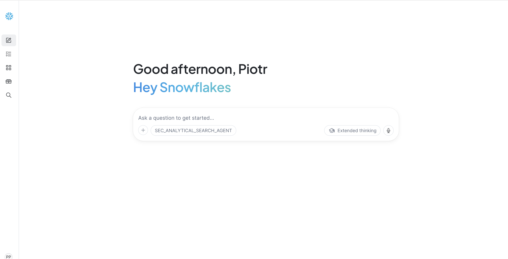

> **Performance expectations:** Simple RAG questions typically complete in ~30 seconds. Analytical search workflows take **2–6 minutes** for most questions. Complex analyses over large corpora (thousands of documents with multi-step extraction and aggregation) may take up to **15 minutes**. This is expected — the agent is doing real computation, not just summarizing a handful of passages.

> **Cost considerations:** Analytical search incurs costs from agent orchestration and the AI functions it uses (AI_FILTER, AI_EXTRACT, AI_AGG). Each AI function call processes one row. Adaptive depth limits unnecessary calls by stopping retrieval when results are no longer relevant — so you pay only for the documents that matter to the answer. For detailed AI function pricing, see the [Cortex AI cost documentation](https://docs.snowflake.com/en/user-guide/snowflake-cortex/aisql-cost#label-cortex-llm-cost-considerations).

### Exercise 1: Auto-Routing (RAG Path)

**Ask the agent:**

> What does Boeing's 10-K say about supply chain risk?

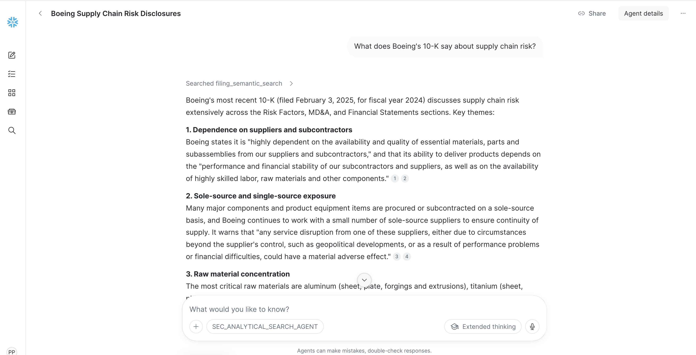

**What to observe:**
- This is a per-document question — the agent auto-routes to standard top-k RAG
- You get a focused answer with citations from Boeing's Risk Factors section
- Response time: fast (~30 seconds)

**Why this matters:** Auto-routing keeps simple questions cheap. Analytical Search is for analytical questions, not every question.

---

### Exercise 2: Counting (Analytical Search Path)

**Ask the agent:**

> How many filings filed on Feb 3, 2025 mention cybersecurity risks?


**What to observe:**
- The agent shows a **plan** before executing (probe → search → AI_FILTER → COUNT)
- AI_FILTER classifies each chunk: is this about an *actual* cybersecurity risk (not generic boilerplate)?
- The answer is a precise integer with a list of companies
- Response time: 1–3 minutes

**Expected result:** ~5 filings mention substantive cybersecurity risks. The agent will list each company with its form type and filing date.


**Key insight:** A RAG agent would say "here are some examples..." — it cannot count because it only sees 5–10 documents. The Analytical Search agent counts from the full result set using SQL.

---

### Exercise 3: Exhaustive Listing with Extraction

**Ask the agent:**

> List every company that announced a leadership change in an 8-K filing on Feb 3, 2025.

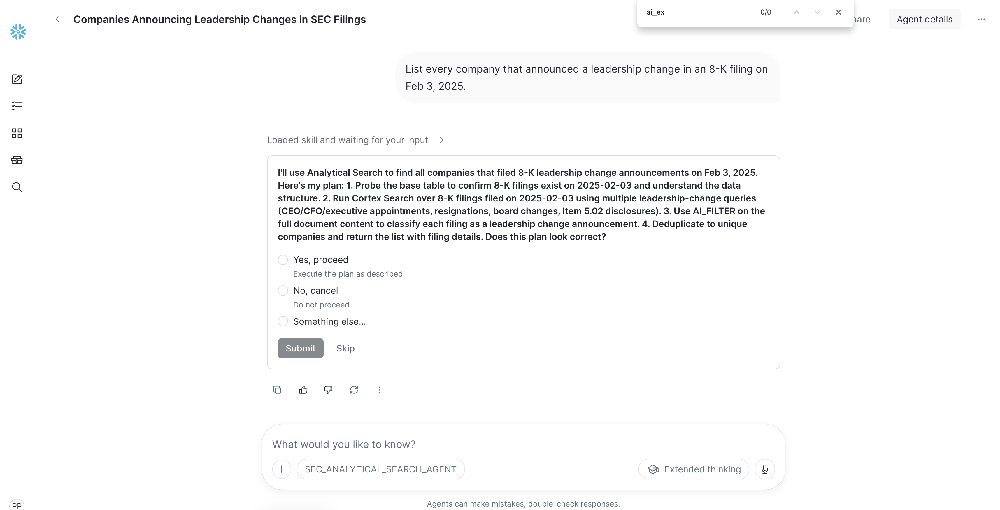

**What to observe:**
- **Adaptive depth** retrieves exactly as many results as needed
- The agent shows a **plan** before executing (probe → search → AI_FILTER → COUNT (deduplicate)
- `AI_FILTER` identifies genuine leadership-change language
- The result is a **table artifact** with one row per event

**Expected result:** ~50 leadership changes in a single day — a table with company, person, role, and type. Notable examples: RTX Corp (Gregory Hayes stepping down), Baxter International (CEO transition).

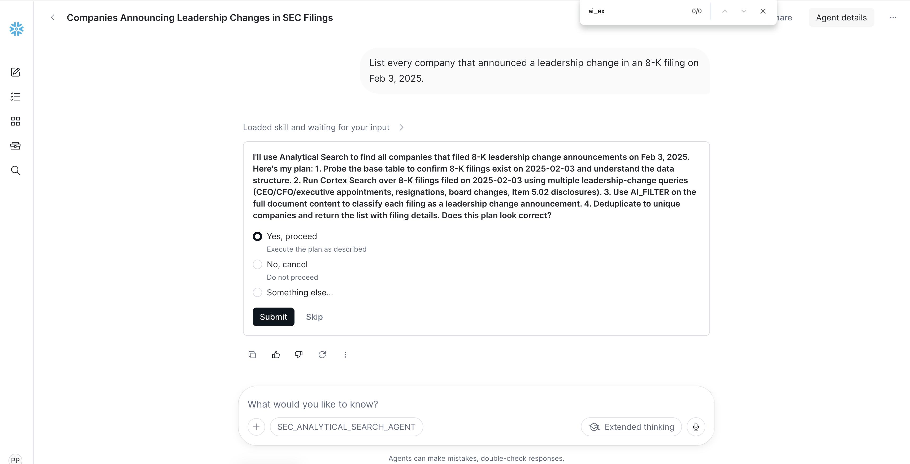

**Key insight:** A RAG agent would return 5–10 examples and hedge with "there may be more." The Analytical Search agent finds all ~50 and structures them into an audit-ready table.

---

### Exercise 4: Honest Refusal

**Ask the agent:**

> Compare Apple and Microsoft 10-K risk factor language about AI — what specific concerns does each company raise?

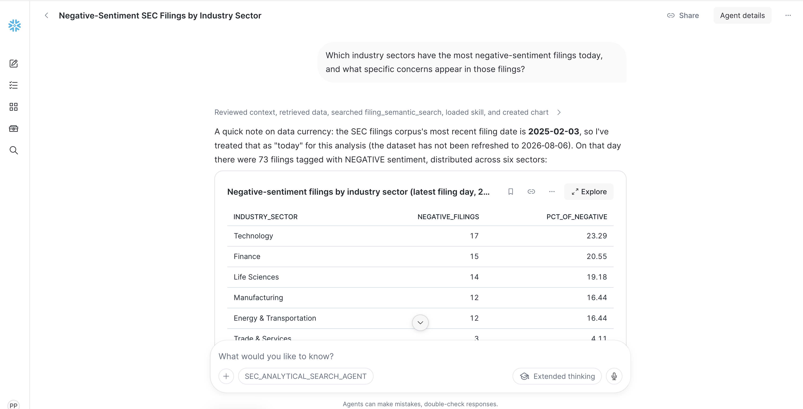

**What to observe:**
- The agent **does not hallucinate**
- It explains: Apple's fiscal year ends Sept 30 (10-K filed Oct/Nov), Microsoft's ends June 30 (10-K filed Jul/Aug) — neither is in this Feb 3 corpus
- It searched, found nothing, and says so explicitly
- It offers alternatives: "I can compare Boeing and RTX, whose 10-Ks are in the corpus"

**Key insight:** Trust over completeness. The agent refuses to fabricate when the corpus lacks data, and offers constructive alternatives. This is as important as getting answers right.

**Follow-up with Boeing and RTX instead of Apple and Microsoft**

> Compare Boeing and RTX 10-K risk factor language — what does each emphasize?

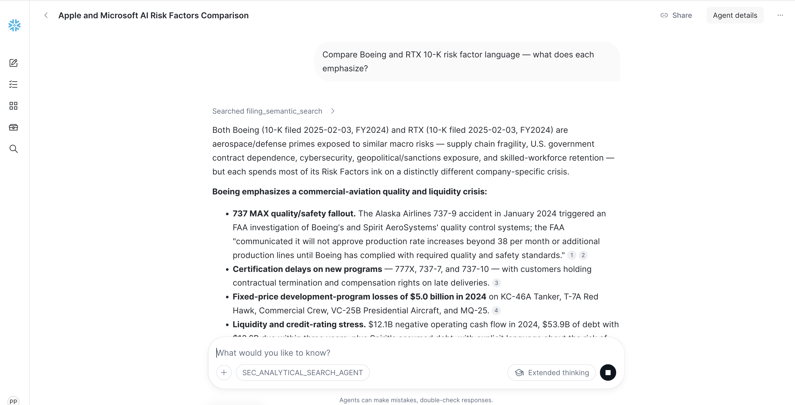

This works: both have substantial risk-factor sections in the corpus.

---

### Bonus Exercises

| Exercise | Prompt | AS Feature Demonstrated |
|----------|--------|------------------------|
| M&A details | "List every M&A transaction filed on Feb 3, 2025. Extract acquirer, target, and deal summary." | AI_EXTRACT (structured extraction) |
| Risk themes | "What are the most common risk themes across the 10-K annual reports filed today?" | AI_AGG (deduplication/clustering) |
| Full breakdown | "Break down all filings filed today by industry sector and sentiment." | Cortex Analyst (pure structured) |

<!-- ------------------------ -->
## Cleanup

> **File:** `sql/99_teardown.sql`

When you're done exploring, run the teardown script to remove all objects:

```sql
USE ROLE ACCOUNTADMIN;

-- Drop database (removes all tables, views, UDFs, procedures)
DROP DATABASE IF EXISTS SEC_FILINGS;

-- Drop warehouse
DROP WAREHOUSE IF EXISTS FILING_WH;

-- Drop external access integration
DROP INTEGRATION IF EXISTS SEC_EDGAR_EAI;
```

<!-- ------------------------ -->
## Conclusion And Resources

**You have built an Analytical Search agent that answers precise analytical questions over hundreds of SEC filing passages — going far beyond what traditional RAG can do.**

### What You Built

-   A **Data Pipeline** ingesting SEC EDGAR filings with ticker enrichment, section-aware chunking, and AI signal extraction
-   A **Multi-Index Cortex Search service** with text and vector indexes over 3,400+ filing chunks enabling Analytical Search
-   A **Semantic View** enabling natural-language SQL analytics over structured filing signals
-   Validated exercises demonstrating counting, exhaustive listing, hybrid queries, auto-routing, and honest refusal

### From Quickstart to Production

This quickstart is not just a demo — it produces a near-production-ready, end-to-end solution you can put to real use:

-   **Historical depth** — Widen the date range to ingest weeks, months, or a full year of filings for richer analytical insights
-   **Parallel backfills** — For large date ranges, create multiple Snowflake Tasks calling `RUN_PIPELINE()` with non-overlapping monthly ranges to process months concurrently
-   **Continuous ingestion** — Schedule a daily Snowflake Task (e.g., `SCHEDULE = 'USING CRON 0 7 * * * America/New_York'`) to call `RUN_PIPELINE()` for the current day, keeping your corpus fresh with no manual intervention
-   **Automatic growth** — As new data flows in, the Cortex Search service and Semantic View automatically incorporate new filings — no additional configuration needed

### Key Takeaways

-   **Analytical Search = Retrieve + Compute** — it goes beyond RAG's "retrieve and summarize" to deliver SQL-level analytical rigor over unstructured data
-   **AI_FILTER understands meaning, not keywords** — it distinguishes "actual cybersecurity incident" from generic "we maintain security programs"
-   **Auto-routing keeps simple questions cheap** — per-document lookups skip the analytical path entirely
-   **Hybrid answers combine structured + unstructured** — Cortex Analyst for counts, Cortex Search for evidence, in one turn
-   **The agent refuses honestly when data is missing** — trust over completeness, with constructive alternatives

### Resources

-   [Analytical Search Documentation](https://docs.snowflake.com/en/user-guide/snowflake-cortex/cortex-agents-analytical-search)
-   [Cortex Agents — Configure and Interact](https://docs.snowflake.com/en/user-guide/snowflake-cortex/cortex-agents-manage)
-   [Cortex Search Service DDL](https://docs.snowflake.com/en/sql-reference/sql/create-cortex-search)
-   [CREATE AGENT Reference](https://docs.snowflake.com/en/sql-reference/sql/create-agent)
-   [AI_FILTER Function](https://docs.snowflake.com/en/sql-reference/functions/ai_filter)
-   [AI_EXTRACT Function](https://docs.snowflake.com/en/sql-reference/functions/ai_extract)
-   [AI_AGG Function](https://docs.snowflake.com/en/sql-reference/functions/ai_agg)
-   [Semantic Views](https://docs.snowflake.com/en/user-guide/views-semantic/overview)
-   [Source Code Repository](https://github.com/Snowflake-Labs/sfquickstarts/tree/main/site/sfguides/src/analytical-search-over-sec-filings-with-snowflake-cowork)
