author: Daniel Chen, Sara Altman
id: analyze-data-with-r-using-posit-workbench-and-snowflake
categories: snowflake-site:taxonomy/solution-center/certification/quickstart, snowflake-site:taxonomy/solution-center/certification/community-sourced, snowflake-site:taxonomy/solution-center/includes/architecture, snowflake-site:taxonomy/product/analytics, snowflake-site:taxonomy/snowflake-feature/interactive-analytics
language: en
summary: Analyze Snowflake data using R in Posit Workbench for statistical computing, predictive modeling, and data visualization.
environments: web
status: Published
feedback link: https://github.com/Snowflake-Labs/sfguides/issues

#  Analyze Data with R using Posit Workbench and Snowflake

## Overview

This guide will walk you through using R to analyze data in Snowflake using the Posit
Workbench Native App. You'll learn how to launch the Posit Workbench Native App and use the available RStudio Pro IDE. You'll also learn how to use the `{dbplyr}` package to translate R code into SQL, allowing you to run data operations directly in Snowflake's high-performance computing environment.

We'll focus on a healthcare example by analyzing heart failure data. We'll then guide you through launching an R session, accessing the data, and performing data cleaning, transformation, and visualization. Finally, you'll see how to generate an HTML report, build an interactive Shiny app, and write data back to Snowflake—-completing an end-to-end R analysis _entirely within Snowflake_.

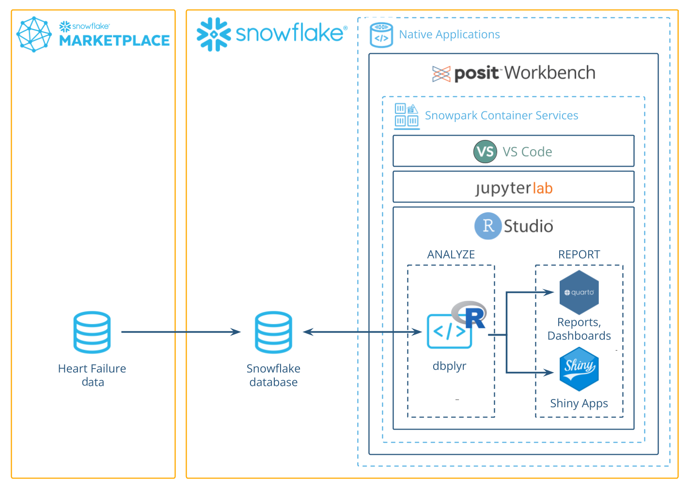

### What You'll Need

- Familiarity with R
- The ability to launch Posit Workbench from [Snowflake Native Applications](https://docs.posit.co/ide/server-pro/integration/snowflake/native-app/). This can be provided by an administrator with the `accountadmin` role.

### What You’ll Learn

- How to create an R session within the RStudio Pro IDE that comes with the Posit Workbench Native App.
- How to connect to your Snowflake data from R to create tables, visualizations, and more.

### What You’ll Build

- An RStudio Pro IDE environment to use within Snowflake.
- A Quarto document that contains plots and tables built with R, using data stored in Snowflake.
- An interactive Shiny application built with R, using data stored in Snowflake.

Along the way, you will use R to analyze which variables are associated with survival among patients with heart failure.
You can follow along with this quickstart guide,
or look at the materials provided in the accompanying repository:
<https://github.com/posit-dev/snowflake-posit-quickstart-r>.

## Setup

Before we begin there are a few components we need to prepare. We need to:

- Add the heart failure data to Snowflake
- Launch the Posit Workbench Native App
- Create an RStudio Pro IDE session
- Install R Packages

### Add the heart failure data to Snowflake

For this analysis, we'll use the [Heart Failure Clinical Records](https://archive.ics.uci.edu/dataset/519/heart+failure+clinical+records) dataset. The data is available for download as a CSV from the [UCI Machine Learning Repository](https://archive.ics.uci.edu/dataset/519/heart+failure+clinical+records). 

We'll walk through how to download the data from UCI and then upload it to Snowflake from a CSV.

> **_INTERACTIVITY NOTE:_** If you have the necessary permissions in Snowflake, you can also import the data from this S3 bucket: s3://heart-failure-records/heart_failure.csv.

#### Step 1: Download the data as a CSV

Download the data from UCI [here](https://archive.ics.uci.edu/dataset/519/heart+failure+clinical+records), and then unzip the downloaded file. 

#### Step 2: Add data in Snowsight

Log into [Snowsight](https://docs.snowflake.com/en/user-guide/ui-snowsight), then click `Create` > `Add Data`. You can find the `Create` button in the upper-left corner. 


#### Step 3: Load data

Choose the `Load Data into a Table` option, then select your downloaded heart failure CSV. Specify an existing database or create a new one for the heart failure data (we called ours `HEART_FAILURE`). Then, select `+ Create a new table` and name it `HEART_FAILURE`.

Once your find the database, you can load it into your Snowflake account by clicking the Get button on the right-hand side.

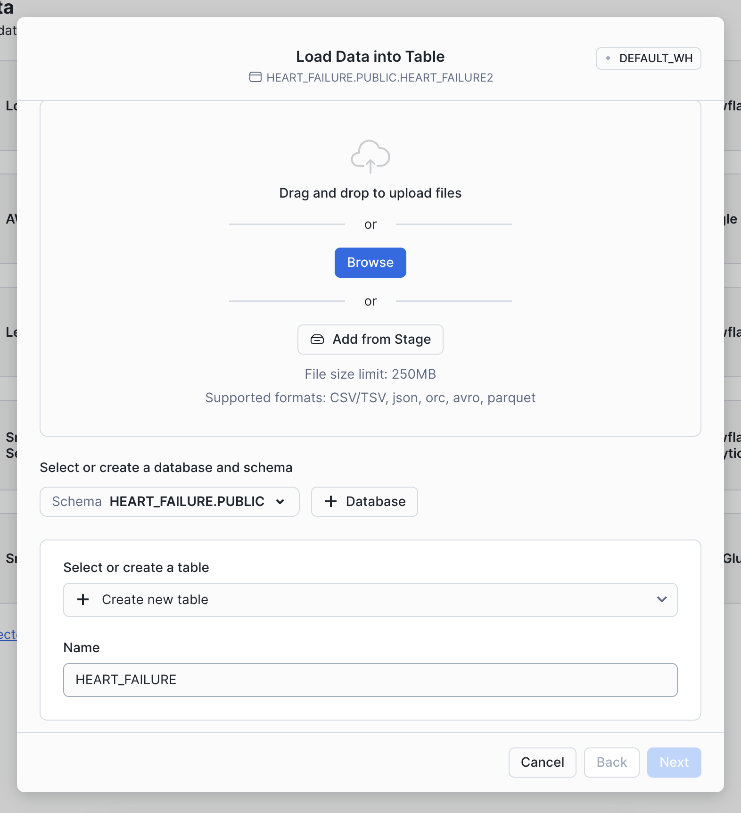

#### Step 4: Confirm data

You should now be able to see the heart failure data in Snowsight. Navigate to `Data` > `Databases`, then select the database to which you added the data (e.g., `HEART_FAILURE`). Expand the database, schema, and tables until you see the `HEART_FAILURE` table. 


### Launch Posit Workbench

We can now start exploring the data using Posit Workbench.
You can find Posit Workbench as a Snowflake Native Application
and use it to connect to your database.

#### Step 1: Navigate to Apps

In your Snowflake account, Go to `Catalog` > `Apps` to open the Native Apps collection. If Posit Workbench is not already installed, click `Browse all apps` and search for `Posit Workbench` to find it. Please note that the Native App must be [installed and configured](https://docs.posit.co/ide/server-pro/integration/snowflake/native-app/install.html) by an administrator. 

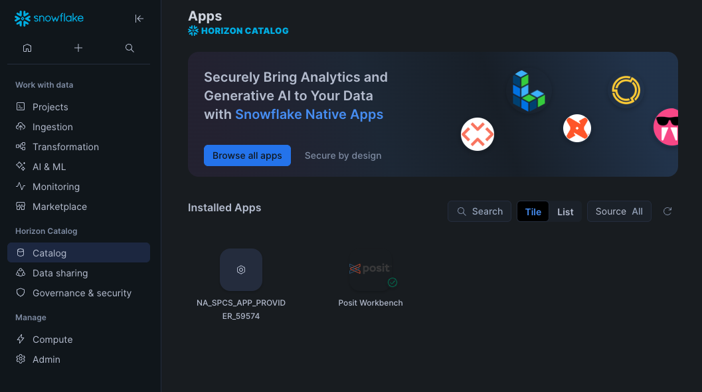

#### Step 2: Activate and launch Posit Workbench Native App

Once Posit Workbench is installed, click on the app under `Installed Apps` to launch the app. If you do not see the Posit Workbench app listed, ask your Snowflake account administrator for access to the app.

After clicking on the app, you will see a page with activation steps and a blue `Activate` button.

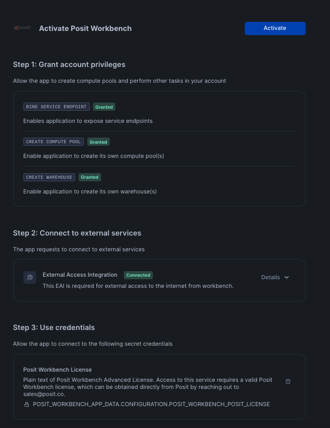

Click on `Activate`. This should now take you to the next step where you can see a `Launch app` button.
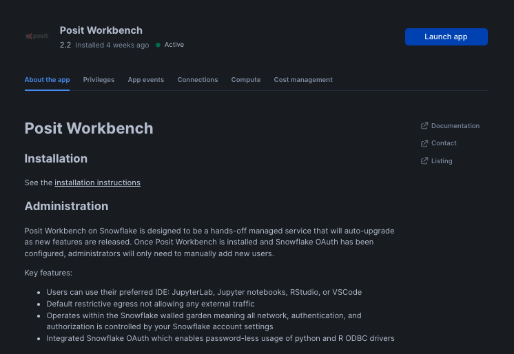

To setup Oauth, click on `Connections` tab, and then click on `Configure` in section titeld `Snowflake OAuth Integration`. You will then be prompted to enter your username and password along with instrucions to setup OAuth.


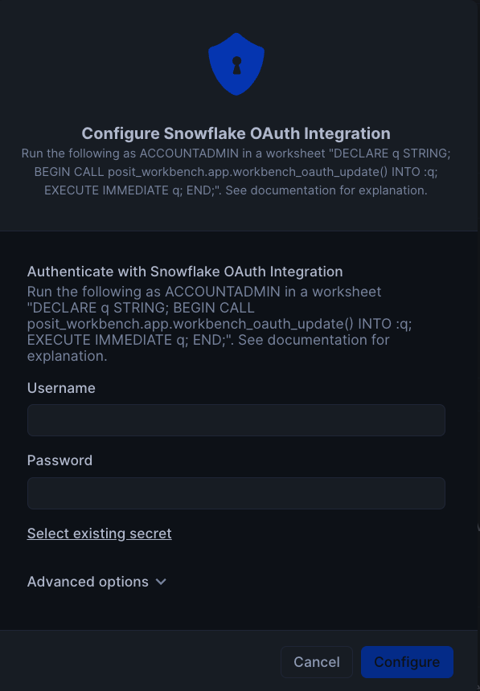

Finally, to launch the app click on `Launch app`. This should take you to the webpage generated for the Workbench application. You may be prompted to first login to Snowflake using your regular credentials or authentication method.

### Create an RStudio Pro Session 

Posit Workbench provides several IDEs, such as RStudio Pro, JupyterLab, and VS Code. For this analysis we will use an RStudio Pro IDE.

#### Step 1: New Session

Within Posit Workbench, click `New Session` to launch a new session to spin up your coding environment.

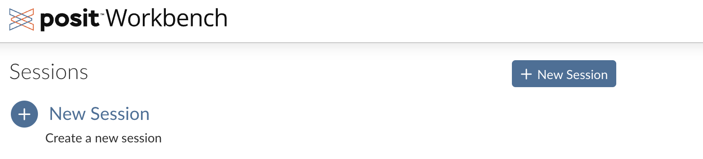

#### Step 2: Select an IDE

When prompted, select the RStudio Pro IDE.


#### Step 3: Log into your Snowflake account

Next, connect to your Snowflake account from within Posit Workbench.
Under `Credentials`, click the button with the Snowflake icon to sign in to Snowflake.
Follow the sign in prompts.

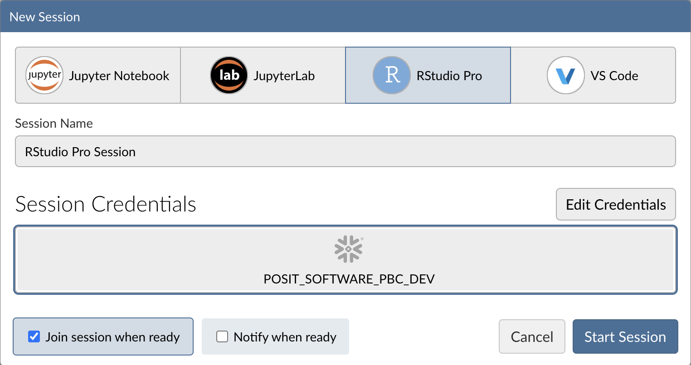

If sign-in fails: verify OAuth and network policy.

If the Snowflake sign-in in RStudio doesn’t complete (the Snowflake button doesn’t turn blue) or you see 403/blocked errors:
* OAuth setup for the app: Ensure the Posit Workbench Native App is configured to use OAuth so users can authenticate from inside RStudio. Follow the install steps: [Install with OAuth](https://docs.posit.co/partnerships/snowflake/workbench/native-app/install.html#oauth).
* Account network policy: If your account enforces a network policy, allow connections from the Posit Workbench Native App back to Snowflake. Guidance and remediation: [Account network policies](https://docs.posit.co/partnerships/snowflake/workbench/native-app/troubleshooting.html#account-network-policies).

Try again: After updating OAuth and/or network policy, return to RStudio in Posit Workbench and click the Snowflake button to sign in.

Tip: Most sign-in issues are due to incomplete OAuth configuration or a restrictive network policy. Ask an admin to review both if you don’t have permissions.


When you're successfully signed into Snowflake, the Snowflake button will turn blue
and there will be a checkmark in the upper-left corner.

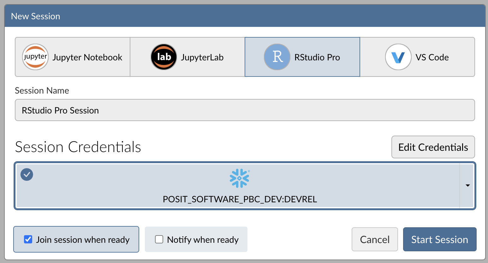

#### Step 4: Launch the RStudio Pro IDE

Click `Start Session` to launch the RStudio Pro IDE.

Once everything is ready,
you will be able to work with your Snowflake data
in the familiar RStudio Pro IDE. Since the IDE is provided by the Posit Workbench Native App, 
your entire analysis will occur securely within Snowflake.

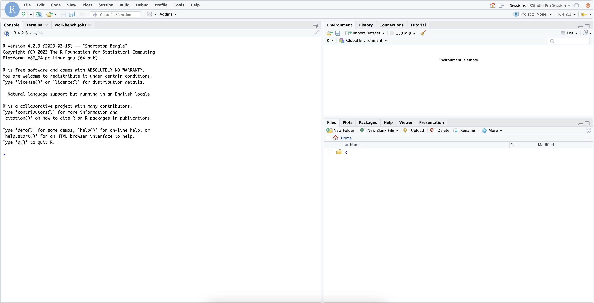

#### Step 5: Access the Quickstart Materials

This Quickstart will step you through the analysis contained in <https://github.com/posit-dev/snowflake-posit-quickstart-r/blob/main/quarto.qmd>.
To follow along, open the file in your RStudio Pro IDE. There are two ways to do this:

1. **Simple copy-and-paste** Go to File > New File > Quarto Document and then copy the contents of [quarto.qmd](https://github.com/posit-dev/snowflake-posit-quickstart-r/blob/main/quarto.qmd) into your new file.
2. **Starting a new project linked to the GitHub repo.** To do this:

    1.  Go to File > New Project in the RStudio IDE menu bar.

    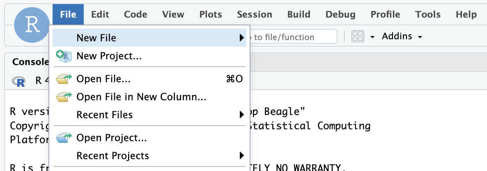

    2.  Select Version Control in the New Project Wizard

    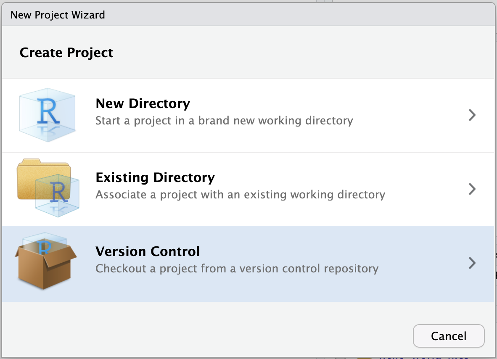

    3.  Select Git

    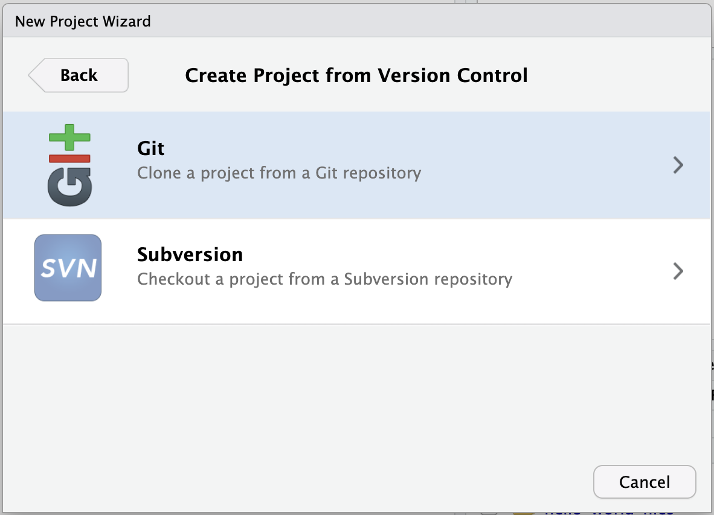

    4.  Paste the [URL](https://github.com/posit-dev/snowflake-posit-quickstart-r/) of the GitHub repo and click Create Project

    

    RStudio will clone a local copy of the materials on GitHub. You can use the Files pane in the bottom right-hand corner of the IDE to navigate to `quarto.qmd`. Click on the file to open it.


Note: SSH authentication is not available in Snowpark Container Services, so when creating projects from Git, you may need to authenticate Git operations over HTTPS, using a username and password or a personal access token.


### Install R Packages

Now that we're in a familiar R environment,
we need to prepare the packages we will use. For this analysis, we will use the [Tidyverse](https://www.tidyverse.org/) suite of packages, as well as a few others.

```r
install.packages(c("tidyverse", "DBI", "dbplyr", "gt", "gtExtras", "odbc"))
```

After we install the packages, we load them.

```r
library(tidyverse)
library(DBI)
library(dbplyr)
library(gt)
library(gtExtras)
library(odbc)
```

## Access Snowflake data from R

We will run our code in the R environment created by the RStudio Pro IDE, but the code will use data stored in our database on Snowflake.

To access this data, we will use the `{DBI}` and `{odbc}` R packages to connect to the database. We will then use `{dplyr}` and `{dbplyr}` to query the data with R,
without having to write raw SQL. Let's take a look at how this works.

### Connect with `{DBI}`

`{DBI}` is an R package that allows us to connect to databases with `DBI::dbConnect()`.

To connect to our Snowflake database, we will use a driver provided by the `{odbc}` package. We will need to provide a `warehouse` for compute, and a `database` to connect to.
We can also provide a `schema` here to make connecting to specific tables and views easier.

```r
# Connect to the database
conn <-
  DBI::dbConnect(
    odbc::snowflake(),
    warehouse = "DEFAULT_WH",
    database = "HEART_FAILURE",
    schema = "PUBLIC"
  )
```

We will save our connection as an object, named `conn`, which will make it easy to use.

Once we build a connection, we can see the databases, schemas, and tables available to us in the RStudio IDE Connections pane. Click on the database icon to the right of a database to see its schemas. Click on the schema icon to the right of a schema to see its tables. Click on the table icon to the right of a table to see a preview of the table.

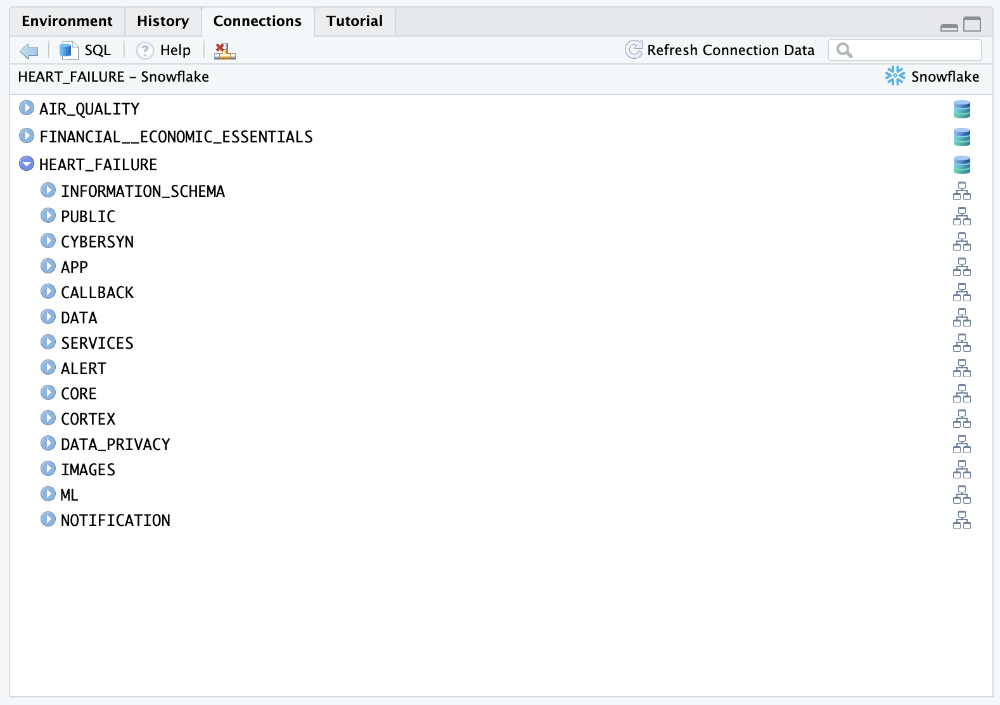

### Create `tbl`s that correspond to tables in the database

Once we build a connection, we can use `dplyr::tbl()` to create `tbl`s. A tbl is an R object that represents a table or view accessed through a connection.


```r
heart_failure <- tbl(conn, "HEART_FAILURE")
```

> If we did not provide the `schema` argument into `DBI::dbConnect()` earlier, we would need to specify the view with `tbl(conn, in_schema("PUBLIC", "HEART_FAILURE"))`.

### Rely on `{dbplyr}` to translate R to SQL

We can now use `heart_failure` as if it was a tibble in R. For example, we can filter rows and select columns from our data.

```r
heart_failure_young <-
  heart_failure |> 
  filter(age < 50) |>
  select(age, sex, smoking, death_event)
```

When we use `tbl`s, `{dbplyr}` translates our R code into SQL queries. Think of any object made downstream from a tbl like a view: it contains SQL that represents a table built from the tbl. If we want to see the SQL code that `{dbplyr}` generates, we can run `dbplyr::show_query()`.

```r
heart_failure_young |>
  show_query()
```
```
SELECT
  "AGE" AS "age",
  "SEX" AS "sex",
  "SMOKING" AS "smoking",
  "DEATH_EVENT" AS "death_event"
FROM "HEART_FAILURE"
WHERE ("AGE" < 50.0)
```

To save compute, R waits to execute a query until we request the data that it represents.

To save memory, R stores the data as a temporary file in the database (instead of in R's global environment). When we inspect the data, R only returns the first few rows of this file to display.

```r
heart_failure_young
```
```
# Source:   SQL [?? x 4]
# Database: Snowflake 8.39.2[@Snowflake/HEART_FAILURE]
     age   sex smoking death_event
   <dbl> <dbl>   <dbl>       <dbl>
 1    45     1       0           1
 2    49     0       0           0
 3    45     1       0           1
 4    48     0       0           1
 5    49     1       1           1
 6    45     1       0           1
 7    45     1       0           1
 8    45     0       0           0
 9    42     0       0           1
10    41     1       1           0
# ℹ more rows
# ℹ Use `print(n = ...)` to see more rows
```

### `collect()`

We can trigger R to execute a query and to return the _entire_ result as a tibble with `dbplyr::collect()`. Keep in mind, that if your result is large, you may not want to collect it into R.

```r
heart_failure_young_df <-
  heart_failure_young |> 
  collect()
  
heart_failure_young_df
```
```
# A tibble: 47 × 4
     age   sex smoking death_event
   <dbl> <dbl>   <dbl>       <dbl>
 1    45     1       0           1
 2    49     0       0           0
 3    45     1       0           1
 4    48     0       0           1
 5    49     1       1           1
 6    45     1       0           1
 7    45     1       0           1
 8    45     0       0           0
 9    42     0       0           1
10    41     1       1           0
# ℹ 37 more rows
# ℹ Use `print(n = ...)` to see more rows
```

### In summary

This system:

1. Keeps our data in the database, saving memory in the R session
2. Pushes computations to the database, saving compute in the R session
3. Evaluates queries lazily, saving compute in the database

We don't need to manage the process, it happens automatically behind the scenes.

> `{dbplyr}` can translate the most common tidyverse and base R functions to SQL. However, you may sometimes use a function that `{dbplyr}` does not recognize or for which there is no SQL analogue. On these occasions, you will need to `collect()` your data into R, where you can process it as a real tibble.

Learn more about `{dbplyr}` at [dbplyr.tidyverse.org](https://dbplyr.tidyverse.org/)

## Write to a Snowflake database

You can also use `{DBI}` to create a new table in a database or append to an existing table.

To add a new table, use `DBI::dbWriteTable()`. Note that `value` needs to be a data.frame or tibble, which
is why we passed `heart_failure_young_df`, the result of calling `collect()` on `heart_failure_young`.

```r
dbWriteTable(conn, name = "HEART_FAILURE_YOUNG", value = heart_failure_young_df)
```

To append to an existing table, specify `append = TRUE`. If appending, the `name` 
argument should refer to an existing table.

Now that we understand how R will interact with the database, we can use R to perform our analysis.

## Prepare data with `{dplyr}`

We want to understand which variables in `HEART_FAILURE` are associated with survival
of patients with heart failure.

First we convert the column names to lowercase, so we won't need to worry about capitalization.

```r
# Standardize column names
heart_failure <- 
  heart_failure |> 
  rename_with(str_to_lower)
```

> When we are running these commands on a database connection, `{dbplyr}` is translating the code into SQL for us under the hood.
> We don't need to write raw SQL commands, and the compute is happening directly on the database.
> You can pipe `|>` the code into `show_query()` if you want to see the generated SQL query.


### Filter ages

For now, we'll focus on just patients younger than 50. We also reduce the data to just the columns we're interested in.

```r
heart_failure <-
  heart_failure |> 
  filter(age < 50) |> 
  select(age, diabetes, serum_sodium, serum_creatinine, sex, death_event)
```

Our table now looks like this.

```
# Source:   SQL [?? x 6]
# Database: Snowflake 8.39.2[@Snowflake/HEART_FAILURE]
     age diabetes serum_sodium serum_creatinine   sex death_event
   <dbl>    <dbl>        <dbl>            <dbl> <dbl>       <dbl>
 1    45        0          137             1.1      1           1
 2    49        0          138             1        0           0
 3    45        0          127             0.8      1           1
 4    48        1          121             1.9      0           1
 5    49        0          136             1.1      1           1
 6    45        1          139             1        1           1
 7    45        0          145             1        1           1
 8    45        0          137             1.18     0           0
 9    42        1          136             1.3      0           1
10    41        0          140             0.8      1           0
# ℹ more rows
# ℹ Use `print(n = ...)` to see more rows
```

## Visualize Data with `{ggplot2}`

The heart failure data provides important insights that can help us:

- Identify factors associated with increased risk of mortality after heart failure
- Predict future survival outcomes based on historical clinical data
- Benchmark patient outcomes based on clinical indicators like serum sodium levels

Visualizing clinical variables across different patient groups can help identify patterns.

### Visualize serum sodium levels

We can use `{ggplot2}` to visually compare sodium levels across different patient groups. In this plot, we see the distribution of serum sodium based on whether the patients have diabetes and whether they survived (`0`) or died (`1`) during the follow-up period.

```r
heart_failure |> 
  mutate(
    death_event = as.character(death_event), 
    diabetes = as.character(diabetes)
  ) |> 
  ggplot(aes(x = death_event, y = serum_sodium, fill = diabetes)) +
  geom_boxplot() +
  labs(
    title = "Serum Sodium Levels by Diabetes Status and Survival Outcome",
    x = "Survival Outcome (0 = Survived, 1 = Died)",
    y = "Serum Sodium (mEq/L)",
    fill = "Diabetes"
  ) +
  theme(legend.position = "bottom")
```

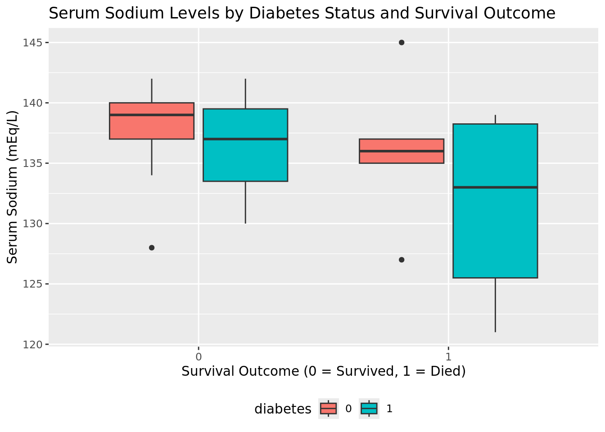

> **_INTERACTIVITY NOTE:_**  The code above allows for easy visualization of other variables. You can adjust the `aes()` function or filter the data to explore different clinical indicators and patient characteristics.

## Make publication-ready tables with `{gt}`

We can continue exploring the heart failure dataset with visualizations or create a table that concisely displays multiple pieces of information at once. For example, we can use `{dplyr}` verbs to calculate the median values for various clinical metrics across different patient groups.

```r
heart_failure |> 
  summarize(
    across(
      c("age", "serum_creatinine", "serum_sodium"), 
      \(x) median(x, na.rm = TRUE), 
      .names = "median_{.col}"
    )
  )
```

```
# Source:   SQL [1 x 3]
# Database: Snowflake 8.39.2[@Snowflake/HEART_FAILURE]
  median_age median_serum_creatinine median_serum_sodium
       <dbl>                   <dbl>               <dbl>
1         45                       1                 137
```

With `{dplyr}`'s `group_by()` command, we can compute separate metrics for each
combination of `death_event` and `diabetes`.

```r
comparison <- 
  heart_failure |> 
  group_by(death_event, diabetes) |> 
  summarize(
    across(
      c("age", "serum_creatinine", "serum_sodium"), 
      \(x) median(x, na.rm = TRUE), 
      .names = "median_{.col}"
    ),
    .groups = "drop"
  )
  
comparison
```

```
# Source:   SQL [4 x 5]
# Database: Snowflake 8.39.2[@Snowflake/HEART_FAILURE]
  death_event diabetes median_age median_serum_creatinine median_serum_sodium
        <dbl>    <dbl>      <dbl>                   <dbl>               <dbl>
1           0        0       42                      1                    139
2           1        1       45.5                    1.45                 133
3           1        0       45                      1.1                  136
4           0        1       45                      0.9                  137
```

This is a useful way to examine the information for ourselves. However, if we wish to share the information with others, we might prefer to present the table in a more polished format. We can do this with commands from R's [`{gt}` package](https://gt.rstudio.com/).

The following code creates a table displaying the information in `comparison`.

```r
comparison |> 
  mutate(
    death_event = case_when(
      death_event == 1 ~ "Died",
      death_event == 0 ~ "Survived"
    ),
    diabetes = case_when(
      diabetes == 1 ~ "Yes",
      diabetes == 0 ~ "No"
    )
  ) |> 
  arrange(desc(death_event), desc(diabetes)) |> 
  gt(rowname_col = "death_event") |> 
  cols_label(
    diabetes = "Diabetes Status",
    median_age = "Median Age",
    median_serum_creatinine = "Median Serum Creatinine (mg/dL)",
    median_serum_sodium = "Median Serum Sodium (mEq/L)"
  ) |> 
  tab_header(
    title = "Clinical Metrics by Survival Outcome and Diabetes Status"
  ) |> 
  data_color(
    columns = c(median_serum_creatinine, median_serum_sodium),
    palette = "Blues"
  ) 
```

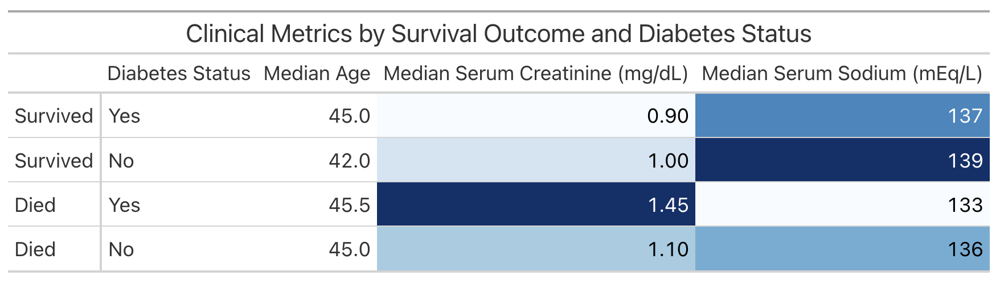

Now that we've accumulated some insights, let's think about how we might present the results of our analysis to our colleagues.

## Build Reports and Dashboards with Quarto

We've conveniently written our analysis in a Quarto (`.qmd`) document, [quarto.qmd](https://github.com/posit-dev/snowflake-posit-quickstart-r/blob/main/quarto.qmd). [Quarto](https://quarto.org/)
is an open-source publishing system that makes it easy to create
[data products](https://quarto.org/docs/guide/) such as
[documents](https://quarto.org/docs/output-formats/html-basics.html),
[presentations](https://quarto.org/docs/presentations/),
[dashboards](https://quarto.org/docs/dashboards/),
[websites](https://quarto.org/docs/websites/),
and
[books](https://quarto.org/docs/books/).

By placing our work in a Quarto document, we have interwoven all of our code, results, output, and prose text into a single literate programming document.
This way everything can travel together in a reproducible data product.

A Quarto document can be thought of as a regular markdown document,
but with the ability to run code chunks.

You can run any of the code chunks by clicking the play button above the chunk in the RStudio Pro IDE.

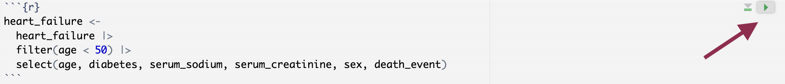

You can render the entire document into a polished report to share, with the `Render` button.

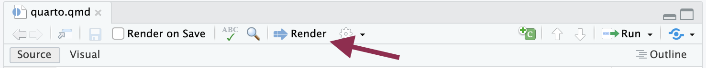

This will run all the code in the document from top to bottom in a new R session,
and generate an HTML file, by default, for you to view and share.

### Learn More about Quarto

You can learn more about Quarto here: <https://quarto.org/>,
and the documentation for all the various Quarto outputs here: <https://quarto.org/docs/guide/>.
Quarto works with R, Python, and Javascript Observable code out-of-the box,
and is a great tool to communicate your data science analyses.


## Shiny Application

One way to share our work and allow others to explore the heart failure dataset is to create an
interactive [Shiny](https://shiny.posit.co/) app. 

We've prepared an example Shiny app in the directory:
<https://github.com/posit-dev/snowflake-posit-quickstart-r>. Our app allows the user
to explore different clinical metrics in one place.

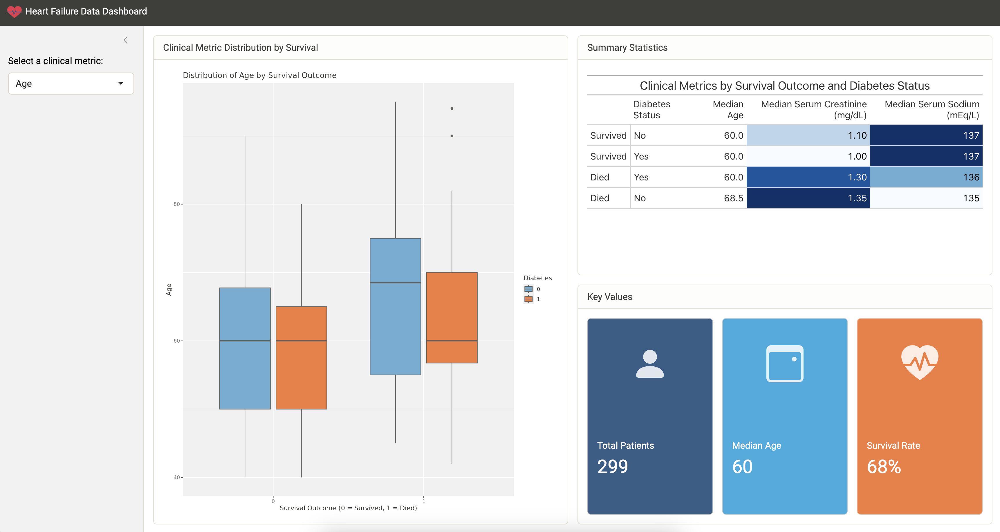

To run the app, open `app.R` and then click the Run App button at the top of the script in the RStudio Pro IDE.

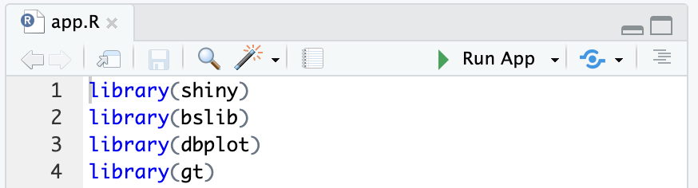

If you face package missing errors like this: `there is no package called ‘xyz’`, please install the required package by running `install.packages("xyz")` in the R console.

Change the metric in the sidebar to control which metric is plotted.

### Learn More About Shiny

You can learn more about Shiny at: <https://shiny.posit.co/>.
This example uses Shiny for R, but
[Shiny for Python](https://shiny.posit.co/py/)
is also available!

If you're new to Shiny, you can try it online with
[shinylive](https://shinylive.io/r/).
It too, comes in a [Python](https://shinylive.io/py) version.

## Conclusion and Resources

R is beloved by data scientists for its intuitive, concise syntax. You can now combine this syntax with the power and peace of mind of Snowflake. The Posit Workbench Native Application provides an IDE for R _within Snowflake_. You can then use R's existing database packages---`{DBI}`, `{odbc}`, `{dbplyr}`---to access your Snowflake databases.

### What You Learned

- How to create an R session within the RStudio Pro IDE that comes with the Posit Workbench Native App.
- How to connect to your Snowflake data from R to create tables, visualizations, and more.
- Build an RStudio Pro IDE environment to use within Snowflake.
- Build a Quarto document that contains plots and tables built with R, using data stored in Snowflake.
- Build an interactive Shiny Application built with R, using data stored in Snowflake.


### Resources

- [Source Code on GitHub](https://github.com/posit-dev/snowflake-posit-quickstart-r)
- [More about Posit Workbench](https://posit.co/products/enterprise/workbench/)
- [{tidyverse} package for data science in R](https://dbplyr.tidyverse.org/)
- [{dbplyr} package for database connections](https://dbplyr.tidyverse.org/)
- [{gt} package for tables](https://gt.rstudio.com/)
- [Quarto for reproducible documents, reports, and data products](https://quarto.org/)
- [Shiny for interactive dashboards and applications](https://shiny.posit.co/)
- [Shinylive for serverless Shiny applications](https://shinylive.io/)
- [Download Reference Architecture](/content/dam/snowflake-site/developers/2024/05/Data-Analysis-with-R-using-POSIT-workbench.pdf)
- [Read the Blog](https://medium.com/snowflake/analyze-data-in-r-with-posit-workbench-and-snowflake-7b837b27337b)
- [Watch the Demo](https://youtu.be/ZscKe1Vl7Ec?list=TLGGZ4Kuet5QT6AyMjA5MjAyNQ)
