author: Sara Altman, Daniel Chen
id: analyze_data_with_python_using_posit_workbench_and_snowflake
summary: Analyze Data with Python using Posit Workbench and Snowflake
categories: Getting-Started
environments: web
status: Published
feedback link: https://github.com/Snowflake-Labs/sfguides/issues
tags: Getting Started, Data Science, Python, Posit Workbench, Native Applications

<style>
  img {
    width: 800px;
    height: auto;
  }
</style>

#  Analyze Data with Python using Posit Workbench and Snowflake

## Overview
Duration: 1

In this guide, we'll use Python to analyze data in Snowflake using the Posit
Workbench Native App. You'll learn how to launch the Posit Workbench Native App and use the available VS Code IDE. You'll also learn how to use the Ibis library to translate Python code into SQL, allowing you to run data operations directly in Snowflake's high-performance computing environment.

We'll focus on a healthcare example by analyzing heart failure data. We'll guide you through accessing the data and performing data cleaning, transformation, and visualization. Finally, you'll see how to generate an HTML report, build an interactive Shiny app, and write data back to Snowflake—completing an end-to-end analysis in Python _entirely within Snowflake_.

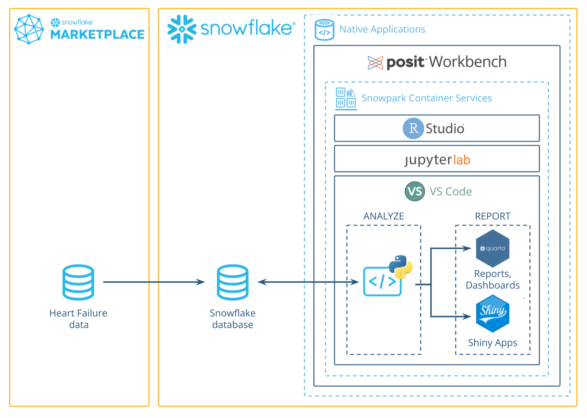

### What You Will Build

- A VS Code environment to use within Snowflake.
- A Quarto document that contains plots and tables built with Python, using data stored in Snowflake.
- An interactive Shiny for Python application built using data stored in Snowflake.

Along the way, you will use Python to analyze which variables are associated with survival among patients with heart failure.
You can follow along with this quickstart guide,
or look at the materials provided in the accompanying repository:
<https://github.com/posit-dev/snowflake-posit-quickstart-python>.

### What You Will Learn

- How to work in VS Code from Posit Workbench Native App.
- How to connect to your Snowflake data from Python to create tables, visualizations, and more.

### Prerequisites

- Familiarity with Python
- The ability to launch Posit Workbench from [Snowflake Native Applications](https://docs.posit.co/ide/server-pro/integration/snowflake/native-app/). This can be provided by an administrator with the `accountadmin` role.

## Setup
Duration: 15

Before we begin there are a few components we need to prepare. We need to:

- Add the heart failure data to Snowflake
- Launch the Posit Workbench Native App
- Create a VS Code session
- Create a virtual environment and install the necessary libraries

### Add the heart failure data to Snowflake

For this analysis, we'll use the [Heart Failure Clinical Records](https://archive.ics.uci.edu/dataset/519/heart+failure+clinical+records) dataset. The data is available for download as a CSV from the [UCI Machine Learning Repository](https://archive.ics.uci.edu/). 

We'll walk through how to download the data from UCI and then upload it to Snowflake from a CSV.

<!--these asides will show up as info boxes when built as part of snowflakes site-->
> aside positive
> 
> If you have the necessary permissions in Snowflake, you can also import the data from this S3 bucket: s3://heart-failure-records/heart_failure.csv.

#### Step 1: Download the data as a CSV

Download the data from UCI [here](https://archive.ics.uci.edu/dataset/519/heart+failure+clinical+records), and then unzip the downloaded file. 

#### Step 2: Add data in Snowsight

Log into [Snowsight](https://docs.snowflake.com/en/user-guide/ui-snowsight), then click `Create` > `Add Data`. You can find the `Create` button in the upper-left corner. 


#### Step 3: Load data

Choose the `Load Data into a Table` option, then select your downloaded heart failure CSV. Create a new database
named `HEART_FAILURE`. Then, select `+ Create a new table` and name it `HEART_FAILURE`.

You can use an existing database with a different name. You'll just need to change the code
we'll use later to reflect your database name.

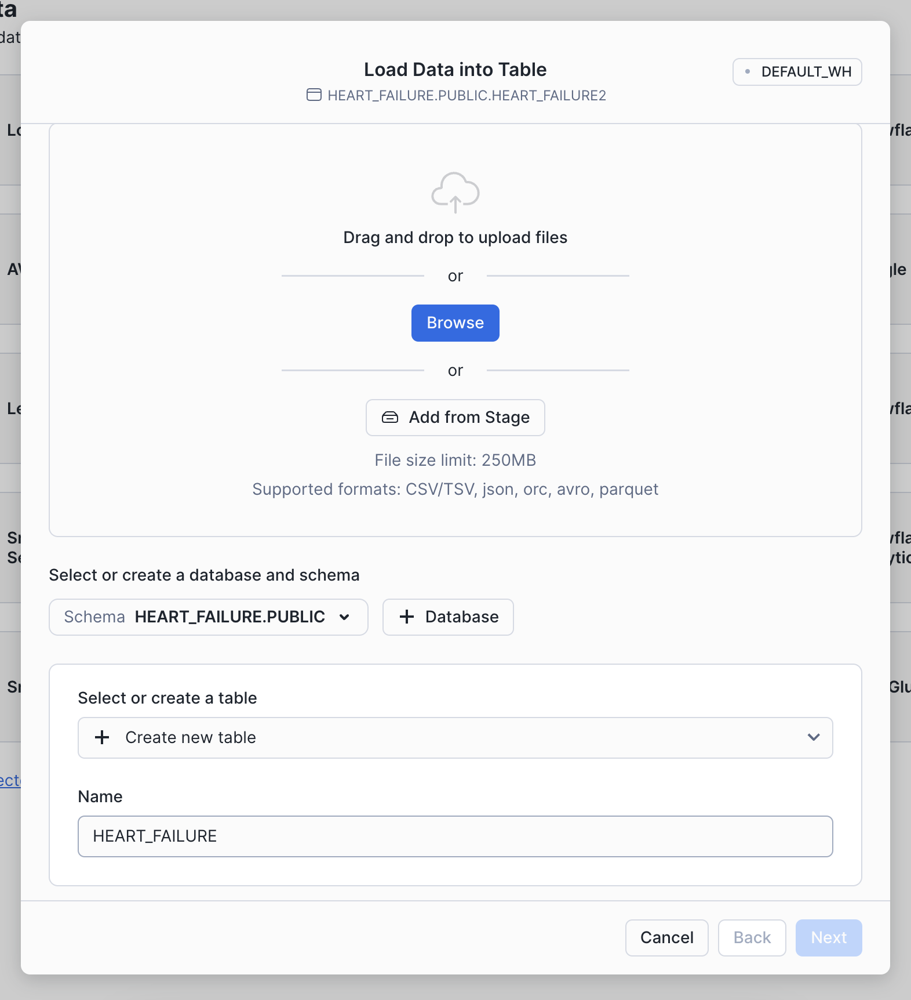

#### Step 4: Confirm data

You should now be able to see the heart failure data in Snowsight. Navigate to `Data` > `Databases` > `HEART_FAILURE`. Expand the database, schema, and tables until you see the `HEART_FAILURE` table. 

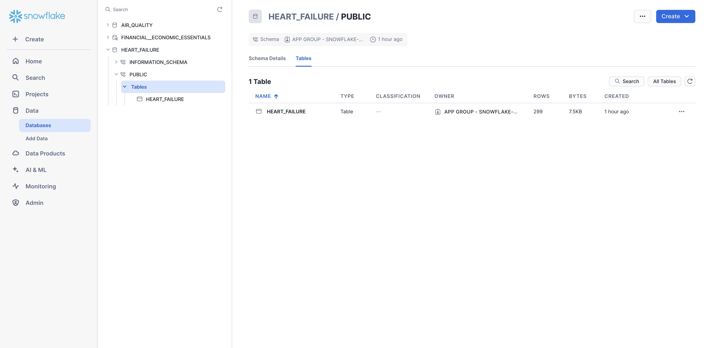

### Launch Posit Workbench

We can now start exploring the data using Posit Workbench.
You can find Posit Workbench as a Snowflake Native Application
and use it to connect to your database.

#### Step 1: Navigate to Apps

In your Snowflake account, go to `Data Products` > `Apps` to open the Native Apps collection. If Posit Workbench is not already installed, click `Get`. Please note that the Native App must be [installed and configured ](https://docs.posit.co/ide/server-pro/integration/snowflake/native-app/install.html) by an administrator. 


#### Step 2: Open the Posit Workbench Native App

Once Posit Workbench is installed, click on the app under `Installed Apps` to launch the app. If you do not see the Posit Workbench app listed, ask your Snowflake account administrator for access to the app.

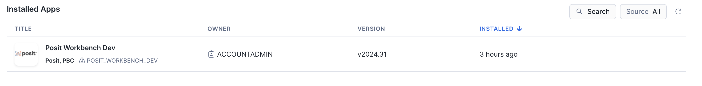

After clicking on the app, you will see a page with configuration instructions and a blue `Launch app` button.


Click on `Launch app`. This should take you to the webpage generated for the Workbench application. You may be prompted to first login to Snowflake using your regular credentials or authentication method.

### Create a VS Code Session 

Posit Workbench provides several IDEs, including VS Code, RStudio Pro, and JupyterLab. For this analysis we will use VS Code.

#### Step 1: New Session

Within Posit Workbench, click `New Session` to launch a new session.

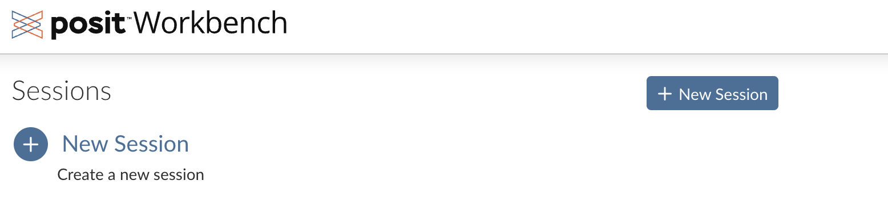

#### Step 2: Select an IDE

When prompted, select VS Code.

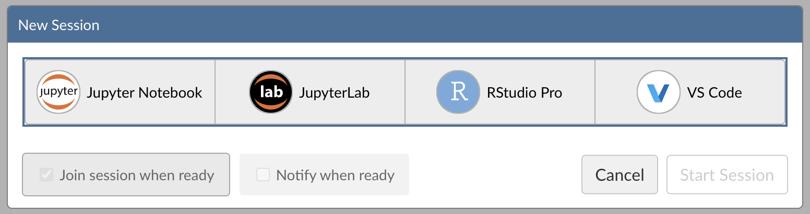

#### Step 3: Log into your Snowflake account

Next, connect to your Snowflake account from within Posit Workbench.
Under `Session Credentials`, click the button with the Snowflake icon to sign in to Snowflake.
Follow the sign in prompts.

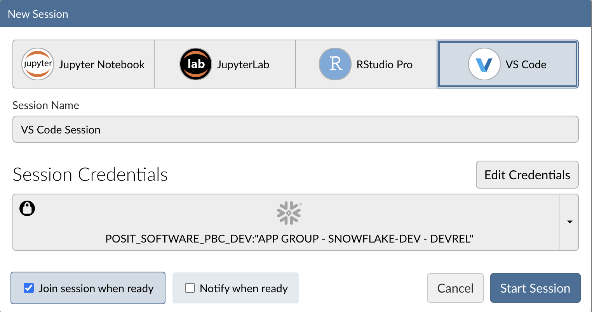

When you're successfully signed in to Snowflake, the Snowflake button will turn blue
and there will be a check mark in the upper-left corner.

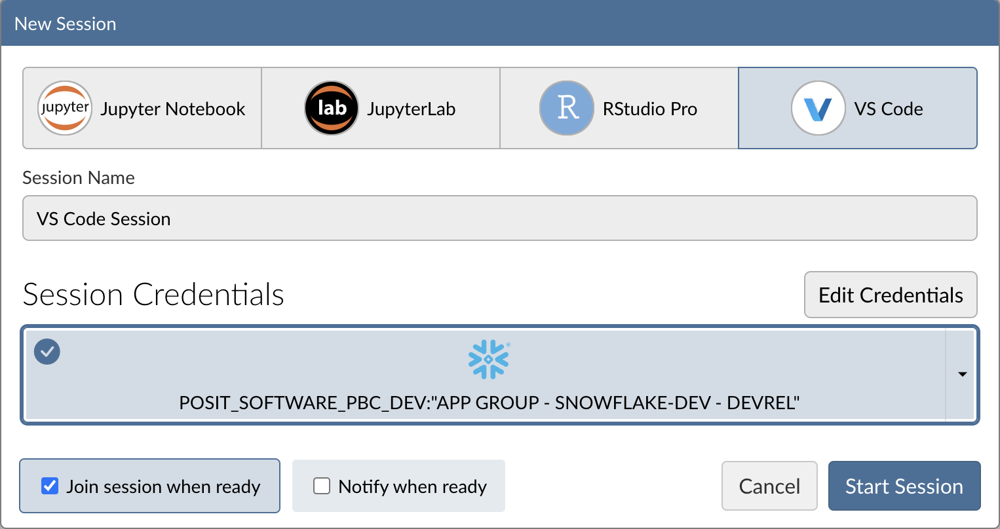


#### Step 4: Launch VS Code

Click `Start Session` to launch VS Code.

You will now be able to work with your Snowflake data
in VS Code. Since the IDE is provided by the Posit Workbench Native App, 
your entire analysis will occur securely within Snowflake.

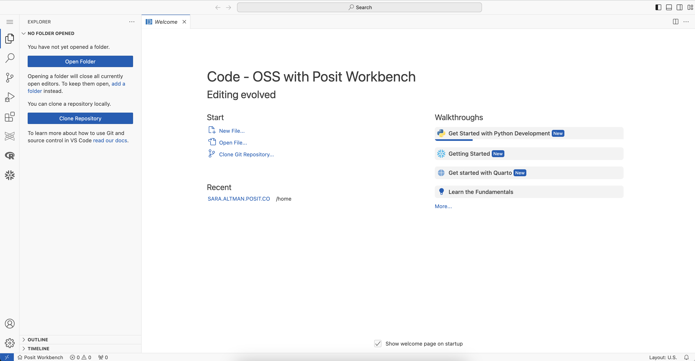

#### Step 5: Install Quarto, Shiny, and Jupyter Extensions

The Quarto and Shiny VS Code Extensions support the development 
of Quarto documents and Shiny apps in VS Code. The Jupyter extension provides 
support for running Python code in notebook cells

Install these extensions:

1. **Open the VS Code Extensions view.** On the right-hand side of VS Code, click
the Extensions icon in the Activity bar to open the Extensions view.
2. **Search for "Quarto"** to find the Quarto extension. 

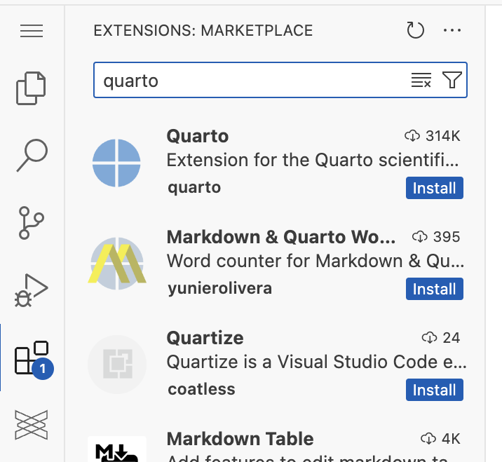


3. **Install the Quarto extension.** Click on the Quarto extension, then click `Install`.
4. **Install the Shiny extension.** Search for the Shiny extension, then install 
the extension in the same way. 
4. **Install the Jupyter extension.** Search for the Jupyter extension, then install 
the extension in the same way. 

You can learn more about these extensions here: [Shiny extension](https://shiny.posit.co/blog/posts/shiny-vscode-1.0.0/), 
[Quarto extension](https://quarto.org/docs/tools/vscode.html).

#### Step 6: Access the Quickstart Materials

This Quickstart will step you through the analysis contained in <https://github.com/posit-dev/snowflake-posit-quickstart-python/blob/main/quarto.qmd>.
To follow along, you can either clone the GitHub repo or download the materials from
our public S3 bucket. 

Run the following Python code in VS Code to download the files from the S3
bucket:

```python
import requests
import os

filenames = [
    "quarto.qmd",
    "requirements.txt",
    "app/app.py",
    "app/www/heart.png"
]

base_url = "https://posit-snowflake-mlops.s3.us-east-2.amazonaws.com/snowflake-posit-quickstart-python-main/"

for name in filenames:
    url = base_url + name
    local_path = name  

    dir_path = os.path.dirname(local_path)
    if dir_path:  
        os.makedirs(dir_path, exist_ok=True)

    response = requests.get(url)
    response.raise_for_status()  
    with open(local_path, "wb") as f:
        f.write(response.content)
```

This will also download a `requirements.txt` file with the necessary libraries for
this guide.
  
### Create a virtual environment

Create a virtual environment and install dependencies from the provided `requirements.txt` file:

1. Open the Command Palette (`Ctrl/Cmd+Shift+P`), then search for "Python: Create Environment".
2. Select `Venv` to create a `.venv` virtual environment. 
3. Select a Python version to use for the environment.
4. When prompted to select dependencies to install, select `requirements.txt`. If you don’t see this prompt, open a terminal and run `pip install -r requirements.txt` after the environment is created.
5. Click `OK`. VS Code will install the required packages and create a virtual environment in your current working directory.

See the [Python Environments in VS Code](https://docs.posit.co/ide/server-pro/user/vs-code/guide/python-environments.html) section of the Posit Workbench User Guide to learn more about Python environments in Posit Workbench. 

## Build Reports and Dashboards with Quarto
Duration: 2

Before we dive into the specifics of the code, let's first discuss Quarto. We've written our analysis in a Quarto (`.qmd`) document, [quarto.qmd](https://github.com/posit-dev/snowflake-posit-quickstart-r/blob/main/quarto.qmd). [Quarto](https://quarto.org/)
is an open-source publishing system that makes it easy to create
[data products](https://quarto.org/docs/guide/) such as
[documents](https://quarto.org/docs/output-formats/html-basics.html),
[presentations](https://quarto.org/docs/presentations/),
[dashboards](https://quarto.org/docs/dashboards/),
[websites](https://quarto.org/docs/websites/),
and
[books](https://quarto.org/docs/books/).

By placing our work in a Quarto document, we've interwoven all of our code, results, output, and prose text into a single literate programming document.
This way everything can travel together in a reproducible data product.

A Quarto document can be thought of as a regular markdown document,
but with the ability to run code chunks.

You can run any of the code chunks by clicking the `Run Cell` button above the chunk
in VS Code.

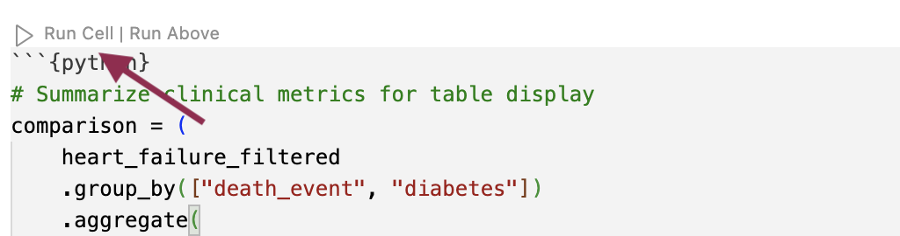

When you run a cell, cell output is displayed in the Jupyter interactive console.

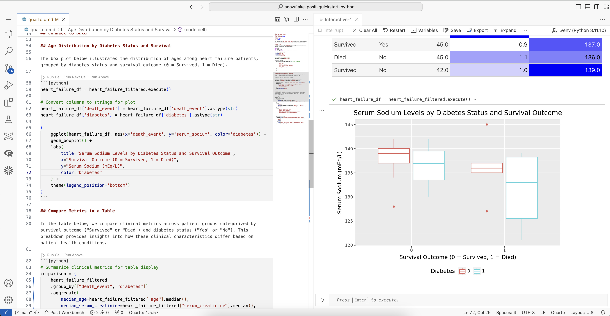

To render and preview the entire document, click the `Preview` button
or run `quarto preview quarto.qmd` from the terminal. 

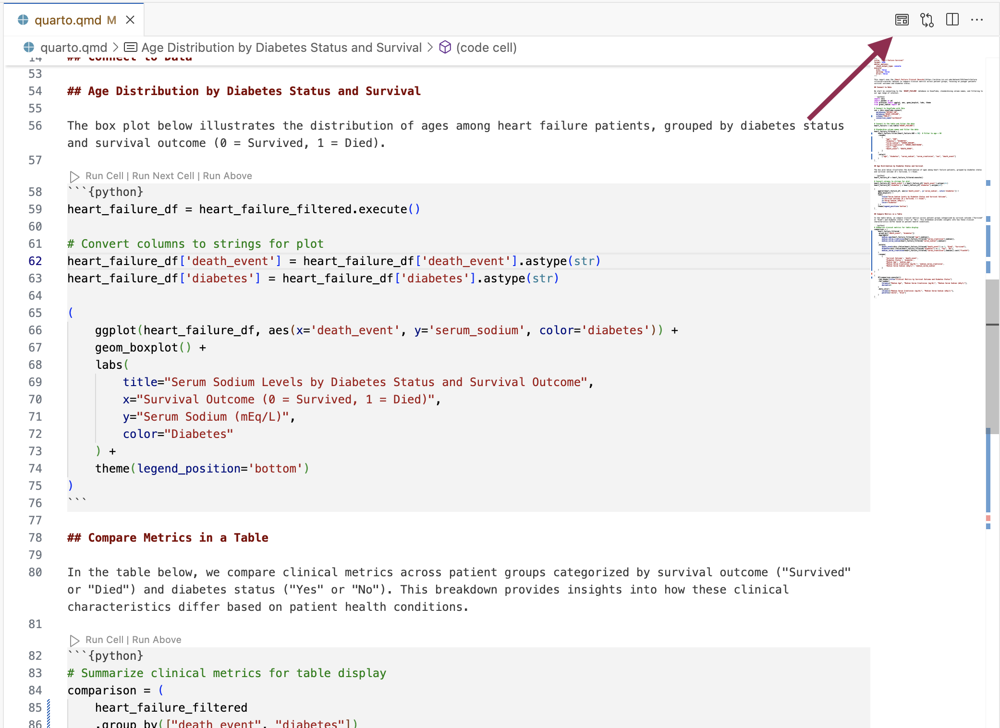

This will run all the code in the document from top to bottom and
and generate an HTML file, by default, for you to view and share.

### Learn More about Quarto

You can learn more about Quarto here: <https://quarto.org/>,
and the documentation for all the various Quarto outputs here: <https://quarto.org/docs/guide/>.
Quarto works with Python, R, and Javascript Observable code out-of-the box,
and is a great tool to communicate your data science analyses.

## Access Snowflake data from Python
Duration: 5

Now, let's take a closer look at the code in our Quarto document. Our code will run
in our Python environment, but will use data stored in our database on Snowflake.

To access this data, we'll use the Ibis library to connect to the database and
query the data from Python, without having to write raw SQL. 
Let's take a look at how this works.

### Connect with Ibis

[Ibis](https://ibis-project.org/) is an open source dataframe library that works with a wide variety of backends, 
including Snowflake.

First, we import `ibis`, then use `ibis.snowflake.connect` to connect to the Snowflake 
database. We need to provide a `warehouse` for compute and a `database` to connect to.
We can also provide a `schema` here to make connecting to specific tables easier.

```python
import ibis 

con = ibis.snowflake.connect(
  warehouse="DEFAULT_WH",  # CHANGE TO YOUR OWN WAREHOUSE NAME 
  database="HEART_FAILURE",  
  schema="PUBLIC",
  connection_name="workbench"
)
```

The variable `con` now stores our connection. 

> aside negative
> 
> You may need to change  `warehouse`, `database`, and `catalog` to reflect your
available warehouses and database name. 

### Create a table that corresponds to a table in the database

Once we build a connection, we can use `table()` to create an Ibis [table expression](https://ibis-project.org/reference/expression-tables#:~:text=A%20table%20expression%20contains%20an,new%20Table%20with%20those%20changes) that represents the database table.

```python
heart_failure = con.table("HEART_FAILURE")
```

### Rely on Ibis to translate Python to SQL

We can now use Ibis to interact with `heart_failure`. For example, 
we can filter rows and rename and select columns.

```python
heart_failure_filtered = (
    heart_failure.filter(heart_failure.AGE < 50)  
    .rename(
        {
            "age": "AGE",
            "diabetes": "DIABETES",
            "serum_sodium": "SERUM_SODIUM",
            "serum_creatinine": "SERUM_CREATININE",
            "sex": "SEX",
            "death_event": "DEATH_EVENT",
        }
    )
    .select(
        ["age", "diabetes", "serum_sodium", "serum_creatinine", "sex", "death_event"]
    )
)
```

Right now, `heart_failure_filtered` is still a [table expression](https://ibis-project.org/reference/expression-tables). 
Ibis lazily evaluates commands, which means that the full query is never run on 
the database unless explicitly requested.

Use `.execute()` or `.to_pandas()` to force Ibis to compile the table expression
into SQL and run that SQL on Snowflake. 

```python
heart_failure_filtered.execute()
```

If we want to see the SQL code that Ibis generates, we can run `ibis.to_sql()`.

```python
ibis.to_sql(heart_failure_filtered)
```

```
SELECT
  "t0"."AGE" AS "age",
  "t0"."DIABETES" AS "diabetes",
  "t0"."SERUM_SODIUM" AS "serum_sodium",
  "t0"."SERUM_CREATININE" AS "serum_creatinine",
  "t0"."SEX" AS "sex",
  "t0"."DEATH_EVENT" AS "death_event"
FROM "HEART_FAILURE" AS "t0"
WHERE
  "t0"."AGE" < 50
```

### In summary

This system:

1. Keeps our data in the database, saving memory in the Python session.
2. Pushes computations to the database, saving compute in the Python session.
3. Evaluates queries lazily, saving compute in the database.

We don't need to manage the process, it happens automatically behind the scenes.

You can learn more about Ibis [here](https://ibis-project.org/). Take a look at the 
[Snowflake backend documentation](https://ibis-project.org/backends/snowflake) to
learn more about using Ibis to interact with 
Snowflake specifically. 

## Write to a Snowflake database
Duration: 1

You can also use Ibis to create a new table in a database or append to an existing table.

To add a new table, use `create_table()`.

```python
con.create_table("HEART_FAILURE_FILTERED", heart_failure_filtered)
```

To insert data into an existing table, use [`insert()`](https://ibis-project.org/backends/snowflake#ibis.backends.snowflake.Backend.insert). 

Now that we understand how to interact with our database, we can use Python to perform our analysis.

## Prepare data with Ibis
Duration: 5

We want to understand which variables in `HEART_FAILURE` are associated with survival
of patients with heart failure.

First, we convert the column names to lowercase so we won't need to worry about capitalization.

```python
heart_failure = heart_failure.rename(
    {
        "age": "AGE",
        "diabetes": "DIABETES",
        "serum_sodium": "SERUM_SODIUM",
        "serum_creatinine": "SERUM_CREATININE",
        "sex": "SEX",
        "death_event": "DEATH_EVENT",
    }
)
```


### Filter ages

For now, we'll focus on patients younger than 50. We also reduce the data to just the columns we're interested in.

```python
heart_failure_filtered = (
    heart_failure
    .filter(heart_failure.age < 50)  # Filter to age < 50
    .select(["age", "diabetes", "serum_sodium", "serum_creatinine", "sex", "death_event"])
)
```

> aside positive
> 
> By default, Ibis is in _deferred mode_ and lazily evaluates table expressions. To more easily interact with your tables and see the results of your code, you can turn on _interactive code_. In [interactive mode](https://ibis-project.org/how-to/configure/basics#interactive-mode), expressions are executed when printed to the console. Turn on interactive mode with `ibis.options.interactive = True`. 

## Visualize Data with `plotnine`
Duration: 5

The heart failure data provides important insights that can help us:

- Identify factors associated with increased risk of mortality after heart failure.
- Predict future survival outcomes based on historical clinical data.
- Benchmark patient outcomes based on clinical indicators like serum sodium levels.

Visualizing clinical variables across different patient groups can help identify patterns.

### Visualize serum sodium levels

We can use [plotnine](https://plotnine.org/) to visually compare sodium levels across different patient groups. In this plot, we see the distribution of serum sodium based on whether the patients have diabetes and whether they survived (`0`) or died (`1`) during the follow-up period.

```r
from plotnine import ggplot, aes, geom_boxplot, labs, theme

heart_failure_plot = (
    heart_failure_filtered
    .mutate(
        death_event=heart_failure_filtered["death_event"].cast("string"),
        diabetes=heart_failure_filtered["diabetes"].cast("string")
    )
)

(
    ggplot(heart_failure_plot, aes(x="death_event", y="serum_sodium", color="diabetes")) +
    geom_boxplot() +
    labs(
        title="Serum Sodium Levels by Diabetes Status and Survival Outcome",
        x="Survival Outcome (0 = Survived, 1 = Died)",
        y="Serum Sodium (mEq/L)",
        color="Diabetes"
    ) +
    theme(legend_position="bottom")
)
```

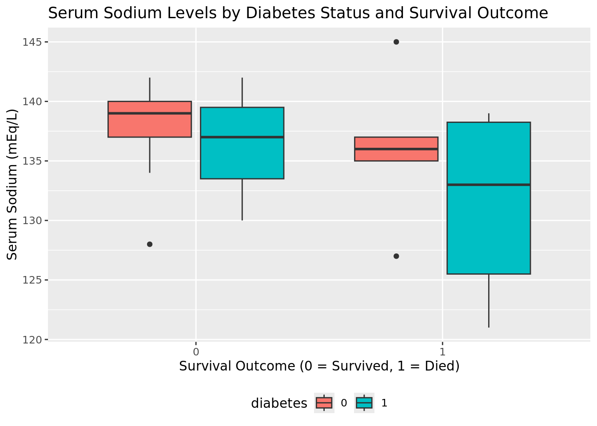

## Make publication-ready tables with Great Tables
Duration: 5

Next, we'll use Ibis to calculate the median values for various clinical metrics across different patient groups.

```python
(
    heart_failure_filtered
    .group_by(["death_event", "diabetes"])
    .aggregate(
        median_age=heart_failure_filtered["age"].median(),
        median_serum_creatinine=heart_failure_filtered["serum_creatinine"].median(),
        median_serum_sodium=heart_failure_filtered["serum_sodium"].median()
    )
)
```

This is a useful way to examine the information for ourselves. However, if we wish to share the information with others, we might prefer to present the table in a more polished format. We can do this with the [Great Tables](https://posit-dev.github.io/great-tables/articles/intro.html) package.

The following code prepares a table named `comparison`, which we'll display with Great Tables. 

```python
comparison = (
    heart_failure_filtered
    .group_by(["death_event", "diabetes"])
    .aggregate(
        median_age=heart_failure_filtered["age"].median(),
        median_serum_creatinine=heart_failure_filtered["serum_creatinine"].median(),
        median_serum_sodium=heart_failure_filtered["serum_sodium"].median()
    )
    .mutate(
        death_event=ibis.ifelse(heart_failure_filtered["death_event"] == 1, "Died", "Survived"),
        diabetes=ibis.ifelse(heart_failure_filtered["diabetes"] == 1, "Yes", "No"),
        median_serum_creatinine=heart_failure_filtered["serum_creatinine"].median().cast("float64")
    )
    .rename(
        {
            "Survival Outcome": "death_event",
            "Diabetes Status": "diabetes",
            "Median Age": "median_age",
            "Median Serum Creatinine (mg/dL)": "median_serum_creatinine",
            "Median Serum Sodium (mEq/L)": "median_serum_sodium"
        }
    )
)
```

Next, we use `GT()` and other Great Tables functions to create and style a table that displays `comparison`. Note that we need to evaluate `comparison` with `.execute()` first because `GT()` only accepts Pandas or Polars DataFrames.

```python
from great_tables import GT

(
    GT(comparison.execute())
    .tab_header(title="Clinical Metrics by Survival Outcome and Diabetes Status")
    .fmt_number(
        columns=["Median Age", "Median Serum Creatinine (mg/dL)", "Median Serum Sodium (mEq/L)"],
        decimals=1
    )
    .data_color(
        columns=["Median Serum Creatinine (mg/dL)", "Median Serum Sodium (mEq/L)"],
        palette=["white", "blue"]
    )
)
```

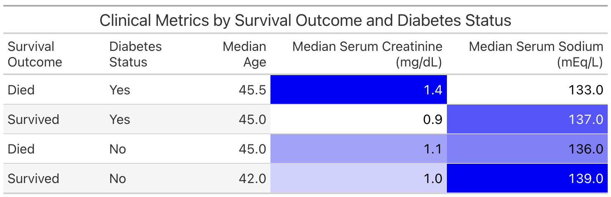

## Shiny Application
Duration: 2

Earlier, we showed you how to render a report from our Quarto document. Another way 
to share our work and allow others to explore the heart failure dataset is to create an
interactive [Shiny](https://shiny.posit.co/) app. 

Our GitHub repository contains an [example Shiny app](https://github.com/posit-dev/snowflake-posit-quickstart-python/tree/main/app).
This app allows the user
to explore different clinical metrics in one place.

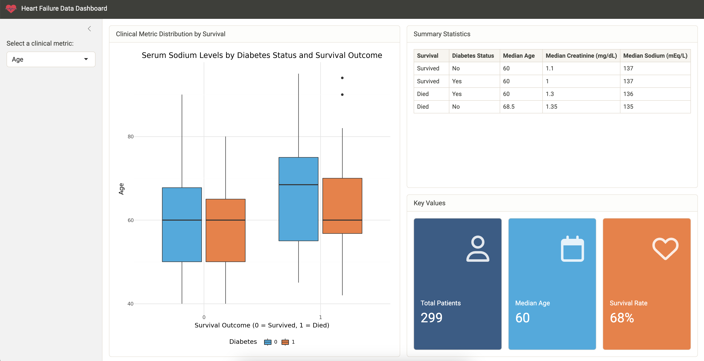

To run the app, open `app/app.py` and then click the `Run Shiny App` button at the 
top of the script in VS Code.

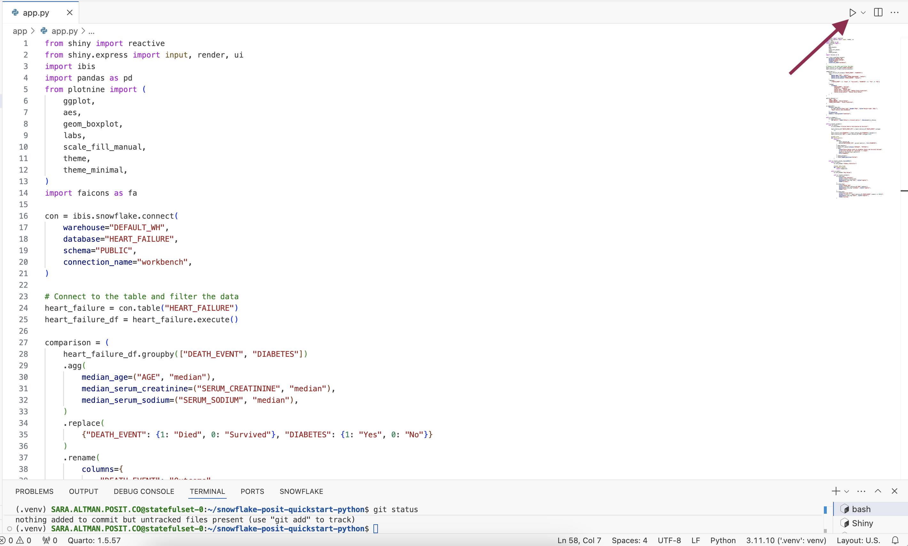

After launching the app, use the sidebar to change the metric displayed.

### Learn More About Shiny

You can learn more about Shiny at: <https://shiny.posit.co/>.

If you're new to Shiny, you can try it online with
[shinylive](https://shinylive.io/py/examples/). 
Shinylive is also available for [R](https://shinylive.io/r/examples/) for Shiny for R.

## Conclusion and Resources
Duration: 2

### Conclusion

Python is a powerful, versatile tool for data science, and combined with Snowflake's high-performance data capabilities, it enables robust, end-to-end data workflows. Using the Posit Workbench Native Application, you can securely work with Python _within Snowflake_ while taking advantage of tools like Ibis, Quarto, and Shiny for Python to analyze, visualize, and share your results.

### What You Learned

- How to use VS Code within the Posit Workbench Native App.
- How to connect to your Snowflake data from Python to create tables, visualizations, and more.
- How to create a Quarto document containing plots and tables built in Python, using data stored in Snowflake.
- How to build an interactive Shiny for Python application, working with data stored in Snowflake.

### Resources

- [Source Code on GitHub](https://github.com/posit-dev/snowflake-posit-quickstart-python)
- [More about Posit Workbench](https://posit.co/products/enterprise/workbench/)
- [Ibis library website](https://ibis-project.org/)
- [plotnine package for plotting with a grammar of graphics in Python](https://plotnine.readthedocs.io/)
- [Great Tables package for publication-ready tables in Python](https://posit-dev.github.io/great-tables/)
- [Quarto for reproducible documents, reports, and data products](https://quarto.org/)
- [Shiny for interactive dashboards and applications](https://shiny.posit.co/)
- [Run Shiny entirely in the browser with shinylive](https://shinylive.io/)