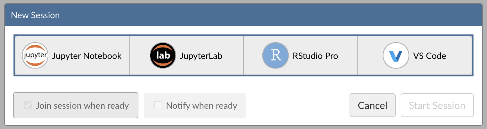
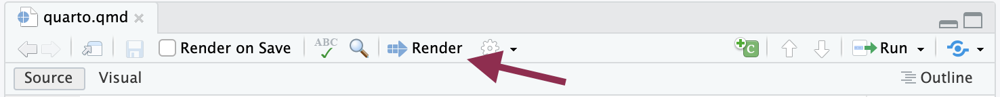

author: Daniel Chen
id: analyze_data_with_r_using_posit_workbench_and_snowflake
summary: Analyze Data with R using Posit Workbench and Snowflake
categories: Getting-Started
environments: web
status: Published
feedback link: https://github.com/Snowflake-Labs/sfguides/issues
tags: Getting Started, Data Science, R, Posit Workbench, Native Applications

#  Analyze Data with R using Posit Workbench and Snowflake

## Overview
Duration: 1

This guide will show you how to use the R language to analyze data stored in Snowflake. It will take you through the process of setting up an R environment in an RStudio Pro IDE, which comes with the Posit Workbench Native App in Snowflake. It will also show you how to use R's `{dbplyr}` interface to translate R code into SQL where it can be run within a Snowflake database, which is an environment that provides more memory and compute power than the typical R environment.

We will explore a financial service use case of analyzing web traffic to identify market opportunities.

First, we will procure free data from the Snowflake Marketplace and load it into Snowflake. The data contains metrics collected by the Web Traffic Foundation and made available by Cybersyn. We will then launch an R session and access the data from R, where we will clean, transform, and plot the data, preparing both an HTML report and an interactive Shiny app of our analysis. We will also demonstrate how to write into a Snowflake database from R. In this way, the guide will show you how to do an end-to-end R analysis _entirely within Snowflake_.


### What You'll Need

- Familiarity with R
- The ability to launch Posit Workbench from Snowflake Native Applications. This can be provided by an administrator with the `accountadmin` role.

### What You’ll Learn

- How to create an R session within the RStudio Pro IDE that comes with the Posit Workbench Native App
- How to connect to your Snowflake data from R to create tables, visualizations, and more

### What You’ll Build

- An RStudio Pro IDE environment to use within Snowflake
- A Quarto document that contains plots and tables built with R, using data available in the Snowflake Marketplace.
- An interactive Shiny Application built with R, using data available in the Snowflake Marketplace

Along the way, you will use R to analyze trends in web traffic for the websites of large corporations.
You can follow along with this quickstart guide,
or look at the materials provided in the accompanying repository:
<https://github.com/posit-dev/snowflake-posit-quickstart-r>.

## Setup
Duration: 3

Before we begin there are a few components we need to get ready. We need to:

- Get our data from the Snowflake Marketplace
- Launch the Posit Workbench Native App
- Create an RStudio Pro IDE session
- Install R Packages

### Get our data from the Snowflake Marketplace

For this analysis, we will use the `Web Traffic Foundation (Experimental)` database from Cybersyn, which is available for free in the Snowflake Marketplace.

#### Step 1: Navigate to the Marketplace

In your Snowflake account, Go to `Data Products` > `Marketplace` to open the marketplace.


#### Step 2: Search for the Data

You can search for `cybersyn` and look for the `Web Traffic Foundation (Experimental)` database.


#### Step 3: Add the Database to Your Snowflake Account

Once your find the database, you can load it into your Snowflake account by clicking the Get button on the right-hand side.


#### Step 4: Confirm Database

If everything is set up properly, you should see the database by navigating to:
`Data` > `Database`. The database will appear as `WEB_TRAFFIC_FOUNDATION_EXPERIMENTAL`. The tables we will use are available in the `CYBERSYN` schema.
You can see the tables (views) under the `Views` dropdown.


Cybersyn makes its data available as views. We will be mostly working with the `WEBTRAFFIC_SYNDICATE_TIMESERIES` view.
We also need the `WEBTRAFFIC_SYNDICATE_ATTRIBUTES` view so we can work with the type of count data easier.

> A "view" is a saved SQL query that returns a table. Think of it as a way to save a SQL query and have it masquerade around like a table.

### Launch Posit Workbench

We can then start our data exploration using Posit Workbench.
You can find Posit Workbench as a Snowflake Native Application,
and use it to connect to your database.

#### Step 1: Navigate to Apps

In your Snowflake account, Go to `Data Products` > `Apps` to open the Native Apps collection. If Posit Workbench is not already installed, click `Get`.


#### Step 2: Open the Posit Workbench Native App

Once Posit Workbench is installed, click on the app under `Installed Apps` to launch the app. If you do not see the Posit Workbench app listed, ask you Snowflake account administrator for access to the app.


After clicking on the app, you will see a page with installation and configuration instructions.


Scroll down to the `Debug` section, then click `List Endpoints`. Click on the endpoint URL to open the Posit Workbench app.


### Create an RStudio Pro Session

Posit Workbench provides several IDEs, such as RStudio Pro, JupyterLab, and VS Code. For this analysis we will use an RStudio Pro IDE.

#### Step 1: New Session

Within Posit Workbench, click `New Session` to launch a new session to spin up your coding environment.


#### Step 2: Select an IDE

When prompted, select the RStudio Pro IDE.



#### Step 3: Log into your Snowflake account

Next, connect to your Snowflake account from within Posit Workbench.
Click on `Sign In` in the Snowflake section,
and follow the sign in prompts.


#### Step 4: Launch the RStudio Pro IDE

When the Snowflake authentication is successful,
you will be able to start your session.
Otherwise, the `Start Session` button will be greyed out.

Once everything is ready,
you will be able to work with your Snowflake data
in the familiar RStudio Pro IDE. Since the IDE is provided by the Posit Workbench Native App, your entire analysis will occur securely within Snowflake.


#### Step 5: Access the Quickstart Materials

This Quickstart will step you through the analysis contained in <https://github.com/posit-dev/snowflake-posit-quickstart-r/blob/main/quarto.qmd>.
To follow along, open the file in your RStudio Pro IDE. You could do this by:

1. **Simple copy-and-paste** Go to File > New File > Quarto Document and then copy the contents of [quarto.qmd](https://github.com/posit-dev/snowflake-posit-quickstart-r/quarto.qmd) into your new file.
2. **Starting a new project linked to the github repo.** To do this:

    1.  Go to File > New Project in the RStudio IDE menu bar.

    

    2.  Select Version Control in the New Project Wizard

    

    3.  Select Git

    

    4.  Paste the [URL]() of the github repo and click Create Project

    

    RStudio will clone a local copy of the materials on github. You can use the Files pane in the bottom right-hand corner of the IDE to navigate to `quarto.qmd`. Click on the file to open it.


### Install R Packages

Now that we're in a familiar R environment,
we need to prepare the packages we will use. For this analysis, we will use the [Tidyverse](https://www.tidyverse.org/) suite of packages, as well as a few others.

```r
install.packages(c("tidyverse", "DBI", "dbplyr", "gt", "gtExtras"))
```

We will also use the development version of the `{odbc}` package to connect to the Snowflake database.

```r
install.packages("pak")
pak::pak("r-dbi/odbc")
```

After we install the packages, we load them.

```r
library(tidyverse)
library(DBI)
library(dbplyr)
library(gt)
library(gtExtras)
library(odbc)
```

## Access Snowflake data from R
Duration: 5

We will run our code in the R environment created by the RStudio Pro IDE, but the code will use data stored in the `WEB_TRAFFIC_FOUNDATION_EXPERIMENTAL` database on Snowflake.

To access this data, we will use the `{DBI}` and `{odbc}` R packages to connect to the database. We will then use `{dplyr}` and `{dbplyr}` to query the data with R,
without having to write raw SQL. Let's take a look at how this works.

### Connect with `{DBI}`

`{DBI}` is an a R package that allows us to connect to databases with `DBI::dbConnect()`.

To connect to our Snowflake database, we will use a driver provided by the `{odbc}` package. We will need to provide a `warehouse` for compute, and a `database` to connect to.
We can also provide a `schema` here to make connecting to specific tables and views easier.

```r
# Connect to the database
conn <-
  DBI::dbConnect(
    drv = odbc::snowflake(),
    warehouse = "DEVREL_WH_LARGE",
    database = "WEB_TRAFFIC_FOUNDATION_EXPERIMENTAL",
    schema = "CYBERSYN"
  )
```

We will save our connection as an object, named `conn`, which will make it easy to use.

Once we build a connection, we can see the databases, schemas, and tables available to us in the RStudio IDE Connections pane. Click on the database icon to the right of a database to see its schemas. Click on the schema icon to the right of a schema to see its tables. Click on the table icon to the right of a table to see a preview of the table.


> The Connections pane displays the tables in a schema, but not the _views_ associated with those tables. Since Cybersyn provides its data as views, they will not appear here.

### Create `tbl`s that correspond to tables in the database

Once we build a connection, we can use `dplyr::tbl()` to create `tbl`s. A tbl is an R object that represents a table or view accessed through a connection.


```r
timeseries <- tbl(conn, "WEBTRAFFIC_SYNDICATE_TIMESERIES")
attributes <- tbl(conn, "WEBTRAFFIC_SYNDICATE_ATTRIBUTES")
```

> If we did not provide the `schema` argument into `DBI::dbConnect()` earlier, we would need to specify the view with `tbl(conn, in_schema("CYBERSYN", "WEBTRAFFIC_SYNDICATE_TIMESERIES"))`.

### Rely on `{dbplyr}` to translate R to SQL

We can now use `timeseries` and `attributes` as if they were tibbles in R. For example, we can filter rows and select columns from our data.

```r
facebook <-
  timeseries |>
  filter(
    DOMAIN_ID == "facebook.com",
    lubridate::month(DATE) == 5
  ) |>
  select(DATE, VARIABLE_NAME, VALUE)
```

When we use `tbl`s, `{dbplyr}` translates our R code into SQL queries. Think of any object made downstream from a tbl like a view: it contains SQL that represents a table built from the tbl. If we want to see the SQL code that `{dbplyr}` generates, we can run `dbplyr::show_query()`.

```r
facebook |>
  show_query()
```
```
SELECT "DATE", "VARIABLE_NAME", "VALUE"
FROM "WEBTRAFFIC_SYNDICATE_TIMESERIES"
WHERE ("DOMAIN_ID" = 'facebook.com') AND (EXTRACT('month', "DATE") = 5.0)
```

To save compute, R waits to execute a query until we request the data that it represents.

To save memory, R stores the data as a temporary file in the database (instead of in R's global environment). When we inspect the data, R only returns the first few rows of this file to display.

```r
facebook
```
```
# Source:   SQL [?? x 3]
# Database: Snowflake 8.16.0[@Snowflake/WEB_TRAFFIC_FOUNDATION_EXPERIMENTAL]
   DATE       VARIABLE_NAME                                                          VALUE
   <date>     <chr>                                                                  <dbl>
 1 2021-05-02 Sessions (Count) | Week | All Devices | Model version 2024.01.25 10016599466
 2 2021-05-09 Sessions (Count) | Week | All Devices | Model version 2024.01.25 10024864464
 3 2021-05-16 Sessions (Count) | Week | All Devices | Model version 2024.01.25  9948687298
 4 2021-05-23 Sessions (Count) | Week | All Devices | Model version 2024.01.25  9913216616
 5 2021-05-30 Sessions (Count) | Week | All Devices | Model version 2024.01.25  9886247565
 6 2022-05-01 Sessions (Count) | Week | All Devices | Model version 2024.01.25 12502175558
 7 2022-05-08 Sessions (Count) | Week | All Devices | Model version 2024.01.25 12140393116
 8 2022-05-15 Sessions (Count) | Week | All Devices | Model version 2024.01.25 12446181861
 9 2022-05-22 Sessions (Count) | Week | All Devices | Model version 2024.01.25 12436995354
10 2022-05-29 Sessions (Count) | Week | All Devices | Model version 2024.01.25 12418458176
# ℹ more rows
# ℹ Use `print(n = ...)` to see more rows
```

### `collect()`

We can trigger R to execute a query and to return the _entire_ result as a tibble with `dbplyr::collect()`. Keep in mind, that if your result is large, you may not want to collect it into R.

```r
facebook |> collect()
```
```
# A tibble: 42 × 3
   DATE       VARIABLE_NAME                                                            VALUE
   <date>     <chr>                                                                    <dbl>
 1 2021-05-02 Pageviews (Count) | Week | All Devices | Model version 2024.01.25  39917694787
 2 2021-05-09 Pageviews (Count) | Week | All Devices | Model version 2024.01.25  40870514816
 3 2021-05-16 Pageviews (Count) | Week | All Devices | Model version 2024.01.25  41073679841
 4 2021-05-23 Pageviews (Count) | Week | All Devices | Model version 2024.01.25  41184673335
 5 2021-05-30 Pageviews (Count) | Week | All Devices | Model version 2024.01.25  41837064266
 6 2022-05-01 Pageviews (Count) | Week | All Devices | Model version 2024.01.25  99321575179
 7 2022-05-08 Pageviews (Count) | Week | All Devices | Model version 2024.01.25  98206319156
 8 2022-05-15 Pageviews (Count) | Week | All Devices | Model version 2024.01.25 101792763304
 9 2022-05-22 Pageviews (Count) | Week | All Devices | Model version 2024.01.25 102066608868
10 2022-05-29 Pageviews (Count) | Week | All Devices | Model version 2024.01.25 103002669500
# ℹ 32 more rows
# ℹ Use `print(n = ...)` to see more rows
```

### In summary

This system:

1. Keeps our data in the database, saving memory in the R session
2. Pushes computations to the database, saving compute in the R session
3. Evaluates queries lazily, saving compute in the database

We don't need to manage the process, it happens automatically behind the scenes.

> `{dbplyr}` can translate the most common tidyverse and base R functions to SQL. However, you may sometimes use a function that `{dbplyr}` does not recognize or for which there is no SQL analogue. On these occasions, you will need to `collect()` your data into R, where you can process it as a real tibble.

Learn more about `{dbplyr}` at [dbplyr.tidyverse.org](https://dbplyr.tidyverse.org/)

## Write to a Snowflake database
Duration: 1

You can also use `{DBI}` to create a new table in a database or append to an existing table.

To add a new table, use `DBI::dbWriteTable()`. The Cybersyn database doesn't allow creating new tables, but the following code demonstrates how we would add a data frame `df` to a different connection.

```r
dbWriteTable(conn2, name = "new_table", value = df)
```

To append to an existing table, specify `append = TRUE`. If appending, `name` should specify an existing table.

```r
dbWriteTable(conn2, name = "existing_table", value = df, append = TRUE)
```

Now that we understand how R will interact with the database, we can use R to perform our analysis.

## Prepare data with `{dplyr}`
Duration: 5

We want to compare the pageviews, users, and sessions over time for a few popular websites. This information is split between the `timeseries` and `attributes` tables. Before we begin, we will need to join and clean the tables.

First we standardize column names, so we won't need to worry about capitalization.

```r
# Standardize column names
timeseries <- timeseries |> rename_with(str_to_lower)
attributes <- attributes |> rename_with(str_to_lower)
```

### Combine Tables

Then we join the tables, matching rows based on their values of `variable` and `variable_name`, which are shared across the tables.

```r
# Join to make complete table
timeseries <-
  timeseries |>
  left_join(
    attributes,
    by = join_by(variable, variable_name)
  )
```

Our combined `timeseries` table will look like this:

```
> timeseries
# Source:   SQL [?? x 12]
# Database: Snowflake 8.15.0[@Snowflake/WEB_TRAFFIC_FOUNDATION_EXPERIMENTAL]
   domain_id         geo_id geo_name variable variable_name date        value measure unit  frequency device
   <chr>             <chr>  <chr>    <chr>    <chr>         <date>      <dbl> <chr>   <chr> <chr>     <chr>
 1 larepubliquedesp… World… Worldwi… pagevie… Pageviews (C… 2021-11-14 3.83e6 Pagevi… Count Week      All D…
 2 larepubliquedesp… World… Worldwi… pagevie… Pageviews (C… 2021-11-21 2.85e7 Pagevi… Count Week      All D…
 3 larepubliquedesp… World… Worldwi… pagevie… Pageviews (C… 2021-11-28 2.61e7 Pagevi… Count Week      All D…
 4 larepubliquedesp… World… Worldwi… pagevie… Pageviews (C… 2021-12-05 3.65e7 Pagevi… Count Week      All D…
 5 larepubliquedesp… World… Worldwi… pagevie… Pageviews (C… 2021-12-12 3.80e7 Pagevi… Count Week      All D…
 6 larepubliquedesp… World… Worldwi… pagevie… Pageviews (C… 2021-12-19 1.38e7 Pagevi… Count Week      All D…
 7 larepubliquedesp… World… Worldwi… pagevie… Pageviews (C… 2021-12-26 2.31e7 Pagevi… Count Week      All D…
 8 larepubliquedesp… World… Worldwi… pagevie… Pageviews (C… 2022-01-02 6.40e6 Pagevi… Count Week      All D…
 9 larepubliquedesp… World… Worldwi… pagevie… Pageviews (C… 2022-01-09 1.72e7 Pagevi… Count Week      All D…
10 larepubliquedesp… World… Worldwi… pagevie… Pageviews (C… 2022-01-16 1.50e7 Pagevi… Count Week      All D…
# ℹ more rows
# ℹ 1 more variable: model_version <chr>
# ℹ Use `print(n = ...)` to see more rowss
```

### Filter Domains

The data contains information about `67,671` distinct websites, but we are only interested in a few of them. To make our lives easier, we filter the data to just the domains we are interested in. We also reduce the data to just the columns we are interested in.

```r
top_domains <-
  c(
    "youtube.com",
    "google.com",
    "facebook.com",
    "tiktok.com",
    "instagram.com",
    "airbnb.com",
    "vrbo.com",
    "lyft.com",
    "uber.com"
  )

timeseries <-
  timeseries |>
  filter(domain_id %in% top_domains) |>
  select(domain_id, date, measure, value) # selects columns
```

> **_INTERACTIVITY NOTE:_**  We are reducing the list of domains here so we can easily compare between a few of the domains.
> A user may want to choose their own set of domain names to compare.

### Reshape the table

Finally, to make the table easier to work with, we move values of `pageviews`, `users`, and `sessions` into their own columns.

```r
timeseries <-
  timeseries |>
  pivot_wider(names_from = measure, values_from = value) |>
  rename_with(str_to_lower)
```

Our table now looks like this.

```
> timeseries
# Source:   SQL [?? x 5]
# Database: Snowflake 8.15.0[@Snowflake/WEB_TRAFFIC_FOUNDATION_EXPERIMENTAL]
   domain_id   date          pageviews      users    sessions
   <chr>       <date>            <dbl>      <dbl>       <dbl>
 1 airbnb.com  2022-02-27    171313810   15433961    26568865
 2 youtube.com 2022-07-17 262185037173 2472788560 21915523137
 3 youtube.com 2023-12-17 340737187803 3083645673 32503255500
 4 youtube.com 2023-07-09 236276769477 2857094928 27375541301
 5 youtube.com 2023-10-15 263861379113 2976403065 28240902614
 6 uber.com    2022-08-07      5158044    2189269     2548854
 7 uber.com    2022-08-28      5203070    2024092     2451623
 8 uber.com    2023-06-18      5920585    2244755     3118792
 9 vrbo.com    2022-02-06     45043973    4594557     7508303
10 tiktok.com  2021-07-25  43315325647  817664398  1887858571
# ℹ more rows
# ℹ Use `print(n = ...)` to see more rows
```

> When we are running these commands on a data base connection, `{dbplyr}` is translating the code into SQL for us under the hood.
> We don't need to write raw SQL commands, and the compute is happening directly on the database.
> You can pipe `|>` the code into `show_query()` if you want to see the generated SQL query.


## Visualize Data with `{ggplot2}`
Duration: 5

The Cybersyn data provides signals that can help us:

- Monitor changes in consumer behavior and market dynamics
- Identify web market whitespace and addressable market
- Benchmark web performance against peers and competitors
- Forecast future demand based on historical web traffic

One of the best ways to spot those signals is to visualize the performance of web domains over time.

### Visualize pageviews

We can use `{ggplot2}` to visually compare the web traffic of two domains over time. Here we can see that, since 2021, `airbnb.com` has always been more popular than `vrbo.com`,
but page views for both really started to take off in 2024.

```r
domains <- c("airbnb.com", "vrbo.com")

timeseries |>
  filter(domain_id %in% domains) |>
  ggplot(aes(date, pageviews, color = domain_id)) +
  geom_line() +
  scale_y_log10() +
  theme_minimal() +
  theme(legend.position="bottom") +
  labs(
    x = "",
    y = "",
    color = "",
    title = "Pageviews"
  )
```


> **_INTERACTIVITY NOTE:_**  We've written the code above to make it simple to visualize
> other domains. A user can store one or more new values to `domains` and then rerun the code.

## Make publication-ready tables with `{gt}`
Duration: 5

We can continue to explore our data with visualizations, or we can make a table that concisely displays multiple pieces of information at once. For example, we can use `{dplyr}` verbs to identify the median number of weekly pageviews, users, and session for our top domains.

```r
timeseries |>
  summarize(
    across(
      c("pageviews", "users", "sessions"),
      \(x) median(x, na.rm = TRUE),
      .names = "avg_{.col}"
    )
  )
```

```
# Source:   SQL [1 x 3]
# Database: Snowflake 8.15.0[@Snowflake/WEB_TRAFFIC_FOUNDATION_EXPERIMENTAL]
  avg_pageviews  avg_users avg_sessions
          <dbl>      <dbl>        <dbl>
1   15814434389 319991480.  1190998470.
```

With `{dplyr}`'s `group_by()` command, we can compute separate metrics for each domain.

```r
comparison <-
  timeseries |>
  group_by(domain_id) |>
  summarize(
    across(
      c("pageviews", "users", "sessions"),
      \(x) median(x, na.rm = TRUE),
      .names = "avg_{.col}"
    ),
    .groups = "drop"
  )  |>
  arrange(desc(avg_pageviews))

comparison
```

```
# Source:     SQL [9 x 4]
# Database:   Snowflake 8.15.0[@Snowflake/WEB_TRAFFIC_FOUNDATION_EXPERIMENTAL]
# Ordered by: desc(avg_pageviews)
  domain_id     avg_pageviews   avg_users avg_sessions
  <chr>                 <dbl>       <dbl>        <dbl>
1 google.com    222944428888  3373207378  27864010868.
2 youtube.com   217373542132. 2535250883  22623754428
3 facebook.com  114193789484. 2205116942. 12941002565
4 tiktok.com     50081097228  1105659086.  2691429058.
5 instagram.com  16405246854.  319991480.  1190998470.
6 airbnb.com       312666776.   15437368.    27302062.
7 vrbo.com          36548417     4173328.     6663558.
8 uber.com           5472395     2133430.     2598333
9 lyft.com           5251633     1660472.     2321456
```

Here we see, among other things, that `youtube.com` receives almost as many pageviews as google.com, but from a much smaller set of users.

This is a useful way to examine the information for ourselves. However, if we wish to share the information with others, we might prefer to present the table in a more polished format. We can do this with commands from R's [`{gt}` package](https://gt.rstudio.com/).

The following code creates a table displaying the information in `comparison` and highlighting the two domains we investigated in the previous section.

```r
comparison |>
  gt(rowname_col = "domain_id") |>
  fmt_number(suffixing = TRUE, decimals = 0) |>
  cols_label(
    avg_pageviews = "Pageviews",
    avg_users = "Users",
    avg_sessions = "Sessions"
  ) |>
  gt_highlight_rows(
    rows = (domain_id == "airbnb.com"),
    fill = "#ffce67"
  ) |>
  gt_highlight_rows(
    rows = (domain_id == "vrbo.com"),
    fill = "#78c2ad"
  )
```

<div id="dyuxjdungs" style="padding-left:0px;padding-right:0px;padding-top:10px;padding-bottom:10px;overflow-x:auto;overflow-y:auto;width:auto;height:auto;">

  <table class="gt_table" data-quarto-disable-processing="false" data-quarto-bootstrap="false" style="-webkit-font-smoothing: antialiased; -moz-osx-font-smoothing: grayscale; font-family: system-ui, 'Segoe UI', Roboto, Helvetica, Arial, sans-serif, 'Apple Color Emoji', 'Segoe UI Emoji', 'Segoe UI Symbol', 'Noto Color Emoji'; display: table; border-collapse: collapse; line-height: normal; margin-left: auto; margin-right: auto; color: #333333; font-size: 16px; font-weight: normal; font-style: normal; background-color: #FFFFFF; width: auto; border-top-style: solid; border-top-width: 2px; border-top-color: #A8A8A8; border-right-style: none; border-right-width: 2px; border-right-color: #D3D3D3; border-bottom-style: solid; border-bottom-width: 2px; border-bottom-color: #A8A8A8; border-left-style: none; border-left-width: 2px; border-left-color: #D3D3D3;" bgcolor="#FFFFFF">
  <thead style="border-style: none;">
    <tr class="gt_col_headings" style="border-style: none; border-top-style: solid; border-top-width: 2px; border-top-color: #D3D3D3; border-bottom-style: solid; border-bottom-width: 2px; border-bottom-color: #D3D3D3; border-left-style: none; border-left-width: 1px; border-left-color: #D3D3D3; border-right-style: none; border-right-width: 1px; border-right-color: #D3D3D3;">
      <th class="gt_col_heading gt_columns_bottom_border gt_left" rowspan="1" colspan="1" scope="col" id style="border-style: none; color: #333333; background-color: #FFFFFF; font-size: 100%; font-weight: normal; text-transform: inherit; border-left-style: none; border-left-width: 1px; border-left-color: #D3D3D3; border-right-style: none; border-right-width: 1px; border-right-color: #D3D3D3; vertical-align: bottom; padding-top: 5px; padding-bottom: 6px; padding-left: 5px; padding-right: 5px; overflow-x: hidden; text-align: left;" bgcolor="#FFFFFF" valign="bottom" align="left"></th>
      <th class="gt_col_heading gt_columns_bottom_border gt_right" rowspan="1" colspan="1" scope="col" id="Pageviews" style="border-style: none; color: #333333; background-color: #FFFFFF; font-size: 100%; font-weight: normal; text-transform: inherit; border-left-style: none; border-left-width: 1px; border-left-color: #D3D3D3; border-right-style: none; border-right-width: 1px; border-right-color: #D3D3D3; vertical-align: bottom; padding-top: 5px; padding-bottom: 6px; padding-left: 5px; padding-right: 5px; overflow-x: hidden; text-align: right; font-variant-numeric: tabular-nums;" bgcolor="#FFFFFF" valign="bottom" align="right">Pageviews</th>
      <th class="gt_col_heading gt_columns_bottom_border gt_right" rowspan="1" colspan="1" scope="col" id="Users" style="border-style: none; color: #333333; background-color: #FFFFFF; font-size: 100%; font-weight: normal; text-transform: inherit; border-left-style: none; border-left-width: 1px; border-left-color: #D3D3D3; border-right-style: none; border-right-width: 1px; border-right-color: #D3D3D3; vertical-align: bottom; padding-top: 5px; padding-bottom: 6px; padding-left: 5px; padding-right: 5px; overflow-x: hidden; text-align: right; font-variant-numeric: tabular-nums;" bgcolor="#FFFFFF" valign="bottom" align="right">Users</th>
      <th class="gt_col_heading gt_columns_bottom_border gt_right" rowspan="1" colspan="1" scope="col" id="Sessions" style="border-style: none; color: #333333; background-color: #FFFFFF; font-size: 100%; font-weight: normal; text-transform: inherit; border-left-style: none; border-left-width: 1px; border-left-color: #D3D3D3; border-right-style: none; border-right-width: 1px; border-right-color: #D3D3D3; vertical-align: bottom; padding-top: 5px; padding-bottom: 6px; padding-left: 5px; padding-right: 5px; overflow-x: hidden; text-align: right; font-variant-numeric: tabular-nums;" bgcolor="#FFFFFF" valign="bottom" align="right">Sessions</th>
    </tr>
  </thead>
  <tbody class="gt_table_body" style="border-style: none; border-top-style: solid; border-top-width: 2px; border-top-color: #D3D3D3; border-bottom-style: solid; border-bottom-width: 2px; border-bottom-color: #D3D3D3;">
    <tr style="border-style: none;"><th id="stub_1_1" scope="row" class="gt_row gt_left gt_stub" style="border-style: none; padding-top: 8px; padding-bottom: 8px; margin: 10px; border-top-style: solid; border-top-width: 1px; border-top-color: #D3D3D3; border-left-style: none; border-left-width: 1px; border-left-color: #D3D3D3; vertical-align: middle; overflow-x: hidden; color: #333333; background-color: #FFFFFF; font-size: 100%; font-weight: initial; text-transform: inherit; border-right-style: solid; border-right-width: 2px; border-right-color: #D3D3D3; padding-left: 5px; padding-right: 5px; text-align: left;" valign="middle" bgcolor="#FFFFFF" align="left">google.com</th>
<td headers="stub_1_1 avg_pageviews" class="gt_row gt_right" style="border-style: none; padding-top: 8px; padding-bottom: 8px; padding-left: 5px; padding-right: 5px; margin: 10px; border-top-style: solid; border-top-width: 1px; border-top-color: #D3D3D3; border-left-style: none; border-left-width: 1px; border-left-color: #D3D3D3; border-right-style: none; border-right-width: 1px; border-right-color: #D3D3D3; vertical-align: middle; overflow-x: hidden; text-align: right; font-variant-numeric: tabular-nums;" valign="middle" align="right">221B</td>
<td headers="stub_1_1 avg_users" class="gt_row gt_right" style="border-style: none; padding-top: 8px; padding-bottom: 8px; padding-left: 5px; padding-right: 5px; margin: 10px; border-top-style: solid; border-top-width: 1px; border-top-color: #D3D3D3; border-left-style: none; border-left-width: 1px; border-left-color: #D3D3D3; border-right-style: none; border-right-width: 1px; border-right-color: #D3D3D3; vertical-align: middle; overflow-x: hidden; text-align: right; font-variant-numeric: tabular-nums;" valign="middle" align="right">3B</td>
<td headers="stub_1_1 avg_sessions" class="gt_row gt_right" style="border-style: none; padding-top: 8px; padding-bottom: 8px; padding-left: 5px; padding-right: 5px; margin: 10px; border-top-style: solid; border-top-width: 1px; border-top-color: #D3D3D3; border-left-style: none; border-left-width: 1px; border-left-color: #D3D3D3; border-right-style: none; border-right-width: 1px; border-right-color: #D3D3D3; vertical-align: middle; overflow-x: hidden; text-align: right; font-variant-numeric: tabular-nums;" valign="middle" align="right">28B</td></tr>
    <tr style="border-style: none;"><th id="stub_1_2" scope="row" class="gt_row gt_left gt_stub" style="border-style: none; padding-top: 8px; padding-bottom: 8px; margin: 10px; border-top-style: solid; border-top-width: 1px; border-top-color: #D3D3D3; border-left-style: none; border-left-width: 1px; border-left-color: #D3D3D3; vertical-align: middle; overflow-x: hidden; color: #333333; background-color: #FFFFFF; font-size: 100%; font-weight: initial; text-transform: inherit; border-right-style: solid; border-right-width: 2px; border-right-color: #D3D3D3; padding-left: 5px; padding-right: 5px; text-align: left;" valign="middle" bgcolor="#FFFFFF" align="left">youtube.com</th>
<td headers="stub_1_2 avg_pageviews" class="gt_row gt_right" style="border-style: none; padding-top: 8px; padding-bottom: 8px; padding-left: 5px; padding-right: 5px; margin: 10px; border-top-style: solid; border-top-width: 1px; border-top-color: #D3D3D3; border-left-style: none; border-left-width: 1px; border-left-color: #D3D3D3; border-right-style: none; border-right-width: 1px; border-right-color: #D3D3D3; vertical-align: middle; overflow-x: hidden; text-align: right; font-variant-numeric: tabular-nums;" valign="middle" align="right">219B</td>
<td headers="stub_1_2 avg_users" class="gt_row gt_right" style="border-style: none; padding-top: 8px; padding-bottom: 8px; padding-left: 5px; padding-right: 5px; margin: 10px; border-top-style: solid; border-top-width: 1px; border-top-color: #D3D3D3; border-left-style: none; border-left-width: 1px; border-left-color: #D3D3D3; border-right-style: none; border-right-width: 1px; border-right-color: #D3D3D3; vertical-align: middle; overflow-x: hidden; text-align: right; font-variant-numeric: tabular-nums;" valign="middle" align="right">3B</td>
<td headers="stub_1_2 avg_sessions" class="gt_row gt_right" style="border-style: none; padding-top: 8px; padding-bottom: 8px; padding-left: 5px; padding-right: 5px; margin: 10px; border-top-style: solid; border-top-width: 1px; border-top-color: #D3D3D3; border-left-style: none; border-left-width: 1px; border-left-color: #D3D3D3; border-right-style: none; border-right-width: 1px; border-right-color: #D3D3D3; vertical-align: middle; overflow-x: hidden; text-align: right; font-variant-numeric: tabular-nums;" valign="middle" align="right">23B</td></tr>
    <tr style="border-style: none;"><th id="stub_1_3" scope="row" class="gt_row gt_left gt_stub" style="border-style: none; padding-top: 8px; padding-bottom: 8px; margin: 10px; border-top-style: solid; border-top-width: 1px; border-top-color: #D3D3D3; border-left-style: none; border-left-width: 1px; border-left-color: #D3D3D3; vertical-align: middle; overflow-x: hidden; color: #333333; background-color: #FFFFFF; font-size: 100%; font-weight: initial; text-transform: inherit; border-right-style: solid; border-right-width: 2px; border-right-color: #D3D3D3; padding-left: 5px; padding-right: 5px; text-align: left;" valign="middle" bgcolor="#FFFFFF" align="left">facebook.com</th>
<td headers="stub_1_3 avg_pageviews" class="gt_row gt_right" style="border-style: none; padding-top: 8px; padding-bottom: 8px; padding-left: 5px; padding-right: 5px; margin: 10px; border-top-style: solid; border-top-width: 1px; border-top-color: #D3D3D3; border-left-style: none; border-left-width: 1px; border-left-color: #D3D3D3; border-right-style: none; border-right-width: 1px; border-right-color: #D3D3D3; vertical-align: middle; overflow-x: hidden; text-align: right; font-variant-numeric: tabular-nums;" valign="middle" align="right">113B</td>
<td headers="stub_1_3 avg_users" class="gt_row gt_right" style="border-style: none; padding-top: 8px; padding-bottom: 8px; padding-left: 5px; padding-right: 5px; margin: 10px; border-top-style: solid; border-top-width: 1px; border-top-color: #D3D3D3; border-left-style: none; border-left-width: 1px; border-left-color: #D3D3D3; border-right-style: none; border-right-width: 1px; border-right-color: #D3D3D3; vertical-align: middle; overflow-x: hidden; text-align: right; font-variant-numeric: tabular-nums;" valign="middle" align="right">2B</td>
<td headers="stub_1_3 avg_sessions" class="gt_row gt_right" style="border-style: none; padding-top: 8px; padding-bottom: 8px; padding-left: 5px; padding-right: 5px; margin: 10px; border-top-style: solid; border-top-width: 1px; border-top-color: #D3D3D3; border-left-style: none; border-left-width: 1px; border-left-color: #D3D3D3; border-right-style: none; border-right-width: 1px; border-right-color: #D3D3D3; vertical-align: middle; overflow-x: hidden; text-align: right; font-variant-numeric: tabular-nums;" valign="middle" align="right">13B</td></tr>
    <tr style="border-style: none;"><th id="stub_1_4" scope="row" class="gt_row gt_left gt_stub" style="border-style: none; padding-top: 8px; padding-bottom: 8px; margin: 10px; border-top-style: solid; border-top-width: 1px; border-top-color: #D3D3D3; border-left-style: none; border-left-width: 1px; border-left-color: #D3D3D3; vertical-align: middle; overflow-x: hidden; color: #333333; background-color: #FFFFFF; font-size: 100%; font-weight: initial; text-transform: inherit; border-right-style: solid; border-right-width: 2px; border-right-color: #D3D3D3; padding-left: 5px; padding-right: 5px; text-align: left;" valign="middle" bgcolor="#FFFFFF" align="left">tiktok.com</th>
<td headers="stub_1_4 avg_pageviews" class="gt_row gt_right" style="border-style: none; padding-top: 8px; padding-bottom: 8px; padding-left: 5px; padding-right: 5px; margin: 10px; border-top-style: solid; border-top-width: 1px; border-top-color: #D3D3D3; border-left-style: none; border-left-width: 1px; border-left-color: #D3D3D3; border-right-style: none; border-right-width: 1px; border-right-color: #D3D3D3; vertical-align: middle; overflow-x: hidden; text-align: right; font-variant-numeric: tabular-nums;" valign="middle" align="right">49B</td>
<td headers="stub_1_4 avg_users" class="gt_row gt_right" style="border-style: none; padding-top: 8px; padding-bottom: 8px; padding-left: 5px; padding-right: 5px; margin: 10px; border-top-style: solid; border-top-width: 1px; border-top-color: #D3D3D3; border-left-style: none; border-left-width: 1px; border-left-color: #D3D3D3; border-right-style: none; border-right-width: 1px; border-right-color: #D3D3D3; vertical-align: middle; overflow-x: hidden; text-align: right; font-variant-numeric: tabular-nums;" valign="middle" align="right">1B</td>
<td headers="stub_1_4 avg_sessions" class="gt_row gt_right" style="border-style: none; padding-top: 8px; padding-bottom: 8px; padding-left: 5px; padding-right: 5px; margin: 10px; border-top-style: solid; border-top-width: 1px; border-top-color: #D3D3D3; border-left-style: none; border-left-width: 1px; border-left-color: #D3D3D3; border-right-style: none; border-right-width: 1px; border-right-color: #D3D3D3; vertical-align: middle; overflow-x: hidden; text-align: right; font-variant-numeric: tabular-nums;" valign="middle" align="right">3B</td></tr>
    <tr style="border-style: none;"><th id="stub_1_5" scope="row" class="gt_row gt_left gt_stub" style="border-style: none; padding-top: 8px; padding-bottom: 8px; margin: 10px; border-top-style: solid; border-top-width: 1px; border-top-color: #D3D3D3; border-left-style: none; border-left-width: 1px; border-left-color: #D3D3D3; vertical-align: middle; overflow-x: hidden; color: #333333; background-color: #FFFFFF; font-size: 100%; font-weight: initial; text-transform: inherit; border-right-style: solid; border-right-width: 2px; border-right-color: #D3D3D3; padding-left: 5px; padding-right: 5px; text-align: left;" valign="middle" bgcolor="#FFFFFF" align="left">instagram.com</th>
<td headers="stub_1_5 avg_pageviews" class="gt_row gt_right" style="border-style: none; padding-top: 8px; padding-bottom: 8px; padding-left: 5px; padding-right: 5px; margin: 10px; border-top-style: solid; border-top-width: 1px; border-top-color: #D3D3D3; border-left-style: none; border-left-width: 1px; border-left-color: #D3D3D3; border-right-style: none; border-right-width: 1px; border-right-color: #D3D3D3; vertical-align: middle; overflow-x: hidden; text-align: right; font-variant-numeric: tabular-nums;" valign="middle" align="right">15B</td>
<td headers="stub_1_5 avg_users" class="gt_row gt_right" style="border-style: none; padding-top: 8px; padding-bottom: 8px; padding-left: 5px; padding-right: 5px; margin: 10px; border-top-style: solid; border-top-width: 1px; border-top-color: #D3D3D3; border-left-style: none; border-left-width: 1px; border-left-color: #D3D3D3; border-right-style: none; border-right-width: 1px; border-right-color: #D3D3D3; vertical-align: middle; overflow-x: hidden; text-align: right; font-variant-numeric: tabular-nums;" valign="middle" align="right">296M</td>
<td headers="stub_1_5 avg_sessions" class="gt_row gt_right" style="border-style: none; padding-top: 8px; padding-bottom: 8px; padding-left: 5px; padding-right: 5px; margin: 10px; border-top-style: solid; border-top-width: 1px; border-top-color: #D3D3D3; border-left-style: none; border-left-width: 1px; border-left-color: #D3D3D3; border-right-style: none; border-right-width: 1px; border-right-color: #D3D3D3; vertical-align: middle; overflow-x: hidden; text-align: right; font-variant-numeric: tabular-nums;" valign="middle" align="right">1B</td></tr>
    <tr style="border-style: none;"><th id="stub_1_6" scope="row" class="gt_row gt_left gt_stub" style="border-style: none; padding-top: 8px; padding-bottom: 8px; margin: 10px; border-top-style: solid; border-top-width: 1px; border-top-color: #D3D3D3; border-left-style: none; border-left-width: 1px; border-left-color: #D3D3D3; vertical-align: middle; overflow-x: hidden; color: #333333; background-color: #FFFFFF; font-size: 100%; font-weight: initial; text-transform: inherit; border-right-style: solid; border-right-width: 2px; border-right-color: #D3D3D3; padding-left: 5px; padding-right: 5px; text-align: left;" valign="middle" bgcolor="#FFFFFF" align="left">airbnb.com</th>
<td headers="stub_1_6 avg_pageviews" class="gt_row gt_right" style="border-style: none; padding-top: 8px; padding-bottom: 8px; padding-left: 5px; padding-right: 5px; margin: 10px; border-top-style: solid; border-top-width: 1px; border-top-color: #D3D3D3; border-left-style: none; border-left-width: 1px; border-left-color: #D3D3D3; border-right-style: none; border-right-width: 1px; border-right-color: #D3D3D3; vertical-align: middle; overflow-x: hidden; text-align: right; font-variant-numeric: tabular-nums; background-color: rgba(255,206,103,0.8); color: #000000; font-weight: bold;" bgcolor="rgba(255,206,103,0.8)" valign="middle" align="right">357M</td>
<td headers="stub_1_6 avg_users" class="gt_row gt_right" style="border-style: none; padding-top: 8px; padding-bottom: 8px; padding-left: 5px; padding-right: 5px; margin: 10px; border-top-style: solid; border-top-width: 1px; border-top-color: #D3D3D3; border-left-style: none; border-left-width: 1px; border-left-color: #D3D3D3; border-right-style: none; border-right-width: 1px; border-right-color: #D3D3D3; vertical-align: middle; overflow-x: hidden; text-align: right; font-variant-numeric: tabular-nums; background-color: rgba(255,206,103,0.8); color: #000000; font-weight: bold;" bgcolor="rgba(255,206,103,0.8)" valign="middle" align="right">17M</td>
<td headers="stub_1_6 avg_sessions" class="gt_row gt_right" style="border-style: none; padding-top: 8px; padding-bottom: 8px; padding-left: 5px; padding-right: 5px; margin: 10px; border-top-style: solid; border-top-width: 1px; border-top-color: #D3D3D3; border-left-style: none; border-left-width: 1px; border-left-color: #D3D3D3; border-right-style: none; border-right-width: 1px; border-right-color: #D3D3D3; vertical-align: middle; overflow-x: hidden; text-align: right; font-variant-numeric: tabular-nums; background-color: rgba(255,206,103,0.8); color: #000000; font-weight: bold;" bgcolor="rgba(255,206,103,0.8)" valign="middle" align="right">31M</td></tr>
    <tr style="border-style: none;"><th id="stub_1_7" scope="row" class="gt_row gt_left gt_stub" style="border-style: none; padding-top: 8px; padding-bottom: 8px; margin: 10px; border-top-style: solid; border-top-width: 1px; border-top-color: #D3D3D3; border-left-style: none; border-left-width: 1px; border-left-color: #D3D3D3; vertical-align: middle; overflow-x: hidden; color: #333333; background-color: #FFFFFF; font-size: 100%; font-weight: initial; text-transform: inherit; border-right-style: solid; border-right-width: 2px; border-right-color: #D3D3D3; padding-left: 5px; padding-right: 5px; text-align: left;" valign="middle" bgcolor="#FFFFFF" align="left">vrbo.com</th>
<td headers="stub_1_7 avg_pageviews" class="gt_row gt_right" style="border-style: none; padding-top: 8px; padding-bottom: 8px; padding-left: 5px; padding-right: 5px; margin: 10px; border-top-style: solid; border-top-width: 1px; border-top-color: #D3D3D3; border-left-style: none; border-left-width: 1px; border-left-color: #D3D3D3; border-right-style: none; border-right-width: 1px; border-right-color: #D3D3D3; vertical-align: middle; overflow-x: hidden; text-align: right; font-variant-numeric: tabular-nums; background-color: rgba(120,194,173,0.8); color: #000000; font-weight: bold;" bgcolor="rgba(120,194,173,0.8)" valign="middle" align="right">37M</td>
<td headers="stub_1_7 avg_users" class="gt_row gt_right" style="border-style: none; padding-top: 8px; padding-bottom: 8px; padding-left: 5px; padding-right: 5px; margin: 10px; border-top-style: solid; border-top-width: 1px; border-top-color: #D3D3D3; border-left-style: none; border-left-width: 1px; border-left-color: #D3D3D3; border-right-style: none; border-right-width: 1px; border-right-color: #D3D3D3; vertical-align: middle; overflow-x: hidden; text-align: right; font-variant-numeric: tabular-nums; background-color: rgba(120,194,173,0.8); color: #000000; font-weight: bold;" bgcolor="rgba(120,194,173,0.8)" valign="middle" align="right">4M</td>
<td headers="stub_1_7 avg_sessions" class="gt_row gt_right" style="border-style: none; padding-top: 8px; padding-bottom: 8px; padding-left: 5px; padding-right: 5px; margin: 10px; border-top-style: solid; border-top-width: 1px; border-top-color: #D3D3D3; border-left-style: none; border-left-width: 1px; border-left-color: #D3D3D3; border-right-style: none; border-right-width: 1px; border-right-color: #D3D3D3; vertical-align: middle; overflow-x: hidden; text-align: right; font-variant-numeric: tabular-nums; background-color: rgba(120,194,173,0.8); color: #000000; font-weight: bold;" bgcolor="rgba(120,194,173,0.8)" valign="middle" align="right">7M</td></tr>
    <tr style="border-style: none;"><th id="stub_1_8" scope="row" class="gt_row gt_left gt_stub" style="border-style: none; padding-top: 8px; padding-bottom: 8px; margin: 10px; border-top-style: solid; border-top-width: 1px; border-top-color: #D3D3D3; border-left-style: none; border-left-width: 1px; border-left-color: #D3D3D3; vertical-align: middle; overflow-x: hidden; color: #333333; background-color: #FFFFFF; font-size: 100%; font-weight: initial; text-transform: inherit; border-right-style: solid; border-right-width: 2px; border-right-color: #D3D3D3; padding-left: 5px; padding-right: 5px; text-align: left;" valign="middle" bgcolor="#FFFFFF" align="left">uber.com</th>
<td headers="stub_1_8 avg_pageviews" class="gt_row gt_right" style="border-style: none; padding-top: 8px; padding-bottom: 8px; padding-left: 5px; padding-right: 5px; margin: 10px; border-top-style: solid; border-top-width: 1px; border-top-color: #D3D3D3; border-left-style: none; border-left-width: 1px; border-left-color: #D3D3D3; border-right-style: none; border-right-width: 1px; border-right-color: #D3D3D3; vertical-align: middle; overflow-x: hidden; text-align: right; font-variant-numeric: tabular-nums;" valign="middle" align="right">6M</td>
<td headers="stub_1_8 avg_users" class="gt_row gt_right" style="border-style: none; padding-top: 8px; padding-bottom: 8px; padding-left: 5px; padding-right: 5px; margin: 10px; border-top-style: solid; border-top-width: 1px; border-top-color: #D3D3D3; border-left-style: none; border-left-width: 1px; border-left-color: #D3D3D3; border-right-style: none; border-right-width: 1px; border-right-color: #D3D3D3; vertical-align: middle; overflow-x: hidden; text-align: right; font-variant-numeric: tabular-nums;" valign="middle" align="right">2M</td>
<td headers="stub_1_8 avg_sessions" class="gt_row gt_right" style="border-style: none; padding-top: 8px; padding-bottom: 8px; padding-left: 5px; padding-right: 5px; margin: 10px; border-top-style: solid; border-top-width: 1px; border-top-color: #D3D3D3; border-left-style: none; border-left-width: 1px; border-left-color: #D3D3D3; border-right-style: none; border-right-width: 1px; border-right-color: #D3D3D3; vertical-align: middle; overflow-x: hidden; text-align: right; font-variant-numeric: tabular-nums;" valign="middle" align="right">3M</td></tr>
    <tr style="border-style: none;"><th id="stub_1_9" scope="row" class="gt_row gt_left gt_stub" style="border-style: none; padding-top: 8px; padding-bottom: 8px; margin: 10px; border-top-style: solid; border-top-width: 1px; border-top-color: #D3D3D3; border-left-style: none; border-left-width: 1px; border-left-color: #D3D3D3; vertical-align: middle; overflow-x: hidden; color: #333333; background-color: #FFFFFF; font-size: 100%; font-weight: initial; text-transform: inherit; border-right-style: solid; border-right-width: 2px; border-right-color: #D3D3D3; padding-left: 5px; padding-right: 5px; text-align: left;" valign="middle" bgcolor="#FFFFFF" align="left">lyft.com</th>
<td headers="stub_1_9 avg_pageviews" class="gt_row gt_right" style="border-style: none; padding-top: 8px; padding-bottom: 8px; padding-left: 5px; padding-right: 5px; margin: 10px; border-top-style: solid; border-top-width: 1px; border-top-color: #D3D3D3; border-left-style: none; border-left-width: 1px; border-left-color: #D3D3D3; border-right-style: none; border-right-width: 1px; border-right-color: #D3D3D3; vertical-align: middle; overflow-x: hidden; text-align: right; font-variant-numeric: tabular-nums;" valign="middle" align="right">5M</td>
<td headers="stub_1_9 avg_users" class="gt_row gt_right" style="border-style: none; padding-top: 8px; padding-bottom: 8px; padding-left: 5px; padding-right: 5px; margin: 10px; border-top-style: solid; border-top-width: 1px; border-top-color: #D3D3D3; border-left-style: none; border-left-width: 1px; border-left-color: #D3D3D3; border-right-style: none; border-right-width: 1px; border-right-color: #D3D3D3; vertical-align: middle; overflow-x: hidden; text-align: right; font-variant-numeric: tabular-nums;" valign="middle" align="right">2M</td>
<td headers="stub_1_9 avg_sessions" class="gt_row gt_right" style="border-style: none; padding-top: 8px; padding-bottom: 8px; padding-left: 5px; padding-right: 5px; margin: 10px; border-top-style: solid; border-top-width: 1px; border-top-color: #D3D3D3; border-left-style: none; border-left-width: 1px; border-left-color: #D3D3D3; border-right-style: none; border-right-width: 1px; border-right-color: #D3D3D3; vertical-align: middle; overflow-x: hidden; text-align: right; font-variant-numeric: tabular-nums;" valign="middle" align="right">2M</td></tr>
  </tbody>


</table>
</div>

Now that we've accumulated some insights, let's think about how we might present the results of our data analysis to our colleagues.

## Build Reports and Dashboards with Quarto
Duration: 2

We've conveniently written our analysis in a Quarto (.qmd) document, [quarto.qmd](https://github.com/posit-dev/snowflake-posit-quickstart-r/blob/main/quarto.qmd). [Quarto](https://quarto.org/)
is an open-source publishing system that makes it easy to create
[data products](https://quarto.org/docs/guide/) such as
[documents](https://quarto.org/docs/output-formats/html-basics.html),
[presentations](https://quarto.org/docs/presentations/),
[dashboards](https://quarto.org/docs/dashboards/),
[websites](https://quarto.org/docs/websites/),
and
[books](https://quarto.org/docs/books/).

By placing our work in a Quarto document, we have interwoven all of our code, results, output, and prose text into a single literate programming document.
This way everything can travel together in a reproducible data product.

A Quarto document can be thought of as a regular markdown document,
but with the ability to run code chunks.

You can run any of the code chunks by clicking the play button above the chunk in the RStudio Pro IDE.


You can render the entire document into a polished report to share, with the `Render` button.



This will run all the code in the document from top to bottom in a new R session,
and generate an HTML file, by default, for you to view and share.

### Learn More about Quarto

You can learn more about Quarto here: <https://quarto.org/>,
and the documentation for all the various Quarto outputs here: <https://quarto.org/docs/guide/>.
Quarto works with R, Python, and Javascript Observable code out-of-the box,
and is a great tool to communicate your data science analyses.


## Shiny Application
Duration: 2

Our visual analysis compared two specific websites: airbnb.com and vrbo.com, but we could reuse the code to compare any combination of websites. An efficient way to do this is with an interactive [Shiny](https://shiny.posit.co/) app.

We've prepared an example Shiny app in the directory:
<https://github.com/posit-dev/snowflake-posit-quickstart-r>


To run the app, open `app.R` and then click the Run App button at the top of the script in the RStudio Pro IDE.


To use the app, update the domains and date range in the sidebar. The app will respond automatically by updating its plot, table, and value boxes.


### Learn More About Shiny

You can learn more about Shiny at: <https://shiny.posit.co/>.
This example uses Shiny for R, but
[Shiny for Python](https://shiny.posit.co/py/)
is also available!

If you're new to Shiny, you can try it online with
[shinylive](https://shinylive.io/).
It too, comes in a [Python](https://shinylive.io/py) version.

## Conclusion and Resources
Duration: 2

R is beloved by data scientists for its intuitive, concise syntax. You can now combine this syntax with the power and peace of mind of Snowflake. The Posit Workbench Native Application provides an IDE for R _within Snowflake_. You can then use R's existing database packages---`{DBI}`, `{odbc}`, `{dbplyr}`---to access your Snowflake databases.

### What You Learned

- How to create an R session within the RStudio Pro IDE that comes with the Posit Workbench Native App
- How to connect to your Snowflake data from R to create tables, visualizations, and more
- Build an RStudio Pro IDE environment to use within Snowflake
- Build a Quarto document that contains plots and tables built with R, using data available in the Snowflake Marketplace.
- Build an interactive Shiny Application built with R, using data available in the Snowflake Marketplace


### Releated Resources

- [Source Code on GitHub](https://github.com/posit-dev/snowflake-posit-quickstart-r)
- [More about Posit Workbench](https://posit.co/products/enterprise/workbench/)
- [{tidyverse} package for data science in R](https://dbplyr.tidyverse.org/)
- [{dbplyr} package for database connections](https://dbplyr.tidyverse.org/)
- [{gt} package for tables](https://gt.rstudio.com/)
- [Quarto for reproducible documents, reports, and data products](https://quarto.org/)
- [Shiny for interactive dashboards and applications](https://shiny.posit.co/)
- [Shinylive for serverless Shiny applications](https://shinylive.io/)
