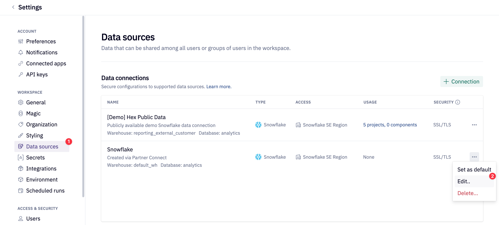
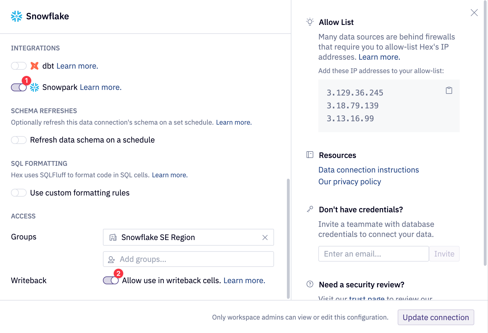
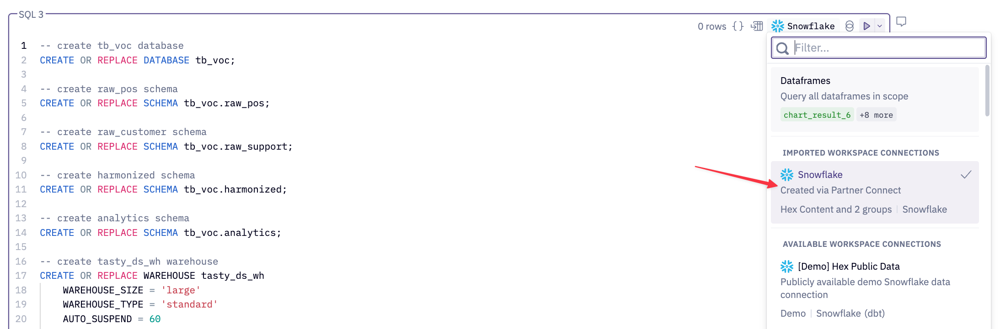
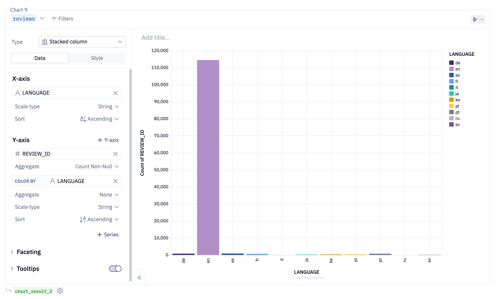
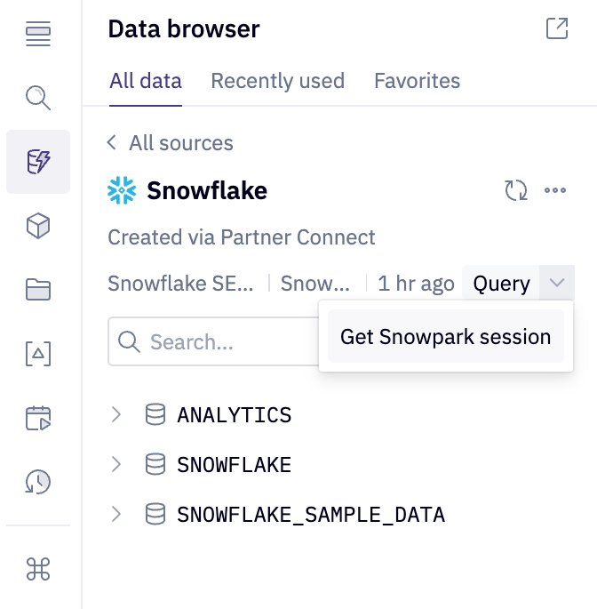
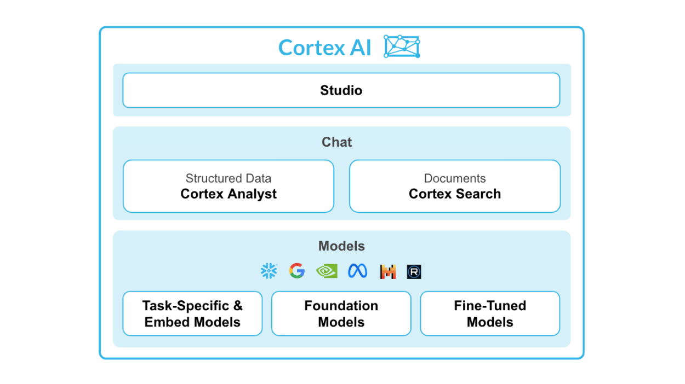
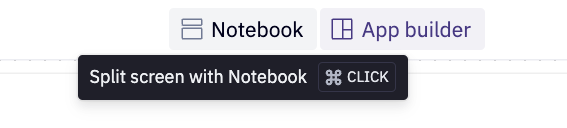

author: Armin Efendic
id: analyzing-customer-reviews-using-hex-and-snowflake-cortex
categories: snowflake-site:taxonomy/solution-center/certification/quickstart, snowflake-site:taxonomy/solution-center/certification/partner-solution, snowflake-site:taxonomy/product/data-engineering
language: en
summary: Analyze customer reviews with Hex notebooks and Snowflake Cortex for feedback insights using sentiment analysis and topic extraction.
environments: web
status: Published
feedback link: https://github.com/Snowflake-Labs/sfguides/issues


# Analyzing Customer Reviews With Hex and Snowflake Cortex

<!-- ------------------------ -->
## Overview 

This quickstart guide has been slightly modified from the original quickstart guide titled [Customer Reviews Analytics using Snowflake Cortex](/en/developers/guides/customer-reviews-analytics-using-snowflake-cortex/).

We will be exploring customer review data using Snowflake Cortex and Hex. Specifically, we will create a data app that leverages Snowflake's Cortex LLM functions to better understand our customer feedback. As a result we will then be able to provide recommendations and improvements to our stakeholders. 

### Prerequisites
- Familiarity with basic Python and SQL 
- Familiarity with data science notebooks
- A [Snowflake](https://signup.snowflake.com/?utm_source=snowflake-devrel&utm_medium=developer-guides&utm_cta=developer-guides) account (if you are using an enterprise account through your organization, ensure that you have permissions to write data to a database).

### What You Will Learn
* How to leverage Snowflake's Cortex LMM functionality
* Data exploration and analysis of customer reviews using Snowflake Cortex.
* How to best utilize single-shot versus zero-shot prompting
* Perform sentiment analysis and classification at scale.
* How to turn a Hex notebook into a Hex data app

### What You Will Build
You will create a Hex data app that uses Snowflake Cortex and Hex to analyze customer reviews, providing interactive insights and recommendations to our stakeholders.


## Setting up partner connect

If you have an existing Hex account, login to your Hex account and continue to the next section. Otherwise, follow the steps below.

After logging into your Snowflake account, you will land on the `Learn` page. To connect with Hex, navigate to the `Admin` tab on the left and click on `Partner connect`. In the search bar at the top, type `Hex` and the Hex partner connect tile will appear. Clicking on the tile will bring up a new screen,  click the `connect button` in the lower right corner. A new screen will confirm that your account has been created, from which you can click `Activate`.


#### Creating a workspace
Once activated, you'll be brought over to Hex and will be prompted to create/name your new workspace.

#### Workflow roadblocks
The following issues may occur if you have an existing Hex account and you're not an Admin in that org.

**Unauthorized error**
> If you have an existing Hex account that was created with a password and username, you may run into an "Unauthorized" error when activating your workspace in Partner Connect. If this is your experience, head over to [hex.tech](https://hex.tech) and login with your password and username. 

**Plan upgrade**
> If you are an existing Hex user currently on a Community plan, you may encounter an issue that will prevent you from using Partner Connect. If you’re unclear on what Hex plan you are on, feel free to reach out to [support@hex.tech](mailto:support@hex.tech). If you are the Admin of your organization, you can see your plan under Manage plan on the Settings page. To extend a trial, email [support@hex.tech](mailto:support@hex.tech) with the subject "Snowflake Quickstart Guide."

**Role privileges**
> If you do not have an Editor role or higher, you won't be able to create data connections in your workspace. To upgrade your role, contact your workspace Admin. You can find out who this is by navigating to Settings -> Users & groups within your Hex workspace.

*If you're still encountering issues, or encounter any issues other than the ones listed above, please contact our support team [support@hex.tech](mailto:support@hex.tech) with the subject "VHOL" for priority support.*


## Getting Started with Hex

The first thing you'll need to do is transfer the Hex project into your new or existing Hex org.

<button>


[Get Hex project](https://app.hex.tech/hex-public/hex/f9d33968-081d-4472-9f52-95f9739df071/draft/logic)


</button>


- Select Get a copy.
- Select your new or existing Hex org. 

Now that you've got your project, you will find yourself in the Notebook view of a Hex project. The Notebook view is a notebook-like interface made up of cells such as code cells, markdown cells, input parameters and more! On the far left side, you'll see a control panel that will allow you to do things like upload files, import data connections, or search your project. Before we dive into the code, we'll need to import our Snowflake connection to our project.

We can import our Snowflake data connection by heading over to the `Data sources` tab represented by a database icon with a lightning bolt. At the bottom of this section, you'll see a portion that says available workspace connections and you should see one that says Snowflake if you created the Hex account via Partner Connect.


If you had an existing Hex org and did not create one via Partner Connect please follow [Hex documentation](https://learn.hex.tech/docs/connect-to-data/data-connections/data-connections-introduction) on creating a Snowflake connection or use an existing Snowflake connection with write permissions.

### Common Problems
If coming from Partner Connect or creating a new database connection, ensure that your database connection has both the Snowpark and Writeback toggle enabled. Navigate to the Settings in Hex and select the desired Snowflake database connection. 



Enable the Snowpark and Writeback toggles.



## Writing Data To Snowflake

***NOTE: The Hex project is designed to be paired with the quickstart guide, please ensure to follow the quickstart guide as it will provide additional information and highlight the most important concepts!***

Go to the Hex project to create the required Snowflake objects and write the data to your Snowflake account using the SQL code below. This SQL can be found in the first SQL cell in the Hex project. Ensure that you have selected your Snowflake account at the top right of the SQL cell as seen below:



***NOTE: Your Snowflake data connection may be a custom name if you have not gone through Partner Connect.***

Run the SQL cell with the play button found at the top right of the SQL cell. Below you will find the entire SQL script:

```sql
-- create tb_voc database
CREATE OR REPLACE DATABASE tb_voc;

-- create raw_pos schema
CREATE OR REPLACE SCHEMA tb_voc.raw_pos;

-- create raw_customer schema
CREATE OR REPLACE SCHEMA tb_voc.raw_support;

-- create harmonized schema
CREATE OR REPLACE SCHEMA tb_voc.harmonized;

-- create analytics schema
CREATE OR REPLACE SCHEMA tb_voc.analytics;

-- create tasty_ds_wh warehouse
CREATE OR REPLACE WAREHOUSE tasty_ds_wh
    WAREHOUSE_SIZE = 'large'
    WAREHOUSE_TYPE = 'standard'
    AUTO_SUSPEND = 60
    AUTO_RESUME = TRUE
    INITIALLY_SUSPENDED = TRUE
COMMENT = 'data science warehouse for tasty bytes';


USE WAREHOUSE tasty_ds_wh;

/*--
 • file format and stage creation
--*/

CREATE OR REPLACE FILE FORMAT tb_voc.public.csv_ff 
type = 'csv';

CREATE OR REPLACE STAGE tb_voc.public.s3load
COMMENT = 'Quickstarts S3 Stage Connection'
url = 's3://sfquickstarts/tastybytes-voc/'
file_format = tb_voc.public.csv_ff;

/*--
 raw zone table build 
--*/

-- menu table build
CREATE OR REPLACE TABLE tb_voc.raw_pos.menu
(
    menu_id NUMBER(19,0),
    menu_type_id NUMBER(38,0),
    menu_type VARCHAR(16777216),
    truck_brand_name VARCHAR(16777216),
    menu_item_id NUMBER(38,0),
    menu_item_name VARCHAR(16777216),
    item_category VARCHAR(16777216),
    item_subcategory VARCHAR(16777216),
    cost_of_goods_usd NUMBER(38,4),
    sale_price_usd NUMBER(38,4),
    menu_item_health_metrics_obj VARIANT
);

-- truck table build 
CREATE OR REPLACE TABLE tb_voc.raw_pos.truck
(
    truck_id NUMBER(38,0),
    menu_type_id NUMBER(38,0),
    primary_city VARCHAR(16777216),
    region VARCHAR(16777216),
    iso_region VARCHAR(16777216),
    country VARCHAR(16777216),
    iso_country_code VARCHAR(16777216),
    franchise_flag NUMBER(38,0),
    year NUMBER(38,0),
    make VARCHAR(16777216),
    model VARCHAR(16777216),
    ev_flag NUMBER(38,0),
    franchise_id NUMBER(38,0),
    truck_opening_date DATE
);

-- order_header table build
CREATE OR REPLACE TABLE tb_voc.raw_pos.order_header
(
    order_id NUMBER(38,0),
    truck_id NUMBER(38,0),
    location_id FLOAT,
    customer_id NUMBER(38,0),
    discount_id VARCHAR(16777216),
    shift_id NUMBER(38,0),
    shift_start_time TIME(9),
    shift_end_time TIME(9),
    order_channel VARCHAR(16777216),
    order_ts TIMESTAMP_NTZ(9),
    served_ts VARCHAR(16777216),
    order_currency VARCHAR(3),
    order_amount NUMBER(38,4),
    order_tax_amount VARCHAR(16777216),
    order_discount_amount VARCHAR(16777216),
    order_total NUMBER(38,4)
);

-- truck_reviews table build
CREATE OR REPLACE TABLE tb_voc.raw_support.truck_reviews
(
    order_id NUMBER(38,0),
    language VARCHAR(16777216),
    source VARCHAR(16777216),
    review VARCHAR(16777216),
    review_id NUMBER(18,0)
);

/*--
 • harmonized view creation
--*/

-- truck_reviews_v view
CREATE OR REPLACE VIEW tb_voc.harmonized.truck_reviews_v
    AS
SELECT DISTINCT
    r.review_id,
    r.order_id,
    oh.truck_id,
    r.language,
    source,
    r.review,
    t.primary_city,
    oh.customer_id,
    TO_DATE(oh.order_ts) AS date,
    m.truck_brand_name
FROM tb_voc.raw_support.truck_reviews r
JOIN tb_voc.raw_pos.order_header oh
    ON oh.order_id = r.order_id
JOIN tb_voc.raw_pos.truck t
    ON t.truck_id = oh.truck_id
JOIN tb_voc.raw_pos.menu m
    ON m.menu_type_id = t.menu_type_id;

/*--
 • analytics view creation
--*/

-- truck_reviews_v view
CREATE OR REPLACE VIEW tb_voc.analytics.truck_reviews_v
    AS
SELECT * FROM harmonized.truck_reviews_v;


/*--
 raw zone table load 
--*/


-- menu table load
COPY INTO tb_voc.raw_pos.menu
FROM @tb_voc.public.s3load/raw_pos/menu/;

-- truck table load
COPY INTO tb_voc.raw_pos.truck
FROM @tb_voc.public.s3load/raw_pos/truck/;

-- order_header table load
COPY INTO tb_voc.raw_pos.order_header
FROM @tb_voc.public.s3load/raw_pos/order_header/;

-- truck_reviews table load
COPY INTO tb_voc.raw_support.truck_reviews
FROM @tb_voc.public.s3load/raw_support/truck_reviews/;


-- scale wh to medium
ALTER WAREHOUSE tasty_ds_wh SET WAREHOUSE_SIZE = 'Medium';

-- setup completion note
SELECT 'setup is now complete' AS note;
```

## Hex Quickstart Guide Best Practices

Below is a short list of suggestions:
* You may safely delete the SQL cell previously ran from the Hex project or comment it out. Once completed, you may select Run all at the top right of the Hex project or step through each code cell and run them individually. The ladder is the recommended approach. 
* By default, Hex will run in [Auto mode](https://learn.hex.tech/docs/explore-data/projects/project-execution/run-modes-and-cell-staleness#run-modes) which automatically runs depended downstream cells. You can edit this project behavior at the bottom right of the Hex project.
* Ensure that every SQL cell has the correct Snowflake database connection selected prior to running it.

## Working With Snowpark In Hex

Hex offers a straightforward and secure way to interact with Snowpark. To quickly return a Snowpark dataframe, simply select the Snowpark return mode from the next SQL cell in your Hex project. The output of this SQL cell will be a Snowpark dataframe named `reviews`, which you can easily rename by clicking on the highlighted variable in blue.


Additionally, Hex provides native visualizations for Snowpark dataframes. Simply pass them into a Hex native chart and see your data! Hex charts construct the appropriate query to render the chart appropriately and only bring the result set into Hex memory!



Notice that the `reviews` Snowpark dataframe is highlighted in blue at the top left of the chart. This chaining effect allows you to use the same dataframe across various cells throughout the project, all managed seamlessly by Hex. Whether you’re using a Snowpark or a pandas dataframe, Hex handles the complexities for you. Finally, Snowpark dataframes are denoted in blue, except when utilized within a Python cell.

## Generate A Snowpark Session In Hex
To work with a Snowpark session object, select your database connection from the data browser tab on the left side of the Hex project. A `query` option will be visible, allowing for quick queries to this connection in an SQL cell. Click the dropdown next to the `query` button and select `Get Snowpark session`. This action will create a new Python cell with the necessary code to obtain a Snowpark session. Hex utilizes the `hextoolkit` library to securely access your existing Snowflake connection, providing a clean and secure way to authenticate and establish a Snowpark session.


*The cell created by this button will be positioned under the cell that is currently selected.*



Scope the Snowpark session to the appropriate database and schema. If you are using a different database and schema name, scope the Snowpark session to the correct database and schema.

```python
session.use_database("tb_voc")
session.use_schema("analytics")
```

At this time, complete the Hex project until you reach the section titled Snowflake Cortex. At that time, move to the next quickstart guide section titled Working With Snowflake Cortex in Hex.

## Working with Snowflake Cortex in Hex

[Snowflake Cortex AI](https://docs.snowflake.com/en/guides-overview-ai-features) is an intelligent, fully managed service that provides access to industry-leading large language models (LLMs) and chat with your data services. Cortex AI capabilities include:



For this quickstart guide, a specific focus will be placed on [Snowflake Cortex LLM Functions](https://docs.snowflake.com/en/user-guide/snowflake-cortex/llm-functions) which fall under the Task-Specific offering. The functions that will be explored in this quickstart guide are:
* [TRANSLATE](https://docs.snowflake.com/en/user-guide/snowflake-cortex/llm-functions#label-cortex-llm-translate)
* [COMPLETE](https://docs.snowflake.com/en/user-guide/snowflake-cortex/llm-functions#label-cortex-llm-complete)
* [SENTIMENT](https://docs.snowflake.com/en/user-guide/snowflake-cortex/llm-functions#label-cortex-llm-sentiment)

Below is some Snowpark code that quickly translates our customer reviews into English. In the line calling `cortex.Translate`, the first and second arguements are the column inputs of the customer review in plain text and the source language respectively. The English language is specifed as the target language by `en`. This is the third argument for the `Translate` function. 

```python
# Conditionally translate reviews that are not english using Cortex Translate
reviews_24 = reviews_24.withColumn(
    "TRANSLATED_REVIEW",
    when(
        F.col("LANGUAGE") != F.lit("en"),
        cortex.Translate(F.col("REVIEW"), F.col("LANGUAGE"), "en"),
    ).otherwise(F.col("REVIEW")),
)

reviews_24.filter(F.col("LANGUAGE") != F.lit("en")).select(
    ["REVIEW", "LANGUAGE", "TRANSLATED_REVIEW"]
).show(3)
```

This capability allows for LLMs to be easily utilized in conditional statements and at scale. Continue in the Hex project until you reach the **Single-Shot vs. Zero-Shot Prompting** section, and then proceed to the next section.

## Single-Shot vs. Zero-Shot Prompting

**Single-Shot Prompting:** Providing the model with one example of the task to guide it, helping clarify the desired output or format before requesting a response.

**Zero-Shot Prompting:** Asking a model to perform a task without providing any prior examples, relying on its built-in knowledge and context understanding.

Use zero-shot for general tasks and single-shot when an example can help improve accuracy or clarify expectations. Let's explore this in action:

### Single-Shot Prompting
```python
# Prompt to get a rating based on a customer review
# We provide one shot in-context learning to better the answers we get from LLM
prompt = """[INST]
### 
You are tasked with rating cutsomer reviews for global food truck network called tasty bytes. \
Rating can be one of the following - awful, poor, okay, good, excellent such that awful is the worst \
possible rating and excellent is the best possible rating. Include only the rating in the output \
without any additional text. \
Rate the following review:
The "Freezing Point" ice cream truck in Seoul offered a mix of classic and unique \
options. The Sugar Cone and Waffle Cone were both fresh and crisp, providing a satisfying crunch. The \
Bottled Water and Ice Tea were standard, as expected. The standout, however, was the Mango Sticky Rice \
- a delightful blend of sweet and tangy, it was a refreshing twist to the usual ice cream flavors. The \
service was efficient, but lacked a personal touch. Overall, it\'s a decent choice for a quick, cool \
treat in the city.
Rating : good
Rate the following review: 
###"""

# Ask cortex complete and create a new column
reviews_rated = reviews_24.withColumn(
    "RATING",
    cortex.Complete(
        model, F.concat(F.lit(prompt), F.col("REVIEW"), F.lit("""[/INST]"""))
    ),
).withColumn(
    "CLEAN_RATING",
    when(F.contains(F.lower(F.col("RATING")), F.lit("awful")), F.lit("awful"))
    .when(F.contains(F.lower(F.col("RATING")), F.lit("poor")), F.lit("poor"))
    .when(F.contains(F.lower(F.col("RATING")), F.lit("okay")), F.lit("okay"))
    .when(F.contains(F.lower(F.col("RATING")), F.lit("good")), F.lit("good"))
    .when(F.contains(F.lower(F.col("RATING")), F.lit("excellent")), F.lit("excellent"))
    .otherwise(F.lit("unsure")),
)

reviews_rated.select(["REVIEW", "CLEAN_RATING"]).show(3)
```

### Zero-Shot Prompting
```python
# Prompt to understand whether a customer would recommend food truck based on their review
prompt = """[INST]
### 
Tell me based on the following food truck customer review, will they recommend the food truck to \
their friends and family? Answer should be only one of the following words - \
"Likely" or "Unlikely" or "Unsure". Make sure there are no additional additional text.
Review -
###"""

# Ask cortex complete and create a new column
reviews_24 = reviews_24.withColumn(
    "RECOMMEND",
    cortex.Complete(
        "snowflake-arctic",
        F.concat(F.lit(prompt), F.col("REVIEW"), F.lit("""[/INST]""")),
    ),
).withColumn(
    "CLEAN_RECOMMEND",
    when(F.contains(F.col("RECOMMEND"), F.lit("Likely")), F.lit("Likely"))
    .when(F.contains(F.col("RECOMMEND"), F.lit("Unlikely")), F.lit("Unlikely"))
    .when(F.contains(F.col("RECOMMEND"), F.lit("Unsure")), F.lit("Unsure"))
    .otherwise(F.lit("NA")),
)

reviews_24.select(["REVIEW", "CLEAN_RECOMMEND"]).show(3)
```
Both approaches provide quality results, that said for defined tasks providing additional context in the form of single-shot prompting is recommeneded.

### Model Selection
Note that in the first code cell above, a variable called `model` is used. This is to allow for quick testing and optimization of model selection with respect to accuracy and cost. The model variable is a string input defined by a [dropdown cell](https://learn.hex.tech/docs/explore-data/cells/input-cells/dropdown-inputs) in Hex. The following models are available in Snowflake at the time of writing:

```python
# the available models in Snowflake as of Oct. 18th 2024
models = [
    "gemma-7b",
    "jamba-1.5-mini",
    "jamba-1.5-large",
    "jamba-instruct",
    "llama2-70b-chat",
    "llama3-8b",
    "llama3-70b",
    "llama3.1-8b",
    "llama3.1-70b",
    "llama3.1-405b",
    "llama3.2-1b",
    "llama3.2-3b",
    "mistral-large",
    "mistral-large2",
    "mistral-7b",
    "mixtral-8x7b",
    "reka-core",
    "reka-flash",
    "snowflake-arctic"
]
```

Return to the Hex project and complete the cells until you reach the **Classification Analysis** section. Once there, progress to the next section in the quickstart guide. 

## Classification Using Cortex

Performing classification was once a rather complex task requiring supervised machine learning where labeled data was used to train models to recognize patterns and categorize inputs. This involved collecting large datasets, preprocessing them, and training models like decision trees, SVMs, or neural networks, which could be time-consuming and resource-intensive. Today, with large language models (LLMs), we can perform classification without explicit training data or supervision by simply prompting the model.

In the prompt below, specific instructions are provided as well as a single-shot prompt. By passing this additional context, the LLM provides consistent, repeatable results such that we can reliably use this at scale. 

```python
# Prompt to understand sentiment for different categories mentioned in the customer review
# We employ one shot incontext learning to inform LLM
prompt = """[INST]
### 
You are analyzing food-truck customer reviews to undertsand what a given review says about different relevant categories like \
food quality, menu options, staff, overall experience, price, ambience, customer support, \
hygiene standards etc and if sentiment is negative,positive or neutral for that category. \
Only answer in a single valid JSON containing "category", "sentiment" and "details". \
Make sure there is no additional text and not mention categories in answer which are not \
talked in the review. \
Get category based sentiment for the follwoing customer review:
"This food truck offers a disappointing experience. \
The menu lacks healthy options and the food quality is subpar. Finding a parking spot near the \
truck can also be a frustrating ordeal. Additionally, the value for money is not worth it. To top \
it all off, the service provided at this food truck is less than pleasant, adding to the overall \
negative dining experience. Tried reaching out the customer support but was unable to get through." 
Answer : [{     "category": "food quality",     "sentiment": "negative",    "details": "subpar quality"   }, {     "category": "menu options",     "sentiment": "negative",     "details": "lacks healthy options"   },   {     "category": "staff",     "sentiment": "negative",     "details": "unpleasant"   },   {     "category": "price",     "sentiment": "negative",     "details": "not worth the money"   },   {     "category": "experience",     "sentiment": "negative",     "details": "regrettable dining experience"   },   {     "category": "customer support",     "sentiment": "negative",     "details": "unable to get through"   } ].
Get category based sentiment for the following customer review:
###"""

# Ask Cortex Complete and create a new column
review_df = reviews_24.withColumn(
    "CATEGORY_SENTIMENT",
    cortex.Complete(
        "mixtral-8x7b",
        F.concat(F.lit(prompt), F.col("REVIEW"), F.lit("""Answer:[/INST]""")),
    ),
)
review_df.select(["REVIEW", "CATEGORY_SENTIMENT"]).show(1)
```
Complete the rest of the Hex project and progress to the next quickstart section to build your own Hex App!

## Create A Hex App

Congratulations on successfully completing the Hex project! Now is the perfect time to share these insights with the team. However, simply sharing the technical analysis and code cells with stakeholders may not be the most effective approach. Traditional workflows, such as using BI tools for showing visuals or embedding screenshots in PowerPoint or PDF have proven to be very tedious for ad hoc analytical work. Often times, this workflow results in incomplete communication, leaving end users with more questions than answers.

To address this, we can create a Hex app that presents our findings in an interactive format, enabling stakeholders to explore the results without needing to navigate through the underlying code cells. Since the app is powered by the notebook cells we’ve created, it ensures that all end users have access to the most up-to-date information.

Navigate to the App builder located at the top of the Hex project. Every Hex project automatically creates a Hex app by default, but you may use this [project as a template](https://app.hex.tech/hex-public/app/f9d33968-081d-4472-9f52-95f9739df071/latest). To easily transfer elements from the notebook to the App builder, press **CTRL + Click** on the Notebook button to enable split-screen view:



In split-screen mode, you can view the notebook cells and conveniently add the relevant cells to the App builder:


Once a cell is added to the App builder, you can drag and drop, resize, or modify it directly within the App builder. You can also create entirely new cells while designing your data app. The Notebook and App builder are intertwined—any changes made on one side will be reflected on the other.

With the project complete and ready to share:
* Publish the app with the [Publish button](https://learn.hex.tech/docs/share-insights/apps/publish-and-share-apps)
* Hex will run the entire project to ensure there are no errors
* Click the share button at the top right and choose `Publish to web`

## Conclusion and Resources
Congratulations on completing this lab! You’ve successfully leveraged Hex and Cortex to generate insights from text data at scale—something that traditionally would have required extensive expertise and countless hours of work. This project highlights how modern workflows, powered by LLMs, can streamline and accelerate tasks that once took significant time, making advanced data analysis more accessible and efficient today.

### What You Learned
* How to analyze customer feedback using Snowflake Cortex and Hex.
* Leveraging LLMs for tasks like translation and sentiment analysis.
* Differences between single-shot and zero-shot prompting.
* Turning a Hex notebook into an interactive data app.
* Easily sharing findings with stakeholders via a Hex app.

### Related Resources
* [Final Project](https://app.hex.tech/810c3d49-47a5-470c-9eaa-f471548c9620/app/af138a51-cae9-4300-9aee-6805afe6e699/latest)
* [Data Exploration & Analysis using Hex and Snowpark](https://developers.snowflake.com/solution/data-exploration-with-hex-and-snowpark/)
* [The Future of Analytics is Multi-Modal](https://hex.tech/blog/multi-modal-analytics/)
* [Customer Behavior Analysis and New Product Sales Forecasting](https://hex.tech/templates/snowpark/analysis-of-customer-purchasing-behavior/)
* [Snowflake Cortex Documentaion](https://docs.snowflake.com/en/guides-overview-ai-features)
* [Getting Started with Llama 3.1 405B: Build Custom LLMs with Synthetic Data Generation and Distillation](/en/developers/guides/getting-started-with-synthetic-data-and-distillation-for-llms/)

