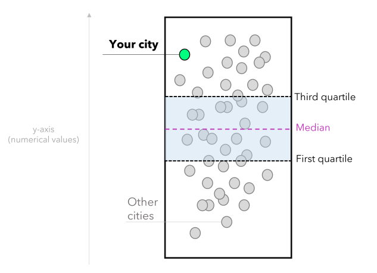

summary: Analyzing real estate properties with Streamlit 
id: analyzing_real_estate_properties_with_streamlit
categories: App-Development, Streamlit
environments: web
status: Draft
feedback link: https://github.com/Snowflake-Labs/sfguides/issues
tags: Data Science & ML, Solution Examples 
authors: Vinícius Oviedo


# Analyzing real estate properties using Streamlit
<!-- ------------------------ -->
## Overview 
Duration: 1

Analyzing residential properties for sale in Brazil (or any country) can be time-consuming. Usually, there are public reports that track real estate prices but no interactive data visualizations to compare assets across cities. That can be solved by creating an **"appreciation of residential properties"** app which combine Python programming, statistics and storytelling techniques to make data analysis more accessible!

This guide will show you how to create your own residential properties analyzer using Streamlit, Pandas, NumPy, Matplotlib, and Seaborn libraries.

### Prerequisites
- Familiarity with Python

### What You’ll Learn 
- How to combine Data Visualization and Storytelling to analyze residential properties via stripplots
- How to create a stripplot for analyzing residential properties annual appreciation (over locations)
- How to create a stripplot for analyzing price by squared meter (over locations)
- How to structure and theme your solution into a Streamlit app

### What You’ll Need 
- A [GitHub](https://github.com/) Account 
- An Python IDE installed, such as [VSCode](https://code.visualstudio.com/download) 
- A [sample dataset](https://github.com/OviedoVR/Brazilian-properties-appreciation/blob/main/data/BR_real_estate_appreciation_Q1_2023.csv) (Brazilian Real Estate Properties Appreciation over 50 cities - data from the first quarter of 2023) 

### What You’ll Build 
- An **"appreciation of residential properties"** Streamlit app

<!-- ------------------------ -->
## Working Principle
Duration: 4

For this guide, we turn the audience into the center of attention. To do that, we allow it to select a location from our dataset, which is highlighted during the app's usage. Besides, the app uses a single visual type—the stripplot.



In our scenario, each white dot represents a city. The lowest values are at the bottom, and the highest are at the top. Once the user selects a location, it is highlighted in green, and that allows comparing it with the other cities. Note that you can also provide context by using statistical measures such as:

- **The first quartile (Q1):** represents 25% of the data.
- **Median:** the middle value that splits the data in half (can also provide a central tendency sense).
- **Third quartile (Q3):** represents 75% of the data.

These statistical measures allow the user to compare the situation of the chosen location with the national average and data distribution. Summing up, the user can extract insights from the data, such as identifying opportunities when an appreciation rate is above the national average and the price per square meter is below average. Hence, we will create two stripplots: one for analyzing residential properties annual appreciation and another for analyzing the cost per square meter. This is how the solution will look:


<!-- ------------------------ -->
## Initial Set-Up
Duration: 2

In this step, we need to import the required Python modules and set up the Matplotlib layout for storytelling.

Importing Streamlit, Numpy, and Pandas (for arrays and data manipulation) and Matplotlib and Seaborn (for data visualization):

```python
# Modules:
import numpy as np
import pandas as pd
import matplotlib.pyplot as plt
import seaborn as sns
import streamlit as st
```

Creating a unique design for your Matplotlib figures and defining the color palette:

```python
# Setup for Storytelling (matplotlib):
plt.rcParams['font.family'] = 'monospace'
plt.rcParams['font.size'] = 8
plt.rcParams['font.weight'] = 'bold'
plt.rcParams['figure.facecolor'] = '#464545' 
plt.rcParams['axes.facecolor'] = '#464545' 
plt.rcParams['axes.titleweight'] = 'bold'
plt.rcParams['axes.titlecolor'] = 'black'
plt.rcParams['axes.titlesize'] = 9
plt.rcParams['axes.labelcolor'] = 'darkgray'
plt.rcParams['axes.labelweight'] = 'bold'
plt.rcParams['axes.edgecolor'] = 'darkgray'
plt.rcParams['axes.linewidth'] = 0.2
plt.rcParams['ytick.color'] = 'darkgray'
plt.rcParams['xtick.color'] = 'darkgray'
plt.rcParams['axes.titlecolor'] = '#FFFFFF'
plt.rcParams['axes.titlecolor'] = 'white'
plt.rcParams['axes.edgecolor'] = 'darkgray'
plt.rcParams['axes.linewidth'] = 0.85
plt.rcParams['ytick.major.size'] = 0
```

> Note that we defined font family, font weight, colors for axis and background, deleted ticks on axes, and so forth.

<!-- ------------------------ -->
## Data collection & app structuring
Duration: 4

To load the data [GitHub](https://github.com/OviedoVR/Brazilian-properties-appreciation/blob/main/data/BR_real_estate_appreciation_Q1_2023.csv), we can use the `read_csv` method of Pandas:


```python
# loading the data:
BR_real_estate_appreciation = pd.read_csv('data/BR_real_estate_appreciation_Q1_2023.csv')
# rounding the appreciation column to two decimal places:
BR_real_estate_appreciation['Annual_appreciation'] = round(BR_real_estate_appreciation['Annual_appreciation'], 2) * 100
```

Next, we need to configure the app's style, set up a header, and add a usage tutorial in the sidebar. You can also define widgets for selecting your location of interest.

```python
# Page setup:
st.set_page_config(
    page_title="Residential properties (Brazil)",
    page_icon="🏢",
    layout="centered",
    initial_sidebar_state="collapsed",
)

# Header:
st.header('Appreciation of residential properties in Brazil')

st.sidebar.markdown(''' > **How to use this app**

1. To Select a city (**green dot**).
2. To compare for the selected city against other 50 cities (**white dots**).
3. To compare the chosen city against **national average** and the data distribution.
4. To extract insights as "An appreciation above national average + price by square meter below average = possible *opportunity*".
''')

# Widgets:
cities = sorted(list(BR_real_estate_appreciation['Location'].unique()))
your_city = st.selectbox(
    '🌎 Select a city',
    cities
)

selected_city = BR_real_estate_appreciation.query('Location == @your_city')
other_cities = BR_real_estate_appreciation.query('Location != @your_city')
```

<!-- ------------------------ -->
## Stripplot for Anual Appreciation
Duration: 10

This step refers to the first stripplot, which compares the selected location's annual appreciation to other locations. You can highlight the chosen location in the chart and add reference lines, such as the first quartile, median, and third quartile, to see how it performs.

```python
# CHART 1: Annual appreciation (12 months):
chart_1, ax = plt.subplots(figsize=(3, 4.125))
# Background:
sns.stripplot(
    data= other_cities,
    y = 'Annual_appreciation',
    color = 'white',
    jitter=0.85,
    size=8,
    linewidth=1,
    edgecolor='gainsboro',
    alpha=0.7
)
# Highlight:
sns.stripplot(
    data= selected_city,
    y = 'Annual_appreciation',
    color = '#00FF7F',
    jitter=0.15,
    size=12,
    linewidth=1,
    edgecolor='k',
    label=f'{your_city}'
)

# Showing up position measures:
avg_annual_val = BR_real_estate_appreciation['Annual_appreciation'].median()
q1_annual_val = np.percentile(BR_real_estate_appreciation['Annual_appreciation'], 25)
q3_annual_val = np.percentile(BR_real_estate_appreciation['Annual_appreciation'], 75)

# Plotting lines (reference):
ax.axhline(y=avg_annual_val, color='#DA70D6', linestyle='--', lw=0.75)
ax.axhline(y=q1_annual_val, color='white', linestyle='--', lw=0.75)
ax.axhline(y=q3_annual_val, color='white', linestyle='--', lw=0.75)

# Adding the labels for position measures:
ax.text(1.15, q1_annual_val, 'Q1', ha='center', va='center', color='white', fontsize=8, fontweight='bold')
ax.text(1.3, avg_annual_val, 'Median', ha='center', va='center', color='#DA70D6', fontsize=8, fontweight='bold')
ax.text(1.15, q3_annual_val, 'Q3', ha='center', va='center', color='white', fontsize=8, fontweight='bold')

# to fill the area between the lines:
ax.fill_betweenx([q1_annual_val, q3_annual_val], -2, 1, alpha=0.2, color='gray')
# to set the x-axis limits to show the full range of the data:
ax.set_xlim(-1, 1)

# Axes and titles:
plt.xticks([])
plt.ylabel('Average appreciation (%)')
plt.title('Appreciation (%) in the past 12 months', weight='bold', loc='center', pad=15, color='gainsboro')
plt.legend(loc='center', bbox_to_anchor=(0.5, -0.1), ncol=2, framealpha=0, labelcolor='#00FF7F')
plt.tight_layout()
```
<!-- ------------------------ -->
## Stripplot for Price by Squared Meter
Duration: 10

This step refers to the second stripplot, which shows the relationship between location and price per square meter.

```python
# CHART 2: Price (R$) by m²:
chart_2, ax = plt.subplots(figsize=(3, 3.95))
# Background:
sns.stripplot(
    data= other_cities,
    y = 'BRL_per_squared_meter',
    color = 'white',
    jitter=0.95,
    size=8,
    linewidth=1,
    edgecolor='gainsboro',
    alpha=0.7
)
# Highlight:
sns.stripplot(
    data= selected_city,
    y = 'BRL_per_squared_meter',
    color = '#00FF7F',
    jitter=0.15,
    size=12,
    linewidth=1,
    edgecolor='k',
    label=f'{your_city}'
)

# Showing up position measures:
avg_price_m2 = BR_real_estate_appreciation['BRL_per_squared_meter'].median()
q1_price_m2 = np.percentile(BR_real_estate_appreciation['BRL_per_squared_meter'], 25)
q3_price_m2 = np.percentile(BR_real_estate_appreciation['BRL_per_squared_meter'], 75)

# Plotting lines (reference):
ax.axhline(y=avg_price_m2, color='#DA70D6', linestyle='--', lw=0.75)
ax.axhline(y=q1_price_m2, color='white', linestyle='--', lw=0.75)
ax.axhline(y=q3_price_m2, color='white', linestyle='--', lw=0.75)

# Adding the labels for position measures:
ax.text(1.15, q1_price_m2, 'Q1', ha='center', va='center', color='white', fontsize=8, fontweight='bold')
ax.text(1.35, avg_price_m2, 'Median', ha='center', va='center', color='#DA70D6', fontsize=8, fontweight='bold')
ax.text(1.15, q3_price_m2, 'Q3', ha='center', va='center', color='white', fontsize=8, fontweight='bold')

# to fill the area between the lines:
ax.fill_betweenx([q1_price_m2, q3_price_m2], -2, 1, alpha=0.2, color='gray')
# to set the x-axis limits to show the full range of the data:
ax.set_xlim(-1, 1)

# Axes and titles:
plt.xticks([])
plt.ylabel('Price (R\\$)')
plt.legend(loc='center', bbox_to_anchor=(0.5, -0.1), ncol=2, framealpha=0, labelcolor='#00FF7F')
plt.title('Average price (R\\$) by $m^2$', weight='bold', loc='center', pad=15, color='gainsboro')
plt.tight_layout()
```
<!-- ------------------------ -->
## Finalizing the app
Duration: 3

Here, we can split the charts into two columns and add a legend. To make it more accessible, let's:

- Display tabular data for the chosen city in addition to the chart.
- Provide information about reference indexes (such as inflation) and authorship.

Splitting the charts into columns:

```python
# Splitting the charts into two columns:
left, right = st.columns(2)

# Columns (content):
with left:
    st.pyplot(chart_1)
with right:
    st.pyplot(chart_2)
```

Setting up the legend for the charts:

```python
# Informational text:
st.markdown('''
<span style="color:white;font-size:10pt"> ⚪ Each point represents a city </span>
<span style="color:#DA70D6;font-size:10pt"> ▫ <b> Average value </b></span>
<span style="color:white;font-size:10pt"> ◽ Lowest values (<b> bottom </b>)
◽ Highest values (<b> top </b>) <br>
◽ **Q1** (first quartile): where 25% of data falls under
◽ **Q3** (third quartile): where 75% of data falls under
</span>

''',unsafe_allow_html=True)
```

Final information to be displayed:

```python
# Showing up the numerical data (as a dataframe):
st.dataframe(
    BR_real_estate_appreciation.query('Location == @your_city')[[
      'Location', 'Annual_appreciation', 
      'BRL_per_squared_meter']]
)

# Adding some reference indexes:
st.markdown(''' > **Reference indexes (inflation):**

* IPCA: **6%** (National Broad Consumer Price Index)
* IGP-M: **4%** (General Market Price Index)

> Data based on public informs that accounts residential properties for 50 Brazilian cities (first quarter of 2023).
''')

# Authorship:
st.markdown('---')
# here you can add the authorship and useful links (e.g., Linkedin, GitHub, and so forth)
st.markdown('---')
# --- (End of the App)
```

Finally, let's incorporate a dark theme. Note that the custom layout of Matplotlib is consistent with the theme's color palette.

```
[theme]
primaryColor="#00FF7F"
backgroundColor="#464545"
secondaryBackgroundColor="#2b2b29"
textColor="#fbfbfb"
font="serif"
```
<!-- ------------------------ -->
## Conclusion
Duration: 2

Now you know how to use Streamlit, Statistics, Data Vizualization and Storytelling techniques to analyze residential properties across distinct locations. Although this app takes into account Brazilian real estate properties, you can surely apply the same methodology to any country's data.

### What we Covered
- How to combine Data Visualization and Storytelling to analyze residential properties via stripplots
- How to analyze real estate properties using these stripplots
- How to structure and theme your solution into a Streamlit app

### Related Resources
- [GitHub repo](https://github.com/OviedoVR/Brazilian-properties-appreciation)
- [Customizing Matplotlib with style sheets and rcParams](https://matplotlib.org/stable/tutorials/introductory/customizing.html)
- [Data Visuzation & Storytelling book - The Big Picture: How to Use Data Visualization to Make Better Decisions―Faster (by Steve Wexler)](https://www.amazon.com/Big-Picture-Visualization-Better-Decisions_Faster/dp/126047352X/)
