author: 
id: analyzing_sap_ap_with_nttdata_nativeapp_and_fivetran
summary: This is the Fivetran NTT SAP AP Guide
<!--- Categories below should be hyphenated, i.e., Getting-Started. Do not leave blank. Visit site for available categories. -->
categories: Getting-Started
environments: web
status: Published 
feedback link: https://github.com/Snowflake-Labs/sfguides/issues
tags: Getting Started, Data Science, Data Engineering, Twitter 

# Analyzing SAP Accounts Payables with NTT DATA’s Snowflake Native App and Fivetran
<!-- ------------------------ -->
## Overview 
Duration: 1

- Accounts Payable (AP) is a term used in accounting to refer to the amount of money that a company owes to its creditors for goods or services purchased on credit. Effective accounts payable management can help reduce costs, improve financial reporting and enable organizations to make informed decisions about cash flow, vendor relationships and overall financial strategy.
- However, managing large volumes of accounts payable data can be challenging, particularly for companies with multiple locations or a large number of vendors. Ensuring that data is accurate and up-to-date can be difficult, particularly when dealing with manual processes or paper-based documentation, which can often result in duplicate payments to the same vendors.
- Duplicate Payments can be identified and investigated via Accounts Payable Audits. An accounts payable audit is an independent assessment of financial data from an organization's accounts payable records. It examines how AP transactions are being recorded and if it represents an accurate view of your business operations
 
### Lab Scenario
- You are playing the role of a data engineer and an analyst. 
- You are tasked with identifying duplicate payments in Accounts Payable data. 
- That data resides in your organization’s SAP ERP system. You, however, can't speak SAPanese. 
- Luckily, your organization uses Snowflake as the core data platform.

In this lab, you will use Fivetran to ingest mock SAP data into Snowflake, and use Snowflake Marketplace to install an app that will let you quickly identify duplicate payments! Lets get started.

### What You'll Need For the Lab
- A trial Snowflake account with ACCOUNTADMIN access (we suggest you create a new trial Snowflake account to be able to follow this workshop without any hiccups)

### What You’ll Learn 
- How to use Fivetran to ingest (mocked up) SAP Accounts Payable data into Snowflake using Fivetran
- How to leverage Snowflake Marketplace to install NTT Data’s Native App
- How to use the app to quickly identify duplicates in AP data ingested
 

## Launching Fivetran from Snowflake Partner Connect 
Login to your Snowflake trial account.

If this is your 1st time logging into Snowflake, you can get a detailed UI walkthrough [here](https://docs.snowflake.com/en/user-guide/ui-snowsight-gs.html#getting-started-with-snowsight).

- Navigate to Admin → Partner Connect, then click on the “Fivetran” tile. If you dont see the Admin button on the left panel, make sure you are assuming the ACCOUNTADMIN role on top left:

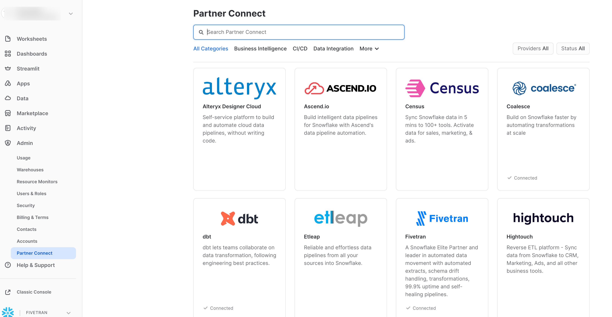

- You should see a window pop up that says Connect to Fivetran. Click the blue Connect at the bottom right:

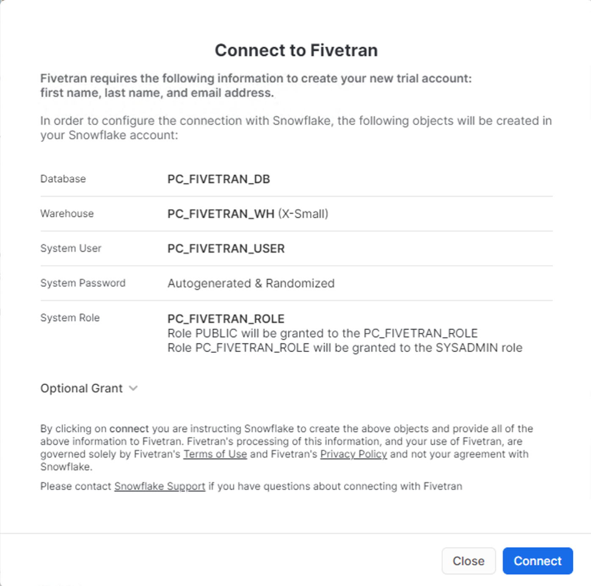

- Once the partner account has been created, Click the blue Activate button:

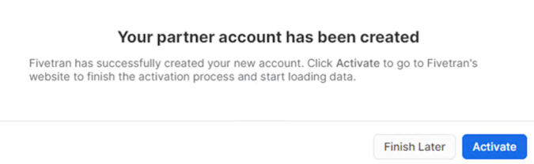

- Congrats! Just like that, you have launched a trial Fivetran account through Snowflake, pre-configured to talk to your Snowflake account as a target. 

<!-- ------------------------ -->
## Connect Fivetran to a Source and load to Snowflake
Duration: 2

Fivetran supports syncing data from file systems, applications, event systems, and databases. For SAP Sources, we support connecting to many different SAP sources. Our newest source is our [SAP HANA ERP Source](https://fivetran.com/docs/databases/sap-erp/sap-erp-hana). This fully managed SaaS connector is the simplest, fastest way to get started extracting SAP data.

As we do not have access to an SAP HANA instance, for this lab we have replicated the SAP tables and some mock data to a PostgreSQL instance. We will use Fivetran’s PostgreSQL connector for this lab and load it to your Snowflake account.

- Go to Fivetran and click on “Connectors” in the left gray navigation pane and then click the blue “Add Connector” button in the upper right corner:

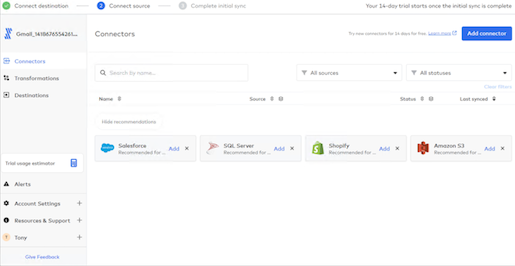

- As this trial with Fivetran was created via the Snowflake Partner Connect, your destination will default SnowflakePC:

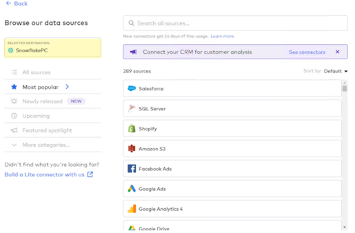

- Let’s check how many connectors Fivetran has available “out of the box”. Click on “All Sources” underneath your Selected Destination:

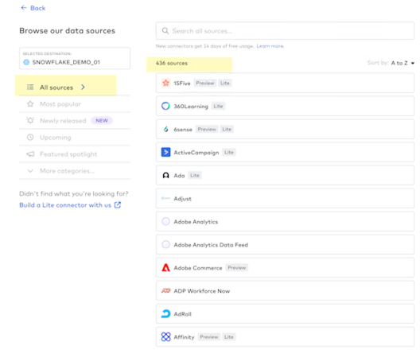

- To get an idea of the range of connectors that Fivetran has for various sources, type oracle into the search box and you will be presented with a range of Oracle source connectors:

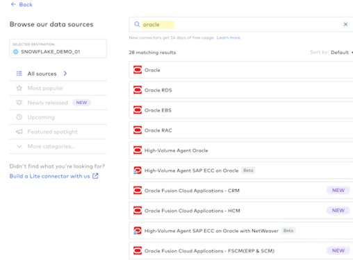

- Do the same thing for SAP as a source. Type sap into the search box and take a quick look at the SAP connectors that are available:

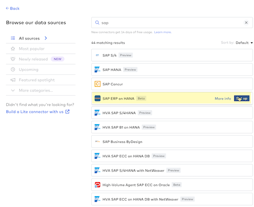

- Getting back to today’s lab, type postgres into the search box and hover over the Postgres connector that is named “Google Cloud PostgreSQL”, and click the “Setup” blue button at the right side of the selection:

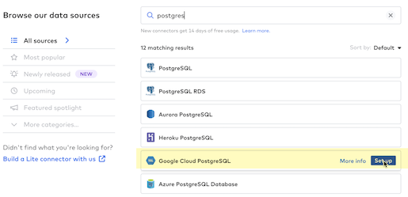

- As with all Fivetran connectors you are presented with a detailed setup guide in the right gray navigation pane. You can name the Destination Schema (it does not have to be created ahead of time in the destination), and for this lab, let’s use lastname_firstname_sap_ntt like this: kelly_tony_sap_ntt:

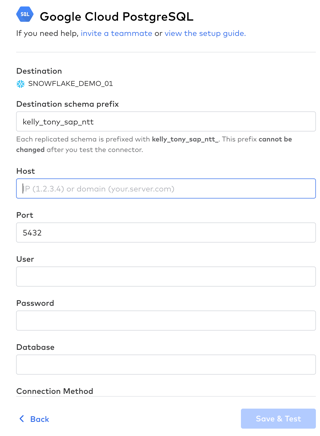

- To quickly connect the Google Cloud PostgreSQL source database system to Snowflake, here’s the rest of the information that you’ll need to provide - be sure and use the credentials for the column corresponding to the first letter of your last name so that everyone is not accessing the same source Google Cloud PostgreSQL database - go ahead and copy and paste these fields individually into the connector setup form in Fivetran:

  - <b>Your Last Name begins with A-D:</b>
    - Destination schema prefix: lastname_firstname_sap_ntt
    - Host: 34.94.122.157
    - Port: 5432
    - User: fivetran
    - Password: 2PcnxqFrHh64WKbfsYDU
    - Database: sap_accounts_payable
    - Connection Method: Connect directly  
    - Update Method: Detect Changes via XMIN

  - <b>Your Last Name begins with E-H:</b>
    - Destination schema prefix: lastname_firstname_sap_ntt
    - Host: 34.94.151.28
    - Port: 5432
    - User: fivetran
    - Password: 2PcnxqFrHh64WKbfsYDU
    - Database: sap_accounts_payable
    - Connection Method: Connect directly  
    - Update Method: Detect Changes via XMIN

  - <b>Your Last Name begins with I-L:</b>
    - Destination schema prefix: lastname_firstname_sap_ntt
    - Host: 34.94.33.194
    - Port: 5432
    - User: fivetran
    - Password: 2PcnxqFrHh64WKbfsYDU
    - Database: sap_accounts_payable
    - Connection Method: Connect directly  
    - Update Method: Detect Changes via XMIN

  - <b>Your Last Name begins with M-P:</b>
    - Destination schema prefix: lastname_firstname_sap_ntt
    - Host: 34.102.51.15
    - Port: 5432
    - User: fivetran
    - Password: 2PcnxqFrHh64WKbfsYDU
    - Database: sap_accounts_payable
    - Connection Method: Connect directly  
    - Update Method: Detect Changes via XMIN

  - <b>Your Last Name begins with Q-T:</b>
    - Destination schema prefix: lastname_firstname_sap_ntt
    - Host: TBC
    - Port: 5432
    - User: fivetran
    - Password: 2PcnxqFrHh64WKbfsYDU
    - Database: sap_accounts_payable
    - Connection Method: Connect directly  
    - Update Method: Detect Changes via XMIN

  - <b>Your Last Name begins with U-Z:</b>
    - Destination schema prefix: lastname_firstname_sap_ntt
    - Host: TBC
    - Port: 5432
    - User: fivetran
    - Password: 2PcnxqFrHh64WKbfsYDU
    - Database: sap_accounts_payable
    - Connection Method: Connect directly  
    - Update Method: Detect Changes via XMIN

<b>NOTE:</b> The six PostgreSQL instances above will be available until the end of the day the lab is run. 5 of the six instances will be shut down after the lab. If you wish to access the lab at any time during the remainder of the 14 day Fivetran trial, please use the 1st instance only (34.94.122.157). This instance will not be available after the 14 day Fivetran trial expires.

- Click the <b>“Save & Test”</b> blue button after you have completed the form:

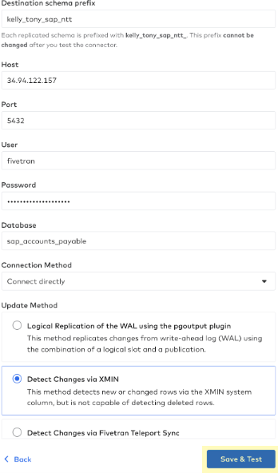

- Fivetran will begin running connection tests to the Google Cloud PostgreSQL source database:

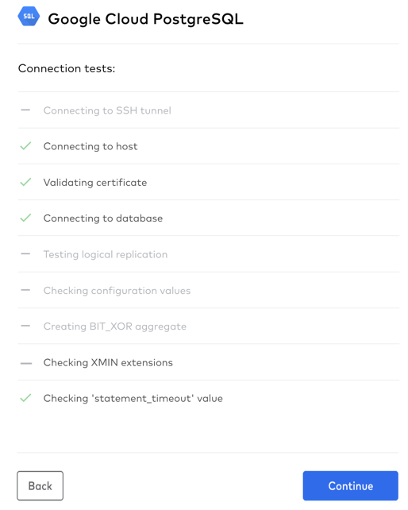

- You’ll be presented with a request to <b>“Confirm TLS Certificate”</b> - here’s why: 

  Fivetran uses Transport Layer Security (TLS) to secure data in motion. It allows for both encryption and authentication of the connections that Fivetran makes to the PostgreSQL data source. 

  Some additional detail:

  Security: Fivetran follows industry standard practices to encrypt data in transit (TLS) and at rest (AES256) and provides robust security, privacy, and governance from source to destination, and is in compliance with GDPR HIPAA, ISO, PCI, and SOC 2.

  - AES256 encryption throughout the entire data replication pipeline, using industry best practices including a wallet and unique encryption certificates
  - Support for OS-level and LDAP authentication, as well as custom plugin-based authentication
  - 2-Step verification support with unique certificates, avoiding a so-called man-in-the-middle attack
  - Pre-defined authorizations with full rights to make modifications, execute-only privileges, and read-only access
  - Auditing/logging of all operations that may affect data replication

<b>Click the top layer certificate</b> and then click the blue <b>“Confirm”</b> button:

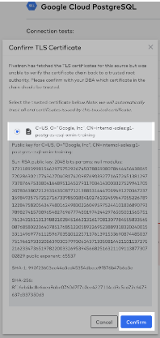

- Fivetran then finishes running the connection tests and once you see the green box stating that “All connection tests have passed” click <b>“Continue”:</b>

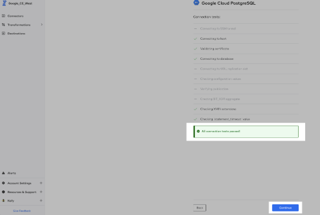

- Fivetran will then connect to and fetch the database source schema, tables, and columns that you have access to in the PostgreSQL database:

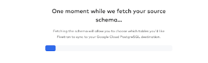

- You will then see that you can “Select Data to Sync”. For this SAP database, we have a schema available to us named <b>sap_accounts_payable_sapabap1</b>. We are going to sync all 12 tables for this lab.

  - If we had multiple schemas and wanted to block those from moving into Snowflake, we could do that here. Similarly, we could do the same with any tables in any schemas. 

  - Fivetran’s data-blocking feature allows you to exclude selected source schemas, tables, or columns from being loaded to your destination.

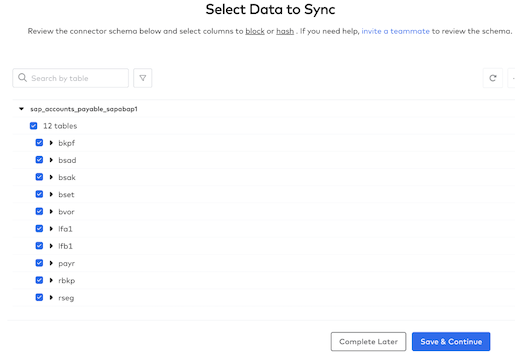

- Click the checkbox to the left of the “12 tables” to select all tables for syncing

  - Expand the vbrp table by clicking the checkbox next to the table name.
  - Next, hover over the abfor column and you’ll notice that an “Unhashed” button pops up for that column.
  - Click that button and you’ll see an option for additional data privacy:

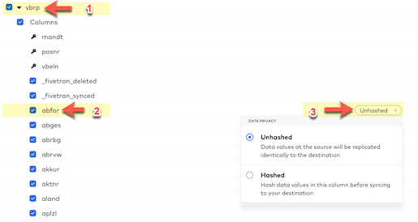

- By using column hashing, Fivetran allows you to anonymize data in your destination. Hashing is useful to enforce data privacy for any PII data when that data still needs to be used and joined across data sets in the downstream data workflow. 

- <b>For today’s lab do NOT hash any columns.</b>

- Click <b>“Save & Continue”</b> to confirm your data sync selections.

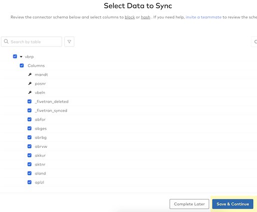

Fivetran then needs to know how you want to handle incremental changes to the PostgreSQL source data since the schema may change in the future. For the lab, keep the <b>“Allow all”</b> selected (allows all new schemas, tables, and columns to sync) and just click on the <b>“Continue”</b> button.

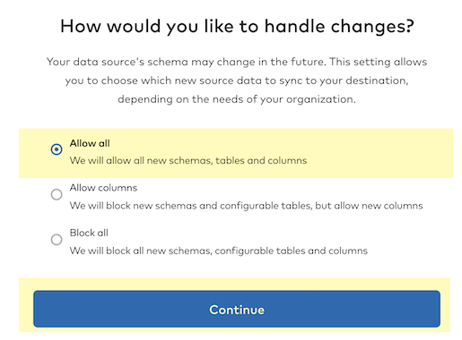

- You are now ready to start syncing your PostgreSQL data to Snowflake! Click on the <b>“Start/Resume Initial Sync”</b> button.

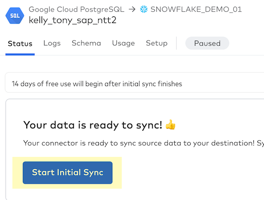

- You’ll see the green <b>“Active”</b> indicator and you’ll be notified that this is the “First time syncing data for this connector”. This is your initial sync or historical sync for that dataset. 

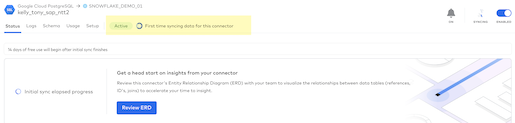

- Let’s leave the connector syncing the initial historical sync - we’ll check back in here in a few minutes. For now, let’s move on to Section 4.

<!-- ------------------------ -->
## Navigate the Fivetran UI for the PostgreSQL source connector
Duration: 2

In this section, we will further explore the information that is available in the Fivetran UI associated with the connector that you just created.

- Click on <b>“Logs”</b> to see what Fivetran is doing in the background as a pure SaaS service to build, test, deploy, automate, and maintain the PostgreSQL to Snowflake connector.

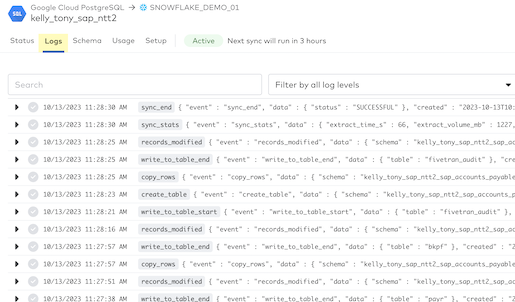

- Click on <b>“Schema”</b> to see the schemas, tables, and columns that were selected from the PostgreSQL source. You have the option to select or deselect tables and columns here and block them in future syncs. Just like when we first set up this connector, if you hover over a column you’ll see that you can hash individual columns if additional data privacy is required. I can also update the table sync setting mode here if desired. Fivetran’s default is “soft delete” and you have the option for “history mode” as well. <b>Do NOT change anything on the schema page for this lab.</b>

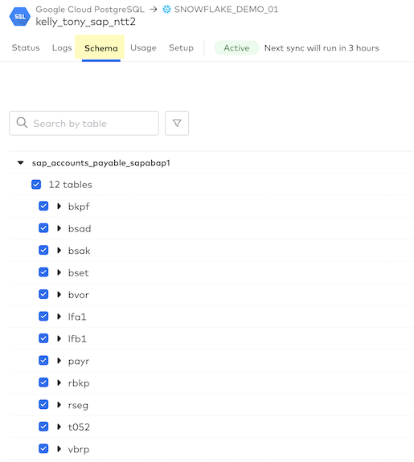

- Click on <b>“Usage”</b> and you’ll see the Usage Details for your PostgreSQL to Snowflake connector. Once we complete the initial sync and perform incremental syncs for 7 days, then usage stats will be available.

- On this tab, you can:

  - View paid and free MAR: The Incremental MAR bar chart displays your paid and free MAR for each day of the selected month so that you can see trends in your consumption.
  - Track daily MAR for the connector and its tables: Hover over each bar to see your overall daily MAR and the daily MAR for your top three tables.
  - View past usage data: By default, the Usage tab shows data from the current month. To see past usage data, use the drop-down menu at the top of the Usage tab to select the month you'd like to view.
  - Track MAR consumption per table.
  - Analyze the percent change in MAR from the previous month.

<b>NOTE:</b> We calculate the percent change by comparing this month's MAR to date to the MAR from the equivalent period last month (for example, we compare May 1-10 to April 1-10).

- Click on <b>“Setup”</b> and you’ll see the Connection Details along with the default settings for your PostgreSQL connector. Notice that the Incremental Sync Frequency drop-down box allows you to select an incremental sync (CDC) frequency from 5 minutes to 24 hours - Fivetran sets up CDC automatically for each connector. Fivetran’s default incremental sync frequency for this connector is 6 hours so your next sync will run in 6 hours and Fivetran will sync any changes that have taken place in your PostgreSQL database. 

- <b>Note:</b> Fivetran’s high-volume agent database and SAP connectors start at 1-minute sync frequency and Fivetran’s Local Data Processing (LDP) service is a continuous (immediate) sync frequency.

Now that you have seen the Fivetran UI / dashboard for this connector, let’s check back to see how the initial historical sync is progressing. Click back to the status dashboard, change the view to “1 hour” then hover over the green graph to view statistics on the volume of data and time to sync:

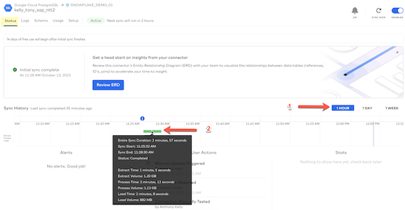

Next, let’s switch to Snowflake to preview the data that has synced. First, select “Databases” on the menu on the left and then expand your database name and the tables:

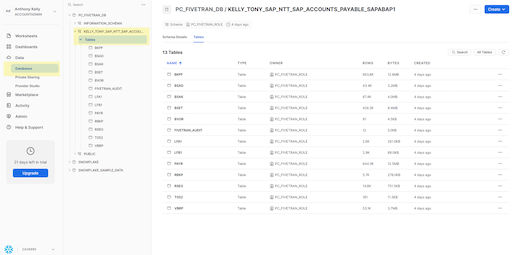

After expanding the list of tables, select the BSAD table and then click “Data Preview” to view the data in the table:

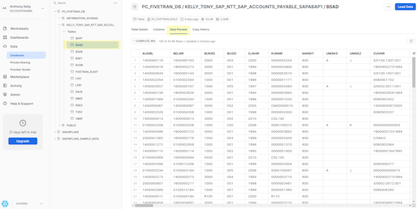

As mentioned, during this section we used a replicated SAP data set from a PostgreSQL database. If you would like to try our new <b>SAP HANA ERP Connector</b>, please search for SAP and use this connector:

Follow this link if you would like to view a quick recording of this SAP connector in action <b>*** Link to follow ***</b>

This concludes the Fivetran data ingestion portion of the Quickstart Lab. When you are ready, click on the <b>"Next"</b> button to move on to <b>Section 5 - Install NTT Data's Native App from Snowflake Marketplace</b>

<!-- ------------------------ -->
## Install NTT Data’s Native App from Snowflake Marketplace
Duration: 3

- Back in your Snowflake account, as an ACCOUNTADMIN role, click on the <b>Marketplace</b> tab to view the list of native apps available on snowflake marketplace.

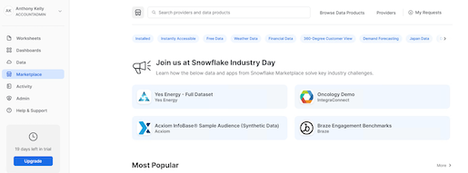

- Here search for <b>“Account Payable Analytics”</b> from the search bar and you should be able to see the “Account Payable Analytics” APP by NTT DATA:

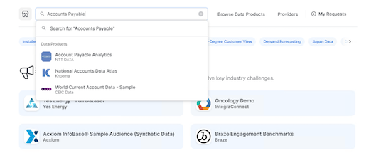

- You will be presented with the app’s details. Read through the APP information and Click on <b>‘Get’:</b>

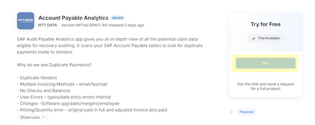

- Provide an Application Name (the default name being “Account_Payable_Analytics”), and a warehouse. Click on the blue <b>‘Get’</b> button:

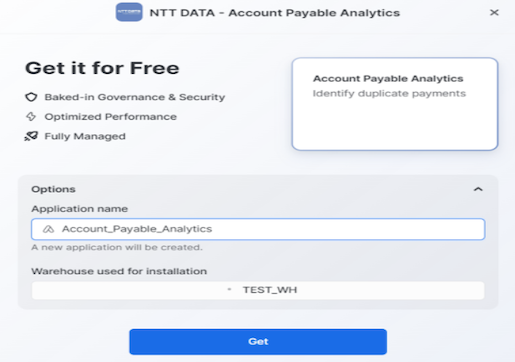

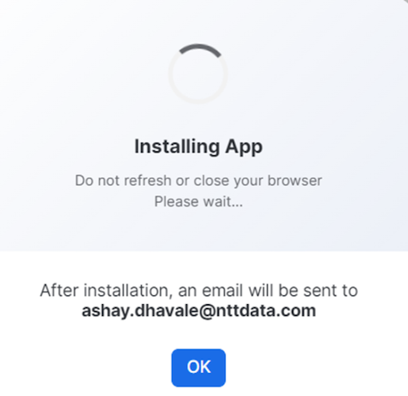

- Once installed an email will be sent to your registered email id. <b>Do not launch the APP yet</b>. The APP needs a few permissions before we can start using it.
- Copy-Paste the below SQL commands into an SQL worksheet. Replace: 
  - <APP_NAME> with the Application Name you provided in Step #4 above (the default name being “Account_Payable_Analytics”)
  - <AP_Database> with the database name where AP data got loaded. In this lab, we ingested the data via fivetran into the PC_FIVETRAN_DB database
  - <AP_Schema> with the schema name where the AP data got loaded. Depending on the destination prefix you assigned in Fivetran (Section 3::Step 7), the schema name will vary for you.
  - Execute all statements (select all, ctrl/cmd+enter)

<i><b>GRANT IMPORTED PRIVILEGES ON DATABASE snowflake TO APPLICATION <APP_NAME>;
GRANT APPLICATION ROLE SAP_APP to ROLE ACCOUNTADMIN;
GRANT EXECUTE TASK ON ACCOUNT TO APPLICATION  <APP_NAME>;
GRANT EXECUTE MANAGED TASK ON ACCOUNT TO APPLICATION <APP_NAME>; 
GRANT USAGE ON DATABASE <AP_Database> TO APPLICATION <APP_NAME>;
GRANT USAGE ON SCHEMA <AP_Database>.<AP_Schema> TO APPLICATION <APP_NAME>;
GRANT SELECT ON ALL TABLES IN SCHEMA <AP Database>.<AP_Schema> TO APPLICATION <APP_NAME>;
GRANT SELECT ON ALL VIEWS IN SCHEMA <AP Database>.<AP_Schema> TO APPLICATION <APP_NAME>;</i></b>

- Once installed, launch the app by going in the <b>Apps</b> tab on the left panel, then clicking on the app name:

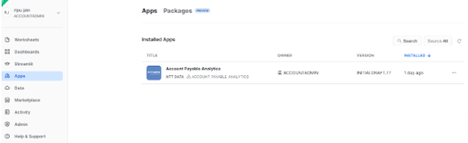

<!-- ------------------------ -->
## Use the NTT DATA app to identify AP Duplicates
Duration: 1

- When you launch the APP for the very first time, you should see a message like below.

- The APP runs a task in the background to fetch database and table details from the Snowflake views for faster processing

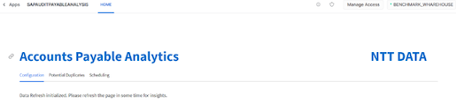

- When you refresh the page after a couple of seconds, you will be presented with a page as below. Here you select the <b>‘Audit Start Date’</b> as the start of the Audit Period. Audit period is the date for how far back in time should you be looking at the data to find the potential duplicate payment records. Typically these are 3 years, but you can choose a value to suit your use case.

- Next you choose the database and its corresponding schema where the SAP Accounts Payable data is located. Chose the database (PC_FIVETRAN_DB)  and schema we created above and hit “Fetch Tables”:

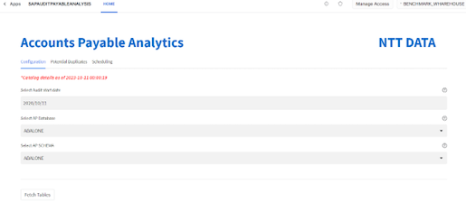

- This will automatically populate all the tables based on their description as below. Depending on your environment, you may be using different table names. You can choose the corresponding tables from the drop down, based on the description. Please note that the table column names and data types should match what has been published in the readme file. If not, you can create views on top of the data to match the expected column names and data types:

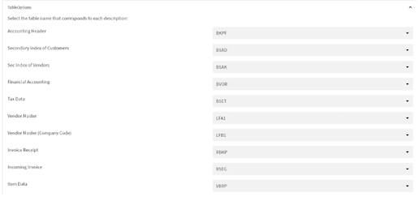

- Once the table names are selected, hit the <b>‘Submit’</b> button. This sends the data for processing. You should see a confirmation message as follows:

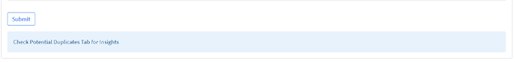

-  Once the processing is complete, you should see a confirmation message as follows:

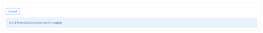

- Click on the ‘Potential Duplicates’ Tab to view the duplicate claims and related metrics.

- Here you will first see the metrics related to total number of potential duplicate claims, the potential amount which can be recovered once these claims are processed and both of these metrics as a percentage of total number of records processed as follows:

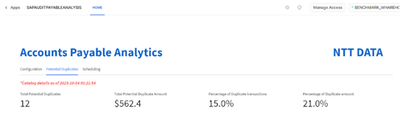

- We also see a quick distribution of Vendors by their total claim amounts. This helps audit teams to identify vendors who have a higher percentage of potential claims streamline the process for these vendors to avoid potential duplicates in future:

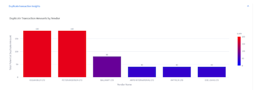

- We can also see distribution of claims by Invoice date which can help Audit teams identify the possible cause of these erroneous transactions based on the date range:

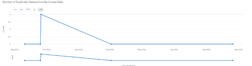

- Finally we see the actual potential claim details by Claim types here:

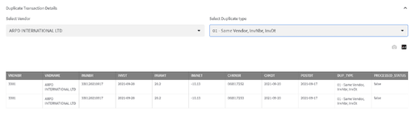

- The audit teams can work with these potential claim details for further recovery processing

- All the catalog details can be refreshed at the frequency of your choosing to ensure optimal performance. Use [CRON](https://cloud.google.com/scheduler/docs/configuring/cron-job-schedules) conventions for scheduling:

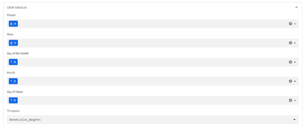

- It’s recommended that you suspend the refresh task if you do not intend to keep changing your source database and schemas to save on snowflake credits.

<!-- ------------------------ -->
## Conclusion and Next Steps
Duration: 2

- The app showcases only a couple of permutations and combinations of ways to identify duplicate payments. There are at least a dozen more and we can help include them in the app depending on the P2P cycle that your organization runs. Reach out to snowflakemarketplace@nttdata.com if you would like all the permutation and combinations implemented for your organization.

