author: Marc Henderson
id: application-control-framework
categories: snowflake-site:taxonomy/solution-center/certification/quickstart, snowflake-site:taxonomy/solution-center/certification/certified-solution, snowflake-site:taxonomy/solution-center/includes/architecture, snowflake-site:taxonomy/product/applications-and-collaboration, snowflake-site:taxonomy/snowflake-feature/build, snowflake-site:taxonomy/snowflake-feature/native-apps
language: en
summary: Implement application control frameworks in Snowflake for secure Native App development, testing, and production deployment.
environments: web
status: Published 
feedback link: https://github.com/Snowflake-Labs/sfguides/issues

# Getting Started with the Application Control Framework (ACF)
<!-- ------------------------ -->
## Overview 

This guide will show you how to deploy the ACF and build a demo Native App with controls and limits.

The ACF is an accelerator, allowing you to easily integrate your existing Snowflake application logic into a controllable, auditable Native App. It gives you the ability to dynamically control what logic, functionality, AI/ML, and/or data your consumers receive using rules implemented at either the record or query level, ensuring consumers do not gain access to proprietary information. Once your Native App is installed, the ACF will track and log each consumer’s usage and send that data back to you in near real-time. This allows you to quickly spot any usage or setup issues and rectify them immediately.

The rest of this Snowflake guide walks you through deploying the ACF and demo data/application logic, setting the Native App Limits, listing the demo Native App, and using the app, as a consumer.

### Prerequisites
- Familiarity with SQL, SnowSQL, Native Apps, Event Tables, and Streamlit

### What You’ll Learn 
- How to create an Event Account
- How to use the ACF Streamlit App (App Control Manager) to set Native App limits and which functionality consumers can access
- How to build and list a demo Native App, using the ACF
- How events are collected and used to update consumer metadata (i.e. the number of records processed)

### What You’ll Need 
- [SnowSQL](https://docs.snowflake.com/en/user-guide/snowsql) Installed 
- An Integrated Development Environment (IDE) Installed.  [VSCode](https://code.visualstudio.com/download) is recommended.
- Three (3) Snowflake accounts, each with ```ACCOUNTADMIN``` privileges (ideally in the same cloud/region)
  - One account will serve as the main account, where the ACF is deployed
  - One account will serve as an event account, where consumer events from the Native Apps are shared to.
    - The event account uses the Listing API, which is in Public Preview (PuPr).  Visit https://other-docs.snowflake.com/en/progaccess/listing-progaccess-about for more information.
    - Once this account is created, it will be set as the event account for the cloud region, by executing the following in the Snowflake Org account, as ```ORGADMIN```
    - ```CALL SYSTEM$SET_EVENT_SHARING_ACCOUNT_FOR_REGION('<REGION>', 'PUBLIC', '<ACCOUNT_NAME>');```
      - The account region can be found by executing ```SELECT CURRENT_REGION();```
      - The account name can be found by executing ```SELECT CURRENT_ACCOUNT_NAME();```
  - One account will serve as a consumer account, to install the demo Native App.

### What You’ll Build 
- A Native App that tracks consumer usage and enforces the limits set in the ACF.

<!-- ------------------------ -->
## Downloading the Code

The code used in this guide is hosted in github. You can download the code as a ZIP from [GitHub](https://github.com/Snowflake-Labs/sfguide-application-control-framework/archive/refs/heads/main.zip) or use the following git command to clone the repository.

```bash
git clone https://github.com/Snowflake-Labs/sfguide-application-control-framework.git
```

After downloading you will have a folder ```sfguide-application-control-framework``` containing all the code needed to deploy the ACF. Open the folder in VSCode to review the project.

## Event Account Setup

The first step is to set up an event account for each region the native app will be deployed.  The script referenced below creates an event table (if one has not already been created), streams, tasks, and data listings to share consumer native app events from the event account to the ACF (main) account.

#### Prerequisites

The event account must have been created for each region the native app will be deployed, along with setting each account as the event account for the region. Each event account must be enrolled in the Listing API Private Preview.  Please see the **What You'll Need section for more details.

#### Script Execution

1. The ACF code project includes the ```config/config_events_aws_us_west_2.txt``` file for the event account setup. Update this file, replacing the values in the config file accordingly.  Rename the config file, replacing ```aws_us_west_2```, with your account's region.

##### Configuration Parameters
  - **DIR** - the URI where the ```application_control_framework``` root directory resides on the provider’s local machine.
    - **NOTE:**  The URI formatting differs depending on the provider’s local operating system:
      - Linux/MacOS:
        - The path must include the initial forward slash in the path (e.g. ```/Users/mhenderson/Documents/GitHub```).
        - If the directory path and/or filename includes special characters, the entire URI must be enclosed in single quotation marks.
      - Windows:
        - You must include the drive and backslash in the path (e.g. ```C:\Users\mhenderson\Documents\GitHub```).
        - If the directory path and/or filename includes special characters, the entire file URI must be enclosed in single quotes. Note that the separator character is a forward slash (/) in enclosed URIs (e.g. ```C:\Users\mhenderson\Documents\GitHub Repos``` for a path in Windows that includes a directory named GitHub Repos).
  - **ORG_NAME** - the organization provider’s Snowflake account belongs (this can be found by executing the ```SELECT CURRENT_ORGANIZATION_NAME()``` command)
    - **NOTE:**  only required for the config_events.txt file.
  - **ACF_ACCOUNT_NAME** - the name of the provider's Snowflake where the ACF will be deployed (this can be found by executing the ```SELECT CURRENT_ACCOUNT_NAME()``` command).
    - **NOTE:**  only required for the config_events.txt file.
  - **ACF_ACCOUNT_LOCATOR** - the account identifier for provider's Snowflake account where the ACF will be deployed (this can be found by executing the ```SELECT CURRENT_ACCOUNT()``` command).
  - **EVENTS_ACCOUNT_LOCATOR** - the account identifier for provider's Snowflake account where ACF events will be collected. (this can be found by executing the ```SELECT CURRENT_ACCOUNT()``` command).
    - **NOTE:**  only required for the config_events.txt file.
  - **APP_CODE** - an abbreviated representation for the name of the app. 
    - **NOTE:** for this QuickStart, please use **SDE**.

**Example Config:**
```bash
DIR=/Users/mhenderson/Documents/GitHub
ORG_NAME=SFPSCOGS
ACF_ACCOUNT_NAME=PS_WLS_COLLAB_PROVIDER
ACF_ACCOUNT_LOCATOR=CDB65519
EVENTS_ACCOUNT_LOCATOR=KDB59543
APP_CODE=SDE
```


2. Using **SnowSQL**, execute the script to set up the event account:  
```bash 
./event_acct/setup/setup.sh config/config_events_<REGION>.txt
```

Where **\<REGION\>** = the cloud/region where the event account is being configured.

<!-- ------------------------ -->

## ACF Account Setup

The second step is to deploy the ACF to the main account.  This account is different from an event account and will be where the ACF will reside and be managed.

The ACF includes all of the objects required to manage ACF functionality.  In addition, this script also deploys the App Control Manager, the Streamlit UI that is used to perform such actions as define custom controls and rules, create app package versions, onboard consumers, etc.

#### Prerequisites

Complete the previous step, **Event Account Setup**.

#### Script Execution

1. The ACF code project includes the ```config/config_acf.txt``` file for the ACF account setup. Update this file, replacing the values in the config file accordingly.

##### Configuration Parameters
  - **DIR** - the URI where the ```application_control_framework``` root directory resides on the provider’s local machine.
    - **NOTE:**  The URI formatting differs depending on the provider’s local operating system:
      - Linux/MacOS:
        - The path must include the initial forward slash in the path (e.g. /Users/mhenderson/Documents/GitHub.
        - If the directory path and/or filename includes special characters, the entire URI must be enclosed in single quotation marks.
      - Windows:
        - You must include the drive and backslash in the path (e.g. C:\Users\mhenderson\Documents\GitHub).
        - If the directory path and/or filename includes special characters, the entire file URI must be enclosed in single quotes. Note that the separator character is a forward slash (/) in enclosed URIs (e.g. 'C:\Users\mhenderson\Documents\GitHub Repos' for a path in Windows that includes a directory named GitHub Repos).
  - **ACF_ACCOUNT_LOCATOR** - the account identifier for provider's Snowflake account where the ACF will be deployed (this can be found by executing the ```SELECT CURRENT_ACCOUNT()``` command).
  - **APP_CODE** - an abbreviated representation for the name of the app. 
    - **NOTE:** for this QuickStart, please use **SDE**.

**Example Config:**
```bash
DIR=/Users/mhenderson/Documents/GitHub
ACF_ACCOUNT_LOCATOR=CDB65519
APP_CODE=SDE
```

2. Using **SnowSQL**, execute the script to set up the ACF account:  

```bash
./main_acct/setup/setup.sh config/config_acf.txt
```

<!-- ------------------------ -->

## Mount the Event Shares

Once the ACF has been deployed, the shares from the event account(s) can be mounted in the ACF account.  The following step details how to mount the share from each event account set up from.

#### Prerequisites

Complete the previous step, **ACF Account Setup**.

#### Instructions

1. In the ACF account, log into **Snowsight**.
2. Once logged in, if not at the Snowsight home screen, click the **Back** button, in the top left area of the UI, to open the left navigation menu.

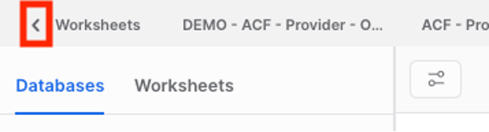

3. Switch to the **P\_SDE\_ACF\_ADMIN** role, by clicking the drop-down in the bottom left area of the UI, then hovering over the **Switch Role** menu item.
4. Click **Data Products**, then **Private Sharing**, then **Get**.

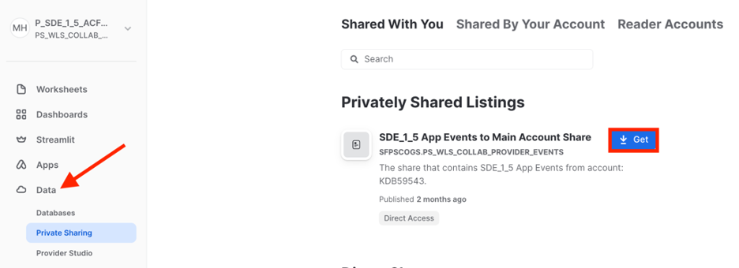

5. Click **Get** (**NOTE:** do not rename the database).

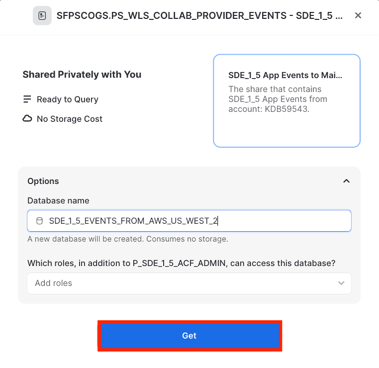

6. Create a stream and tasks to stream events from each mounted event database to the EVENTS_MASTER table.

```sql
USE ROLE P_SDE_ACF_ADMIN;
USE WAREHOUSE P_SDE_ACF_WH;
CALL P_SDE_ACF_DB.EVENTS.STREAM_TO_EVENT_MASTER(TO_ARRAY('<EVENT_DBS>'));
```

**\<EVENT\_DBS\>** = the event database created in **Step 5**.

## Dev Environment Setup

The ACF also comes with a set of scripts that creates the provider’s dev environment.  This dev environment includes the application logic functions and/or procedures to be included in the Native App.  In addition, the dev environment also includes the objects required to test the application functions/procedures locally, to ensure desired functionality, before building the native app.

#### Prerequisites

Complete the previous step, **Mount the Event Shares**.

#### Script Execution

1. Using **SnowSQL**, execute the script to set up the dev environment in the ACF account:  

```bash
./main_acct/dev_env/setup/setup.sh config/config_acf.txt
```

<!-- ------------------------ -->

## Demo App Setup 

The ACF also comes with a set of scripts that creates objects in the provider’s dev environment to build a demo data enrichment app.  The demo app includes sample source graph data, a function that can be shared with the consumer, and a stored procedure that enriches consumer data with data from the source graph.

#### Prerequisites

Complete the previous step, **Dev Environment Setup**.

#### Script Execution

1. Using **SnowSQL**, execute the script to set up the dev environment in the ACF account:  

```bash
./main_acct/demo_app/setup/setup.sh config/config_acf.txt
```

<!-- ------------------------ -->

## App Control Manager

The ACF includes the App Control Manager, a Streamlit UI available in the provider account. The App Control Manager allows the provider to easily build and manage an app built on the ACF, manage consumers, and remove the ACF if/when desired.

The App Control Manager can be accessed via the following steps:

1. In the ACF account, log into **Snowsight**.
2. Once logged in, if not at the Snowsight home screen, click the **Back** button, in the top left area of the UI, to open the left navigation menu.


3. Switch to the **P\_SDE\_ACF\_ADMIN** role, by clicking the drop-down in the bottom left area of the UI, then hovering over the **Switch Role** menu item.

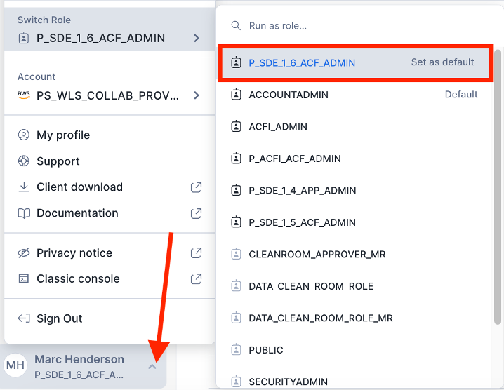

4. Click **Projects** >> **Streamlit**, then **P\_SDE\_APP\_CONTROL\_MANAGER**.

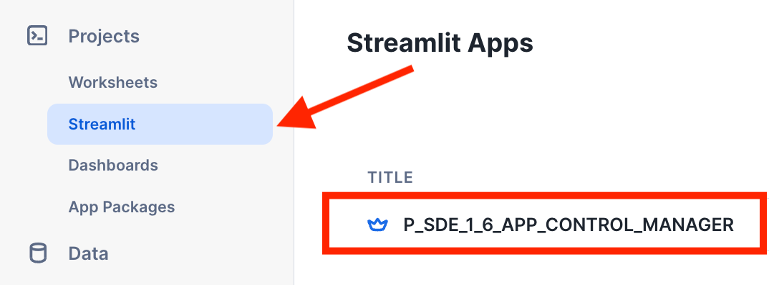

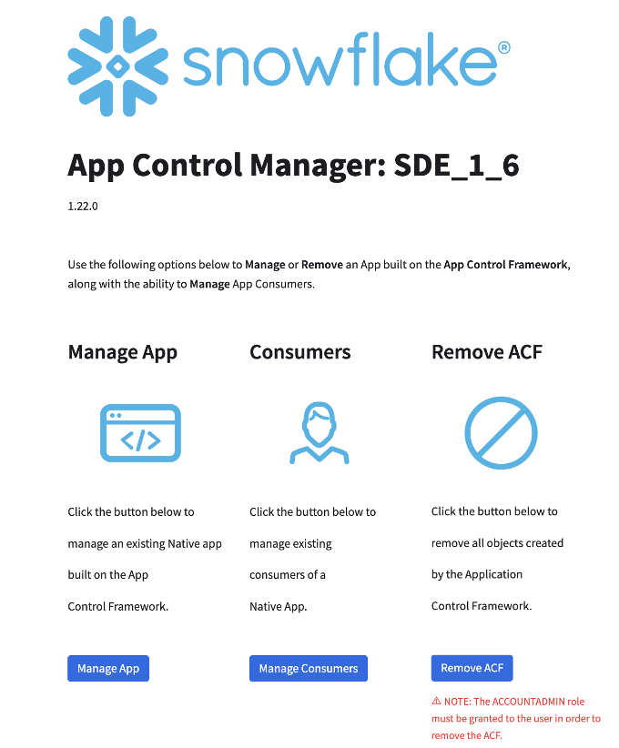


<!-- ------------------------ -->

## Build Demo Native App

The demo app is a simple data enrichment app that enriches a consumer’s dataset with attributes from the provider’s dataset, when the records have the same email address.

### Create the Application Package
The native app’s application package consists of views of the native app’s source data, along with views of the required tables used to enforce the rules defined in the ACF and collect logs/metrics. In this demo, an application package will be created:

1. In the App Control Manager, click **Manage App** >> **App Package** >> **Create**.

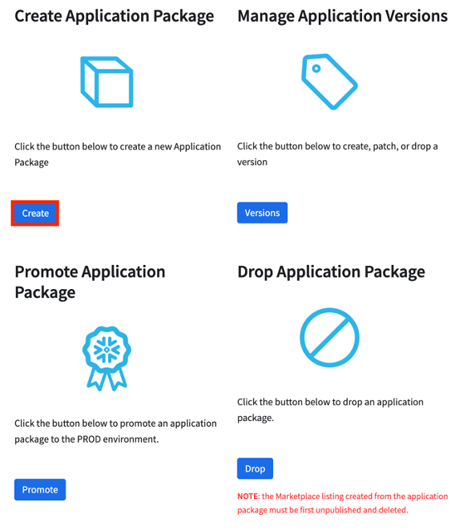

2. Enter **SDE\_DEMO** in the Application Package Name text field. This name will be prefixed by: ***P\_SDE\_APP\_PKG\_***.
3. Select the **P\_SDE\_SOURCE\_DB\_DEV** database from the Select Database drop-down. 
4. Select the **DATA** schema from the Select Schema drop-down
5. Select the **P\_SDE\_SOURCE\_DB\_DEV\.DATA\.CUSTOMER** table from the Select Table(s)/View(s) drop-down. 
6. Click **Create**.

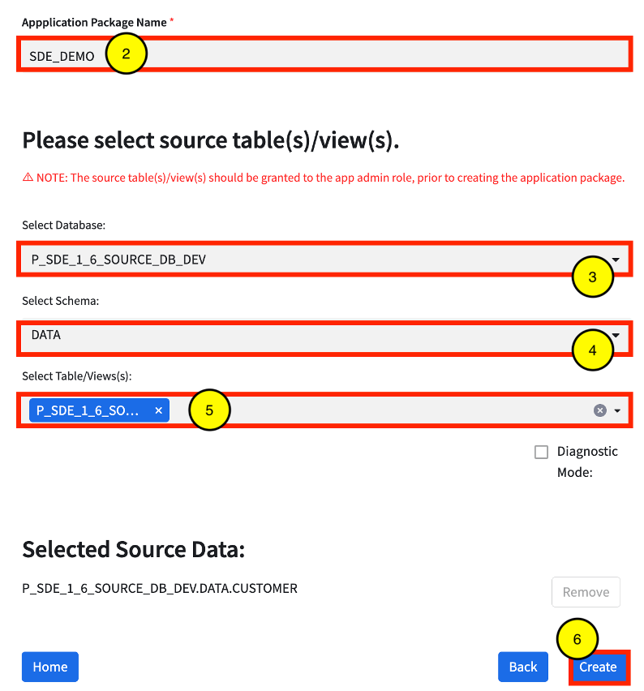

### Create a Version for the Application Package
Once the application package is created, the application functions/procedures are tied to the application package by creating a version and a patch. In this demo, the App Control Manager will be used to create a new version and patch.

1. In the App Control Manager, click **Manage App** >> **App Package** >> **Versions**.

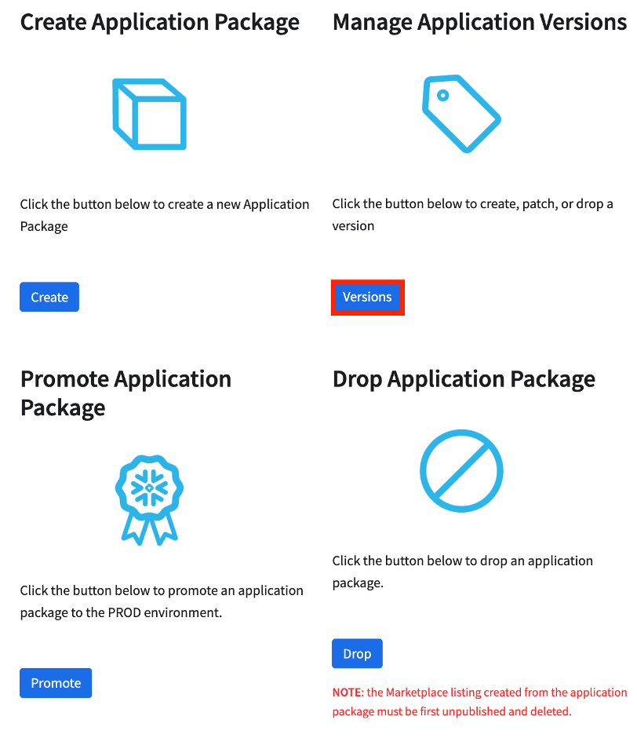

2. Select **P\_SDE\_APP\_PKG\_SDE\_DEMO** from the Select Application Package drop-down.
3. Select **CREATE** from the Create, Patch, or Drop Version drop-down.
4. Enter a **v1\_0\_0** in the Version Name field.

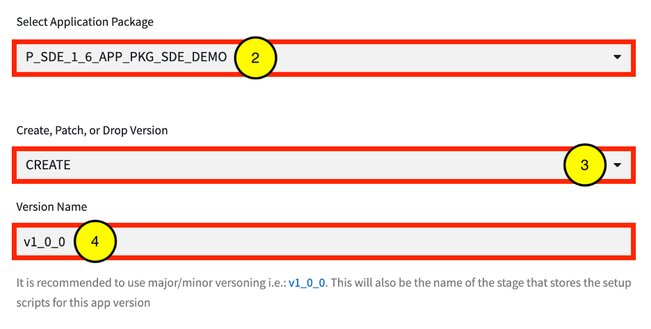

5. For this demo, select **FREE** from the Select App Mode drop-down
6. Select **Y** from the Enforce Limits drop-down. By default, limits should be enforced, but this can be set to N if limit enforcement should be turned off (i.e. during testing).
7. Select **DEV** from the Environment drop-downs to pull the **Streamlit** and **template** files from the dev environment.

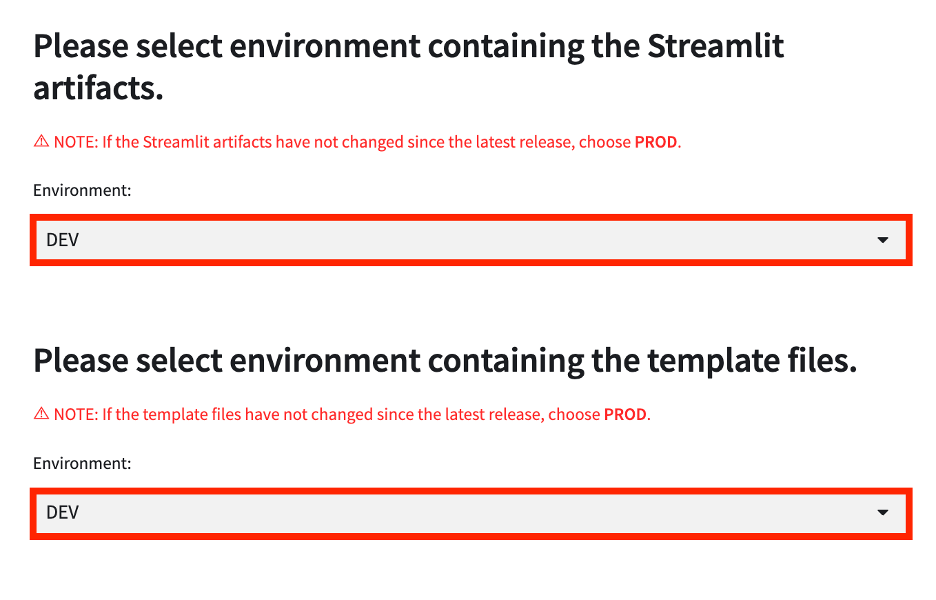

8. Select the **P\_SDE\_SOURCE\_DB\_DEV** database from the Select Database drop-down. 
9. Select the **FUNCS\_APP** schema from the Select Schema drop-down. 
10. Select the **P\_SDE\_SOURCE\_DB\_DEV\.FUNCS\_APP\.JS\_FACTORIAL\(FLOAT\)** function from the Select Function(s) drop-down. 
11. Select the **Accessible** checkbox next to the function under Selected Functions to make the function accessible to the consumer.

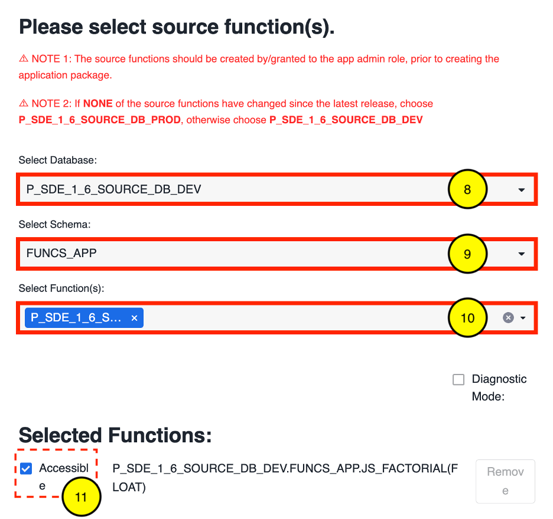

12. Select the **P\_SDE\_SOURCE\_DB\_DEV** database from the Select Database drop-down. 
13. Select the **PROCS\_APP** schema from the Select Schema drop-down. 
14. Select the **P\_SDE\_SOURCE\_DB\_DEV\.PROCS\_APP\.ENRICH\(VARCHAR\,VARCHAR\,VARCHAR\,VARCHAR\)** procedure from the Select Procedure(s) drop-down. 
15. Select the **Input Table** checkbox next to the procedure under Selected Procedures.

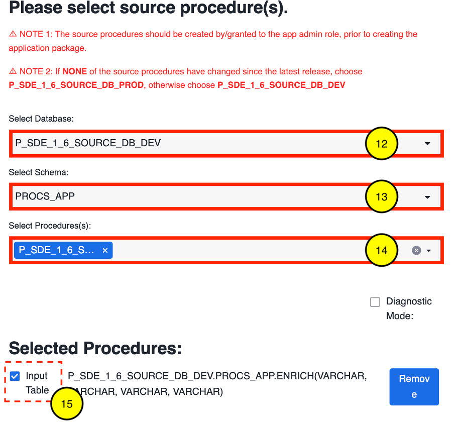

16. Click the **CREATE** button.

### Release Patch
To grant consumers access to the latest version/patch, the provider must create a release for the application package. The following steps detail how to release an application package’s version/patch:

1. In Snowsight, click **Projects** >> **App Packages**. Select the **P\_SDE\_APP\_PKG\_SDE\_DEMO** application package created in the previous section.

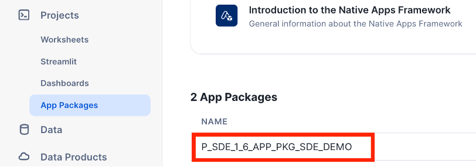

2. Click **Release Patch**.

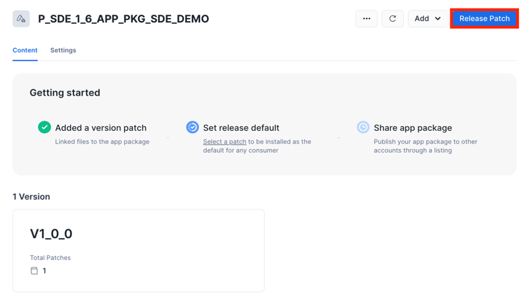

3. Select **V1\_0\_0 patch 0** from the Patch to release drop-down. 
4. Choose **Set this patch to default**.
5. Click **Save**.

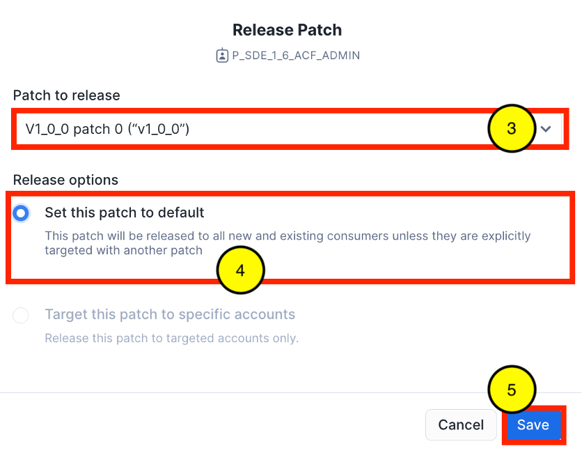

<!-- ------------------------ -->

## Create the Native App Listing

Once the application package has a released version and patch, the native app is ready to be privately listed. For instructions on how to create a Private Listing for the native app and add the demo consumer account, visit the **Create a Listing for Your Application** section: [https://docs.snowflake.com/en/developer-guide/native-apps/tutorials/getting-started-tutorial#publish-and-install-your-application](https://docs.snowflake.com/en/developer-guide/native-apps/tutorials/getting-started-tutorial#publish-and-install-your-application).

<!-- ------------------------ -->

## Install the Native App in the Consumer Account

In the demo consumer account added to the listing created in **Create the Native App Listing** section, install the native app available from the private listing. For instructions on how to install a native app, visit the **Install the Application** section [https://docs.snowflake.com/en/developer-guide/native-apps/tutorials/getting-started-tutorial#id6](https://docs.snowflake.com/en/developer-guide/native-apps/tutorials/getting-started-tutorial#id6).

<!-- ------------------------ -->

## Run the Scripts from the Native App’s Readme

With each installation, the consumer is barred from using the native app until the consumer has executed a series of commands, including sharing events with the provider. These commands are located in the native app’s Readme.

1. In Snowsight, click **Data Products** >> **Apps**, under the Installed Apps section, click the native app installed in the previous section.

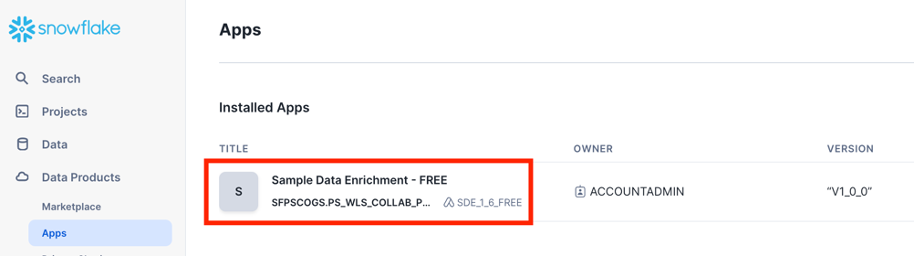

2. Once loaded, the Streamlit UI will display the following error message:

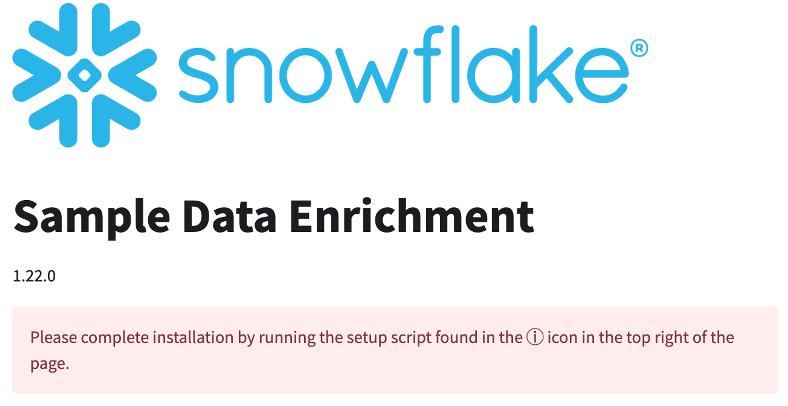

3. Click the <!--**ⓘ**--> icon in the top right of the page.

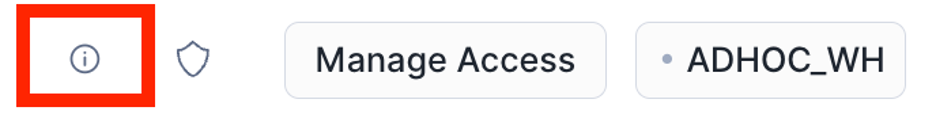

4. Make note of the **NOTES** section of the Readme. Hover over and click the **Open in Worksheets** button.

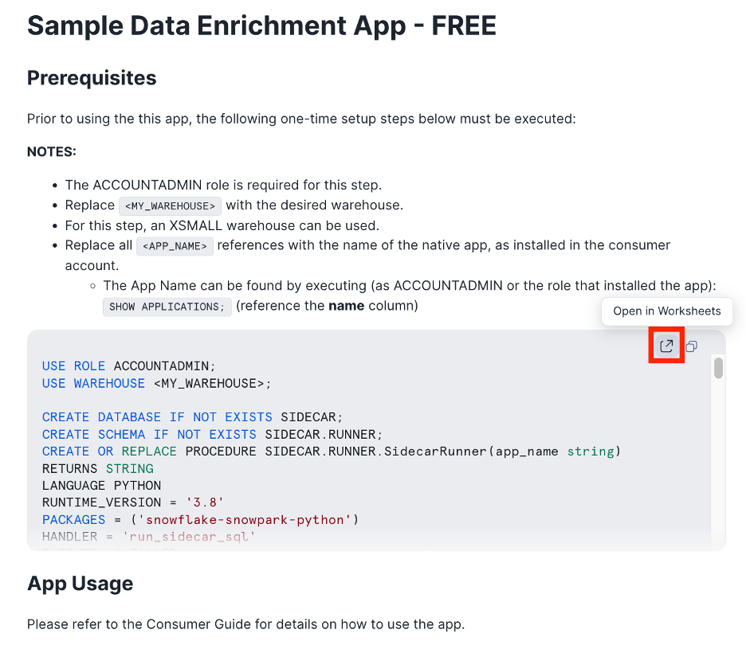

5. In the new worksheet, replace the macros specified in the Readme with the appropriate values. Once the macros are replaced, **run all commands**.
6. Open the native app. The Streamlit UI will display the warning message below. It will take a few minutes for the native app to be enabled.

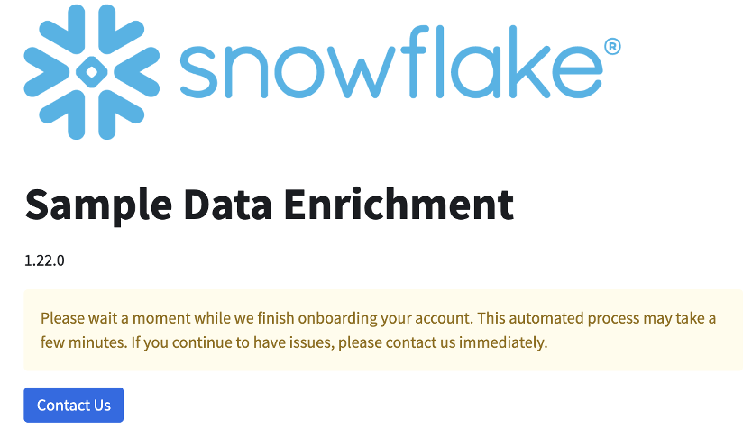

<!-- ------------------------ -->

## App Usage

Once the native app has been enabled, the consumer can now use the app to enrich data. Sample data was created during executing the Readme commands. The following steps detail how to use the app to enrich data:

1. Open the app. Once the app is enabled, the warning message is removed.
2. Click **Select Table**. Since this is the first time using the app, it needs to be granted privileges to the sample data table.

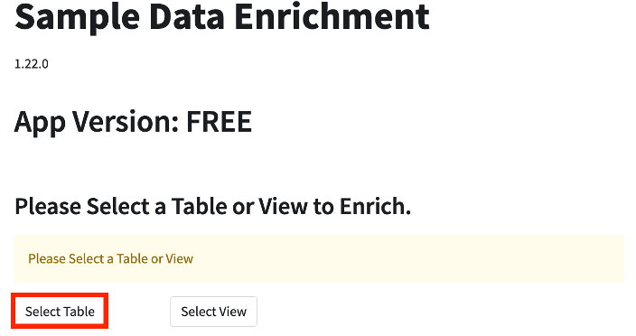

3. The app’s security window will appear. Click ** Select Data**.

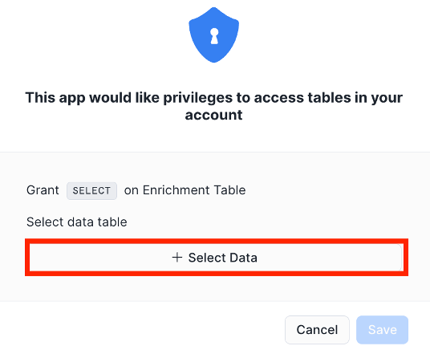

4. Select **C\_SDE\_HELPER\_DB\.SOURCE\.CUSTOMERS**, then click **Done**.

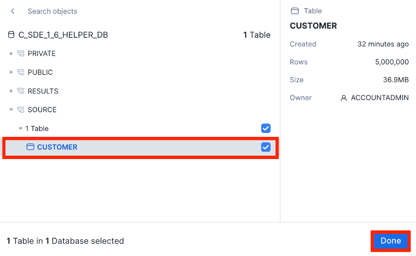

5. In the security window, click **Save**.
6. Verify that the **CUSTOMER** table is selected from the Table drop-down.
7. Select **EMAIL** from the Match Key drop-down.
8. Enter a **name** for the results table in the Please enter a name for the Results Table field.
9. Click **Run**.

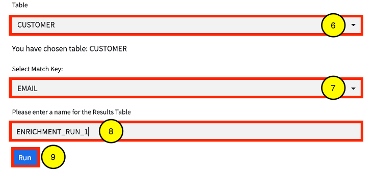

10. Once complete, the following message will briefly appear. In addition a new entry will be added to the Run History section.

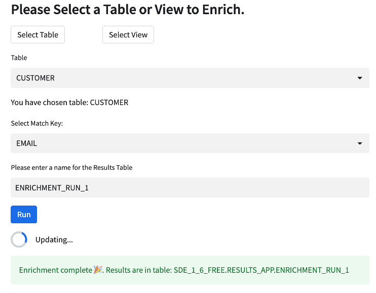

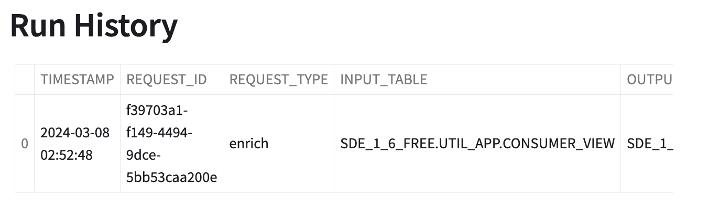

11. If desired, the output table can be inspected. In a worksheet, execute the following command: 
```sql
SELECT * FROM <APP_NAME>.RESULTS_APP.<TABLE_NAME> WHERE email IS NOT NULL LIMIT 100;
```

**NOTES:**
  - **\<APP\_NAME\>** = the name of the app
  - **\<TABLE\_NAME\>** = the name of the results table entered in.

<!-- ------------------------ -->

## Additional Test Scenarios

### Reach the Five Requests Limit Then Increase the Limit
By default, the ACF sets limits of the FREE version of the app to five requests. Once the limit is reached, the app is no longer usable, until the limit is increased by the provider in the App Control Manager.

#### Attempt to Exceed Limit
In the app, make five requests to reach the limit, then attempt a sixth, which will fail. 


#### Increase the Limit

Once the limit is reached, increase the consumer’s request limit in the App Control Manager. 

1. In the App Control Manager, click **Manage Consumers** >> **Manage**.
2. Select the **Consumer** from the Select Consumer drop-down. The consumer name will have a **FREE\_** prefix, followed by the consumer’s Snowflake account name.
3. Select the **limit** control from the Select Consumer Controls to Update drop-down
4. In the **New Value** field, enter **10**, then press Enter.
5. Click **Update**.

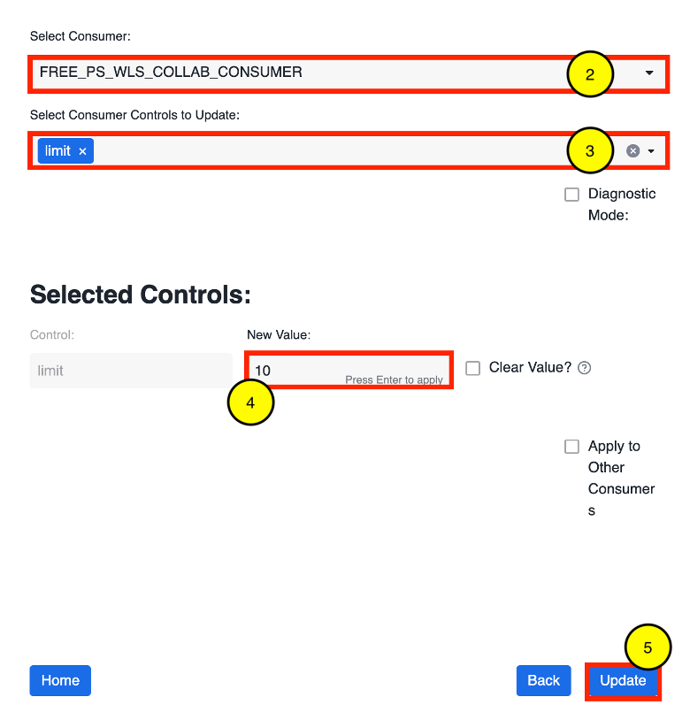

#### Make a New Request

In the native app in the consumer’s account, attempt to make a new request.  Verify that the request is allowed and is successful.

### Consumer Usage of the App is Blocked, when Disabled

The App Control Manager allows the provider to control a consumer’s access. 

#### Disable the Consumer

In the App Control Manager, disable the consumer. 

1. In the App Control Manager, click **Manage Consumers** >> **Manage**.
2.  Select the **Consumer** from the Select Consumer drop-down. The consumer name will have a **FREE\_** prefix, followed by the consumer’s Snowflake account name.
3. Select the **enabled** control from the Select Consumer Controls to Update drop-down
4. In the **New Value** field, enter **N**, then press Enter.
5. Click **Update**.

#### Attempt to Use the Native App

In the consumer account, relaunch the app and note that the consumer’s access has been revoked. 

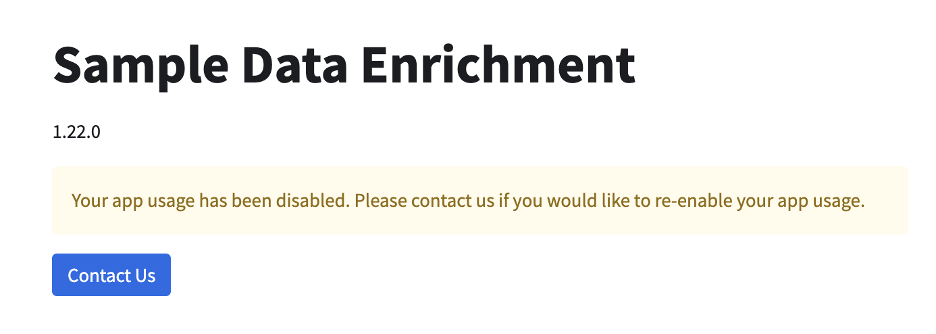

#### Re-enable the Consumer

Repeat the steps in the **Disable the Consumer** section, but set the enabled value back to **Y**.  Then relaunch the app in the consumer’s account to verify that usage has been restored.


1. In the App Control Manager, click **Manage Consumers** >> **Manage**.
2.  Select the **Consumer** from the Select Consumer drop-down. The consumer name will have a **FREE\_** prefix, followed by the consumer’s Snowflake account name.
3. Select the **enabled** control from the Select Consumer Controls to Update drop-down
4. In the **New Value** field, enter **N**, then press Enter.
5. Click **Update**.


<!-- ------------------------ -->

## Conclusion And Resources

You've performed the following:
- Successfully built and deployed a Native App with consumer controls and limits, set via the ACF.
- Verified that the limits are enforced when the consumer hits the limits set.  
- Updated the limits and verified that they are applied for the consumer in real-time.
- Disabled the consumer in the ACF and verified that the consumer cannot use the app.

To get more comfortable with this solution, continue to toggle the limits set for the consumer, add additional functionality to the native app and set the allowed_procs values accordinglt.

### What we've covered
- How to create an Event Account
- How to use the ACF Streamlit App (App Control Manager) to set Native App limits and which functionality consumers can access
- How to build and list a demo Native App, using the ACF
- How to update consumer metadata and verify that the changes are applied immediately.

###Resources
- [Fork repo on Github](https://github.com/Snowflake-Labs/sfguide-application-control-framework/tree/main)
- [Download Reference Architecture](/content/dam/snowflake-site/developers/2024/05/Application-Control-Framework-Reference-Architecture.pdf)
- [Explore Emerging Solutions Toolbox](https://emerging-solutions-toolbox.streamlit.app/)
- [Read blog](https://medium.com/snowflake/manage-how-consumers-use-your-native-app-d8eeb4af8f5c)
- [Watch the Demo](https://youtu.be/gZv-EkZsOAk?si=Mb1RSYIGQfuiLPip)
