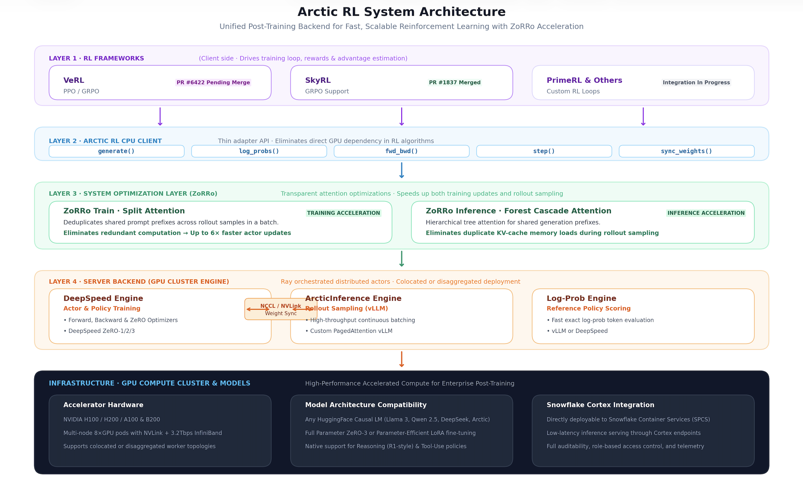
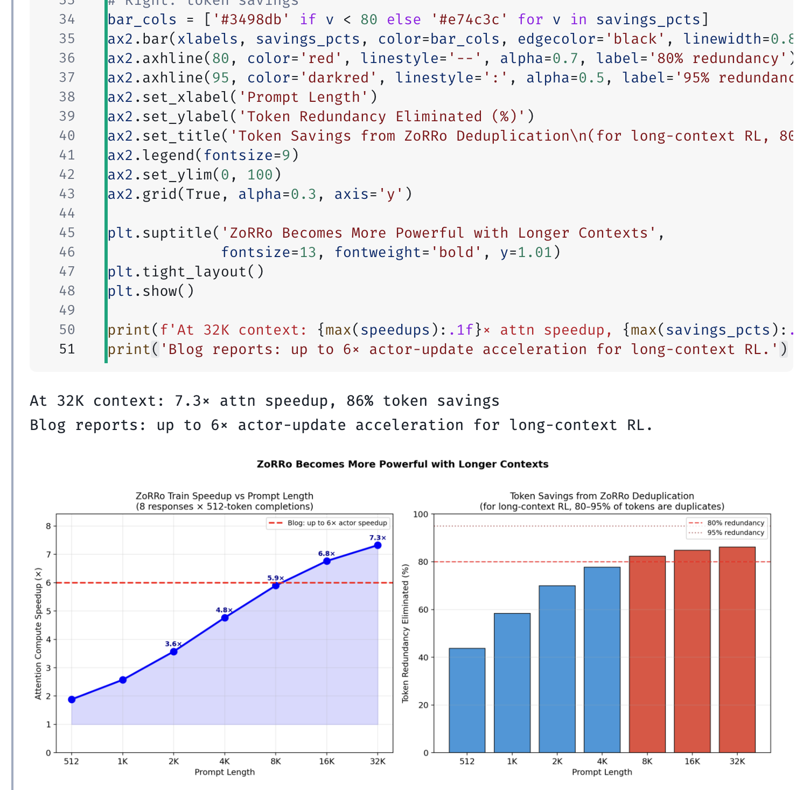

author: Priya Joseph
id: arctic-rl-unified-post-training-backend
categories: snowflake-site:taxonomy/solution-center/certification/quickstart, snowflake-site:taxonomy/product/ai, snowflake-site:taxonomy/snowflake-feature/cortex-llm-functions, snowflake-site:taxonomy/snowflake-feature/snowpark-container-services
summary: Accelerate LLM reinforcement learning post-training with Snowflake Arctic RL unified backend [VeRL, SkyRL, PrimeRL] and ZoRRo optimizations.
environments: web
status: Published
feedback link: https://github.com/Snowflake-Labs/sfquickstarts/issues
language: en

# Accelerate Reinforcement Learning with Snowflake Arctic RL Unified Backend [VeRL, SkyRL, PrimeRL] & ZoRRo
<!-- ------------------------ -->
## Overview
Duration: 5

Reinforcement learning from human feedback (RLHF) and reinforcement learning with verifiable rewards (RLVR) have become essential for aligning frontier models, training reasoning models (such as R1-style chains-of-thought), and mastering complex tasks like Text-to-SQL.

However, RL post-training algorithms (such as PPO and GRPO) explore policies by generating **$N$ candidate responses per prompt**. When prompts contain thousands of tokens—common in enterprise Retrieval-Augmented Generation (RAG) and database schemas—this creates extreme redundancy: **80% to 95% of processed tokens are exact duplicates**.

While every major LLM workload has converged on a unified backend (DeepSpeed/Megatron-LM for pre-training, vLLM/SGLang for inference), RL post-training previously lacked a standard systems layer. Each framework reimplemented GPU communication, sampling, and weight synchronization from scratch.

**Snowflake Arctic RL** closes this gap by providing an open-source, high-performance, modular backend with **ZoRRo (Zero Redundancy Rollouts)** acceleration.



### Key Architectural Layers

1. **Client-Side Frameworks (CPU)**: Integrates with modern RL algorithms (VeRL, SkyRL, PrimeRL) via a clean, 5-call thin adapter.
2. **Unified CPU Client**: Exposes simple RPC calls (`generate()`, `log_probs()`, `fwd_bwd()`, `step()`, `sync_weights()`), eliminating GPU cluster awareness in the RL training loop.
3. **ZoRRo System Optimization Layer**:
   - **ZoRRo Train (Split Attention)**: Deduplicates shared prompt tokens in actor updates, yielding up to **6× actor-update acceleration**.
   - **ZoRRo Inference (Forest Cascade Attention)**: Hierarchical tree attention during decode, eliminating redundant KV-cache reads across rollouts.
4. **Server Backend Engines (GPU Cluster)**: Combines DeepSpeed for training with ArcticInference (custom vLLM) for high-throughput rollout generation, backed by peer-to-peer NCCL/NVLink weight synchronization.
5. **Hardware & Compute Infrastructure**: Scales natively on NVIDIA multi-GPU clusters and Snowflake Container Services (SPCS).

### What You Will Learn
- How the decoupled client-server architecture of Arctic RL simplifies post-training.
- How ZoRRo Train and ZoRRo Inference eliminate token redundancy.
- How to configure VeRL and SkyRL to use Arctic RL with zero algorithmic code changes.
- How to evaluate and serve post-trained models using Snowflake Cortex.

### Prerequisites
- Familiarity with Python, PyTorch, and reinforcement learning basics (PPO / GRPO).
- An active Snowflake account with Snowpark Container Services (SPCS) and Cortex enabled.

<!-- ------------------------ -->
## The RL Efficiency Problem
Duration: 10

In traditional supervised fine-tuning (SFT), batches consist of independent `(prompt, response)` pairs. In RL post-training (such as GRPO or PPO), an actor generates $N$ rollouts for each prompt:

```text
Prompt A + Response 1 ──┐
Prompt A + Response 2 ──┤  ← Same prompt processed N times!
Prompt A + Response 3 ──┤     80–95% of tokens are duplicate calculations
...                     │
Prompt A + Response N ──┘
```

Because transformer attention scales quadratically ($O(n^2)$) with sequence length, recomputing attention over the same prompt $N$ times severely bottlenecks training.

### How Arctic RL Solves This

Arctic RL inverts the framework design:
- **Traditional RL:** Each framework owns both the policy optimization algorithm **and** the distributed GPU infrastructure.
- **Arctic RL:** The framework runs purely on CPU managing training loops and rewards, while Arctic RL orchestrates GPU execution, memory deduplication, and weight synchronization.

<!-- ------------------------ -->
## ZoRRo: Zero Redundancy Rollouts
Duration: 15

ZoRRo accelerates both the forward/backward training passes and rollout sampling:



### 1. ZoRRo Train (Split Attention)
During policy gradient updates (actor forward and backward passes), ZoRRo Train:
1. Identifies sequences that share an identical prompt prefix.
2. Compresses the batch so each unique prompt is processed once.
3. Performs **Split Attention** over the deduplicated sequence representation.
4. Unpacks per-response gradients and log-probabilities in exact mathematical equivalence to standard execution.

**Impact:** Up to **6× faster actor updates** and **67% reduction** in attention memory footprint.

### 2. ZoRRo Inference (Forest Cascade Attention)
During rollout generation:
- KV-cache blocks corresponding to shared prompt prefixes are stored once per prompt group.
- Forest Cascade Attention (FCA) splits attention evaluation into a shared-prefix pass and per-request suffix passes.
- Dramatically cuts memory bandwidth pressure during token decode.

<!-- ------------------------ -->
## Framework Integration (VeRL & SkyRL)
Duration: 15

Arctic RL integrates seamlessly into existing training recipes.

### Enabling in VeRL
In your VeRL YAML configuration, enable ZoRRo with config flags:

```yaml
actor_rollout_ref:
  model:
    path: Qwen/Qwen2.5-7B-Instruct
  actor:
    strategy: ds
    ds_worker_config:
      zorro_train:
        enable: true
  rollout:
    name: arctic_inference
    arctic_inference_config:
      use_fca: true
```

### Enabling in SkyRL
SkyRL integrates Arctic RL natively (PR #1837 merged):

```yaml
trainer:
  backend: arctic_rl
  zorro:
    train_dedup: true
    fca_inference: true
```

Neither framework requires algorithmic or model code modifications.

<!-- ------------------------ -->
## Snowflake Cortex & SPCS Deployment
Duration: 10

Once your policy is trained with Arctic RL, export the weights to a Snowflake internal stage and deploy to Snowpark Container Services (SPCS) or Cortex inference endpoints.

### Connecting to Snowflake with Snowpark

```python
from snowflake.snowpark.context import get_active_session

# Connect using the active session (works in Snowflake Notebooks or VS Code)
session = get_active_session()
print(f"Active Account: {session.get_current_account()} | User: {session.get_current_user()}")
```

### Serving and Querying Post-Trained Policies

```python
# Query post-trained models via Cortex AI_COMPLETE
response = session.sql("""
    SELECT AI_COMPLETE(
        'llama3.3-70b',
        'Analyze the trade-offs of using Split Attention in large-scale RLVR.'
    ) AS model_reasoning
""").to_pandas()

print(response['MODEL_REASONING'].iloc[0])
```

<!-- ------------------------ -->
## Conclusion & Next Steps
Duration: 5

### What You Learned
- **The RL Efficiency Bottleneck**: Why $N$-sample rollouts lead to massive token and KV-cache redundancy.
- **Unified Post-Training Architecture**: How Arctic RL decouples CPU policy loops from distributed GPU engines.
- **ZoRRo Acceleration**: How Split Attention and Forest Cascade Attention deliver up to **3.5× end-to-end iteration speedups**.
- **Seamless Framework Adoption**: How to activate Arctic RL in VeRL and SkyRL via declarative configuration.

### Related Resources
- [Snowflake AI Research Arctic Platform GitHub](https://github.com/Snowflake-AI-Research/Arctic-Platform)
- [Arctic RL Official Engineering Blog](https://www.snowflake.com/en/blog/engineering/arctic-rl-open-source-backend/)
- [Snowpark Container Services (SPCS) Documentation](https://docs.snowflake.com/en/developer-guide/snowpark-container-services/overview)
- [Snowflake Cortex LLM Functions](https://docs.snowflake.com/en/user-guide/snowflake-cortex/llm-functions)
